直播奥木染圣地巡礼
* * *
找不到镇楼的东西… 

  

1楼 | nbbllxx | 2014-08-27 07:22
* * *
火前留名
  

2楼 | 贴吧用户_03aJeQ2 | 2014-08-27 07:24
    
    2014-08-27 22:05 | blackanglia:
    > 
    2014-08-28 20:34 | Q弟侦探因番:
    > 挤一挤
    2015-01-14 12:21 | º◎Alex:
    > 挤一挤
    2015-06-29 09:21 | 我楼顶的都得s:
    > 火钳刘明
    2015-06-29 09:22 | nbbllxx:
    > 回复 我楼顶的都得s ：去年的帖子了
    2015-06-29 10:18 | 我楼顶的都得s:
    > 
    2015-08-04 05:15 | 贴吧用户_0EVCVWW:
    > B站里有啊
    2016-04-02 19:42 | 夏冰卍:
    > 16年前来留名
    2017-06-07 10:48 | 吧务食翔🌚:
    > 17年前来留名
    2018-07-08 12:23 | 💞春日野穹💌:
    > 18年前来留名
* * *
记得发共享照片哦
  

3楼 | 贴吧用户_03aJeQ2 | 2014-08-27 07:25
    
    2014-08-27 07:26 | nbbllxx:
    > 共享照片是什么
    2014-08-27 07:28 | 贴吧用户_03aJeQ2:
    > 回复 nbbllxx :就是拍照后存网盘共享呀～亲
    2014-08-27 07:29 | nbbllxx:
    > 回复 善良的tfuu ：嗯
    2014-10-29 16:28 | nbbllxx:
    > <http://yun.baidu.com/share/home?uk=2667936873>这里有所有图还没整理，前面不知为什么被吞掉了。。
    2014-10-29 17:45 | 贴吧用户_03aJeQ2:
    > 回复 nbbllxx :……应该是度娘抽了
* * *
奥木染在栃木県 足利市 桦崎町，过去的巴士一天只有四辆（最早8点40分），从JR足利过去还要先乘坐行道线JRバス。 
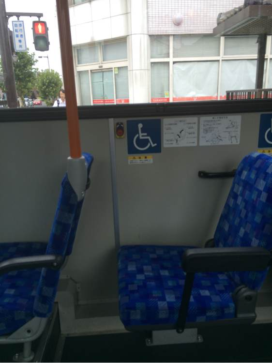
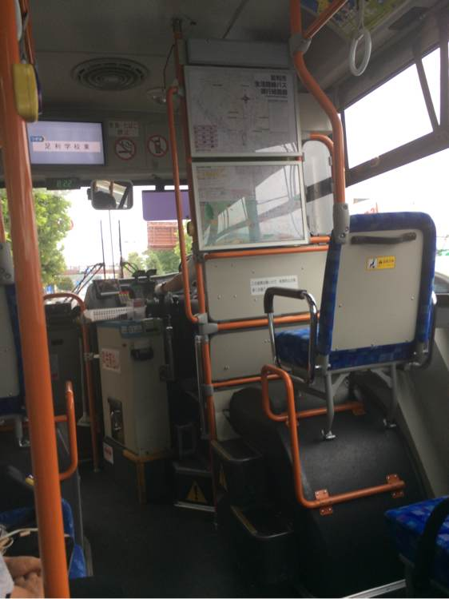
  

4楼 | nbbllxx | 2014-08-27 07:25
    
    2014-08-28 23:16 | 贴吧用户_0JEZKSC:
    > 桦崎町？
    2014-08-29 05:54 | nbbllxx:
    > 回复 q1017643000 : 嗯 取材于这个小镇，可以在wiki上查到
    2014-08-29 23:29 | 贴吧用户_0JEZKSC:
    > 回复 nbbllxx :以前看一个介绍说是箱根町
    2014-08-29 23:40 | nbbllxx:
    > 回复 q1017643000 ：后山的湖是参照芦ノ湖的，奥木染小镇是桦崎官网也有写
    2014-08-29 23:40 | nbbllxx:
    > 回复 q1017643000 ：两个地方离的两三百公里吧印象中
    2014-08-29 23:43 | 贴吧用户_0JEZKSC:
    > 回复 nbbllxx :
    2014-10-26 11:07 | 初三hentai:
    > 赞赞
    2015-02-01 17:06 | cbx720606:
    > 能否转？
    2015-02-01 17:12 | nbbllxx:
    > 回复 cbx720606 :转载？OK啊
    2015-02-01 18:55 | cbx720606:
    > 回复 nbbllxx ：对了官网在天朝上的了吗
    2015-02-02 03:26 | nbbllxx:
    > 回复 cbx720606 : 什么官网？基本都可以
    2015-02-02 12:23 | nbbllxx:
    > 回复 cbx720606 : <http://www.starchild.co.jp/special/yosuganosora/special/20101017.html>这查一下不就知道了....<http://www.cuffs-sphere.jp/products/yosuga/index.html>
    2015-02-16 17:14 | 超级穹:
    > 请问你去玩了几天，总共花了多少人民币，我这个暑假也想去
    2015-02-17 00:45 | nbbllxx:
    > 回复 超级穹 ：九天一万多
    2015-02-17 08:02 | 超级穹:
    > 回复 nbbllxx:你是座飞机还是自驾游
    2015-02-17 09:04 | nbbllxx:
    > 回复 超级穹 :坐车怎么到日本...
    2015-02-17 10:43 | 超级穹:
    > 回复 nbbllxx:忘记了
    2015-02-17 10:44 | 超级穹:
    > 回复 nbbllxx:我想问下，这些和缘之空改造的地方，是你自己找的
    2015-02-17 10:46 | nbbllxx:
    > 回复 超级穹 : 官网上面公布的取材地
    2015-02-17 11:45 | 超级穹:
    > 回复 nbbllxx:那里的人好吗
    2015-02-17 11:47 | nbbllxx:
    > 回复 超级穹 :还行 只要有钱谁都对你好
    2015-02-17 11:48 | nbbllxx:
    > 回复 超级穹 : 问路什么也比较有耐心
    2015-02-17 11:58 | 超级穹:
    > 回复 nbbllxx:你会日语？还是那里有中国人
    2015-02-17 12:04 | nbbllxx:
    > 回复 超级穹 ：日语会一点，如果是大城市也有人会英语不过比较烂
    2015-02-17 14:51 | 超级穹:
    > 回复 nbbllxx:你是从哪出发的？
    2015-02-17 15:04 | nbbllxx:
    > 回复 超级穹 :中国啊
    2015-02-17 15:15 | 超级穹:
    > 回复 nbbllxx:怎么那里天气不好吗，阴阴的
    2015-02-17 15:16 | nbbllxx:
    > 回复 超级穹 :有晴天也有阴天
    2015-02-17 15:19 | 超级穹:
    > 回复 nbbllxx:下个暑假就去那玩，问下，楼主男的女的？
    2015-02-17 15:20 | nbbllxx:
    > 回复 超级穹 :男的 祝你玩得开心
    2015-02-17 15:27 | 超级穹:
    > 回复 nbbllxx:你哪个省的，？我不知道九江有没有到的
    2015-02-17 15:39 | nbbllxx:
    > 回复 超级穹 ：？同学你查户口的么
    2015-02-17 16:00 | 超级穹:
    > 回复 nbbllxx:。。。
    2015-05-16 21:33 | 吃虫的虾:
    > 楼主可以教我怎么去吗 企鹅202333266
    2015-05-16 22:21 | nbbllxx:
    > 回复 吃虫的虾 ：510010253 今天时间不多 很快要到机场了
    2015-05-16 22:30 | 吃虫的虾:
    > 回复 nbbllxx :那明天说吧
* * *

  

5楼 | 贴吧用户_0JGUE8y | 2014-08-27 07:28
    
    2015-12-17 08:04 | 💋孤生💋:
    > 什么？！你还在为追番没资源烦恼！好吧我来了。带来一款只为追番而生的软件。懒得介绍自己体会去 ——下载：<http://pudding.cc/p/pr/i?userId=54ff1ac6e397fa83508b456c>
    2016-08-21 20:47 | iywyluwejy:
    > <http://pan.baidu.com/share/home?uk=3914815370#category/type=0?tSv=%E8%B2%8C>
* * *
在这里换成佐野市営バス，顺便来两张市内的照片 
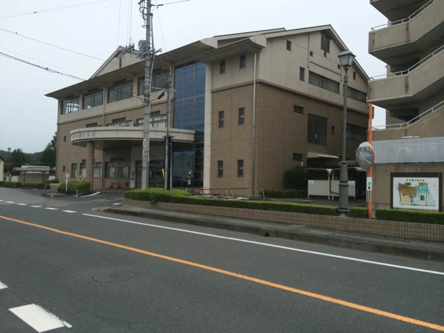
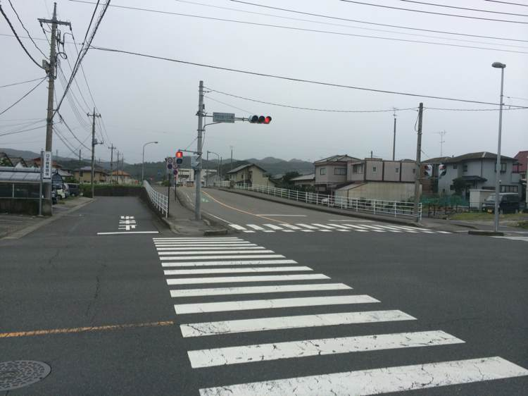
  

6楼 | nbbllxx | 2014-08-27 07:34
    
    2014-08-27 15:44 | lilong_402:
    > 市区都没有人呢
    2014-08-27 15:47 | nbbllxx:
    > 回复 lilong_402 :人家也要干活
    2014-08-28 22:54 | 月月妹妹smile:
    > 回复 nbbllxx :楼楼，你说的干活是啥么一起？
    2014-10-26 11:13 | 贴吧用户_0ey8X5N:
    > 回复 nbbllxx :
    2014-12-14 22:41 | 嘭次打打次打:
    > 这是市区？
    2014-12-14 22:51 | 嘭次打打次打:
    > 回复 nbbllxx :不过说真的，日本真的好干净。
    2015-01-15 17:05 | 打👻无数次:
    > 回复 lilong_402 :都去网吧了
    2015-02-01 15:11 | 狂三嫁给我啊:
    > 怎么这么空旷
    2015-05-06 22:44 | 小灬宅宅:
    > 怎么感觉像城乡结合部。。
    2015-05-07 13:02 | nbbllxx:
    > 回复 小灬宅宅 ：本来就是城乡结合部应该说是乡下小城区
    2016-08-21 20:42 | QOffice782:
    > 像是缘之空中悠放学回家时经过的那里，只是少了一条小何
* * *
一天只有四辆的公交，原作设定是只有两辆吧？一路ost听过去 
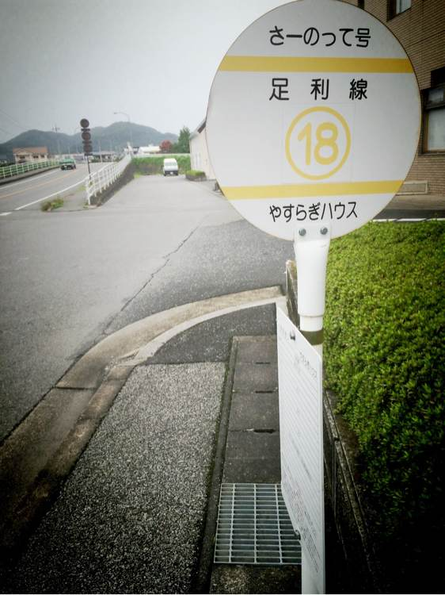
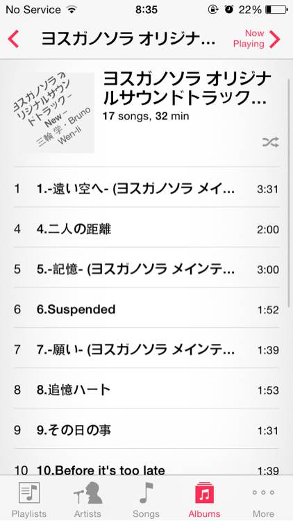
  

7楼 | nbbllxx | 2014-08-27 07:36
    
    2015-05-18 20:25 | 花落只剩孤漠:
    > 很好奇 WIFI是那里接入的
    2015-05-18 20:27 | nbbllxx:
    > 回复 花落只剩孤漠 ：随身热点
    2015-06-29 10:08 | 哈哈玩家🍺:
    > 求音乐打包
    2015-06-29 10:11 | nbbllxx:
    > 回复 云散亦烟消 ：网盘里有，地址在前几楼的回复里
    2015-06-29 10:13 | 哈哈玩家🍺:
    > 回复 nbbllxx :谢谢
    2015-07-15 10:36 | 佳影飘雪:
    > 跟我外婆家差不多 日本的农村跟中国农村都一样的 哈哈
    2015-07-15 10:47 | nbbllxx:
    > 回复 佳影飘雪 ：主要因为他们都有私家车
    2015-07-15 17:10 | 习则:
    > 奥木染是指缘之空里面的？
    2015-07-15 17:17 | nbbllxx:
    > 回复 习则 ： 是原作里面小镇的名字
    2015-07-18 13:47 | 习则:
    > 嗯谢谢
    2015-07-18 13:48 | 习则:
    > 回复 nbbllxx :嗯感觉都好干净
    2016-04-02 19:43 | 夏冰卍:
    > 2016年前来问候
* * *
十五字啊！十五字！算了不水——做一条萌萌的小尾巴
  

8楼 | go菊部地区有水 | 2014-08-27 07:39
* * *
和想像的差很多那面包车巴士hhhh 
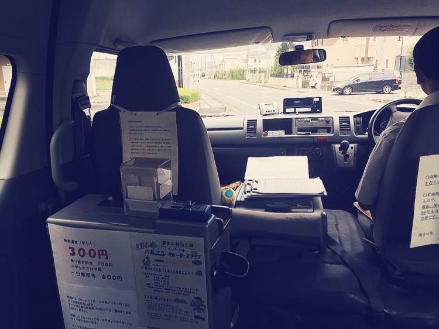
  

9楼 | nbbllxx | 2014-08-27 07:42
* * *
加油哦！！！！！
  

10楼 | 贴吧用户_03aJeQ2 | 2014-08-27 07:47
* * *
终于快到了 
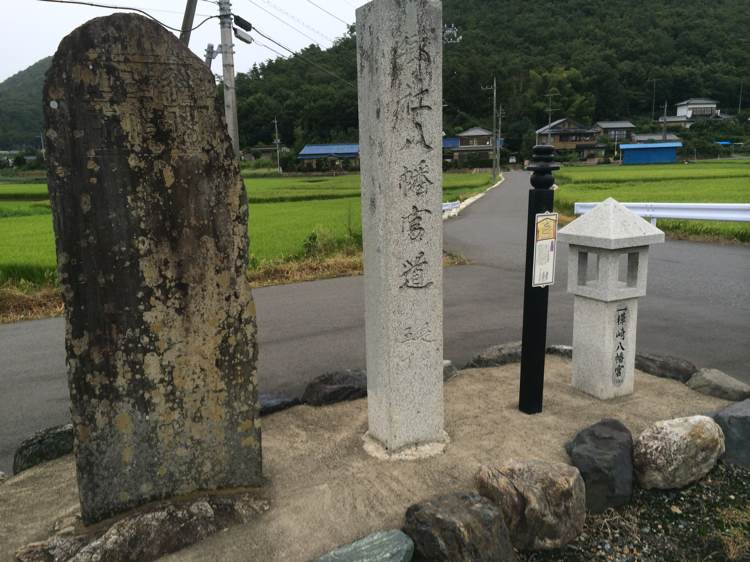
  

13楼 | nbbllxx | 2014-08-27 08:13
* * *
坐等更新
  

14楼 | 牧野听劍😜 | 2014-08-27 08:15
* * *
围观=w=  
\--这个楼主好可爱呀
  

15楼 | kirai😢 | 2014-08-27 08:15
* * *
找到上学路了，就在桦崎八幡宫前面 
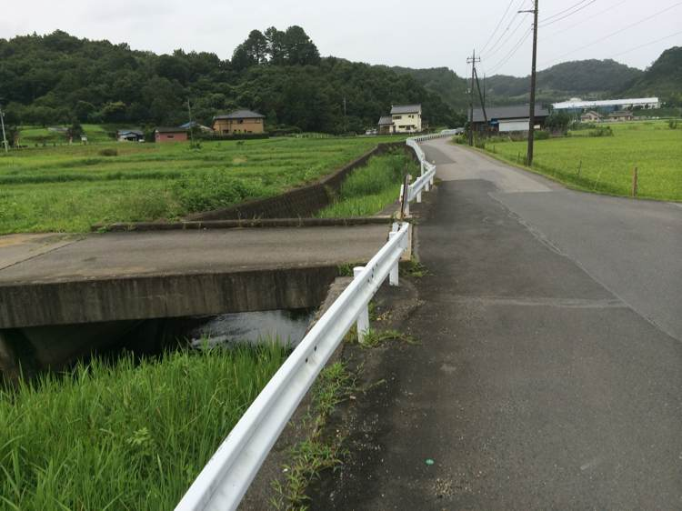
  

17楼 | nbbllxx | 2014-08-27 08:27
    
    2014-08-27 21:56 | 联萌兔子:
    > 比我们中国的乡村干净多了
    2014-08-28 20:11 | KD🌊:
    > 真的呢！！一样！
    2014-08-28 20:32 | 老道我天仙了:
    > 回复 联萌兔子 :哪有。。
    2014-08-28 21:12 | Blance01:
    > 和动画好像
    2014-08-28 21:34 | lj709199609:
    > 好棒！！
    2014-08-28 23:12 | 斐然♤:
    > 这张好！
    2014-11-17 01:03 | 绯山茜º:
    > 不错 ~\(≥▽≤)/~
    2015-01-14 12:25 | 打👻无数次:
    > 回复 联萌兔子 :我们村子里鸡屎狗翔满地我都3年没回去了，除了过年
    2015-01-14 22:15 | 联萌兔子:
    > 回复 学生管老师 :
    2015-01-14 22:16 | 打👻无数次:
    > 回复 联萌兔子 :真的
    2015-02-01 15:12 | 狂三嫁给我啊:
    > 怎么是乡下
    2015-02-01 15:24 | nbbllxx:
    > 回复 狂三嫁给我啊 :原作也是乡下啊
    2015-02-01 15:25 | 狂三嫁给我啊:
    > 回复 nbbllxx :额，我开始没看标题，我以为这是你随便去日本的一个地方拍的
    2015-06-29 07:44 | 拈朵微笑的花🌹:
    > 回复 学生管老师 :你家是养殖场啊？
    2015-06-29 07:54 | 打👻无数次:
    > 回复 此生愿得一株雪 :我家山上有养殖场
    2015-08-03 23:10 | Kirito丶SQ:
    > 一模一样
    2015-08-05 13:49 | 荤食主义者丶:
    > 一毛一样
    2015-10-05 11:23 | small猫Mao咪:
    > lz嫁我！！！
    2016-07-03 21:43 | Limengyuan000:
    > 一模一样啊!!!
    2016-11-12 20:35 | Forever____fxs:
    > 一样！！！！！！！！！！！！！！
* * *
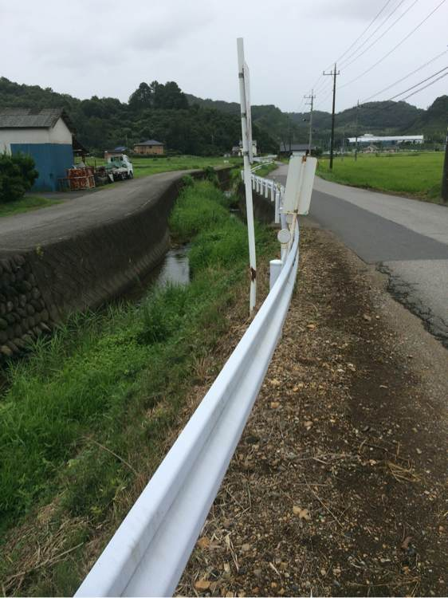
  

18楼 | nbbllxx | 2014-08-27 08:29
    
    2015-08-10 16:30 | 氵soccer艹:
    > 像！
* * *
三次元的叉依姬神社前面是没有楼梯的 
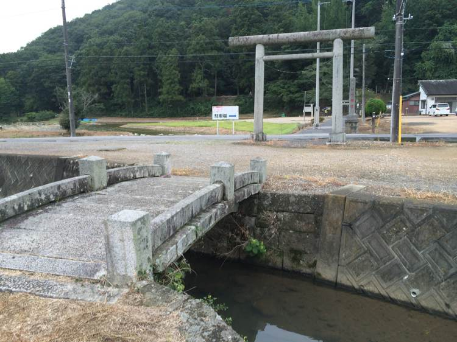
  

19楼 | nbbllxx | 2014-08-27 08:32
    
    2014-09-09 19:30 | Dream天青:
    > 神社供奉的真的是叉依姬？
    2014-09-10 05:16 | nbbllxx:
    > 回复 Dream天青 :不是~叉依姬是架空的，八幡宫供奉的是八幡神，日本的皇室祖神一类的吧
* * *
以前有前辈发过图，好像是有楼梯的
  

20楼 | 蒸汁银☔ | 2014-08-27 08:41
    
    2014-08-27 08:46 | nbbllxx:
    > 他不会去到芦湖了吧
    2014-08-27 08:46 | nbbllxx:
    > 走近了有几节，但是不像动画那么多
    2014-08-27 08:47 | 蒸汁银☔:
    > 回复 nbbllxx ：好吧...
    2014-08-27 22:06 | blackanglia:
    > 酱油带走
    2014-08-27 23:41 | 蒸汁银☔:
    > 回复 blackanglia ：我想改id了...酱油都被偷没了
* * *
  
\--  
  
一件厄运的结束是另一件厄运的开端 ————喵喵喵喵～ 
  

22楼 | 骗你是好猫 | 2014-08-27 08:46
    
    2014-08-27 22:07 | blackanglia:
    > 水怪
    2014-08-27 22:36 | 骗你是好猫:
    > 回复 blackanglia :。。。
    2014-08-27 22:38 | blackanglia:
    > 回复 骗你是好猫 :猫猫，还记得这货吗？@吾王之圆桌骑士
    2014-08-27 22:41 | 骗你是好猫:
    > 回复 blackanglia :这谁
    2014-08-27 22:42 | blackanglia:
    > 回复 骗你是好猫 :额，看来这货是真的不在了，去年缘吧的一位前辈
    2014-08-28 06:23 | 吾王之圆桌骑士:
    > ？？
    2014-08-28 06:24 | 吾王之圆桌骑士:
    > 回复 blackanglia :我其实一直在潜水
    2014-08-28 07:34 | blackanglia:
    > 回复 吾王之圆桌骑士 :额，我自从回吧就没见过你，所以忍不住就艾特了
    2014-08-28 07:48 | 吾王之圆桌骑士:
    > 回复 blackanglia :最近比较忙，没时间啦
    2014-08-28 07:57 | blackanglia:
    > 回复 吾王之圆桌骑士 :话说这只猫回来会杀了我们吗？直接就水他
    2014-08-28 08:34 | 吾王之圆桌骑士:
    > 回复 blackanglia :大概吧
    2014-08-28 08:35 | 骗你是好猫:
    > 回复 吾王之圆桌骑士 :什么啊
    2014-08-28 08:35 | blackanglia:
    > 回复 吾王之圆桌骑士 :额，我匿了，猫猫问起，记得说没见过我
* * *
要火的节奏！ 

  

23楼 | 贴吧用户_0Et3tW7 | 2014-08-27 08:53
* * *
万火留
  

24楼 | 吾恋LX汝爱 | 2014-08-27 09:02
* * *
瑛线出现的八寻的杂货店可惜里面没有大姐姐…… 
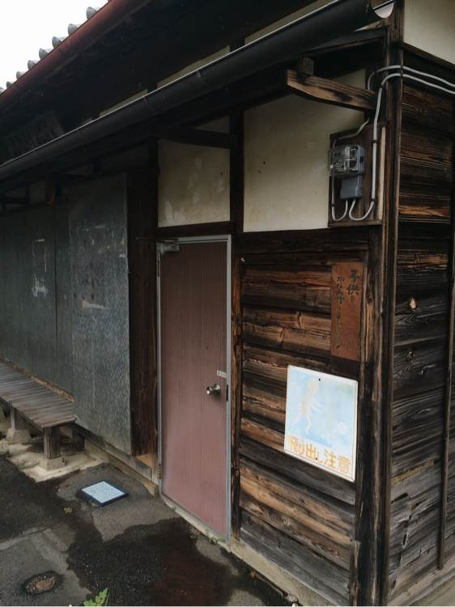
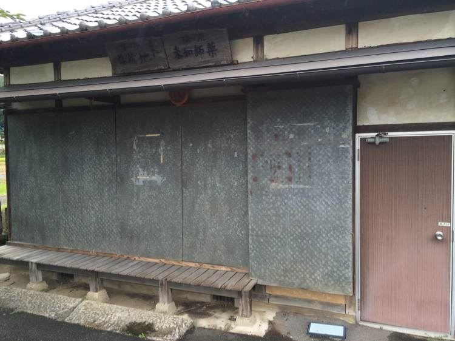
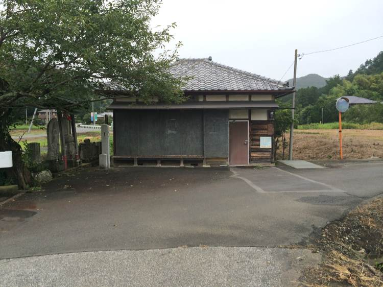
  

25楼 | nbbllxx | 2014-08-27 09:04
    
    2014-08-27 14:55 | nbbllxx:
    > 回复 a734873787 ：那里最多
    2015-05-14 13:05 | 我为九命狂:
    > 
    2015-05-28 22:02 | 悠_远的苍_穹:
    > 上面写着hentai出没注意
    2015-06-25 21:36 | 37℃的想念😇:
    > 回复 悠_远的苍_穹 :
    2016-07-03 21:46 | Limengyuan000:
    > 大赞!!!太像了,好好玩啊,缘之空这招促进旅游经济真是双赢啊
    2020-12-10 15:35 | 使用原用户名💧:
    > 
* * *
网络真差…走了半小时才有网络发帖，还只有3G 龟速
  

26楼 | nbbllxx | 2014-08-27 09:05
* * *
一路上去，叉依姬神社 
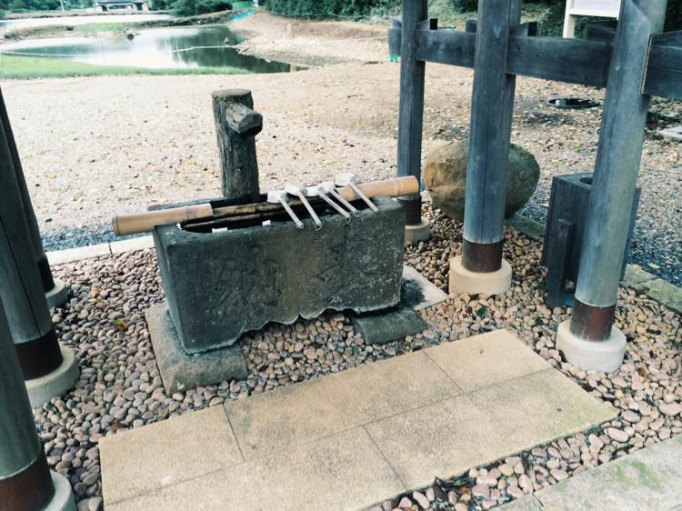
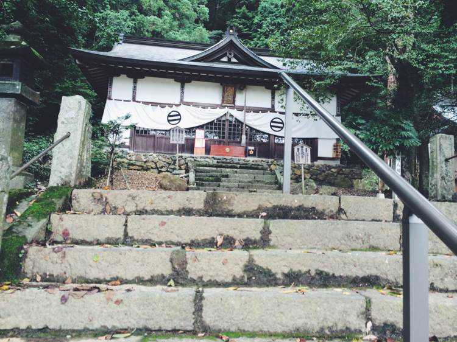

  

27楼 | nbbllxx | 2014-08-27 10:05
    
    2015-02-01 15:13 | 狂三嫁给我啊:
    > 楼梯就这么点点？
    2015-02-01 15:25 | nbbllxx:
    > 回复 狂三嫁给我啊 :嗯 实际上动漫那么多才不科学...工程量太大了
    2015-06-29 08:00 | 红蝴蝶君:
    > 真的唉，好像
    2015-08-03 23:08 | Kirito丶SQ:
    > 我去，那是你们没仔细看，缘之空里面有这个场景的，楼梯就这么点，你们说的是英的住处
    2015-08-03 23:09 | Kirito丶SQ:
    > 我看了好多遍了每次都很仔细
    2015-08-04 00:23 | 备胎D810:
    > 
    2015-08-04 00:24 | 备胎D810:
    > 回复 Kirito丶SQ :挖坟小能手
    2015-08-04 20:13 | Kirito丶SQ:
    > 回复 备胎D810 :。。。。。。
    2016-07-03 21:48 | Limengyuan000:
    > 英不住这吧
    2016-07-29 19:22 | 夏至_浮世绘_:
    > 第三张图动画里出现好多次的
* * *
本体 
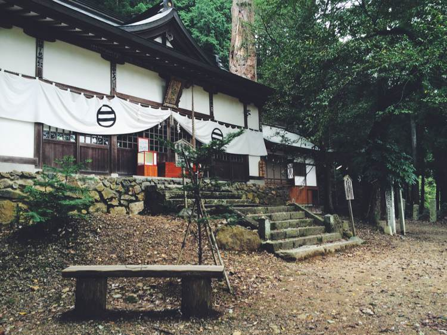
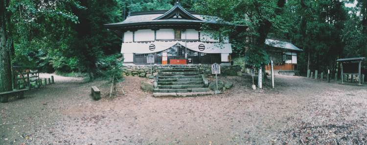
  

28楼 | nbbllxx | 2014-08-27 10:08
    
    2015-08-04 10:22 | Kirito丶SQ:
    > 这是大小姐拉小提琴的时候
    2015-08-04 10:23 | Kirito丶SQ:
    > 悠和瑛都在那坐着
    2016-03-23 00:25 | 忆丶♀:
    > 回复 Kirito丶SQ :这里跟动漫真像
    2016-07-03 21:49 | Limengyuan000:
    > 这个场景出现了好多次
* * *
絵马上全是穹…干脆改名ソラ神社好了…… 
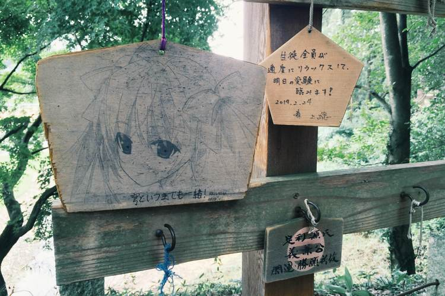
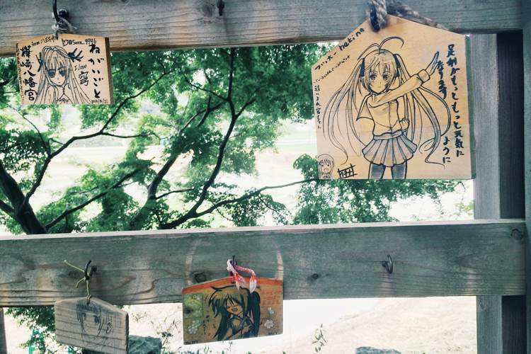
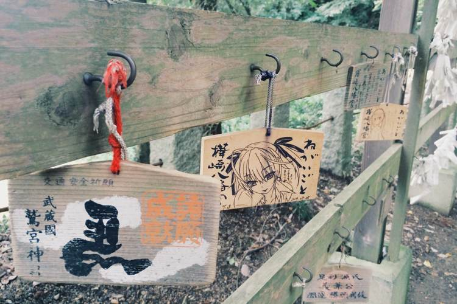
  

29楼 | nbbllxx | 2014-08-27 10:10
    
    2014-08-27 14:24 | 来了世界里:
    > 好有爱❤
    2014-08-28 20:06 | 堕落者01:
    > 大爱啊！。。。。。穹。。。。。
    2014-08-28 20:16 | shzaq123:
    > 吊炸天⊙▽⊙
    2014-08-28 20:53 | KD🌊:
    > hahaha~~全是爱啊！！
    2014-08-28 21:13 | 景行双语可皓:
    > sora神社祭拜穹的神社
    2014-08-28 22:05 | 苗叉1:
    > 好棒~
    2014-08-28 23:13 | 斐然♤:
    > 这么有爱，穹挺受欢迎嘛
    2014-10-26 11:09 | 初三hentai:
    > 有爱
    2014-10-26 11:15 | 贴吧用户_0ey8X5N:
    > 好棒！
    2014-11-17 01:04 | 绯山茜º:
    > 我只想说，卧槽！全是大触啊 (╯｀□′)╯（┻━┻
    2014-11-23 12:18 | Nozomi💌:
    > 二次元对三次元的入侵。动漫宅和妹控的胜利。
    2014-11-24 20:38 | lego🐶:
    > 妹控的大胜利　　　--吓得我做起了布朗运动
    2014-11-24 20:51 | nbbllxx:
    > 回复 sunheqi2000 : 头像撞了
    2015-01-14 13:13 | 赵常😷😷:
    > 最下面的一副穹图为什么有奈美的气质，居然是短发双马尾
    2015-02-01 15:14 | 狂三嫁给我啊:
    > 真的有啊！！动画中我以为是自己随便乱做的地方呢！
    2015-02-17 10:54 | nbbllxx:
    > 回复 no胖次的萌黑猫 :不知道为什么现在看到这个sorajinjya会联想到rurijinjya
    2015-02-17 10:55 | 最美的下雨天º:
    > 琉璃神社。。。
    2015-02-17 10:57 | nbbllxx:
    > 回复 no胖次的萌黑猫 :
    2015-02-17 10:59 | 最美的下雨天º:
    > 回复 nbbllxx :→_→不是已经被查水表了么
    2015-02-17 11:00 | nbbllxx:
    > 回复 no胖次的萌黑猫 :还有绅士辛勤付出贡献神(ci)秘(li)代(lian)码(jie)
    2015-02-17 11:07 | 最美的下雨天º:
    > 回复 nbbllxx :楼主绅士无疑
    2015-05-14 08:38 | QINSJ1234:
    > 那张奈亚子的招牌动作是怎么回事
    2015-05-22 07:28 | nbbllxx:
    > 回复 QINSJ1234 ：哪张
    2015-05-22 07:29 | nbbllxx:
    > 回复 QINSJ1234 ：才看到……不知道什么鬼
    2015-06-29 07:51 | 白小幻ლ:
    > 可以拿走吗
    2015-06-29 07:56 | nbbllxx:
    > 回复 莫毅剑灵灵公主 ：不行
    2015-06-29 08:01 | 红蝴蝶君:
    > 好爱啊
    2015-07-15 17:12 | 习则:
    > 画工厉害
    2015-08-05 13:52 | 荤食主义者丶:
    > 回复 穹灬傲嬌受 :好多绅士
    2016-11-12 20:37 | Forever____fxs:
    > 其实敬奉的是sora
* * *
看到这个彩色的我被触尿了 
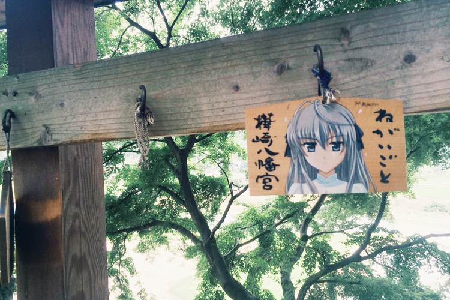
  

30楼 | nbbllxx | 2014-08-27 10:12
    
    2014-08-27 20:27 | 💞椎名真白💞:
    > 雾草！
    2014-08-27 21:58 | 联萌兔子:
    > 大触啊！我现在也好想去哪里旅游 
    2014-08-27 22:03 | 爱爱好卡:
    > +1
    2014-08-28 20:06 | 堕落者01:
    > 我想去了。。。。
    2014-08-28 20:54 | KD🌊:
    > 天！大触！
    2014-08-28 21:38 | 雪酱🌙🌙:
    > 告诉我怎么去
    2014-08-29 05:59 | nbbllxx:
    > 回复 guqintao741 : 从东京出发，座绿色新干线到小山（oyama），然后再乘电车（没记错的话是jr两毛线）到足利（ashikaga）。足利内的桦崎因为太偏了一般地图很难找到，要用google或者yahoo map仔细找，大概在JR足利东北方向5公里，徒步一个多小时就到了。如果公交的话我在头两个帖子写了
    2014-08-29 06:02 | nbbllxx:
    > 回复 nbbllxx :JR行道线巴士（一天十几班）从JR足利駅到やすらぎハウス（一个敬老院），然后换乘佐野市営巴士（单方向一天4班）从やすらぎハウス到下一站北乡什么的，然后走两公里就到桦崎了。也可以在车站打的不过天价
    2014-11-17 01:05 | 绯山茜º:
    > 卧槽 要不要这么吊！！！
    2014-12-15 13:25 | 鋴荤帇:
    > 会日语？楼主
    2014-12-15 20:42 | nbbllxx:
    > 回复 鋴荤帇 : 会一丢丢
    2015-02-17 10:52 | 最美的下雨天º:
    > 膜拜！
    2015-04-05 14:37 | Master小丹尼:
    > 下次一定去膜拜一下触！
    2015-07-30 17:47 | 慕容忆远:
    > 好可怕。。。。。。
    2015-08-05 13:54 | 荤食主义者丶:
    > 教我画画
    2016-04-02 13:45 | 波比黄瓜瘦:
    > 回复 亦晨忆晨 :昨天在B站看了个很久以前的视频，正好有这个
    2016-04-02 13:54 | nbbllxx:
    > 回复 波比黄瓜瘦 ：估计是我的
    2016-04-02 14:40 | 春日野-穹:
    > 回复 波比黄瓜瘦 :在哪里
    2016-04-02 15:02 | 波比黄瓜瘦:
    > 回复 亦晨忆晨 :b站搜索奥木染 就ok了
    2016-12-22 19:58 | 霉者如屑💥:
    > 我擦，我就知道，可是为什么在这里
* * *
顶
  

33楼 | 🌼小鸟游六花 | 2014-08-27 10:20
* * *
不错
  

34楼 | 谁who9 | 2014-08-27 10:40
* * *
慢慢的即视感
  

36楼 | AlexandrCarlos | 2014-08-27 10:53
* * *
赞一个！
  

37楼 | 最终决战式☞桜 | 2014-08-27 11:24
* * *
顺便楼主土豪
  

38楼 | 最终决战式☞桜 | 2014-08-27 11:28
* * *
@小灰灰快跑呀 @只爱薰儿和娴儿 @懒懒MIKU酱 @heart控心不爱 @缘之空_只爱穹M
  

39楼 | 最终决战式☞桜 | 2014-08-27 11:28
    
    2014-08-27 11:28 | 最终决战式☞桜:
    > 圣地巡礼
    2014-08-27 11:29 | 最终决战式☞桜:
    > @阿卡99年 @专家学者11 @tfjmsy @rz丶辉仔 @xySt丶涩甜
    2014-08-27 11:54 | xySt丶涩甜:
    > 哼 等我攒够钱了我也去（话说什么能攒够钱）
    2014-08-27 12:17 | 最终决战式☞桜:
    > 回复 xySt丶涩甜 :努力工作OR极品帐号
    2014-08-27 12:39 | xySt丶涩甜:
    > 回复 冫_很傻很天真 :没事 晚上多接几个客人就有了！
    2014-08-27 12:39 | 最终决战式☞桜:
    > 回复 xySt丶涩甜 :我邪恶了
    2014-08-27 13:05 | xySt丶涩甜:
    > 回复 冫_很傻很天真 :
    2014-08-27 13:16 | -風浦可符香-:
    > 流量党伤不起 ——M9"巴祖卡"火箭筒，二战期间反步兵能力最强的火箭筒。它的火箭弹可以在发射出去后迅速偏离轨道进而精准的击中敌方步兵，从而机智的避免了与敌人装甲部队的正面冲突。
    2014-08-27 13:19 | 最终决战式☞桜:
    > 回复 rz丶辉仔 :回家用WiFi
* * *
没赶上巴士走了一小时走回来了。。  
就是这个神触！！  
我一开始以为是打印上去或者贴纸  
但是后来看照片竟然是画上去的！！ 
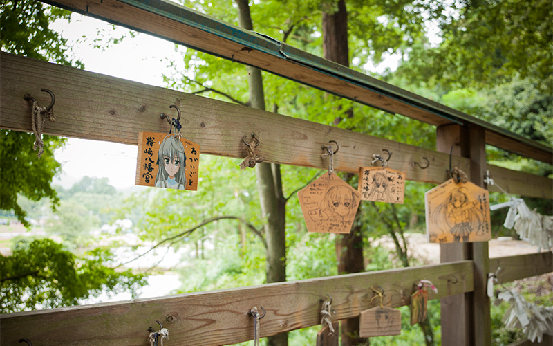
  

40楼 | nbbllxx | 2014-08-27 11:59
    
    2014-08-28 20:08 | 堕落者01:
    > 画功很好啊！。。
    2014-08-28 20:56 | KD🌊:
    > 是真爱~！
    2014-08-30 00:17 | -WDNM-:
    > 大角虫......
    2014-08-30 16:39 | 贴吧用户_QaCeU93:
    > 画的很想
    2014-12-25 23:11 | DPCQ55:
    > 摘下来。。拿回家。。。。
    2014-12-25 23:29 | nbbllxx:
    > 回复 DPCQ55 :这种中国大妈才会做的事情我怎么会做
    2015-02-17 10:53 | 最美的下雨天º:
    > 膜拜
    2015-08-03 23:13 | Kirito丶SQ:
    > 我想说春日野医院呢？
    2015-08-05 13:56 | 荤食主义者丶:
    > 画师
* * *
那条湖也就是卢之湖好像在神奈川的箱根町吧
  

41楼 | zzq6 | 2014-08-27 11:59
    
    2014-08-27 12:02 | nbbllxx:
    > 嗯，那个有没有作为取景好像官方没说，wiki上面讲的奥木染原型是在桦崎
    2014-08-27 12:04 | zzq6:
    > 回复 nbbllxx :很羡慕lz，话说lz怎么去日本的？自由行吗？
    2014-08-27 12:05 | nbbllxx:
    > 回复 zzq6 :淘宝签证，自由行
    2014-08-27 12:07 | zzq6:
    > 回复 nbbllxx :去一次日本大概要多少预算啊，我也好想去啊
    2014-08-27 12:22 | nbbllxx:
    > 回复 zzq6 ：要看去哪儿了，尽量少的长途旅行（比如这次从关西到关东来回花了我36000日元…）然后远便宜点的酒店和吃便宜点的饭，一个人的话一天五六百，来回机票两千左右np的。两个人还要便宜毕竟住宿省了
* * *
坐等更
  

42楼 | 徘徊终落幕 | 2014-08-27 12:08
* * *
找不到大图和cg资源，动画也落国内了这边没法截图，将就吧 
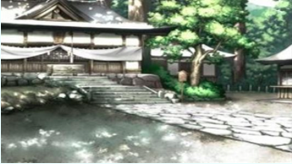
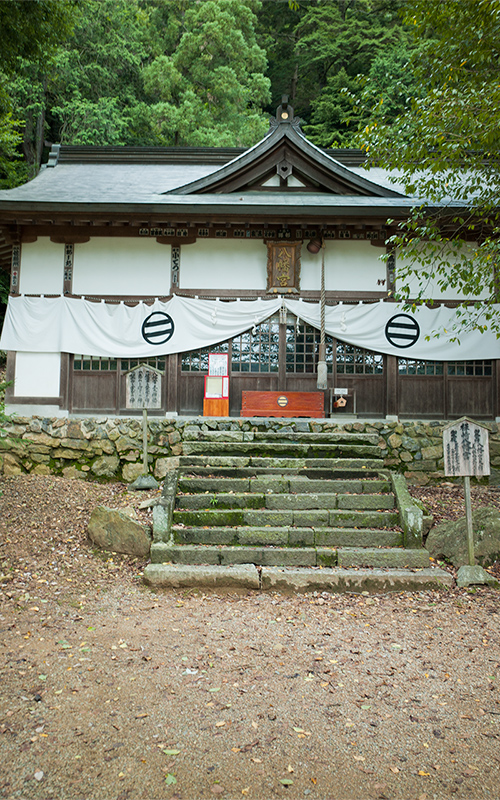
  

43楼 | nbbllxx | 2014-08-27 12:25
* * *
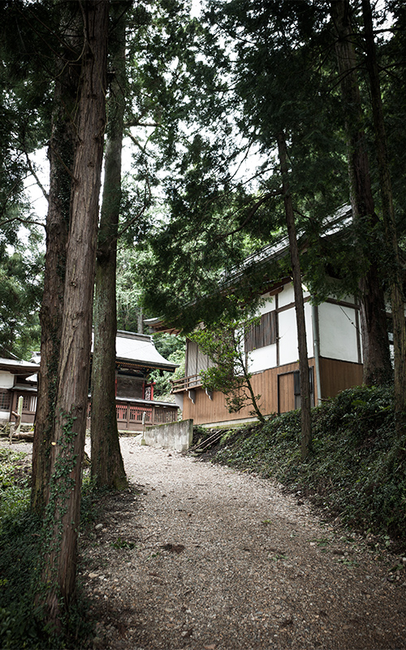
盗图小能手

  

44楼 | nbbllxx | 2014-08-27 12:26
    
    2014-08-28 20:57 | KD🌊:
    > WOW~真的哎~
    2014-08-28 22:20 | 明月怕登楼º:
    > 这个真心赞的！！
    2014-08-29 00:02 | 星辰繁影:
    > 我草，真的诶
    2014-10-29 16:34 | 束素迁諾:
    > 卧槽！一样的
    2015-03-23 12:18 | 文艺喵T青年:
    > 回复 夕阳与月cc :wow....你是部落的叛徒
    2015-05-06 22:41 | 艾里沙55:
    > 这个像啊
    2015-05-15 05:00 | 爱你的妖妖妖:
    > 挖坟也要回！真的好像！
    2015-05-31 15:09 | ▫为你宽衣▫:
    > 一模一样
    2015-07-30 15:26 | 颜於不染:
    > 一样啊
    2016-01-24 01:28 | 鬼刀劫:
    > 此中有真意，欲辩已忘言。赞一个
    2016-07-03 21:53 | Limengyuan000:
    > 太妙了
    2018-08-02 23:57 | 虹-º:
    > 我的天啊，好美忍不住挖坟了
* * *
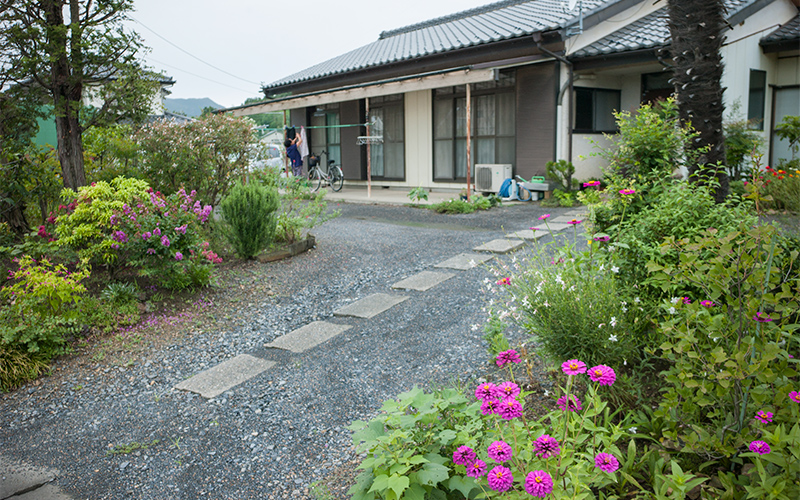
路上碰到的很像春日野医生家的房子hh
  

45楼 | nbbllxx | 2014-08-27 12:29
    
    2014-08-27 18:22 | Neclive:
    > 穹妹那间屋子，窗户玻璃上上射满，擦均匀
    2014-08-28 20:58 | KD🌊:
    > 回复 Neclive :魂淡……泥垢了！
    2014-08-29 16:13 | 沙漠_妖姬:
    > LZ去看看穹妹在不在里面
    2014-08-29 16:13 | 沙漠_妖姬:
    > 回复 Neclive :你够了hentai！一边去！
    2014-09-01 12:47 | Neclive:
    > 回复 沙漠_妖姬 ：
    2014-09-01 12:47 | Neclive:
    > 回复 夕阳与月cc ：
    2015-05-06 22:42 | 艾里沙55:
    > 不能忍啊
    2015-05-28 21:35 | 古语之书:
    > 回复 沙漠_妖姬 :你穿裙子去装吧
    2015-06-29 08:06 | 红蝴蝶君:
    > →_→
    2015-08-05 13:57 | 荤食主义者丶:
    > 警察吗，这里有个变态
    2016-04-02 13:47 | 波比黄瓜瘦:
    > 喂，妖妖灵吗
    2020-12-10 15:40 | 使用原用户名💧:
    > 快看看里面有没有绒布兔
* * *
帮我买几车的毛片回来 还有本子 谢谢
  

46楼 | 烟然语笑 | 2014-08-27 12:31
    
    2015-02-01 15:16 | 狂三嫁给我啊:
    > 
    2015-05-26 05:59 | 秦磊哦:
    > 给我来一轮船带回来谢谢
    2015-06-29 21:55 | 老师戴黑胸罩:
    > 给我来个日本
* * *
赶上直播了？
  

47楼 | 仙影奇剑 | 2014-08-27 12:32
    
    2014-08-27 12:34 | nbbllxx:
    > 直播都快结束了
    2014-08-27 12:50 | 仙影奇剑:
    > 回复 nbbllxx :差评……继续呀要不要我给你来点炫迈
    2014-08-27 19:22 | 仙影奇剑:
    > 回复 nbbllxx :→_→
    2014-08-27 19:25 | 仙影奇剑:
    > 回复 nbbllxx :楼楼要加油啊～千万不要遇到一个奇怪的怪蜀黍
* * *
赞一个
  

48楼 | 烟然语笑 | 2014-08-27 12:38
* * *
赶上直播了，，
  

49楼 | STORM✆ | 2014-08-27 12:38
* * *
不错，好顶赞
  

50楼 | Tortrue恶姬 | 2014-08-27 12:39
* * *
直播么。。
  

51楼 | 恒温秘密 | 2014-08-27 12:52
* * *
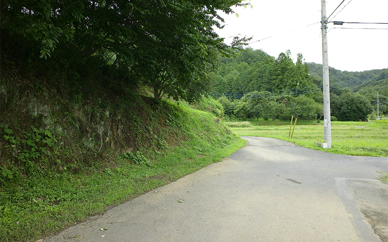
这里好像也是一张cg？记不清了  
大小姐的家找了半天没找到，早知道当时不该乘公交应该租自行车去得  
另外栃木的海拔貌似不是很高啊  
前两天在京都的时候  
去了高山寺（另外一部动漫京骚戏画的原型）  
感觉那里的山比桦崎这边更有叉依姬神社的感觉  
像这样 
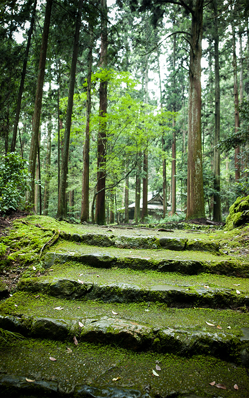
  

52楼 | nbbllxx | 2014-08-27 13:04
    
    2014-08-27 22:44 | 诸葛诚之磁:
    > 你可以走另一一个方向
    2014-08-28 09:27 | nbbllxx:
    > 回复 诸葛诚之磁 ：后期做个左右对称能少走几步路
    2014-08-28 11:58 | 诸葛诚之磁:
    > 回复 nbbllxx :
    2014-10-29 18:11 | 逍遥柠檬酸:
    > 回复 诸葛诚之磁 :原来红3吧的丧尸也潜伏进来了，id眼熟
    2015-06-25 01:38 | 布拉德莱克:
    > 这风景简直棒
    2015-07-07 23:49 | 贴吧用户_08D2SK5:
    > 高山市？冰菓吗？
    2015-07-08 09:01 | nbbllxx:
    > 回复 游戏窗口 :高山寺
    2015-08-03 23:16 | Kirito丶SQ:
    > 第一张图好像是他们等待一起上学的地方
* * *
不错不错
  

53楼 | 煙花雨✨ | 2014-08-27 13:10
* * *
赞
  

54楼 | 茳小悠 | 2014-08-27 13:30
* * *
呜呜呜呜呜呜好感动
  

56楼 | zeruº | 2014-08-27 13:33
* * *
顶，以后有机会一定要去看看
  

57楼 | 948114181qq | 2014-08-27 13:38
* * *
门票多钱？
  

58楼 | 天弃君💢 | 2014-08-27 13:49
    
    2014-08-27 13:55 | nbbllxx:
    > 大多数日本景点不用门票的，除非国宝级别的偶尔会有
    2014-08-27 13:57 | 天弃君💢:
    > 回复 nbbllxx :学校照片有吗
    2014-08-27 14:06 | nbbllxx:
    > 回复 缘之空_只爱穹M : 学校是虚构的～不过足利市学校有很多，女子高也有几个。。早上起来他们上学就像群体cosplay一样特别壮观。。。
    2015-06-29 08:10 | 红蝴蝶君:
    > 回复 nbbllxx :群体Cosplay，看到这个再也不能忍
* * *
没了？
  

60楼 | 来了世界里 | 2014-08-27 14:43
    
    2014-08-27 14:45 | nbbllxx:
    > 没了嘛。
* * *
瞬间感觉动漫的采景还是不错的
  

61楼 | 沙漠_妖姬 | 2014-08-27 14:52
* * *
哇楼主真棒--
  

62楼 | ◎三团子代己烷 | 2014-08-27 15:13
* * *
卧槽缘之空？
  

63楼 | 凛冽之雪ლ | 2014-08-27 15:26
    
    2014-08-27 15:31 | nbbllxx:
    > 嗯，原作里设定缘之空故事发生的奥木染町的原型
    2014-08-27 17:37 | 凛冽之雪ლ:
    > 回复 nbbllxx :是私人弄的？
    2014-08-27 17:38 | 凛冽之雪ლ:
    > 回复 nbbllxx :原来动画是基于这个小镇的
    2014-08-27 17:44 | nbbllxx:
    > 回复 只爱薰儿和娴儿 ：嗯 对的
* * *
后山里面虽然没有湖…但是有个小池塘
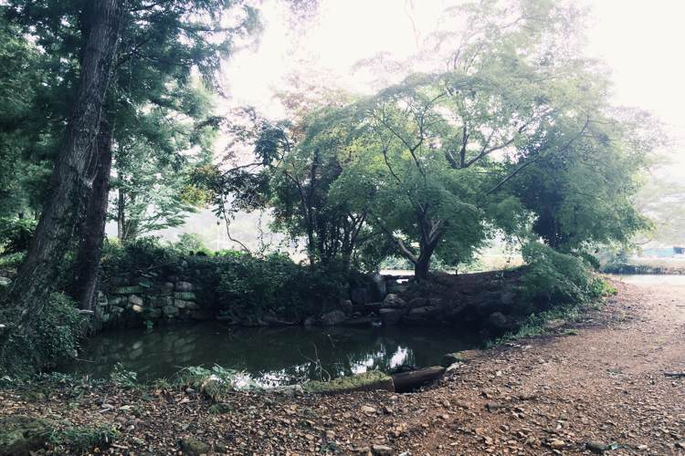
  

64楼 | nbbllxx | 2014-08-27 15:32
    
    2014-08-28 20:58 | KD🌊:
    > 是不是走的还不够远？
    2014-08-28 23:17 | 斐然♤:
    > 湖呢！！
    2014-11-24 16:36 | 毛利J五郎:
    > 反差有点大
    2015-01-14 10:32 | 潜行吧凯凯子:
    > 就在这净的身？
    2015-01-14 11:12 | nbbllxx:
    > 回复 潜行吧凯凯子 :对就在这儿淹死的
    2015-01-14 11:13 | nbbllxx:
    > 湖在另外一个地方，我有提到过
    2015-05-13 17:34 | 稻草人774:
    > 卧槽
    2015-08-03 23:17 | Kirito丶SQ:
    > GG
* * *
处理后的上学路，还是没有动画里的感觉…边上种的稻谷，栃木県是农业大省。现实生活中这条路也是上学路，不过是小学生的www 

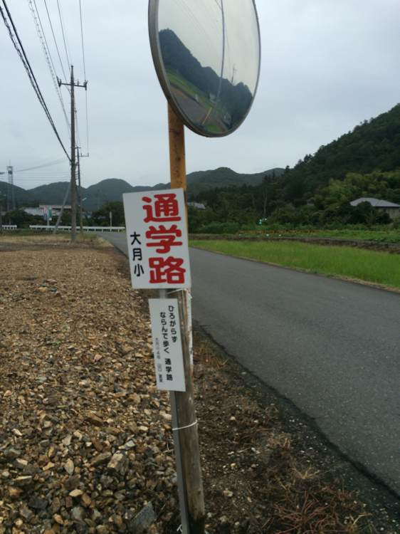
  

65楼 | nbbllxx | 2014-08-27 15:34
    
    2018-07-09 09:15 | 🌈快乐:
    > 大月小什么鬼？
* * *
帮顶
  

66楼 | Arched丶 | 2014-08-27 15:47
* * *
好想去……
  

67楼 | 什么lol😈 | 2014-08-27 17:59
* * *
火前留名
  

68楼 | nhjesse | 2014-08-27 18:18
    
    2014-08-27 18:24 | nbbllxx:
    > 这贴能火我直播吃翔。。
    2014-08-27 18:55 | nhjesse:
    > 回复 nbbllxx :做等吃翔
    2015-01-14 10:34 | 潜行吧凯凯子:
    > 回复 nbbllxx :坐等吃翔
    2015-05-13 13:51 | 国服第一大依泽:
    > 回复 nbbllxx :吃吧楼主
    2015-05-26 06:03 | 秦磊哦:
    > 吃吧楼主
    2015-07-23 11:38 | 18990984395:
    > 回复 nbbllxx ：快吃快吃
* * *
楼主不更了？我要看他们住的房子。
  

69楼 | 橘落叶º | 2014-08-27 18:27
    
    2014-08-27 18:29 | nbbllxx:
    > 没了没了，房子是我路上找到的，官网没放出过这栋房子的原型
    2014-08-27 18:42 | 橘落叶º:
    > 为神马，楼主不是说那房子看着挺像的。发来看看吗
    2014-08-27 19:12 | nbbllxx:
    > 回复 丷残丶愛 : 就拍了这一张本来回去路上想再进去的后来找不到了。。。
    2014-08-28 09:19 | 橘落叶º:
    > 纳尼
* * *
好棒
  

72楼 | 英吉利的中二病 | 2014-08-27 19:26
* * *
我来顶一层～记得多拍几个妹子
  

73楼 | 贴吧用户_03aJeQ2 | 2014-08-27 19:28
* * *
有几个地方真的好像啊  
顶一顶
  

74楼 | 星环城之殇 | 2014-08-27 19:29
* * *
关于女子高。。。明天早上要是能上80层我就冒死去拍一下。。  
不过很不象的。。。  
这是昨晚拍的足利女子高门口  
因为足利学校太多了  
今天早上起来到处都是高中生，搞的像群体cosplay一样 
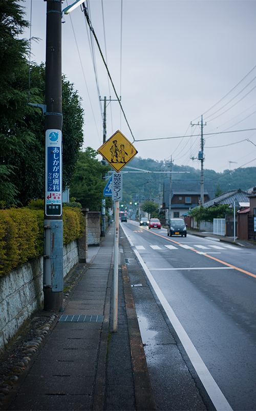
  

75楼 | nbbllxx | 2014-08-27 19:29
    
    2014-08-27 21:24 | 岛田半藏⚡:
    > 火前留名
    2014-08-28 22:25 | 智囊团晨晨:
    > 土豪下次带我去嘛～
    2015-07-15 17:15 | 习则:
    > 街道上好干净
* * *
赞一个
  

77楼 | 💞椎名真白💞 | 2014-08-27 20:32
* * *
快点更啊！我要看爷爷的房子
  

78楼 | 联萌兔子 | 2014-08-27 22:05
* * *
楼主，好赞顶！
  

79楼 | 苍穹下穹的微笑 | 2014-08-27 22:25
* * *
顶赞
  

80楼 | lllfff19961220 | 2014-08-27 22:29
* * *
还有吗？
  

82楼 | yhj429264300 | 2014-08-27 23:05
* * *
不错
  

83楼 | 水墨悠穹 | 2014-08-27 23:24
* * *
赞一个
  

84楼 | X火之魂X | 2014-08-27 23:51
* * *
顶一个。————那画面太美我不敢看
  

85楼 | 穹之心悠 | 2014-08-28 00:40
* * *
大赞
  

86楼 | ES冰魂丶 | 2014-08-28 00:54
* * *
楼主好棒！
  

87楼 | Lonely_pride峰 | 2014-08-28 01:34
* * *
出发去拍女子高 
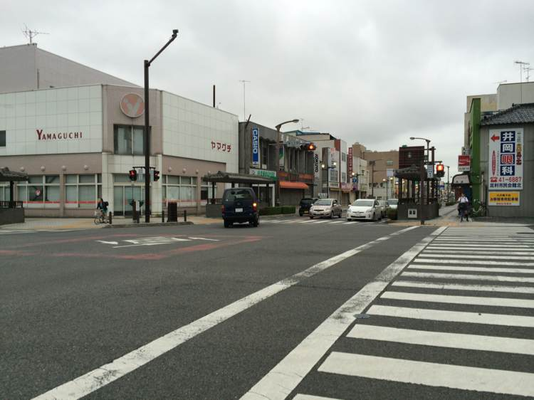
  

89楼 | nbbllxx | 2014-08-28 07:09
    
    2015-01-14 18:05 | 小晓笑疯:
    > 这好像天神乱漫一个地方
    2015-07-15 17:16 | 习则:
    > 回复 小晓笑疯 :那个游戏吗柚子社的
    2015-07-15 21:36 | 小晓笑疯:
    > 回复 习则 ：对的
    2015-07-18 13:47 | 习则:
    > 嗯
    2016-09-06 19:09 | a871710336:
    > 哦哟
* * *
总觉得这个scene在俺妹里出现过啊 
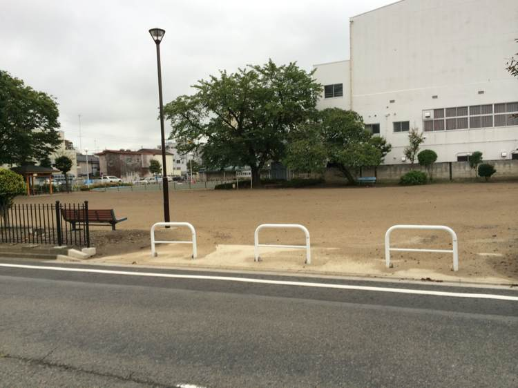
  

90楼 | nbbllxx | 2014-08-28 07:15
    
    2014-08-28 20:21 | shzaq123:
    > 那是在海边吧
    2014-08-28 21:00 | KD🌊:
    > 回复 shzaq123 :对\(^o^)/海边cg有这个
    2015-08-03 23:19 | Kirito丶SQ:
    > 他们的学校在那啊
    2016-07-24 16:37 | 破魂绝影:
    > 好像是有！
* * *
传说贴吧有这么一个表情，圆嘟嘟的脸萌萌哒，弧度上扬的嘴角傲而不娇，微微泛红的脸颊让人感到无限温暖，双眼右视充满欢乐使人浮想联翩，轻挑秀眉深藏功与名，现在请大声的告诉我这个表情是什么！
  

91楼 | 阿银GT🐴 | 2014-08-28 07:19
    
    2014-08-28 20:12 | 堕落者01:
    > 
    2020-07-06 23:59 | ℉earher:
    > 
* * *
百年历史的女子高，好像来晚了。原作奥木染的学校就是女子高改的普高 
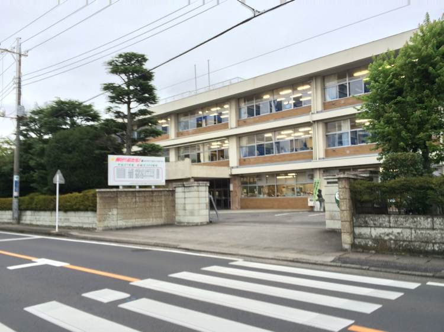
  

92楼 | nbbllxx | 2014-08-28 07:33
    
    2014-08-28 07:34 | nbbllxx:
    > 不过这样看起来确实有点像……
    2014-08-28 07:58 | nbbllxx:
    > 完全搞不懂他们的上学时间…
    2014-08-29 23:46 | lllfff19961220:
    > 回复 nbbllxx :正常8:30到校，现在假期返校吧
    2015-06-25 21:14 | 何夜舞月1:
    > 校门很像
    2015-06-29 08:13 | 红蝴蝶君:
    > 冒死回复
    2015-08-03 23:20 | Kirito丶SQ:
    > 就是门口像，我记得动漫里的教学楼离校门有一段距离哦
    2015-08-03 23:21 | Kirito丶SQ:
    > 门前也没斑马线，，，2014，过了4年
    2015-08-03 23:37 | nbbllxx:
    > 回复 Kirito丶SQ ：动画是艺术作品，没必要写实；硬要玩找不同只是找无趣
    2016-07-03 22:00 | Limengyuan000:
    > 回复 Kirito丶SQ :动漫里还是个很高的大楼,有个大钟
    2016-12-22 20:01 | 霉者如屑💥:
    > 这就是传说中的穂见校园？
* * *
针线和纽扣店，突然想起S2线开头，悠说校服要到县城定制但是按照女子高的传统，纽扣要自己缝 
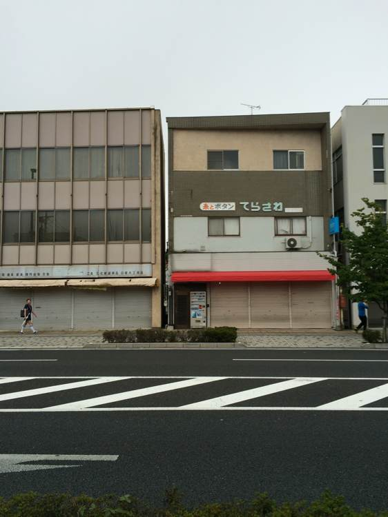
  

93楼 | nbbllxx | 2014-08-28 07:45
* * *
估计是去的太晚了，路上已经没有几个高中生了  
（我到那边已经是当地时间8点40分了） 
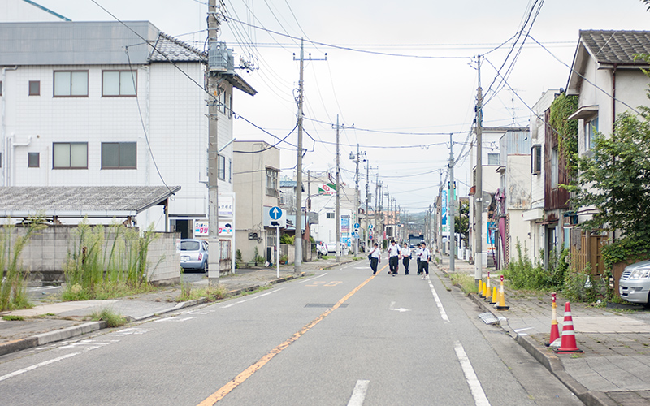
路上碰到温馨的一幕，奶奶领着孙子上学。下着一点点大的小雨 
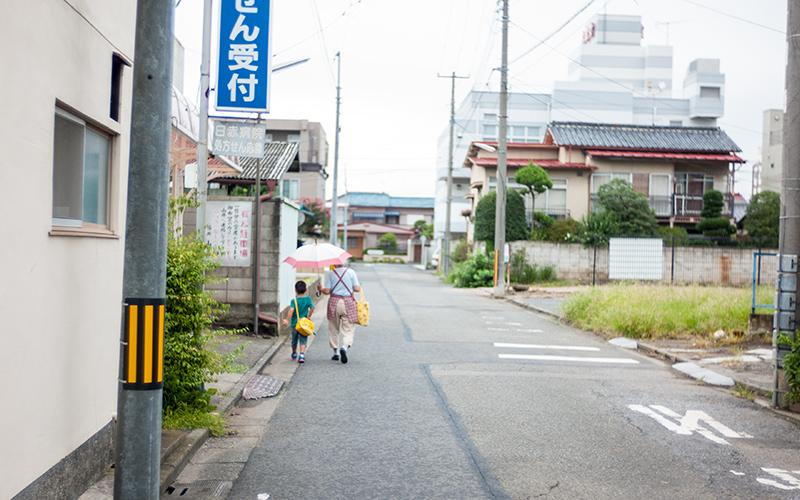
  

95楼 | nbbllxx | 2014-08-28 08:15
* * *
大桥上往下拍到的高中生 
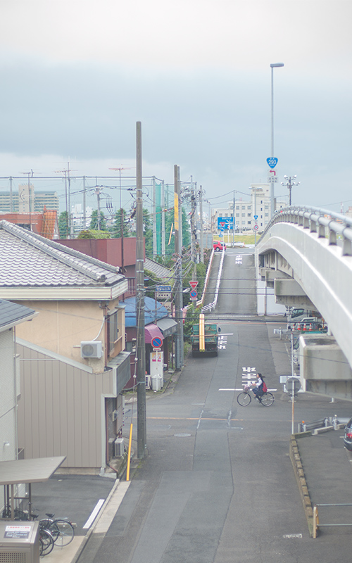
  

96楼 | nbbllxx | 2014-08-28 08:18
    
    2014-09-02 21:19 | 如果胖请深胖:
    > 楼主好猥琐-_-||
    2014-09-02 21:21 | nbbllxx:
    > 回复 如果胖请深胖 ：有什么好猥琐的…又不是从下往上拍
    2014-09-02 21:27 | 如果胖请深胖:
    > 说好的，一群卡死扑累呢？就一个而且还这么远～
    2014-09-02 21:28 | nbbllxx:
    > 回复 如果胖请深胖 ：时间不对，我也不清楚为什么，前一天同样的时间路上学生好多的
    2014-09-02 21:33 | 如果胖请深胖:
    > 回复 nbbllxx :难道她们有人懂中文，然后集体旷课了～
    2015-06-29 08:15 | 红蝴蝶君:
    > 好像玉子的那身校服
* * *
89楼那张想起来悠和大小姐一起逛的“邻镇的购物中心”……
  

97楼 | zzy740688395 | 2014-08-28 08:18
    
    2014-08-28 08:20 | nbbllxx:
    > 那种搭棚的商业街没在足利看到过～不过奈良和京都都有，可惜没拍下来。中午去东京吃饭，要是能碰到我就拍
    2014-08-28 08:22 | zzy740688395:
    > 回复 nbbllxx :支持楼主~不过到处乱跑是不是很累啊……
    2014-08-28 08:29 | nbbllxx:
    > 回复 zzy740688395 ：除了去桦崎八幡宫，就是奥木染的这次走了五小时确实有点吃力…其他都还行，小岛国交通很发达(=ﾟωﾟ)ﾉ
    2014-08-28 08:34 | zzy740688395:
    > 回复 nbbllxx :楼主加油~
    2014-11-16 21:38 | 鏡丶花水月:
    > 签名档萌萌哒
* * *
围观大触坐等更新
  

98楼 | 就是杯具love | 2014-08-28 08:35
* * *
楼主，刚看到<http://tieba.baidu.com/p/1987065359>这篇帖子，芦之湖和大小姐家貌似也找得到耶~可以去看看哦~不过芦之湖不在桦崎八幡宫（叉依姬神社）后面，而在箱根神社后面。楼主可以去看看，让吧友们一饱眼福哦~
  

99楼 | zzy740688395 | 2014-08-28 08:50
    
    2014-08-28 09:30 | nbbllxx:
    > 那个帖子里的官网图，我在神社附近走了一个多小时都找不到( ；´Д‘)太没用了
    2014-08-28 10:42 | zzy740688395:
    > 回复 nbbllxx :楼主辛苦了……
    2017-05-01 10:54 | Ramp◎º:
    > 回复 nbbllxx ：jr通票怎么样 ？楼主在日本买的票吗
* * *
顶贴。
  

100楼 | 橘落叶º | 2014-08-28 09:21
* * *
我QQ:791447764楼主记得发照片给我哦
  

102楼 | 贴吧用户_03aJeQ2 | 2014-08-28 09:48
* * *
顶楼主
  

103楼 | 薯仔💦 | 2014-08-28 10:19
* * *
褚和悠逛街的地方【误 
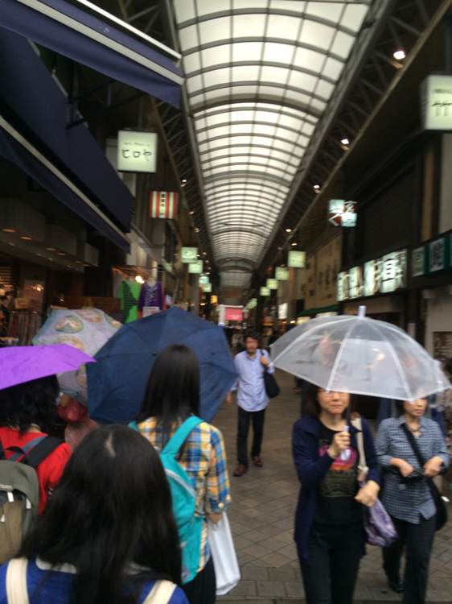
  

104楼 | nbbllxx | 2014-08-28 11:09
    
    2014-08-28 11:27 | 沙漠_妖姬:
    > 貌似悠之空里悠哥和穹妹也在这里逛街。。。。。
    2014-08-28 23:18 | 斐然♤:
    > 悠也陪英来过吧
    2016-01-25 23:51 | Fish_Torres:
    > 这是哪条街
    2016-01-25 23:53 | nbbllxx:
    > 回复 Fish_Torres :浅草商店街
    2016-07-02 18:35 | 赤雪穹:
    > 好像大阪的心斋桥
    2016-07-04 19:25 | 考孰拉🐨:
    > 回复 ab78356876 :瑛线最后
    2016-09-06 19:13 | a871710336:
    > 回复 赤雪穹 :很多地方都这样的，看着都很眼熟~
* * *
lz快更，加油啊  

  

106楼 | 無限继续 | 2014-08-28 12:16
* * *
秋叶原这地方太疼了……
  

107楼 | nbbllxx | 2014-08-28 12:46
* * *
SEGA的巨大建筑 
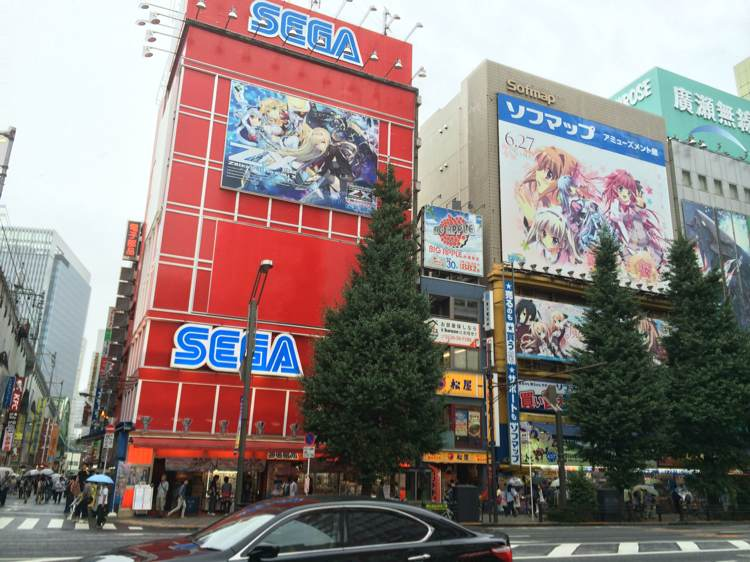
  

108楼 | nbbllxx | 2014-08-28 12:48
    
    2014-08-28 20:23 | shzaq123:
    > 又是恋樱。。。
    2014-08-29 12:42 | Fworks_sky:
    > 哪都是恋樱
    2014-11-16 21:39 | 鏡丶花水月:
    > 08年统治世界的游戏厂商
    2015-02-01 03:30 | nbbllxx:
    > 回复 卩s灬枫叶 : 没关注…只是路过看看
    2015-02-01 15:21 | 狂三嫁给我啊:
    > 啊，这个地方，我们群里面有一个日本人，他发图片时发过这个地方
    2015-02-10 09:14 | 黛娜-薇丝琳:
    > 2次元之国！！
* * *
LL大法好 

  

109楼 | nbbllxx | 2014-08-28 12:51
    
    2015-02-01 15:21 | 狂三嫁给我啊:
    > 好想去！！
    2015-07-08 09:53 | 晚安欣欣ლ:
    > 回复 狂三嫁给我啊 :love live
    2015-07-08 20:45 | 狂三嫁给我啊:
    > 回复 爱小丸子i :~
    2015-08-03 23:29 | Kirito丶SQ:
    > 街上人都一副很傻的样子
    2015-09-24 04:42 | 木有情的蛋蛋:
    > 回复 爱小丸子i ：
    2016-04-29 17:46 | 星回十二月-:
    > 这哥们怎么有点像三轮学
    2016-12-29 09:07 | 理想乡🌸的骑士:
    > LL大法吼
* * *

  

111楼 | nbbllxx | 2014-08-28 12:55
    
    2015-11-19 16:00 | BNKRG♤:
    > 农企AMD乱入
    2016-02-18 18:17 | 14258asds:
    > AMD+1
    2016-04-02 20:07 | Seele😘💕:
    > 回复 14258asds :挖个坟，AMD+3
    2016-07-24 16:38 | 破魂绝影:
    > amd+4
    2016-11-12 21:07 | 🌸木之本櫻🌸:
    > 农企+5　✎﹏﹏　 　 　　 僕 花 あ 　　 知 達 の の 　　 ら は 名 日 　 　な ま 前 見 　 　い だ を
    2017-05-01 10:56 | Ramp◎º:
    > 爱美的
* * *
LL疼车hhhh
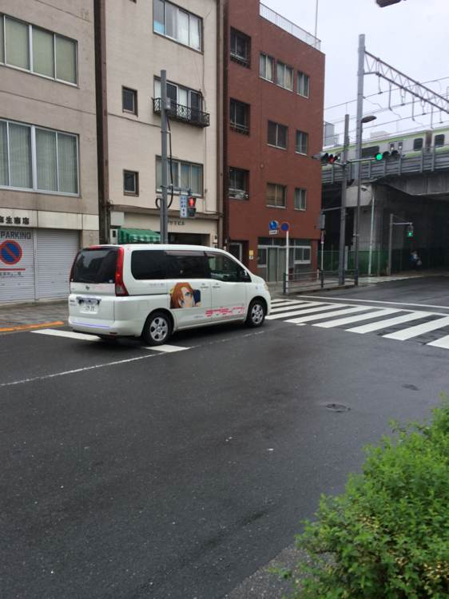
  

112楼 | nbbllxx | 2014-08-28 12:55
    
    2015-02-10 02:53 | 反叛Ving:
    > 莫名想起无头骑士
    2015-02-10 07:34 | nbbllxx:
    > 回复 反叛Ving ：都是在东京咯
* * *

  

113楼 | 一夏一倾城丶 | 2014-08-28 13:00
* * *
哇，表示好想去秋叶原，圣地啊
  

114楼 | 夜点金 | 2014-08-28 13:23
* * *
乘新干线回关西了～明天回国。有兴趣可以看我在京骚戏画吧发的京骚戏画圣地巡礼，还有部分视频动态能在我的instagram: filmdan_1916里找到！
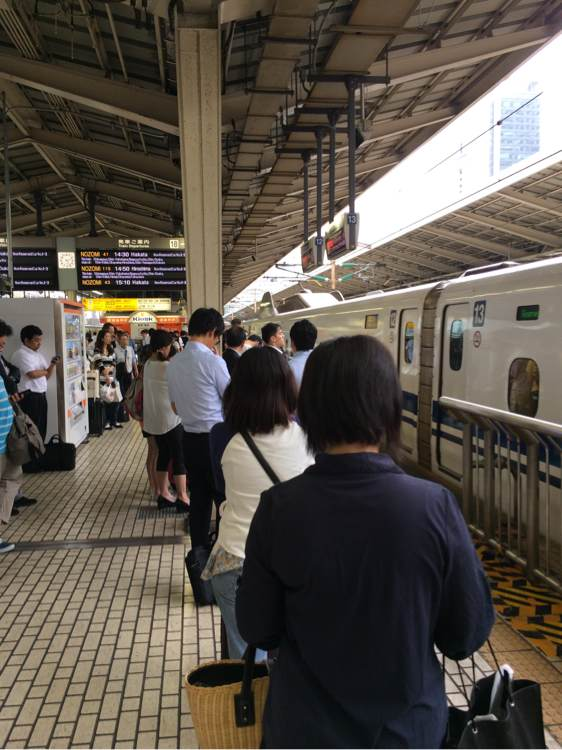
  

115楼 | nbbllxx | 2014-08-28 13:26
    
    2014-08-28 13:30 | nbbllxx:
    > 生放送完了しました(=ﾟωﾟ)ﾉ
    2014-12-15 20:39 | 4啊2啊:
    > 新干线e2？
* * *
秋叶原才逗留了半小时左右...难道楼主没有想买的吗？
  

116楼 | 蒸汁银☔ | 2014-08-28 13:58
    
    2014-08-28 14:05 | nbbllxx:
    > 这个真没有。。本来东京也不想去了，后来想想闲着也是闲着
    2014-08-28 18:56 | 蒸汁银☔:
    > 回复 nbbllxx ：
* * *
这就是空的取材地吗，好神圣的赶脚！！
  

118楼 | mu3772 | 2014-08-28 20:00
* * *
这个时候来晚了点吧，不过还是来顶了
  

119楼 | 一句话儒家 | 2014-08-28 20:01
* * *
赞……楼主土豪~~~………… 
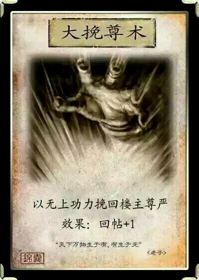
  

120楼 | 790186513 | 2014-08-28 20:04
* * *
留名
  

121楼 | 骷髅猿人 | 2014-08-28 20:04
* * *
留名
  

122楼 | 浅忆凉城 | 2014-08-28 20:05
* * *
满满的既视感 有机会一定要去
  

123楼 | 骷髅猿人 | 2014-08-28 20:09
* * *
神之召唤@星辰繁影 @苗叉1
  

124楼 | 堕落者01 | 2014-08-28 20:09
    
    2014-08-28 22:13 | 苗叉1:
    > 谢谢艾特~这贴好棒
    2014-08-28 22:14 | 堕落者01:
    > 回复 苗叉1 :好事一起分享。。。。
    2014-08-28 22:54 | 星辰繁影:
    > 额
    2014-08-28 23:43 | 堕落者01:
    > 回复 星辰繁影 :呵呵。。。
* * *
火留♝
  

126楼 | 老板来斤节操 | 2014-08-28 20:10
* * *
这个世界上总有那么一些人，他们英勇无畏，固执，乃至偏执，放荡不羁，骄傲，而又狂妄。即使到 了绝境，他们也绝不妥协，宁愿死，也不愿输。
  

127楼 | 堕落者01 | 2014-08-28 20:14
* * *
好羡慕楼主……好想去，好想看到穹和悠生活的地方，感觉离二次元更近了一步
  

128楼 | 搞死希特勒 | 2014-08-28 20:32
* * *
【图片】
  

129楼 | 吴轩颖 | 2014-08-28 20:35
* * *
围观=w=  
\--这个楼主好可爱呀
  

130楼 | 吴轩颖 | 2014-08-28 20:35
* * *
一股令楼主都战栗的气息压塌了苍穹，本屌丝来了！本屌深邃的双眼中有无尽日月星辰，举手投足间竟有大道在共鸣。只见本屌动了，一只古朴的大手横跨无数楼层，直压楼主而来。2楼承受不住这股气息，直接崩碎。3楼忍不住袱跪下去，不甘地大吼：“他都快无敌了！就算没用迈入那一领域，也差不多了！”头发早已花白的4楼娇躯一颠，双眼迸发出惊人的神采：“竟然是他，那个曾经一炮撸死无数楼主的人，多少年没有出手，不想又这般出世，手速似乎更加恐怖了！”楼主看着本屌的大手携着极道撸兵而来，不由得感到裤裆一寒，竟已化为一片混沌，不禁老泪纵横，一声苍老的叹息回荡在整片星域：“撸管尽头谁为峰，一见此屌鸟成空！”他天空加身，  
他魔剑在手。  
他权倾一方，  
他点草全服。  
他强打红字，  
他挥金如土。  
他装备牛逼，  
他瞎人狗眼。  
他独自存活，  
他引领全球。  
他风流潇洒，  
他妻妾成林。  
他言必黄字，  
他万众瞩目。  
他三教九流，  
他领嗨全场。  
他双刀不是无色，  
他艹尽不服之人。上帝的骑宠，上古时期世界的霸主。  
┏┛┻━━━┛┻┓  
┃｜｜｜｜｜｜｜┃  
┃ ━ ┃  
┃ ┳┛ ┗┳ ┃  
┃ ┃  
┃ ┻ ┃  
┃ ┃  
┗━┓ ┏━┛  
┃ 史 ┃   
┃ 诗 ┃   
┃ 之 ┃   
┃ 宠 ┃  
┃ ┗━━━┓  
┃经验与我同在 ┣┓  
┃攻楼专用宠物 ┃  
┗┓┓┏━┳┓┏┛  
┃┫┫ ┃┫┫  
┗┻┛ ┗┻┛  
看帖回帖！
  

132楼 | Q弟侦探因番 | 2014-08-28 20:43
* * *
看完还是留个名吧，楼主辛苦了
  

133楼 | hjazz233 | 2014-08-28 20:46
* * *
留
  

134楼 | 说不尽的一句话 | 2014-08-28 20:48
* * *
感觉想去日本了的样子～
  

135楼 | ZX1998TS | 2014-08-28 21:02
    
    2015-08-04 09:28 | Kirito丶SQ:
    > 怎么和他们沟通？
* * *
火前留名
  

137楼 | 古可渚 | 2014-08-28 21:04
* * *
牛
  

138楼 | 呵呵不871 | 2014-08-28 21:07
* * *
顶顶。
  

139楼 | 无相众生相 | 2014-08-28 21:26
* * *
顶
  

140楼 | lose丶珞羽 | 2014-08-28 21:44
* * *
赞~  
没想到神社真有穹妹的爱好者留下的痕迹啊  
唯一是没有芦之湖有点可惜感觉会是很漂亮的景色
  

141楼 | lj709199609 | 2014-08-28 21:47
    
    2015-02-21 00:34 | 燈芯✨:
    > 这湖有的，前面有链接
    2015-07-15 19:00 | 蔚蓝天空丶青涩:
    > <http://tieba.baidu.com/p/1987065359>链接送上
* * *
好顶赞火钳刘明
  

142楼 | -岸波白野 | 2014-08-28 21:53
* * *
火钳刘明！
  

143楼 | 86481417 | 2014-08-28 21:55
* * *
流弊！！！
  

144楼 | | 2014-08-28 21:56
* * *
卧槽
  

145楼 | 血色狂物 | 2014-08-28 22:04
* * *
楼主简直赞好羡慕
  

146楼 | 苗叉1 | 2014-08-28 22:07
* * *
插个楼
  

147楼 | 无名2142 | 2014-08-28 22:20
* * *
看重点，我才发现，这是下了缘之空插曲后的。。。  
主角是因为自己的妹妹。。。 
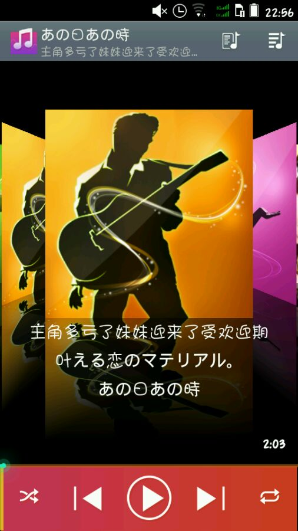
  

148楼 | 月月妹妹smile | 2014-08-28 22:57
    
    2015-05-26 06:27 | 秦磊哦:
    > 插曲是哪个？
* * *
壕楼主
  

151楼 | 茅场司🙈 | 2014-08-29 06:46
* * *
我也想去啊。。。。
  

152楼 | snowkiss冷 | 2014-08-29 10:01
* * *
错过了直播。。。
  

153楼 | 当我迷路 | 2014-08-29 11:48
* * *
看完贴 留个名  
给土豪楼主凑足十五字
  

154楼 | 星环城之殇 | 2014-08-29 12:19
* * *
马克
  

155楼 | Fworks_sky | 2014-08-29 12:25
* * *
真的有这个地方啊，百度百科上居然没有说
  

156楼 | 碎月🌙 | 2014-08-29 13:10
    
    2014-08-29 13:27 | nbbllxx:
    > 度娘百科，小阅怡情大读伤身
* * *
很厉害的样子
  

157楼 | 诗若兮 | 2014-08-29 16:30
* * *
顶顶
  

158楼 | 香风智乃💝 | 2014-08-29 17:51
* * *
好棒
  

159楼 | 女王情人 | 2014-08-30 00:13
* * *
已在全国最大同性交友网站上传巡礼视频，还在过审核
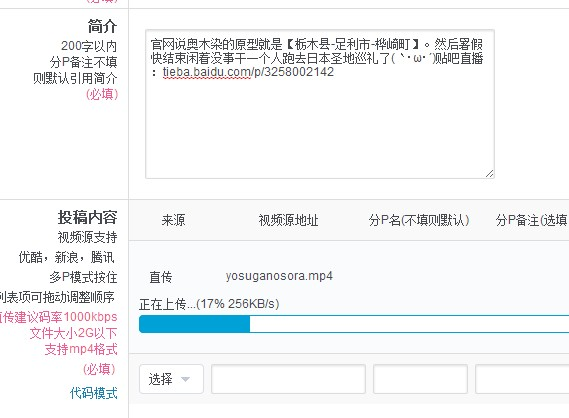
  

160楼 | nbbllxx | 2014-08-30 13:27
    
    2014-08-30 16:27 | nbbllxx:
    > <http://www.bilibili.com/video/av1483076/>
    2014-08-31 10:37 | 西伯利亚森林😺:
    > lz有邀请码吗？
    2014-08-31 11:02 | nbbllxx:
    > 回复 686ljs686 :已发私信
    2014-08-31 13:39 | 西伯利亚森林😺:
    > 回复 nbbllxx :收到了，谢谢
    2014-09-01 00:54 | KD🌊:
    > 回复 nbbllxx 是真爱！！
    2014-09-01 00:54 | KD🌊:
    > 话说，楼主混A站嘛？
    2014-09-01 10:04 | nbbllxx:
    > 回复 夕阳与月cc ：不混～怎么少年你要转发嘛
    2014-09-01 10:08 | KD🌊:
    > 回复 nbbllxx :你去发嘛~
    2014-09-01 10:12 | nbbllxx:
    > 回复 夕阳与月cc :没id 你肯发的话帮忙发一下，我是b站直传的。等下会传个网盘高清
    2014-09-01 12:07 | KD🌊:
    > 回复 nbbllxx :A站支持原创up主哦~~你发视频的话是可以注册的~
    2014-09-01 14:41 | nbbllxx:
    > 回复 夕阳与月cc :那算了..id都没有没法传...平时也不上a站
    2014-09-02 19:41 | KD🌊:
    > 回复 nbbllxx :好伐…
    2014-10-26 10:59 | 东山未央♬:
    > 回复 nbbllxx :我来帮你传嘛~ 我还没过呢~~
    2014-10-27 23:37 | nbbllxx:
    > 回复 tyler51299 : [[无效] http://pan.baidu.com/s/1dDvQhVz](http://pan.baidu.com/s/1dDvQhVz)在这里，我A站没有邀请码你帮忙传下吧~
    2014-10-28 12:48 | 东山未央♬:
    > 回复 nbbllxx :取消了= =
    2014-10-29 04:49 | nbbllxx:
    > 回复 tyler51299 : 哦抱歉抱歉，昨天因为开了几次分享就把重复的删了..<http://yun.baidu.com/share/home?uk=2667936873>这里这里，那个mp4文件就是
    2014-10-29 13:19 | 东山未央♬:
    > 回复 nbbllxx :上传了。不知道怎么样。还在审核中
    2014-10-29 15:00 | nbbllxx:
    > 回复 tyler51299 : 大thx
* * *
略屌
  

163楼 | 贴吧用户_028CEWe | 2014-08-31 11:28
* * *
LL大法好、
  

165楼 | 三色彩虹💤💤💤 | 2014-08-31 13:42
* * *

  

166楼 | book杭 | 2014-09-02 20:00
* * *
刘明
  

167楼 | 大发光火以后 | 2014-09-02 21:48
* * *
lz，我可以转到空间里面么？
  

168楼 | 沉默之虚空 | 2014-09-08 19:28
    
    2014-09-09 19:26 | nbbllxx:
    > 可以可以，标注原帖地址或者我b站id好了，视频连接在160L
    2014-09-10 00:15 | 沉默之虚空:
    > 回复 nbbllxx :嗯嗯
* * *
这绿化。。。。。再看看我大天朝的绿化。。。。。。
  

170楼 | Dream天青 | 2014-09-09 19:37
* * *
聪明把聪明归功于我，愚钝把愚钝归功于我。我想他俩都是对的。The understanding attributes to me understanding and the dull,dullness.I think they are both right.
  

172楼 | 殆景 | 2014-09-10 01:28
* * *
@轻音乐   
@妹妹怀上我孩子
  

173楼 | 和妹妹生个女孩 | 2014-09-15 17:23
* * *
十五字啊！十五字！算了不水——做一条萌萌的小尾巴
  

174楼 | 2214354661 | 2014-10-26 11:10
* * *
顶
  

175楼 | 初三hentai | 2014-10-26 11:15
* * *
留名
  

176楼 | 妖星再现🌌 | 2014-10-26 12:42
* * *
楼主加油  
\--------------------  
在神圣的春日野穹面前，我庄严宣誓加入《妹控党》，遵照先辈伟大而崇高的理想，继承先辈未完成的事业，用自己的一腔热血，为自己最亲爱的妹妹无条件护卫，将自己的禁忌之心，无私地奉献给妹控事业，保护妹妹的成长，捍卫妹妹的快乐，永不背叛，时刻准备着为心爱的妹妹而献身！”
  

177楼 | 尖睿湿疣🍺 | 2014-10-27 23:54
* * *
楼主在日本上学么？
  

178楼 | LMZ745373820 | 2014-10-29 09:18
    
    2014-10-29 14:59 | nbbllxx:
    > 没有啊 在加拿大上学 日本是八月份自己一个人闲着没事干就去玩了
    2014-10-29 16:16 | LMZ745373820:
    > 回复 nbbllxx :壕
    2015-02-10 09:17 | 黛娜-薇丝琳:
    > 土豪
* * *
楼主花了多少钱
  

179楼 | 结衣的心zy | 2014-10-29 15:11
    
    2014-10-29 16:27 | nbbllxx:
    > 前面有统计过 9天下来一万，主要是在关东关西乱跑火车票就花了两千多，另外机票也没买特价的也多了一千多；奈良住了一个比较好的宿多花了大概一千多的预算，减掉的话就是一般的自由行预算了
    2014-10-29 16:28 | 结衣的心zy:
    > 回复 nbbllxx :那就是一共一万左右咯…？
    2014-10-29 16:32 | nbbllxx:
    > 回复 结衣的心zy : 看了下卡是花了一万出点头... 细细统计很难说
    2014-10-29 16:39 | 结衣的心zy:
    > 回复 nbbllxx :到时候我也去玩玩
    2015-06-25 02:13 | 布拉德莱克:
    > 回复 nbbllxx :嗯。。1000是rmb？
    2015-06-25 09:19 | nbbllxx:
    > 回复 布拉德莱克 :全是人民币
    2015-06-26 00:01 | 布拉德莱克:
    > 回复 nbbllxx :十分感谢
* * *
出来吧召唤兽←_←@默默的丶愛妳 @二次元之瑛
  

180楼 | 哎还回来吗 | 2014-10-29 17:35
    
    2014-10-29 18:58 | 林筱墨♀:
    > ，→_→
* * *
呐，充满回忆的小镇，楼主也真是有心发帖
  

181楼 | 鏡丶花水月 | 2014-11-16 21:35
* * *
实景的存在，本身就是一种意义。楼主辛苦啦，也是为吾一介妹控（单指ソラ）埋下一心夙愿。私は本当にありがとう.
  

183楼 | 鏡丶花水月 | 2014-11-16 21:54
* * *
好帖啊
  

184楼 | Naiveº | 2014-11-16 22:51
* * *
6
  

185楼 | 倾生一世只为你 | 2014-11-17 11:47
* * *
顶
  

186楼 | lovezhaojin8 | 2014-11-17 12:58
* * *
真有这地方啊
  

187楼 | 阳光小孩游天外 | 2014-11-17 13:28
    
    2014-11-17 13:41 | nbbllxx:
    > 恩 很多很多动漫都有自己的取材地的；因为架空太难了
    2014-11-17 22:35 | 阳光小孩游天外:
    > 回复@nbbllxx :楼主去日本这玩那玩的，花了多少大洋，换成日元是多少啊，我也想去
    2014-11-17 22:52 | nbbllxx:
    > 回复 阳光小孩游天外 : 9天一万多一点 ，但是因为我是自己一个人，在旅馆上也花钱不是很省，如果省着用或者有别人陪去的话会便宜很多
    2014-11-18 07:45 | 阳光小孩游天外:
    > 回复@nbbllxx :楼楼是会日语的吗？当地人很友善吧，跟团科学吗？
    2014-11-18 09:33 | nbbllxx:
    > 回复 阳光小孩游天外 : 跟团是没人会去足利市这种地方的；日语自己学了点日常沟通暂且没问题，大城市的话还有大部分酒店前台都会讲英语所以也不是很难（不过如果去偏一点的地方就没几个人会讲了），然后就是日式英语的口音问题。人的话还是比较友善的，很有礼貌也很有耐心
* * *
@于子上体 埋葬在那吧
  

188楼 | 水到世界末日 | 2014-11-17 13:42
* * *
视频没了
  

189楼 | Naiveº | 2014-11-17 17:40
    
    2014-11-17 17:49 | nbbllxx:
    > <http://www.bilibili.com/video/av1483076/>还有<http://yun.baidu.com/share/home?uk=2667936873#category/type=0>这两个都还在啊就是b站那个偶尔会抽风刷新不出来，然后压缩成4:3了 最近在查资料打算补档
* * *
有妹恨妹不是穹。。。
  

190楼 | 鏡丶花水月 | 2014-11-23 12:02
* * *
无妹恨穹不是妹。。。
  

191楼 | 鏡丶花水月 | 2014-11-23 12:02
* * *
楼楼都不回我们这些渣渣楼，嘛，看帖才是重点。。。。
  

192楼 | 鏡丶花水月 | 2014-11-23 12:04
    
    2014-11-23 18:56 | nbbllxx:
    > 我怕他们说我水
    2014-11-23 23:29 | 鏡丶花水月:
    > 回复 nbbllxx :8月帖火到11月这是水的标准？
    2014-11-24 03:12 | nbbllxx:
    > 回复 鏡丶花水月 :每次莫名其妙被顶上来我怕他们看到68L
* * *
又被顶上来了啊~~
  

193楼 | halukunosola | 2014-11-23 19:40
* * *
来来来。大家看68楼。我做好事了
  

195楼 | 东山未央♬ | 2014-11-24 15:59
* * *
听说日本交通费用挺高的 不知道楼主交通费用花了多少
  

196楼 | 毛利J五郎 | 2014-11-24 16:37
    
    2014-11-24 18:25 | nbbllxx:
    > 我从关西出发的，然后回到大阪，交通总共花了40000日元左右吧。去桦崎如果在羽田这种地方下飞机会方便点
    2014-11-24 20:19 | 毛利J五郎:
    > 回复 nbbllxx :。。。。交通费2000多软妹币啊--------------In solitude,where we are least alone
    2014-11-24 20:31 | nbbllxx:
    > 回复 毛利J五郎 : 你要是想去可以直接用navitime找价格；印象中东京出发估计一万多点来回，，可能还不用
    2014-11-24 20:36 | nbbllxx:
    > 回复 nbbllxx : 东京出发完全不用，看101L来回只要4000就够了；我印象中从奈良过去1.5万，那边回来大阪1.6万，大阪到奈良一两千，外加很多巴士、打的、地铁。地铁起步价130日元左右
    2014-11-24 21:09 | 毛利J五郎:
    > 回复 nbbllxx :作为以后旅行的参考--------------In solitude,where we are least alone
* * *
这可是窝将来的毕业旅行  
不过箱根什么的真的这么不好找吗……  
\--吓得我喝了一桶妹汁
  

197楼 | lego🐶 | 2014-11-24 20:42
    
    2014-11-24 20:50 | nbbllxx:
    > 箱根很好找，比桦崎有名多了，温泉圣地，不过就一个湖别的和缘之空就没什么关系了
    2014-11-24 20:51 | lego🐶:
    > 回复 nbbllxx :芦之湖和八幡宫完全不是一个地方吗……　　　--吓得我做起了布朗运动
    2014-11-24 20:55 | nbbllxx:
    > 回复 sunheqi2000 :完全不一样
    2014-11-24 21:10 | lego🐶:
    > 回复 nbbllxx :突然间好失望……如果八幡宫后面跟着一个大湖一定好霸气　　　--吓得薛定谔都养狗了
    2014-11-24 22:07 | nbbllxx:
    > 回复 sunheqi2000 :本来就是小小一撮神社
    2014-11-24 22:10 | lego🐶:
    > 回复 nbbllxx :lz这一趟旅行花销多大，如果从东京折返呢……　　　--吓得我砸烂了新买的泰坦手机
    2014-12-14 22:55 | nbbllxx:
    > 回复 sunheqi2000 : 算上关西到关东回关西折返9天一万多，只是在关东下飞机去的话会便宜很多，便宜个三四万日元吧
* * *
  
栃木？
  

198楼 | 贴吧用户_0C1XK9t | 2014-11-24 20:42
    
    2014-11-24 20:50 | nbbllxx:
    > 恩 在栃木县
* * *
这地方是因为缘之空才出名的吧，明年高考学动漫
  

200楼 | LHQ19970821 | 2014-12-14 20:26
    
    2014-12-14 22:35 | nbbllxx:
    > 嗯…原来只是农业和学校比较有名
    2016-02-07 18:05 | 丿影S幻飘灬:
    > 明年高考，学动漫！ 同！
    2016-02-07 18:06 | 丿影S幻飘灬:
    > 是缘之空让我有了这样的方向
* * *
有机会也要去
  

201楼 | 嘭次打打次打 | 2014-12-14 22:49
* * *
有钱 任性
  

202楼 | 晃和千世子º | 2014-12-15 01:22
* * *
好想去啊
  

204楼 | 贴吧用户_08bURM2 | 2014-12-15 20:22
* * *
我以后有机会也去看看 ~ 不会日语可以吗？LZ?
  

205楼 | 花落只剩孤漠 | 2014-12-25 21:20
    
    2014-12-25 22:20 | nbbllxx:
    > 不会日语起码要英语和听得懂日式英语，当然翻译软件也行就是慢而且有的地方没网络
    2014-12-25 22:22 | 花落只剩孤漠:
    > 回复 nbbllxx ：啊理噶多
* * *
→_→
  

210楼 | ____好淫 | 2014-12-25 22:03
* * *
留名
  

211楼 | ____好淫 | 2014-12-25 22:03
* * *
66666
  

212楼 | 白夜先生丶 | 2014-12-25 22:29
* * *
补充一下足利市其他地方的风光  
这些照片在LZ在3L发布的度盘连接里都有
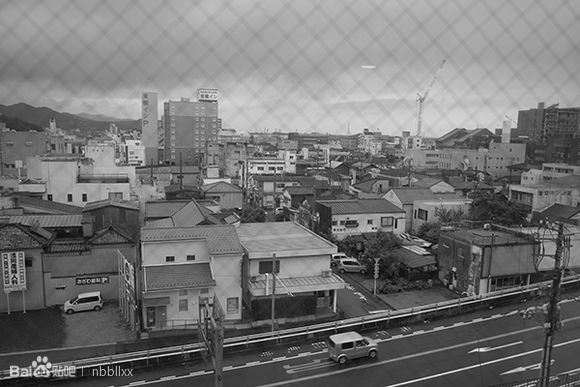
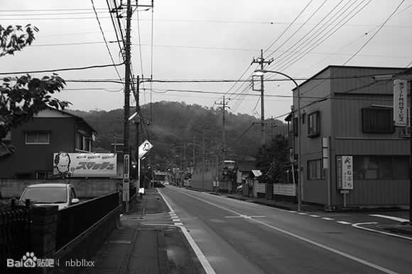
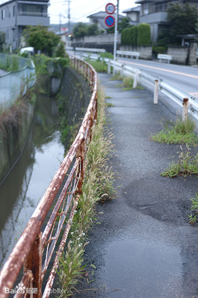
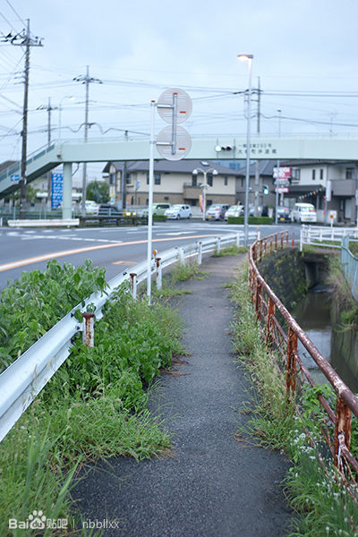
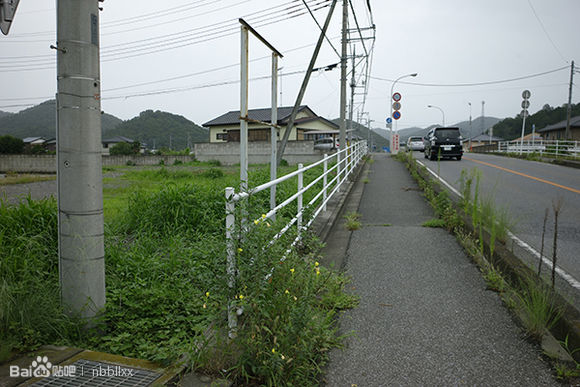
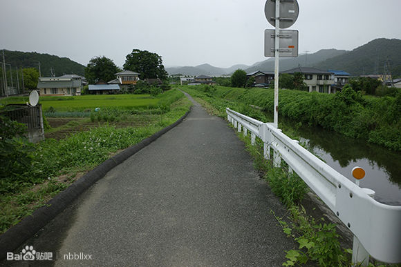
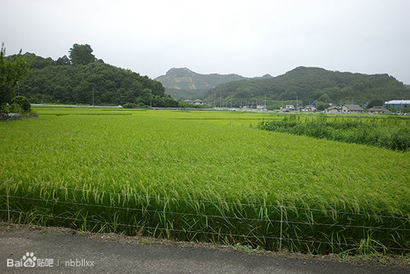
  

213楼 | nbbllxx | 2015-01-14 11:23
    
    2017-02-10 19:06 | 1044891437qw:
    > 有几张图是动漫里穹妹掉河的地方！
* * *
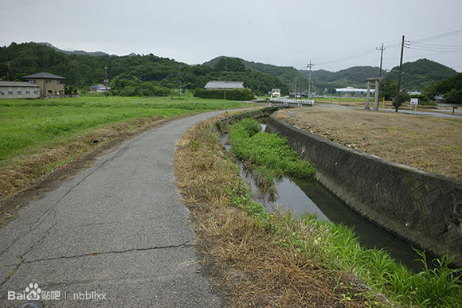
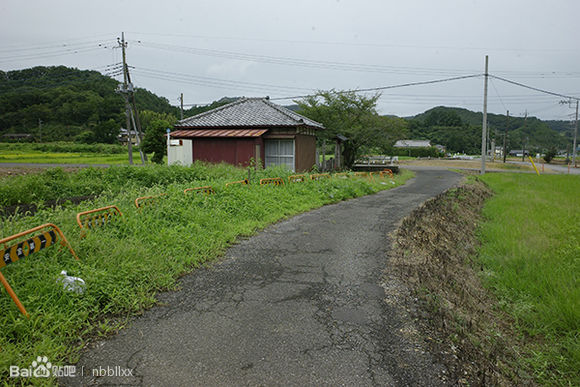
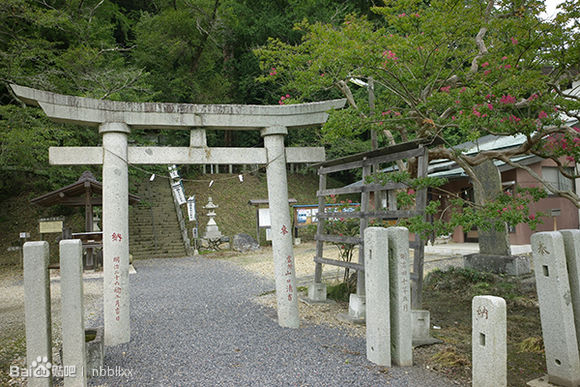
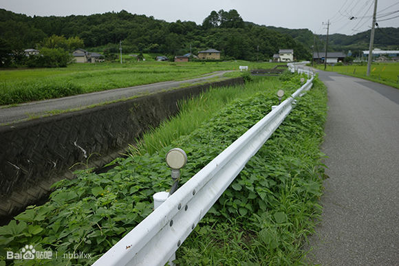
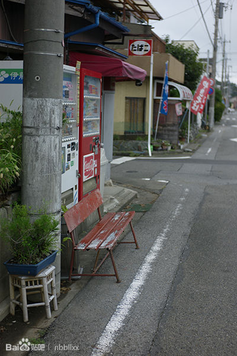
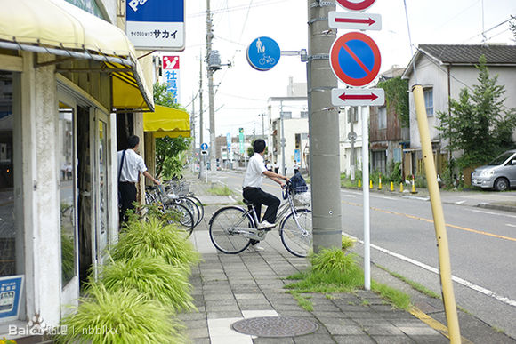
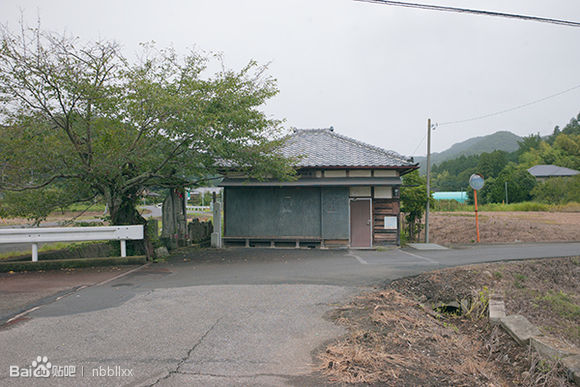
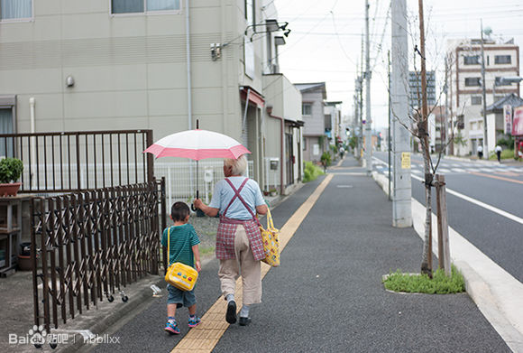
  

214楼 | nbbllxx | 2015-01-14 11:27
    
    2015-01-14 22:30 | 鏡丶花水月:
    > NICE！
    2015-01-15 13:15 | 青天遇雨:
    > 收藏！
* * *
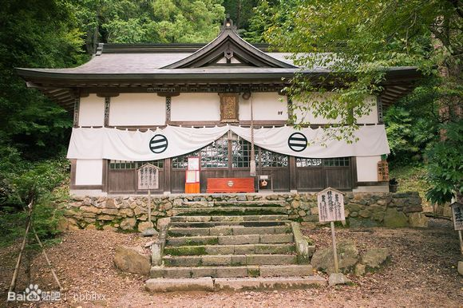
这张目前是LZ的桌面  
有需要的话可以向LZ要大图
  

215楼 | nbbllxx | 2015-01-14 11:30
    
    2015-01-14 22:31 | 鏡丶花水月:
    > 果断求1080
    2015-01-14 22:32 | 鏡丶花水月:
    > 1392001873@qq.com发图来我就不告诉他们68L的秘密
    2015-01-15 01:37 | nbbllxx:
    > 回复 鏡丶花水月 :已发
    2015-01-15 08:14 | 鏡丶花水月:
    > 楼楼是真爱
    2015-02-17 22:42 | 袭人143:
    > 求图
    2015-02-17 22:44 | 袭人143:
    > 1099167993@qq.com
    2015-03-23 10:11 | 寂984:
    > 求桌面1767782751@qq.com
    2015-03-23 11:49 | nbbllxx:
    > 回复 寂984 :已发 @袭人143 抱歉刚刚才看到...发给你了
    2015-05-31 10:18 | Amidy丶影行:
    > 楼主还在吗。。。求发amidynh@sina.com。。。蟹蟹
    2015-05-31 15:21 | ▫为你宽衣▫:
    > 求发
    2015-05-31 16:46 | nbbllxx:
    > 回复 鬼头刀45 ： 给下邮箱我回去翻翻
    2015-05-31 18:18 | ▫为你宽衣▫:
    > 回复 nbbllxx :1254961614@qq.com卤煮好人
    2015-07-06 23:40 | nbbllxx:
    > 楼上三位已补发
    2015-08-05 14:05 | 荤食主义者丶:
    > 回复 nbbllxx :求无水印图
    2015-08-05 17:01 | nbbllxx:
    > 回复 荤食主义者丶 :邮箱...
    2015-12-08 15:49 | ✨海鸠✨:
    > 13552000655@163.com 楼主求发
    2015-12-08 15:49 | ✨海鸠✨:
    > @nbbllxx
    2015-12-08 22:14 | nbbllxx:
    > 回复 srh1357986420 ：看到了，等下发
    2015-12-11 22:52 | ✨海鸠✨:
    > 回复 nbbllxx :谢谢楼主啦
    2016-10-31 23:37 | Sola🎀:
    > 1018591223@qq.com
    2016-11-12 21:01 | Forever____fxs:
    > 楼主，2358688860@qq.com。给我，不然我就把68楼搬出来。@nbbllxx
* * *
楼主，弱弱的问你一句，你到日本说的是日语还是英语.....
  

216楼 | 猫猫芝麻酱🌸 | 2015-01-14 11:56
    
    2015-01-14 12:16 | nbbllxx:
    > 日英混杂，大城市大多能讲英语，小地方车站很难讲清楚
* * *
@帅气刘璋
  

217楼 | º◎Alex | 2015-01-14 12:24
    
    2015-01-14 12:26 | 帅气刘璋:
    > ……
* * *
我勒个去，看完了，城市好美丽。楼主回去的那趟新干线车型很像咱大陆的和谐号动车组
  

218楼 | 赵常😷😷 | 2015-01-14 15:04
    
    2015-01-14 15:32 | nbbllxx:
    > 我没有拍新干线啊国内动车内饰站台都是仿日本的，有些车的商务席甚至比日本的还舒服
    2015-01-14 15:51 | 赵常😷😷:
    > 回复 nbbllxx :好羡慕，我是个苦逼学生党，处处受父母管制
* * *
楼主是自己去的吗？还是组团  
\--撑不住的时候可以说我好累但永远不要说我不行
  

219楼 | 不破爱花🌈 | 2015-01-14 16:10
    
    2015-01-15 01:03 | nbbllxx:
    > 自己去的
    2015-01-15 06:49 | 不破爱花🌈:
    > 回复 nbbllxx :好想去啊！　　　--来自助手版贴吧客户端
    2015-01-24 13:34 | nbbllxx:
    > 回复 大吊12138 :那就去嘛
* * *
楼主 这一趟大概要花多少钱今年高考完想去
  

221楼 | 回忆丨寄放窗口 | 2015-01-21 22:24
    
    2015-01-24 12:26 | 回忆丨寄放窗口:
    > 回复 nbbllxx :哦哦
* * *
楼主看完你的帖子我久久不能平静，你到底什么时候直播吃翔？
  

222楼 | White5💥 | 2015-01-21 22:53
    
    2015-01-22 03:48 | nbbllxx:
    > 
* * *
真好人
  

224楼 | 贽殿遮那🔥 | 2015-01-23 23:25
* * *
话说我去日本的时间和楼主差不多呢，只不过当时不知道奥木染还有原型，就没有去，真是可惜啊，只去了秋叶原和其他地方 
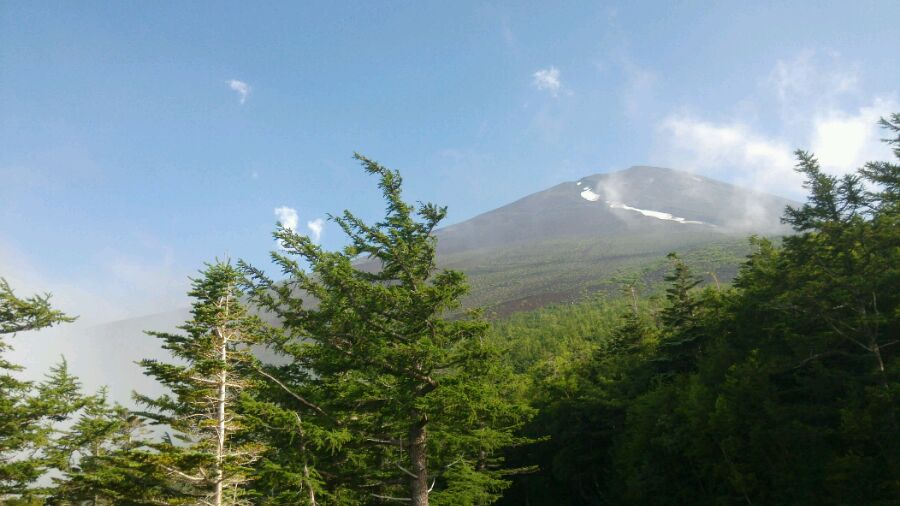
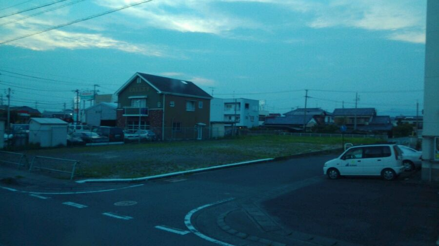
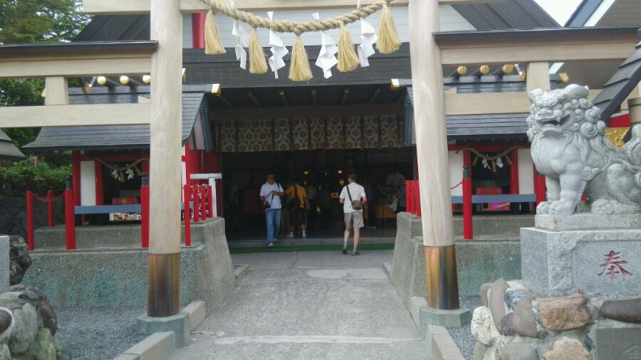
  

227楼 | 001100xzt | 2015-01-30 23:58
    
    2015-01-31 00:00 | 001100xzt:
    > 第一张是富士山，第二张是一个小镇，第三张是神社，秋叶原照片找不到了
    2015-01-31 03:13 | nbbllxx:
    > 关东没怎么逛，主要还是关西兜一圈，顺带去足利
    2015-02-01 06:57 | 001100xzt:
    > 回复 nbbllxx :嗯，好想去！
* * *
话说我去日本的时候还不知道诶，真可惜，只去了秋叶原和其他的一些地方 
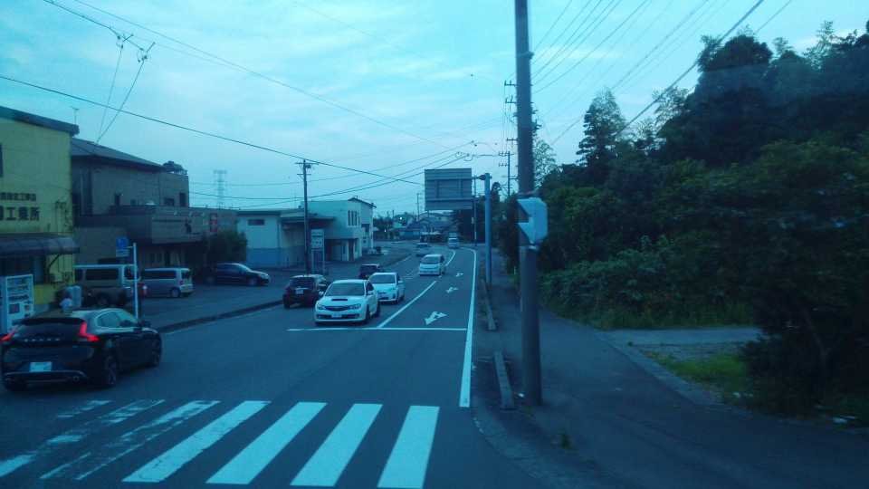
  

228楼 | 001100xzt | 2015-01-31 00:05
    
    2015-02-17 10:56 | nbbllxx:
    > 图片里这地方其实挺像ashikaga的
* * *
什么鬼？
  

229楼 | 你的亲生父亲h | 2015-01-31 21:14
    
    2015-02-01 03:29 | nbbllxx:
    > 圣地巡礼啊什么什么鬼？
    2015-02-01 11:53 | 你的亲生父亲h:
    > 回复 nbbllxx :懂了
* * *
楼主，这是大小姐叶一的家→_→ 
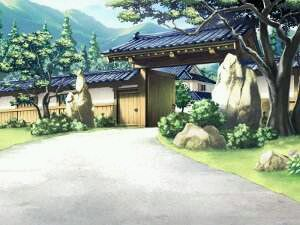
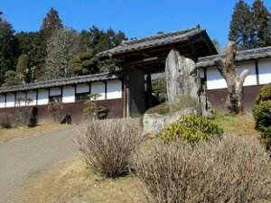
  

230楼 | 你的亲生父亲h | 2015-02-01 12:09
    
    2015-02-01 13:49 | nbbllxx:
    > 引用的 都看腻了 我没找到 下次你有机会找到一定拍照片分享
    2015-02-01 14:56 | 你的亲生父亲h:
    > 回复 nbbllxx :楼主你那个视频的背景音乐的名字是什么?跪求。
    2015-09-30 21:44 | heart十九世纪:
    > 一叶
* * *
下场去日本的时候也去看看
  

231楼 | w15f | 2015-02-01 12:18
    
    2015-02-01 13:50 | nbbllxx:
    > 嗯
    2015-02-01 13:57 | w15f:
    > 回复 nbbllxx :上次去日本只去了大阪和神奈川还有东京
    2015-02-01 15:10 | nbbllxx:
    > 回复 w15f :看风光南边的濑户内海 北边的北海道 人文有中间的名古屋附近的客栈森林铁道 还有关西的古都奈良京都 都很好日本估计今年暑假还要再去一次 魅力太大了
    2015-02-01 17:13 | nbbllxx:
    > 回复 w15f : 不，去之前做了功课，因为手机里也买了一些日本的摄影器材杂志所以比较了解
    2015-02-01 17:18 | w15f:
    > 回复 nbbllxx :好吧
* * *
楼主太壕
  

232楼 | 乌云458 | 2015-02-01 14:10
    
    2015-02-01 15:07 | nbbllxx:
    >  头像的相机是什么？m42口还是exa口的德产机型么
    2015-02-01 15:51 | 乌云458:
    > 回复 nbbllxx :不太清楚
* * *
楼主诱惑我去日本
  

233楼 | 狂三嫁给我啊 | 2015-02-01 15:27
    
    2015-02-01 15:36 | nbbllxx:
    > 去吧去嘛
    2015-02-01 15:37 | 狂三嫁给我啊:
    > 回复 nbbllxx :我应该回去日本留学，高二就走……除非我没拿到毕业证
    2015-08-07 10:46 | START李雨:
    > 回复 狂三嫁给我啊 :层主高二就走？我高三下学期初走
    2015-08-07 13:34 | 狂三嫁给我啊:
    > 回复 START李雨 :……弄错了，我也是高三走……
    2015-08-07 13:44 | START李雨:
    > 回复 狂三嫁给我啊 :层主是明年4月吗
    2015-08-07 13:46 | 狂三嫁给我啊:
    > 回复 START李雨 :……明年10月啊…我高考完再走
    2015-08-07 13:52 | START李雨:
    > 回复 狂三嫁给我啊 :好吧，我是四月
    2015-08-07 13:54 | 狂三嫁给我啊:
    > 回复 START李雨 :……
    2015-08-10 20:59 | nbbllxx:
    > 回复 狂三嫁给我啊 ：为什么十月入学…
    2015-08-11 06:59 | 狂三嫁给我啊:
    > 回复 nbbllxx :……我们日语老师说的……
    2015-08-11 07:01 | nbbllxx:
    > 回复 狂三嫁给我啊 ：不会是早稻田一类国际学校吧…不都是春天入学的嘛
    2015-08-11 07:04 | 狂三嫁给我啊:
    > 回复 nbbllxx :……语言学校类！(ಥ_ಥ)
* * *
楼楼   
——世界再大还是遇见了你，世界再小还是弄丢了你。  

  

234楼 | 小世界小清新 | 2015-02-16 17:16
    
    2015-02-17 22:47 | 袭人143:
    > 我以为你只对我一个人说过这句话
    2015-02-18 13:54 | 小世界小清新:
    > 回复 袭人143 :难道你看出来了？ ——等待，是人一生中最初的苍老。　伦家可不是小尾巴哦╭(╯ε╰)╮
    2015-05-26 06:42 | 秦磊哦:
    > 什么鬼？新世纪潮流？我秦朝穿过来的有点不懂你们说的话麻烦再详细一点
* * *
邮件已发给以下收件人：  
479802260<479802260@qq.com>此联系人未保存，您可以修改并保存  
804605828<804605828@qq.com>此联系人未保存，您可以修改并保存  
838591691<838591691@qq.com>此联系人未保存，您可以修改并保存  
2407432335<2407432335@qq.com>此联系人未保存，您可以修改并保存  
562211308<562211308@qq.com>此联系人未保存，您可以修改并保存  
850521255<850521255@qq.com>此联系人未保存，您可以修改并保存  
1035155415<1035155415@qq.com>此联系人未保存，您可以修改并保存  
378402888<378402888@qq.com>此联系人未保存，您可以修改并保存
  

235楼 | 小狮子快过来- | 2015-02-16 20:42
* * *
这个不是老贴么....怎么又置顶了。。。
  

236楼 | 最美的下雨天º | 2015-02-17 10:46
    
    2015-02-17 10:50 | nbbllxx:
    > 置顶？我不知道...反正每隔半个月都会有人翻出来的_(:зゝ∠)_
    2015-02-17 10:55 | 最美的下雨天º:
    > 回复 nbbllxx :~\(≥▽≤)/~楼主爱你！顶！
* * *
好棒啊，楼主用的什么设备啊
  

237楼 | 轻丶绘ˊ | 2015-02-17 12:17
    
    2015-02-17 12:31 | nbbllxx:
    > 基本都是手机拍的 有几张是相机
    2015-02-17 12:46 | nbbllxx:
    > 回复 nbbllxx :相机的话 基本就是Leica M8 加上福伦达 21/4
* * *
顶顶顶，吼～
  

238楼 | 千陌悠扬 | 2015-02-17 14:55
* * *
楼主，你还在日本不求你帮忙去奥木染町内会去问问，结局悠穹到底死没死啊
  

239楼 | 千陌悠扬 | 2015-02-17 15:15
    
    2015-02-18 00:22 | nbbllxx:
    > 没这个组织…我自己认为她死了
    2015-02-18 09:48 | 千陌悠扬:
    > 回复 nbbllxx :我也是觉得是，哪豪楼你不打算去游戏公司问问
    2015-02-18 11:13 | nbbllxx:
    > 回复 千陌悠扬 : 游戏公司当然说活着咯 后作的悠之空就是讲活着的事情，我说动画上看我感觉高桥丈夫是把他们写死了
    2015-02-18 11:14 | 千陌悠扬:
    > 回复 nbbllxx :5555555我觉得也是，谢谢楼楼
* * *

  

240楼 | LL123😱 | 2015-02-17 16:04
* * *
马克，不好意思挖坟了
  

241楼 | Lyrica- | 2015-02-17 16:49
* * *
挖得一手好坟
  

242楼 | 伊势🌌🌹 | 2015-02-17 17:57
* * *
@纯洁的杉崎键
  

243楼 | 一鞭一个小学生 | 2015-02-17 20:26
* * *
Yeah~
  

244楼 | 无形歌未来💫 | 2015-02-17 21:14
* * *
比我ID还逼真
  

245楼 | 花之宫🌸 | 2015-02-18 11:33
* * *

  

246楼 | 残余余温 | 2015-02-18 14:17
* * *
突然也好像去玩一次   
只要多动脑子即使吃甜食也不会胖
  

248楼 | 贝拉带👦走吧 | 2015-02-21 01:16
* * *
 是谁写下了史家之绝唱，无韵之离骚？  
答案：司马迁，是太监！是阉党！  
 是谁改良了造纸术，传承了人类文明？  
答案：蔡伦，是太监！是阉党！  
 是谁拓边西北，经略幽燕？  
答案：童贯，是太监，是阉党！  
 是谁，扬帆远航，扬国威于万里之外？  
答案：郑和，是太监！是阉党！  
 是谁只手遮天，压制祸国殃民的东林党  
答案：魏忠贤，是太监！是阉党！  
 是谁发此贴子骗我们回复的？  
答案：是楼主，……… 
  

250楼 | 芊羽桥ლ | 2015-03-14 16:40
    
    2015-05-26 06:44 | 秦磊哦:
    > 是阉人
    2015-05-29 19:48 | 古语之书:
    > ……别太明显了
* * *
lz带了多少钱去，玩了多久
  

251楼 | 星空泪痕o殇 | 2015-03-14 17:57
    
    2015-03-15 03:54 | nbbllxx:
    > 带了6万日元现金，其他刷卡总共一万多人民币，9天
    2015-03-15 08:56 | 星空泪痕o殇:
    > 回复 nbbllxx :今年暑假我打算和几个朋友去玩半个月每个人带1w购吗
    2015-03-15 10:44 | nbbllxx:
    > 回复 星空泪痕o殇 ：节约的用的话够了，减去买东西的钱，火车也少做，交通贵
    2015-03-15 10:51 | 星空泪痕o殇:
    > 回复 nbbllxx :我打算在成田下机，去箱根，东京，还有九州
    2015-03-15 10:54 | nbbllxx:
    > 回复 星空泪痕o殇 ：除了九州都还近的，三四千日元交通费，去九州应该飞机比火车便宜，反正一万预算很难说
    2015-03-15 10:54 | nbbllxx:
    > 回复 星空泪痕o殇 ：可能日本国内飞机票都要化掉三四千
    2015-03-15 10:54 | nbbllxx:
    > 回复 nbbllxx ：人民币
    2015-03-15 10:55 | 星空泪痕o殇:
    > 回复 nbbllxx :来回机票4000，从东京到九州来回机票3000
    2015-03-15 10:56 | 星空泪痕o殇:
    > 回复 nbbllxx 还剩下3000和基友们一起用应该可以吧
    2015-03-15 11:47 | nbbllxx:
    > 回复 星空泪痕o殇 ：每天200块不可能，至少我不可能
    2015-03-15 11:47 | nbbllxx:
    > 回复 星空泪痕o殇 ：世界上消费水平最高的国家之一
* * *
什么地方
  

252楼 | 狂三嫁给我啊 | 2015-03-15 10:24
* * *
谁又把坟挖出来了  
\----------------------我随手一打就是标准的十五字
  

253楼 | hu620688 | 2015-03-15 10:42
    
    2015-03-23 09:25 | 贽殿遮那🔥:
    > 你也在挖坟啊
* * *
想去
  

254楼 | 芊羽桥ლ | 2015-03-15 10:54
* * *
挖
  

255楼 | 乐色鸣雷♬♬♬ | 2015-03-23 02:07
* * *
春日野医院在哪里！！
  

256楼 | 貌似丶小偷 | 2015-03-23 08:49
    
    2015-03-23 10:05 | nbbllxx:
    > 不知道啊 路上偶尔看到的，感觉很像；动画中的春日野医院原型是制作人的亲戚家吧
* * *
目测帖子为转的吧原来看到别人发过，图片都一模一样
  

257楼 | 貌似丶小偷 | 2015-03-23 08:55
    
    2015-03-23 09:24 | 贽殿遮那🔥:
    > 不是转的，是挖出来的，所以你脸熟，去年我看了的
* * *

  

260楼 | 毒匕寒月 | 2015-04-05 14:48
* * *
火后留名
  

261楼 | 芊羽桥ლ | 2015-04-06 03:32
    
    2015-04-06 03:34 | nbbllxx:
    > 明明是坟贴
* * *
好厉害
  

262楼 | RoseAz桐 | 2015-04-06 13:21
* * *
里面好像有些图不是楼主的哦，看得出
  

263楼 | RoseAz桐 | 2015-04-06 13:23
    
    2015-04-06 13:51 | nbbllxx:
    > 除了原作截图以外都是我拍的
    2015-04-06 14:15 | RoseAz桐:
    > 回复 nbbllxx ：有些图在吧里看到过，基本上一模一样
    2015-04-06 14:16 | nbbllxx:
    > 回复 RoseAz桐 ：那只能说他们盗我图了，这吧小学生有点多
    2015-04-06 14:17 | nbbllxx:
    > 回复 RoseAz桐 ：随便说一张我能报出exif信息 拍摄地址 raw文件 拍了七八年照片盗图的事情一次都没做过
    2015-04-06 14:25 | RoseAz桐:
    > 回复 nbbllxx ：哦
* * *
专业挖坟  
\--撑不住的时候可以说我好累但永远不要说我不行
  

264楼 | 不破爱花🌈 | 2015-04-21 20:51
* * *
我的目标也是成为18级大神。假如你每天签到拿4经验，18级300000/4=75000天， 如果从1岁开始签到，那100年=36500天，你差不多要 活200年保持每天签到（谁知道200年后还有没有签到 这玩意），如果你每天再水4经验，时间减半，但考虑 现实，你不可能再活100年，取50年吧，你就要每天水 16经验，可能你是个勤快的人，每天水32经验，那就 需要25年！！！再如果你是个大水怪，每天水64经验 ，那就只要12.5年！！！还如果你个心急的人，每天水 128经验，你只要6.25年！！！！假如你已经急不可耐 了，每天水256经验，那你碉堡了，只要3.125年！！！ 当然，你会觉得3年还是太远了，每天你闲的蛋疼，忙 忙碌碌的水512经验，碉堡了，你只需要1.5625年，只 比1年半多一点！！！什么！！你还不满意，那你觉得 你可能一天水1024经验吗，可能吗！！可能吗！！！据 说回复100字或者一百字以上可以得到11~30经验，那么，按照队形，点击复制， 吧我的话复制一片，拿经验妥妥的！！！，
  

266楼 | 单马尾丶萝莉控 | 2015-05-08 00:40
* * *
赞一个
  

267楼 | eternity空 | 2015-05-09 18:34
* * *
赞一个
  

268楼 | eternity空 | 2015-05-09 18:34
* * *
诱惑我去日本
  

269楼 | 稻草人774 | 2015-05-13 17:38
* * *
如果到那里我果断放诚哥2333
  

270楼 | 别过分_勿玩人 | 2015-05-14 10:21
* * *
好吊！！！
  

271楼 | anotherQ_Q | 2015-05-14 10:24
* * *
LZ加油…
  

272楼 | 悼念亡者之人 | 2015-05-14 10:26
* * *
19号完成下半段～芦之湖 

  

274楼 | nbbllxx | 2015-05-14 12:58
    
    2015-05-15 02:17 | I西风独自凉I:
    > 期待哦，楼主加油⊙▽⊙
    2015-05-17 01:42 | 穹妹的灰兔子-:
    > 期待
    2015-05-21 20:46 | nbbllxx:
    > 直播贴在这里<http://tieba.baidu.com/p/3771559496>
* * *
吃我一记洛阳铲
  

275楼 | 薄暮轻轻垂落💖 | 2015-05-15 02:49
* * *
@Liberty丶小冷   
  
\----- 或许真是，我用我四叔的一线屏有点冷色。
  

279楼 | 转角处鉁稀 | 2015-05-21 20:26
    
    2015-05-21 20:28 | 阿冷大魔王℉:
    > 干嘛？要不要我带你去日本玩玩？
* * *
楼主加油  
  
\----- 或许真是，我用我四叔的一线屏有点冷色。
  

280楼 | 转角处鉁稀 | 2015-05-21 20:28
* * *
好一记洛阳铲
  

281楼 | sugdcfggh | 2015-05-28 21:55
    
    2015-05-28 23:47 | nbbllxx:
    > 还不是你挖的
    2015-05-29 08:20 | sugdcfggh:
    > 回复 nbbllxx :冤枉围观群众
* * *
喔喔喔！
  

282楼 | sulaja | 2015-05-28 22:02
* * *
你好我来自传说中的高天原
  

284楼 | 洛书欧尼酱 | 2015-05-28 22:30
* * *
留名备用，  
\--------------------------如有雷同纯属水帖
  

285楼 | 疾控咯哦哦咯 | 2015-05-28 22:35
* * *
顶
  

287楼 | 古语之书 | 2015-05-29 19:52
* * *
我也会去的 早晚 一定的
  

288楼 | 古语之书 | 2015-05-29 19:52
* * *
说实话有一段视频截图，这些全都有不过抛开这些，看到穹的画像是我真的哭了。。。有生之年一定要去一次！
  

290楼 | 小小天枰百事通 | 2015-06-01 23:12
* * *
顶
  

291楼 | 古语之书 | 2015-06-05 19:19
* * *
赞
  

292楼 | Nc的家伙z | 2015-06-05 20:12
* * *
赞\\(≥▽≤)/
  

293楼 | 宸木朵 | 2015-06-06 00:05
* * *
ee
  

294楼 | 风吹头发起😂 | 2015-06-25 02:25
    
    2015-09-30 21:46 | heart十九世纪:
    > 撞头像了
* * *
棒棒的，楼楼加油哦
  

295楼 | 布拉德莱克 | 2015-06-25 12:26
* * *
楼主好羡慕你
  

297楼 | 45923c | 2015-06-25 22:27
* * *
楼楼带我(⑉°з°)-♡
  

298楼 | 红蝴蝶君 | 2015-06-29 07:57
* * *
。
  

299楼 | 鹰之蝎 | 2015-06-29 08:01
* * *
。。我挖
  

301楼 | 红鲤鱼绿鲤驴🐭 | 2015-06-29 16:16
* * *
然而签证是个问题
  

302楼 | 小小天枰百事通 | 2015-06-29 23:00
    
    2015-07-06 14:28 | nbbllxx:
    > 搞清楚了也不难，就是学生申请会有点尴尬
    2015-07-06 22:39 | ▫为你宽衣▫:
    > 回复 nbbllxx :露珠说好的大图呢
    2015-07-06 23:33 | nbbllxx:
    > 回复 鬼头刀45 ：？什么大图
    2015-07-06 23:33 | nbbllxx:
    > 回复 鬼头刀45 ：喔喔卧槽我忘了，我回去看
    2015-07-06 23:41 | ▫为你宽衣▫:
    > 回复 nbbllxx :已收
* * *
大赞啊
  

303楼 | 千叶渐雪 | 2015-06-30 00:55
* * *
没去穹跳的湖吗
  

306楼 | 有问必答百事通 | 2015-07-06 14:16
* * *
厉害
  

308楼 | 妹控与loli控 | 2015-07-06 14:23
* * *
make
  

310楼 | 😘郭嘉 | 2015-07-07 00:49
    
    2015-07-22 19:58 | nbbllxx:
    > 是mark
    2015-07-23 04:37 | 😘郭嘉:
    > 回复 nbbllxx ：我说的是拼音 作为一个当代大学生 专业八级都在研读中怎么可能不认识陪伴我求学生涯十多年的mark
    2015-07-23 07:33 | nbbllxx:
    > 回复 美赞臣_小豪 ：读SAT默默看着你
* * *
-陈胜：“今亡亦死,举大计亦死；等死，死国可乎？”吴广：“死国矣！”陈胜脸红摸后脑勺曰：“谢谢，下次夸我不要用霓虹文。”
  

311楼 | zhwinzh1 | 2015-07-15 10:48
* * *
回想起来好久没有去日本了应该有6年
  

312楼 | 北门丨♋ | 2015-07-15 17:22
* * *
为了升级，我豁出去了！  
预备备......  
(๑•̀ㅂ•́)و✧  
\--把楼主  
(╯>д<)╯⁽˙³˙⁾扔出去  
(˘•ω•˘)ง⁽˙³˙⁾捡回来  
(╯>д<)╯⁽˙³˙⁾扔出去  
(˘•ω•˘)ง⁽˙³˙⁾捡回来  
(╯>д<)╯⁽˙³˙⁾扔出去  
(˘•ω•˘)ง⁽˙³˙⁾捡回来  
(╯>д<)╯⁽˙³˙⁾扔出去  
(˘•ω•˘)ง捡...  
∑(っ°Д°;)っ卧槽不见了！大家找找！楼主呢  
╮(╯▽╰)╭算啦！不捡了！反正不值几个钱！  
接下来就可以去楼主家里啦>w<  
（╯' \- ')╯（ ┻━┻ （把楼主家的桌子掀了）  
┬—┬ ノ( ' \- 'ノ) （摆好摆好）  
(╯°O°)╯（ ┻━┻（再掀一次)  
┬—┬ ノ( ' \- 'ノ) （摆好摆好）  
(╯°Д°)╯（ ┻━┻（再特么的掀一次)~~  
好啦，今天的虐楼主时间就到这里啦！大家回去睡觉吧XDDD  
好像听到楼主惨叫？  
∧__∧  
( ●ω●)  
｜つ／(＿＿＿  
／└-(＿＿＿_／  
￣￣￣￣￣￣  
又被人打了吧，我还是睡觉吧！！  
＜⌒／ヽ-_＿  
／＜_/＿＿＿_／  
￣￣￣￣￣￣  
楼主快坚强的爬回来吧0w0！  
我们还等着继续围着扔呐！  
今天也来找楼主吧！   
(๑•̀ㅂ•́)و✧  
\--不能粗心了，要认真找⊙_⊙  
( ´▽` )ﾉ好的！  
(˘•ω•˘)ง⁽˙³˙⁾是这个么？  
╮(╯_╰)╭不是  
(╯>д<)╯⁽˙³˙⁾丢了  
(˘•ω•˘)ง⁽˙³˙⁾是这个么？  
╮(╯_╰)╭也不是  
(╯>д<)╯⁽˙³˙⁾扔了  
(˘•ω•˘)ง⁽˙³˙⁾是这个么？  
⊙_⊙不是……  
(╯>д<)╯⁽˙³˙⁾扔出去  
(˘•ω•˘)ง⁽˙³˙⁾是这个么？  
(≥∇≤)就是这个！  
哦…… (╯>д<)╯⁽˙³˙  
乃刚刚丢了啥⊙_⊙  
没什么╮(╯_╰)╭已经扔出去了  
∑(っ°Д°;)っ卧槽那个是楼主吧！！！！！！  
▌╭(⊙o⊙)╮我在网上这么屌~  
▌(づ￣3￣)づ 我爸妈居然不知道  
▌∑(っ °Д °;)っ嗯?阿嘞!怎么回事！？  
▌っ °Д °;)っ喂…喂!爸妈别拉我啊！  
▌°Д °;)っ我不要回家不要打我!  
▌≤)o 有人吗 救我呀!  
▌o 救…  
说我是来水经验的 ？ 转身给其一巴掌，你特么不废话么！不水怎么升级！
  

314楼 | 酒为人暖 | 2015-07-23 19:40
* * *
看我大洛阳铲
  

315楼 | 悠丨穹丶 | 2015-07-24 00:20
* * *
看我大洛阳铲
  

316楼 | 悠丨穹丶 | 2015-07-24 00:24
* * *
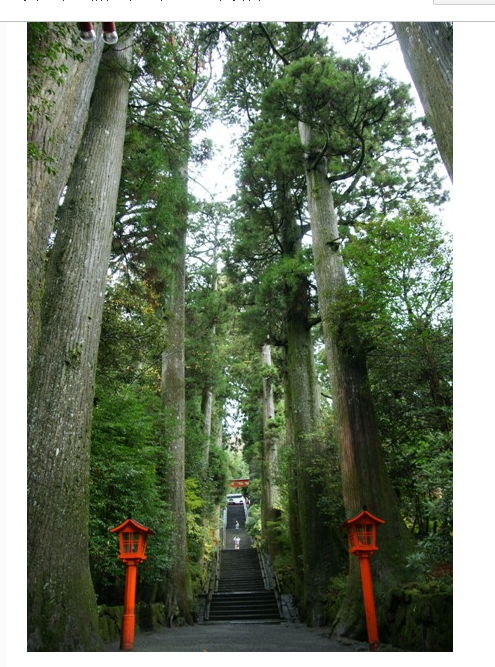
  

317楼 | Kirito丶SQ | 2015-08-03 23:32
    
    2015-08-10 16:38 | 氵soccer艹:
    > 思过以
    2015-08-10 18:17 | Kirito丶SQ:
    > ？
    2015-08-10 20:04 | 氵soccer艹:
    > 回复 Kirito丶SQ ：好厉害
    2015-08-10 20:58 | Kirito丶SQ:
    > 回复 氵soccer艹 :额
* * *
这才是瑛住的地方
  

318楼 | Kirito丶SQ | 2015-08-03 23:32
    
    2015-08-03 23:35 | nbbllxx:
    > www你去看我15年的圣地巡礼，去到箱根的
* * *
想去～看看
  

319楼 | 不乱学姐 | 2015-08-03 23:58
* * *
不对，这是B站里的。想水经验罢了
  

320楼 | 贴吧用户_0EVCVWW | 2015-08-04 05:15
    
    2015-08-04 08:55 | nbbllxx:
    > 开什么玩笑
    2015-08-04 08:57 | nbbllxx:
    > 我逼站ID就是傲娇的丹子菌 …我还真找不到全国谁比我去的早还写了攻略的
    2015-08-05 17:34 | 贴吧用户_0EVCVWW:
    > 额..为什么我在B站看到这个了？
    2015-08-05 17:44 | nbbllxx:
    > 回复 疯言疯语41 ：？
    2015-08-05 17:45 | nbbllxx:
    > 回复 疯言疯语41 ：你看的是哪个用官方活动照做的吧…
    2015-08-05 17:55 | 贴吧用户_0EVCVWW:
    > 回复 nbbllxx :好吧
* * *
顶一发  
————  
yoooooo  
何谓王道？对手不乖，便从他身上碾过去。何谓霸道？就算乖的，也碾过去。   
何谓天道？亲，今天该你被碾了。   
何谓帝道？你不想被碾，也不得不被碾！  
何谓儒家之道？碾过去之前跟他说一声。   
何为墨家之道？用器械从不乖的身上碾过。  
何谓墨者之道？ 用自己造的大轮子碾过去！  
何谓兵家之道？简单高效的碾过去。   
何谓道家之道？一边打酱油，一边淡定的看着你被碾！  
何为佛家之道？碾完你告诉你其实碾等于没碾没碾等于碾，你被碾是因为以前碾过别人；  
何谓法家之道？我依律严厉地将你碾过；  
何谓纵横家之道？我喊上一帮人来碾你！   
何为阴阳家之道？”我算出你今儿晚上要被碾过！”  
何为国际主义之道？我碾你是为了你好。  
何谓强国之道？众小弟拿号排队找关系走后门双膝跪地至诚膜拜:大哥啊求碾压！否则我就跪地不起！  
何为中华之道？自古以来，你就是被我们碾大的.......  
何谓中国特色社会主义之道？坐在轮子上大喊：“历史的车轮碾过来啦！”
  

323楼 | 觉悟灬希丨想 | 2015-08-04 21:36
    
    2015-08-07 13:57 | Kirito丶SQ:
    > 借用了
* * *
2333333
  

324楼 | 空白寂灭Ω | 2015-08-04 21:37
* * *
lz的照片大赞
  

325楼 | 小竹16fish | 2015-08-05 02:12
* * *
顶一顶  
——儿时凿壁偷了谁家的光 宿昔不梳 一苦十年寒窗 如今灯下闲读 红袖添香 半生浮名只是虚妄   
三月 一路烟霞 莺飞草长 柳絮纷飞里看见了故乡 不知心上的你是否还在庐阳 一缕青丝一生珍藏 桥上的恋人入对出双 桥边红药叹夜太漫长 月也摇晃 人也彷徨 乌蓬里传来了一曲离殇  
庐州月光 洒在心上 月下的你不复当年模样 太多的伤 难诉衷肠 叹一句当时只道是寻常 庐州月光 梨花雨凉 如今的你又在谁的身旁 家乡月光 深深烙在我心上 却流不出当年泪光
  

329楼 | 乖巧体贴🌸山城 | 2015-08-10 16:16
    
    2017-02-09 19:16 | dxkwkkcj:
    > 许山高乱入
    2017-02-09 20:09 | 乖巧体贴🌸山城:
    > 回复 dxkwkkcj :　　——晚安，Sion　
    2017-02-09 20:57 | dxkwkkcj:
    > 回复 wqnmlgb1077 :晚安，虽然我并没有睡觉💤
* * *
我竖起剪刀手对食堂阿姨说了句 阿姨我要二两
  

330楼 | 氵soccer艹 | 2015-08-10 16:29
* * *
挖坟
  

331楼 | 氵soccer艹 | 2015-08-10 16:29
* * *
来晚了吗？
  

332楼 | 爱不是邪恶 | 2015-08-10 20:57
* * *

  

333楼 | ▫为你宽衣▫ | 2015-08-11 16:43
* * *
铲！
  

336楼 | 翻車De-s宅 | 2015-09-08 01:33
* * *
顶顶顶 以后如果有机会去日本 一定去秋叶原和奥本染！
  

338楼 | 空哥00 | 2015-09-24 09:41
    
    2015-09-24 09:43 | nbbllxx:
    > 嗯可以
    2015-12-19 20:47 | 空哥00:
    > 回复 1509770203 :。。
* * *
给楼主赞个  
手ۖิ机ۖิ复ۖิ制ۖิۖิ这ۖิ几ۖิ个ۖิ字ۖิ看ۖิ你ۖิ多ۖิ久ۖิ能ۖิ删ۖิ完ۖิۖิۖิۖิۖิۖิۖิۖิۖิۖิۖิۖิۖิۖิۖิۖิۖิۖิۖิۖิۖิۖิۖิۖิۖิۖิۖิۖิۖิۖิۖิۖิۖิۖิۖิۖิۖิۖิۖิۖิۖิۖิۖิۖิۖิۖิۖิۖิۖิۖิۖิۖิۖิۖิۖิۖิۖิۖิۖิۖิۖิۖิۖิۖิۖิۖิۖิۖิۖิۖิۖิۖิۖิۖิۖิۖิۖิۖิۖิۖิۖิۖิۖิۖิۖิۖิۖิۖิۖิۖิۖิۖิۖิۖิۖิۖิۖิۖิۖิۖิۖิۖิۖิۖิۖิۖิۖิۖิۖิۖิۖิۖิۖิۖิۖิۖิۖิۖิۖิۖิۖิۖิۖิۖิۖิۖิۖิۖิۖิۖิۖิۖิۖิ听说这个挺多经验的 ิۖิۣ ۣۣۖۖۖۖิۖิิۣۣۖۖิ ۖิิۣۣۖۖิۣ ۣۣۖۖۖิۖิิ ۣۣۖۖ ۖ ۣۣۖۖิ ۖิิۣۣۖۖิۣ ۣۣۖۖۖิۖิิ ۣۣۖۖ ۖ ۣۣۖۖิ ۖิิۣۣۖۖิۣ ۣۣۖۖۖิۖิิ ۣۣۖۖ ۖ ۣۣۖۖิ ۖิิۣۣۖۖิۣ ۖ  
ۣۣۖۖۖิۖิิ ۣۣۖۖ ۖ ۣۣۖۖิ ۖิิۣۣۖۖۖิۖิิ ۣۣۖۖ ۖ ۣۣۖۖ ۖ ۣۣۖۖิ ۖิิۣۣۖۖิ ۖิิۣۣۖۖۖิۖิิ ۣۣۖۖ ۖ ۣۣۖۖิ ۖิิۣۣۖۖิۣۣۣۖۖۖิۖิิ ۣۣۖۖ ۖ ۣۣۖۖิ ۖิิۣۣۖۖิۣ ۣۣۖۖۖิۖิิ ۣۣۖۖ ۖ ۣۣۖۖิ ۖิิۣۣۖۖิۣ ۣۣۖۖۖิۖิิ ۣۣۖۖ
  

340楼 | 高处胜寒之黑剑 | 2015-09-30 22:30
* * *
@那谁的1
  

341楼 | Hiira♬ | 2015-10-03 00:29
* * *
盗图专业户在此，尔等休得无理。 
  

342楼 | 贴吧用户_QZX93Db | 2015-10-05 20:47
* * *
:)
  

343楼 | 治疗萨 | 2015-11-14 16:28
* * *
:)
  

344楼 | 治疗萨 | 2015-11-14 16:28
* * *
顶~  
冬天去圣地巡遊会不会更好吗?
  

345楼 | winson0715 | 2015-11-25 22:55
    
    2015-11-26 00:02 | nbbllxx:
    > 故事是在夏天发生的啊
* * *
楼主求教怎么在加拿大办旅游日签
  

347楼 | 藍青峰⛄ | 2015-11-30 15:18
    
    2015-12-15 04:08 | nbbllxx:
    > 刚刚才看到...基本要你照片两寸一张（随地都有visa photo）、要你的旅游计划、银行的Bank Statement，就行了。虽然比美签一类的麻烦挺多...因为是中国人另外当然你有什么在住证明一类的也有用，具体清单按照官网上写的
    2015-12-15 04:10 | nbbllxx:
    > 噢有一点。要填写旅馆 联系人地址什么的别忘了，也要有人担保，要是朋友在日本就好办了；没朋友在日本的话...我另外一个朋友是直接送到中国办完快递回来的。时间不会很长，一两周吧，办事处地址在大使馆官网找得到
    2015-12-15 04:14 | nbbllxx:
    > 存点钱在银行也很有用，证明你有足够支持本次旅游的资金，我当时让我妈大概存了五六千刀？也有没担保人出签的案例...
    2015-12-17 09:32 | nbbllxx:
    > 回复 Specialxlh :90天？这么长...那肯定要担保人了吧..
    2015-12-17 09:33 | nbbllxx:
    > 回复 Specialxlh :我这个针对transit的，不是visitor 我之前写了八九天日程，他就把我90天visitor改成15天transit了
    2015-12-21 01:55 | 藍青峰⛄:
    > 回复 nbbllxx :只有去找我日语老师帮忙了
* * *
lz在反吧水贴比较多...回帖比较多...有什么急事最好at一下....  
另外有谁感兴趣帮忙做15年圣地巡礼的视频么..  
lz有点懒到现在还没开工
  

348楼 | nbbllxx | 2015-12-15 04:11
    
    2015-12-20 14:05 | 不破爱花🌈:
    > 反吧是什么？　　　--来自助手版贴吧客户端
* * *
这坟又被挖出来了
  

349楼 | 芊羽桥ლ | 2015-12-21 02:25
* * *
楼主赛高  
大学之道，在明明德，在亲民，在止于至善
  

350楼 | 幽兰🔯 | 2015-12-21 23:30
* * *
Sora..
  

351楼 | JHON_RAMBO_zc | 2015-12-23 16:32
* * *
楼主弱弱的问一句，办签证和护照分别需要什么材料
  

352楼 | 星空泪痕o殇 | 2016-01-16 21:14
    
    2016-01-16 23:07 | nbbllxx:
    > 护照我忘了，这要去附近出入境管理局
    2016-01-16 23:08 | nbbllxx:
    > 签证材料在大使馆官网看得到，大概是一些财产证明，照片，行程计划，还有填的一些表格
    2016-01-16 23:21 | nbbllxx:
    > 347L
* * *
很抱歉一记洛阳铲把这坟挖上来了，不过楼上好像也是铲。刚才9点半在百度搜索【奥木染】，第一个就是这帖子，进来看了2个小时看完了，视频也看了，挺羡慕楼主的，反正心情有点复杂，难以言表，能为你点个赞。
  

353楼 | 国服第一鸟厨😘 | 2016-01-16 23:19
* * *
嗯....看完楼主帖子有点想法了，以前还真没有过因为动漫去追寻足迹这样的打算与想法，目前如果真去就还有很多问题需要解决了，如果这次能成功征得同意去的话，那可能尽可能只拉上我的俩动漫死宅表弟去，他们不小差不了几岁，今年我都该20了，不过对于像楼主样独自一人去的话，各种事物都自己处理，还真担心我这只有N4水平的渣怎么方便交流，英语喜闻乐见的不好.....我想问些问题，如果只去玩7天以内3到5个人（3个我这样的或是再加上父母），签证大概会需要多久，难度有多大，在日本那边虽然有好友，但是估计不会去麻烦，我们这样不算上游玩购物的钱的话大概会需要多少呢。（原谅没有经验的我做一次伸手党）
  

354楼 | sssnnnbb | 2016-01-17 15:57
    
    2016-02-07 18:16 | 丿影S幻飘灬:
    > 看到你啦！
    2016-02-07 18:51 | sssnnnbb:
    > 回复 丿影S幻飘灬 :又被你发现了
    2016-02-08 03:50 | nbbllxx:
    > 签证一两周下来，有英语水平更好，不然要用翻译软件。好在日本能用谷歌翻译。 难度不大，有好友可以做担保申请签证更轻松。签证申请还需要一定押金具体可以问淘宝。自己玩的话平均天800-1000人民币，和朋友一起住会编译很多
    2016-02-08 22:38 | sssnnnbb:
    > 回复 nbbllxx :嗷嗷！谢谢楼主撒嘛
* * *
楼主，我也准备去奥木染，求好友！
  

355楼 | 掳Clear | 2016-01-26 20:20
    
    2016-01-26 22:00 | nbbllxx:
    > 噢
* * *
暖
  

356楼 | 橘子森 | 2016-01-26 22:04
* * *
挖坟
  

357楼 | 战骑绝尘 | 2016-02-07 17:06
* * *
厉害厉害，竟然去了三次元地方，有机会也要去看看
  

358楼 | n-buna🌊 | 2016-02-07 18:19
* * *
哇，神社上那些话的真好
  

359楼 | 小苏术师 | 2016-02-07 19:42
* * *
这。。我现在才发现的，居然已经是坟了，好羡慕lz,好想去啊。。。
  

360楼 | 幻麟LOGO | 2016-02-07 19:43
* * *
楼主辛苦了！！
  

361楼 | 小苏术师 | 2016-02-07 22:44
* * *
每天顶顶更健康
  

362楼 | 小苏术师 | 2016-02-08 03:45
* * *
挖坟进行时，吃我一记洛阳铲！
  

363楼 | 萬叶丶🌿 | 2016-02-29 21:32
* * *
挖！！真尼玛666
  

364楼 | wuli水比☜ | 2016-03-22 17:34
* * *
简直赞
  

365楼 | 忆丶♀ | 2016-03-23 00:32
* * *
【图片】
  

367楼 | 寂灭之星辰 | 2016-04-13 02:06
* * *
诶，发现反吧死宅一只（果然反吧都是死宅吗）
  

368楼 | 带带大西瓜🍁 | 2016-04-13 07:33
    
    2016-04-13 07:56 | nbbllxx:
    > 我不是死宅 我有个女朋友了 她姓春日野
* * *
一个小时看完此贴，我手中的洛阳铲又开始挥动了起来。顶---看到我手中洛阳铲挥动的频率了没？（自打小尾巴）
  

369楼 | 神马中的神马0 | 2016-05-08 16:46
    
    2016-05-08 23:21 | nbbllxx:
    > 这是看了一小时？
    2016-05-09 19:38 | 神马中的神马0:
    > 回复 nbbllxx :还有bili的，另一片帖子，总共
* * *
表示我是搜奥木染看到这个帖子的，我也来一铲
  

370楼 | 一把小伞🔯 | 2016-05-22 14:06
* * *
顶
  

371楼 | 无问东西zz▫ | 2016-06-09 20:43
* * *
能自己看到真好……
  

372楼 | 稻草人774 | 2016-06-10 11:01
* * *
楼主，热吗
  

374楼 | 亨利八两😈 | 2016-06-19 22:09
    
    2016-06-20 05:55 | nbbllxx:
    > 夏天很热
* * *
为什么七十岁老人被恶毒夫妻推下悬崖却无人制止？为什么七个上身赤裸的男子殴打妇女却被人拍手叫好？为什么蛇蝎共处一窝却相安无事？这一切的背后，到底是道德的疏忽还是人格的泯灭亦或是社会的悲哀？如果你想了解这一切，请收看动画片《葫芦娃》！
  

377楼 | ♤仙风骨道 | 2016-07-02 19:08
* * *
昔日曾见此湖图,不信人间有此湖.今日打从湖上过,画工还欠费功夫.
  

380楼 | Limengyuan000 | 2016-07-03 22:06
* * *
什么软件，什么网络？我很好奇。。。
  

381楼 | F342 | 2016-07-30 01:20
* * *
楼主还专门倒个车，从关西坐新干线来小山，真有钱人
  

382楼 | KoumotoMadoka | 2016-08-13 15:17
* * *
...
  

383楼 | 因丑被判九年 | 2016-08-13 15:23
* * *
可不不可以说说具体位置，要准备去
  

386楼 | 刺客心骑士命 | 2016-09-08 14:50
    
    2016-09-08 17:48 | nbbllxx:
    > 帖子里写的够仔细了
    2016-09-08 19:04 | 刺客心骑士命:
    > 回复 nbbllxx ：你用的哪个地图啊
    2016-09-08 19:19 | nbbllxx:
    > 回复 刺客心骑士命 :google
* * *
楼主去了一趟花了多少？
  

387楼 | BestForever蛋 | 2016-12-18 01:36
    
    2016-12-18 17:51 | nbbllxx:
    > 一万
* * *
有生之年一定要去一次
  

389楼 | 贪玩♂男玥 | 2016-12-18 21:04
* * *

  

390楼 | 妮姆芙的笑 | 2017-01-01 23:28
* * *
楼主有在奥木染住宿还是在足利市里，有推荐酒店吗？
  

391楼 | dxkwkkcj | 2017-02-09 19:19
    
    2017-03-03 11:40 | nbbllxx:
    > Route inn
    2017-03-03 11:40 | nbbllxx:
    > 小村子里没地方住
    2017-03-03 17:14 | dxkwkkcj:
    > 回复 nbbllxx :非常感谢
* * *
必须顶
  

392楼 | 穹妹我媳妇er | 2017-03-02 15:50
    
    2017-03-02 19:28 | 炎无惑♂:
    > 挖坟了您呐。。看好时间好吗
    2017-03-03 14:00 | 穹妹我媳妇er:
    > 回复 瞬间无惑 :这是经典
* * *
当年抽中护身符的萌新再来顶一发时间过得真快
  

393楼 | __ACGN御宅族__ | 2017-03-03 16:25
    
    2017-03-03 16:35 | nbbllxx:
    > 是啊不知不觉
* * *
我又来了，看完了sssnnnbbb的巡礼帖子，羡慕死你们了
  

394楼 | dxkwkkcj | 2017-03-04 10:47
* * *
楼主圣地巡礼一次要花多少软妹币
  

395楼 | Ramp◎º | 2017-05-01 10:46
* * *
楼主 预算1w5软妹币 机票买特价票2900rmb左右 jr通票国内买好 2000rmb左右 酒店便宜点的就行 网络的话随时wifi或者softbank的旅游手机卡 手机卡100左右 吃的平均每顿100日元 这样1w5软妹币去东京 大阪（或者北海道）加上圣地巡礼够吗？
  

396楼 | Ramp◎º | 2017-05-01 11:12
    
    2017-06-07 14:03 | nbbllxx:
    > 吃的每顿1000-1500日元比较正常，750已经是午餐特价了
    2017-06-07 14:05 | nbbllxx:
    > 一周上下，大概1000一天的预算。超过了会减，少于七天会加。北海道要日本国内转飞机，东京到大阪单趟800人民币
* * *

  

397楼 | liuqq24 | 2017-07-08 01:51
* * *
大佬，这公交怎么个做法，向您讨教讨教
  

398楼 | 岩山蟹 | 2017-07-24 17:35
    
    2017-07-24 21:21 | nbbllxx:
    > 巴士停靠点找到 上去问司机 给钱就行
    2017-07-24 23:01 | 岩山蟹:
    > 回复 nbbllxx ：司机懂英语吗
    2017-07-24 23:19 | nbbllxx:
    > 回复 岩山蟹 ：不懂 不行可以谷歌翻译
    2017-07-25 16:40 | 岩山蟹:
    > 回复 nbbllxx ：谢了
* * *
楼主加油 有生之年一定希望去看看！ 期待你的下次更新！ 视频+BGM差点看哭
  

399楼 | Habit-1 | 2017-08-31 22:18
* * *
顶
  

400楼 | 风岚晨曦 | 2018-02-07 20:42
* * *
楼主我是看bilibili来找到你的，我加你好友了，我有好多问题想问你可以嘛额，好喜欢穹
  

401楼 | 雨夜灬♬ | 2018-03-11 12:45
    
    2018-03-12 03:08 | nbbllxx:
    > 哈哈可以啊 不过我没收到消息
    2018-03-12 12:36 | 雨夜灬♬:
    > 回复 nbbllxx ：我给你发消息了呀，在陌生人里面吧。。。
    2018-03-12 12:57 | 雨夜灬♬:
    > 回复 nbbllxx ：现在在学校看手机看的少给你发消息了
* * *
大赞大赞，我也要去
  

403楼 | 泣月白 | 2018-03-11 17:05
* * *
厉害
  

405楼 | 国寿北分收展☜ | 2018-03-12 13:13
* * *
缘之空留名
  

406楼 | 折枝可堪否 | 2018-04-29 20:20
* * *
挖
  

407楼 | 春日野穹呀💋 | 2018-06-12 13:51
* * *
顶
  

408楼 | 赢政949 | 2018-06-12 14:03
* * *
一记洛阳铲，挖出千年坟。
  

409楼 | 无聊就望望天ლ | 2018-07-08 12:30
* * *
大赞！！！！
  

410楼 | q蝶l恋花p | 2018-08-19 20:31
* * *
既然加精了那就应该没问题了，顶一个
  

412楼 | 贴吧用户_aZUKbV5 | 2020-07-08 19:17
* * *
哇 挖到千年老贴 顶一顶
  

413楼 | lzy1122_ | 2020-07-08 20:10
* * *
来来来了
  

414楼 | 虚空掠妈者😁 | 2020-07-09 09:22
* * *
厉害
  

415楼 | 使用原用户名💧 | 2020-12-10 15:32
* * *

  

416楼 | 缘穹悠♤ | 2020-12-10 15:37
* * *
慕了
  

417楼 | 一只风酱🌸 | 2021-03-18 09:55
