【直播】缘之空圣地巡礼Part II 叉伊姬神社后山湖
* * *
去年去了足利桦崎对缘之空系列构成的取材地  
进行了圣地巡礼  
<http://tieba.baidu.com/p/3258002142>  
但是因为行程关系没能来到和叉伊姬神社后山的湖神似的箱根 芦ノ湖  
今年有幸再次来到霓虹  
决定继续圣地巡礼  
明天就出发去箱根喇  
做个小小的预告（pianjingyan） 
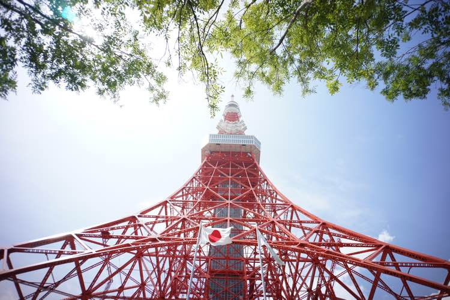
  

1楼 | nbbllxx | 2015-05-18 19:15
* * *

  

2楼 | 逍遥影逸6666 | 2015-05-18 19:16
    
    2015-05-19 00:46 | nbbllxx:
    > 借2楼：1,请适当使用“只看楼主”功能 2,本次行程从19日持续到21日，前后都会有其他直播 3,交通方式将会在之后贴出，以及圣地巡礼的注意事项
    2015-05-21 11:36 | nbbllxx:
    > 回复 nbbllxx ：交通方式已在57楼写完！
* * *
  

4楼 | 灵斗士º | 2015-05-18 19:22
* * *
赞个，楼主还记得我吗
  

6楼 | RoseAz桐 | 2015-05-18 20:06
    
    2015-05-18 20:08 | nbbllxx:
    > 只记得这个头像
    2015-05-18 20:10 | RoseAz桐:
    > 回复 nbbllxx ：....那我立马换个，你那朋友有没有一起去啊
    2015-05-18 20:13 | nbbllxx:
    > 回复 RoseAz桐 ：朋友？哪个
    2015-05-18 20:15 | RoseAz桐:
    > 回复 nbbllxx ：你上次不是说有个朋友和你一起去？
    2015-05-18 20:17 | nbbllxx:
    > 回复 RoseAz桐 ：噢，倒是有个一起去的，不过他只是泡温泉
    2015-05-18 20:21 | RoseAz桐:
    > 回复 nbbllxx ：ǒ
    2015-08-04 10:29 | Kirito丶SQ:
    > 我都记得
* * *
前排支持
  

7楼 | 重巡-Ko級 | 2015-05-18 21:38
* * *
太监了！
  

9楼 | 节操都去了 | 2015-05-18 22:20
    
    2015-05-19 00:44 | nbbllxx:
    > 我明天才去太监个毛
    2015-05-19 12:09 | 节操都去了:
    > 回复 nbbllxx :
* * *
哟~这个要留名
  

10楼 | ▫悠▫ | 2015-05-18 22:49
* * *
大家见到我儿子了吗？ 他是个2米壮汉 大家千万不要艾特他 他的id是你笑的清浅从容
  

11楼 | 你笑的过分诱人 | 2015-05-18 22:49
* * *
楼主加油
  

12楼 | 如风般肆意丶 | 2015-05-18 22:52
* * *
哎呀哎呀，站好位，求眼熟
  

14楼 | 芊羽桥ლ | 2015-05-19 02:04
* * *
好期待！楼主一定多拍几张发上来
  

15楼 | 花少丿浮夸天下 | 2015-05-19 06:46
* * *
。。
  

16楼 | 虚拟-时间 | 2015-05-19 07:25
* * *
早上九点，还躺在宾馆发呆
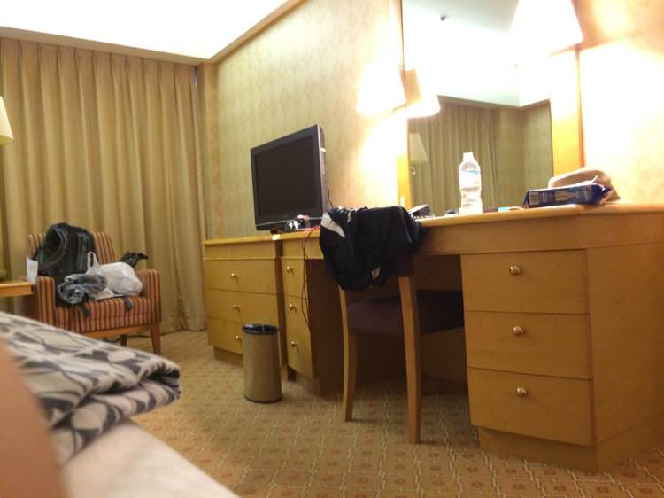
  

17楼 | nbbllxx | 2015-05-19 08:14
    
    2015-05-19 13:47 | 花少丿浮夸天下:
    > 跟中国宾馆没什么差别的样子
    2015-05-19 13:54 | nbbllxx:
    > 回复 花少丿浮夸天下 ：一般比这个小很多
    2015-05-20 12:39 | 节操都去了:
    > 不叫一只鸡来填饱肚子吗？
    2015-05-20 12:40 | nbbllxx:
    > 回复 节操都去了 ：不敢乱搞怕得病
    2015-05-20 12:42 | 节操都去了:
    > 回复 nbbllxx :9点不饿吗？听说那里的烧鸡很不错的
    2015-05-20 13:14 | nbbllxx:
    > 回复 节操都去了 ：贵死了
    2015-05-20 13:19 | 节操都去了:
    > 回复 nbbllxx :上次去才2000而已
* * *
在东京站换好了JR PASS 下午一点半就出发 
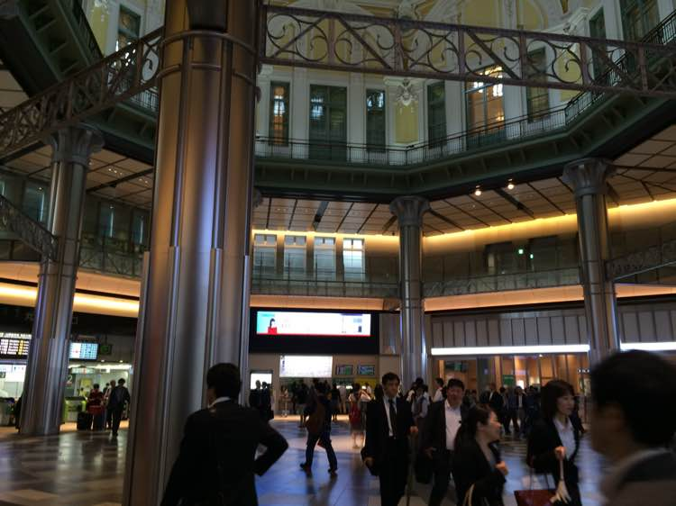
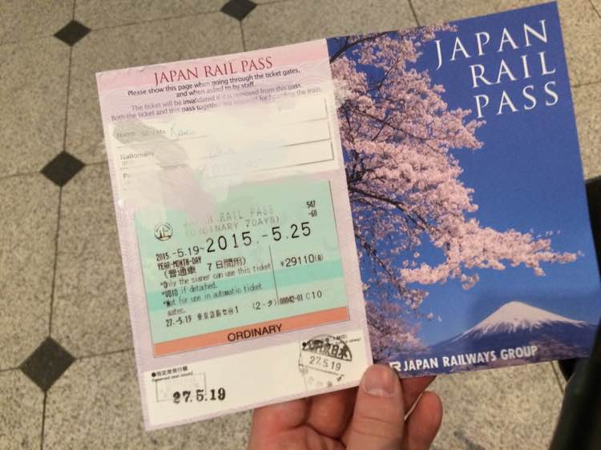
  

18楼 | nbbllxx | 2015-05-19 09:47
    
    2015-08-04 10:30 | Kirito丶SQ:
    > 看的懂日语吗
* * *
等更
  

19楼 | ID_風神 | 2015-05-19 09:50
* * *

  

21楼 | 橙子炒柠檬🌱 | 2015-05-19 13:48
* * *
登山铁道，上箱根喇！
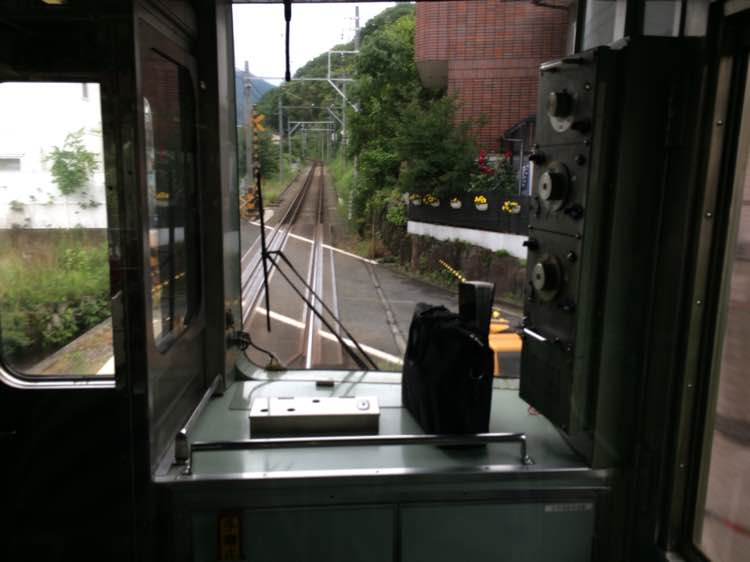
  

22楼 | nbbllxx | 2015-05-19 14:28
* * *
中间停两次
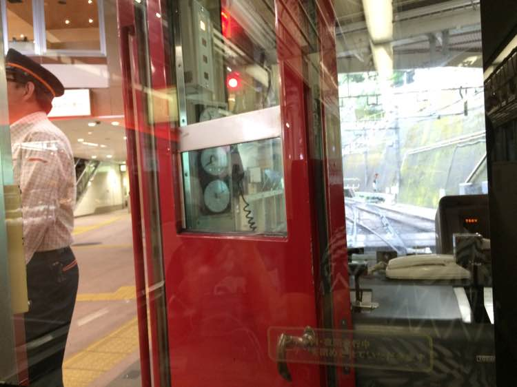
  

23楼 | nbbllxx | 2015-05-19 14:38
    
    2015-05-20 17:35 | 黯霷:
    > 车里的电风扇呢
    2015-05-20 17:37 | 黯霷:
    > 看动画最喜欢车顶的电风扇了
    2015-05-20 18:13 | nbbllxx:
    > 回复 黯霷 : 上一次圣地巡礼的时候有，这次的电车没有
    2015-05-22 14:02 | nbbllxx:
    > 回复 黯霷 ：在84楼拍了
    2015-05-22 14:15 | 黯霷:
    > 回复 nbbllxx :么么哒
* * *
到山上咯，明天去看湖 
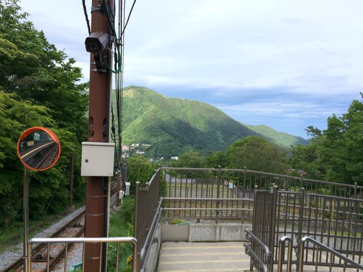
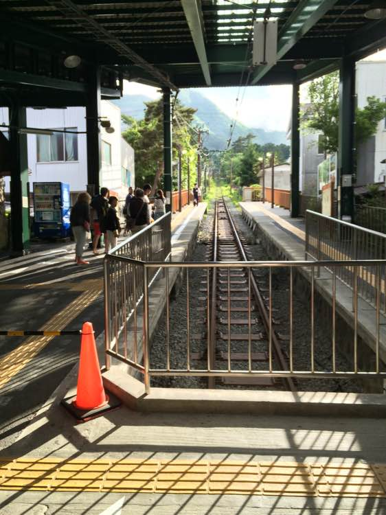
  

24楼 | nbbllxx | 2015-05-19 15:45
    
    2017-06-25 18:05 | 记忆里的穹🍁:
    > 楼主上山以后第二天去看湖，那是不是山上有酒店能住一晚上？
    2017-06-27 22:38 | nbbllxx:
    > 有很多温泉酒店 但是离目的地都有一两个小时距离
* * *
擦擦好慢！明天更新艾特我一下
  

25楼 | 红尘醉丶殇訫 | 2015-05-19 18:55
    
    2015-05-20 13:43 | nbbllxx:
    > 艾特
    2015-05-21 06:27 | 红尘醉丶殇訫:
    > 回复 nbbllxx :什么鬼
    2015-05-21 06:28 | nbbllxx:
    > 回复 红尘醉丶殇訫 : 你让我跟新了at你的啊
    2015-05-21 06:33 | 红尘醉丶殇訫:
    > 回复 nbbllxx :←_←有这么艾特的么！GET
    2015-05-21 06:47 | nbbllxx:
    > 回复 红尘醉丶殇訫 :
* * *
的确好费日程的样子
  

26楼 | 花少丿浮夸天下 | 2015-05-19 21:32
* * *
帮顶
  

27楼 | Walkerf12 | 2015-05-20 00:40
* * *
围观
  

28楼 | 我来自水星😈 | 2015-05-20 00:56
* * *
 强势围观
  

29楼 | 总冠军低调👻 | 2015-05-20 05:47
* * *
也好想去看下
  

32楼 | fxX人 | 2015-05-20 08:27
* * *
上湖和去奥木染一样坐巴士 
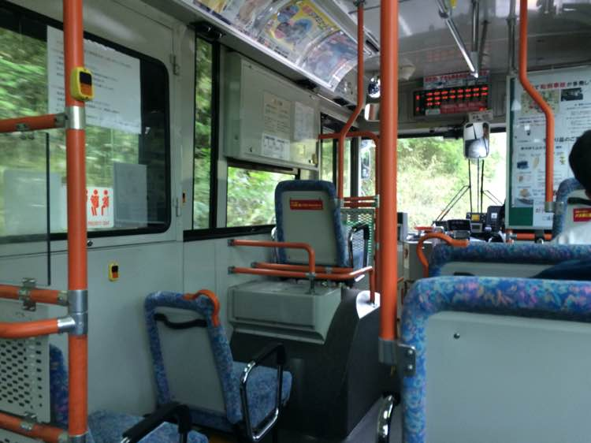
  

33楼 | nbbllxx | 2015-05-20 09:49
* * *
终于到湖边了
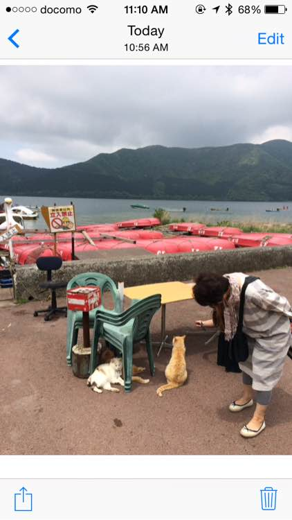
  

37楼 | nbbllxx | 2015-05-20 10:10
    
    2015-05-20 11:02 | 贴吧用户_Q1U8y43:
    > 好多师傅　　　-- 你这混蛋翘课多久了啊！也要考虑下我啊！兔子太寂寞可是会死的！
    2015-05-21 06:48 | nbbllxx:
    > 回复 摆度首席评论员 :都挂着牌子 一个营业部长 一个营业本部长 一个课长 吓尿
* * *
噢噢喔
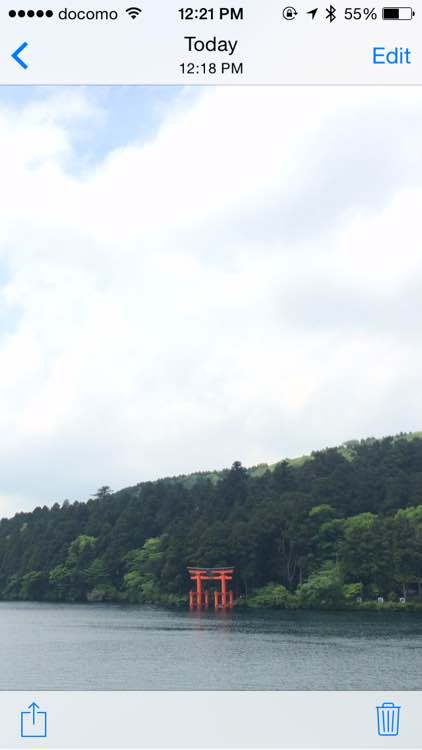
  

39楼 | nbbllxx | 2015-05-20 11:22
* * *
如果说游戏是桦崎作为原型的话，动画一定是以箱根做原型的太像了 
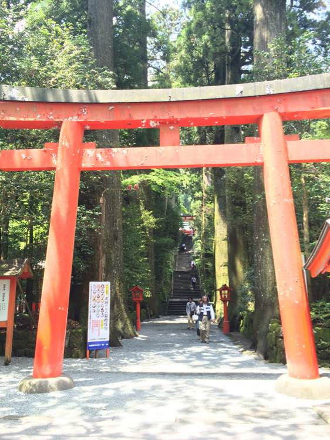
  

40楼 | nbbllxx | 2015-05-20 11:42
* * *
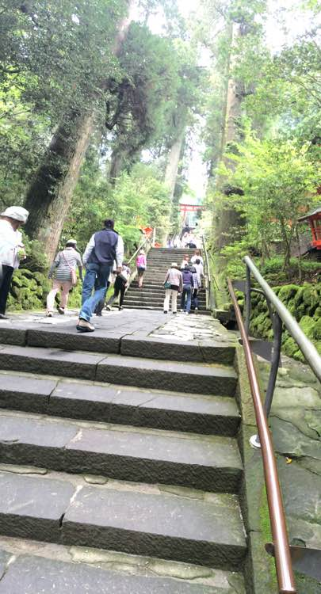
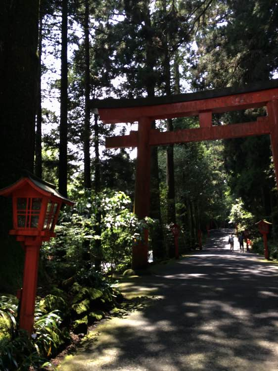
  

41楼 | nbbllxx | 2015-05-20 11:46
    
    2015-05-21 18:14 | 花落只剩孤漠:
    > 第二张非常赞
* * *
又写了绘马
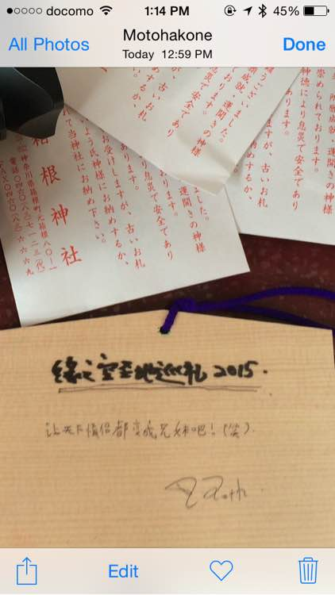
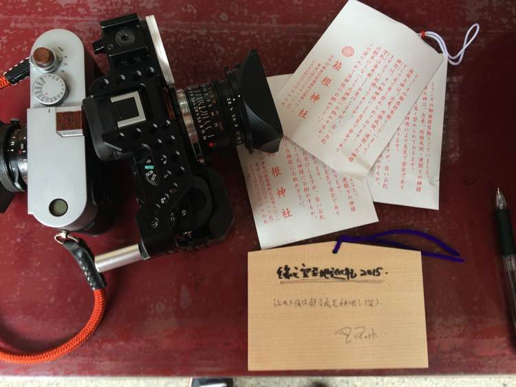
  

42楼 | nbbllxx | 2015-05-20 12:14
    
    2015-05-21 18:16 | 花落只剩孤漠:
    > 让天下情侣都变成兄妹吧 这个好凶残
    2015-05-21 18:40 | nbbllxx:
    > 回复 花落只剩孤漠 ：
    2015-05-21 19:25 | lolikondesu:
    > 写中文日本人看不懂的
    2015-05-21 19:56 | nbbllxx:
    > 回复 lolikondesu :本来就是写给你们看的
    2015-05-21 23:53 | I西风独自凉I:
    > 楼主14年那张绘马始终看不清
    2015-05-23 18:48 | nbbllxx:
    > 回复 I西风独自凉I ：太羞耻了还是不要看清楚得好
    2015-07-07 06:04 | love星殒:
    > 回复 nbbllxx :嘛，我也不是什么大角虫。画什么的就不画了（╬￣皿￣）。麻烦让悠和穹都一直在一起吧。还有这绘马可别摘下来了。外国人可是稀缺资源。楼主你颜文字好难看懂啊
    2015-08-04 11:55 | nbbllxx:
    > 回复 love星殒 ：来我们吧我请你你一顿十循套餐
    2015-08-05 01:12 | love星殒:
    > 回复 nbbllxx :嘛，套餐就不必了，中国人有句古话叫闷声fadacai
* * *
一路走过去，真的很滑，怪不得会掉下去 
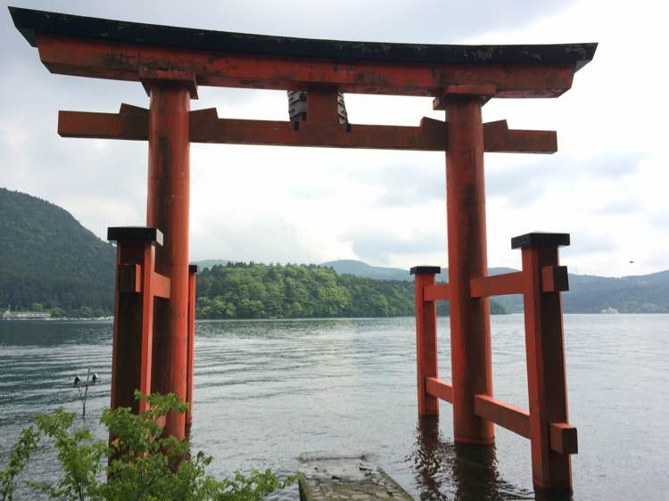
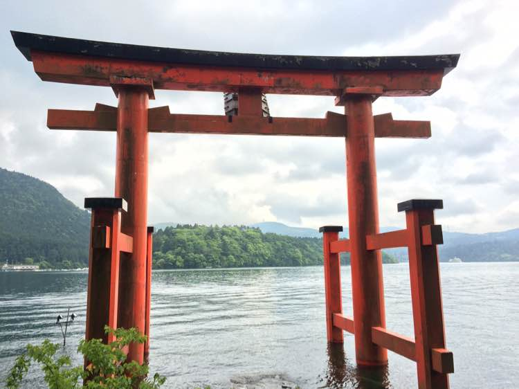
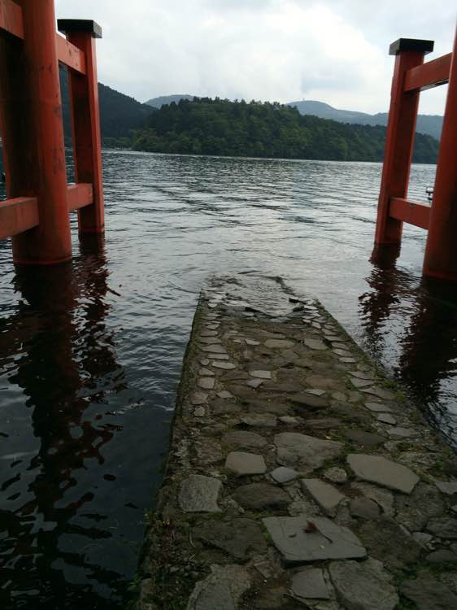
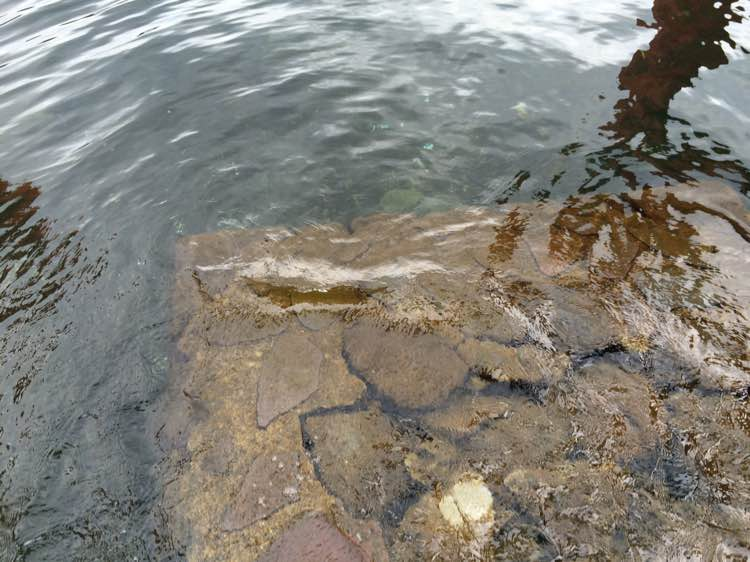
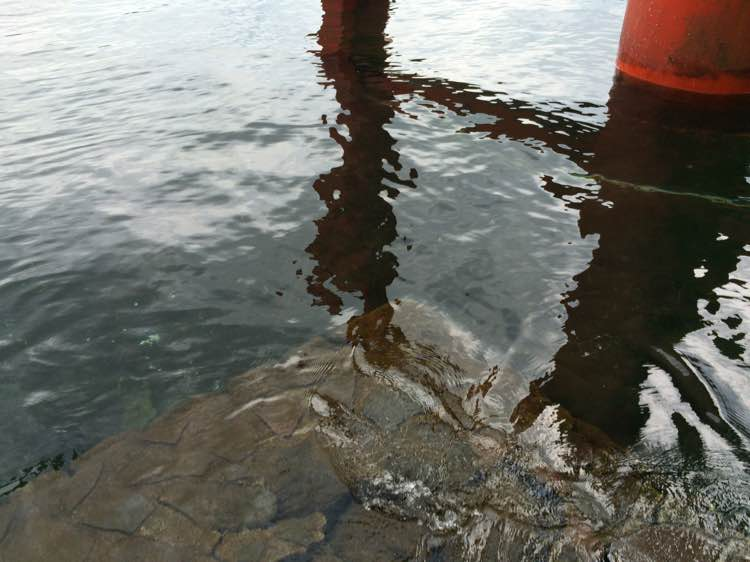
  

45楼 | nbbllxx | 2015-05-20 13:41
    
    2015-05-21 18:17 | 花落只剩孤漠:
    > 那木头不会霉掉吗？
    2015-05-21 18:40 | nbbllxx:
    > 回复 花落只剩孤漠 ：应该固定维护上漆吧
    2015-05-21 19:33 | 花落只剩孤漠:
    > 回复 nbbllxx :在水下啊
    2015-05-21 19:55 | nbbllxx:
    > 回复 花落只剩孤漠 : 可以拦起来
    2015-05-21 21:27 | 贴吧用户_0C1XK9t:
    > 原来掉下去是失足
    2015-05-21 21:34 | nbbllxx:
    > 回复 丿JZQ灬艾斯比 :是啊 动画里描写过
* * *
这次神社里面没有穹的绘马
  

46楼 | nbbllxx | 2015-05-20 13:44
    
    2015-05-20 14:03 | nbbllxx:
    > 
    2015-05-21 23:54 | I西风独自凉I:
    > 
    2015-05-22 00:47 | 甜香酥软蜜瓜包:
    > 
    2015-05-29 19:57 | 古语之书:
    > 你去画！
    2015-08-04 11:55 | nbbllxx:
    > 回复 1509770203 ：被抓起来
* * *
饿死了，吃个荞麦回酒店 
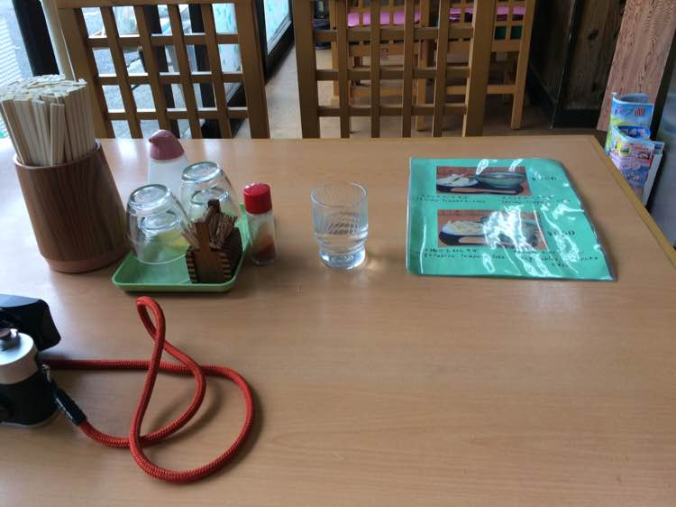
  

47楼 | nbbllxx | 2015-05-20 14:03
* * *
棒棒嗒
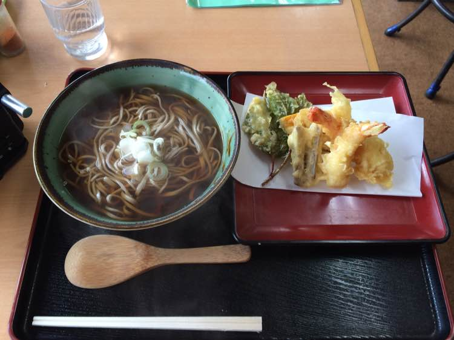
  

48楼 | nbbllxx | 2015-05-20 14:20
    
    2015-07-15 17:30 | 习则:
    > 乌冬面啊
    2015-08-04 11:56 | nbbllxx:
    > 回复 习则 ：明明是荞麦
* * *
路上找到了一个不得了的东西
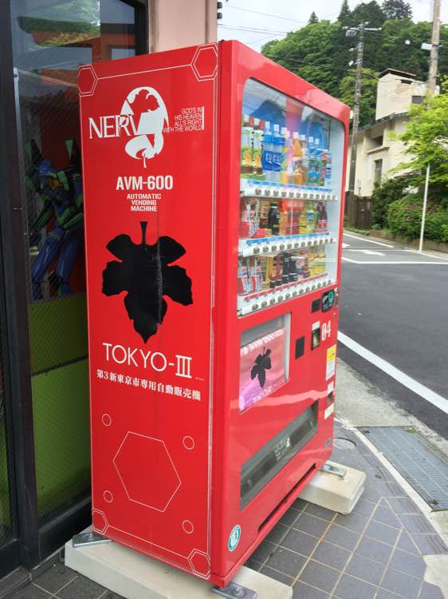
  

49楼 | nbbllxx | 2015-05-20 15:00
    
    2015-05-20 15:21 | ELIZATE:
    > 壮哉我EVA 暴走吧。。。。。售货机 把楼主所以的硬币都吃掉
    2015-05-21 11:41 | nbbllxx:
    > 回复 ELIZATE ：太可怕了所以我没买
    2017-07-26 04:44 | 闪星智库:
    > @nbllxx 咖啡馆，哈哈
* * *
火钳刘明  
\--撑不住的时候可以说我好累但永远不要说我不行
  

50楼 | 不破爱花🌈 | 2015-05-20 16:46
* * *
回到酒店处理照片咯~~
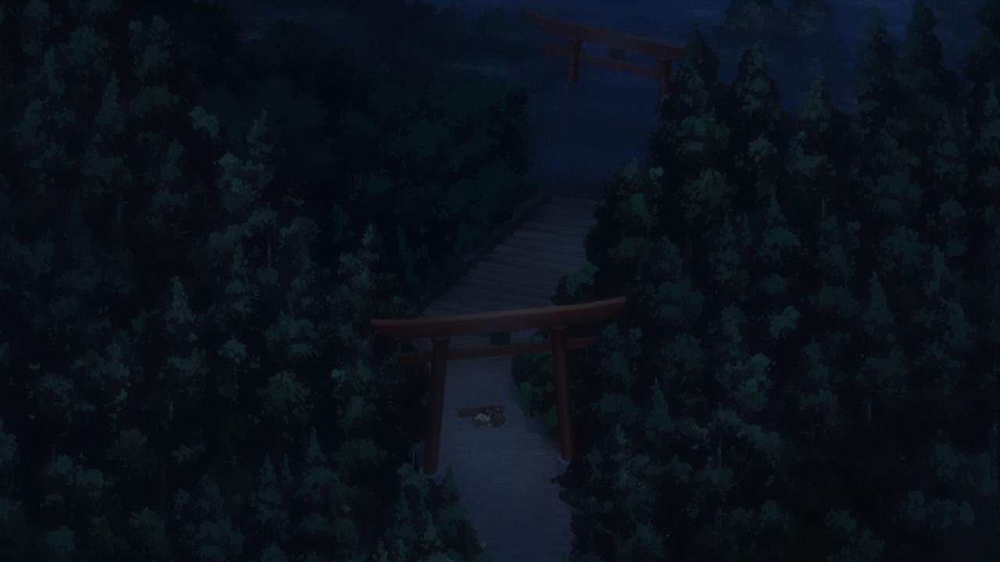
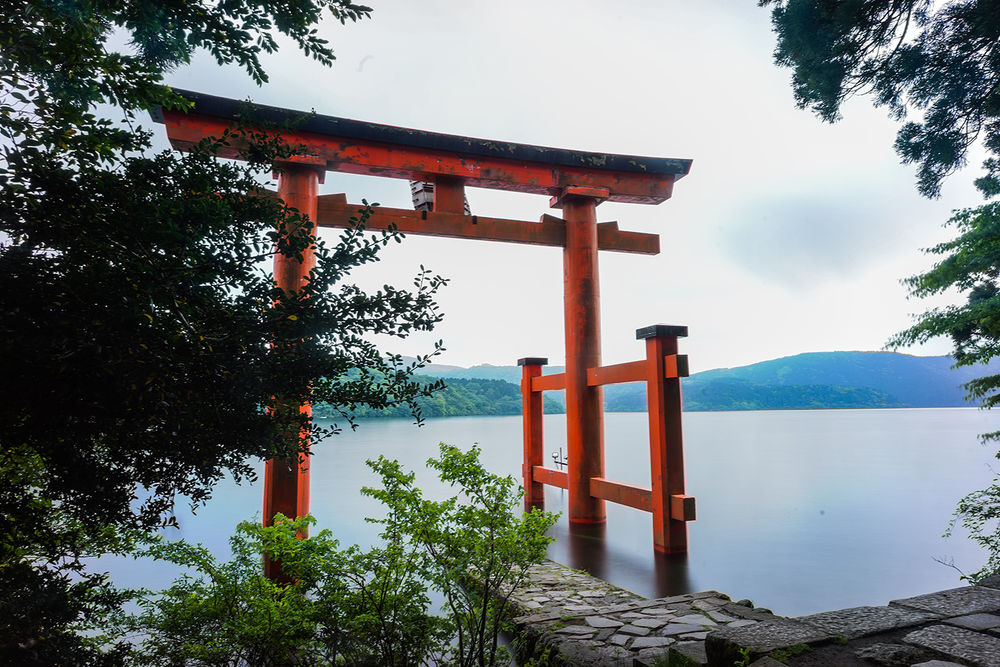
  

51楼 | nbbllxx | 2015-05-20 18:19
* * *
6666,lz怎么去的啊
  

52楼 | 恐怖利刃🌀 | 2015-05-20 21:18
    
    2015-05-21 06:45 | nbbllxx:
    > 用navitime找怎么到箱根 然后在强罗站或者箱根汤本坐巴士到元箱根 找箱根神社
    2015-05-21 11:48 | nbbllxx:
    > 更新了57楼
* * *
好棒！等更行程
  

53楼 | 吃虫的虾 | 2015-05-20 22:50
    
    2015-05-21 06:44 | nbbllxx:
    > 直播 播完了 剩下只有相机拍的照片 慢慢发
    2015-05-21 09:45 | 吃虫的虾:
    > 回复 nbbllxx :2楼说好的交通方式和注意事项呢！！
    2015-05-21 10:01 | nbbllxx:
    > 回复 吃虫的虾 :我还没写完呢，要么我现在写个简单的
    2015-05-21 11:34 | nbbllxx:
    > 回复 吃虫的虾 ：57楼写了
* * *
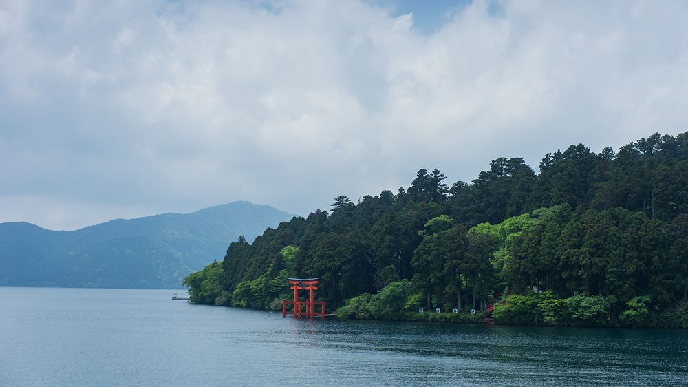

  

54楼 | nbbllxx | 2015-05-21 06:43
    
    2015-05-22 14:03 | nbbllxx:
    > 没人说真像么
    2015-05-22 15:35 | 黯霷:
    > 回复 nbbllxx :第三张么。。我还以为是原图
    2015-06-26 00:50 | 布拉德莱克:
    > 简直棒啊，太棒了，第一张图有修过吗
    2015-06-26 00:52 | nbbllxx:
    > 回复 布拉德莱克 ：调过点曝光什么的
    2015-06-26 00:58 | 布拉德莱克:
    > 回复 nbbllxx :懂技术的楼楼
    2015-06-30 14:41 | 千叶渐雪:
    > 回复 nbbllxx :好像啊
    2015-06-30 18:14 | 素女▫:
    > 真的赞，楼主辛苦了
    2018-03-26 13:40 | -Lydia:
    > 搬一波图到空间...p不来qwq
    2018-07-14 14:04 | nth2378:
    > 是什么软件呀
* * *
我只留下了转车这一个印象。。。  
愿我中土，繁华昌盛，生生不息；愿我中土，永远永远，宁静安详。  
\--by妖仙宁楚
  

56楼 | Christmas失落 | 2015-05-21 10:00
    
    2015-05-21 10:51 | nbbllxx:
    > 你说去年的么
    2015-05-21 11:59 | Christmas失落:
    > 回复 nbbllxx :不两次我都只留下了转车这个印象。。。。
    2015-05-21 12:00 | nbbllxx:
    > 回复 Christmas失落 ：其实我也差不多…满脑子都是怎么转车
    2015-05-21 12:01 | Christmas失落:
    > 回复 nbbllxx :坑爹的十一区
* * *
路程：  
和去年一样是从东京出发的  
如果你到的是北海道，关西的京都或者大阪等等大城市  
都可以乘坐新干线来到东京，从这里出发  
乘坐“东海道”新干线和JR列车来到“小田原站”kodawara  
从这边开始到达动画中的叉伊姬神社“箱根神社”有多种方式  
大多数交通都是Odakyu“小田急”公司提供的  
所以购买他们的“两日通票”（4000日元）比较方便  
因为有很多种到达箱根神社Hakone Jinnja的方式  
所以我只讲我自己的方法：  
  
在小田原乘坐“箱根登山电车”Hakone Tozann Dennsha  
来到“箱根汤元”Hakoneyumoto  
然后换乘同一辆再  
来到“强罗”Goura  
然后换乘“箱根登山ケイブルカー”Hakone Tozann Cable Car  
来到“早云山”Souunnzann  
换乘缆车“箱根登山路线バス”Hakone Tozann Rosenn Bus  
来到“湖尻”Kojiri  
（一般可以直接坐ropeway直接到桃源台，但是最近火山活动频繁停止了所有ropeway服务。桃园台和湖尻不一样，能够坐到海盗船）  
再乘船前往“元箱根”Motohakone  
在路上可以看到箱根神社的那个水中的大鸟居  
（鸟居就是那个红红的牌坊一样的建筑，念做Torii）  
下了船往左走就能找到神社喇！船上会有解说的噢～  
  
注意事项  
1、网络建议租一个wifi或者本地买一张卡，中国移动不能用  
2、导航导航建议在保证有网络的情况下用navitime或者谷歌  
3、签证签证尽早，日本签证需要文件是算很多的  
4、酒店酒店尽量预定，注意要预定到达时间和早餐时间  
5、语言大多数情况下英文没事，中文基本没人懂，很多中国游客都要求帮忙翻译了。。情况会很麻烦  
还有什么不懂的这里问我 别忘了@ 我噢
  

57楼 | nbbllxx | 2015-05-21 10:24
    
    2015-05-21 18:07 | 吃虫的虾:
    > 本地怎么买卡
    2015-05-21 18:43 | nbbllxx:
    > 回复 吃虫的虾 ：你没at...买什么卡
    2015-05-22 08:16 | 吃虫的虾:
    > 回复 nbbllxx :at是什么。。我想随时可以打电话
    2015-05-22 08:18 | nbbllxx:
    > 回复 吃虫的虾 ：就是@ 一下我的名字
    2015-06-26 00:51 | 布拉德莱克:
    > 感谢楼楼
    2015-06-26 00:57 | nbbllxx:
    > 这里口误了不是kodawara是odawara
* * *
离开箱根了，有点可惜，之后几天也会陆续po一点照片和做视频，别忘了关注我的ROLL奖帖喔
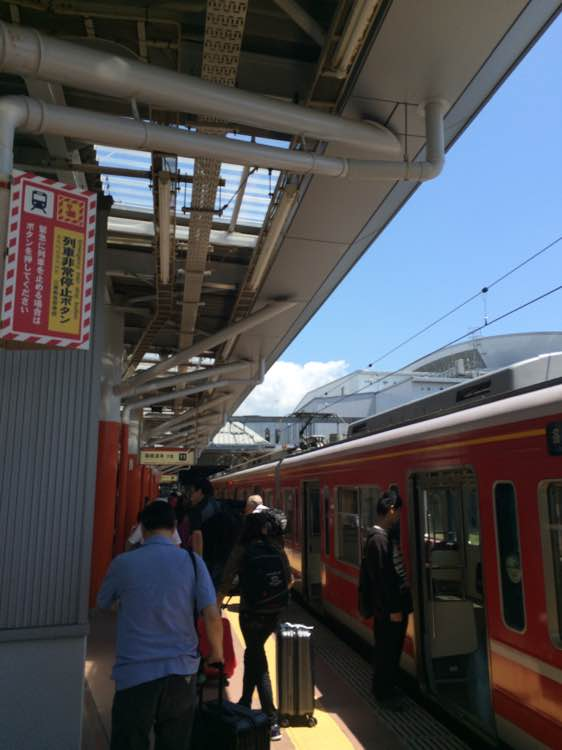
  

58楼 | nbbllxx | 2015-05-21 10:28
    
    2015-05-21 10:38 | nbbllxx:
    > <http://tieba.baidu.com/p/3776564567> roll奖楼地址
* * *
嚯嚯嚯~不错不错~卤煮加油
  

60楼 | ▫悠▫ | 2015-05-21 10:37
* * *
想不到真的有实景！ 湖水好清澈 真想去看看
  

61楼 | 悠_远的苍_穹 | 2015-05-21 10:43
    
    2015-05-21 11:47 | nbbllxx:
    > 都在东京一圈 可以有空和朋友一起去看看
    2015-05-21 11:51 | 悠_远的苍_穹:
    > 回复nbbllxx:就是没钱 去一次要用多少钱呀
    2015-05-21 12:02 | nbbllxx:
    > 回复 悠_远的苍_穹 ：如果和朋友一起去的话，只去这两个地方加上东京逛逛，吃住机票交通加起来1万肯定够住十天了
    2015-05-21 12:13 | 悠_远的苍_穹:
    > 回复 nbbllxx :一万。。。好多 话说是不是还要护照签证那些呀 麻不麻烦呀？ 还有还有 去日本不会日语可以吗？
    2015-05-21 12:15 | nbbllxx:
    > 回复 悠_远的苍_穹 ：签证麻烦的，要收入证明或者三五万押金，只能给旅行社办；一天一般按房费300+吃饭100+旅费100算
    2015-05-21 12:16 | nbbllxx:
    > 回复 悠_远的苍_穹 ：大城市没日语可以，但是英语总要会，不然麻烦的
    2015-05-21 12:55 | 悠_远的苍_穹:
    > 回复 nbbllxx :还要押金。。感觉好遥远。。。还是洗洗睡吧
* * *
湖边的喵喵喵
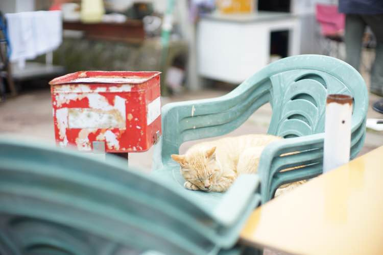
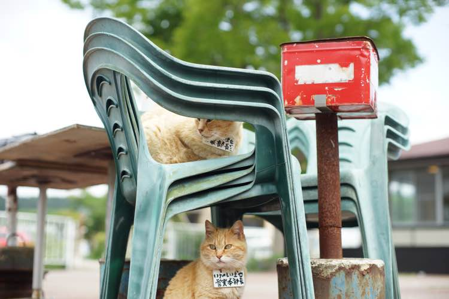

  

62楼 | nbbllxx | 2015-05-21 10:53
    
    2015-05-22 08:52 | MINA丶风少:
    > 师傅！
    2015-05-24 13:05 | QINSJ1234:
    > 眼神好犀利
* * *
顶一个
  

63楼 | 你家阿佬 | 2015-05-21 11:46
* * *
前排
  

64楼 | 唐不死love | 2015-05-21 11:52
* * *
柔柔弱弱人人
  

65楼 | 我找周周周星星 | 2015-05-21 12:01
* * *
一次说走就走的旅行
  

66楼 | 最终决战式☞桜 | 2015-05-21 12:02
* * *
动画一样的长楼梯，一面通向神社一面通向湖边
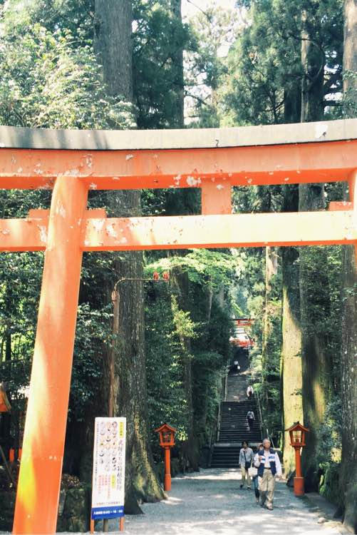
  

67楼 | nbbllxx | 2015-05-21 12:13
* * *
奥木染？
  

68楼 | 天乾灵神物♂ | 2015-05-21 12:38
    
    2015-05-21 12:42 | nbbllxx:
    > 叉伊姬神社喇，奥木染是去年去的
    2015-05-21 12:43 | 天乾灵神物♂:
    > 回复 nbbllxx :
* * *
LZ棒棒哒～我也想去可是没时间也没钱…
  

69楼 | 幻化璃心✨ | 2015-05-21 12:46
* * *
年年都去的楼主真是让我倍受打击！现充爆炸吧～
  

70楼 | 幻化璃心✨ | 2015-05-21 12:51
* * *
～.～后排支持
  

71楼 | Tu梦幻 | 2015-05-21 13:11
* * *
顶个 围观土豪
  

72楼 | 花落只剩孤漠 | 2015-05-21 13:11
* * *
真好啊
  

73楼 | 机智的小夜 | 2015-05-21 13:30
* * *
顶顶，土豪我们做朋友吧
  

75楼 | 杀神丿丶降临 | 2015-05-21 19:24
* * *
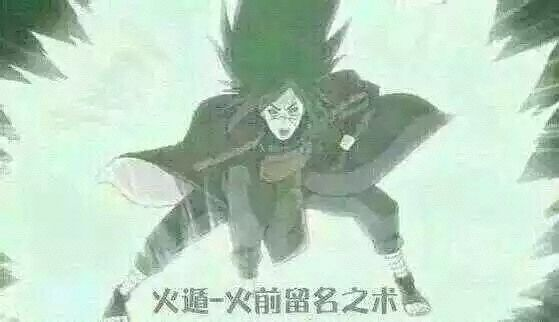
  

77楼 | 平凡的年轻人🌿 | 2015-05-21 20:48
* * *
顶一下
  

78楼 | 小逢场 | 2015-05-22 06:41
* * *
直播完了
  

79楼 | 樱花远去的背影 | 2015-05-22 07:16
    
    2015-05-22 07:29 | nbbllxx:
    > 没了
    2015-05-22 07:37 | 樱花远去的背影:
    > 回复 nbbllxx :才看啊，和大师一样，都去圣地巡游了，好羡慕啊
* * *
顶~
  

80楼 | 幻化璃心✨ | 2015-05-22 07:43
* * *
在京都抓到了上次没拍到的女子高中生 
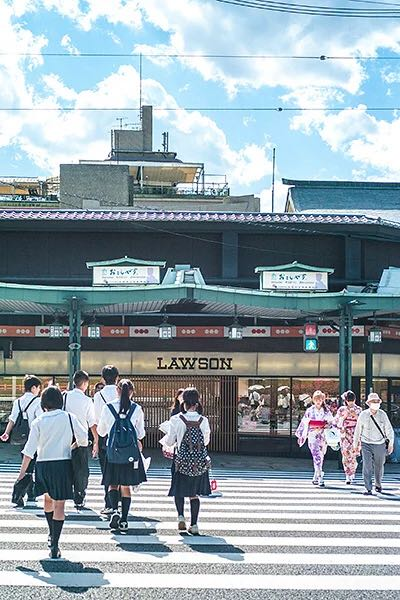
  

81楼 | nbbllxx | 2015-05-22 07:58
    
    2015-05-22 07:58 | nbbllxx:
    > 都在休学旅行
    2015-06-29 11:59 | 苍小绯:
    > 回复 nbbllxx :修学
    2015-07-07 06:10 | love星殒:
    > 警察叔叔这里有变态在偷拍我想起一朋友4个月前在千叶跟楼主一样拍女高结果进去了
    2015-07-07 17:34 | 这要死的名字:
    > 回复 love星殒 :噗……
    2015-07-07 17:42 | love星殒:
    > 回复 这要死的名字 :正准备喷他3月春假才过去学生少穿得也多还是千叶想拍的话6月就去东京拍，结果就进去了，啧啧，真不值
* * *
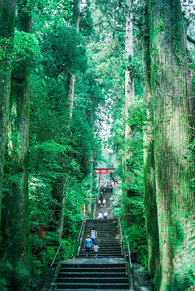
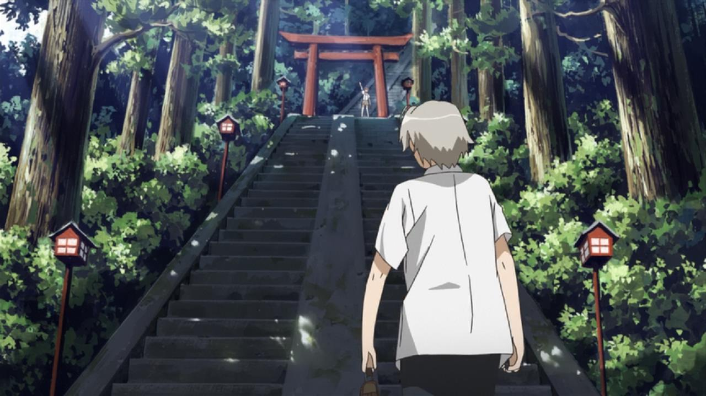
叉伊姬神社  
注意台阶边上的灯笼
  

82楼 | nbbllxx | 2015-05-22 08:16
    
    2015-06-26 01:00 | 布拉德莱克:
    > 棒呆了
    2015-06-29 08:03 | 拈朵微笑的花🌹:
    > 这个果断现实更棒
* * *
对@nbbllxx 使用普通的挽尊卡挽回他的尊严！效果：缘之空吧经验+3
  

83楼 | Dark丶羊▫ | 2015-05-22 12:45
* * *
谁说要看电车里的电风扇的
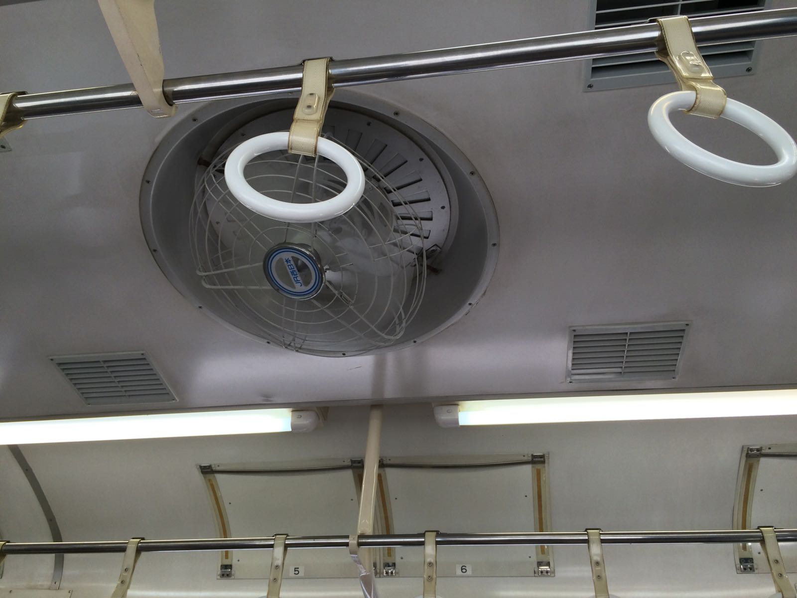
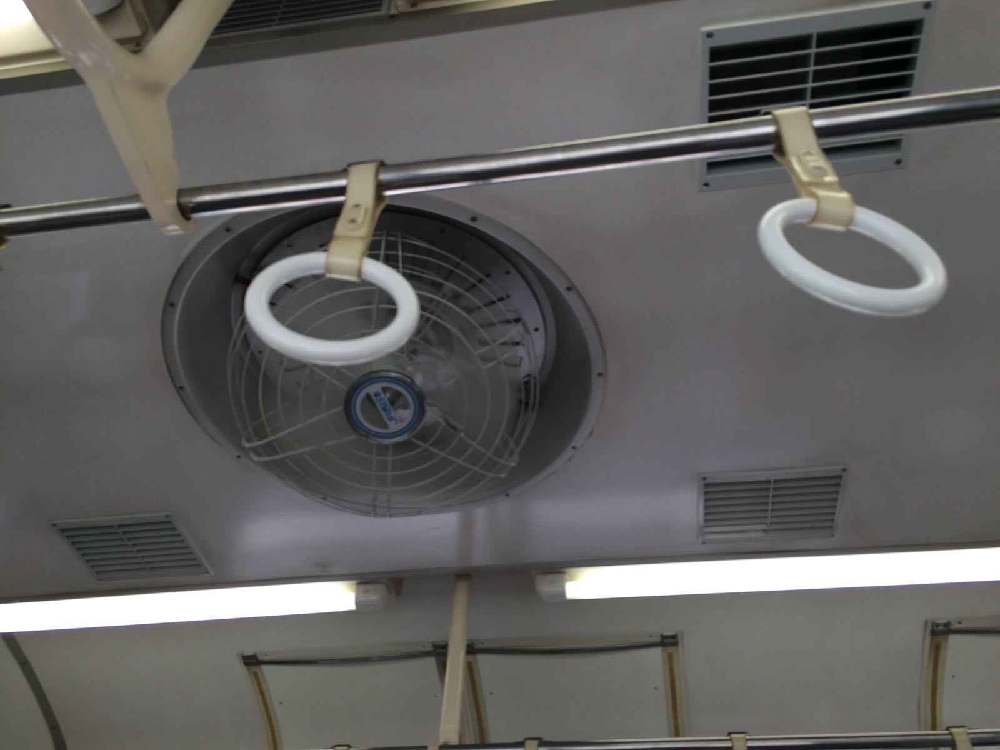
  

84楼 | nbbllxx | 2015-05-22 14:01
    
    2015-05-22 14:14 | 黯霷:
    > 
* * *
⊙▽⊙
  

85楼 | 你笑的过分诱人 | 2015-05-22 14:31
* * *
顶
  

86楼 | 你笑的过分诱人 | 2015-05-22 14:31
* * *

  

87楼 | Arway💤 | 2015-05-22 16:10
* * *
好赞 好想去
  

88楼 | 最後被遺忘 | 2015-05-22 17:21
* * *
好赞
  

89楼 | 最後被遺忘 | 2015-05-22 17:25
* * *
楼主多大啊
  

90楼 | 转角处鉁稀 | 2015-05-22 17:55
    
    2015-05-22 17:56 | nbbllxx:
    > 大学狗
* * *
发现已经有很多地方和缘之空的场景不谋而合了，原来奥木染是日本各处的美景的结合体
  

91楼 | 艾里克斯小莫 | 2015-05-22 20:02
    
    2015-05-22 21:10 | nbbllxx:
    > 圣地巡礼是有依据的，不是到处乱走
* * *
好赞，留名
  

92楼 | 🔯夜之魔王🔯 | 2015-05-22 20:25
* * *
话说神社所在地就是动画里的奥木染小镇吗
  

93楼 | 🔯夜之魔王🔯 | 2015-05-22 20:27
    
    2015-05-22 21:10 | nbbllxx:
    > 不是
    2015-05-22 21:10 | nbbllxx:
    > 你可以看我2014年的圣地巡游
    2015-05-22 21:17 | 🔯夜之魔王🔯:
    > 回复 nbbllxx :看到了，桦崎也有个叉依姬神社？感觉箱根的比较像
    2015-05-22 21:26 | nbbllxx:
    > 回复 我们真的是害虫 ：[语音](audios/1.amr)
>     
    2015-05-22 21:26 | nbbllxx:
    > 回复 我们真的是害虫 ：[语音](audios/2.amr)
>     
    2015-05-22 22:24 | 🔯夜之魔王🔯:
    > 回复 nbbllxx :感谢楼主科普，楼主去日本是怎么解决语言问题的
    2015-05-22 22:43 | nbbllxx:
    > 回复 我们真的是害虫 ：会说一点日语 英语也不错
    2015-05-22 22:55 | 🔯夜之魔王🔯:
    > 回复 nbbllxx :英语行得通？
    2015-05-22 23:06 | nbbllxx:
    > 回复 我们真的是害虫 ：会说一点日语 英语也不错大城市没问题，小县城有点困难
    2015-05-22 23:10 | 🔯夜之魔王🔯:
    > 回复 nbbllxx :好想去一趟啊，楼主一趟花了多少钱
    2015-05-22 23:17 | nbbllxx:
    > 回复 我们真的是害虫 ：一万左右吧
    2015-05-22 23:47 | 🔯夜之魔王🔯:
    > 回复 nbbllxx :只去了箱根？去了多久
    2015-05-23 04:04 | nbbllxx:
    > 回复 我们真的是害虫 ：还有很多地方，总共八九天吧
    2015-05-23 10:20 | 🔯夜之魔王🔯:
    > 回复 nbbllxx :还不算很贵，找机会一定要去朝圣
    2015-06-26 01:05 | 布拉德莱克:
    > 回复 nbbllxx :楼主好棒
* * *
赞哦~
  

94楼 | 小绿人国民军 | 2015-05-22 22:27
* * *
赞
  

95楼 | Nc的家伙z | 2015-05-22 22:42
* * *
开奖喇
  

96楼 | RoseAz桐 | 2015-05-22 23:05
* * *
赞
  

98楼 | 艹歆丷风艹 | 2015-05-23 21:38
* * *
想去
  

99楼 | 妹控即是正义💧 | 2015-05-23 23:32
* * *
赞赞赞~
  

100楼 | QINSJ1234 | 2015-05-24 13:07
* * *
顶，膜拜
  

101楼 | 古语之书 | 2015-05-24 15:53
* * *
话说那里在缘之空被制作之前有名吗
  

102楼 | 古语之书 | 2015-05-24 15:56
    
    2015-06-26 01:01 | nbbllxx:
    > 本来就很有名，比较漂亮的神社，在温泉之都里。动画以这个为背景但是游戏不是
    2015-06-26 16:35 | 古语之书:
    > 回复 nbbllxx :你这坟挖的
    2015-06-26 16:36 | nbbllxx:
    > 回复 古语之书 ：主要昨天做了gif贴上来
    2015-06-27 16:00 | 布拉德莱克:
    > 回复 古语之书 :他是楼主啊喂
    2015-06-27 20:41 | 古语之书:
    > 回复 布拉德莱克 :管那么多干什么，我说是就是
* * *
好赞🔝
  

103楼 | 绿灯军团长 | 2015-05-26 06:53
* * *
留名
  

104楼 | 灰色黎明free | 2015-05-26 15:35
* * *
赞
  

105楼 | 古语之书 | 2015-06-05 19:12
* * *
好棒好棒啊，感谢楼楼了
  

106楼 | 布拉德莱克 | 2015-06-26 01:06
* * *
神社内部，绘马和夹竹桃  
因为我在内部只拍了视频没拍照片，所以只能做gif了  
最近一段时间有点忙 今年的圣地巡礼视频估计也要像去年一样拖一两个月
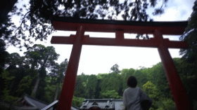
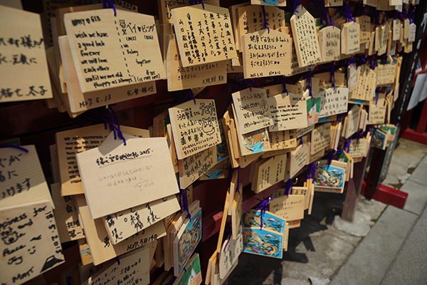
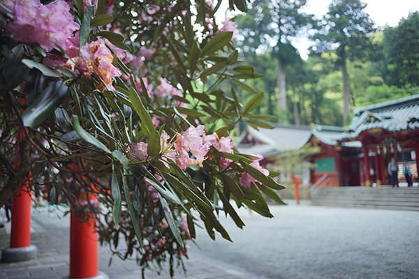
  

110楼 | nbbllxx | 2015-06-26 01:16
* * *
动画中瑛住的地方并没有什么东西
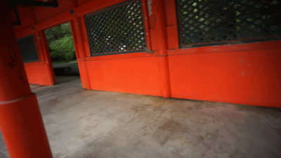
沿着楼梯一步步走上去的感觉 
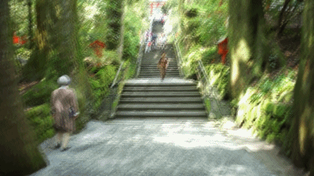
  

111楼 | nbbllxx | 2015-06-26 01:23
* * *
往下走来到湖边 
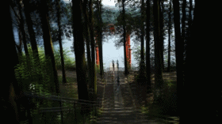
就是这个在湖里的大鸟居 
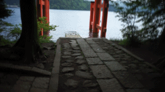
  

112楼 | nbbllxx | 2015-06-26 01:27
* * *
跳湖的gif有十几兆_(:зゝ∠)_  
贴吧不行于是只能传新浪微博了  
想看的小伙伴可以点开来看0v0  
[http://ww2.sinaim](http://tieba.baidu.com/mo/q/checkurl?url=http%3A%2F%2Fww2.sinaim&meta=1&urlrefer=3f8902ca3f9fce52d91f787b7816a60c)g.cn/large/91865970gw1etguzj2dbug20b40694qx.gif  
复制到地址栏就行
  

114楼 | nbbllxx | 2015-06-26 01:45
* * *
顶
  

115楼 | ✨酒吞🍺童子💫 | 2015-06-26 01:58
* * *
看看 挤挤
  

117楼 | 宫小路三千院 | 2015-06-26 03:06
* * *
太
  

118楼 | 星烁✨ | 2015-06-26 04:29
* * *
忽然又更新了呢
  

119楼 | 古语之书 | 2015-06-26 16:36
* * *
顶顶
  

120楼 | 古语之书 | 2015-06-26 16:37
* * *
好棒好棒
  

122楼 | 布拉德莱克 | 2015-06-27 16:03
* * *

  

123楼 | Messii◆ | 2015-06-29 12:52
* * *
大赞啊
  

124楼 | 千叶渐雪 | 2015-06-30 14:43
* * *
好漂亮，水很清啊，景物和漫画的太像了
  

126楼 | 刀锋浩 | 2015-06-30 18:43
* * *
喂！那边的白发少年，你去湖里干嘛？快付钱再去
  

127楼 | 媒体不可💨☞💦 | 2015-07-01 08:49
* * *
顶
  

129楼 | 有问必答百事通 | 2015-07-06 14:17
* * *
补上几张游船上的照片，很大的船，据说有几十年历史的观光线路 
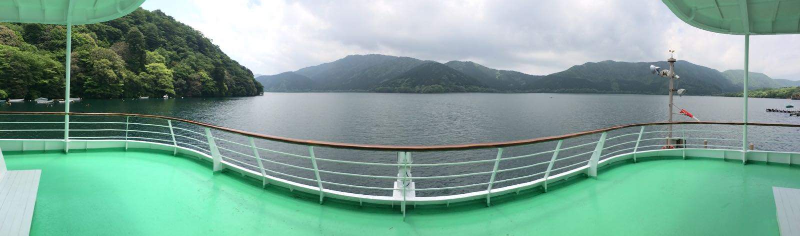
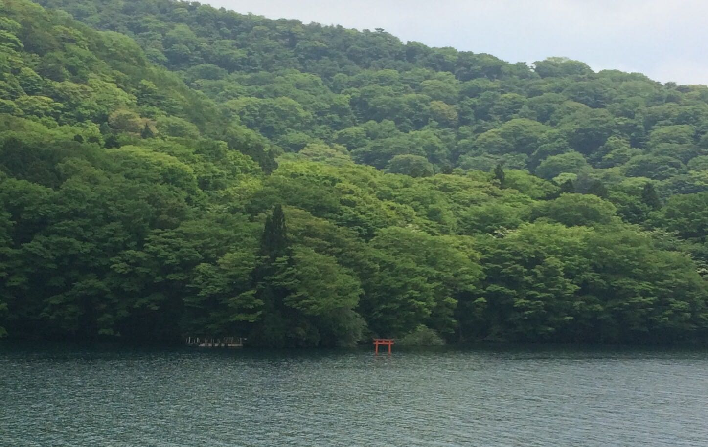
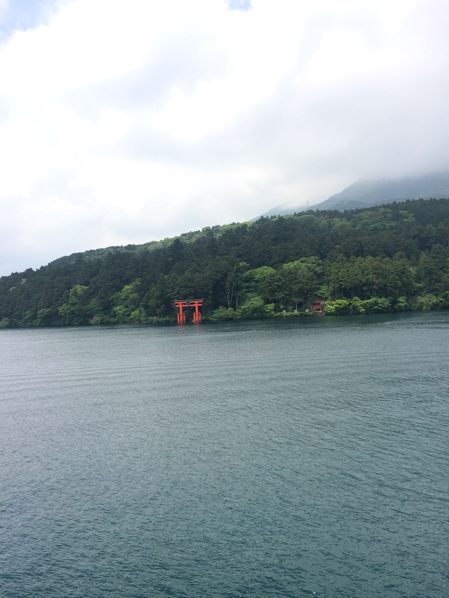
  

130楼 | nbbllxx | 2015-07-06 14:23
    
    2015-07-06 14:26 | nbbllxx:
    > 湖边有两个神社，九头龙神社和箱根神社，后者比前者大很多。传说有个九头龙在湖里作怪杀人，后来来了一个和尚谈判，然后九头龙改过自新变成了人类居住。为了纪念这个事情就建起了小小的九头龙神社
    2017-12-26 20:56 | Sola🎀:
    > 能说一下预算么 ，就来回车票加上酒店 的预算 @nbbllxx
    2017-12-27 00:50 | nbbllxx:
    > 回复 Sola🎀 :9天一个人去的话算上交通一天一千这样吧 不过大大小小能省很多
* * *
马克
  

131楼 | 😘郭嘉 | 2015-07-07 01:01
* * *
羡慕
  

132楼 | 叉依姫神社 | 2015-07-07 03:04
* * *
难道深夜看帖的就只有我一个人了么
  

133楼 | 叉依姫神社 | 2015-07-07 03:06
    
    2015-07-08 00:19 | 贴吧用户_0KWGyA5:
    > 我也深夜看帖
    2015-07-08 01:51 | 叉依姫神社:
    > 回复 叛逆青春66 :今天也是 泥嚎ww
    2015-07-08 01:52 | 贴吧用户_0KWGyA5:
    > 回复 叉依姫神社 :
* * *
看到这个帖子果断进来了
  

134楼 | 贴吧用户_0KWGyA5 | 2015-07-08 00:18
* * *
这么像！
  

135楼 | 2012dwc | 2015-07-11 16:40
* * *
大赞(≥▽≤)
  

136楼 | 钧秀志 | 2015-07-12 15:20
* * *
鲁迅，原名冰心，后改名步惊云，恶魔果实能力者，传说中的三忍之一，曾大闹天宫，后改邪归正，统一三国，传说他有107个弟兄，个个铜头铁臂，面目狰狞，这便是羊村的起源，她生平淡泊名利，后遇到高人阿凡达的指点，打死了白雪公主，与七个小矮人快乐的生活在一起。！ 并写了名侦探柯南的故事。名侦探柯南讲述的是要成为海贼王的八神太一收服了皮卡丘并登上创界山启动光能使者打败了鲨鱼辣椒，然后跟多梦啦A梦一起通过黄金十二宫收集七个葫芦娃召唤神龙复活二代火影，但最终为了保卫M78星云而成为了羊村村长，同蓝精灵们一起抵抗光头强的入侵的故事
  

137楼 | 穿越张宇博大仙 | 2015-07-15 17:37
* * *
鲁迅，原名冰心，后改名步惊云，恶魔果实能力者，传说中的三忍之一，曾大闹天宫，后改邪归正，统一三国，传说他有107个弟兄，个个铜头铁臂，面目狰狞，这便是羊村的起源，她生平淡泊名利，后遇到高人阿凡达的指点，打死了白雪公主，与七个小矮人快乐的生活在一起。！ 并写了名侦探柯南的故事。名侦探柯南讲述的是要成为海贼王的八神太一收服了皮卡丘并登上创界山启动光能使者打败了鲨鱼辣椒，然后跟多梦啦A梦一起通过黄金十二宫收集七个葫芦娃召唤神龙复活二代火影，但最终为了保卫M78星云而成为了羊村村长，同蓝精灵们一起抵抗光头强的入侵的故事
  

138楼 | 穿越张宇博大仙 | 2015-07-15 17:38
* * *
鲁迅，原名冰心，后改名步惊云，恶魔果实能力者，传说中的三忍之一，曾大闹天宫，后改邪归正，统一三国，传说他有107个弟兄，个个铜头铁臂，面目狰狞，这便是羊村的起源，她生平淡泊名利，后遇到高人阿凡达的指点，打死了白雪公主，与七个小矮人快乐的生活在一起。！ 并写了名侦探柯南的故事。名侦探柯南讲述的是要成为海贼王的八神太一收服了皮卡丘并登上创界山启动光能使者打败了鲨鱼辣椒，然后跟多梦啦A梦一起通过黄金十二宫收集七个葫芦娃召唤神龙复活二代火影，但最终为了保卫M78星云而成为了羊村村长，同蓝精灵们一起抵抗光头强的入侵的故事
  

139楼 | 穿越张宇博大仙 | 2015-07-15 17:39
* * *
鲁迅，原名冰心，后改名步惊云，恶魔果实能力者，传说中的三忍之一，曾大闹天宫，后改邪归正，统一三国，传说他有107个弟兄，个个铜头铁臂，面目狰狞，这便是羊村的起源，她生平淡泊名利，后遇到高人阿凡达的指点，打死了白雪公主，与七个小矮人快乐的生活在一起。！ 并写了名侦探柯南的故事。名侦探柯南讲述的是要成为海贼王的八神太一收服了皮卡丘并登上创界山启动光能使者打败了鲨鱼辣椒，然后跟多梦啦A梦一起通过黄金十二宫收集七个葫芦娃召唤神龙复活二代火影，但最终为了保卫M78星云而成为了羊村村长，同蓝精灵们一起抵抗光头强的入侵的故事
  

140楼 | 穿越张宇博大仙 | 2015-07-15 17:39
* * *
鲁迅，原名冰心，后改名步惊云，恶魔果实能力者，传说中的三忍之一，曾大闹天宫，后改邪归正，统一三国，传说他有107个弟兄，个个铜头铁臂，面目狰狞，这便是羊村的起源，她生平淡泊名利，后遇到高人阿凡达的指点，打死了白雪公主，与七个小矮人快乐的生活在一起。！ 并写了名侦探柯南的故事。名侦探柯南讲述的是要成为海贼王的八神太一收服了皮卡丘并登上创界山启动光能使者打败了鲨鱼辣椒，然后跟多梦啦A梦一起通过黄金十二宫收集七个葫芦娃召唤神龙复活二代火影，但最终为了保卫M78星云而成为了羊村村长，同蓝精灵们一起抵抗光头强的入侵的故事
  

141楼 | 穿越张宇博大仙 | 2015-07-15 17:40
* * *
鲁迅，原名冰心，后改名步惊云，恶魔果实能力者，传说中的三忍之一，曾大闹天宫，后改邪归正，统一三国，传说他有107个弟兄，个个铜头铁臂，面目狰狞，这便是羊村的起源，她生平淡泊名利，后遇到高人阿凡达的指点，打死了白雪公主，与七个小矮人快乐的生活在一起。！ 并写了名侦探柯南的故事。名侦探柯南讲述的是要成为海贼王的八神太一收服了皮卡丘并登上创界山启动光能使者打败了鲨鱼辣椒，然后跟多梦啦A梦一起通过黄金十二宫收集七个葫芦娃召唤神龙复活二代火影，但最终为了保卫M78星云而成为了羊村村长，同蓝精灵们一起抵抗光头强的入侵的故事
  

142楼 | 穿越张宇博大仙 | 2015-07-15 17:42
    
    2015-08-04 09:19 | 贴吧用户_QA1X5b5:
    > 老梗
    2015-08-04 16:45 | 穿越张宇博大仙:
    > 回复御坂是我神:我用这个水经验好多年了
* * *
dd
  

143楼 | 膝盖红肿 | 2015-07-17 07:15
* * *
去一次大概多少钱
  

144楼 | 哥也有妇炎洁 | 2015-07-29 11:32
    
    2015-08-03 23:27 | nbbllxx:
    > 5000～10000
    2015-08-04 03:09 | 柒彩丶棒棒糖灬:
    > 回复 nbbllxx :只想说楼主 我顶你 我爱你 哈哈
    2015-08-04 09:19 | 贴吧用户_QA1X5b5:
    > 哇哦，土豪泥壕
* * *
我就看看我几级了
  

145楼 | 贴吧用户_QA1X5b5 | 2015-08-04 09:20
* * *
 是谁写下了史家之绝唱，无韵之离骚？  
答案：司马迁，是太监！是阉党！  
 是谁改良了造纸术，传承了人类文明？  
答案：蔡伦，是太监！是阉党！  
 是谁拓边西北，经略幽燕？  
答案：童贯，是太监，是阉党！  
 是谁扬帆远航，扬国威于万里之外？  
答案：郑和，是太监！是阉党！  
 是谁只手遮天，压制祸国殃民的东林党  
答案：魏忠贤，是太监！是阉党！  
 是谁发此贴子骗我们回复的？  
答案：是楼主，………   
表示不太明白  
还有么
  

146楼 | 穿越张宇博大仙 | 2015-08-04 16:46
* * *
还真有啊
  

147楼 | 我偷偷看着你😜 | 2015-08-04 17:00
* * *
么么哒
  

148楼 | 逸落枫已 | 2015-08-05 02:10
* * *
楼主 给个缘之空的官网地址啊 这次暑假去日本没去成取景地！特么我忘了在哪了 (主要还是长崎离那太远了) 高考完了准备再去一次
  

149楼 | 最後被遺忘 | 2015-08-13 18:17
    
    2016-05-08 20:34 | nbbllxx:
    > 官网没有写地址……
    2016-05-09 00:07 | 最後被遺忘:
    > 回复 nbbllxx :现在回。。。。。
    2016-05-09 00:11 | nbbllxx:
    > 回复 最後被遺忘 :才看到。。不好意思
* * *
W
  

150楼 | 🌝龙龙🌚 | 2015-10-01 13:51
* * *
我要去～～
  

151楼 | small猫Mao咪 | 2015-10-05 11:45
* * *
这贴子不该沉
  

152楼 | 神马中的神马0 | 2016-05-08 16:15
* * *
想起，楼主带我
  

153楼 | 贪玩♂男玥 | 2016-12-18 21:19
    
    2016-12-18 21:20 | 贪玩♂男玥:
    > 想去，垃圾输入法
* * *
日本可以用apple pay吗
  

154楼 | Ramp◎º | 2017-05-01 11:15
    
    2018-03-27 02:49 | nbbllxx:
    > 我去那会儿还没火起来hh想想应该可以
    2018-03-27 17:33 | Ramp◎º:
    > 回复 nbbllxx ：
* * *
lz，你两个贴去了两个取景地，两边都提到了叉伊姬神社，哪个是真的啊
  

155楼 | 坑爹爹卖队友 | 2017-05-01 23:23
    
    2018-03-27 02:49 | nbbllxx:
    > 最早那个是真的神社，这个是后山湖
* * *
up
  

156楼 | 穹妹是我的♀ | 2017-07-29 23:45
* * *
留名，有生之年，数年后的贵土再见。
  

157楼 | Habit-1 | 2017-08-31 22:31
* * *
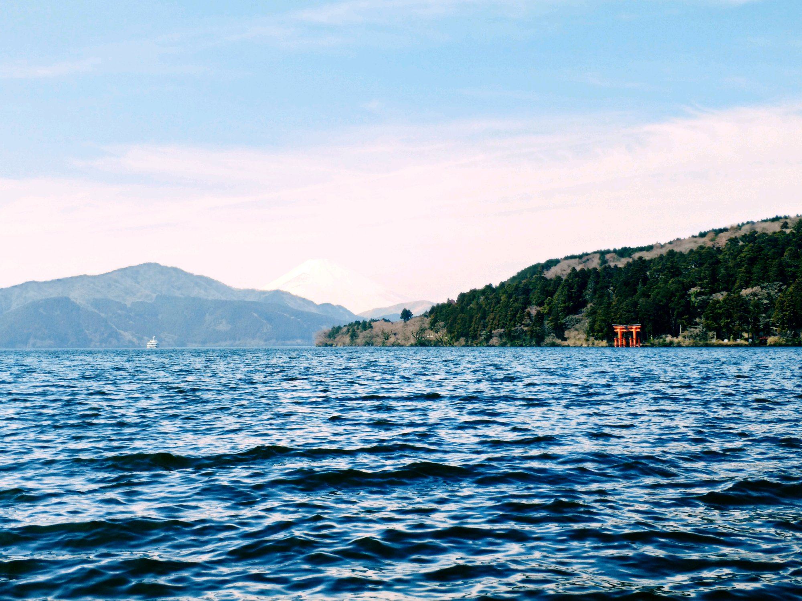
  

158楼 | -Lydia | 2018-03-26 13:40
    
    2018-04-07 01:14 | 不怨骤降♬:
    > 哇，这么美
* * *
感谢楼主，留个名
  

159楼 | 不怨骤降♬ | 2018-04-07 01:15
* * *
感谢楼主
  

160楼 | EscapSº | 2018-07-29 05:29
* * *
有机会一定要去看看
  

162楼 | 贴吧用户_7QV8ZK8 | 2020-08-03 00:41
