望悠远的天空，追寻苍穹的尽头
* * *
真是有些难为情，又是我，时隔两年我又回来了，回来继续完成之前意外没能完成的圣地巡礼，为了弥补留下的遗憾。 

  

1楼 | sssnnnbb | 2018-09-03 19:49
* * *
继上次留下遗憾以后回国，好长一段时间都内心痛苦难受，经常辗转反侧睡不着，常常梦里也处于去圣地的路上徘徊但是不能触碰，让人魂牵梦绕太多次  
每每想起 缘之空 就会回忆抑郁严重中毒那两个月的日日夜夜，当时能陷得如此之深，一两年之后也还在毒泥潭里  
是我永远的痛
  

2楼 | sssnnnbb | 2018-09-03 19:51
    
    2018-09-05 10:57 | sssnnnbb:
    > 前排提示，这次不仅去我们 缘之空 的圣地，还会去 你的名字 未闻花名 等的圣地巡礼，吉卜力 藤子F不二雄美术馆之类的，值得期待
    2018-09-06 01:13 | sssnnnbb:
    > 话说看的小伙伴要是能在贴里留个爪楼楼就太高兴了，知道有人看着就很开心知道大家都期待着，没人看就感觉多少有些寂寞
    2018-09-09 23:47 | 爱着这天地:
    > 回复 sssnnnbb :未闻花名
    2018-09-10 08:04 | sssnnnbb:
    > 回复 爱着这天地 :嗯嗯
    2018-09-11 11:44 | sssnnnbb:
    > 回复 Achilles9951 :
    2018-09-11 13:34 | sssnnnbb:
    > 回复 Achilles9951 :如果是我，就细心感受，这种感觉可不是每次都有的，感受着内心的变化从忧伤一点点被治愈，对其祝福，难有的心情应该珍惜而不是驱逐
    2018-09-11 13:35 | sssnnnbb:
    > 回复 Achilles9951 :楼主多么希望坐在神社好好大哭一场，释放出压抑，既因为 缘之空 带给的感受，又为了自己几年来的努力和心理，虽然楼主并不是爱哭鬼，更不是轻易流泪的人。
    2018-09-11 13:40 | sssnnnbb:
    > 回复 Achilles9951 :
    2019-07-23 19:28 | ♂似雨若离♤:
    > 看完后，患得患失，仔细回想，伤感不已，历经时光，心中烙印，转头回望，默默祝福。（附：苍穹之恋，天地可鉴，禁断厉鬼，佛魔不惧）
    2019-07-24 00:10 | sssnnnbb:
    > 回复 贴吧用户_7AeCZ56 :一系列真实真情人反应，很文艺很简约
    2019-07-25 12:24 | ♂似雨若离♤:
    > 回复 sssnnnbb :自己写的....谢谢哦！
    2019-07-25 21:05 | sssnnnbb:
    > 回复 ♂似雨若离♤ :非常棒~
* * *
这次还是两个人，本来呢，队友是个美女，可惜人生总会有些意外，后来不仅萌妹子没了，夏日祭也赶不上了，本来一年前的夏天就打算再去的，只是没有队友有些孤单，然后就跟一妹子约定明年也就是今年夏天去。时间到了今年夏天，未知的生活总是处处是“惊喜”，原本还幻想着能有一段浪漫充满期待的旅行，本来动力更充足的，随后又出现各种大小状况，真是折磨人，最后临时找到队友无奈只能再拖一个月出发，也就是直到今天。
  

4楼 | sssnnnbb | 2018-09-03 19:52
* * *
楼主有拖延症，偏偏重温这样的事总是安排在临近出发的最后几天，玩玩 缘之空 的游戏或看看动漫还得做好心理准备，也许是因为太看重了才会这么慎重，预留时间内突然又碰上朋友生日不得不出去玩一天，这下好时间一下又缩短一天，本来找攻略复习日语的时间就已经没了的说，花了两天时间才通了两年前没完全通关的 奈绪 线和最期待的 穹 线， 虽然一直很期待，但是总感觉有心结所以一直没继续走下去。  
昨天从中午进入 穹 线到凌晨2点才通关，中间故事感动却强忍住不让泪留下来，结尾的时候泪点不够又因为精神疲惫，眼睛都开始自主晃动了，虽然感动着却哭不出来了，最后悠之空 也没来得及多玩，把动漫再通了一遍。  
都怪时间没把握好，时间弄得太紧了，最近又花很多时间找攻略，这两天又抓紧时间玩 缘之空 游戏和重温动漫，起床就继续，坚持到半夜，睡眠时间也从8 9个小时缩短到6小时不足  
嘛，有错的不仅仅是我，还有那各种不定的因素，不确定到底能不能去什么时候去，所以有些事才推到确定以后才去办
  

5楼 | sssnnnbb | 2018-09-03 19:53
    
    2018-10-04 22:23 | 不怨骤降♬:
    > 辛苦了
    2018-10-04 23:04 | sssnnnbb:
    > 回复 骤降life :
* * *
上次旅行开始，帖子里很多人关心我，也同样期待着下一次的旅行，每次看到真的都很开心
  

6楼 | sssnnnbb | 2018-09-03 19:53
    
    2018-09-06 08:16 | sssnnnbb:
    > @悠穹HaruSora @后id收购 @滑稽的萝卜 @龙卷风吧great 艾特人不能太多，但是多少召唤些小伙伴吧
    2018-09-06 08:17 | 后id收购:
    > 回复 sssnnnbb :奇妙，我这两周才重新回贴吧就被你艾特了
    2018-09-06 08:18 | sssnnnbb:
    > @灰太狼的溫柔🌸 @最後丶XL
    2018-09-06 08:18 | sssnnnbb:
    > 回复 后id收购 :太好了！
    2018-09-06 08:21 | sssnnnbb:
    > 回复 后id收购 :@桐生战兔😘😚
    2018-09-06 08:22 | sssnnnbb:
    > 回复 后id收购 :@🌱春日野穹
    2018-09-06 08:23 | 后id收购:
    > 回复 sssnnnbb :羡慕你又能去，两年过去了我还是没去成
    2018-09-06 08:23 | sssnnnbb:
    > 召唤多了容易小黑屋，好怀念以前旅游的时候大家还都一起愉快的聊天
    2018-09-06 08:25 | sssnnnbb:
    > 回复 后id收购 :我每天都会跟人道晚安，其中会说的一句话就是“願いはいつかは叶える”，总有一天的
    2018-09-06 13:38 | 灰太狼的溫柔🌸:
    > 回复 sssnnnbb :谢谢，估计我的行程要到寒假了，到时候开直播。
    2018-09-06 13:57 | sssnnnbb:
    > 回复 cwz888day :好啊我也会，期待着！记得叫我
    2018-09-06 18:06 | 滑稽的萝卜:
    > 
    2018-09-06 20:46 | sssnnnbb:
    > 回复 滑稽的萝卜 :咬一口可以吗
    2018-09-22 10:14 | 桐生战兔😘😚:
    > 回复 sssnnnbb :开学已死……
    2018-09-22 12:38 | sssnnnbb:
    > 回复 CLE_LBJ :你还活着吧
    2018-09-22 12:57 | 桐生战兔😘😚:
    > 回复 sssnnnbb :还在玩约炮大作战呢
    2018-09-22 13:32 | sssnnnbb:
    > 回复 CLE_LBJ :可以啊
    2018-10-24 18:04 | 最後丶XL:
    > 我被🐷艾特了
    2018-10-24 20:24 | sssnnnbb:
    > 回复 最後丶XL :然鹅你个**现在才出现，整天就知道玩FFF团长
    2018-10-25 00:57 | sssnnnbb:
    > 回复 最後丶XL :你个猪头
    2019-04-16 21:49 | 最後丶XL:
    > 回复 sssnnnbb :沉迷异端无法自拔即便是倒数前三的职业
    2019-04-16 23:31 | sssnnnbb:
    > 回复 最後丶XL :大佬666，卧槽9个9！！
    2019-04-16 23:38 | 最後丶XL:
    > 回复 sssnnnbb :来带我打漩涡啊，我打不过
    2019-04-17 00:05 | sssnnnbb:
    > 回复 最後丶XL :今天才带了同事，哦不，明天我没疲劳了
    2019-08-17 13:02 | 龙卷风吧great:
    > 嗨～我又回来了，顶楼主！
    2019-08-19 00:26 | sssnnnbb:
    > 回复 龙卷风吧great :天呐，你还活着呐，你被续了吗，这么长寿，这是多久多久多久没出现了
    2019-08-22 13:34 | 龙卷风吧great:
    > 回复 sssnnnbb :没有多久哈哈，我只是高考完了。。，我再长寿，也没有你的帖子久
    2019-08-23 00:10 | sssnnnbb:
    > 回复 龙卷风吧great :高考都考完多久了你才献身，啊呸，现身
    2019-08-27 12:41 | 龙卷风吧great:
    > 回复 sssnnnbb :赶紧补一下lz最近的历程
    2019-08-28 00:34 | sssnnnbb:
    > 回复 龙卷风吧great :现在才想起来
* * *
这次待满签证15天，还是跟上次一样全程记录，大大小小的事都会分享，现在楼主人在香港等着11点50去日本的航班，昨晚为了重温才睡两个半小时，很疲惫，脑子里有不少空白，弄得有点不舒服，在香港还打不开百度云
  

7楼 | sssnnnbb | 2018-09-03 19:59
* * *
楼主你上一个帖子我都看完了
  

8楼 | ▫海琴烟▫ | 2018-09-03 20:00
    
    2018-09-03 20:25 | sssnnnbb:
    > 就喜欢你这样的，小感动
* * *
先休息下吧
  

9楼 | 五月雨🍒 | 2018-09-03 20:06
    
    2018-09-03 20:26 | sssnnnbb:
    > 嗯嗯
* * *
休息下，别累坏了
  

10楼 | 春日野▫悠 | 2018-09-03 20:14
    
    2018-09-03 20:26 | sssnnnbb:
    > 虽然同意，但是看见你狗头我感觉不自在了
    2018-09-03 20:37 | 春日野▫悠:
    > 回复 sssnnnbb :实在不行的话，贴吧里有大佬做的视频，哔哩哔哩上也有。谁让你不下载
* * *
我要在你这个帖子里水到10级
  

11楼 | 春日野▫悠 | 2018-09-03 20:15
    
    2018-09-03 20:33 | 五月雨🍒:
    > 还没10级呀
    2018-09-03 20:35 | 春日野▫悠:
    > 快了快了……
    2018-09-03 20:53 | 五月雨🍒:
    > 回复 春日野▫悠 :10级了开个贴庆祝一下
* * *
拉上来 

  

12楼 | 春日野▫悠 | 2018-09-03 20:17
    
    2018-09-03 20:27 | sssnnnbb:
    > 大水比小心被小黑屋
    2018-09-03 20:35 | 春日野▫悠:
    > 回复 sssnnnbb :前几天被官方关了一次不过没关系。
* * *
美美的 

  

13楼 | sssnnnbb | 2018-09-03 20:30
* * *
再给你一张图。 
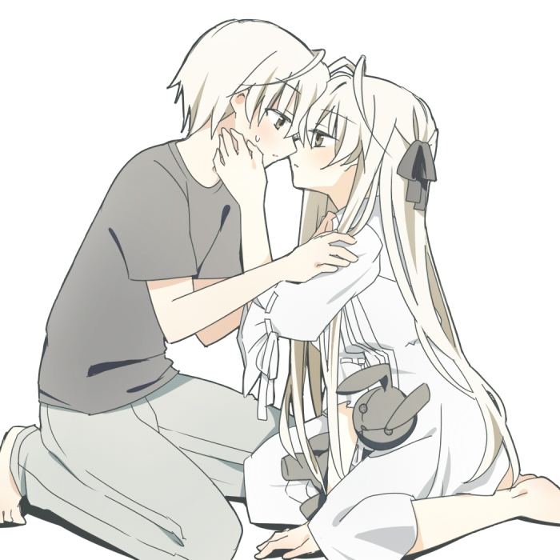
  

14楼 | 春日野▫悠 | 2018-09-03 20:38
    
    2018-09-03 20:39 | 春日野▫悠:
    > 我飞车头像
    2018-09-03 20:52 | 五月雨🍒:
    > 没我的好看
    2018-09-03 20:53 | sssnnnbb:
    > 虽然我有
    2018-09-03 22:25 | 春日野▫悠:
    > 回复 sssnnnbb :那就捞下帖子
* * *

  

15楼 | 陆诩-耶格尔 | 2018-09-03 20:45
* * *
赶快给我们带来精彩的圣地巡礼啊
  

16楼 | 静夜五更默琉璃 | 2018-09-03 21:16
    
    2018-09-03 21:27 | sssnnnbb:
    > 时候还没到嘛，我连日本都还没登陆呢
    2018-09-03 21:30 | 静夜五更默琉璃:
    > 回复 sssnnnbb :那楼主可得加油了
    2018-09-03 21:49 | sssnnnbb:
    > 回复 静夜五更默琉璃 :嗯嗯
* * *
顶  
等我毕业了我也去
  

17楼 | 秋白🌟desu | 2018-09-03 22:28
    
    2018-09-03 22:43 | sssnnnbb:
    > 嗯嗯
* * *
哇，又有人直播圣地巡礼啊，加油大佬
  

18楼 | 业落有声 | 2018-09-03 23:11
    
    2018-09-03 23:23 | sssnnnbb:
    > 嗯嗯，虽然都第二次去圣地了
* * *
大佬加油
  

19楼 | 凹凸曼ATM945 | 2018-09-03 23:21
    
    2018-09-03 23:22 | sssnnnbb:
    > 看见熟人就好开心
    2018-09-03 23:23 | sssnnnbb:
    > 要不是艾特太多人会被揍我就艾特了
    2018-09-03 23:26 | 凹凸曼ATM945:
    > 回复 sssnnnbb :你艾特我们我们精神上帮你xxx猪队友
    2018-09-03 23:26 | 凹凸曼ATM945:
    > 回复 sssnnnbb :不然你早就去了
* * *
楼主又要起飞了吧，飞机上能睡得安稳吗
  

20楼 | 哦一样兔儿童 | 2018-09-03 23:39
    
    2018-09-03 23:46 | 哦一样兔儿童:
    > 还是不打扰楼主了，好好休息吧
    2018-09-04 04:40 | sssnnnbb:
    > 嗯嗯，现在刚到
* * *
插眼
  

21楼 | 妹-控 | 2018-09-04 02:38
    
    2018-09-04 04:40 | sssnnnbb:
    > 你说的是哪个？♂
* * *
刚到羽田 
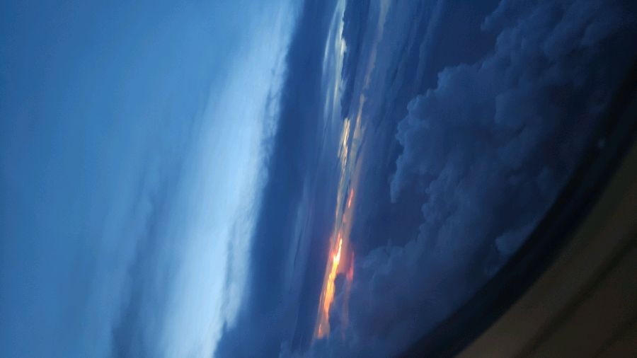
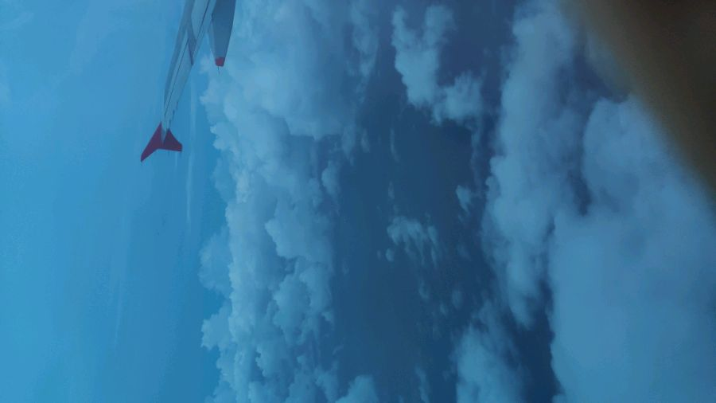
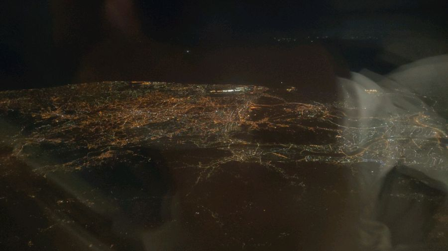
  

22楼 | sssnnnbb | 2018-09-04 04:42
    
    2018-09-04 10:26 | 哦一样兔儿童:
    > 从飞机上看到的景色好棒啊！等我有钱了也要坐一回，可我没钱，而且要开学了
    2018-09-04 10:50 | sssnnnbb:
    > 回复 哦一样兔儿童 :
* * *
人是真的多 
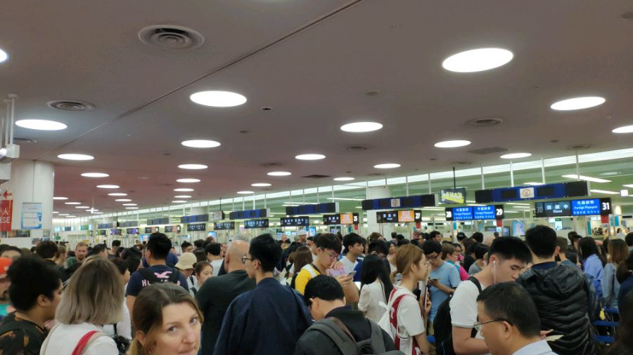
  

23楼 | sssnnnbb | 2018-09-04 05:09
* * *
收藏一下先
  

24楼 | 风-名 | 2018-09-04 06:51
    
    2018-09-04 07:02 | sssnnnbb:
    > 机智的小淘气
* * *
早餐？意面没我做的好吃，吃完难受 
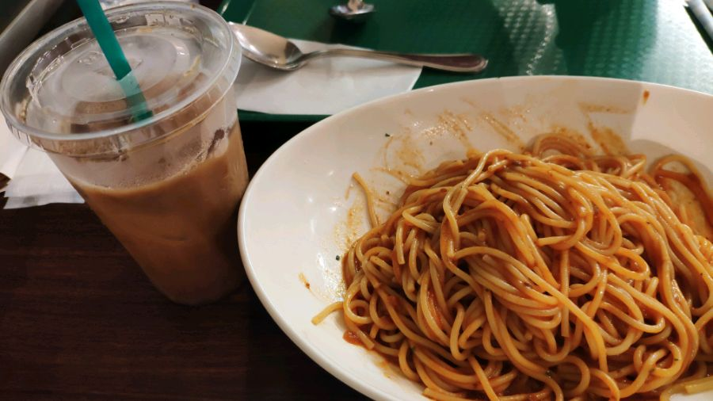
  

25楼 | sssnnnbb | 2018-09-04 07:02
    
    2018-09-04 07:05 | sssnnnbb:
    > 不巧近期遇上台风，外边下着大雨，去哪都不适合欣赏风景
    2018-09-04 09:16 | 凹凸曼ATM945:
    > 回复 sssnnnbb :早啊我刚吃完包子豆浆馅饼三连
    2018-09-04 09:18 | sssnnnbb:
    > 回复 凹凸曼ATM945 :我这两天每天睡两小时，很难受
    2018-09-04 09:22 | 凹凸曼ATM945:
    > 回复 sssnnnbb :闲着的时候多睡睡吧，再不睡容易猝死了
    2018-09-04 09:25 | sssnnnbb:
    > 回复 凹凸曼ATM945 :是啊，已经定好了一家酒店公寓实际是个民宿来着
    2018-09-04 09:28 | 凹凸曼ATM945:
    > 回复 sssnnnbb :民宿好啊，更接地气
    2018-09-04 09:38 | sssnnnbb:
    > 回复 凹凸曼ATM945 :这家价格还行
* * *
路过。
  

26楼 | 路过的空我♬ | 2018-09-04 09:30
* * *
膜
  

27楼 | 落晶倾璃🍒 | 2018-09-04 09:34
    
    2018-09-04 09:38 | sssnnnbb:
    > -1s
* * *
水经验 楼主玩的开心
  

28楼 | 强袭丽雯 | 2018-09-04 09:40
* * *
前几天每天6小时，这两天每天两小时睡觉时间，有些疲惫，定了个民宿正好离秋叶原近，3点才能入店，反正队友也想来看看，就先来这儿了，不对，我又来了
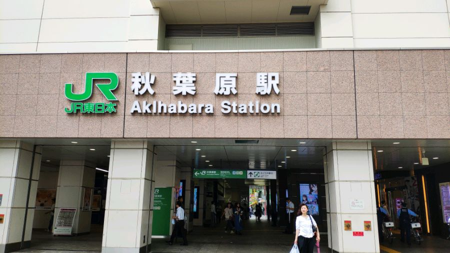
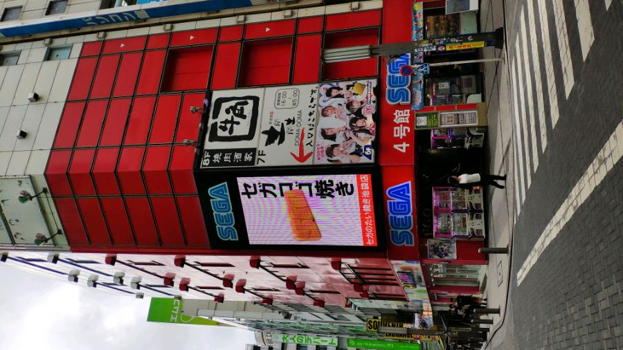
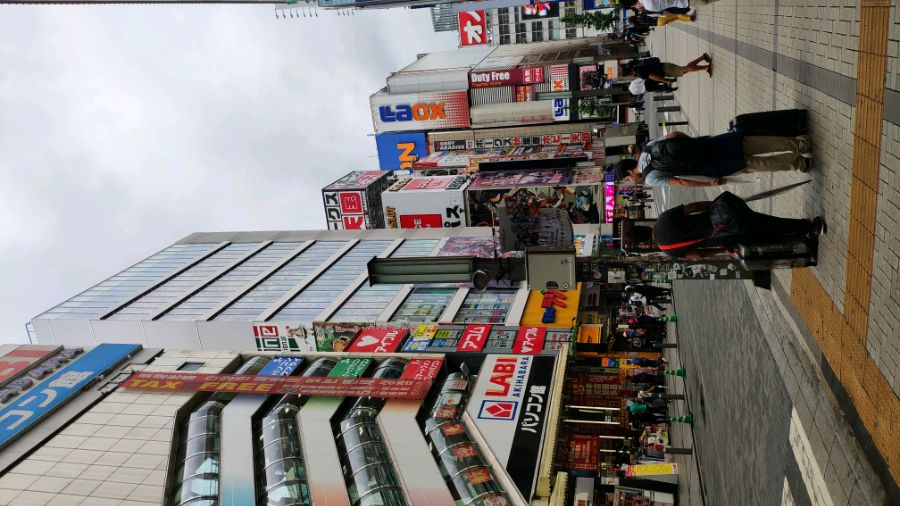
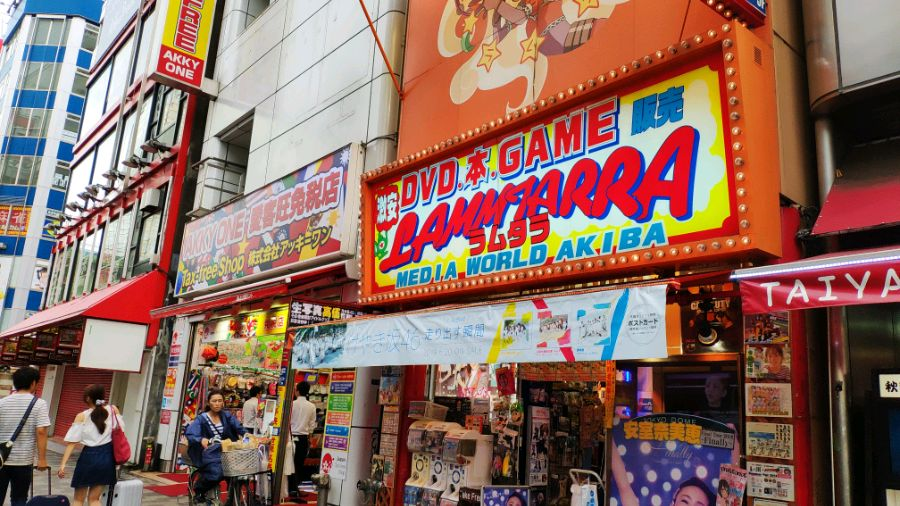
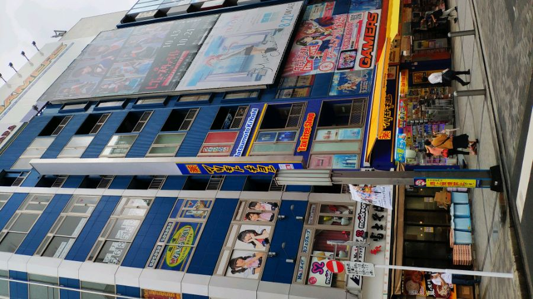
  

29楼 | sssnnnbb | 2018-09-04 09:41
* * *
我居然真的看见智障了，完了智商-1 
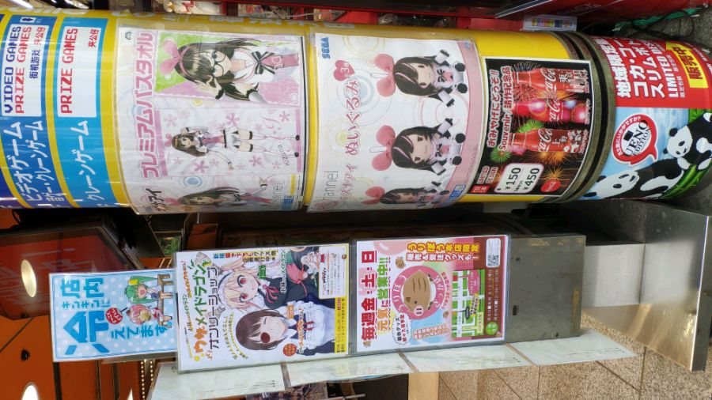
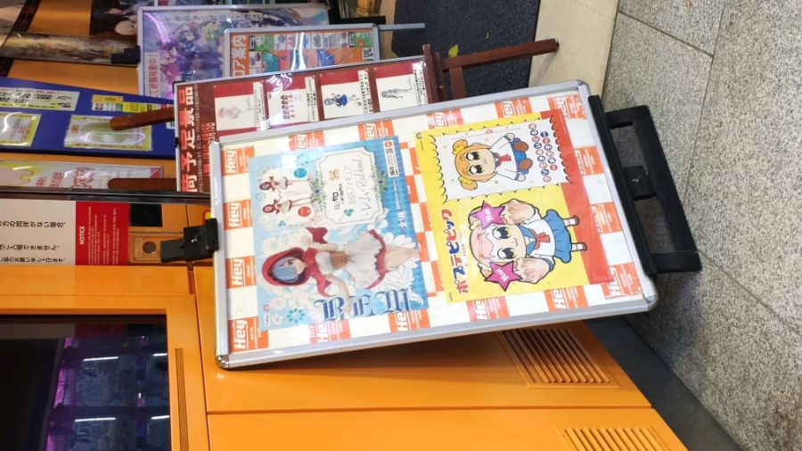
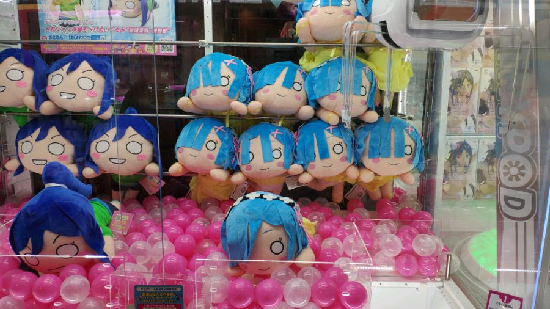
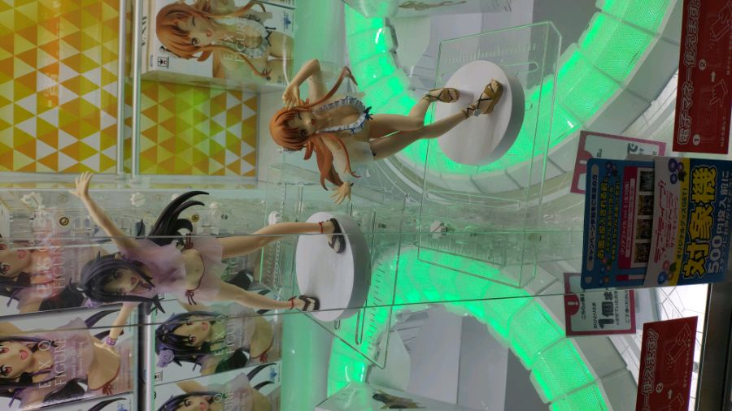

  

30楼 | sssnnnbb | 2018-09-04 10:02
    
    2018-09-04 11:41 | 五月雨🍒:
    > 花Q
    2018-09-04 11:53 | sssnnnbb:
    > 回复 嘉健2001 :-1 -1
    2018-09-04 12:08 | 五月雨🍒:
    > 回复 sssnnnbb :
* * *
羡慕
  

31楼 | 死之蔷薇º | 2018-09-04 10:14
    
    2018-09-04 14:56 | sssnnnbb:
    > 
* * *
刀剑的海报手办真的多起来好多，是因为十月新番就要出了吗  
要不是里面不能拍照我真想拍下来好多熟悉的动漫人物
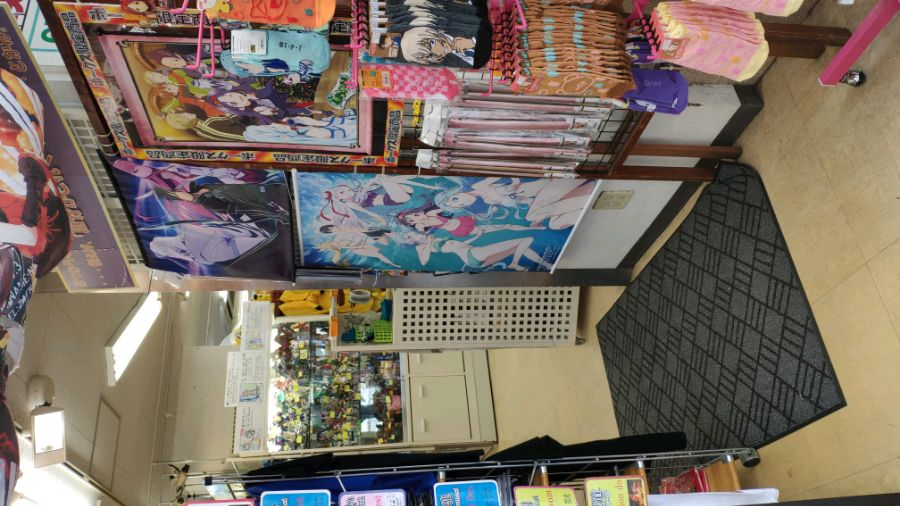
  

32楼 | sssnnnbb | 2018-09-04 10:51
    
    2018-09-04 11:24 | 风-名:
    > 有亚丝娜就够了
    2018-09-04 11:54 | sssnnnbb:
    > 回复 Master丶听风 :虽然不是我的，但是拦着不给
* * *
行，我又回来了
  

33楼 | 悠远的苍穹-▫ | 2018-09-04 12:04
    
    2018-09-04 12:16 | sssnnnbb:
    > 
    2018-09-04 12:23 | 悠远的苍穹-▫:
    > 回复 sssnnnbb :你上一个帖子我大概也是这个位置
    2018-09-04 14:03 | sssnnnbb:
    > 回复 悠远的苍穹-▫ :骗我，吓得我回去帖子前后几十楼全翻了一遍，你居然没在
    2018-09-04 18:27 | 悠远的苍穹-▫:
    > 回复 sssnnnbb :那我去找找
    2018-09-04 18:48 | sssnnnbb:
    > 回复 1017497286 :哼哼果然
    2018-09-04 19:22 | 悠远的苍穹-▫:
    > 回复 sssnnnbb :好累可能是我错了，1楼开始找，直到606才找到第一个但是我很清楚，我说的第一句话绝对不是那句，你还在直播中间我插进去的，应该在300-400楼我错了
    2018-09-04 19:26 | 悠远的苍穹-▫:
    > 回复 sssnnnbb :找到了找到了，我在200楼原来你16年1月份还有一个贴啊那个贴我也在
    2018-09-04 19:27 | 悠远的苍穹-▫:
    > 回复 sssnnnbb :我可是远古人了
    2018-09-04 19:34 | sssnnnbb:
    > 回复 1017497286 :哇，这样就有些感动了，谢谢
    2018-09-04 19:38 | 悠远的苍穹-▫:
    > 回复 sssnnnbb :我要去挖一月份的贴！
    2018-09-04 19:41 | sssnnnbb:
    > 回复 1017497286 :别累着了
    2018-09-05 22:20 | 悠远的苍穹-▫:
    > 回复 sssnnnbb :没找到一月份的贴子然后你一月份贴子上我的推荐了
    2018-09-05 22:23 | 悠远的苍穹-▫:
    > 回复 sssnnnbb :一月贴43楼的远古人
    2018-09-05 23:10 | sssnnnbb:
    > 回复 在原七海▫ :**，有印象了，原来这么早就出现了，感人！爱你！
* * *

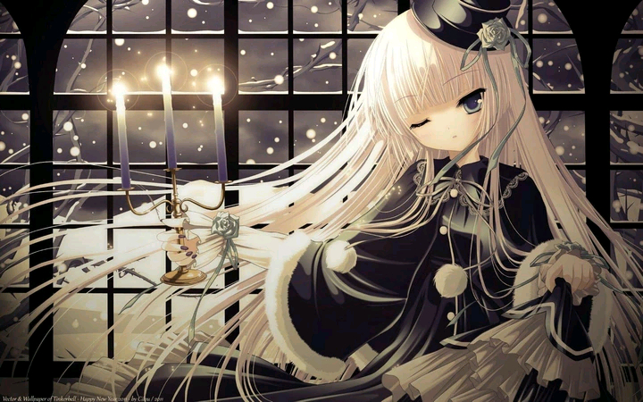
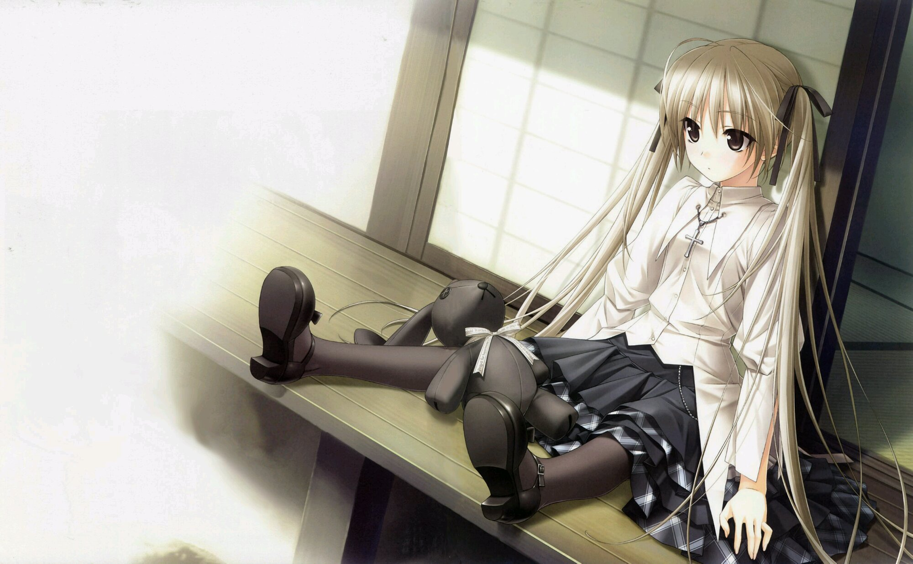
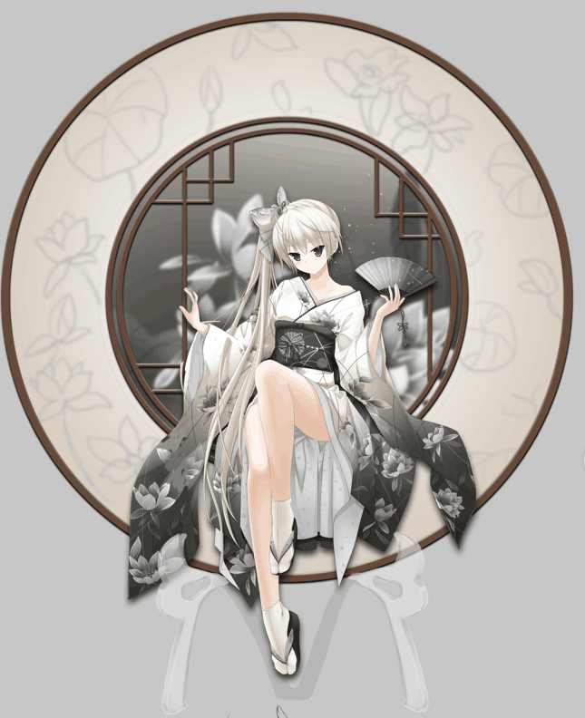

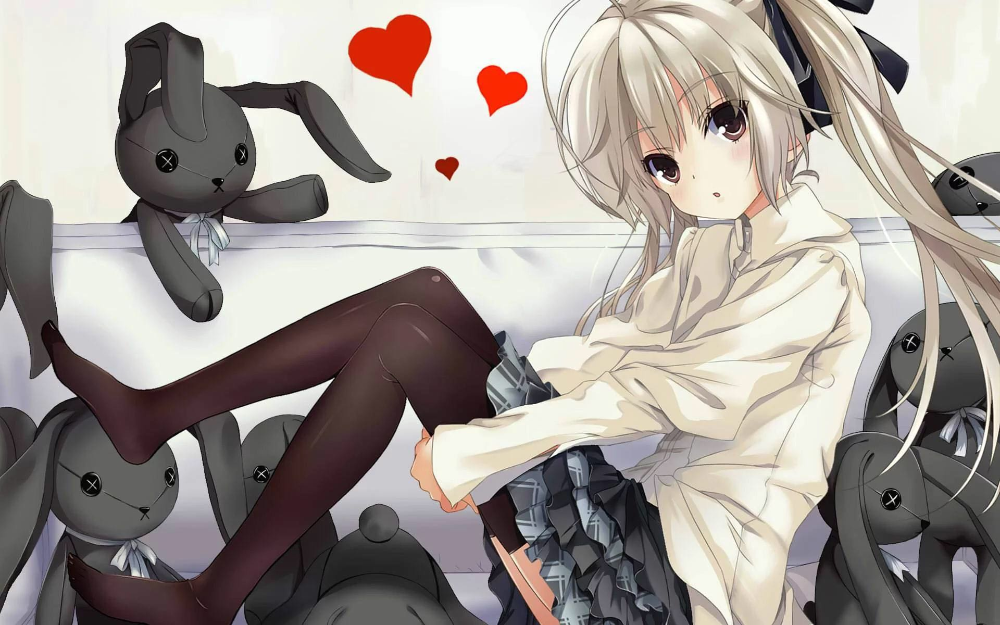

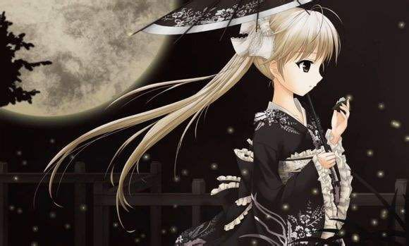
  

34楼 | island🎅 | 2018-09-04 12:14
    
    2018-09-04 13:01 | yurs😘:
    > emmm.......貌似第二张是tinkle的图？改了个色调？
    2020-01-01 00:08 | 神之殤99:
    > 好看呐
* * *
干杯 
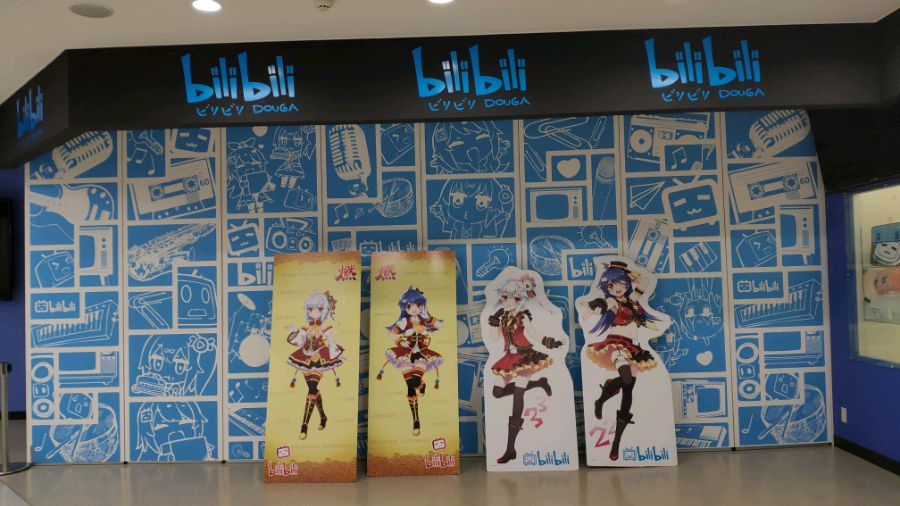
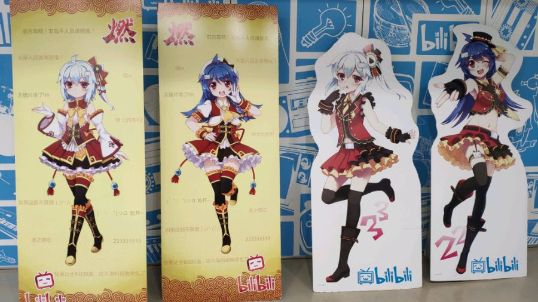
  

35楼 | sssnnnbb | 2018-09-04 12:17
* * *
这个台风对日本影响还是蛮大的，楼主注意安全～我也一直想去奥木染巡礼，不过东京的圣地实在太多了，就没去。下次去关东一定要安排上
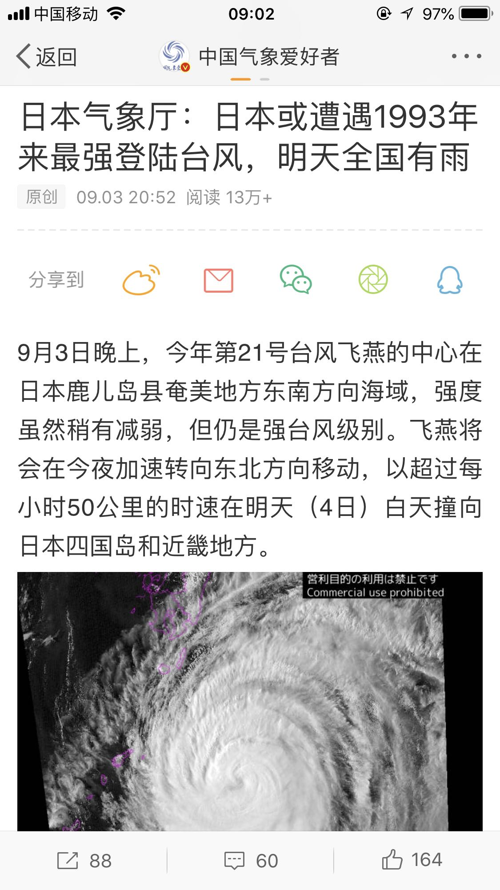
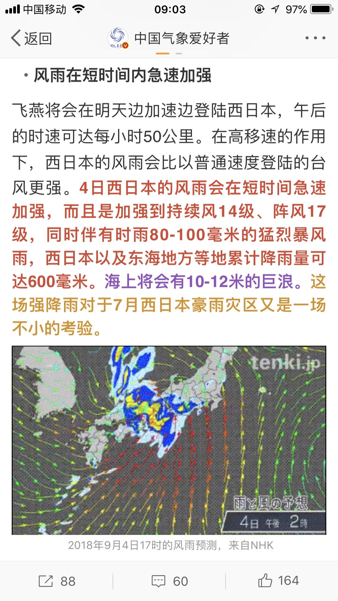

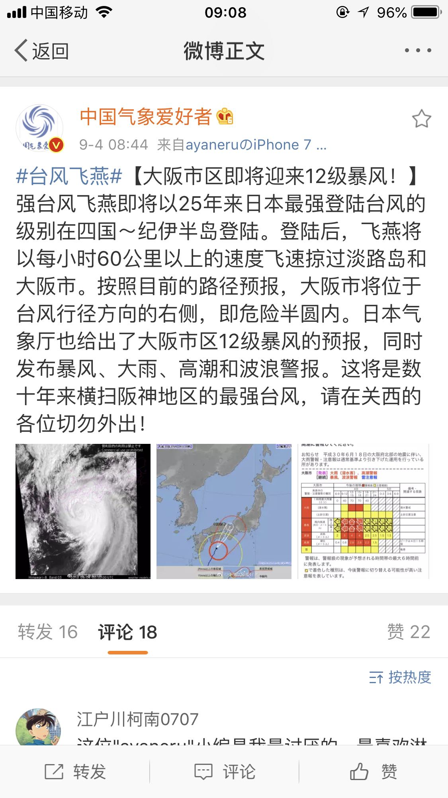
  

36楼 | 加藤惠🌀 | 2018-09-04 12:33
    
    2018-09-04 13:57 | sssnnnbb:
    > 唉，谢谢，心疼，千万别晚上停电，要是就这么一直这样下去，去圣地的时候不是天晴会让我觉得糟透了的
    2018-10-04 22:26 | 不怨骤降♬:
    > 一眼看成了育碧
* * *
膜。  
愿丛雨祝福楼主(ฅ>ω<*ฅ)
  

37楼 | yurs😘 | 2018-09-04 13:02
    
    2018-09-04 13:54 | sssnnnbb:
    > 愿台风庇护楼楼
    2018-09-04 19:03 | yurs😘:
    > 回复 sssnnnbb :。。。。希望台风快点过去，我也是想看直播的说~
    2018-09-04 19:07 | sssnnnbb:
    > 回复 yurs😘 :嗯嗯，是啊，其实我自身来说其他地方不愉快还没什么，主要目的就是圣地巡礼其他地方只是为了铺垫用来做心理准备，只要去两个圣地的地方能天晴心情好一切顺利，此行就感天谢地了！
    2018-09-04 21:42 | yurs😘:
    > 回复 sssnnnbb :嗯呐
    2018-09-05 12:02 | sssnnnbb:
    > 回复 光六使者 :我才发现你是小吧啊，能帮我看看怎么回事吗，突然变成直播贴了我很高兴，但是用常规百度贴吧居然首页根本找不到了，网页打开和极速贴吧 贴吧助手倒是没问题
    2018-09-05 12:41 | yurs😘:
    > 回复 sssnnnbb : 。。。经过他们讨论之后给你了话题贴(>^ω^<)喵。 （现在好像没有直播贴了的说） （不过话题贴只有三天时间。。） 手机客户端好像的确找不到的样子（或许是个BUG），我去反映一下，但是话题贴在电脑上很显眼的说。
    2018-09-05 12:44 | sssnnnbb:
    > 回复 yurs😘 :原来如此，我说怎么成直播了
    2018-09-05 12:44 | sssnnnbb:
    > 回复 yurs😘 :就是唯独这个看不到了
    2018-09-05 12:46 | yurs😘:
    > 回复 sssnnnbb :不过在电脑上是自动置顶+内容外露的说
    2018-09-05 12:47 | yurs😘:
    > 回复 sssnnnbb :应该是手机客户端的漏洞
    2018-09-05 12:54 | sssnnnbb:
    > 回复 yurs😘 :是啊，就是都开学了看帖的人就不方便了
    2018-09-05 12:55 | sssnnnbb:
    > 回复 yurs😘 :这个漏洞怎么办呢，恢复普通帖子能解决不
    2018-09-05 12:57 | yurs😘:
    > 回复 sssnnnbb :目前的打算是再专门开个帖子放你这个帖子的链接，具体要等到吧主大大那里编个具体规则的说。
    2018-09-05 13:03 | yurs😘:
    > 回复 sssnnnbb :嗯，之后讨论了给你了话题贴，然后就发现了这个问题的说
    2018-09-05 16:39 | sssnnnbb:
    > 回复 光六使者 :哇
    2018-09-05 16:52 | sssnnnbb:
    > 回复 光六使者 :那能取消话题不，这样能恢复原来的样子吗
    2018-09-07 19:17 | yurs😘:
    > 回复 sssnnnbb :应该已经取消了吧
    2018-09-07 19:20 | sssnnnbb:
    > 回复 光六使者 :嗯嗯，昨晚我看时间差不多该到了，然后去百度贴吧看就能找到了
* * *
吃了碗面，虽然一点没食欲，但是队友饿得慌，还是得吃午饭，今天先好好整顿休息一下，来之前故意买早上凌晨到的机票，想着到了正好就去目的地，但是忽略了飞机上其实待的时间并不够睡眠时间今天先回酒店，好好休息休息  
拍到辆车牌66.66好6 
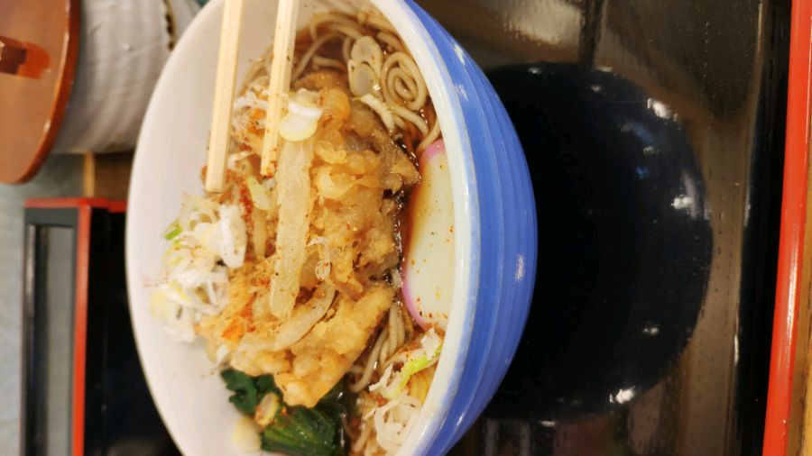
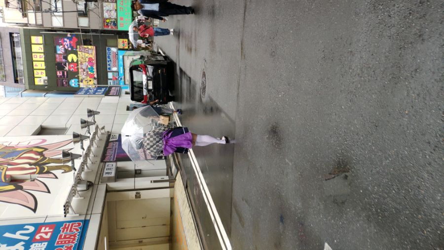
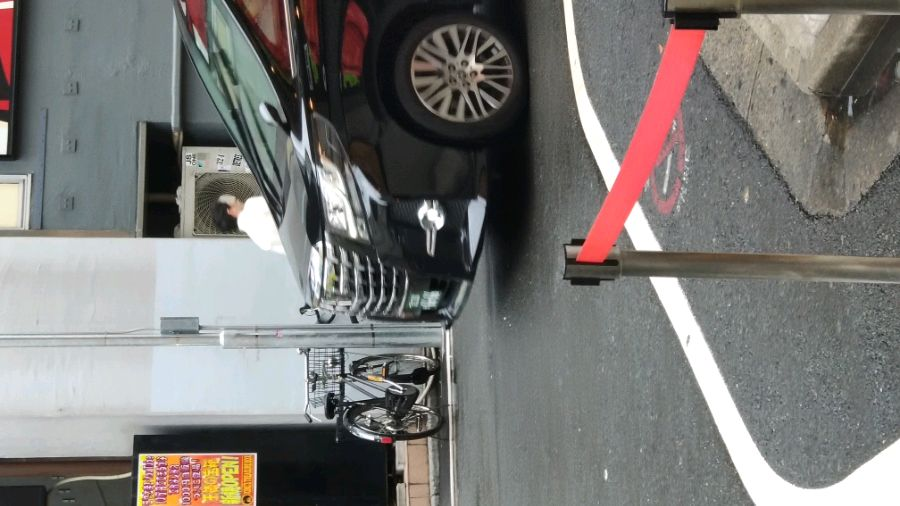
  

38楼 | sssnnnbb | 2018-09-04 13:53
* * *
天空树已经很近了，住宿的地方在边就已经能看见了 
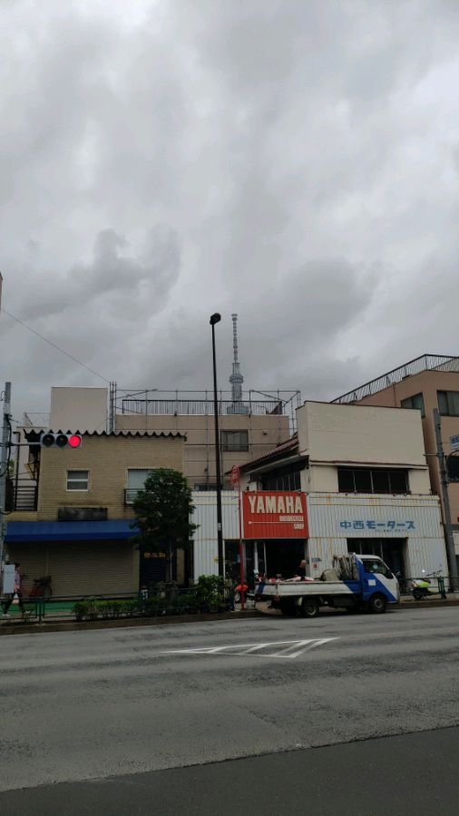
  

39楼 | sssnnnbb | 2018-09-04 14:54
* * *
惯例买上 悠穹 每天都喝着的麦茶
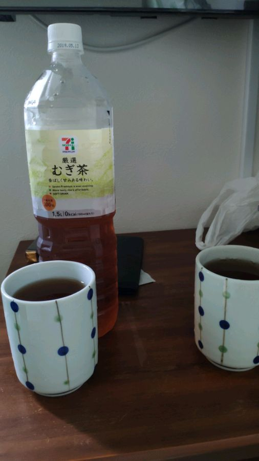
  

40楼 | sssnnnbb | 2018-09-04 14:55
    
    2018-09-04 18:14 | q蝶l恋花p:
    > 悠穹 喝麦茶？
    2018-09-04 18:50 | sssnnnbb:
    > 回复 q蝶l恋花p :对啊，不管动漫还是游戏，除了早餐牛奶，麦茶几乎是主要饮品啊
    2018-09-04 23:03 | 风-名:
    > 都是喝麦茶吧，很多动漫都是
    2018-09-04 23:04 | sssnnnbb:
    > 回复 Master丶听风 :可是我是以 缘之空 做原因啊
    2018-09-05 10:32 | q蝶l恋花p:
    > 回复 sssnnnbb :噢，是这样啊
* * *
一看见矢泽，就好怕蹦出个人来，妮可妮可妮！！
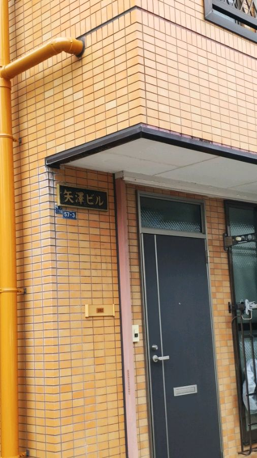
  

41楼 | sssnnnbb | 2018-09-04 14:56
    
    2018-09-12 19:32 | 心之旅ლ:
    > 我矢泽日香老婆怎么惹你了
    2018-09-12 19:49 | sssnnnbb:
    > 回复 1429125715 :没惹我，但是吓到我了
    2018-09-12 19:51 | 心之旅ლ:
    > 回复 sssnnnbb :
* * *
睡到现在才醒，躺下去感觉好像好多天都没躺下睡觉了的感觉，现在窗外狂风大作，“漫天飞舞一片荒芜”贼吓人，往关西方向的新干线之类的都停了，隔壁旅游群发来的视频里都看见电线附近的火星了炸了几下 
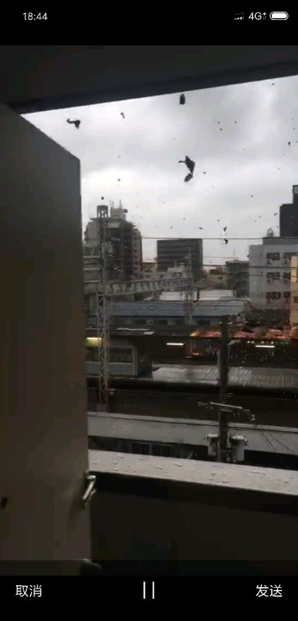
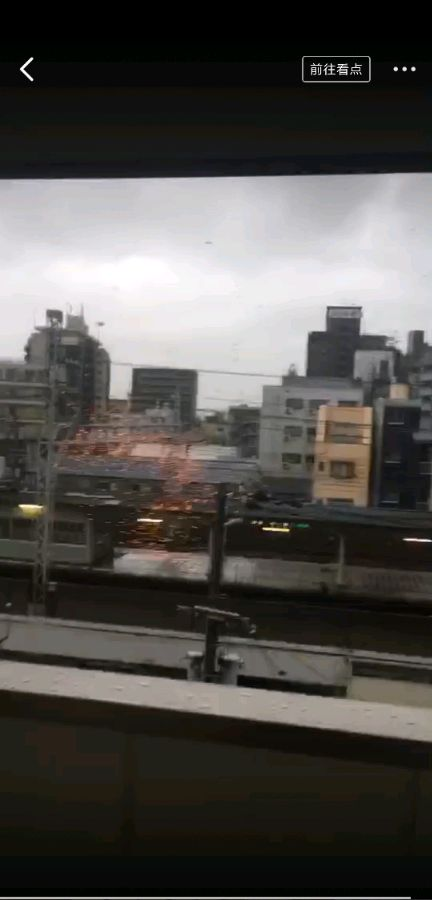
  

42楼 | sssnnnbb | 2018-09-04 17:51
    
    2018-09-04 18:05 | sssnnnbb:
    > 回复 wsn20042017 :应该是垃圾吧，视频里看着更吓人
    2020-01-01 00:10 | 神之殤99:
    > 小心呐
    2020-01-01 00:39 | sssnnnbb:
    > 回复 神之殤99 :谢谢虽然都过去一年了
    2020-01-01 00:44 | 神之殤99:
    > 回复 sssnnnbb :额。。。好像也是哈
    2020-01-01 01:12 | sssnnnbb:
    > 回复 神之殤99 :哈哈哈，新年快乐
    2020-01-02 19:42 | 神之殤99:
    > 回复 sssnnnbb :同乐哈，过去两年了
* * *
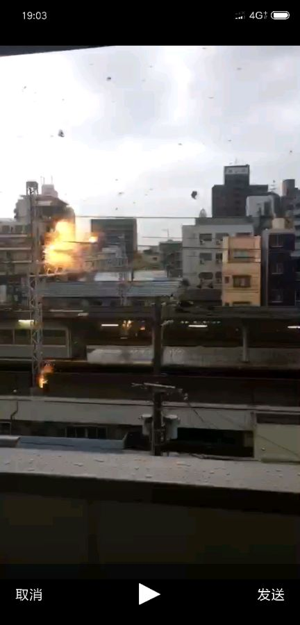
  

43楼 | sssnnnbb | 2018-09-04 18:06
* * *
我觉得今年还是不能放过你们，还是得让你们见识一下我的腿毛，good！👌 
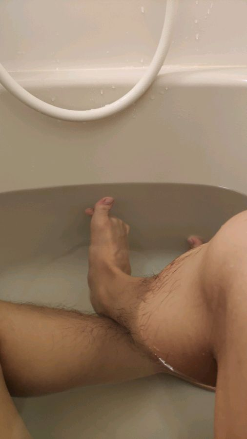
  

44楼 | sssnnnbb | 2018-09-04 18:08
    
    2018-09-04 18:24 | 五月雨🍒:
    > 我看到了什么
    2018-09-04 18:48 | sssnnnbb:
    > 回复 嘉健2001 :快说你看见了什么
    2018-09-04 18:50 | sssnnnbb:
    > 回复 wsn20042017 :
    2018-09-04 18:51 | 凹凸曼ATM945:
    > 我觉得这有些不妥
    2018-09-04 18:54 | sssnnnbb:
    > 回复 凹凸曼ATM945 :有何不妥
    2018-09-04 18:55 | 凹凸曼ATM945:
    > 回复 sssnnnbb :可爱，想……
    2018-09-04 18:58 | sssnnnbb:
    > 回复 凹凸曼ATM945 :你！你想干什么！我很纯洁的
    2018-09-04 19:24 | 五月雨🍒:
    > 回复 sssnnnbb :该怎么说，黑深林?
    2018-09-04 19:36 | sssnnnbb:
    > 回复 嘉健2001 :要不我们一起钻？小树林
    2018-09-04 19:47 | 五月雨🍒:
    > 回复 sssnnnbb :不要，走开的说
    2018-09-04 19:48 | sssnnnbb:
    > 回复 嘉健2001 :这么傲娇
    2018-09-04 19:50 | 五月雨🍒:
    > 回复 sssnnnbb :可怕，遇到怪叔叔了
    2018-09-04 19:51 | sssnnnbb:
    > 回复 嘉健2001 :小妹妹白又白，叔叔有糖来不来
    2018-09-04 19:53 | 五月雨🍒:
    > 回复 sssnnnbb :拒绝的说
    2018-09-04 19:59 | sssnnnbb:
    > 回复 嘉健2001 :不可爱
    2018-09-04 20:08 | 五月雨🍒:
    > 回复 sssnnnbb :因为我不是小妹妹
    2018-09-04 20:10 | sssnnnbb:
    > 回复 嘉健2001 :不是我也要
    2018-09-04 20:13 | 五月雨🍒:
    > 回复 sssnnnbb :糖可不能让我心动
    2018-09-04 20:17 | sssnnnbb:
    > 回复 五月雨🍒 :我懂了
    2018-09-04 20:33 | 五月雨🍒:
    > 回复 sssnnnbb :懂什么
    2018-09-04 20:34 | sssnnnbb:
    > 回复 嘉健2001 :你是小受
    2018-09-04 20:36 | 五月雨🍒:
    > 回复 sssnnnbb :不是不是，从哪来的结论
    2018-09-04 20:37 | sssnnnbb:
    > 回复 嘉健2001 :
    2018-09-04 20:41 | 五月雨🍒:
    > 回复 sssnnnbb :什么鬼
    2018-09-08 16:54 | 默默无言👀:
    > 噫，真性感
    2018-09-08 17:09 | sssnnnbb:
    > 回复 Uigur850 :喜不喜欢
    2018-09-08 17:10 | 默默无言👀:
    > 回复 sssnnnbb :你确定我会喜欢吗
    2018-09-08 17:11 | sssnnnbb:
    > 回复 Uigur850 :我猜的
    2018-09-08 17:14 | 默默无言👀:
    > 回复 sssnnnbb :你也喜欢男人的腿毛吗
    2018-09-08 19:00 | sssnnnbb:
    > 回复 Uigur850 :我喜欢我自己的腿
    2018-09-08 20:28 | 默默无言👀:
    > 回复 sssnnnbb :我对腿毛没什么癖好，感受是无，如果腿毛多我会说真性感，腿还是有点腿毛好
    2018-09-08 20:50 | sssnnnbb:
    > 回复 Uigur850 :有句话叫，嘴上无毛，办事不牢
    2018-09-08 20:54 | 默默无言👀:
    > 回复 sssnnnbb :
* * *
回住处的之前队友买了两桶泡面，一大瓶肥宅快乐水，我照例买了一大瓶 悠穹 常喝的麦茶体会一下，看见了有一块包装的羊羹，蜡笔小新里也是经常出现，买来试试看 
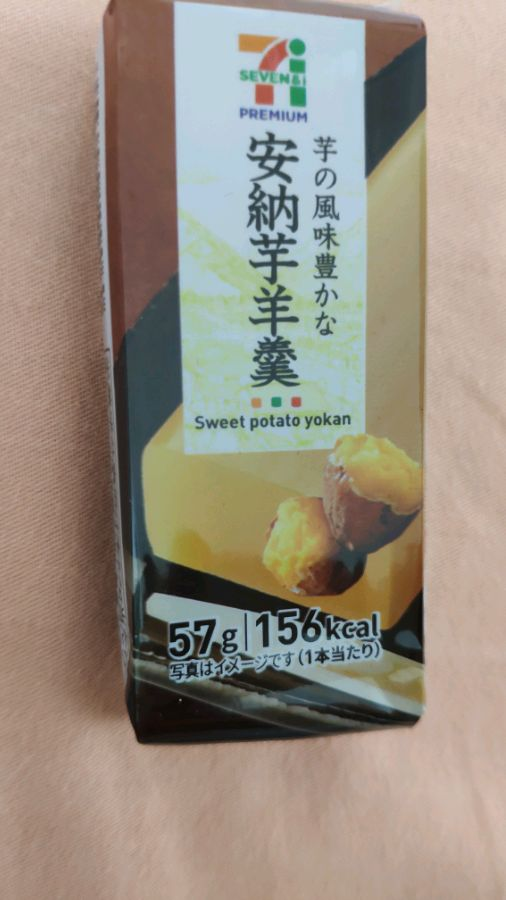
  

45楼 | sssnnnbb | 2018-09-04 19:18
* * *
等直播，明天去圣地可以拍些视频，发到b站，毕竟视频比图片更直接啊
  

46楼 | 春日野▫悠 | 2018-09-04 19:25
    
    2018-09-04 19:32 | sssnnnbb:
    > 回来以后会努力做视频，把两年前的和这次的都整合起来
    2018-09-04 20:14 | 春日野▫悠:
    > 回复 sssnnnbb :我等着
    2018-09-04 20:15 | sssnnnbb:
    > 回复 神精病人的春天 :
    2018-09-04 20:41 | 凹凸曼ATM945:
    > 回复 sssnnnbb :还有视频的吗
    2018-09-04 20:43 | sssnnnbb:
    > 回复 凹凸曼ATM945 :对啊，回顾的时候多少要有点动态的啊，那才真实啊，不单单是一张张画一般的固定画面啊
    2018-09-04 20:45 | 凹凸曼ATM945:
    > 回复 sssnnnbb :这必须期待啊
    2018-09-04 20:45 | sssnnnbb:
    > 回复 凹凸曼ATM945 :嗯嗯
* * *
买了一些吃的是明智的选择，毕竟到了晚上外边都呼啸成这样了，出去太危险，自从知道了 穹 不吃泡面以外的无营养食品，所以我也是两三年没随便碰泡面了，原本楼楼可是有段时间靠泡面支撑味蕾的  
这么一小块羊羹57克就156大卡了，对于来日本前原本持续健身的人来说这真是吓人，上面画着番薯味，居然吃起来也是番薯口感
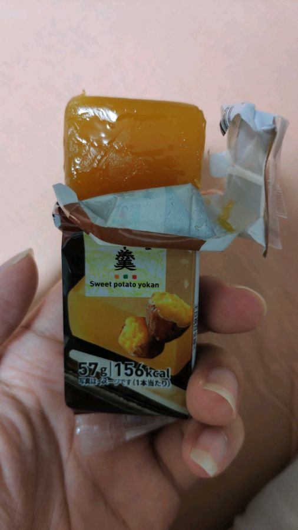
  

47楼 | sssnnnbb | 2018-09-04 19:30
* * *
刚看完lz上一个帖子
  

48楼 | 穹妹赛高- | 2018-09-04 20:17
    
    2018-09-04 20:18 | sssnnnbb:
    > 谢谢
    2018-09-04 20:21 | 穹妹赛高-:
    > 回复 sssnnnbb :上次去日本没买手办血亏
    2018-09-04 20:22 | sssnnnbb:
    > 回复 l18917927242yy :我买了
    2018-09-04 20:22 | 穹妹赛高-:
    > 回复 sssnnnbb :所以你这次还是一个人吗
    2018-09-04 20:28 | sssnnnbb:
    > 回复 l18917927242yy :两个人啊
* * *
现在日本新闻也正在报道现状，果然是真的严重，说是25年以来最强，幸好来之前就了解了，不然真傻乎乎的去了这么危险就怕有个万一了 
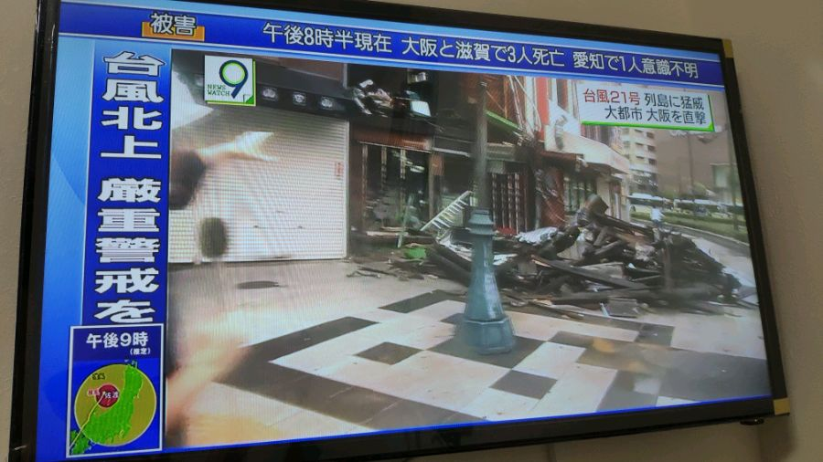
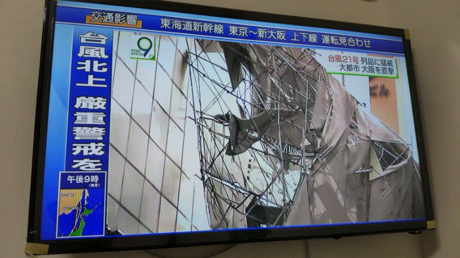
  

49楼 | sssnnnbb | 2018-09-04 20:24
    
    2018-09-04 20:42 | 凹凸曼ATM945:
    > **要持续多久啊很危险吧，注意安全啊
    2018-09-04 20:45 | sssnnnbb:
    > 回复 凹凸曼ATM945 :好像意外的速度很快都要完全出境了，今天才登陆，本来预计会多停留两天，主要担心的是无人问津的圣地要是受损怎么办，如果真有什么在我能力之内我会出力的
* * *
口意，被地震摇醒了，我们都还是住在二楼，感觉还是那么清楚队友睡得跟猪一样 

  

50楼 | sssnnnbb | 2018-09-05 04:18
    
    2018-09-05 09:51 | 哦一样兔儿童:
    > 口意还有地震
    2018-09-05 09:56 | sssnnnbb:
    > 回复 哦一样兔儿童 :慌都不慌
* * *
后排
  

51楼 | 風華▫恋 | 2018-09-05 08:04
    
    2018-09-05 08:51 | sssnnnbb:
    > 今天才第二天
* * *
嘛也，起来晚了，没听见闹钟呢，天气也特别晴朗了，太好了 
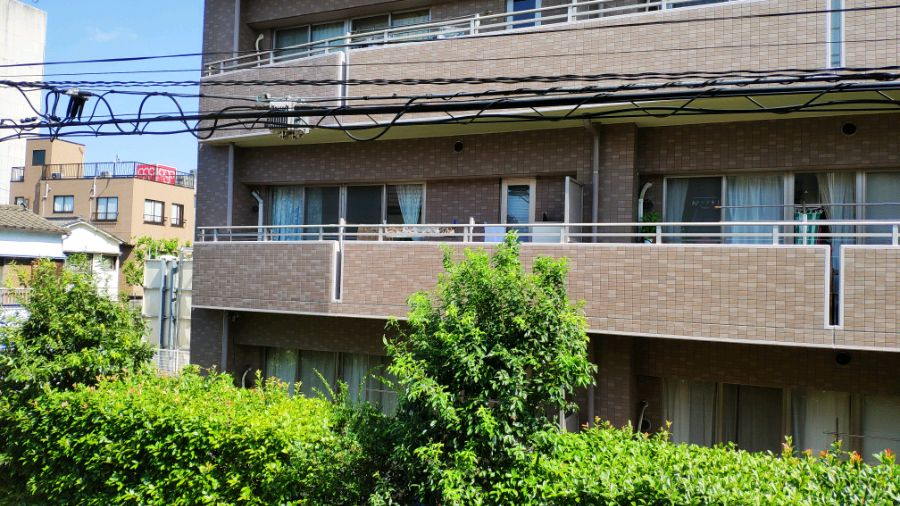
  

52楼 | sssnnnbb | 2018-09-05 08:52
* * *
跟我们同住一家的俩妹子，都挺漂亮的，但是出门带了3个特大的行李箱，又是空的也不做代购，就是想买很多东西，结果来了一点也买了令人担心的不方便 
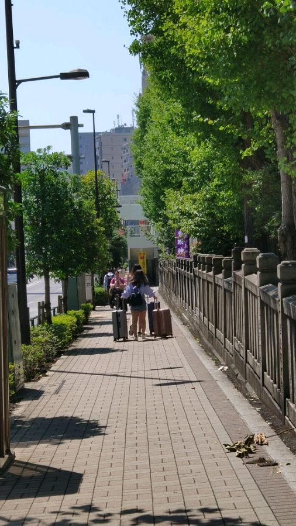
  

53楼 | sssnnnbb | 2018-09-05 10:05
* * *
起来晚了，刚刚还搞错了点错了本来要点这个的 
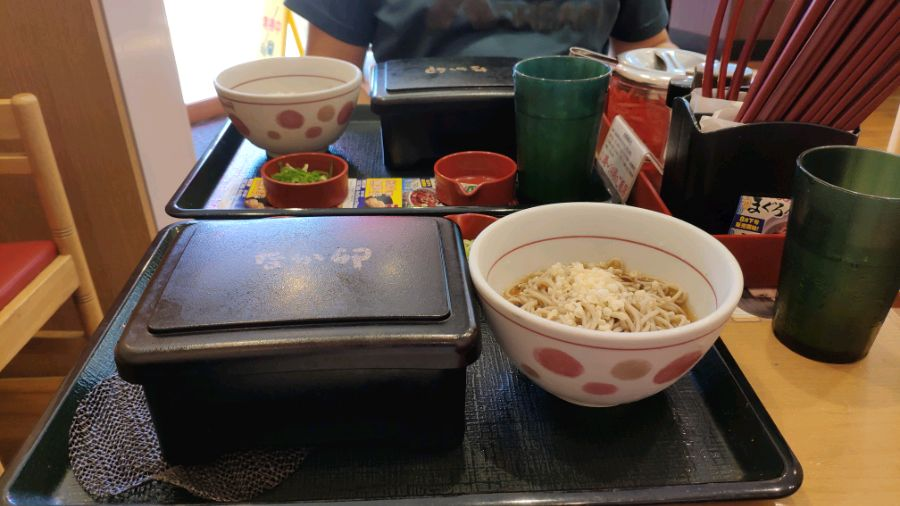
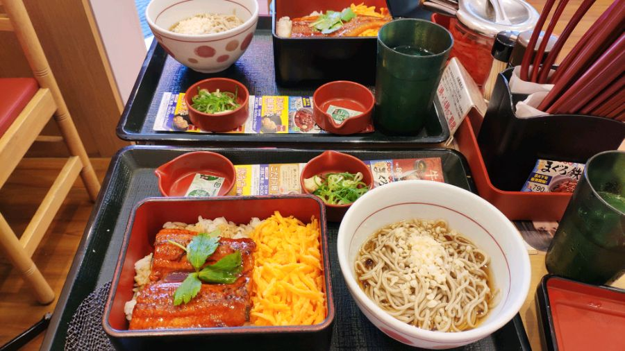
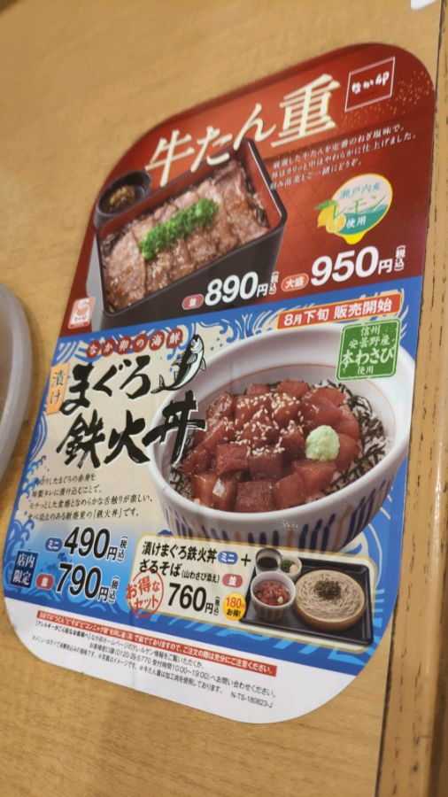
  

54楼 | sssnnnbb | 2018-09-05 10:17
    
    2018-09-05 10:22 | sssnnnbb:
    > 点进水树奈奈专区推荐了，以为没有就直接点了鳗鱼饭，好在味道非常不错，元太最爱吃的鳗鱼饭
    2018-09-05 10:23 | sssnnnbb:
    > 感觉和前面去一样了，也是第二天早餐去了有水树奈奈广告的店
* * *
不把妹子勾引来嘛

  

55楼 | 春日野▫悠 | 2018-09-05 10:22
    
    2018-09-05 10:46 | sssnnnbb:
    > 尾行怎么样
    2018-09-05 12:38 | 春日野▫悠:
    > 回复 sssnnnbb :勾引带她们去奥木染
    2018-09-05 12:45 | sssnnnbb:
    > 回复 春日野▫悠 :哎，好像不错哎
    2018-09-06 22:14 | 灰太狼的溫柔🌸:
    > 回复 sssnnnbb :黑猫俺的嫁
    2018-09-06 22:15 | sssnnnbb:
    > 回复 cwz888day :你嫁冲我笑了
* * *
楼主在直播
  

56楼 | q蝶l恋花p | 2018-09-05 10:37
    
    2018-09-05 10:45 | sssnnnbb:
    > 对呀
    2018-09-05 10:52 | q蝶l恋花p:
    > 怎么看你直播嘞
* * *
现在我们去新宿，有 你的名字 的取景地，也算是圣地巡礼了
  

57楼 | sssnnnbb | 2018-09-05 10:51
* * *
话说想起来，把我们早些日子暂定了的要去的地方截图给你们看一下 
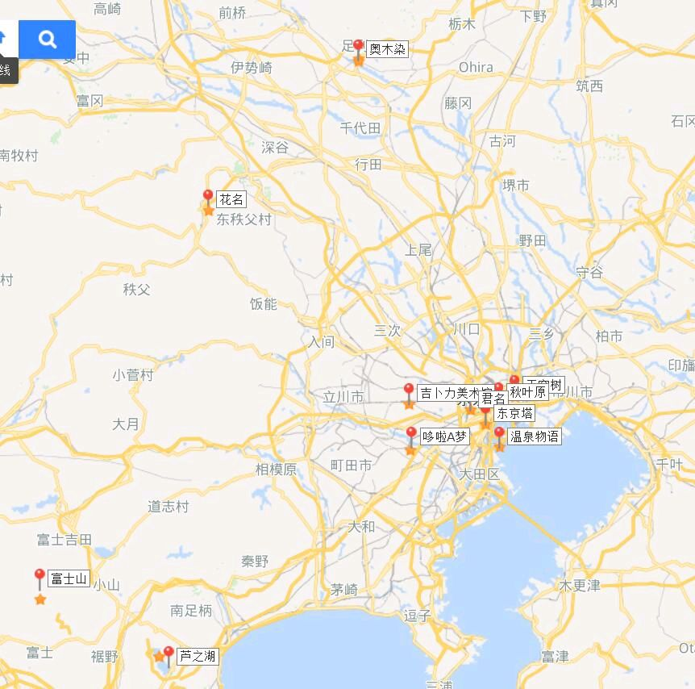
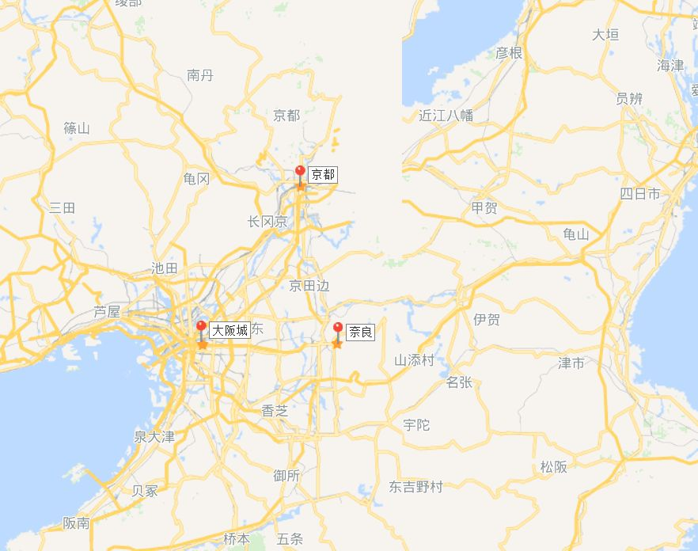
  

58楼 | sssnnnbb | 2018-09-05 10:58
* * *
我怎么在吧里看不到这帖子了....
  

59楼 | 五月雨🍒 | 2018-09-05 11:00
    
    2018-09-05 11:02 | sssnnnbb:
    > 我翻了下好像得到啊
    2018-09-05 11:04 | 五月雨🍒:
    > 回复 sssnnnbb :真的没，只看到lz之前的帖子
    2018-09-05 11:06 | sssnnnbb:
    > 回复 嘉健2001 :那收藏是个不错的解决办法
    2018-09-05 11:10 | 五月雨🍒:
    > 回复 sssnnnbb :不能及时来搞事了....
    2018-09-05 11:11 | sssnnnbb:
    > 回复 嘉健2001 :不对啊，刚刚我看都成直播贴了，应该在第一排了啊
    2018-09-05 11:13 | 五月雨🍒:
    > 回复 sssnnnbb :所以我就觉得奇怪的说
    2018-09-05 11:14 | sssnnnbb:
    > 回复 嘉健2001 :刷新一下看看应该就有了吧
    2018-09-05 11:15 | 五月雨🍒:
    > 回复 sssnnnbb :应该是贴吧本身问题吧
    2018-09-05 11:15 | 五月雨🍒:
    > 回复 sssnnnbb :刷了好多遍了...
    2018-09-05 11:20 | sssnnnbb:
    > 回复 嘉健2001 :关闭程序重新进试过没，你看楼下我还发了截图
    2018-09-05 11:24 | 五月雨🍒:
    > 回复 sssnnnbb :试了，没用
    2018-09-05 11:28 | sssnnnbb:
    > 回复 嘉健2001 :完了，我用更新的贴吧也看不到了，只有常用的贴吧助手看得到
    2018-09-05 11:30 | 五月雨🍒:
    > 回复 sssnnnbb :嗯，刚刚我试了极速版也看的到
    2018-09-05 11:32 | sssnnnbb:
    > 回复 嘉健2001 :这可咋整，我用网页打开缘吧也有啊
    2018-09-05 11:38 | 五月雨🍒:
    > 回复 sssnnnbb :不知道....
    2018-09-06 19:57 | 哦一样兔儿童:
    > 之前我也找不到，后来又可以了，可能是贴吧的bug
    2018-09-06 20:07 | 五月雨🍒:
    > 回复 哦一样兔儿童 :可能吧
    2018-09-06 20:43 | sssnnnbb:
    > 回复 哦一样兔儿童 :现在有了，因为3天期限的直播标签消失了
    2018-09-06 20:49 | 哦一样兔儿童:
    > 回复 sssnnnbb :原来是这样啊，作为新人我还不太懂
    2018-09-06 20:51 | sssnnnbb:
    > 回复 哦一样兔儿童 :小吧告诉我的，我也才知道这么回事，好像上次也遇到这个bug过来着
    2018-09-06 20:55 | 五月雨🍒:
    > 回复 sssnnnbb :我连吧规也消失了....
    2018-09-06 21:17 | sssnnnbb:
    > 回复 嘉健2001 :啊，啥？
    2018-09-06 21:23 | 五月雨🍒:
    > 回复 sssnnnbb :你的置顶是有两个的吧
    2018-09-06 21:31 | sssnnnbb:
    > 回复 嘉健2001 :没有啊，确实是bug
    2018-09-06 21:40 | 五月雨🍒:
    > 回复 sssnnnbb :极速版能看到
    2018-09-06 21:40 | 五月雨🍒:
    > 回复 sssnnnbb :应该是bug了吧
    2018-09-06 21:58 | sssnnnbb:
    > 回复 嘉健2001 :只有常规的百度贴吧不能看到，现在可以了
    2018-09-06 22:16 | 五月雨🍒:
    > 回复 sssnnnbb :我的还是不行....
    2018-09-06 22:18 | sssnnnbb:
    > 回复 嘉健2001 :那你可真***有毒
* * *
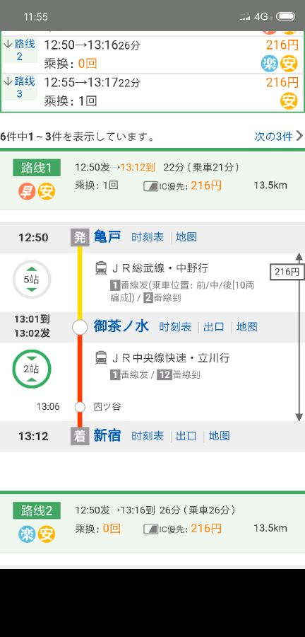
  

60楼 | sssnnnbb | 2018-09-05 11:03
    
    2018-09-05 11:06 | sssnnnbb:
    > 昨天明明那么有空，去圣地巡礼之前忘了把 你的名字 看一遍
* * *
太好了，中午帖子变直播贴了 
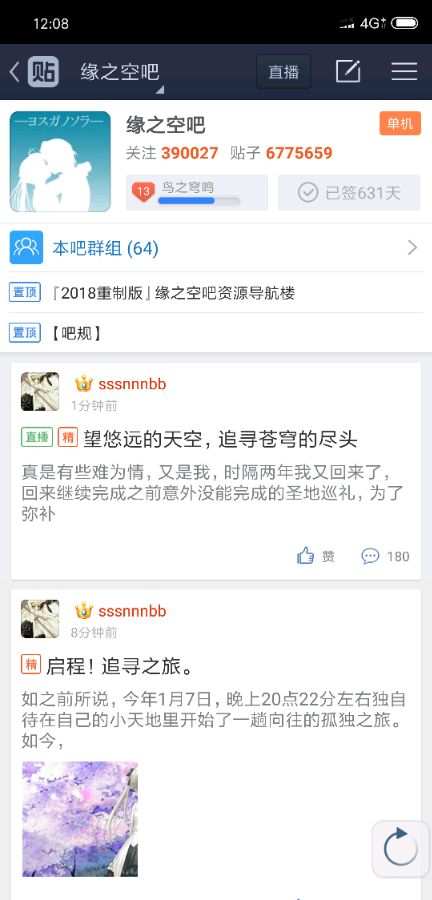
  

61楼 | sssnnnbb | 2018-09-05 11:09
    
    2018-09-05 11:14 | sssnnnbb:
    > 本来累积签到都三年一千多天了，有些断签时间久了没来得及补签就过去了，补签卡也不能用了
* * *
我又来了，嘻嘻
  

62楼 | 风-名 | 2018-09-05 12:25
    
    2018-09-05 12:45 | sssnnnbb:
    > 嗯嗯
* * *
欢迎
  

63楼 | sssnnnbb | 2018-09-05 12:28
* * *
顶贴
  

64楼 | yurs😘 | 2018-09-05 12:41
    
    2018-09-05 12:44 | sssnnnbb:
    > 
* * *
首次赶上直播
  

65楼 | 夏夕空乄 | 2018-09-05 13:05
    
    2018-09-05 16:40 | sssnnnbb:
    > 
* * *
烦烦，到了新宿考虑了一下之后，还是先不去 君名 的圣地巡礼了，现买明天去大阪的车票，花时间挑了太久，要么没近期车票要拖到13号了，要么没优惠了，订完以后去罗森便利店取票，酒店也订的晚了点，有点肉疼现在去天空树，但是正好赶上晚高峰人真多
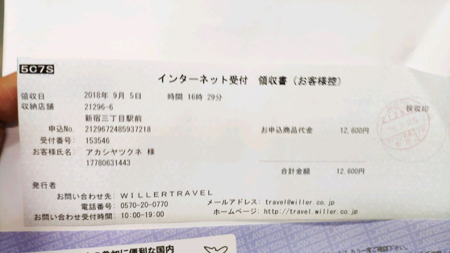
  

66楼 | sssnnnbb | 2018-09-05 16:48
    
    2018-09-05 16:50 | sssnnnbb:
    > 说起来昨天台风刚登陆就出境了，本来各种交通都停运了，好在今天恢复了天气也好了，希望过去以后看到的是想看到的，不是残枝败叶
* * *
来两天了，没有原来那么爱拍了感觉，但是看见高中妹子我还是忍不住举起手机

  

67楼 | sssnnnbb | 2018-09-05 17:18
    
    2018-09-05 17:47 | 五月雨🍒:
    > 这就是你偷拍的理由吗
    2018-09-05 18:17 | sssnnnbb:
    > 回复 五月雨🍒 :了解国外文化嘛
    2018-09-05 18:27 | 五月雨🍒:
    > 回复 sssnnnbb :我信了
    2018-09-11 08:06 | sssnnnbb:
    > 回复 忘了我这混dan :哎，不说我都没注意到，可能人家左脚有伤穿不了皮鞋
    2018-09-11 20:29 | 加藤惠🌀:
    > 这可能会被当成痴汉行为哦
    2018-09-11 21:17 | sssnnnbb:
    > 回复 欣然之恋 :不被发现的话
* * *
我又回来啦这次我可以上去了吧 

  

68楼 | sssnnnbb | 2018-09-05 17:31
* * *


  

69楼 | sssnnnbb | 2018-09-05 17:40
* * *
快来个妹子，给你带上这块石头你就可以飞了，从天空树上跳下来我接住你


  

70楼 | sssnnnbb | 2018-09-05 17:42
    
    2018-09-05 17:43 | sssnnnbb:
    > 好多坨坨龙
* * *
然后我们一起在这儿等龙猫巴士

  

71楼 | sssnnnbb | 2018-09-05 17:43
* * *
露天烤肉放题，终于开荤了，面对天空树，欣赏走过的妹子们，就是风儿有些喧嚣


  

73楼 | sssnnnbb | 2018-09-05 18:09
    
    2018-09-11 20:30 | 加藤惠🌀:
    > lz挺有钱呀，人均5000円
    2018-09-11 21:17 | sssnnnbb:
    > 回复 欣然之恋 :很可能最后一次去日本，这次还是尽个兴
    2018-09-11 21:18 | 加藤惠🌀:
    > 回复 sssnnnbb :好吧，为啥是最后一次
    2018-09-11 21:20 | sssnnnbb:
    > 回复 欣然之恋 :每一次都必须顶着各方面的压力，每次出门也得花不少，家里人从来就没停止念叨过
    2018-09-11 21:21 | 加藤惠🌀:
    > 回复 sssnnnbb :好吧，以后工作挣钱也可以再来呀
    2018-09-11 21:21 | sssnnnbb:
    > 回复 欣然之恋 :虽然资金足够支撑多去几次，但是年纪增长指不定哪天拖家带口，追寻梦想真就成了奢侈的事了也许那个时候已经失去梦想只能为家庭责任而活了
    2018-09-11 21:22 | 加藤惠🌀:
    > 回复 sssnnnbb :可以带家人一起来嘛～
    2018-09-11 21:24 | sssnnnbb:
    > 回复 欣然之恋 :带家人的时候就不是一个人的事了嘛，年轻时候的梦想，成家以后还保持那样的心迟早会被磨平的
* * *
这次我终于可以上去了感人 


  

74楼 | sssnnnbb | 2018-09-05 19:16
* * *
哇，这就是这块地区整个的全貌了


  

75楼 | sssnnnbb | 2018-09-05 19:25
* * *
看得我不想备课了……
  

76楼 | 春日野▫悠 | 2018-09-05 19:54
    
    2018-09-05 19:54 | 春日野▫悠:
    > 我想辞职……
    2018-09-05 20:13 | sssnnnbb:
    > 咋啦，想不开啦？这里不能蹦极，下去就弹不起来了
* * *
看得我默默抱了抱身边的妹妹...
  

77楼 | 有個變態姐姐💫 | 2018-09-05 19:56
    
    2018-09-05 20:12 | sssnnnbb:
    > 我也想妹妹了，家里天天抱都没抱够
    2018-09-05 20:13 | 有個變態姐姐💫:
    > 回复 sssnnnbb :我觉得**会给你一脚，叫你滚....去玩不带她去
    2018-09-05 20:13 | 五月雨🍒:
    > 一群秀妹狂魔怪
    2018-09-05 20:14 | 有個變態姐姐💫:
    > 你 妹妹....被屏蔽了
    2018-09-05 20:41 | sssnnnbb:
    > 回复 迷之魅空灬 :对哈
    2018-09-05 20:41 | sssnnnbb:
    > 回复 嘉健2001 :你也来啊
    2018-09-05 20:46 | 有個變態姐姐💫:
    > 回复 sssnnnbb :咦...穷...
    2018-09-05 20:49 | 五月雨🍒:
    > 回复 sssnnnbb :欺负我没妹妹
    2018-09-05 20:49 | 有個變態姐姐💫:
    > 回复 五月雨🍒 :就是啊
    2018-09-05 20:51 | sssnnnbb:
    > 回复 嘉健2001 :没有吗，口意
    2018-09-05 20:51 | 五月雨🍒:
    > 回复 有個變態姐姐💫 :走开
    2018-09-05 20:53 | 五月雨🍒:
    > 回复 sssnnnbb :我真可怜，你们都有妹妹就我没有
    2018-09-05 20:57 | sssnnnbb:
    > 回复 五月雨🍒 :我有妹妹就够了
    2018-09-05 21:00 | 五月雨🍒:
    > 回复 sssnnnbb :又被秀了一次
    2018-09-07 06:52 | 穹妹赛高-:
    > 回复 五月雨🍒 :我们走吧，一群秀妹狂魔
    2018-09-07 09:21 | 五月雨🍒:
    > 回复 穹妹赛高- :你不是很喜欢被秀妹的吗，你个抖m
    2018-09-07 14:35 | 穹妹赛高-:
    > 回复 五月雨🍒 :对呀怎么了
    2018-09-07 14:39 | 五月雨🍒:
    > 回复 穹妹赛高- :那你为什么要走
    2018-09-07 15:38 | 穹妹赛高-:
    > 回复 五月雨🍒 :我啥时候要走了
    2018-09-07 15:53 | 五月雨🍒:
    > 回复 穹妹赛高- :你说我们走吧
    2018-09-07 16:30 | sssnnnbb:
    > 回复 嘉健2001 :你们再说什么我怎么听不懂
    2018-09-07 16:55 | 五月雨🍒:
    > 回复 sssnnnbb :去问他
* * *
绘梨衣 小新一家 柯南 来这儿看过的光景，这么多大佬来过天空树你还好吗 


  

78楼 | sssnnnbb | 2018-09-05 20:45
    
    2018-09-05 20:46 | 有個變態姐姐💫:
    > 能不能不说绘梨衣...不开心
    2018-09-06 22:16 | 灰太狼的溫柔🌸:
    > 异次元的狙击手
    2018-09-06 22:19 | sssnnnbb:
    > 回复 迷之魅空灬 :我以前的基友也是因为绘梨衣极其向往这儿，他看见了也是非常期待
    2018-09-06 22:19 | sssnnnbb:
    > 回复 cwz888day :我差点都忘了剧情了
    2018-09-06 22:20 | 灰太狼的溫柔🌸:
    > 回复 sssnnnbb :看到柯南就想到这个
    2018-09-06 22:24 | sssnnnbb:
    > 回复 灰太狼的溫柔🌸 :柯南拍过的场景
    2018-10-04 22:30 | 柒冉💤:
    > 为啥要提绘梨衣
    2018-10-04 23:05 | sssnnnbb:
    > 回复 幻陌笙 :毕竟我知道这里应该泪目
* * *
可能只能说二次元很三次元果然还是有差别的，或许只是因为动漫里很少晚上来，看起来拉大了差距


  

79楼 | sssnnnbb | 2018-09-05 20:50
* * *
最后10分钟闭馆，要是跟 穹 在这里一起，或是看到 悠穹 依偎在一起，那该多温馨 


  

80楼 | sssnnnbb | 2018-09-05 20:52
* * *
陷入沉思。 


  

81楼 | sssnnnbb | 2018-09-05 21:03
* * *
看到就想到你了，注意安全啊

  

82楼 | 春日野▫悠 | 2018-09-05 21:10
    
    2018-09-05 21:14 | sssnnnbb:
    > 没事，别担心，台风昨天登陆晚上凌晨就出境了，现在交通也都恢复了，天气也放晴了，明晚就去大阪，后天早上到
* * *
闭馆时间，所有工作人员齐声送别，快速下降的电梯里望着宣传片，高速的下降耳朵鼓膜收缩着伴随着耳鸣，脑子里一片空白，尽收眼底的画面这一秒开始也就只是回忆了 

  

83楼 | sssnnnbb | 2018-09-05 21:12
    
    2018-09-05 21:13 | 有個變態姐姐💫:
    > 工作人员：mmp哟，终于走了。一个比一个zz
    2018-09-05 21:14 | sssnnnbb:
    > 回复 迷之魅空灬 :你个大菠萝
    2018-09-05 21:15 | 有個變態姐姐💫:
    > 回复 sssnnnbb :（见稽行事）
* * *
斯国一
  

85楼 | 凹凸曼ATM945 | 2018-09-05 21:55
    
    2018-09-05 23:11 | sssnnnbb:
    > 石锅鱼，很好吃的样子
* * *
好想和楼主一起去呀
  

86楼 | 夏夕空乄 | 2018-09-05 22:34
    
    2018-09-05 23:07 | sssnnnbb:
    > 欢迎，来吧，我们才来呢
* * *
楼楼回酒店好一会儿了了，又泡澡了，好想再来一张腿毛照辣辣你们的眼睛

  

87楼 | sssnnnbb | 2018-09-05 23:14
    
    2018-09-05 23:15 | 有個變態姐姐💫:
    > 发出来，辣他们的眼睛！我是不会看的
    2018-09-05 23:31 | sssnnnbb:
    > 回复 迷之魅空灬 :你不看我还发什么呢
    2018-09-06 08:00 | 凹凸曼ATM945:
    > 回复 sssnnnbb :我觉得私聊给他吧
    2018-09-06 08:14 | sssnnnbb:
    > 回复 凹凸曼ATM945 :哎，很灵性
* * *
这一家太棒了，这价格国人专享，26平米，一人平均才130，这价格nm在日本只能住胶囊旅馆，***大这么多，今天住的酒店才18平我都感觉已经很大了，双床还有沙发，空隙也大，昨天民宿15平我们还是两人挤一张床，另外胶囊旅馆2平就一张床大小 

  

88楼 | sssnnnbb | 2018-09-06 02:15
* * *
起来的比较晚，稍微吃点，正新鸡排值得信赖
  

89楼 | sssnnnbb | 2018-09-06 09:34
    
    2018-09-06 10:22 | 凹凸曼ATM945:
    > 真香
    2018-09-06 10:24 | sssnnnbb:
    > 回复 凹凸曼ATM945 :好次米西米西滴
* * *
那就还是来瓶麦茶吧

  

90楼 | sssnnnbb | 2018-09-06 09:44
* * *
现在去就在附近的浅草寺，本来打算先去宫崎骏亲自设计的吉卜力美术馆，但是距离太远要一个多小时，所以先去近的地方，晚上还得坐大巴一晚上去大阪
  

91楼 | sssnnnbb | 2018-09-06 10:08
* * *
嘛也，明明一站就到，坐反了，算了先去上野公园

  

92楼 | sssnnnbb | 2018-09-06 10:21
    
    2018-09-06 15:45 | 比企鹅鱼:
    > 哇，还有票的嘛，我就小学时候有过买票阿姨
* * *
行程顺序还是没安排好，这两天来回走秋叶原都途径N次了都，虽然原本也没定去上野公园和浅草寺的计划 

  

93楼 | sssnnnbb | 2018-09-06 10:26
* * *
真是两个人才，查错地址又反方向坐了，越做越远
  

94楼 | sssnnnbb | 2018-09-06 10:54
* * *
旁边都坐着日本人，我还看着打脸日本人视频

  

95楼 | sssnnnbb | 2018-09-06 11:03
    
    2018-11-24 21:36 | 麻美酱🎀:
    > 我也看过这个视频！！！
    2018-11-25 08:56 | sssnnnbb:
    > 回复 加拿大死亡之路 :嗯嗯，正好当时在推送
* * *
干的漂亮
  

96楼 | 春日野▫悠 | 2018-09-06 11:13
    
    2018-09-06 11:19 | sssnnnbb:
    > 
    2018-09-06 11:24 | sssnnnbb:
    > 会不会来个妹子冲过来说她就绝不用中国制造，然后也看看标签，made in China气急败坏咬我一口
    2018-09-06 15:58 | 春日野▫悠:
    > 回复 sssnnnbb :不会的，在日本中国制造不可避免了
    2018-09-06 16:23 | sssnnnbb:
    > 回复 神精病人的春天 :但是他们不信邪啊
* * *
**，又回秋叶原了


  

97楼 | sssnnnbb | 2018-09-06 11:18
* * *
顶帖
  

98楼 | 五月雨🍒 | 2018-09-06 11:32
    
    2018-09-06 11:35 | sssnnnbb:
    > 么么哒
    2018-09-06 12:23 | 五月雨🍒:
    > 回复 sssnnnbb :
* * *
？？？
  

99楼 | 恋域念 | 2018-09-06 11:35
    
    2018-09-06 11:36 | sssnnnbb:
    > ！！！
* * *
这里也有工作细胞的BGM，秋叶原也是好多地方有放着[语音](audios/1.amr)
  

100楼 | sssnnnbb | 2018-09-06 11:53
* * *
其中一个门进来上野公园了


  

101楼 | sssnnnbb | 2018-09-06 12:13
* * *
这时最恐怖的就是楼主在旅游而我在上课了
  

102楼 | 悠远的苍穹-▫ | 2018-09-06 12:46
    
    2018-09-06 12:53 | 春日野▫悠:
    > 我也在上课，现在准备资料备课
    2018-09-06 12:54 | sssnnnbb:
    > 回复 神精病人的春天 :你们上一年课了，我还是在家蹲着
* * *
不经总是问自己，我真的在日本吗，总感觉哪里不对，好像有些不真实，也不知道是因为目前去过的都不是朝思暮想的地方，还是一直在赶路没有驻足停留细细体会 


  

103楼 | sssnnnbb | 2018-09-06 13:19
* * *
神乐殿？想起了 天女目 跳神乐舞突然感觉想直接去圣地，但是不能在刚来几天的时候，后面时间还长 


  

104楼 | sssnnnbb | 2018-09-06 13:24
    
    2018-12-16 09:39 | 贴吧用户_QR9J41G:
    > 天女目塞高!
    2018-12-17 10:07 | sssnnnbb:
    > 回复 贴吧用户_QR9J41G :
* * *
这金灿灿的居然叫 唐门


  

105楼 | sssnnnbb | 2018-09-06 13:26
* * *
这里面的神社是真多，花园宝宝我知道，什么时候出了兄弟篇，花园神社吗 

  

106楼 | sssnnnbb | 2018-09-06 13:27
* * *
看着穿学生制服的我就想抬起我罪恶的双手


  

107楼 | sssnnnbb | 2018-09-06 13:38
    
    2018-09-06 13:43 | 五月雨🍒:
    > 男的也不放过...
    2018-09-06 13:55 | sssnnnbb:
    > 回复 嘉健2001 :我只抱走妹子
* * *
看见悟空我就买了，真小一瓶，喝了能变 死趴赛押金 吗，不对啊，我喝完了都，怎么没有一股气涌动，仿佛即将冲出脉门？或者让我头发染黄也行啊，骗纸！骗纸被火烧


  

108楼 | sssnnnbb | 2018-09-06 13:44
    
    2018-09-06 13:50 | 五月雨🍒:
    > 你需要聚气再吼一声就能变了
    2018-09-06 13:55 | sssnnnbb:
    > 回复 嘉健2001 :啊啊啊啊啊啊啊啊啊啊啊啊啊！！！？？？（黑人问号）
    2018-09-06 14:06 | 五月雨🍒:
    > 回复 sssnnnbb :这里吼不算
    2018-09-06 14:14 | sssnnnbb:
    > 回复 嘉健2001 :我在街上吼了半天，警察叔叔想拉我去喝茶，这是为什么
    2018-09-06 14:30 | 五月雨🍒:
    > 回复 sssnnnbb :可能警察叔叔也想找你一起变吧
* * *
传说中的鲷鱼烧？柠檬汽水味的冰激凌，不让喂鸽子我喂雀雀可以撒叼上就跑 


  

109楼 | sssnnnbb | 2018-09-06 14:30
* * *
湾湾大妈跟一群和服妹子合拍上了毫无违和感 


  

110楼 | sssnnnbb | 2018-09-06 14:33
* * *

  

111楼 | sssnnnbb | 2018-09-06 14:34
* * *
两年前通完缘之空感觉很压抑，上网到处翻，正好看到lz的直播贴，看完心情感觉好了不少  
前几天无聊又在手机上玩了一遍，昨天刚通完穹的线，今天过来翻翻然后正好又看到lz去圣地游玩的帖子  
祝lz玩的开心～
  

112楼 | 温度10101 | 2018-09-06 14:46
    
    2018-09-06 14:53 | sssnnnbb:
    > 哇，能帮上你很高兴！
* * *
这在面前也能适用实物仅供参考的吗，狗便便一样的丸子，呕，跟红糖糍粑一模一样 


  

113楼 | sssnnnbb | 2018-09-06 15:10
* * *
这儿的和服妹子真多，国人的也特别多，有个好俏丽的国人小姐姐好想说给人拍一张的说 


  

114楼 | sssnnnbb | 2018-09-06 15:30
* * *
**，看看这是啥！移动小贩那儿买到了弹珠汽水，终于看到有卖的了！ 

  

115楼 | sssnnnbb | 2018-09-06 15:51
* * *
少bb赶紧去足利
  

116楼 | 灵魂祭献·淡漠 | 2018-09-06 16:05
    
    2018-09-06 16:20 | sssnnnbb:
    > 铺垫够了还要等几天
    2018-09-06 16:21 | 灵魂祭献·淡漠:
    > 回复 sssnnnbb :来个直播呗大佬，斗鱼b站都行
    2018-09-06 16:22 | sssnnnbb:
    > 回复 灵魂祭献·淡漠 :没多少人来啊
    2018-09-06 16:23 | 灵魂祭献·淡漠:
    > 回复 sssnnnbb :通知个具体时间，翘班也要看
    2018-09-06 16:26 | sssnnnbb:
    > 回复 灵魂祭献·淡漠 :虽然我也想直播，正好两个人带了5个手机，要直播另外录像也没问题
    2018-09-06 16:28 | 灵魂祭献·淡漠:
    > 回复 sssnnnbb :五个手机还行，不过那个湖有点远，能去就去去不了拉倒
    2018-09-06 16:31 | sssnnnbb:
    > 回复 灵魂祭献·淡漠 :除了 赫尔辛基 太远，语言不通，签证似乎也难一些，可能近年去不了，都在日本不去不可能，这次专门准备待满签证
    2018-09-06 16:33 | 灵魂祭献·淡漠:
    > 回复 sssnnnbb :我是打算明年去一趟，有机会的话也务必去赫尔辛基一趟，听说贼好看
    2018-09-06 16:40 | sssnnnbb:
    > 回复 灵魂祭献·淡漠 :嗯嗯
* * *
wtf，终于找到近乎原版的弹珠汽水了！海边移动摊贩那样买到的！感动！动作还原一下 穹 拿起弹珠汽水！ 


  

117楼 | sssnnnbb | 2018-09-06 16:19
    
    2018-09-06 17:23 | 凹凸曼ATM945:
    > 好喝吗
    2018-09-06 17:26 | sssnnnbb:
    > 回复 凹凸曼ATM945 :我喜欢！
    2018-09-06 17:31 | 凹凸曼ATM945:
    > 回复 sssnnnbb :我一直挺好奇这个东西的
    2018-09-06 17:53 | sssnnnbb:
    > 回复 凹凸曼ATM945 :是啊，动漫里经常出现
    2018-11-24 21:41 | 麻美酱🎀:
    > 今晚重温了第四遍缘之空，看到第十集就不想看了。因为我是奈绪党，接下来的剧情讲穹妹，缘之空的故事也接近尾声，很伤心。总感觉这画面特别特别熟悉。
    2018-11-25 08:56 | sssnnnbb:
    > 回复 加拿大死亡之路 :嘛，动漫全部看完才是完整善始善终嘛，不像游戏可以选择。这楼的画面确实是奈绪线收尾的画面
* * *
没法上视频，不然给你们看看这迷人的小碎步但是也没机会让你们刷我迷之突起的机会 


  

118楼 | sssnnnbb | 2018-09-06 16:35
* * *
初中生排队上厕所

  

119楼 | sssnnnbb | 2018-09-06 17:14
* * *
今晚继续开荤环境不错 


  

120楼 | sssnnnbb | 2018-09-06 18:02
    
    2018-09-06 18:23 | 凹凸曼ATM945:
    > 这也太不错了吧
    2018-09-06 20:46 | sssnnnbb:
    > 回复 凹凸曼ATM945 :出门在外得对自己好些吧，回国还得还债啊
* * *
看上去不错

  

121楼 | sssnnnbb | 2018-09-06 18:07
* * *
这在国内怕是要贵一倍吧
  

122楼 | 春日野▫悠 | 2018-09-06 18:24
    
    2018-09-06 18:33 | sssnnnbb:
    > 你说哪样
    2018-09-06 19:39 | 春日野▫悠:
    > 回复 sssnnnbb :全部，而且正宗的没多少
    2018-09-06 20:46 | sssnnnbb:
    > 回复 神精病人的春天 :哦哦也是有的可能
* * *
这一小坨扣的

  

123楼 | sssnnnbb | 2018-09-06 19:23
* * *
6份和牛其实只上了5份，嘛~反正是放题，上几份都一样，吃饱就不亏，吃饱喝足该去东京坐一晚上巴士去大阪了，希望大阪恢复的不错。浅草的商业街内虽然人数不如白天了，但没有一丝孤寂的感觉


  

125楼 | sssnnnbb | 2018-09-06 19:28
* * *
又地震了，楼主小心啊

  

127楼 | 哦一样兔儿童 | 2018-09-06 20:00
    
    2018-09-06 20:44 | sssnnnbb:
    > 北海道的事管我关西什么事（严肃脸）
    2018-09-06 20:48 | 哦一样兔儿童:
    > 回复 sssnnnbb :至少都是在日本境内的(滑稽脸)
    2018-09-06 20:52 | sssnnnbb:
    > 回复 哦一样兔儿童 :没事，根本不影响北海道以外的地方
    2018-09-06 20:55 | 哦一样兔儿童:
    > 回复 sssnnnbb :那最好了，希望楼主这回圣地巡礼能顺顺利利的
    2018-09-06 21:17 | sssnnnbb:
    > 回复 哦一样兔儿童 :嗯嗯，必定顺利！
* * *
来等夜行巴士的真多，路上还有街头卡丁车比赛哎之前一日本留学妹子微信里也看见过，就昨年帮过我的那位 


  

128楼 | sssnnnbb | 2018-09-06 20:48
    
    2018-09-06 20:50 | sssnnnbb:
    > 前年前年！话说穿着是马里奥大叔吗
    2018-09-06 21:38 | sssnnnbb:
    > 要是卡丁车玩成碰碰车再玩成飞车就有意思了
* * *
我起的日文名果然没问题，赤夜，我给队友随便起的名字居然不用填现在在巴士车上了，很多老外呢，这罩子，睡个觉还得烫个发吗


  

129楼 | sssnnnbb | 2018-09-06 21:12
    
    2018-09-06 21:16 | sssnnnbb:
    > 7 8年以来一直用的日文名
    2019-01-06 03:07 | 是春日野穹呀:
    > 你的电话号码177 8063 1443
    2019-01-06 03:48 | sssnnnbb:
    > 回复 是春日野穹呀 :室友的，当时我的手机还没启用国际漫游服务还没信号
    2019-01-06 03:49 | 是春日野穹呀:
    > 回复 sssnnnbb :我差点就想打过去了。。。
    2019-01-06 03:50 | sssnnnbb:
    > 回复 是春日野穹呀 :你是不是意图不轨
    2019-01-06 03:51 | 是春日野穹呀:
    > 回复 sssnnnbb :没有哇
    2019-01-06 03:51 | sssnnnbb:
    > 回复 是春日野穹呀 :那你在想什么
    2019-01-06 03:52 | 是春日野穹呀:
    > 回复 sssnnnbb :不告诉你
    2019-01-06 04:00 | sssnnnbb:
    > 回复 是春日野穹呀 :大半夜想骚扰我，坏银
    2019-01-06 04:04 | 是春日野穹呀:
    > 回复 sssnnnbb :哼，我要碎觉了
    2019-01-06 04:08 | sssnnnbb:
    > 回复 是春日野穹呀 :狗命重要，晚安，快睡
* * *
到海老名了，让我想起了那谁老将


  

130楼 | sssnnnbb | 2018-09-06 22:15
* * *
赶上直播
  

131楼 | 灰太狼的溫柔🌸 | 2018-09-06 22:18
    
    2018-09-06 22:20 | sssnnnbb:
    > 嗯嗯，你来的真巧，真巧，好吃的不得了
    2018-09-06 22:20 | 灰太狼的溫柔🌸:
    > 回复 sssnnnbb :楼主的旅馆是在携程网上直接订好的么？
    2018-09-06 22:23 | sssnnnbb:
    > 回复 灰太狼的溫柔🌸 :对啊，携程比较便宜选择也多，查看信息一目了然，现场去定就按人头算，一个人一间房的价
    2018-09-06 22:35 | 灰太狼的溫柔🌸:
    > 回复 sssnnnbb :请问楼主在携程上订了以后到日本还要再交房费，还是直接登记入住么
    2018-09-06 22:42 | sssnnnbb:
    > 回复 cwz888day :一般酒店都是直接登记入住，个别和式酒店只提供担保预定，只面收现金，但这样的携程会写的
    2018-09-06 22:45 | 灰太狼的溫柔🌸:
    > 回复 sssnnnbb :也就是说可以登记直接入住了？自己在携程上看没搞清楚要不要到日本再交费
    2018-09-07 02:03 | sssnnnbb:
    > 回复 cwz888day :嗯嗯，不用担心，直接入住，就说预约过了，工作人确认完就领牌进房间
* * *
滴滴滴
  

132楼 | 凹凸曼ATM945 | 2018-09-06 22:23
    
    2018-09-06 22:24 | sssnnnbb:
    > 上车！
* * *
惊了！直播！顶顶！
  

133楼 | 咸鱼咸鱼咸🐑 | 2018-09-06 23:34
    
    2018-09-07 02:01 | sssnnnbb:
    > 我记得楼上有只黑猫猫
* * *
我也来顶一下
  

135楼 | 哦一样兔儿童 | 2018-09-07 00:55
    
    2018-09-07 02:01 | sssnnnbb:
    > 哦♂不错
* * *
突然睡醒，亏我还想的起来哎，忘了发这只叫 タマちゃん 的小猫头鹰，漫画笔画般的脸，正好一直盯着我怎么感觉它好像在小看我Q^Q哼唧！我怎么觉得它看我的眼神像看动物动物一样！ 


  

136楼 | sssnnnbb | 2018-09-07 02:01
    
    2018-09-07 02:13 | 五月雨🍒:
    > 人类就是动物啊
    2018-09-07 03:34 | sssnnnbb:
    > 回复 嘉健2001 :你说得对！那你岂不是跟它一类了
    2018-09-07 09:19 | 五月雨🍒:
    > 回复 sssnnnbb :你也是啊
    2018-09-07 12:40 | sssnnnbb:
    > 回复 嘉健2001 :我竟无言以对
    2018-09-07 12:48 | 五月雨🍒:
    > 回复 sssnnnbb :
    2018-09-09 20:38 | 弘一🐷:
    > 什么地图呀
    2018-09-09 20:55 | sssnnnbb:
    > 回复 超哥堆堆 :百度啊
* * *
快到了 


  

137楼 | sssnnnbb | 2018-09-07 03:42
    
    2018-09-11 20:39 | 加藤惠🌀:
    > 出国还是谷歌地图比较好用
    2018-09-11 21:16 | sssnnnbb:
    > 回复 欣然之恋 :百度高德谷歌都下了，高德出国就废了，百度和谷歌互用，好在没出什么问题还是能相信，谷歌确实很多东西更详细
* * *
哦哈哟，到是到了，只是这雨下的跟玩儿似的


  

138楼 | sssnnnbb | 2018-09-07 05:56
* * *
记得 穹 吃关东煮的时候不爱吃米饭，因为那样能吃的更多楼楼除了平常吃饭，在外吃饭一直也是不吃米饭的强行一样 


  

139楼 | sssnnnbb | 2018-09-07 06:11
* * *
哦依稀 

  

140楼 | sssnnnbb | 2018-09-07 06:18
* * *
早啊
  

141楼 | 5🌐包邮 | 2018-09-07 06:36
    
    2018-09-07 06:40 | sssnnnbb:
    > 哦哈哟~
* * *
再来一口麦茶，早餐吃饱喝足


  

142楼 | sssnnnbb | 2018-09-07 06:39
    
    2018-09-07 06:41 | sssnnnbb:
    > 还有一瓶深蓝色弹珠汽水，还是舒服在酒店躺着的时候喝吧，另外除了原味都是塑料瓶
* * *
水水的说 

  

143楼 | 恋爱的银狐ლ | 2018-09-07 06:42
    
    2018-09-07 06:42 | sssnnnbb:
    > 滑~溜溜
* * *
大阪城现在还没开始营业

  

144楼 | sssnnnbb | 2018-09-07 06:58
* * *
遇上早高峰，面前还有个自带双风扇的大叔，吃惊 


  

145楼 | sssnnnbb | 2018-09-07 07:16
* * *
进来了 


  

146楼 | sssnnnbb | 2018-09-07 08:36
* * *


  

147楼 | sssnnnbb | 2018-09-07 08:37
* * *

  

148楼 | sssnnnbb | 2018-09-07 08:43
* * *
恐怖庄园既视感


  

149楼 | sssnnnbb | 2018-09-07 09:37
* * *


  

150楼 | sssnnnbb | 2018-09-07 09:40
    
    2018-09-10 22:13 | 夕梦🌸:
    > 天守阁
    2018-09-10 22:39 | sssnnnbb:
    > 回复 夕风雾雨 :对啊对啊
* * *
看得出橡果上刻的 赤夜 吗

  

152楼 | sssnnnbb | 2018-09-07 09:43
* * *

  

153楼 | sssnnnbb | 2018-09-07 09:48
* * *
原来可以买票进去 


  

154楼 | sssnnnbb | 2018-09-07 10:09
* * *
门票两张1200，我拿上1000纸币，队友拿出硬币数了一下，给我了20

  

155楼 | sssnnnbb | 2018-09-07 10:50
* * *
李云龙！像我…哎不好意思走错片场了

  

156楼 | sssnnnbb | 2018-09-07 11:39
    
    2018-09-07 12:32 | 凹凸曼ATM945:
    > 二营长，你特娘的意大利炮呢
    2018-09-07 12:40 | sssnnnbb:
    > 回复 凹凸曼ATM945 :塞你嘴里了哈
* * *
天守阁里边了 


  

157楼 | sssnnnbb | 2018-09-07 11:41
* * *
**，C92，啊呸，原来还有绘本的啊


  

159楼 | sssnnnbb | 2018-09-07 11:44
* * *
不仅有本*还有番


  

160楼 | sssnnnbb | 2018-09-07 11:46
* * *
现在天守阁8楼 


  

161楼 | sssnnnbb | 2018-09-07 11:48
* * *
不知道味道怎么样 


  

162楼 | sssnnnbb | 2018-09-07 12:38
    
    2018-09-07 12:57 | 哦一样兔儿童:
    > 感觉楼主的拍照技术两年来大有进步啊
    2018-09-07 13:17 | sssnnnbb:
    > 回复 哦一样兔儿童 :上次也有不少不错的啊，而且这次可能主要手机换了，上次去的时候带的都多老的机型了
    2018-09-07 13:39 | 哦一样兔儿童:
    > 回复 sssnnnbb :也是啊
    2018-09-07 14:01 | sssnnnbb:
    > 回复 哦一样兔儿童 :
* * *
从天守阁出来都有些晚了，中午试了下印度咖喱，跟我做的味道有的一拼真的，出门就看到另外一家店门口的死神，一个说死人一个戳死人的那种，这个店还好吗


  

163楼 | sssnnnbb | 2018-09-07 13:26
* * *
又是柯南里在天守阁出现的场景 


  

164楼 | sssnnnbb | 2018-09-07 13:47
* * *
出现过的平次他爸工作的警察本部


  

165楼 | sssnnnbb | 2018-09-07 14:55
    
    2018-09-07 15:30 | sssnnnbb:
    > 今天早上到就下了大雨，蓝天白云正好在背后，拍不出类似的背景了
* * *
这个还原度挺高 


  

166楼 | sssnnnbb | 2018-09-07 15:24
* * *
貌似请柯南来大阪吃美食，一群人留下过足迹的那集的场景也在附近一公里，昨晚坐一晚上车难受，今天累得慌，脚每天都挺疼的，明天再去吧，也试试那些食物(ω｀)下一站奈良然后京都清水寺什么的，也是有柯南的取景地
  

167楼 | sssnnnbb | 2018-09-07 15:32
* * *
走到现在还没到该去的地方，还满手的包


  

168楼 | sssnnnbb | 2018-09-07 15:35
* * *
在国内都没什么机会去星巴克的说

  

169楼 | sssnnnbb | 2018-09-07 15:49
* * *
腿和3000万円？来选一个吧


  

170楼 | sssnnnbb | 2018-09-07 17:39
    
    2018-09-07 21:47 | 哦一样兔儿童:
    > 我选楼主
    2018-09-07 22:12 | sssnnnbb:
    > 回复 哦一样兔儿童 :小兄弟很机智啊，搞基吗
    2018-09-07 22:31 | 哦一样兔儿童:
    > 回复 sssnnnbb :基是什么东西，为什么可以搞
    2018-09-11 20:42 | 加藤惠🌀:
    > lz痴汉无疑了
    2018-09-11 21:14 | sssnnnbb:
    > 回复 欣然之恋 :暴露了
* * *
挺有气氛的一个店，就是除了我们没其他客人，对面什么叫jijibaba的店却坐满了人


  

171楼 | sssnnnbb | 2018-09-07 18:38
* * *
哇啊
  

172楼 | 重生652 | 2018-09-07 19:09
    
    2018-09-07 19:21 | sssnnnbb:
    > 
* * *
然后就跟大叔聊了会，明明面不错气氛也挺好为什么就是客人不多，大叔说荞麦是白天的食物，白天客人满当当，然后问了我们些我们旅游的事就跟两年前在富士山店里跟老板娘聊天一样，人都挺不错哎
  

173楼 | sssnnnbb | 2018-09-07 19:10
    
    2018-09-07 19:43 | 凹凸曼ATM945:
    > 日语吗
    2018-09-07 19:45 | sssnnnbb:
    > 回复 凹凸曼ATM945 :对啊
    2018-09-07 19:45 | sssnnnbb:
    > 回复 凹凸曼ATM945 :挺开心的
    2018-09-07 19:54 | 凹凸曼ATM945:
    > 回复 sssnnnbb :这肯定很有意思
    2018-09-07 20:05 | sssnnnbb:
    > 回复 凹凸曼ATM945 :憋了老半天才好意思开口
* * *
今天回了酒店放下包就去找店了，现在8点路上人店早就不多了，导航去一家有名的五色荞麦面店来着，结果到门口发现下午6点就关店，餐还没点就送上一碗闭门羹，往回走有一家却爆满，斜对面有个灯光灰暗的荞麦面店，进去以后感觉挺有气氛的，就是除了我们没其他客人，斜对面什么叫jijibaba的店却坐满了人，憋了半天才跟大叔开口
  

174楼 | sssnnnbb | 2018-09-07 19:24
* * *
不考虑去下芬兰
  

175楼 | 神箭哲别🌊 | 2018-09-07 19:53
    
    2018-09-07 20:06 | sssnnnbb:
    > 想啊，下次就去
    2018-09-07 22:33 | 神箭哲别🌊:
    > 回复 sssnnnbb :嗯，希望你愉快
    2018-09-07 22:37 | sssnnnbb:
    > 回复 蓝色核心蓝影X :嗯嗯
* * *
每日一顶
  

176楼 | 哦一样兔儿童 | 2018-09-07 23:29
    
    2018-09-08 07:22 | sssnnnbb:
    > 轻点
* * *
日常顶
  

177楼 | 春日野穹fan | 2018-09-08 01:23
    
    2018-09-08 07:22 | sssnnnbb:
    > 3Q
* * *
嘻嘻
  

178楼 | 风-名 | 2018-09-08 06:41
    
    2018-09-08 07:20 | sssnnnbb:
    > 哈哈
* * *
讨厌，又是下着雨

  

179楼 | sssnnnbb | 2018-09-08 07:21
* * *
早
  

180楼 | 凹凸曼ATM945 | 2018-09-08 07:23
    
    2018-09-08 07:24 | sssnnnbb:
    > 早
* * *
经验+3告辞
  

181楼 | 比克提尼敲可爱 | 2018-09-08 07:25
* * *
延命院？-1s？ 

  

182楼 | sssnnnbb | 2018-09-08 07:40
    
    2018-09-08 07:49 | 龙行天下🐷:
    > 以上是九月枪毙名单
    2018-09-08 13:03 | sssnnnbb:
    > 回复 GE90的风采 :
* * *
昨晚住的这儿确实挺大的了，就是仍然不是双床，说好的还有个沙发没看见，价格便宜但是看起来很业余，或许应该说只是严格谨慎 


  

183楼 | sssnnnbb | 2018-09-08 08:46
* * *
但愿今天能多看到这些熟悉的场景 


  

184楼 | sssnnnbb | 2018-09-08 08:52
* * *
今天还是在关西，出酒店找了好几家便利店跑半天才找到关东煮，魔芋一样的东西口感Q弹，这排骨真是把我骗到了，我还奇怪怎么会有排骨在那挂着，咬下去才发现被骗了，像山药的感觉不过纤维比较粗哎，外边是包的蛋，咋一看外观还真的像，就这点量其实刚刚好，吃到最后就感觉有点腻了 


  

185楼 | sssnnnbb | 2018-09-08 09:47
    
    2018-09-08 09:49 | sssnnnbb:
    > 现在去清水寺
* * *
这是国际漫展？看上去很不错啊，太多知道的动漫了，可惜我们在关西待不到15号

  

186楼 | sssnnnbb | 2018-09-08 09:59
* * *
从巴士下车左转，沿着一条坡道逆流向上，人渐渐多了起来 


  

187楼 | sssnnnbb | 2018-09-08 11:09
* * *
进来以后处处风景都是美如画，枫叶也开始渐渐泛黄，要是看到 殷红的恋歌 里那样红遍天的场景就更美了 


  

188楼 | sssnnnbb | 2018-09-08 11:14
* * *
适合做书签的票 

  

189楼 | sssnnnbb | 2018-09-08 11:16
* * *
+3
  

190楼 | 恋爱的银狐ლ | 2018-09-08 11:18
* * *
这细的很好拿起来，说是大概70斤，左右手都可以一只手办到，但是方形粗的这根我跟队友齐心协力都纹丝不动，那几个欧美老外也是三个人才成功


  

191楼 | sssnnnbb | 2018-09-08 11:25
* * *


  

192楼 | sssnnnbb | 2018-09-08 12:09
    
    2018-09-08 12:26 | sssnnnbb:
    > 气温渐渐温和起来，耳边的蝉声跟动漫里的无异
* * *
午饭就在这里了，感觉环境不错，左边清泉？后面山林，其实更想坐在外边亭子里，不过太小客满了，今天也挺丰盛的，试试日本酒，度数不高，入口清甜一点不刺激 


  

193楼 | sssnnnbb | 2018-09-08 12:14
* * *
标准一家 


  

194楼 | sssnnnbb | 2018-09-08 12:18
* * *
饭后甜点，是不是有人有什么大胆的想法？我告诉你快guna！


  

195楼 | sssnnnbb | 2018-09-08 12:21
    
    2018-09-08 12:52 | 五月雨🍒:
    > 有什么想法，看不懂啊
    2018-09-08 13:03 | sssnnnbb:
    > 回复 嘉健2001 :我也不知道啊，我也很纯洁啊
    2018-09-08 13:26 | 五月雨🍒:
    > 回复 sssnnnbb :我什么都没说啊，难道lz想到......
    2018-09-08 13:52 | sssnnnbb:
    > 回复 嘉健2001 :你觉得我想到…
    2018-09-08 13:57 | 五月雨🍒:
    > 回复 sssnnnbb :我知道但我不说
    2018-09-08 15:09 | sssnnnbb:
    > 回复 嘉健2001 :你不说我怎么知道你知道呢
    2018-09-08 15:41 | 五月雨🍒:
    > 回复 sssnnnbb :你别带坏我，我很纯洁的
    2018-09-08 16:04 | sssnnnbb:
    > 回复 嘉健2001 :你在想什么邪恶的东西，居然认为我会带坏你
    2018-09-08 16:34 | 五月雨🍒:
    > 回复 sssnnnbb :就是....你懂的
    2018-09-08 16:40 | sssnnnbb:
    > 回复 嘉健2001 :我懂什么懂，你到底懂的是什么
    2018-09-08 16:57 | 五月雨🍒:
    > 回复 sssnnnbb :就是涩情的东西
    2018-09-08 17:10 | sssnnnbb:
    > 回复 嘉健2001 :口意，居然说出如此粗俗之话
    2018-09-08 17:12 | 五月雨🍒:
    > 回复 sssnnnbb :你让我说的，纯洁的我被你带坏了
* * *

  

196楼 | sssnnnbb | 2018-09-08 12:39
* * *
这小姐姐，挺好看的  
队友酒量完全不行，就喝了两杯 


  

197楼 | sssnnnbb | 2018-09-08 12:46
    
    2018-09-08 12:46 | sssnnnbb:
    > 刨冰我就吃不完了，吃了这么多都感觉冷起来了
* * *


  

198楼 | sssnnnbb | 2018-09-08 15:10
* * *
口意，这日本武士刀挺得劲 

  

199楼 | sssnnnbb | 2018-09-08 15:11
* * *

  

200楼 | sssnnnbb | 2018-09-08 15:12
* * *
看见六花亭能让我想起来什么到底什么来着 


  

201楼 | sssnnnbb | 2018-09-08 15:13
* * *
好多，让我想起 缘之空 里的道祖神 

  

202楼 | sssnnnbb | 2018-09-08 15:15
* * *
来我在给还原对比一下，虽然一点也不想相信，但是不得不承认，这就是传说中的清水寺，柯南里的场景，应该就是台风的原因现在只能翻修，这么大面积都毁了，直接掀了个盖吗这是，开盖有奖，什么时候再来一瓶？  
真的是可惜了，好不容易来一次又是台风又是地震，北海道方向直接截断了念想，关西又限制了，虽然就站在年前，但现在这个场景只能靠想象了 


  

203楼 | sssnnnbb | 2018-09-08 15:36
    
    2018-09-11 20:47 | 加藤惠🌀:
    > 不是台风的原因，本来就按计划在进行维修了
    2018-09-11 21:14 | sssnnnbb:
    > 回复 欣然之恋 :那不是注定不凑巧了
* * *
买个川普和安倍的面具怎么样，然后两个人戴上对打？ 


  

204楼 | sssnnnbb | 2018-09-08 15:38
* * *
天守阁的时候没有刻一个，最后决定在清水寺还是刻个印章吧，能想起来需要写的，果然还是只有我和 穹 最适合


  

205楼 | sssnnnbb | 2018-09-08 15:40
* * *
正好出来以后天空终于释放出她原本该有的色彩，强行跟楼上应景

  

206楼 | sssnnnbb | 2018-09-08 15:42
* * *
清水寺环境确实很美，所以今天时间停留的稍长现在在往伏见稻荷大社走，大概需要40分钟，现在快到了，就想去看看总有旅游提到的千本鸟居，日本现在虽然还不到5点，但距离天黑已经近在咫尺，趁还有光线赶紧去看看，待会还有两个取景点想去拍拍照的说
  

207楼 | sssnnnbb | 2018-09-08 15:47
* * *
不愧是有千本鸟居的地方，连绘马都是鸟居


  

208楼 | sssnnnbb | 2018-09-08 16:51
* * *
大型的和小型的鸟居组成的千本鸟居，里面也不光是这样的红色鸟居，还有石质的灰色鸟居作间隔，本来应该是两大条路，一条里边也有有两条小鸟居的路，还是因为台风的原因其中一条被一颗大树断了路  
终点这儿的绘马，跟萤火之森或夏目里的有些像 


  

209楼 | sssnnnbb | 2018-09-08 17:02
* * *
今天和服妹子真多，这两只也是国人之一  
这铁板和牛真硬…  
现在去五条大桥和佛光寺，柯南和平次站过的地方只是去照两张像就走，真.两张 


  

210楼 | sssnnnbb | 2018-09-08 17:06
    
    2018-09-08 17:07 | sssnnnbb:
    > 趁现在还有光
    2018-09-08 17:39 | 春日野穹fan:
    > 回复 sssnnnbb :楼主一直在吃啊
    2018-09-08 18:38 | 凹凸曼ATM945:
    > 我觉得应该挺好吃的
    2018-09-08 18:59 | sssnnnbb:
    > 回复 春日野穹fan :没有没有，偶尔会买，总觉得来了不多少吃点看上去不错的太可惜
    2018-09-08 19:00 | sssnnnbb:
    > 回复 凹凸曼ATM945 :味道是不错，口感一般般
    2018-09-11 20:49 | 加藤惠🌀:
    > 回复 sssnnnbb :性价比高啊，才500円
    2018-09-11 21:13 | sssnnnbb:
    > 回复 欣然之恋 :你居然知道是啊，性价比还不错
    2018-09-11 21:16 | 加藤惠🌀:
    > 回复 sssnnnbb :之前也吃过
    2018-09-11 21:18 | sssnnnbb:
    > 回复 欣然之恋 :买了同一家店铺的小吃，哈哈哈
* * *

  

211楼 | 死之蔷薇º | 2018-09-08 20:58
* * *
日常一顶(氵)
  

212楼 | 哦一样兔儿童 | 2018-09-08 21:13
    
    2018-09-08 22:31 | sssnnnbb:
    > 阿里嘎多
* * *
为了找这几个场景给我一顿好找，3点多出清水寺，一直到8点都在找，找到最后发现我们居然用走的走回来昨天住宿的地方了，我们过去清水寺可是坐了半个小时的车好伐  
好了，给还原几个场景先  
这就是迷宫的十字路里桥边两人停留过的地方，左边的一堆灌木丛现实没有，也许这些年过去给处理了，而且电杆左边就是厕所了，后面那颗小树枝现在长成了一颗大树，伸这么长都把后面的桥头给遮住了，过去照一下总体是差不多的 


  

213楼 | sssnnnbb | 2018-09-08 22:31
* * *
这条河往下面继续走一段距离到木屋町就是鸭川取景处，可惜我们后来发现，去找了两个寺庙的取景处，虽然也只距离2公里，但是已经很晚了有些担心终电问题，另外又下起雨，今天仍然又暴走2万6步，脚疼得不行，队友一直跟着跑，还是算了 

  

214楼 | sssnnnbb | 2018-09-08 22:43
* * *


  

215楼 | sssnnnbb | 2018-09-08 22:52
* * *
我可没听说这两个寺有这么远的，脚板真疼 


  

216楼 | sssnnnbb | 2018-09-08 22:56
* * *
一说到了奈良就是鹿？检票口出去很多屏幕上都有相关动画，去了家中华料理店，中华盖饭牛肉炒饭跟一盘煎饺，牛肉炒饭怎么样我就不知道了，我的盖饭是真好吃又美观 


  

217楼 | sssnnnbb | 2018-09-08 22:59
* * *
走了一会儿到了这家和式宾馆，说是宾馆更像是民宿，就是规矩很多讲究很多，新手教程超级长！老爷子一对一服务耐心讲解注意事项，说的很仔细全部能听懂，这里完全不尴尬好评，态度很亲和，客厅东西冰箱茶饮料书籍全都可以使用，有留言可以写下来贴在冰箱上笔在这里等等等，我们来的比较晚不知道需要9点前登记入住，到的时候都11点了已经不能洗澡了，我们这个房间就是这家店最大的房间了，唯一一间标间来着被我们定了，其他的都是甚至连门都不给提供的上下铺合租好久没睡日式榻榻米了 


  

218楼 | sssnnnbb | 2018-09-08 23:09
    
    2018-09-08 23:15 | sssnnnbb:
    > 床正对的地方有两扇门，拉开就能看到楼下，让我打开看看，告诉我因为直接能看到楼下，所以音量~另外请不要跳下去（大爷邪魅一笑）
* * *
两人各买了几样小礼物带回去 

  

219楼 | sssnnnbb | 2018-09-08 23:43
* * *
暂时没去的和不能去的，先用别人的劳动成果补上吧


  

220楼 | sssnnnbb | 2018-09-08 23:58
    
    2018-09-09 15:59 | Eerbus-:
    > 迷宫的十字路口
    2018-09-09 16:09 | sssnnnbb:
    > 回复 4685shn :对
* * *
起床了
  

221楼 | 凹凸曼ATM945 | 2018-09-09 07:42
    
    2018-09-09 07:46 | sssnnnbb:
    > 起来一会了
    2018-09-09 07:47 | sssnnnbb:
    > 早啊
* * *
虽然上次帖子里出现过的小伙伴有不少来了这里，我只是没说，但还是怎么感觉都没特别多人来看帖子都是我自言自语说着话，空间和帖吧都发贴好累 

  

222楼 | sssnnnbb | 2018-09-09 07:46
    
    2018-09-09 07:54 | 五月雨🍒:
    > 都在暗中观察......
    2018-09-09 08:36 | sssnnnbb:
    > 回复 嘉健2001 :没人说话感觉看不到人
    2018-09-09 08:54 | 五月雨🍒:
    > 回复 sssnnnbb :开学了都在忙吧
    2018-09-09 09:05 | sssnnnbb:
    > 回复 嘉健2001 :确实
    2018-09-09 09:08 | 哦一样兔儿童:
    > 回复 sssnnnbb :楼主的时机不够好啊，我也开学了，这两天特别忙
    2018-09-09 09:32 | sssnnnbb:
    > 回复 哦一样兔儿童 :是啊，虽然我也不想，队友那边时间拖延没办法，拖了一个月
    2018-09-09 18:45 | 哦一样兔儿童:
    > 回复 sssnnnbb :lz的每个楼层我都给了滑稽币，我都一直看着楼主呢
    2018-09-09 19:02 | sssnnnbb:
    > 回复 哦一样兔儿童 :谢谢
    2018-09-10 19:08 | 悠远的苍穹-▫:
    > 我有什么办法，六点起床晚上十点下课
    2018-09-10 20:18 | sssnnnbb:
    > 回复 1017497286 :辛苦了
    2018-11-22 09:13 | 爱飘零的寂寞:
    > 默默观看
* * *
wc左脚中指还疼着，算了，喝杯热饮再走吧 


  

223楼 | sssnnnbb | 2018-09-09 08:36
* * *
这刮台风，楼主没问题吧，要小心啊
  

224楼 | 业落有声 | 2018-09-09 09:08
    
    2018-09-09 09:26 | sssnnnbb:
    > 没事没事，谢谢关心，虽然都过去很多天了
* * *
有种日剧里的感觉，起床见面哦哈哟，人家回哦哈哟锅在一马司，走之前向他们问了一些事，人家昨晚还给我们介绍过两夫妻的名字，大爷叫 俊树 大妈叫 美知子 ，我本来还纠结到底要不要用名称呼还是叫大爷还是就直接问  
，问完人家还乐呵呵的抱怨了一下，这里要10点前入住，我们11点都还没到，害得男主人都睡眠不足了，哈哈哈，问问我们去哪，大箱行李怎么处理的？我说我们就带了一个包，惊讶脸，哎…石锅鱼  
回答玩15天，说错了今天第5天，两夫妻都很热心亲切，出门还用中文说 谢谢 再见 现在去奈良公园，住处离奈良公园距离不算远还有一会儿就到 

  

225楼 | sssnnnbb | 2018-09-09 09:22
* * *
啊啊啊啊啊啊啊啊啊啊啊啊！！！太可爱了，萌得老夫少女心一颤！只要来人蜂拥而上，边走边勾引着过来！ 


  

226楼 | sssnnnbb | 2018-09-09 09:55
* * *

  

227楼 | sssnnnbb | 2018-09-09 09:57
* * *
顶＾
  

228楼 | 春日野穹fan | 2018-09-09 10:06
    
    2018-09-09 10:12 | sssnnnbb:
    > 3Q
* * *
这鹿饼闻着真像糍粑，我能咬一口不 

  

229楼 | sssnnnbb | 2018-09-09 10:11
* * *
好像没怎么试试和食 


  

230楼 | sssnnnbb | 2018-09-09 11:25
    
    2018-09-09 13:58 | 凹凸曼ATM945:
    > 饿了
    2018-09-09 14:04 | sssnnnbb:
    > 回复 凹凸曼ATM945 :张嘴
* * *
头疼，在休息的亭子里躺着睡了会被这只小可爱惊醒，正在吃我没扔的纸团 

  

231楼 | sssnnnbb | 2018-09-09 13:02
    
    2018-09-09 13:40 | 春日野▫悠:
    > 想去啊
    2018-09-09 13:54 | sssnnnbb:
    > 回复 神精病人的春天 :快来
    2018-09-09 14:11 | 五月雨🍒:
    > 这个姿势......抱歉我想歪了
    2018-09-09 14:26 | sssnnnbb:
    > 回复 嘉健2001 :又是你想歪了你整天脑子装的啥？ （在忙，待会聊.jpg？）
    2018-09-09 14:34 | 五月雨🍒:
    > 回复 sssnnnbb :
* * *
我顶一下
  

232楼 | 情定声 | 2018-09-09 15:22
    
    2018-09-09 15:28 | sssnnnbb:
    > 3Q
* * *
看看我发现了啥，可是价格，100一小时，虽然也便宜，但是我卡里的余额一下就扣的欠费了，嘛也


  

233楼 | sssnnnbb | 2018-09-09 15:30
    
    2018-09-09 15:31 | sssnnnbb:
    > 100日元半小时
* * *
不得了 赶上直播
  

234楼 | Eerbus- | 2018-09-09 15:56
    
    2018-09-09 16:09 | sssnnnbb:
    > 没毛病
* * *
顶顶顶
  

235楼 | Eerbus- | 2018-09-09 15:56
* * *
没有错过真是太好了。上次大大的直插巡礼是错过了的，但也都全然翻阅了一通。从中，我好像真得感觉到了穹就活在和我们一样的这个世界，正望着同片天空。谢谢大大，期待你今后的直播(ง'-')ง加油
  

236楼 | G11😍😍😍 | 2018-09-09 18:04
    
    2018-09-09 19:03 | sssnnnbb:
    > 谢谢！过几天我们就要过去了
* * *
[https://m.sohu.com/a/210928191_694572/?pvid=000115_3w_a](http://tieba.baidu.com/mo/q/checkurl?url=https%3A%2F%2Fm.sohu.com%2Fa%2F210928191_694572%2F%3Fpvid%3D000115_3w_a&meta=1&urlrefer=b75dc09835aabad5408b0990cd96a7b9)  
找到一个几乎包括了几个特别想吃的店的网址，明天去吃个遍，现在去刚刚那个网址推荐的炒面店，就这最近，明天只在大阪停留一天，其实想烤肉放题和螃蟹放题的说，看来只能选一样了，那就螃蟹吧

  

237楼 | sssnnnbb | 2018-09-09 18:40
    
    2018-09-09 18:42 | 哦一样兔儿童:
    > 哈哈，说的我都饿了
    2018-09-09 19:02 | sssnnnbb:
    > 回复 哦一样兔儿童 :快来一起吃
    2018-09-09 19:14 | 哦一样兔儿童:
    > 回复 sssnnnbb :以后有钱了有时间了一定来
    2018-09-09 19:15 | sssnnnbb:
    > 回复 哦一样兔儿童 :嗯嗯，加油！
    2018-09-09 19:16 | 哦一样兔儿童:
    > 回复 sssnnnbb :嗯！
    2018-09-12 21:21 | 哦一样兔儿童:
    > 回复 sssnnnbb :今天听说我们专业以后会有6个去日本留学的机会(免一切费用，还会给足够的生活费)，感觉将来我也有机会去圣地了
* * *
加1
  

238楼 | G11😍😍😍 | 2018-09-09 18:55
* * *
**，我们去找炒面，还有柯南里出现过的大阪烧的店，没想到找到了这集里的场景


  

239楼 | sssnnnbb | 2018-09-09 19:14
    
    2018-09-09 19:17 | 有個變態姐姐💫:
    > 你这是想让柯南看见你嘛
    2018-09-09 19:39 | sssnnnbb:
    > 回复 迷之魅空灬 :不不不，柯南你别过来啊！
    2018-09-09 19:42 | 有個變態姐姐💫:
    > 回复 sssnnnbb :柯南：你都这么喜欢我了！我不过来真的是不好意思啊
    2018-09-09 20:55 | sssnnnbb:
    > 回复 迷之魅空灬 :柯南要去你家拍一集
    2018-09-09 21:13 | 有個變態姐姐💫:
    > 回复 sssnnnbb :让我妻由乃去你家拍一集
    2018-09-09 21:31 | sssnnnbb:
    > 回复 迷之魅空灬 :我开始方了
    2018-09-09 21:32 | 有個變態姐姐💫:
    > 回复 sssnnnbb :要不让赤瞳去也行
    2018-09-09 21:33 | sssnnnbb:
    > 回复 迷之魅空灬 :你真能叫她们来吗，其实想想我还有些小激动
    2018-09-09 21:34 | 有個變態姐姐💫:
    > 回复 sssnnnbb :我觉得我可以叫来比利王
    2018-09-09 22:01 | sssnnnbb:
    > 回复 迷之魅空灬 :你不要过来啊！！？
    2018-09-09 22:26 | 有個變態姐姐💫:
    > 回复 sssnnnbb :
* * *
口意，刚刚一晃眼，以为 穹 正面走了过来定睛一看，假的！
  

240楼 | sssnnnbb | 2018-09-09 20:40
    
    2018-09-09 21:08 | 五月雨🍒:
    > 你这是想穹想疯了
    2018-09-09 21:31 | sssnnnbb:
    > 回复 嘉健2001 :眼花了
    2018-09-09 21:34 | 五月雨🍒:
    > 回复 sssnnnbb :路人:怪我咯
    2018-09-09 22:01 | sssnnnbb:
    > 回复 嘉健2001 :就怪她！
    2018-09-09 22:09 | 五月雨🍒:
    > 回复 sssnnnbb :对对对，都是她的错
    2018-09-09 23:20 | 凹凸曼ATM945:
    > 竟然没拍吗
    2018-09-09 23:31 | sssnnnbb:
    > 回复 凹凸曼ATM945 :那一瞬间真的魔怔了一下根本没意识，回过神来仔细看完全没共同点
* * *
关西这边真的是鬼天气，一会雨一会晴，楼楼这几天有些感冒，今天最难受，又是不停流鼻涕又是坐下头疼倒头就睡，回大阪吃完饭就又下大雨，这几张图就顶着感冒，冒着大雨坚持尽量按原比例拍下来


  

241楼 | sssnnnbb | 2018-09-09 21:30
    
    2018-09-09 21:35 | sssnnnbb:
    > 我还记得平次有一集还在这儿大喊“你要对我的和叶做什么！！”来着，听的我都激动了，就是那集我才听出来其实跟贝吉塔一个声优
    2018-09-09 21:38 | 哦一样兔儿童:
    > lz，那个显示屏上的是什么广告，为什么现实和柯南中都有啊？
    2018-09-09 21:46 | sssnnnbb:
    > 回复 哦一样兔儿童 :因为是真实取景地啊，只不过没想到这么多年这广告没换过可能就是柯南的影响吧，来着拍照的人特别多
    2018-09-09 21:55 | 哦一样兔儿童:
    > 回复 sssnnnbb :倒也是啊，那上面是什么意思楼主知道吗
    2018-09-09 22:00 | sssnnnbb:
    > 回复 哦一样兔儿童 :去百度了一下，翻了一大堆没看出有人解释这是什么意思，倒是什么公司什么广告看了一大堆
    2018-09-09 22:27 | 哦一样兔儿童:
    > 回复 sssnnnbb :哈哈哈，辛苦楼主了
    2018-09-09 22:35 | sssnnnbb:
    > 回复 哦一样兔儿童 :谢谢！
    2018-09-11 20:54 | 加藤惠🌀:
    > 回复 哦一样兔儿童 :那是固力果跑跑人，很出名的
    2018-09-11 20:54 | 加藤惠🌀:
    > 回复 sssnnnbb :是固力果跑跑人啦，1935年就有了
    2018-09-11 21:12 | sssnnnbb:
    > 回复 欣然之恋 :哦哦我才知道
    2018-09-11 23:32 | 哦一样兔儿童:
    > 回复 加藤惠🌀 :大佬，博学多识
* * *
场景白天再去试试，还原度更好，吃的方面，嘛也选错了😂但也有几分相似味道是不错 


  

242楼 | sssnnnbb | 2018-09-09 21:44
* * *
这个酒店已经是目前低价格里最满意的酒店了，非常便宜环境也好，精致标间房间设施应有尽有，目前为止经常有些地方，要么没帕子要么没牙刷要么只是一张大床能住两人，要么没衣服，虽然衣服不是必要，但是人家真的齐全


  

243楼 | sssnnnbb | 2018-09-09 22:19
    
    2018-09-09 22:34 | G11😍😍😍:
    > 大大，会有基情发生吗？
    2018-09-09 22:34 | sssnnnbb:
    > 回复 诺兮无缘 :楼楼是直板板的直男
    2018-09-09 22:36 | G11😍😍😍:
    > 回复 sssnnnbb :兴趣是可以培训的嘛
    2018-09-09 22:37 | sssnnnbb:
    > 回复 诺兮无缘 :不不不，我就爱美女
    2018-09-11 20:55 | 加藤惠🌀:
    > 这酒店叫啥呀～能否分享一下
    2018-09-11 21:07 | sssnnnbb:
    > 回复 欣然之恋 :哈顿心斋桥长崛通酒店 1-5-11
    2018-09-11 21:09 | 加藤惠🌀:
    > 回复 sssnnnbb :哈哈，这家我之前也看过，有印象
    2018-09-11 21:11 | sssnnnbb:
    > 回复 欣然之恋 :居然也看过
* * *
另外从零和夏目友人帐都开始预约售票了


  

244楼 | sssnnnbb | 2018-09-09 22:34
    
    2018-10-19 18:37 | 编织在一起的🌸:
    > 我也想看
    2018-10-20 19:17 | sssnnnbb:
    > 回复 卡莲炽翎 :
* * *
吃完饭去药妆店买了这个听说是日本感冒神药的药，见效特快，这是另一个包装的升级版，原始的说是需要泡的，特别苦，两种药都放在一起，现在泡完澡出来还是感觉一般，只有头不痛了

  

245楼 | sssnnnbb | 2018-09-09 22:37
* * *
加油加加油
  

246楼 | 咸鱼咸鱼咸🐑 | 2018-09-09 23:31
    
    2018-09-09 23:45 | sssnnnbb:
    > 嗯嗯
* * *

  

247楼 | 死之蔷薇º | 2018-09-10 00:01
    
    2018-09-10 08:04 | sssnnnbb:
    > 一一加奶咖
* * *
起床了
  

248楼 | 凹凸曼ATM945 | 2018-09-10 06:55
    
    2018-09-10 08:03 | sssnnnbb:
    > 这么神奇今天
* * *
各位早
  

249楼 | G11😍😍😍 | 2018-09-10 07:53
    
    2018-09-10 08:03 | sssnnnbb:
    > 早上好
* * *
大家早啊
  

250楼 | 哦一样兔儿童 | 2018-09-10 07:56
    
    2018-09-10 08:03 | sssnnnbb:
    > 早啊
* * *
[http://v.youku.com/v_show/id_XMzgxNzQ3NjkzMg==.html?x&sharefrom;=android](http://tieba.baidu.com/mo/q/checkurl?url=http%3A%2F%2Fv.youku.com%2Fv_show%2Fid_XMzgxNzQ3NjkzMg%3D%3D.html%3Fx%26sharefrom%3Dandroid&meta=1&urlrefer=9008182b070e01bc1a37771468f730ce)  
这次来用的卡网速实在不行还不如WiFi  
昨天冲进鹿群豪放了一把饲料，被鹿群围攻，本来打算就这么在手上喂着吃，但是太凶猛撒了一地，还有个***一直用头使劲撞我只能不停后退
  

251楼 | sssnnnbb | 2018-09-10 09:11
    
    2018-09-10 09:21 | 春日野▫悠:
    > 哈哈哈，被七八头鹿追着跑
    2018-09-10 09:38 | sssnnnbb:
    > 回复 神精病人的春天 :后面还有都在追着跑，我走了以后还有一只使劲追
    2018-09-10 09:49 | 春日野▫悠:
    > 回复 sssnnnbb :有奶便是娘，它想让你带它回家🙈
    2018-09-10 10:03 | 春日野▫悠:
    > 回复 sssnnnbb 挺羡慕的
* * *
早啊
  

252楼 | 死之蔷薇º | 2018-09-10 10:30
    
    2018-09-10 10:42 | sssnnnbb:
    > 午饭时间，早啊
    2018-09-10 10:44 | 死之蔷薇º:
    > 回复 sssnnnbb :嗯嗯 我今天起的有点早 外面太吵啦
    2018-09-10 10:45 | sssnnnbb:
    > 回复 不善良的月帝 :外边又在下雨，我好烦
    2018-09-10 10:46 | 死之蔷薇º:
    > 回复 sssnnnbb :外面大太阳 新生军训
    2018-09-10 10:48 | sssnnnbb:
    > 回复 不善良的月帝 :哟，那不是又能晒均匀了
    2018-09-10 11:13 | 哦一样兔儿童:
    > 回复 sssnnnbb :哈哈哈，我13号军训
    2018-09-10 11:17 | sssnnnbb:
    > 回复 哦一样兔儿童 :那天是大太阳
    2018-09-10 11:19 | 死之蔷薇º:
    > 回复 sssnnnbb :吃完午饭就买瓶冰阔落看军训去
    2018-09-10 11:25 | sssnnnbb:
    > 回复 不善良的月帝 :马上就轮到你了
    2018-09-10 11:26 | 死之蔷薇º:
    > 回复 sssnnnbb :不存在的
* * *
吃个午饭真远，去推荐上那家有螃蟹放题 吃到饱的螃蟹工房

  

253楼 | sssnnnbb | 2018-09-10 10:46
* * *
上大学了希望大学生活可以开心快乐
  

254楼 | 灰太狼的溫柔🌸 | 2018-09-10 11:37
    
    2018-09-10 11:42 | sssnnnbb:
    > 嗯嗯，大学生活可以热闹开心也可以慵懒平静，几年时光把握好
* * *
到了这边天气已经放晴，蓝天白云甚是惬意，听听君名的歌话说明天就去君名的取景地了 


  

255楼 | sssnnnbb | 2018-09-10 11:44
* * *

  

256楼 | sssnnnbb | 2018-09-10 11:47
* * *
也许是因为天气晴朗，感觉很是舒心 

  

257楼 | sssnnnbb | 2018-09-10 11:55
* * *
这片天空太美，悠远的天穹 


  

258楼 | sssnnnbb | 2018-09-10 12:19
    
    2018-09-10 12:59 | G11😍😍😍:
    > 我们的头顶上是那同一片悠远的天穹，那连绵不断的天际就如同我们间的羁绊一样。
    2018-09-10 13:25 | sssnnnbb:
    > 回复 诺兮无缘 :
* * *
啊咧咧，问了人才知道这个地方就是螃蟹工房了，实际上两年前就搬了，那个推荐网址写的明明17年12月的攻略啊哦豁 

  

259楼 | sssnnnbb | 2018-09-10 12:20
    
    2018-09-10 12:39 | sssnnnbb:
    > 慕名而来居然说就这么没了
    2018-09-10 12:41 | sssnnnbb:
    > 只能又回心斋桥的时候去吃那家了
* * *
下午了，也来顶顶
  

260楼 | G11😍😍😍 | 2018-09-10 13:01
    
    2018-09-10 13:25 | sssnnnbb:
    > 3Q
* * *
一看就是不良少女，染发加裙子上卷必须给惩罚！ 

  

261楼 | sssnnnbb | 2018-09-10 13:28
    
    2018-09-12 20:22 | 心之旅ლ:
    > 怎么惩罚
* * *
好在有本来就想试试的蛋包饭，也算完成一件 


  

262楼 | sssnnnbb | 2018-09-10 13:38
    
    2018-09-10 13:41 | 凹凸曼ATM945:
    > 真香
    2018-09-10 14:33 | sssnnnbb:
    > 回复 凹凸曼ATM945 :好香的说
* * *
嘛也，又走反了，这个站在轨道边，又是个小镇，不能站内直接过去，我们买了票进来才发现，想刷票出去就蒙蔽了，进站的地方的票是不能用的惊了！幸好旁边有个大爷，帮我们联系工作人员就放行了，到了对面刷票也不能进，很工作人员说了在对面买的就专门开后门


  

263楼 | sssnnnbb | 2018-09-10 13:50
* * *
全程最大的笑点，我们以为昨天那里是心斋桥，绕着这个十字路口转了两圈

  

264楼 | sssnnnbb | 2018-09-10 15:13
    
    2018-09-10 17:47 | 五月雨🍒:
    > 多跑点，对身体好
    2018-09-10 18:29 | sssnnnbb:
    > 回复 嘉健2001 :咬尾巴
    2018-09-10 18:37 | 五月雨🍒:
    > 回复 sssnnnbb :我哪来的尾巴，难不成....
    2018-09-10 18:59 | sssnnnbb:
    > 回复 嘉健2001 :一定是你移植给我的
    2018-09-10 19:03 | 五月雨🍒:
    > 回复 sssnnnbb :把我尾巴换回来
    2018-09-10 20:18 | sssnnnbb:
    > 回复 嘉健2001 :我给你插回去
    2018-09-10 20:35 | 五月雨🍒:
    > 回复 sssnnnbb :吓到我了
* * *
先来点章鱼烧开开胃，带会去刷通天阁，现在还在昨天的戎桥这儿 

  

265楼 | sssnnnbb | 2018-09-10 17:32
    
    2018-09-10 17:42 | shuiyuansu7:
    > 赶上直播了
    2018-09-10 18:30 | sssnnnbb:
    > 回复 shuiyuansu7 :厉害！
* * *
可以的，疯狂打call
  

266楼 | G11😍😍😍 | 2018-09-10 17:46
    
    2018-09-10 18:30 | sssnnnbb:
    > 嗷嗷嗷~开心
* * *
报案现场看柯南，太有感觉了简直了，看会剧看看周围，简直就在周围一样 


  

267楼 | sssnnnbb | 2018-09-10 18:33
    
    2018-09-10 18:35 | sssnnnbb:
    > 这只哥特型妹子还不错，妆容也是哥特系
    2018-09-10 20:47 | 有個變態姐姐💫:
    > 倒数第二张最后的小姐姐表情我笑了
    2018-09-10 21:00 | sssnnnbb:
    > 回复 迷之魅空灬 :不可爱吗
    2018-09-10 21:06 | 有個變態姐姐💫:
    > 回复 sssnnnbb ：蜜汁表情2333...
    2018-09-10 22:39 | sssnnnbb:
    > 回复 迷之魅空灬 :
* * *

  

269楼 | 风-名 | 2018-09-10 21:23
    
    2018-09-10 22:38 | sssnnnbb:
    > 晚啊
    2018-09-10 22:51 | 风-名:
    > 晚安
    2018-09-10 23:07 | sssnnnbb:
    > 回复 Master丶听风 :哦呀斯密
* * *
每天来这里对着这个广告照相的人络绎不绝，我不知道是不是其他什么作品有多么出名也有很大影响力，有提到这个广告，如果就是因为柯南的话，那么在这儿的有至少一半是柯南迷，  
这个运动员标志的广告至今没变过，那个雪印的也在，只不过在运动员手上边位置 


  

270楼 | sssnnnbb | 2018-09-10 22:37
    
    2018-09-10 22:42 | 有個變態姐姐💫:
    > 楼主你这么喜欢柯南...那你干脆去肛了柯南吧
    2018-09-10 22:56 | sssnnnbb:
    > 哦对，跟平次同款肤色
    2018-09-10 22:57 | sssnnnbb:
    > 回复 迷之魅空灬 :要是能找到本人的话
    2018-09-10 22:57 | 有個變態姐姐💫:
    > 回复 sssnnnbb :找谁啊
    2018-09-10 23:07 | sssnnnbb:
    > 回复 迷之魅空灬 :你也行啊
* * *
这个小妹妹感觉挺可爱的，真人更好看，就是看上去哭唧唧的，不过和男同学在一起来回走了两次，说话好像又没什么不高兴  
侧面看起来像个人偶


  

271楼 | sssnnnbb | 2018-09-10 22:43
    
    2018-09-10 22:50 | 有個變態姐姐💫:
    > hentai楼主就会看女孩纸
    2018-09-10 23:07 | sssnnnbb:
    > 回复 迷之魅空灬 :那不然看男孩子
    2018-09-10 23:08 | sssnnnbb:
    > 回复 迷之魅空灬 :那你让我康康
    2018-09-10 23:17 | 有個變態姐姐💫:
    > 回复 sssnnnbb :我就不看女孩纸，我看女孩子
    2018-09-10 23:34 | sssnnnbb:
    > 回复 迷之魅空灬 :男孩纸看不看
    2018-09-10 23:35 | 有個變態姐姐💫:
    > 回复 sssnnnbb :看男孩纸看嘛，莫非你想搞 稽
    2018-09-10 23:49 | sssnnnbb:
    > 回复 迷之魅空灬 :莫非你不想
    2018-09-11 21:00 | 加藤惠🌀:
    > 确实很好看，不过就这么偷拍人家在日本是违法的哦
    2018-09-11 21:03 | sssnnnbb:
    > 回复 欣然之恋 :反正也没人知道
* * *
“你要对我的和叶做什么！”


  

272楼 | sssnnnbb | 2018-09-10 22:51
    
    2018-09-10 22:59 | 五月雨🍒:
    > 瞬间入戏
    2018-09-10 23:06 | sssnnnbb:
    > 回复 嘉健2001 :带入角色
* * *
先试吃了10个章鱼烧，有多个章鱼触手的章鱼烧，然后休息了两个小时就去了  
知名的 蟹乐道 ，是真的不错，应该只点了一人份，两人份怕是第二份只能整装打包回去了，  
早就想这样吃了，蜡笔小新里偶尔就会有这样掏着吃。  
下单以后先后按时间顺序上菜，煮螃蟹腿刺身螃蟹腿烤螃蟹腿，我果然还是标准的国人口味，刺身不那么受我青睐，每种做法各有一种酱汁，果然还是只有第一种酱汁味道最适合，第二种是酱油加芥末，第三种是柠檬和蟹子酱，最后还有个锅，吃完锅里的菜还有蛋煮饭？刚刚还在开玩笑说有些人无米不欢呢，人家看我们锅里空了就带着饭服务来了  
我可怜的蟹老板，被各种烹饪  
饭后甜点也是惯例必不可少的，不过因为只订了一份，所以水果也只有一份 


  

273楼 | sssnnnbb | 2018-09-10 22:56
* * *
锅里的吃的干干净净，这个茶喝了一会儿才发现就是抹茶，但是不是那种搅拌的很浓的那种 


  

274楼 | sssnnnbb | 2018-09-10 23:10
    
    2018-09-10 23:11 | sssnnnbb:
    > 蟹老板你怎么了
    2018-09-10 23:19 | 五月雨🍒:
    > 半夜看饿了，怎么办
    2018-09-10 23:34 | sssnnnbb:
    > 回复 嘉健2001 :饿了么，启动！
    2018-09-10 23:38 | 五月雨🍒:
    > 回复 sssnnnbb :启动什么
    2018-09-10 23:49 | sssnnnbb:
    > 回复 嘉健2001 :你的开关
    2018-09-10 23:53 | 五月雨🍒:
    > 回复 sssnnnbb :我身上只有hentai开关
    2018-09-10 23:53 | sssnnnbb:
    > 回复 嘉健2001 :启动！
    2018-09-10 23:56 | 五月雨🍒:
    > 回复 sssnnnbb :不要，会控几不住的
    2018-09-11 00:01 | sssnnnbb:
    > 回复 嘉健2001 :我已经按下去了，你已经回不了头了
    2018-09-11 00:05 | 五月雨🍒:
    > 回复 sssnnnbb :那就没办法了，第一个目标就是你了
    2018-09-11 00:06 | sssnnnbb:
    > 回复 嘉健2001 :你来啊
    2018-09-11 00:09 | 五月雨🍒:
    > 回复 sssnnnbb :现在不行，以后会有机会的
    2018-09-11 00:24 | sssnnnbb:
    > 回复 嘉健2001 :以后你会被我偷袭的
    2018-09-11 00:32 | 五月雨🍒:
    > 回复 sssnnnbb :想干嘛
    2018-09-11 00:34 | sssnnnbb:
    > 回复 嘉健2001 :你想被怎么样
    2018-09-11 00:39 | 五月雨🍒:
    > 回复 sssnnnbb :怎么样都行，最好来点刺激的
    2018-09-11 00:54 | sssnnnbb:
    > 回复 嘉健2001 :我开始兴奋
    2018-09-11 01:06 | 五月雨🍒:
    > 回复 sssnnnbb :那我们开始吧，具体做什么我也不知道
    2018-09-11 08:07 | sssnnnbb:
    > 回复 嘉健2001 :乖乖站好♂
    2018-09-11 08:21 | 五月雨🍒:
    > 回复 sssnnnbb :
* * *
美如油画的小河沿途  
没想到10点的大阪还这么热闹，街头艺人挺有不少，这个大叔打鼓打的挺好，我过去时演奏了一首超级马里奥的经典BGM平时别的地方早就没人了就算是高人气的地方 


  

275楼 | sssnnnbb | 2018-09-10 23:20
* * *
话说桥上一直有ClariS 唱的 工作细胞 的主题曲的宣传广告，每每都听的很激动，楼楼追到第9话就出来了，不用大屏我不想看，这卡网很差就没法快速上传到优酷然后分享过来了  
为了等着录这个还在桥头等了十几分钟


  

276楼 | sssnnnbb | 2018-09-10 23:44
* * *
暖贴
  

277楼 | 永远的初代曼 | 2018-09-11 01:30
    
    2018-09-11 08:04 | sssnnnbb:
    > 3Q
* * *
早
  

278楼 | 凹凸曼ATM945 | 2018-09-11 08:04
    
    2018-09-11 08:06 | sssnnnbb:
    > 早啊
* * *
早ﾉ☀
  

279楼 | 哦一样兔儿童 | 2018-09-11 08:17
    
    2018-09-11 08:35 | sssnnnbb:
    > 早安今天也很早啊
    2018-09-11 10:59 | 哦一样兔儿童:
    > 回复 sssnnnbb :在学校当然要早起啦
    2018-09-11 10:59 | sssnnnbb:
    > 回复 哦一样兔儿童 :嗯嗯是啊
* * *
噢哈哟
  

280楼 | q蝶l恋花p | 2018-09-11 08:19
    
    2018-09-11 08:35 | sssnnnbb:
    > 哦哈哟
* * *
晚安关西！再见大阪！早安池袋！  
到今天为止我们的行程也过半了，抓紧把握剩下的时间

  

281楼 | sssnnnbb | 2018-09-11 08:57
* * *
回关东早餐吃热腾腾的关东煮

  

282楼 | sssnnnbb | 2018-09-11 09:04
* * *
早上好
  

283楼 | 永远的初代曼 | 2018-09-11 09:11
    
    2018-09-11 09:24 | sssnnnbb:
    > 早安
* * *
今天终于可以去看看吉卜力美术馆了


  

284楼 | sssnnnbb | 2018-09-11 10:41
* * *
[http://v.youku.com/v_show/id_XMzgxODg1Mzc2NA==.html?x&sharefrom;=android&sharekey;=a515983462b0f36ed5dcede912e58ac77](http://tieba.baidu.com/mo/q/checkurl?url=http%3A%2F%2Fv.youku.com%2Fv_show%2Fid_XMzgxODg1Mzc2NA%3D%3D.html%3Fx%26sharefrom%3Dandroid%26sharekey%3Da515983462b0f36ed5dcede912e58ac77&meta=1&urlrefer=fda5a9e5192348be27c77147d8031e84)  
昨晚那个架子鼓大叔演奏的超级马里奥的BGM 

  

285楼 | sssnnnbb | 2018-09-11 11:20
* * *
戎桥头，ClariS工作细胞主题曲宣传  
[http://v.youku.com/v_show/id_XMzgxOTI5ODIwOA==.html?x&sharefrom;=android&sharekey;=7628c6976f08667c20bde98d2f2ad4649](http://tieba.baidu.com/mo/q/checkurl?url=http%3A%2F%2Fv.youku.com%2Fv_show%2Fid_XMzgxOTI5ODIwOA%3D%3D.html%3Fx%26sharefrom%3Dandroid%26sharekey%3D7628c6976f08667c20bde98d2f2ad4649&meta=1&urlrefer=5fa39801779d7bb70715edf5f91cb806)

  

286楼 | sssnnnbb | 2018-09-11 11:24
* * *
今天军训，也来顶顶
  

287楼 | G11😍😍😍 | 2018-09-11 12:03
    
    2018-09-11 13:28 | sssnnnbb:
    > 舒服，祝晒得均匀
* * *
午休了，来看一下
  

288楼 | 悠远的苍穹-▫ | 2018-09-11 12:36
    
    2018-09-11 13:28 | sssnnnbb:
    > 午休还不高兴
    2018-09-11 13:28 | sssnnnbb:
    > 的样子
    2018-09-11 17:48 | 悠远的苍穹-▫:
    > 回复 sssnnnbb :午休一个半小时，接着上课，然后抽空看贴吧看你旅游
    2018-09-11 17:49 | 悠远的苍穹-▫:
    > 回复 sssnnnbb :落差太大了吧
    2018-09-11 18:18 | sssnnnbb:
    > 回复 1017497286 :风水轮流转嘛
    2018-09-11 19:08 | sssnnnbb:
    > 回复 1017497286 :下次就定是你了！
* * *
井之头公园里高大林立的树木，感觉很有龙猫里森林的感觉，要是天气晴朗心情更愉快，风景应该会非常有代入感  
可惜的是，我们到了门口才想起来今天周二唯一闭馆的日子，真是撞上了，看来近期不宜来这里吧，上次考虑这件事的时候也正好周二  
现在因为这件事突然感到了危机感，花了半个小时算算还有几天时间其实很紧，耽搁还是超出预计时间一两天，本来以为能空出一两天，主要是关东几个景点之间跨度实在太大，动辄通行时间2小时起步，4小时封顶 


  

289楼 | sssnnnbb | 2018-09-11 13:10
    
    2018-09-11 23:05 | q蝶l恋花p:
    > Nice
    2018-09-11 23:13 | sssnnnbb:
    > 回复 q蝶l恋花p :啥
    2018-09-13 09:01 | q蝶l恋花p:
    > 回复 sssnnnbb :树木nice
    2018-09-13 09:13 | sssnnnbb:
    > 回复 q蝶l恋花p :哦哦
* * *
要是不能留有足够的行程时间或是好天气，明天去足利的时候我宁愿舍弃其他所有行程剩下的日子就待在那儿了！  
现在先计划去富士山，正在路上，行程两个小时，今天临时订酒店，没想到还订到了好地方，车站距离也很有优势，露天温泉面朝富士山，理想中的条件都已达成，画上一个√ 

  

290楼 | sssnnnbb | 2018-09-11 13:15
* * *
因为我没忘记那是我梦想的圣地，此行的真正目的所在。 

  

291楼 | sssnnnbb | 2018-09-11 13:24
    
    2018-09-11 18:57 | G11😍😍😍:
    > 赞，期待
    2018-09-11 19:07 | sssnnnbb:
    > 回复 诺兮无缘 :嗯嗯！
* * *
另外看见 八王子 我还有点想公主殿下_(:ᗤ」ㄥ)_
  

292楼 | sssnnnbb | 2018-09-11 13:27
* * *

  

293楼 | sssnnnbb | 2018-09-11 13:27
* * *
话说白天拍这一组的时候，和叶一会儿变包子脸大妈一会儿变大鹏展翅我都不知道说什么好了，只求打死 


  

294楼 | sssnnnbb | 2018-09-11 13:39
* * *
中午好啊
  

295楼 | 风-名 | 2018-09-11 14:05
    
    2018-09-11 14:07 | sssnnnbb:
    > 下午好啊
* * *
到了，就是想说，好冷啊！没带长袖衣服过来先回酒店，携程写着有华人礼遇中文服务，听上去很不错  
话说地图上有个穗见神社哎 


  

297楼 | sssnnnbb | 2018-09-11 15:28
* * *
卖家秀买家秀，跟着地图到了酒店，从侧面看一下就觉得被骗了，外边我只能评价这楼真“薄”，内部还不错  
之前买的罐头，打开发现这不跟我家猫吃的猫罐头一毛一样吗闻上去也一样，吃起来……我就布吉岛了  
现在先去顶楼下饺子，啊呸，泡露天温泉泡完去吃晚饭，吃完回来继续泡


  

298楼 | sssnnnbb | 2018-09-11 16:55
* * *

  

299楼 | sssnnnbb | 2018-09-11 17:04
* * *
我想我吃完以后可能不想去泡了，露天也不是想象中那种周围砌石块头顶一片天，进去以后四面高墙，就头顶一片黑，坐进观天啊这是，下次必须得露天温泉房间进去以后感觉一下就凉了，贼冷，下水感觉到的是原来冰红两重天是这种感觉，身体感觉差不多的时候赶紧出来了，出水之后晕乎乎的，日漫中都是泡完喝牛奶，酒店的就没有只好买瓶咖啡来一饮而尽  
然后下1楼去餐厅，买餐券一问3500円一个人，我说这么贵啊，没便宜的吗，人家回只有外边有便宜的，嘿我这暴脾气，这种时候还怎么能退缩给我大天朝跌份  
进来发现，原来是自助餐（真香）  
另外我看人家夹菜都是每一小碟的一道菜，我直接拿这个大盘子夹一大盘


  

300楼 | sssnnnbb | 2018-09-11 18:47
    
    2018-09-11 18:59 | G11😍😍😍:
    > 打码，差评
    2018-09-11 19:07 | sssnnnbb:
    > 回复 诺兮无缘 :我想这样应该不会被删了吧
    2018-09-11 20:10 | 凹凸曼ATM945:
    > 想………
    2018-09-11 21:08 | 加藤惠🌀:
    > 澡堂一般禁止带手机进去的…
    2018-09-11 21:09 | sssnnnbb:
    > 回复 凹凸曼ATM945 :轻点
    2018-09-11 21:10 | sssnnnbb:
    > 回复 欣然之恋 :不禁止带手机，但是禁止拍照，也没拍到人就别计较了我就想分享出来了解一下
    2018-11-22 09:26 | 爱飘零的寂寞:
    > 身材这么好！
    2018-11-23 16:19 | sssnnnbb:
    > 回复 爱飘零的寂寞 :没有没有
* * *
顶
  

301楼 | yurs😘 | 2018-09-11 19:02
    
    2018-09-11 19:07 | sssnnnbb:
    > 谢谢
* * *
我好好的蛋羹，硬是做成了蛋糕味道，甜的伤心那种，其他菜也不尽人意，这顿真不怎么样能打星评分，我只能给出0星

  

302楼 | sssnnnbb | 2018-09-11 19:07
* * *
心情总是起起落落，忽升忽降，吃完饭就直接回房间了，突然就感觉很失落，望着镜子里的自己，用手触碰用额头抵着镜子，突然不知道为什么自己在这里，这里的一切好陌生，虽然确实是身在异乡  
也许是因为泡完温泉出来引起的不适，也许是晚餐不理想，也许是今天突然发现断了一个点计划被打乱发现时间安排有问题，突如其来莫名给自己能加的压力  
或许其实是因为，这些天过的可能太好，大吃大喝，太过安逸，有那么一瞬间忘记了自己来的目的，吃着饭晃得一下看见手机里的 穹 突然愣住，想起了以前吃着饭要是听见 缘之空 的BGM心情就会骤然跌落，听见 远空 就不自觉的伤感。  
现在安静下来，浮现出 穹 的念头就有些伤心，想想还远在几十公里以外的圣地………另外最近都是阴雨天，容易受天气影响的我，要是去的那天不是晴空万里，那将是个打击。
  

303楼 | sssnnnbb | 2018-09-11 19:43
    
    2018-09-11 20:11 | sssnnnbb:
    > 迷失自我
* * *
果然，静静闭上眼听着 远空 ，听着 old memory ，像是拨弄着心弦一样的音符刺激着我的内心，刚刚一丝情绪出现，还没等感觉到眼睑的触感，眼泪已经夺眶而出，只感觉到一股热流经由脸一直到脖子，不住的抽泣。 

  

304楼 | sssnnnbb | 2018-09-11 20:00
    
    2018-09-11 20:09 | G11😍😍😍:
    > 感同身受。我愿以军训期间的所有阴天换你去那里时的晴空万里。自从喜欢上了穹，喜欢上了《缘之空》，就喜欢一个人看天空、夜空，看那绵延不断的天际线，去揣摩着穹的忧伤。
    2018-09-11 20:14 | sssnnnbb:
    > 回复 诺兮无缘 :谢谢！！！自从因为喜欢上了 穹 ，就爱上了那片天空。
* * *
加油，顶
  

305楼 | G11😍😍😍 | 2018-09-11 20:11
    
    2018-09-11 20:17 | sssnnnbb:
    > 谢谢！！
* * *
晚上好啊
  

306楼 | 风-名 | 2018-09-11 20:17
    
    2018-09-11 20:18 | sssnnnbb:
    > 晚上好
* * *
两年又两年，我又回来了
  

307楼 | sssnnnbb | 2018-09-11 20:18
* * *
期待明天楼主的奥木染巡礼
  

308楼 | 加藤惠🌀 | 2018-09-11 21:09
    
    2018-09-11 21:09 | sssnnnbb:
    > 其实可能延误一天
    2018-09-12 14:53 | sssnnnbb:
    > 看来今天就要去了
* * *
终于
  

309楼 | 五月雨🍒 | 2018-09-11 21:09
    
    2018-09-11 21:11 | sssnnnbb:
    > 终于什么
    2018-09-11 21:21 | 五月雨🍒:
    > 回复 sssnnnbb :终于要到圣地了啊
    2018-09-11 21:23 | sssnnnbb:
    > 回复 嘉健2001 :是快了，不过也许是后天，距离确实太远，虽然我还专门从远路线中挑了个两毛线上行驶时间最长的路线，多花点时间做心理准备
    2018-09-11 21:28 | 五月雨🍒:
    > 回复 sssnnnbb :不急，慢慢来
    2018-09-11 21:30 | sssnnnbb:
    > 回复 嘉健2001 :嗯嗯
    2018-09-12 14:53 | sssnnnbb:
    > 今天可能终于要去了
    2018-09-12 15:12 | 五月雨🍒:
    > 回复 sssnnnbb :好哦，期待
    2018-09-12 15:49 | sssnnnbb:
    > 回复 嘉健2001 :嗯嗯
* * *
明天你要是不直播我就死给你看
  

310楼 | 灵魂祭献·淡漠 | 2018-09-12 00:30
    
    2018-09-12 08:18 | sssnnnbb:
    > 在直播啊
    2018-09-12 14:53 | sssnnnbb:
    > 今天可能真的要直播去了
* * *
睡前一氵(顶)
  

311楼 | 哦一样兔儿童 | 2018-09-12 00:52
    
    2018-09-12 08:18 | sssnnnbb:
    > 大水怪
* * *
是今天吗
  

312楼 | 凹凸曼ATM945 | 2018-09-12 07:48
    
    2018-09-12 08:19 | sssnnnbb:
    > 今天应该还在富士山
    2018-09-12 14:53 | sssnnnbb:
    > 今天
* * *
早

  

313楼 | 哦一样兔儿童 | 2018-09-12 07:52
    
    2018-09-12 08:19 | sssnnnbb:
    > 早啊，好冷
    2018-09-12 14:34 | 哦一样兔儿童:
    > 回复 sssnnnbb :我们会给你暖贴的，这样lz就不会觉得冷了
    2018-09-12 14:54 | sssnnnbb:
    > 回复 哦一样兔儿童 :谢谢我已经感到这温暖
* * *
今天出发了
  

314楼 | 春日野▫悠 | 2018-09-12 07:53
    
    2018-09-12 08:19 | sssnnnbb:
    > 忘了调个闹钟，差点继续睡下去
    2018-09-12 14:54 | sssnnnbb:
    > 出发！
* * *
预计啥时候到？
  

315楼 | 灵魂祭献·淡漠 | 2018-09-12 08:27
    
    2018-09-12 08:39 | sssnnnbb:
    > 大概明天中午之前
    2018-09-12 14:54 | sssnnnbb:
    > 大概今天晚上
    2018-09-12 15:06 | 灵魂祭献·淡漠:
    > 回复 sssnnnbb :地址地址
    2018-09-12 15:10 | sssnnnbb:
    > 回复 灵魂祭献·淡漠 :问地址干嘛
    2018-09-12 15:11 | 灵魂祭献·淡漠:
    > 回复 sssnnnbb :直播间地址，房间号
    2018-09-12 15:49 | sssnnnbb:
    > 回复 灵魂祭献·淡漠 :还要开直播间吗
    2018-09-12 15:50 | 灵魂祭献·淡漠:
    > 回复 sssnnnbb :图文直播不过瘾
    2018-09-12 15:51 | sssnnnbb:
    > 回复 灵魂祭献·淡漠 :虽然是那样
    2018-09-12 15:53 | 灵魂祭献·淡漠:
    > 回复 sssnnnbb :算了算了无理别做了，小视频也成
    2018-09-12 15:54 | 灵魂祭献·淡漠:
    > 回复 sssnnnbb 你是:全村人的希望
    2018-09-12 15:57 | sssnnnbb:
    > 回复 灵魂祭献·淡漠 :
    2018-09-12 16:02 | sssnnnbb:
    > 回复 灵魂祭献·淡漠 :我考虑看看，先去把直播间申请一下
    2018-09-12 16:03 | 灵魂祭献·淡漠:
    > 回复 sssnnnbb :麻烦大佬了
* * *
我希望能等到一个晴天，可是就算16号也只是多云，所以还是得这两天过去 


  

316楼 | sssnnnbb | 2018-09-12 08:52
    
    2018-09-12 11:55 | G11😍😍😍:
    > 顶
* * *
正打算问哪里有自行车的地方的时候，发现摩拜就在背后


  

318楼 | sssnnnbb | 2018-09-12 09:16
    
    2018-09-12 15:33 | 加藤惠🌀:
    > 居然有青啤
    2018-09-12 15:48 | sssnnnbb:
    > 回复 欣然之恋 :对啊
* * *
早
  

319楼 | 风-名 | 2018-09-12 09:24
    
    2018-09-12 10:33 | sssnnnbb:
    > 早啊
* * *
来了富士山不知道该做什么了，加上这两天突然心情不好，做什么也没什么心情，一说起足利的事就好心痛，眼睛就开始发热


  

320楼 | sssnnnbb | 2018-09-12 10:35
* * *
看上去很好吃的样子，但是都没动手吃几口

  

321楼 | sssnnnbb | 2018-09-12 10:50
    
    2018-09-12 15:33 | 加藤惠🌀:
    > 给我吃啊
    2018-09-12 15:47 | sssnnnbb:
    > 回复 欣然之恋 :张嘴！啊~
* * *
期待明天，加油
  

322楼 | G11😍😍😍 | 2018-09-12 11:56
    
    2018-09-12 11:59 | sssnnnbb:
    > 嗯嗯
    2018-09-12 14:54 | sssnnnbb:
    > 看来是今天
    2018-09-12 17:37 | G11😍😍😍:
    > 回复 sssnnnbb :更好呀
* * *
坐铁索走上了展望台，果然现在季节是看不到富士山全貌的，被厚厚的云雾笼罩着 


  

323楼 | sssnnnbb | 2018-09-12 11:58
* * *
有 瑛 绪 辉 姬 ，就是没有 穹 虽然有 空 发音一样，但是完全不一样，有 穹 字就买了  
还有富士山限定可乐


  

324楼 | sssnnnbb | 2018-09-12 12:17
* * *
这个位置应该是求 缘 的，这个钟是敲响钟声求爱长久的吧，可惜队友不是妹子了  
最后面还有个兔子神社


  

325楼 | sssnnnbb | 2018-09-12 12:26
* * *


  

326楼 | sssnnnbb | 2018-09-12 12:40
* * *
中午好啊
  

327楼 | 风-名 | 2018-09-12 13:07
    
    2018-09-12 13:24 | sssnnnbb:
    > 中午好！
* * *
两年又两年，我又回到了这个车站，也是同一个位置照了不同的一张相片，翻出来对比看还真是一模一样 


  

328楼 | sssnnnbb | 2018-09-12 14:17
    
    2018-09-12 15:36 | 加藤惠🌀:
    > 为啥要去两次富士山呢
    2018-09-12 15:47 | sssnnnbb:
    > 回复 欣然之恋 :队友想来
* * *
我天，居然找到了上次去奥木染第一晚住的那家酒店，实惠环境好，上次是队友找到的这家店我根本没看到有，现在突然开心，以为命运有此安排，我必须再住这家酒店，准备下单的时候发现时间是今天，查看明天的发现居然全满，所以这应该怎么理解呢？  
今天剩下安排本来是，现在花两小时回新宿是为了先 君名 的圣地巡礼，然后秋叶原体验一下日本的网咖，明早一早出发，赶上中午或午前到达，这样晴天的可能更大温度也可能更合适  
所以，这意思就是说，命运指引，正好昨天突然开始想念，开始反思，这家酒店也正好就只有今天有房间，那么事不宜迟今天就该去圣地？  
虽然这样也许挺好的，但是突然就开始了，有些紧张，意味着等会就必须开始BGM循环了！ 

  

329楼 | sssnnnbb | 2018-09-12 14:44
    
    2018-09-12 14:56 | 死之蔷薇º:
    > 住不起住不起
    2018-09-12 15:01 | sssnnnbb:
    > 回复 不善良的月帝 :其实结伴出门的话这个价格很合适，平均250一人，在日本250一人的没那么好找，多是胶囊旅馆
    2018-09-12 15:03 | 死之蔷薇º:
    > 回复 sssnnnbb :有这250我还不如多买点穹的周边
    2018-09-12 15:11 | sssnnnbb:
    > 回复 不善良的月帝 :前年来的时候买过一个一千的手办
    2018-09-12 15:11 | sssnnnbb:
    > 回复 不善良的月帝 :然后特大的盒子带在身上一起风雨好些天
    2018-09-12 15:16 | 死之蔷薇º:
    > 回复 sssnnnbb :羡慕的要死
    2018-09-12 15:49 | sssnnnbb:
    > 回复 不善良的月帝 :
* * *
这家酒店实际叫 若樱 ，很美的名字，携程是直接音译的，最近还经常想起那个时候，第二天醒来就听见游戏里一模一样的蝉鸣，大好晴天，仿佛真的置身于游戏里


  

330楼 | sssnnnbb | 2018-09-12 15:00
* * *
现在出发吗 

  

331楼 | 春日野▫悠 | 2018-09-12 15:33
    
    2018-09-12 15:48 | sssnnnbb:
    > 现在马上到新宿，然后就按上次的方案转去足利了
    2018-09-12 15:52 | 春日野▫悠:
    > 回复 sssnnnbb :有时间要好好找找穹家，一叶家，瑛家都好找。好多巡礼贴都没找到穹家，因为建筑太像了，不确定
    2018-09-12 16:00 | sssnnnbb:
    > 回复 神精病人的春天 :春日野医院确实没取景资料，试试看吧，也许停留一两天
    2018-09-12 16:03 | 加藤惠🌀:
    > 回复 sssnnnbb :加油
    2018-09-12 16:04 | sssnnnbb:
    > 回复 欣然之恋 :嗯嗯
* * *
今晚到足利，有人建议开直播间，投个票好不好，人数多我就开个试试吧
  

332楼 | sssnnnbb | 2018-09-12 16:04
    
    2018-09-12 16:25 | 春日野▫悠:
    > 我建议还是拍视频吧，回来后传到B站，优酷太了，建议露脸，出声，
    2018-09-12 16:25 | 春日野▫悠:
    > 当然，你想开直播间我一定捧场
    2018-09-12 16:27 | sssnnnbb:
    > 回复 神精病人的春天 :刚刚申请了一个，楼下放地址
    2018-09-12 16:28 | sssnnnbb:
    > 回复 神精病人的春天 :我决定还是去每天都爱上的B站吧
    2018-09-12 16:30 | 春日野▫悠:
    > 回复 sssnnnbb :看来我的流量保不住了
    2018-09-12 16:45 | sssnnnbb:
    > 回复 神精病人的春天 :我一直用流量来着
    2018-09-12 16:48 | 春日野▫悠:
    > 回复 sssnnnbb :等直播最好来贴吧通知下
    2018-09-12 16:50 | sssnnnbb:
    > 回复 神精病人的春天 :然而贴吧都没人来
    2018-09-12 16:53 | 春日野▫悠:
    > 回复 sssnnnbb :怎样才能在B站上推荐
    2018-09-12 16:53 | sssnnnbb:
    > 回复 神精病人的春天 :我也想知道
    2018-09-12 17:09 | 春日野▫悠:
    > 回复 sssnnnbb :人还真不多
    2018-09-12 17:14 | sssnnnbb:
    > 回复 神精病人的春天 :是啊，刚刚去开了会儿调试一下，也只有23个而已
    2018-09-12 17:40 | G11😍😍😍:
    > 直播！稳呀，老兄
    2018-09-12 18:32 | sssnnnbb:
    > 回复 诺兮无缘 :嘻嘻
* * *
直播间就选在B站吧，二次元集中，需要的东西基本楼主都靠着B站，每天都会上去看看，平时几乎每天都会开着，气氛其实我更喜欢  
[http://live.bilibili.com/live/6002895.html](http://tieba.baidu.com/mo/q/checkurl?url=http%3A%2F%2Flive.bilibili.com%2Flive%2F6002895.html&meta=1&urlrefer=3cad89adc1b44518821200003c5246ab)
  

333楼 | sssnnnbb | 2018-09-12 16:45
    
    2018-09-12 16:45 | sssnnnbb:
    > 希望大家都来搬个板凳坐着
    2018-09-12 16:52 | 春日野▫悠:
    > 关注上了
    2018-09-12 16:53 | sssnnnbb:
    > 回复 神精病人的春天 :谢谢
    2018-09-12 17:41 | G11😍😍😍:
    > 现在晚吗？
    2018-09-12 18:31 | 灵魂祭献·淡漠:
    > 我一直卡在加载。。不知道什么情况
    2018-09-12 18:32 | sssnnnbb:
    > 回复 灵魂祭献·淡漠 :我这边也进不去直播间了，可能网出问题了，但是发消息好像没障碍
    2018-09-12 18:32 | sssnnnbb:
    > 回复 诺兮无缘 :多挂会儿，还不晚
    2018-09-12 18:34 | 哦一样兔儿童:
    > 我就是那个古古怪怪咕咕咕咕
    2018-09-12 18:41 | 灵魂祭献·淡漠:
    > 回复 sssnnnbb :了解了
    2018-09-12 18:43 | G11😍😍😍:
    > 我这也卡了
    2018-09-12 18:54 | 哦一样兔儿童:
    > 又卡了
    2018-09-12 19:05 | sssnnnbb:
    > 回复 哦一样兔儿童 :现在应该好了
    2018-09-12 19:05 | sssnnnbb:
    > 回复 诺兮无缘 :应该好了吧
    2018-09-12 19:05 | sssnnnbb:
    > 回复 哦一样兔儿童 :好，了解~
    2018-09-12 19:06 | 哦一样兔儿童:
    > 回复 灵魂祭献·淡漠 :我在看着呢
    2018-09-12 19:08 | 哦一样兔儿童:
    > 我回复错了一个人，哈哈哈
    2018-09-12 19:50 | sssnnnbb:
    > 回复 哦一样兔儿童 :
    2018-09-12 19:52 | 哦一样兔儿童:
    > 回复 sssnnnbb :楼主明天什么时候直播啊
    2018-09-12 19:53 | sssnnnbb:
    > 回复 哦一样兔儿童 :明天早上北京时间8点左右吧
    2018-09-12 19:54 | 哦一样兔儿童:
    > 回复 sssnnnbb :那明天晚上还直播吗
* * *
待会我们再重新开直播
  

334楼 | sssnnnbb | 2018-09-12 19:50
    
    2018-09-12 19:50 | 哦一样兔儿童:
    > 好滴，楼主
    2018-09-12 19:53 | sssnnnbb:
    > 回复 哦一样兔儿童 :唉，坐错车了，看错了时间，现在另想办法
    2018-09-12 19:54 | 哦一样兔儿童:
    > 回复 sssnnnbb :楼主加油！
    2018-09-12 20:01 | 五月雨🍒:
    > 没时间看，在这里捧个场
    2018-09-12 20:04 | 凹凸曼ATM945:
    > 这么给力的吗
    2018-09-12 20:05 | G11😍😍😍:
    > 加油，多关注下出行安排，直播什么时间都是可以的
    2018-09-12 20:05 | G11😍😍😍:
    > 
* * *

  

335楼 | ◆-神威-◆ | 2018-09-12 20:05
* * *
哇哇哇，留名
  

338楼 | 於栀🍒 | 2018-09-12 20:10
* * *
一直在这里卡着…… 

  

339楼 | 春日野▫悠 | 2018-09-12 20:37
    
    2018-09-12 20:46 | sssnnnbb:
    > 因为摄像头朝这儿的
    2018-09-12 20:49 | 春日野▫悠:
    > 回复 sssnnnbb :哦…………
    2018-09-12 20:50 | 春日野▫悠:
    > 回复 sssnnnbb :到了吗？刚刚到车站了
    2018-09-12 21:15 | sssnnnbb:
    > 回复 神精病人的春天 :你居然看到了
    2018-09-12 21:24 | 春日野▫悠:
    > 回复 sssnnnbb :从你下车开始吧
    2018-09-12 21:41 | sssnnnbb:
    > 回复 神精病人的春天 :现在到酒店了
* * *
等着更新
  

340楼 | 心之旅ლ | 2018-09-12 20:40
* * *
dd
  

341楼 | 凹凸曼ATM945 | 2018-09-12 21:21
* * *
不好意思了大家，明天想办法去租个WiFi，手机两张卡网速都不想，这里又是个偏僻小镇说不定会更卡  
又是熟悉的地方，但是也许是晚上的原因，还是感觉很陌生，不那么亲切了 


  

342楼 | sssnnnbb | 2018-09-12 21:27
    
    2018-09-12 21:34 | 凹凸曼ATM945:
    > 到了
    2018-09-12 21:40 | sssnnnbb:
    > 回复 凹凸曼ATM945 :嗯嗯！
* * *
现在回酒店，有个居酒屋还要等30分钟我们就走了， 只能买个便当了，不过便当比餐馆吃东西普遍要便宜#(钱）  
又是这个铁道 


  

344楼 | sssnnnbb | 2018-09-12 21:30
* * *
待会没直播了吗
  

345楼 | 五月雨🍒 | 2018-09-12 21:36
    
    2018-09-12 21:40 | sssnnnbb:
    > 到酒店了试试是不是只有网络问题
    2018-09-12 21:42 | 春日野▫悠:
    > 你来晚了
    2018-09-12 21:43 | 五月雨🍒:
    > 回复 sssnnnbb :了解
    2018-09-12 21:44 | 五月雨🍒:
    > 回复 春日野▫悠 :刚好有事要忙
* * *
真·直播
  

346楼 | 哦一样兔儿童 | 2018-09-12 21:41
    
    2018-09-12 21:51 | sssnnnbb:
    > 对啊，对对
* * *
到酒店了，试试到底手机有问题没有，开会儿直播
  

347楼 | sssnnnbb | 2018-09-12 21:53
* * *
顶一下，大家都来看楼主直播呀！，链接在333楼
  

348楼 | 哦一样兔儿童 | 2018-09-12 21:59
    
    2018-09-12 22:08 | sssnnnbb:
    > 口意，333吗
* * *
怎么这里信号这么弱，我跟直播是有多无缘
  

349楼 | 五月雨🍒 | 2018-09-12 22:15
    
    2018-09-12 22:19 | sssnnnbb:
    > 附近有肯德基没
    2018-09-12 22:23 | 五月雨🍒:
    > 回复 sssnnnbb :没有，还在直播吗
    2018-09-12 22:36 | sssnnnbb:
    > 回复 嘉健2001 :在啊
    2018-09-12 22:42 | 五月雨🍒:
    > 回复 sssnnnbb :只能明天看了
    2018-09-12 22:52 | sssnnnbb:
    > 回复 嘉健2001 :欢迎明天来
* * *

  

350楼 | 有個變態姐姐💫 | 2018-09-12 22:26
    
    2018-09-12 22:35 | 五月雨🍒:
    > 走开，抖s hentai绅士大妹控
    2018-09-12 22:36 | sssnnnbb:
    > 对，说的很对，他就是没有
    2018-09-12 22:38 | 有個變態姐姐💫:
    > 回复 五月雨🍒 :皮一下我贼开心
    2018-09-12 22:40 | 五月雨🍒:
    > 回复 sssnnnbb :
    2018-09-12 22:41 | 五月雨🍒:
    > 回复 有個變態姐姐💫 :待会让你开心不起来
    2018-09-12 22:43 | 有個變態姐姐💫:
    > 巧了，现在没什么可以让我不开心的事哦！表妹哄好了，妹妹也听话
    2018-09-12 22:48 | 五月雨🍒:
    > 回复 有個變態姐姐💫 :反正我就是没有啊，我就是没有啊你让我怎样!!!
    2018-09-12 22:50 | 有個變態姐姐💫:
    > 回复 五月雨🍒 :给你五个币
    2018-09-12 22:52 | 五月雨🍒:
    > 回复 有個變態姐姐💫 :给了能怎样，会有妹妹吗
    2018-09-12 22:57 | 有個變態姐姐💫:
    > 回复 五月雨🍒 :给了我觉得你还是不会有妹妹
    2018-09-12 23:06 | 五月雨🍒:
    > 回复 有個變態姐姐💫 :你骗我
    2018-09-12 23:07 | 有個變態姐姐💫:
    > 回复 五月雨🍒 :
    2018-09-12 23:10 | 五月雨🍒:
    > 回复 有個變態姐姐💫 :我的一抹多在哪里呀
    2018-09-12 23:11 | 有個變態姐姐💫:
    > 回复 五月雨🍒 :梦里什么都有
    2018-09-12 23:12 | 五月雨🍒:
    > 回复 有個變態姐姐💫 :梦里都是假的!我要真实点的
    2018-09-12 23:13 | 有個變態姐姐💫:
    > 回复 五月雨🍒 :那你就去抢了楼主的妹妹吧
    2018-09-12 23:16 | 五月雨🍒:
    > 回复 有個變態姐姐💫 :待会lz打我，怕
    2018-09-12 23:16 | 有個變態姐姐💫:
    > 回复 五月雨🍒 :不嫩怂
    2018-09-12 23:17 | 哦一样兔儿童:
    > 回复 五月雨🍒 :楼主已经在提刀来的路上
    2018-09-12 23:18 | 五月雨🍒:
    > 回复 有個變態姐姐💫 :说的对，那我去了
    2018-09-12 23:19 | 五月雨🍒:
    > 回复 哦一样兔儿童 :帮我和lz说我正往他家方向走去
    2018-09-12 23:19 | sssnnnbb:
    > 回复 迷之魅空灬 :居然都想叫我大舅子！你们都屎了！没门儿！
    2018-09-12 23:21 | 有個變態姐姐💫:
    > 回复 sssnnnbb :大舅子好
    2018-09-12 23:21 | sssnnnbb:
    > 回复 嘉健2001 :你完了，要屎在我刀上了
    2018-09-12 23:22 | sssnnnbb:
    > 回复 迷之魅空灬 :guna！妹妹是我的！
    2018-09-12 23:23 | 有個變態姐姐💫:
    > 回复 sssnnnbb :开个玩笑，我是有妹人士
    2018-09-12 23:23 | 五月雨🍒:
    > 回复 sssnnnbb :已领取lz的妹妹 溜了
    2018-09-12 23:24 | 有個變態姐姐💫:
    > 回复 五月雨🍒 :你快跑啊，楼主拿着他的666米大刀来了啊
    2018-09-12 23:26 | 五月雨🍒:
    > 回复 有個變態姐姐💫 :没事，lz在日本
    2018-09-12 23:37 | sssnnnbb:
    > 回复 嘉健2001 :我妹还在
    2018-09-12 23:39 | 五月雨🍒:
    > 回复 sssnnnbb :这可说不定哦，我会在什么时候出手呢
    2018-09-12 23:40 | sssnnnbb:
    > 回复 嘉健2001 :我已经抱紧了
    2018-09-12 23:44 | 五月雨🍒:
    > 回复 sssnnnbb :等你睡着的时候
    2018-09-13 00:04 | sssnnnbb:
    > 回复 嘉健2001 :睡着的时候更是紧锁住
    2018-09-13 00:06 | 有個變態姐姐💫:
    > 回复 sssnnnbb :不好意思你的妹妹已到期，现已回收
    2018-09-13 00:08 | sssnnnbb:
    > 回复 迷之魅空灬 :胡说，没有期限
    2018-09-13 00:10 | 有個變態姐姐💫:
    > 回复 sssnnnbb :屁，回都回收了！说个鬼期限
    2018-09-13 00:17 | sssnnnbb:
    > 回复 迷之魅空灬 :人都在我这儿，回收个屁啊
    2018-09-13 00:18 | 有個變態姐姐💫:
    > 回复 sssnnnbb :妹妹在你旁边嘛？不在我就回收
    2018-09-13 00:20 | 五月雨🍒:
    > 回复 sssnnnbb :不可能的
    2018-09-13 00:20 | 五月雨🍒:
    > 回复 有個變態姐姐💫 :回收了后交给我
    2018-09-13 00:21 | 有個變態姐姐💫:
    > 回复 五月雨🍒 :眼神同意
    2018-09-13 00:22 | 五月雨🍒:
    > 回复 有個變態姐姐💫 :
    2018-09-13 00:23 | 有個變態姐姐💫:
    > 回复 五月雨🍒 :
    2018-09-13 00:24 | 五月雨🍒:
    > 回复 sssnnnbb :不好意思，妹妹就由我收下了
    2018-09-13 00:35 | sssnnnbb:
    > 回复 嘉健2001 :
    2018-09-13 00:35 | sssnnnbb:
    > 回复 嘉健2001 :你做梦
    2018-09-13 00:49 | 五月雨🍒:
    > 回复 sssnnnbb :等着被回收吧
    2018-09-13 00:54 | 有個變態姐姐💫:
    > 回复 五月雨🍒 :叮——楼主的妹妹以回收。请问是立取还是存放？
    2018-09-13 01:09 | 五月雨🍒:
    > 回复 有個變態姐姐💫 :立取谢谢
* * *
楼主，晚安  
今天看你直播很开心


  

352楼 | 哦一样兔儿童 | 2018-09-12 22:53
    
    2018-09-12 23:02 | 哦一样兔儿童:
    > 我这才发现纸上面的“悠”原来是英文里的“you”翻译过来的
    2018-09-12 23:07 | 哦一样兔儿童:
    > 虽然说这可能也是个错别字，可真的是太巧了啊
    2018-09-12 23:15 | 五月雨🍒:
    > 回复 哦一样兔儿童 :不是您吗
    2018-09-12 23:16 | 有個變態姐姐💫:
    > 回复 五月雨🍒 :是悠啊..你个zz
    2018-09-12 23:19 | 五月雨🍒:
    > 回复 有個變態姐姐💫 :您
    2018-09-12 23:20 | 有個變態姐姐💫:
    > 回复 五月雨🍒 :悠啊
    2018-09-12 23:21 | sssnnnbb:
    > 回复 哦一样兔儿童 :错了好些年都没改过来
    2018-09-12 23:22 | 五月雨🍒:
    > 回复 有個變態姐姐💫 :我不管，就是您
    2018-09-12 23:22 | 哦一样兔儿童:
    > 回复 sssnnnbb :我觉得不改最好
    2018-09-12 23:22 | 有個變態姐姐💫:
    > 回复 五月雨🍒 :你管我管不管你管不管
    2018-09-12 23:23 | sssnnnbb:
    > 回复 哦一样兔儿童 :正好奥木染有个 悠 对吧
    2018-09-12 23:24 | 五月雨🍒:
    > 回复 有個變態姐姐💫 :你产生幻觉了吧，那明明是您啊
    2018-09-12 23:24 | 哦一样兔儿童:
    > 回复 sssnnnbb :嘻嘻，当然是啊
    2018-09-12 23:25 | 有個變態姐姐💫:
    > 回复 五月雨🍒 :
    2018-09-12 23:27 | 五月雨🍒:
    > 回复 有個變態姐姐💫 :强行杠怕不怕
    2018-09-12 23:32 | 有個變態姐姐💫:
    > 回复 五月雨🍒 :
    2018-09-12 23:34 | 五月雨🍒:
    > 回复 有個變態姐姐💫 :你居然会发这个表情∑
    2018-09-12 23:36 | 有個變態姐姐💫:
    > 回复 五月雨🍒 :hentai大佬，恐怖如斯
* * *
坐等楼主砍了上面那个hentai
  

355楼 | 有個變態姐姐💫 | 2018-09-12 23:27
    
    2018-09-12 23:38 | sssnnnbb:
    > 已砍，有事烧纸
    2018-09-13 06:27 | 五月雨🍒:
    > 回复 sssnnnbb :过分了哦
    2018-09-13 07:35 | sssnnnbb:
    > 回复 嘉健2001 :那个hentai有的很安详，不用挂念
* * *
全都是同样的地方，同样的角度 


  

356楼 | sssnnnbb | 2018-09-13 00:36
    
    2018-09-13 03:07 | 加藤惠🌀:
    > 小城市就是这样，变化不大
    2018-09-13 07:36 | sssnnnbb:
    > 回复 欣然之恋 :是啊
* * *

  

357楼 | 凹凸曼ATM945 | 2018-09-13 05:13
    
    2018-09-13 07:35 | sssnnnbb:
    > 
* * *
早
  

358楼 | 哦一样兔儿童 | 2018-09-13 07:33
    
    2018-09-13 07:35 | sssnnnbb:
    > 早上好
* * *
简便的和食早餐试下纳豆 


  

359楼 | sssnnnbb | 2018-09-13 08:05
* * *
先开会儿直播试试  
现在还在酒店有好网，待会出去了要是网不行也许就没办法了，要想租WiFi估计也就只有机场附近和大型枢纽车站有  
[http://live.bilibili.com/live/6002895.html](http://tieba.baidu.com/mo/q/checkurl?url=http%3A%2F%2Flive.bilibili.com%2Flive%2F6002895.html&meta=1&urlrefer=3cad89adc1b44518821200003c5246ab)

  

360楼 | sssnnnbb | 2018-09-13 08:14
    
    2018-09-13 08:32 | 春日野▫悠:
    > 什么时候出发啊
    2018-09-13 08:34 | sssnnnbb:
    > 回复 神精病人的春天 :现在就出酒店试试
    2018-09-13 08:40 | 春日野▫悠:
    > 回复 sssnnnbb :开始卡了
    2018-09-13 09:13 | sssnnnbb:
    > 回复 神精病人的春天 :现在怎么样
    2018-09-13 09:28 | 春日野▫悠:
    > 回复 sssnnnbb :一卡一卡的，但是能知道你一直在走
    2018-09-13 09:28 | sssnnnbb:
    > 回复 神精病人的春天 :哦哦
* * *
先找到卖随身WiFi的地方再说先
  

361楼 | sssnnnbb | 2018-09-13 09:53
    
    2018-09-13 09:59 | 春日野▫悠:
    > 等着
* * *
没办法，两个店都是必须要日本相关证件才能办理随身WiFi，日本签发的护照的话还能算一个条件，国外的护照完全不行，怎么办呢，图文直播吧？  
有录下视频就上传优酷然后发链接？
  

362楼 | sssnnnbb | 2018-09-13 10:31
    
    2018-09-13 10:48 | 春日野▫悠:
    > 传B站，优酷有广告……
    2018-09-13 10:50 | sssnnnbb:
    > 回复 神精病人的春天 :哦对，把这个忘了，B站也能上传来着
    2018-09-13 10:50 | 春日野▫悠:
    > 或者你两个都传，但毕竟B站是二次元聚集地
    2018-09-13 10:53 | sssnnnbb:
    > 回复 神精病人的春天 :两三年前为了找圣地巡礼视频才刚开始用B站，所以选择了常用的优酷，现在就只上传到B站就行了
* * *
两个店都在一起 


  

363楼 | sssnnnbb | 2018-09-13 10:33
* * *
到了奥木染先取车，就跟第一话的时候一样


  

364楼 | sssnnnbb | 2018-09-13 10:47
* * *
跟 悠穹 一样，到了奥木染就先取车


  

365楼 | sssnnnbb | 2018-09-13 11:13
    
    2018-09-13 11:49 | G11😍😍😍:
    > 可恶的军训， 不能在线等真心难受
    2018-09-13 12:05 | 哦一样兔儿童:
    > 回复 G11😍😍😍 :同上
    2018-09-13 12:30 | sssnnnbb:
    > 回复 诺兮无缘 :理解
    2018-09-13 12:30 | sssnnnbb:
    > 回复 sssnnnbb :你也是吗
* * *
带会儿去了八幡宫就是周围都完全没吃饭的地方了，也没设么胃口但是为了待会儿可能会饿，所以随便吃点吧


  

366楼 | sssnnnbb | 2018-09-13 11:17
    
    2018-09-13 13:18 | 加藤惠🌀:
    > lz很喜欢麦茶啊～我觉得日本的茶饮料都没啥味道
    2018-09-13 14:12 | sssnnnbb:
    > 回复 欣然之恋 :确实都没什么特别的，不过 缘之空 的影响开始偏好这一样了
* * *
老天保佑， 苍穹 祝福！今天天气非常晴朗，蓝天白云具在！太棒了！太好了！！！还有之前那位愿意3天军训阴天换我一天的小伙伴也非常感谢！ 


  

367楼 | sssnnnbb | 2018-09-13 11:29
    
    2018-09-13 11:32 | 春日野▫悠:
    > 围观😁
    2018-09-13 11:50 | G11😍😍😍:
    > 灵验呢。
    2018-09-13 12:31 | sssnnnbb:
    > 回复 诺兮无缘 :哈哈哈
* * *
晴天可太棒了
  

369楼 | 凹凸曼ATM945 | 2018-09-13 11:40
    
    2018-09-13 11:41 | sssnnnbb:
    > 嗯嗯
* * *
先去织姬神社买个绘马吧
  

370楼 | sssnnnbb | 2018-09-13 11:42
    
    2018-09-13 11:42 | 春日野▫悠:
    > 对对，我刚想说
    2018-09-13 11:44 | sssnnnbb:
    > 回复 神精病人的春天 :嗯嗯，叉依姬神社早就没人管理了，绘马也自然没了
    2018-09-13 11:48 | 春日野▫悠:
    > 回复 sssnnnbb :但是圣地就是圣地，日本人去的也多
    2018-09-13 11:56 | G11😍😍😍:
    > 可惜了
    2018-09-13 12:31 | sssnnnbb:
    > 回复 神精病人的春天 :多少会有，毕竟偶尔会有新人来更新绘马，但是确实没什么人了
* * *
一路阳光明媚，风景宜人，因为叉依姬神社早就没有绘马了，先到织姬神社买这个最贵的最好看的带去，今年再挂一个


  

371楼 | sssnnnbb | 2018-09-13 12:26
    
    2018-09-13 12:27 | 凹凸曼ATM945:
    > 
    2018-09-13 12:31 | sssnnnbb:
    > 回复 凹凸曼ATM945 :你还在啊
    2018-09-13 12:32 | 凹凸曼ATM945:
    > 回复 sssnnnbb :直播不能不看啊
    2018-09-13 12:35 | sssnnnbb:
    > 回复 凹凸曼ATM945 :嗯嗯，一起吧
* * *
本来想直接把绘马装车篮子里带走的，不过想想既然都把织姬大人请到叉依姬神社了，不能跟着我一起暴晒啊还是放包里凉快一会儿吧  
不知道是不是错觉，总感觉这个绘马比之前大些，嘛~待会就知道了 

  

372楼 | sssnnnbb | 2018-09-13 12:29
* * *
说意外也是意料之中，织姬神社绘马区也有跟 缘之空 相关的留言

  

373楼 | sssnnnbb | 2018-09-13 12:37
* * *
这里的绘马区也是一道风景线


  

374楼 | sssnnnbb | 2018-09-13 12:42
* * *
终于看到路标了！ 


  

375楼 | sssnnnbb | 2018-09-13 13:16
* * *
中午好啊
  

376楼 | 风-名 | 2018-09-13 13:26
    
    2018-09-13 14:12 | sssnnnbb:
    > 午安
* * *
终于到了！楼主已经泣不成声，哭的不像样，旁人大概分不清我是哭是笑了！ 


  

378楼 | sssnnnbb | 2018-09-13 13:44
    
    2018-09-13 14:12 | 春日野▫悠:
    > 终于到了，看到神社我都叫出声了，办公室其他老师一脸懵逼
    2018-09-13 14:13 | sssnnnbb:
    > 回复 神精病人的春天 :看到神社熟悉的山的那一刻我都哭了
    2018-09-13 14:14 | 春日野▫悠:
    > 回复 sssnnnbb :我只在谷歌地图上看到过，以后一定去
    2018-09-13 14:16 | sssnnnbb:
    > 回复 神精病人的春天 :上次回国以后我也去谷歌上看过，每每都伤心的不得了
* * *
开会儿直播，希望你们能直播看到！ 

  

379楼 | sssnnnbb | 2018-09-13 13:48
    
    2018-09-13 14:07 | G11😍😍😍:
    > 军训
    2018-09-13 14:08 | G11😍😍😍:
    > 拍些视频传b站上吧
    2018-09-13 14:11 | sssnnnbb:
    > 回复 诺兮无缘 :可惜了，在这儿更加没办法直播
    2018-09-13 14:11 | sssnnnbb:
    > 回复 诺兮无缘 :最后会做视频的
* * *
来迟了......
  

380楼 | 五月雨🍒 | 2018-09-13 13:59
    
    2018-09-13 14:11 | sssnnnbb:
    > 现在还在神社，只是直播没打开了
    2018-09-13 14:36 | 五月雨🍒:
    > 回复 sssnnnbb :但还是错过了
    2018-09-13 14:38 | sssnnnbb:
    > 回复 嘉健2001 :但是还在直播啊
    2018-09-13 15:08 | 五月雨🍒:
    > 回复 sssnnnbb :现在还有吗
    2018-09-13 15:10 | sssnnnbb:
    > 回复 嘉健2001 :没了，人还在这边
    2018-09-13 15:11 | 五月雨🍒:
    > 回复 sssnnnbb :那我还是乖乖的等lz更新吧
* * *
悠 在这儿听过 一叶 在这里弹琴， 瑛 在这里跳过神乐舞！ 穹 也在这里坐过，一行人曾在这里一起准备庙会祭典  
熟悉又亲切的地方，忍不住感叹，两年又两年！奥木染我又回来了！我在这儿 叉依姬神社 ！ 


  

381楼 | sssnnnbb | 2018-09-13 14:21
    
    2018-09-13 16:35 | 加藤惠🌀:
    > 这楼的照片都拍得好棒
    2018-09-13 16:38 | sssnnnbb:
    > 回复 欣然之恋 :特定的时候会专门选优质的上传
    2018-09-13 18:44 | G11😍😍😍:
    > 回复 sssnnnbb :满满的回忆
    2018-09-13 19:14 | sssnnnbb:
    > 回复 诺兮无缘 :说说都是泪，今天 真.泪奔
* * *
因为 缘之空 ，我爱这个这个小镇！我爱这个他们曾经居住过的地方！ 


  

382楼 | sssnnnbb | 2018-09-13 14:25
    
    2018-09-13 18:45 | G11😍😍😍:
    > 
    2018-09-13 19:14 | sssnnnbb:
    > 回复 诺兮无缘 :
* * *
行进速度太慢，到的时候大好晴空已经没了  
绘马区还是这个绘马区，但是变化很大，曾经的第一个彩绘大佬，在很多帖子里都出现过的那个，不知道去哪了，旁边的我的还在，但是已经旧的不成样子了，这里有很多大佬的画，甚至有些像是定制的绘马一样，不知道哪里来的 


  

383楼 | sssnnnbb | 2018-09-13 14:30
    
    2018-09-13 14:32 | 凹凸曼ATM945:
    > 这些绘马真的…思绪万千啊
    2018-09-13 14:36 | sssnnnbb:
    > 回复 凹凸曼ATM945 :
    2018-09-13 16:36 | 加藤惠🌀:
    > 好多大触
    2018-09-13 16:37 | sssnnnbb:
    > 回复 欣然之恋 :是啊
    2018-09-13 16:39 | sssnnnbb:
    > 不知道是谁在钱箱上面还放了三瓶清酒
    2018-09-14 12:30 | 悠远的苍穹-▫:
    > 突然五味杂陈
    2018-09-14 13:21 | sssnnnbb:
    > 回复 1017497286 :岁月不长留，时光不断变迁，现在的光景也许以后就不再同样
* * *
这些绘马真是厉害了，连刀剑 love live 点兔 的都有，第一张是我们吧里一个小伙伴画的，字迹经过两年的摧残也是更加惨不忍睹了 


  

384楼 | sssnnnbb | 2018-09-13 14:41
* * *
赶紧录像，还有，一叶家我记得挺近的一会记得去啊
  

385楼 | 春日野▫悠 | 2018-09-13 14:55
    
    2018-09-13 15:10 | sssnnnbb:
    > 嗯嗯
* * *
神社里有些东西翻新了，这条路铺了新的，原本的碎石没了，神社正面前的扶手感觉也换了，连灰尘都不算多  
好吧，在这儿坐了转了挺久的了，时间不多了，5点之前得还车，绘马回去在画，虽然还要在这里待一两天  
现在去找找其他地方 


  

386楼 | sssnnnbb | 2018-09-13 14:57
    
    2018-09-13 15:01 | 凹凸曼ATM945:
    > 
* * *
突然没消息了
  

387楼 | 春日野▫悠 | 2018-09-13 16:52
    
    2018-09-13 16:56 | sssnnnbb:
    > 先吃饭回酒店整理
* * *
足利这边想找个吃饭的地方还真难走半天了还没合适的地方  
剃天都快黑完了
  

388楼 | sssnnnbb | 2018-09-13 17:10
* * *
楼主今天还会直播吗？
  

389楼 | 哦一样兔儿童 | 2018-09-13 18:13
    
    2018-09-13 18:14 | sssnnnbb:
    > 刚刚发帖为止我挨着会发完放心，明天还会再去
    2018-09-13 18:49 | G11😍😍😍:
    > 视频，就好
* * *
神社周围环境是真的好，还是那么美丽幽静，神社因为 缘之空 的原因也是怎么看都开心


  

390楼 | sssnnnbb | 2018-09-13 18:13
    
    2018-09-13 20:29 | 加藤惠🌀:
    > 可以，拍的也好看
    2018-09-13 21:07 | sssnnnbb:
    > 回复 欣然之恋 :谢谢
* * *
终于得以如愿以偿，伸手既可触的梦想的地方  
没见人发过神社里面，游戏动漫也没介绍过，里面就是这样，左右各一尊武士盔甲 


  

391楼 | sssnnnbb | 2018-09-13 18:18
    
    2018-09-13 18:20 | 五月雨🍒:
    > 本来想说的，结果就发了
    2018-09-13 19:15 | sssnnnbb:
    > 回复 嘉健2001 :马后炮
    2018-09-13 19:17 | 五月雨🍒:
    > 回复 sssnnnbb :不是哦
* * *
对比还原一下，背后的台阶应该也是取自箱根神社，当然叉依姬神社是没那么长的台阶的，虽然全程也录了视频 


  

392楼 | sssnnnbb | 2018-09-13 18:21
    
    2018-09-13 18:29 | sssnnnbb:
    > 伊福部大姐姐的小店，现实更小
* * *


  

393楼 | sssnnnbb | 2018-09-13 18:24
* * *
对比一下，从伊福部便利店通过桥上出来右斜对面神社，不过现实是左斜对面，而且不是红色鸟居，是灰色石质，也没有立即直接上去的台阶 


  

394楼 | sssnnnbb | 2018-09-13 18:28
    
    2018-09-13 18:53 | G11😍😍😍:
    > 神社后有湖吗？就是穹自殺的地方
    2018-09-13 18:54 | 春日野▫悠:
    > 回复 G11😍😍😍 :那个在箱根市
    2018-09-13 19:05 | G11😍😍😍:
    > 回复 春日野▫悠 :qwq
    2018-09-13 19:07 | 春日野▫悠:
    > 回复 诺兮无缘 :对，挺远的，离足利
    2018-09-13 19:13 | sssnnnbb:
    > 回复 诺兮无缘 :嗯嗯，湖和台阶的取景在箱根，所以这次还得去箱根
    2018-09-13 19:18 | G11😍😍😍:
    > 回复 sssnnnbb :期待
* * *
大小姐的宅邸方向的路楼主前年圣地巡礼的时候其实就去过了，但是直接通过没看出来，还是刚刚我往另一个方向去的时候遇到个看出楼主可能有事的大爷，然后交流一会儿，给大爷看了下照片大爷瞧了会儿看出来是哪了，详细指了指路，还说想带我去，可是正在散步，我就说我自己去就行了  
顺着大爷指的路，仔细找果然找到了，  
虽然还原度还行，只不过左侧该有的石块原本并没有，背后的山也没有，这个山本来应该就是连着神社的山，  
另外一路也录了下来了周围全貌，以后做的视频里应该会展示，或者待会先B站上传一下 


  

395楼 | sssnnnbb | 2018-09-13 18:47
    
    2018-09-13 18:56 | 春日野▫悠:
    > 就等你视频了
    2018-09-13 19:14 | sssnnnbb:
    > 回复 神精病人的春天 :嗯嗯
    2018-09-13 19:30 | sssnnnbb:
    > 拍照的时候对面屋子里的两老夫妇也来问我在干嘛，差点以为被当坏人，大妈当我是兴趣才在这儿拍，我准备向另一条直行的路往上面方向继续走的时候，大妈说那方向通往山里，里边有野猪，会吃人
    2018-09-13 20:32 | 加藤惠🌀:
    > 回复 sssnnnbb :如果是私宅的话，按理说确实是不能拍的
    2018-09-13 21:07 | sssnnnbb:
    > 回复 欣然之恋 :是这么回事，所以去拍好几个房子的时候也是小心翼翼的，好在人家理解了，知道是中国人也挺和善的
    2018-09-13 21:09 | 加藤惠🌀:
    > 回复 sssnnnbb :私宅还是尽量少拍，或者至少不要一直拍。不然可能之后会被说中国人不讲规矩之类的啦
    2018-09-13 21:10 | sssnnnbb:
    > 回复 欣然之恋 :说的是，已经很小心了
    2018-11-21 00:53 | 加藤惠🌀:
    > 楼主楼主，话说求大小姐家的坐标呀，我也要去奥木染啦
    2018-11-21 01:18 | sssnnnbb:
    > 回复 欣然之恋 :神社一直向前走，有两个隧道，没记错就是右边那个，一直走看到左边有个斜坡，左右铺满了小石头，上面就是了，就可以下车步行慢慢体会了
    2018-11-21 01:21 | 加藤惠🌀:
    > 回复 sssnnnbb :好的，感谢
* * *
大小姐在这儿拉过中提琴催眠着， 悠 亮平 瑛 还在这儿占过卜 


  

396楼 | sssnnnbb | 2018-09-13 18:54
* * *
然后又是上次一样，看见了这个H的贩卖机侧面 灵梦 


  

397楼 | sssnnnbb | 2018-09-13 18:56
* * *
然后还是这个跟 穗见 发音正好相反的银行，这个银行在日本还挺多的 

  

398楼 | sssnnnbb | 2018-09-13 18:58
* * *
取景点虽然还没找完，因为太平记馆关店之前还车的时间原因，必须的得撤退了，虽然最后还是晚了20分钟，  
反正明天还会再来，只不过真的希望再给我最后一次晴天的机会！  
足利这边才5点太阳就快下山了！一如既往，还记得两年前这个时候离开以后就只能坐两小时的车回北大塚，早上再坐两小时回来，时间就这样流逝了，花了4天时间圣地巡礼，没想到会这么艰难 


  

399楼 | sssnnnbb | 2018-09-13 19:03
* * *
6点多就完全黑了，完全冬天的感觉  
而且很头疼的是，大家来这里的话时间真得打算好，到晚上找吃的地方很难，要么早就关店了，要么就那么一家店排满了队  
我们走了太久，最终还是选择了回便利店，我仍然是选择了 穹 爱吃的关东煮，不需要米饭的那样  
这个时间也是放学时间，这些应该都是附近的女子高的 


  

400楼 | sssnnnbb | 2018-09-13 19:07
    
    2018-09-13 20:34 | 加藤惠🌀:
    > 又偷拍jk
    2018-09-13 21:06 | sssnnnbb:
    > 回复 欣然之恋 :她们居然闯入我的镜头
* * *
加油
  

401楼 | G11😍😍😍 | 2018-09-13 19:08
    
    2018-09-13 19:13 | sssnnnbb:
    > 嗯嗯
* * *
另外今天本打算仍然定昨天的同一家，但在携程上看错了这家店的剩余房间，看着有剩余两间的单人间，分开住也行，结果其实就一间，最后就分开两个酒店住了，距离几百米，去看他的住处就一个小房间，而我呢  
还是昨天同一个房间，但是仍然是双床，***


  

402楼 | sssnnnbb | 2018-09-13 19:11
    
    2018-09-13 19:11 | sssnnnbb:
    > 回来打完帖子，关东煮还没吃完的都冷掉了
    2018-09-13 19:12 | sssnnnbb:
    > 不过QQ空间的方面我暂停了这两天的直播，发帖的事稍许轻松一点
    2018-09-13 19:22 | 凹凸曼ATM945:
    > 关东煮凉了都
    2018-09-13 19:27 | sssnnnbb:
    > 回复 凹凸曼ATM945 :还是吃完了，连汤带渣
    2018-09-13 20:37 | 加藤惠🌀:
    > 为啥不一开始就把两晚上的酒店都订好呢？PS：很好奇你这小伙伴是个什么人，感觉lz都没怎么提到过
    2018-09-13 20:58 | sssnnnbb:
    > 回复 欣然之恋 :因为，我昨天提到的，只有昨天是有充足的房间，唯独明天的一个都没有，后天的又是充足的，今天打开携程今天的房间又有了，这也是没办法的事
    2018-09-13 20:59 | sssnnnbb:
    > 回复 欣然之恋 :一个大胖子，不提也没事，他也不想被说起
    2018-09-13 21:00 | 加藤惠🌀:
    > 回复 sssnnnbb :好吧，这么奇怪的呀
    2018-09-13 21:05 | sssnnnbb:
    > 回复 欣然之恋 :所以昨天我还在说呢，看来真是指引呢，就是在叫我今天去，然后昨晚就赶过来了，足利天气一直显示阴雨，今天过去以后是大好晴天
    2018-09-13 21:06 | 加藤惠🌀:
    > 回复 sssnnnbb :运气不错
    2018-09-13 21:09 | sssnnnbb:
    > 回复 欣然之恋 :嗯嗯运气不错！
* * *
今天是 真.泪奔 了，到离神社最近的侧面上去的路的路标那一瞬间，一下就奔涌而出了，边哭边骑，完全忍不住感动的一塌糊涂，一下想起了楼主两年又两年！我终于回来了！一直到正面台阶下才停下来擦满脸的热泪  
今天虽然还没完全结束圣地巡礼，但梦想已经算完成了大半，现在在酒店想到快要离开了整个人都感觉很伤感寂寞很孤独，回国之后就要立即进入工作状态，梦想之谈就无法再提，早已看到底的人生继续枯燥着，又只能变回那个没有梦想的咸鱼  
穹 是第一个带给我梦想的人，看过 埃罗芒阿老师 以后，我更加感谢珍惜带给我梦想的人  
这一切都是 缘 ！相聚在那同一片天空下！ 


  

403楼 | sssnnnbb | 2018-09-13 19:26
* * *
突然想起来买了绘马来着，打算带回酒店再说，要么再画一次要么就写下一句话就行了现在没什么心情动手倒是真的
  

404楼 | sssnnnbb | 2018-09-13 19:39
* * *
晚上好啊
  

405楼 | 风-名 | 2018-09-13 20:26
    
    2018-09-13 20:27 | sssnnnbb:
    > 晚上好
* * *
很棒啊，下次再去关东我也要来一场足利探访
  

406楼 | 加藤惠🌀 | 2018-09-13 20:37
    
    2018-09-13 20:51 | 哦一样兔儿童:
    > 我也一定会在不久的将来去的
    2018-09-13 20:57 | sssnnnbb:
    > 嗯嗯，好主意！
* * *
没有买铅笔，背包里唯一带的一只马克笔，想画就怕毁了

  

407楼 | sssnnnbb | 2018-09-13 21:00
    
    2018-09-13 21:02 | 五月雨🍒:
    > 画的比我好太多了
    2018-09-13 21:03 | sssnnnbb:
    > 回复 嘉健2001 :直接用马克笔动手画没有返回键，一笔下去就成定数了，在纸上可以随意一些，快速的画都没问题，两年以来更加没动笔，很方
    2018-09-13 21:05 | 五月雨🍒:
    > 回复 sssnnnbb :手抖了下就GG了
    2018-09-13 21:09 | sssnnnbb:
    > 回复 嘉健2001 :对啊，绘马本来其实也不大好画有木纹的说
    2018-09-13 21:13 | 五月雨🍒:
    > 回复 sssnnnbb :要相信自己，能行的
    2018-09-13 21:19 | sssnnnbb:
    > 回复 嘉健2001 :看你的脸，我就不好轻举妄动了
    2018-09-13 21:24 | 五月雨🍒:
    > 回复 sssnnnbb :所以才要相信自己啊！
    2018-09-13 21:38 | sssnnnbb:
    > 回复 嘉健2001 :正在画了
    2018-09-13 21:46 | 五月雨🍒:
    > 回复 sssnnnbb :加油
    2018-09-13 22:13 | sssnnnbb:
    > 回复 嘉健2001 :完成
    2018-09-13 23:16 | G11😍😍😍:
    > 挺好看的
    2018-09-14 07:30 | sssnnnbb:
    > 回复 诺兮无缘 :谢谢
* * *

  

408楼 | sssnnnbb | 2018-09-13 21:02
* * *
好像能行，比纸上还更有进步 

  

409楼 | sssnnnbb | 2018-09-13 21:38
* * *
按原图差不多就酱了，这马克笔画可真得小心，太容易渗透了，点一个点容易变成一个黑球  
明天多找些彩色或能让色彩经历更久风雨的笔，还有阴影也上下，然后就可以挂神社了  
第二个绘马，上一个两年风雨已经不成模样 


  

410楼 | sssnnnbb | 2018-09-13 22:04
    
    2018-09-13 22:06 | sssnnnbb:
    > 要是用好点的笔，应该会更可观
    2018-09-13 22:09 | sssnnnbb:
    > 渗透既是因为马克笔又是因为是有木纹的绘马
    2018-09-13 22:17 | 五月雨🍒:
    > 羡慕会画画的
    2018-09-13 22:19 | sssnnnbb:
    > 回复 嘉健2001 :
    2018-09-14 14:25 | 加藤惠🌀:
    > 画的不错
    2018-09-14 18:53 | sssnnnbb:
    > 回复 欣然之恋 :谢谢！！
* * *
你就是传说中的大触？
  

411楼 | 凹凸曼ATM945 | 2018-09-13 22:53
    
    2018-09-13 23:04 | 哦一样兔儿童:
    > 此非大触，孰为大触
    2018-09-14 07:30 | sssnnnbb:
    > 大角虫
* * *
晚安
  

412楼 | G11😍😍😍 | 2018-09-13 23:17
    
    2018-09-14 07:29 | sssnnnbb:
    > 早安
* * *
早啊
  

413楼 | 死之蔷薇º | 2018-09-13 23:43
    
    2018-09-14 07:30 | sssnnnbb:
    > 早上好
* * *
吧友们是时候睡觉了
  

414楼 | 哦一样兔儿童 | 2018-09-14 00:14
* * *
早
  

415楼 | 哦一样兔儿童 | 2018-09-14 05:46
    
    2018-09-14 07:29 | sssnnnbb:
    > 早啊
* * *
手残党表示给大佬递烟
  

416楼 | 春日野▫悠 | 2018-09-14 06:09
    
    2018-09-14 06:09 | 春日野▫悠:
    > 还有，终于10级了
    2018-09-14 06:09 | 春日野▫悠:
    > 
    2018-09-14 07:29 | sssnnnbb:
    > 回复 神精病人的春天 :大水货
    2018-09-14 08:08 | 五月雨🍒:
    > 回复 春日野▫悠 :不发帖庆祝下吗
    2018-09-14 12:16 | 春日野▫悠:
    > 回复 ◆恨妹不成弯◆ :前几天被关了，不敢了……
    2018-09-14 12:24 | 五月雨🍒:
    > 回复 春日野▫悠 :我氵那么多怎么没被关过
* * *
小伙伴们，来杯麦茶吧，每次想起麦茶就会想起动漫第一话里 穹 拿着装有麦茶的杯子坐在椅子上，听着 悠 聊着在学校的经过  
要是有小圆点的玻璃杯就更像了，外观也不一样 

  

417楼 | sssnnnbb | 2018-09-14 07:41
    
    2018-09-14 14:26 | 加藤惠🌀:
    > 实在是没啥味道啊
    2018-09-14 18:52 | sssnnnbb:
    > 回复 欣然之恋 :体会一下嘛
* * *
再见了，这家都住过3次了的 若樱 ，今天多云跟上次要走的时候一样，不见蓝天 


  

418楼 | sssnnnbb | 2018-09-14 08:15
* * *
还是拿了差不多的早餐，这拔丝纳豆闻起来是真的一股脚臭，不过吃起来还是不错的 


  

419楼 | sssnnnbb | 2018-09-14 08:17
    
    2018-09-14 08:28 | 凹凸曼ATM945:
    > 
    2018-09-14 14:27 | 加藤惠🌀:
    > 超级不喜欢纳豆不知道为啥日本人那么喜欢
    2018-09-14 18:51 | sssnnnbb:
    > 回复 欣然之恋 :嘛，偏好吧，吃起来还行，臭豆腐传的那么神我也没感觉多特别来着
    2018-09-14 18:51 | sssnnnbb:
    > 回复 凹凸曼ATM945 :
* * *
没找到颜料，只买到一些油性马克笔
  

420楼 | sssnnnbb | 2018-09-14 09:25
* * *
买东西取钱花的时间又挺多的，现在骑车再去神社！  
BGM再度循环！ 

  

422楼 | sssnnnbb | 2018-09-14 09:48
* * *
今天就是最后一天来这里了，以后也不知道是什么时候了，带着伤感继续前往圣地。 

  

423楼 | sssnnnbb | 2018-09-14 09:49
    
    2019-01-24 16:55 | 兴趣使然的-:
    > 以后我邀请一起陪同如何？
    2019-01-24 17:59 | sssnnnbb:
    > 回复 zsfxbb :下次有缘有机会出国再说吧
    2019-01-24 20:57 | 兴趣使然的-:
    > 回复 sssnnnbb :enen
* * *
又到这里了

  

424楼 | sssnnnbb | 2018-09-14 10:23
* * *
三过家门而不入，周围转了好久 


  

425楼 | sssnnnbb | 2018-09-14 10:55
* * *
珍藏这么多天的弹珠汽水早已没了冰凉，今天就最后打开一次吧

  

426楼 | sssnnnbb | 2018-09-14 10:58
    
    2018-09-14 11:17 | 春日野▫悠:
    > 夏日祭，可惜悠不在穹身边
    2018-09-14 11:26 | sssnnnbb:
    > 回复 神精病人的春天 :游戏里 穹 线在就行了啊
* * *


  

427楼 | sssnnnbb | 2018-09-14 11:20
    
    2018-09-14 11:22 | 五月雨🍒:
    > 我穹真漂亮
* * *
今天也算是晴朗吧，大太阳，不过天上的云都是乌云，也看不清蓝天，清幽的环境听着吱吱蝉鸣 

  

428楼 | sssnnnbb | 2018-09-14 11:21
    
    2018-09-14 11:45 | G11😍😍😍:
    > 我们这晴空万里，万里无云，艳阳高照，晒得是唇焦口燥，汗流如雨
    2018-09-14 12:34 | 哦一样兔儿童:
    > 回复 G11😍😍😍 :同上
    2018-09-14 13:19 | sssnnnbb:
    > 回复 诺兮无缘 :哈
* * *
还是把昨晚画好的绘马拿出来，想想要写的话，不知道什么笔最合适就买了一堆可能会用到的 


  

429楼 | sssnnnbb | 2018-09-14 11:27
* * *
可不可以把贴吧名字写上啊，小小的就可以了
  

430楼 | 春日野▫悠 | 2018-09-14 12:15
    
    2018-09-14 13:08 | 哦一样兔儿童:
    > 嗯，我也觉得不错
    2018-09-14 13:19 | sssnnnbb:
    > 回复 哦一样兔儿童 :贴吧名字吗，也许可以，但是为什么呢
    2018-09-14 13:52 | 哦一样兔儿童:
    > 回复 sssnnnbb :因为这样子的话，这块绘马不但代表了楼主，也代表了我们无法达到的吧友们的苍穹之梦
    2018-09-14 13:52 | sssnnnbb:
    > 回复 哦一样兔儿童 :嗯嗯，好
    2018-09-14 13:52 | 哦一样兔儿童:
    > 回复 sssnnnbb :我以为贴吧名字是指，缘之空吧，不知道层主的意思和楼主的理解是什么
    2018-09-14 13:53 | sssnnnbb:
    > 回复 哦一样兔儿童 :话说我已经写了
    2018-09-14 13:58 | 哦一样兔儿童:
    > 回复 sssnnnbb :楼主绘马是已经全部写好了吗
    2018-09-14 13:59 | sssnnnbb:
    > 回复 哦一样兔儿童 :嗯嗯
    2018-09-14 13:59 | sssnnnbb:
    > 回复 sssnnnbb :并且合适的地方都写满了
    2018-09-14 14:01 | 哦一样兔儿童:
    > 回复 sssnnnbb :那现在就发绘马的照片出来吗
    2018-09-14 14:03 | sssnnnbb:
    > 回复 哦一样兔儿童 :嗯嗯
* * *
lz我爱你
  

431楼 | 春日野穹fan | 2018-09-14 12:30
    
    2018-09-14 13:20 | sssnnnbb:
    > 谢谢！cz我也爱你
* * *
一个叫奥木染的小镇里，  
有着不可思议的故事。  
他们有着同一颗心，  
无依无靠相依为命。  
虽然艰苦却也从不放弃，  
他们有着美丽的名叫“爱”的结晶。  
这份爱是不被认可的。  
但就算得不到祝福，  
也要带着爱，  
也要拥抱着彼此，  
勇敢的走下去。  
时光荏苒，  
岁月匆匆。  
所带来的感动从未改变。 


  

432楼 | 悠远的苍穹-▫ | 2018-09-14 12:57
    
    2018-09-14 13:19 | sssnnnbb:
    > 谢谢！正在神社前的楼主读了很感动！
* * *
终于上色完成，写下喜欢的话吧


  

433楼 | sssnnnbb | 2018-09-14 13:18
* * *
楼上那个大神写的好棒
  

434楼 | 凹凸曼ATM945 | 2018-09-14 13:28
    
    2018-09-14 13:35 | sssnnnbb:
    > 是啊是啊！
* * *
结局真的不错
  

435楼 | 七海天下第一◎ | 2018-09-14 13:37
    
    2018-09-14 13:54 | sssnnnbb:
    > 总之感动了我们
* * *
听着bgm差点泪流不止
  

436楼 | 悠远的苍穹-▫ | 2018-09-14 13:46
    
    2018-09-14 13:53 | sssnnnbb:
    > 想着自己还能感动着，热血的心还活跃着就好高兴
* * *
看得出来楼主比较话痨，画完以后想写的话太多，就仍然用了 穹 的角色歌，心声的歌里的歌词。  
我把绘马挂在了两年前自己的绘马面上，那张已经被风雨摧残的不成模样，自己新的绘马覆盖自己，就算是初心不变的新自己又回来了吧！  
然后应要求把贴吧名字也带上，虽然楼主不能像x大代表一样把整个吧的人都代表了，但是大家愿意把希望梦想一起寄托在绘马上，楼主觉得挺好的，那就如这位所说吧  
不管是一直看到现在的小伙伴还是以后来的小伙伴，只要愿意，这块绘马就包含了楼主和大家共同的心愿！ 


  

437楼 | sssnnnbb | 2018-09-14 14:12
    
    2018-09-14 14:29 | 加藤惠🌀:
    > 好棒啊
    2018-09-14 14:30 | 哦一样兔儿童:
    > 嗯嗯，随楼主这一路走来，也真的是收获了不少的感动
    2018-09-14 18:49 | sssnnnbb:
    > 回复 欣然之恋 :谢谢
    2018-09-14 18:50 | sssnnnbb:
    > 回复 哦一样兔儿童 :楼主也是同样感动！
    2018-09-14 19:11 | G11😍😍😍:
    > 赞
    2018-09-14 20:04 | sssnnnbb:
    > 回复 诺兮无缘 :
* * *
楼主也是没想到，原来自己也能动手画彩绘，又是一次人生的第一次，这一条可以添加进楼主第一个帖子里，如标题所说一样，都是 穹 带给的。   
这两块绘马应该是同一人所画，只不过可能忘了写上字重新花了一个一模一样的，羡慕的只能说画工真是太好了！ 

  

439楼 | sssnnnbb | 2018-09-14 14:15
* * *
どこにいても、いつか、私たちの头の上でも同じ远い空は、まるで永远の绊のように离れられない。  
我们终会相知相遇,在那悠远的苍穹  
啊哈，今天早上本来打算写上这句话的，全是主题的台词了，可惜都已经把绘马挂上去了，虽然不知道跟原文是否完全一致
  

440楼 | sssnnnbb | 2018-09-14 14:18
* * *
还是把这么喜欢的一句话给填上了，楼主字写的确实很差，又是话痨加上也忘了写时间，整个模板有些乱

  

441楼 | sssnnnbb | 2018-09-14 14:23
* * *
鼓掌！撒花！🎉
  

443楼 | 加藤惠🌀 | 2018-09-14 14:31
    
    2018-09-14 14:35 | 春日野▫悠:
    > 不不不，不能就这么算了的，还要再找找其他地方
    2018-09-14 14:39 | sssnnnbb:
    > 回复 神精病人的春天 :当然，还有一点时间，现在去
    2018-09-14 14:46 | sssnnnbb:
    > 回复 神精病人的春天 :其实我不是很清楚奥木染里其他的取景地具体位置
    2018-09-14 14:46 | sssnnnbb:
    > 回复 神精病人的春天 :有点苦恼，这一小时内谁能帮我找找就好了
    2018-09-14 14:57 | 春日野▫悠:
    > 回复 sssnnnbb :我看之前吧里有些大佬直接在卫星地图上找了出来
    2018-09-14 16:00 | sssnnnbb:
    > 回复 神精病人的春天 :就是有一条通学路2我一直没看到
* * *
有时间再在奥木染转转，找找游戏动漫里出现过得地方学校一定要看看啊
  

444楼 | 春日野▫悠 | 2018-09-14 14:39
    
    2018-09-14 14:44 | sssnnnbb:
    > 学校前年如果，待会要是天还亮就再去看看吧
    2018-09-14 19:14 | G11😍😍😍:
    > 想看学校加1
    2018-09-14 20:03 | sssnnnbb:
    > 回复 诺兮无缘 :现在离开足利了，只能晚点给你们看两年前的各种照片
    2018-09-14 20:15 | G11😍😍😍:
    > 回复 sssnnnbb :可以的
    2018-09-14 20:17 | sssnnnbb:
    > 回复 诺兮无缘 :嗯嗯
* * *
临走前神给我留下的是我希望看到的光景，蓝天白云，清风蝉鸣，还有跟动漫里有一些相似的大块云层  
虔诚的神跟神祭拜一番，许下愿望说出心里话，抽一包签离开奥木染的时候再看！ 


  

445楼 | sssnnnbb | 2018-09-14 14:44
* * *
找到车站和通学路了，原来在这！待会整理好了再发
  

446楼 | sssnnnbb | 2018-09-14 15:04
* * *
足利女子高中 

  

449楼 | 春日野▫悠 | 2018-09-14 15:19
    
    2018-09-14 20:04 | sssnnnbb:
    > 这个我去过，有很多照片
* * *
加油
  

450楼 | 五月雨🍒 | 2018-09-14 16:06
    
    2018-09-14 20:04 | sssnnnbb:
    > 
    2018-09-14 20:59 | 五月雨🍒:
    > 回复 sssnnnbb :给我这表情什么意思
    2018-09-14 21:07 | sssnnnbb:
    > 回复 嘉健2001 :喷你一脸你没感觉很湿吗
    2018-09-14 22:07 | 五月雨🍒:
    > 回复 sssnnnbb :喷我干嘛
    2018-09-14 22:16 | sssnnnbb:
    > 回复 嘉健2001 :防晒霜让你晒不黑
* * *
这条通学路始终没找到，周围能去的地方几乎都去了 

  

451楼 | sssnnnbb | 2018-09-14 16:41
    
    2018-09-14 16:55 | 春日野▫悠:
    > 别的大佬帖子也老翻不到
    2018-09-14 17:02 | sssnnnbb:
    > 回复 神精病人的春天 :但是官方有图就说明真的有才对
* * *
天也黑了，租车行早就关门了，才想起来我们午饭也都没吃来着，疯狂的寻找着
  

452楼 | sssnnnbb | 2018-09-14 17:05
    
    2018-09-14 18:31 | 加藤惠🌀:
    > 那你这还没还车怎么办
    2018-09-14 18:47 | sssnnnbb:
    > 回复 欣然之恋 :现在还了，没事了，上次最后一天其实还的更晚
    2018-09-14 18:48 | 加藤惠🌀:
    > 回复 sssnnnbb :尽量还是按时还吧，别给店家添麻烦
    2018-09-14 18:49 | sssnnnbb:
    > 回复 欣然之恋 :嗯， 说的对，虽然我也不想
* * *
都月亮当空了 

  

453楼 | sssnnnbb | 2018-09-14 17:13
    
    2018-09-14 17:53 | 悠远的苍穹-▫:
    > 回复 乔苍◆桑 :时差啊
* * *
我终于放台风假了不对啊周六周日本来就应该放假但我已经很久没有周末了
  

454楼 | 悠远的苍穹-▫ | 2018-09-14 17:54
    
    2018-09-14 18:30 | 加藤惠🌀:
    > 在广东吗
    2018-09-14 18:48 | sssnnnbb:
    > 那还是因为台风，因祸得“福”
    2018-09-14 19:54 | 悠远的苍穹-▫:
    > 回复 加藤惠🌀 :在广东
* * *
现在把车还了，人家居然还没走，就算我们这么晚还车，人家也是客客气气，再问问今晚去哪里  
现在时间其实不算太晚，然而都黑成熊瞎子了，现在腿特别膝盖位置发软，最后一小时找的太疯狂，不停的狂奔，这个电动自行车电量都给我骑得快空了，加上以前骑了至少6次了，还没消耗这么多电过不过遗憾的是还是没找到，另外就算找到也看不清，更没法对比图里全部的位置 

  

455楼 | sssnnnbb | 2018-09-14 18:45
    
    2018-09-14 18:52 | 五月雨🍒:
    > 怎么找到这么晚....
    2018-09-14 18:52 | 有個變態姐姐💫:
    > 回复 五月雨🍒 :因为找不到
    2018-09-14 18:53 | sssnnnbb:
    > 回复 嘉健2001 :因为固执于那一个地方
    2018-09-14 18:55 | 五月雨🍒:
    > 回复 sssnnnbb :上学那条路吗？
    2018-09-14 18:55 | 五月雨🍒:
    > 回复 有個變態姐姐💫 :
    2018-09-14 18:56 | 有個變態姐姐💫:
    > 回复 五月雨🍒 :
    2018-09-14 19:07 | sssnnnbb:
    > 回复 嘉健2001 :其实是日常路，通学路两条都找到了
    2018-09-14 19:11 | 五月雨🍒:
    > 回复 sssnnnbb :好吧，知道了
    2018-09-14 19:55 | 悠远的苍穹-▫:
    > 电动…自行车？？？是我对自行车有什么误解吧
    2018-09-14 20:03 | sssnnnbb:
    > 回复 1017497286 :本来就有电动的，不过这个词我上次听到都是N年前了
    2018-09-14 20:06 | 悠远的苍穹-▫:
    > 回复 sssnnnbb :自行车难道不是用人力的么你这个电动车吧
    2018-09-14 20:17 | sssnnnbb:
    > 回复 1017497286 :对啊，还是得靠人力啊，你没看我都快蹬断腿了吗，所以叫电动自行车啊
    2018-09-14 20:17 | 悠远的苍穹-▫:
    > 回复 sssnnnbb :
* * *
我归来，赞楼主一个，么么哒
  

456楼 | 无聊就望望天ლ | 2018-09-14 20:00
    
    2018-09-14 20:02 | sssnnnbb:
    > 谢谢么么哒
    2018-09-14 20:57 | 五月雨🍒:
    > 好久不见了
* * *
注意：接下来会有一大堆水怪在下面对我，如果没有哪就算了

  

458楼 | 有個變態姐姐💫 | 2018-09-14 20:48
    
    2018-09-14 21:10 | G11😍😍😍:
    > 然而一个没有
    2018-09-14 21:11 | 有個變態姐姐💫:
    > 回复 G11😍😍😍 :没有就算了
    2018-09-14 21:12 | G11😍😍😍:
    > 回复 有個變態姐姐💫 :
    2018-09-14 21:15 | 有個變態姐姐💫:
    > 回复 G11😍😍😍 :小事，不慌
* * *
原来这条有巴士亭的日常路就在神社对面，看到的一瞬间果然认出来了  
想起了在这儿候车亭被雷击的事，还有游戏 奈绪 线里， 穹 跟 奈绪 在这里激烈谈话的事  
就是不知道最右边方形草丛后面那个红色的房子怎么没有了，也许是我来晚了已经拆了吧，我过去看仅仅有个白色的架子蓬了


  

459楼 | sssnnnbb | 2018-09-14 20:59
    
    2018-09-14 21:01 | 有個變態姐姐💫:
    > 瓜皮楼主删了又发
    2018-09-14 21:02 | 有個變態姐姐💫:
    > 回复 有個變態姐姐💫 :多了三张图
    2018-09-14 21:06 | sssnnnbb:
    > 回复 迷之魅空灬 :你发现了又怎样
    2018-09-14 21:07 | 有個變態姐姐💫:
    > 回复 sssnnnbb :发现了我觉得可以...氵一波
    2018-09-14 21:07 | sssnnnbb:
    > 回复 迷之魅空灬 :水笔我呸
    2018-09-14 21:08 | 有個變態姐姐💫:
    > 回复 sssnnnbb :我氵任我氵，你飘任你飘。
* * *
刚刚说的那个草丛后红色房子位置的建筑变成这个了

  

460楼 | sssnnnbb | 2018-09-14 21:06
* * *
看这些景色，是真的思绪万千啊
  

461楼 | 凹凸曼ATM945 | 2018-09-14 21:15
    
    2018-09-14 21:26 | sssnnnbb:
    > 勾起无限回忆！
* * *
巴士亭过去十米就看见了这个出现次数太多太多的转角通学路，耳边还能响起 亮平 喊着， 奈绪 ！不等你了哦！  
一行人每天从这儿走过，时常在这儿集合一起上学，游戏里大家也总是出站在这里对话！看到的一瞬间就感动了，一下愣住！  
要不是贴吧看不了视频，没网上传又艰难，我真想让大家一起看看，也许会有一种，哈哈今天又是跟大家一起上学！的感觉  
这个时候光线正好，拍出来的效果仔细看感觉就像是树后的天空正好斜照下来一道光，树背后比较亮，整体效果很不错  
现实呢，路边没有道祖神，在富士山穿小路的时候我倒是看见了路边供奉的 道祖神 和清楚写着 道祖神 的石碑  
另外这个转角的通学路左边是没有那条去学校方向的路的，望过去仍然是一片绿地，要想从这儿去学校方向那得下去钻小路


  

462楼 | sssnnnbb | 2018-09-14 21:25
    
    2019-07-22 00:04 | sssnnnbb:
    > 回复 北三玩家 :都是记忆的共鸣岁月的痕迹
    2019-07-22 00:05 | sssnnnbb:
    > 回复 北三玩家 :虽然早已不是直播，但永远不会迟，他们就在那儿
    2019-07-22 00:10 | sssnnnbb:
    > 回复 北三玩家 :我现在都没机会也没胆量随意回过头看看身后的脚印，长时间以来那么些令人记忆深刻内心世界震撼的回忆和画面都只能暂放心底
    2019-07-22 00:13 | sssnnnbb:
    > 回复 北三玩家 :每次去我都会在透过无数树叶的阳光下转转圈望望天感受着，那种感觉确实很棒，那是曾经留下过他们脚印下的地方，所有故事的必经地，往后的时间还很多，机会有的是，努力争取机会去吧
    2021-03-06 20:46 | 小giao怪:
    > 泪目啊
* * *
然后一直走下去，到了一个在奥木染小镇里算比较长的下坡，让我想起了， 悠 骑车带着 穹 绕路完回来下坡的情景，话说楼主也有同感的骑着自行车从坡上下来，可惜背后没有载着 穹   
讲道理，真实路线也许就是这里，因为动漫里从下面下去就是春日野医院，我正好找到一个当时看到的时候感觉特别像的房子 


  

463楼 | sssnnnbb | 2018-09-14 21:34
* * *
慢慢分析一波，从这下坡一直向下滑，然后跟 穹 说下面就是我们的家，右边那个就是我说的像春日野医院的房子  
嘛~坡确实是个长坡，只是没那么陡 


  

464楼 | sssnnnbb | 2018-09-14 22:02
    
    2018-09-14 22:08 | 有個變態姐姐💫:
    > 这就是你和悠哥的差距，你是分析他是实际操作
    2018-09-14 22:17 | sssnnnbb:
    > 回复 迷之魅空灬 :并没有，我妹平常还不是一样在我身后抱着
    2018-09-14 22:57 | 哦一样兔儿童:
    > 回复 sssnnnbb :
    2018-09-15 12:02 | G11😍😍😍:
    > 来自无妹人士的痛恶
    2018-09-15 12:03 | sssnnnbb:
    > 回复 诺兮无缘 :开心
    2018-09-15 22:24 | 加藤惠🌀:
    > 回复 sssnnnbb :羡慕有妹
    2018-09-15 22:58 | sssnnnbb:
    > 回复 欣然之恋 :可惜出来了就见不到了
    2018-09-15 22:59 | 加藤惠🌀:
    > 回复 sssnnnbb :为啥不带妹妹而是带个肥宅来呢
    2018-09-15 23:05 | sssnnnbb:
    > 回复 欣然之恋 :妹妹能带早带了，多好
* * *
1的对比相似度很高，只是没有小斜坡也没有扶手，2左边两扇大窗，3右边一扇小窗，4在动漫里应该是室外储藏的存在，这户人家面积在小镇上已经是宽度比较大的一户了，户型上虽然不完全一样，但面朝正面的这4个条件都跟动漫里非常接近了，房屋瓦片一样颜色不一样，面前没有院子，目前在周围转了几个小时来看，就这一户人家相似度极高，并且恰好是在通学路过去不远弯转而下，下坡下去就能看见这房子，再过去一点就看见一个跟奈绪家相似度更高的房子，视野顺序跟动漫里几乎一致，只是环境差别确实很大  
所以这里八九不离十就是 春日野医院 和 奈绪家 的取景点！ 


  

466楼 | sssnnnbb | 2018-09-14 22:29
* * *
坡上下来右转就春日野医院，直走就是奈绪家，正好这样相似度的小楼房就在旁边，刚刚的分析一起连接，难道一块还不是取景点  
所以？这算是结案了吧？


  

467楼 | sssnnnbb | 2018-09-14 22:47
    
    2018-09-15 06:18 | 春日野▫悠:
    > 辛苦啊，我如果去了一定进去打声招呼，然后一对兄妹出来招待我…
    2018-09-15 09:35 | sssnnnbb:
    > 回复 神精病人的春天 :给你最爱的嘴巴子
    2018-09-15 10:28 | 春日野▫悠:
    > 回复 sssnnnbb :一定去看看，说不定人家真的姓春日野
    2018-09-15 10:33 | sssnnnbb:
    > 回复 神精病人的春天 :想多了吧，这肯定不会啊
* * *
通过这熟悉的大桥回车站，思前想后虽然时间紧了很多，但还是想看看花名的取景地，便宜的酒店没了，就只能定了个10公里特别远的，虽然现在腿还难受  
后面那个医院就很灵性了的说那个柠檬感觉就是360的杰作  
另外还有些对比图明天发吧，现在太晚了，我们还得走特别远 


  

468楼 | sssnnnbb | 2018-09-14 22:55
    
    2018-09-15 22:26 | 加藤惠🌀:
    > 倒数第二张图那个类似360的饮料超级酸！
    2018-09-15 22:58 | sssnnnbb:
    > 回复 欣然之恋 :看出来了，感觉日本的饮料都专门偏一个方向
* * *
没办法，定的太晚，回车站也特别晚了，所以没什么合适的位置和价格的酒店

  

469楼 | sssnnnbb | 2018-09-14 22:58
    
    2018-09-14 23:09 | 凹凸曼ATM945:
    > 我的妈，这么远吗
    2018-09-14 23:20 | sssnnnbb:
    > 回复 凹凸曼ATM945 :是啊，大半夜好难受
    2018-09-14 23:29 | 哦一样兔儿童:
    > 回复 sssnnnbb :楼主你们加油啊！今天到了多休息休息，明天起晚点吧
    2018-09-14 23:36 | sssnnnbb:
    > 回复 哦一样兔儿童 :唉，时间很紧啊，就最后几天了，剩下还要去箱根和新宿
    2018-09-14 23:48 | 哦一样兔儿童:
    > 回复 sssnnnbb :同情楼主
    2018-09-15 00:08 | sssnnnbb:
    > 回复 哦一样兔儿童 :
* * *
刚刚经过一个大桥，跟花名里的一模一样，可惜相机出错没保存下来
  

470楼 | sssnnnbb | 2018-09-14 23:40
* * *
早安

  

471楼 | 死之蔷薇º | 2018-09-14 23:54
* * *
这黄色和红色的信号灯交替着一闪一闪的贼渗人 


  

472楼 | sssnnnbb | 2018-09-15 00:40
* * *
小青蛙找妈妈

  

473楼 | sssnnnbb | 2018-09-15 01:03
    
    2018-09-15 01:05 | 凹凸曼ATM945:
    > 还要很久吗
    2018-09-15 01:08 | sssnnnbb:
    > 回复 凹凸曼ATM945 :还要近一个小时，唉，难受的一笔
    2018-09-15 01:13 | 五月雨🍒:
    > 回复 sssnnnbb :加油加油
    2018-09-15 01:16 | sssnnnbb:
    > 回复 嘉健2001 :
    2018-09-15 01:20 | 五月雨🍒:
    > 回复 sssnnnbb :先去睡了，不打扰
    2018-09-15 22:35 | 加藤惠🌀:
    > 左下角那个皮卡丘包装的野菜汁千万别买，巨难喝
    2018-09-15 22:56 | sssnnnbb:
    > 回复 欣然之恋 :好，记下了！
    2018-09-15 22:56 | sssnnnbb:
    > 回复 欣然之恋 :蔬菜汁，就算让我喝，我也不会喝
    2018-09-15 22:57 | 加藤惠🌀:
    > 回复 sssnnnbb :我当时是冲着皮卡丘买的…谁想到那么难喝
    2018-09-15 22:59 | sssnnnbb:
    > 回复 欣然之恋 :哈哈哈，变成了害人的小妖精
* * *
沿着山路向上走，这么偏的吗 

  

474楼 | sssnnnbb | 2018-09-15 01:21
* * *
原来***是个山庄，在前台叫了老半天一个人都没有！

  

475楼 | sssnnnbb | 2018-09-15 02:29
* * *
**。。。足利女子高不去吗？
  

477楼 | MCfansRS | 2018-09-15 08:48
    
    2018-09-15 09:34 | sssnnnbb:
    > 去过了，有照片晚点发
    2018-09-15 10:05 | MCfansRS:
    > 回复 sssnnnbb :了解！
    2018-09-15 10:08 | MCfansRS:
    > 回复 sssnnnbb :不过讲真，羡慕你们能去
    2018-09-15 10:22 | sssnnnbb:
    > 回复 MCfansRS :风水轮流转，大家迟早都会有追寻的机会的
* * *
秩父市全貌，不过就算昨晚来也没看到传说中梦幻的夜景，我也不知道原本什么时候来才能看见，这个城市可能地理位置，就是多雾吧才有机会营造出这样的条件，半夜来的时候也是起雾了  
昨晚就住的这个山庄的木屋里，30平米环境不错，里面经常能闻到木头的原有气息  
现在又要沿原路下山找个近点的车站，头疼


  

478楼 | sssnnnbb | 2018-09-15 10:09
* * *
面码 居住过的城市，这个山庄太过于偏远但是能看到秩父市全貌，要是本来就是来停留度假的话是挺不错的，浴场高尔夫球场烧烤条件充足  
今天起床晚，又下起了雨  
昨天在神社祭拜完抽的签，昨晚的样子不像好签里说的一样啊，难道是昨天走后一直没打开？所以 神様 没有庇佑我们吗或者说接下来会有惊喜，更顺利？  
这样形式的日文，大部分能看懂，有提到旅游和平安回归的事，总之是好签  
送的那只金蝉？青蛙？跟回归同音 


  

479楼 | sssnnnbb | 2018-09-15 10:21
    
    2018-09-15 22:38 | 加藤惠🌀:
    > 大吉！不错👍
    2018-09-15 22:46 | sssnnnbb:
    > 回复 欣然之恋 :可是事态并没有顺利发展就很迷
    2018-09-15 22:50 | 加藤惠🌀:
    > 回复 sssnnnbb :总体来看还是挺顺利的啦
    2018-09-15 22:55 | sssnnnbb:
    > 回复 欣然之恋 :圣地之前那倒还算是
* * *
现在到山下最近的 親鼻 站去秩父，队友这两天鞋子进水严重就不打算去了直接去酒店，楼主一个人去看看 面码 居住过的城市

  

480楼 | sssnnnbb | 2018-09-15 12:02
* * *
哇哈哈哈哈！太好了，居然有那朵花套餐，居然有 面码 最爱吃的蛋花拉面！！本来选了800円套餐的楼主立即把票给队友了，这个套餐只能现金付 

  

481楼 | sssnnnbb | 2018-09-15 12:21
    
    2018-09-15 12:23 | sssnnnbb:
    > 多少有些小感触
* * *
面码 最爱吃的蛋花拉面，满满香气，面带笑容满怀欣喜的细心吃着，老板娘做一会儿东西看看我 


  

482楼 | sssnnnbb | 2018-09-15 12:43
* * *
吃的干干净净，吃完面就已经有点撑了，但还是把盖饭吃完  
多少有点想 面码 了

  

483楼 | sssnnnbb | 2018-09-15 12:51
    
    2018-09-15 13:07 | 哦一样兔儿童:
    > 嗯，花名我也看了好多遍，看了后就是再躁动的心境也可以安静下来，真的很不错
    2018-09-15 13:20 | sssnnnbb:
    > 回复 哦一样兔儿童 :嗯嗯，看得也很感动
* * *
又回到车站坐在长椅上跟一大爷聊天，发音有些模糊我都不大听得懂，尬聊中

  

484楼 | sssnnnbb | 2018-09-15 13:19
* * *
现在坐巴士过去，看来昨天经过的那个桥就是秩父桥没错！只是昨晚没确信，另外这么黑也看不清楚 

  

485楼 | sssnnnbb | 2018-09-15 13:23
    
    2018-09-15 13:30 | 凹凸曼ATM945:
    > 
    2018-09-15 14:04 | sssnnnbb:
    > 回复 wsn20042017 :哈哈哈
    2018-09-15 14:05 | sssnnnbb:
    > 回复 凹凸曼ATM945 :
* * *
顶贴。都沉了的说
  

486楼 | yurs😘 | 2018-09-15 13:56
    
    2018-09-15 14:02 | sssnnnbb:
    > 就是，谢谢
* * *
就是这座大桥， 面码 在这儿蹦蹦跳跳远眺云山的地方 


  

487楼 | sssnnnbb | 2018-09-15 14:02
    
    2018-09-15 14:02 | sssnnnbb:
    > 楼主也同款站姿在这儿体会
    2018-09-15 18:54 | 哦一样兔儿童:
    > 神相似
    2018-09-15 19:49 | sssnnnbb:
    > 回复 哦一样兔儿童 :本来就是同一个地点啊，晚上的时候看上去能以假乱真
    2018-09-15 19:51 | 哦一样兔儿童:
    > 回复 sssnnnbb :我当然知道这是同一个地点啦，关键是楼主的拍摄角度好，看上去和原画神似
    2018-09-15 19:52 | sssnnnbb:
    > 回复 哦一样兔儿童 :毕竟光是拍我都花了不少时间
    2018-09-15 19:53 | 哦一样兔儿童:
    > 回复 sssnnnbb :嗯，看得出来楼主真的很用心
    2018-09-15 20:06 | sssnnnbb:
    > 回复 哦一样兔儿童 :认真对待是应该的，所以每次发帖特别慢
    2018-09-15 21:05 | 哦一样兔儿童:
    > 回复 sssnnnbb :对于自己真正在意的东西，的确是应该的
    2018-09-15 21:10 | sssnnnbb:
    > 回复 哦一样兔儿童 :是啊！
* * *
在面码经过的地方，听着ed边听边唱，还用口琴吹了开头  
本来口琴打算带来神社吹，结果忘了拿出来，专心体会去了 


  

488楼 | sssnnnbb | 2018-09-15 15:02
* * *
现在去这个定林寺，就是 面码 一行人经常来玩的地方 

  

489楼 | sssnnnbb | 2018-09-15 15:11
    
    2018-09-15 15:14 | sssnnnbb:
    > 在桥上待太久了
* * *

  

490楼 | 想听个秘密么😘 | 2018-09-15 15:17
* * *
算了还是回去买一个吧，就不作画了，买走带回国吧 


  

491楼 | sssnnnbb | 2018-09-15 15:51
* * *
现在去箱根方向，还得再乘车4小时这个顺序既费钱又费时间，嘛~那也没办法，就是为了集中 缘之空 圣地巡礼时间才这么安排的 

  

493楼 | sssnnnbb | 2018-09-15 16:14
* * *
箱根，穹跳湖的地方
  

498楼 | 春日野▫悠 | 2018-09-15 16:38
    
    2018-09-15 16:38 | sssnnnbb:
    > 是啊
* * *
面码 和大家一起玩的地方


  

499楼 | sssnnnbb | 2018-09-15 16:45
* * *
50多个站，贼吓人

  

500楼 | sssnnnbb | 2018-09-15 16:45
* * *
多到有些杂乱的绘马区，但都是大家对 未闻花名 满满的爱  
（不知道楼上和这楼为什么被删好几次了） 


  

502楼 | sssnnnbb | 2018-09-15 16:49
* * *
拍完取景地本来都离开定林寺了，想着还是带一块回国吧，难得过来一次，这两天花这么长时间就为这几个小时 


  

503楼 | sssnnnbb | 2018-09-15 16:52
* * *
官方网站上的这条日常路是有真实取景地的，可是昨天怎么找都没找到完全符合左边电杆右边护栏条件的地方，只有这两个勉强有一部分相似  
想赶在天黑前找到，疯狂的骑车把整个奥木染去了个遍，电量都快骑光，一直找到天完全黑，月亮都当空了，只好打道回府 


  

504楼 | sssnnnbb | 2018-09-15 17:29
    
    2018-09-15 18:40 | G11😍😍😍:
    > lz加油
    2018-09-15 19:51 | sssnnnbb:
    > 回复 诺兮无缘 :嗯嗯
* * *
昨天找到通学路和车站的路以后跑回来补拍了几张照片对比还原  
大小姐给 瑛 拉中提琴，还有游戏中这个视角的神社和伊福部八寻商店  
还有动漫第一话里， 悠 载着 穹 经过神社再经过神社前的商店  
现实是没有右边这个护栏的，但是其他地方找了个来补一下


  

505楼 | sssnnnbb | 2018-09-15 18:21
    
    2018-09-15 18:42 | 哦一样兔儿童:
    > 嗯，楼主拍的照片还原度真的很高
    2018-09-15 19:51 | sssnnnbb:
    > 回复 哦一样兔儿童 :每次拍取景地都要拿着俩手机对比着拍不少张，然后一点点对比挑选，挑好顺序才发上来
    2018-09-15 19:55 | 哦一样兔儿童:
    > 回复 sssnnnbb :嗯，楼主很棒
    2018-09-15 20:06 | sssnnnbb:
    > 回复 哦一样兔儿童 :谢谢！！
    2018-09-17 23:36 | 风-名:
    > 是中提琴吗，我一直以为是小提琴
    2018-09-17 23:38 | sssnnnbb:
    > 回复 Master丶听风 :游戏和动漫都有提到，你没仔细啊
* * *
可以想象楼主当时蹲草丛的样子  
还有从商店出来顶着布偶的情景  
满满都是回忆 


  

506楼 | sssnnnbb | 2018-09-15 18:41
* * *
从远处的山来看，其实挺像，这片在春日野医院附近的田野转两次我都盯好久了 


  

507楼 | sssnnnbb | 2018-09-15 18:43
* * *
其实这样的水道在田野间挺多的，不过有一半都是圆形，这个是神社右侧的入口处  
从图里位置来说 悠穹 走过这里的地方是这里没错，不过外观有差别罢了，另外护栏内的距离大多地方都是没有内侧的空间的，这里还算有一小截是有空余空间的 


  

508楼 | sssnnnbb | 2018-09-15 18:50
* * *
哦对，想起八寻商店门口还有这一幕来着， 穹 出来散步，被抱着 师父 的 瑛 逮到


  

509楼 | sssnnnbb | 2018-09-15 18:52
    
    2018-09-15 18:54 | 凹凸曼ATM945:
    > 捉住
    2018-09-15 19:50 | sssnnnbb:
    > 回复 凹凸曼ATM945 :
* * *
楼主我来了😁，这几天军训没法看，还有5天才结束啊
  

510楼 | 灰太狼的溫柔🌸 | 2018-09-15 18:54
    
    2018-09-15 19:01 | sssnnnbb:
    > 养肥了也能看，就是不是直播了你可能就没心情看了
    2018-09-15 19:34 | 哦一样兔儿童:
    > 我还有7天
    2018-09-15 19:49 | sssnnnbb:
    > 回复 哦一样兔儿童 :那你还能晒得更均匀
    2018-09-15 19:52 | 哦一样兔儿童:
    > 回复 sssnnnbb :哪里均匀了，晒到的地方和衣服遮住的地方色差越来越大了
    2018-09-15 19:53 | sssnnnbb:
    > 回复 哦一样兔儿童 :既然知道原因，我想你知道该怎么做了
    2018-09-15 20:01 | 哦一样兔儿童:
    > 回复 sssnnnbb :楼主你什么意思
    2018-09-15 20:05 | sssnnnbb:
    > 回复 哦一样兔儿童 :脱！
    2018-09-15 20:10 | G11😍😍😍:
    > 10天的不说话
    2018-09-15 20:23 | sssnnnbb:
    > 回复 诺兮无缘 :你也很棒棒哦！
    2018-09-15 21:03 | 哦一样兔儿童:
    > 回复 sssnnnbb :你……你……
    2018-09-15 21:11 | sssnnnbb:
    > 回复 哦一样兔儿童 :我…我…咋啦
    2018-09-15 22:12 | 哦一样兔儿童:
    > 回复 sssnnnbb :你，你是hentai
    2018-09-15 22:59 | sssnnnbb:
    > 回复 哦一样兔儿童 :多谢夸奖
* * *
虽然租车点跟原作来了之后就先取车的地方外观差距很大，但是我每次看都感觉很像 


  

511楼 | sssnnnbb | 2018-09-15 19:00
* * *
翻翻老照片看到了绘马的事，让楼主多少觉得有些物是人非的感觉  
两年前楼主的绘马现在经历沧桑已经不成模样，吧里一个小伙伴的也已经连线条字迹都快看不清了，明明都写了那么多话  
绘马区也是从两年前的稀稀落落，到现在的一个位置挂上两三个  
现在楼主又花了一个，用了各种尽量能防水的颜料，不知道下次再见的时候又是什么模样 


  

512楼 | sssnnnbb | 2018-09-15 19:10
* * *
接下来就还原一下不少人比较期待的 穗见学院 ，因为两年前去过了，这次大多时间花在神社里停留了，所以就没再去了，不介意的话给大家看看两年前拍的吧  
现实中的穗见学院其实是一个足利女子高校，学校很大，但是进门并没有操场，还原度很低但确实是这个，从乡镇走路过来时间上也差不多  
悠穹 每天上下学的学校，开学之前的时候还有这可爱一幕


  

513楼 | sssnnnbb | 2018-09-15 19:26
    
    2018-09-15 19:44 | MCfansRS:
    > mcpe还原素材+1
    2018-09-15 19:46 | sssnnnbb:
    > 回复 MCfansRS :不谢
    2018-09-15 20:11 | G11😍😍😍:
    > 终于。。。
    2018-09-15 20:22 | sssnnnbb:
    > 回复 诺兮无缘 :昨天都那样了，所以今天现在在去箱根方向路上很有空就现在发了
    2018-09-15 20:50 | G11😍😍😍:
    > 回复 sssnnnbb :只是感慨一下
    2018-09-15 21:11 | sssnnnbb:
    > 回复 诺兮无缘 :哈哈
* * *
这个跟动漫一样在学校出门右边一点拍的，相似度其实挺高的了 


  

514楼 | sssnnnbb | 2018-09-15 19:33
    
    2018-09-15 19:34 | sssnnnbb:
    > 瑛 为了给大小姐留下跟 悠 独处的机会一个人先跑出了学校
    2018-10-04 22:57 | 不怨骤降♬:
    > 回复 sssnnnbb :哦 原来这个意思。我看了几遍就没看懂这里，感谢楼主特地解说
    2018-10-04 23:07 | sssnnnbb:
    > 回复 骤降life :你说看动漫的时候没懂这里吗
    2018-10-04 23:19 | 不怨骤降♬:
    > 回复 sssnnnbb :是的，不知道当时是大小姐线，没分清
    2018-10-05 01:26 | sssnnnbb:
    > 回复 骤降life :原来如此
* * *
两毛线坐过来的一段长距离的车，虽然车内跟原著不一样，但是这一幕我觉得还是很有感觉的， 穹 望向天空，画面转向车头，动漫里这个地方正好是伴随着的第一次听到 远空 时感动的心情！ 


  

515楼 | sssnnnbb | 2018-09-15 19:38
    
    2018-09-15 19:39 | sssnnnbb:
    > 他们来的时候也是坐一辆长距离的车来的，情景也挺像的
* * *

  

516楼 | sssnnnbb | 2018-09-15 19:40
    
    2018-09-15 19:40 | sssnnnbb:
    > 这一张云更多
    2018-09-15 21:16 | sssnnnbb:
    > 回复 wsn20042017 :没法换主要，除非下去轨道，我想会被一群人吼的
    2018-09-15 21:16 | sssnnnbb:
    > 回复 wsn20042017 :比如，阔啦！！巴嘎雅罗！！
    2018-09-15 21:53 | sssnnnbb:
    > 回复 wsn20042017 :哈哈哈
* * *
对学校感兴趣的人多的话，就多发些学校周围的照片吧，去的时候经过了一个正在训练的社团，还有旁边的运动场 


  

517楼 | sssnnnbb | 2018-09-15 19:45
    
    2018-09-16 10:09 | 春日野▫悠:
    > 不是我我们感兴趣，是照顾你的爱好
    2018-09-16 11:17 | sssnnnbb:
    > 回复 神精病人的春天 :大家都知道这里真实是女子高，都是妹子，肯定想看看啊
* * *
这是今天在 花名 的取景点秩父桥上的一点短视频，看看吧  
[http://www.bilibili.com/video/av31786949](http://tieba.baidu.com/mo/q/checkurl?url=http%3A%2F%2Fwww.bilibili.com%2Fvideo%2Fav31786949&meta=1&urlrefer=e409c894afb9ccb993982edff3367560)
  

518楼 | sssnnnbb | 2018-09-15 20:26
    
    2018-09-15 22:27 | 哦一样兔儿童:
    > 就是太短了，不是很过瘾
    2018-09-15 22:31 | 哦一样兔儿童:
    > 不过还是很不错的
    2018-09-15 22:57 | sssnnnbb:
    > 回复 哦一样兔儿童 :就这不足一分钟就80多m了嘛也
    2018-09-15 22:57 | sssnnnbb:
    > 回复 哦一样兔儿童 :谢谢！
    2018-09-15 23:30 | 哦一样兔儿童:
    > 回复 sssnnnbb :话说楼主为什么在视频中没有进入一段原画，如果插入的话就更好了
    2018-09-15 23:36 | sssnnnbb:
    > 回复 哦一样兔儿童 :没剪辑完，本来还打算把那个寺庙的取景地也加进来的说，想想就加一个刚好ed的前奏就行了
    2018-09-16 07:31 | 哦一样兔儿童:
    > 回复 sssnnnbb :嗯，等楼主有空了再做更好更多的视频吧
    2018-09-16 07:51 | sssnnnbb:
    > 回复 哦一样兔儿童 :嗯嗯！
* * *
到了这儿了，房间挺大，可惜来晚了，错过了露天温泉，只有这个室内的了，看见门口有个按摩脚的，嘛也，脚都震的没知觉了


  

519楼 | sssnnnbb | 2018-09-15 22:52
* * *
每天都那么辛苦呢，楼主加油啊
  

520楼 | 悠远的苍穹-▫ | 2018-09-16 00:31
    
    2018-09-16 07:10 | sssnnnbb:
    > 起床突然发现屁股肌肉疼
    2018-09-16 08:29 | 悠远的苍穹-▫:
    > 回复 sssnnnbb :大半个日本跑一遍不累有鬼了
    2018-09-16 08:31 | sssnnnbb:
    > 回复 1017497286 :哈哈哈
* * *
马上就得回国了，今天时间抓紧，昨天原来走了这么多步吗，屁股肌肉还有点疼

  

521楼 | sssnnnbb | 2018-09-16 07:11
    
    2018-09-16 07:41 | 哦一样兔儿童:
    > 天哪，我最多也没有超过两万步，楼主真厉害啊
    2018-09-16 07:51 | sssnnnbb:
    > 回复 哦一样兔儿童 :偶尔就会有需要走这么多步的时候
* * *
收拾的也差不多了，该前往箱根神社了，然后去芦之湖！
  

522楼 | sssnnnbb | 2018-09-16 07:52
* * *
经过几个站本来已经确认就是这趟登山巴士，结果还是错了，到了之后下车，司机告诉我们还是带上我们去下个等车的站台，遇到了一家人问了以后跟他们差不多，他们直接去去芦之湖，也挺亲切的，跟其他人一样多少也会聊聊哪里来，去哪里，再问了问觉得日本怎么样  
就快看到神社鸟居和大面积的场景取景地了  
最后还有 穹 绝望伤心，打算通过湖人生重来的神社后的湖

  

523楼 | sssnnnbb | 2018-09-16 08:55
* * *
下着雨，路上都是大雾，往山下看已经白茫茫的一片，完全看不清了 

  

524楼 | sssnnnbb | 2018-09-16 09:21
* * *
经过那一家人的指路，虽然现在到了芦之湖的乘船口，但是去神社的车，也来了，干脆还是先按顺序先去神社再去湖吧，虽然我也不知道，动漫和游戏里的那个角度是从哪里开始  
面前这个就是芦之湖了，今天这么大雾希望能看得清楚，希望能跟原图一样，话说原本动漫里 瑛 讲到人类起源的湖的时候有一幕云雾缭绕的画面，也许能拍出想似的画面 

  

525楼 | sssnnnbb | 2018-09-16 09:45
* * *
我看到了！湖里那个沉入水面的鸟居
  

526楼 | sssnnnbb | 2018-09-16 09:53
* * *
一会儿帮一个老太太拍了两张照片，上次来都是20年前了  
然后可能被旁边的俩游客看到这些，两个非常gaygay的感觉的家伙，把楼主也当做了日本人，用英语跟我说一起拍一张，嘛也，算了英语也不好我也不想解释，拍的时候还用日语说着阿里嘎多，贼尴尬艾玛
  

527楼 | sssnnnbb | 2018-09-16 10:15
    
    2018-09-16 13:23 | 哦一样兔儿童:
    > 哈哈哈
    2018-09-16 13:46 | sssnnnbb:
    > 回复 哦一样兔儿童 :笑死了
* * *
就这个鸟居位置了， 悠穹 待过的地方，人很多，都排着队拍照，江面雾太大，一会儿完全看不清一会儿依稀能看见 


  

528楼 | sssnnnbb | 2018-09-16 11:16
    
    2018-09-16 13:24 | 哦一样兔儿童:
    > 雾色迷蒙，意境很不错啊
    2018-09-16 13:46 | sssnnnbb:
    > 回复 哦一样兔儿童 :现在天气大晴，差别好大
* * *
天气刚刚好起来的时候找了各种角度拍，拍好以后又走回来天气突然最晴的状态，现在在船上拍到了更近更相似的照片 


  

529楼 | sssnnnbb | 2018-09-16 14:50
* * *
从船上各种角度观察 


  

530楼 | sssnnnbb | 2018-09-16 14:53
* * *
静下来以后就一直想着 穹 在这里的事 


  

531楼 | sssnnnbb | 2018-09-16 15:12
    
    2018-11-01 15:10 | sssnnnbb:
    > 芦之湖剩下的部分续接在600楼
* * *
最后一班船也坐完回来了，现在时间也刚好预计范围之内，天气也回到早上的全阴状态，该走了，再见了芦之湖，神社后的那片转生之湖， 穹 伤心绝望的地方。  
奥木染 再见了，有着美好故事的地方， 悠穹 居住过的小镇。  
这样一来，追寻之旅就算是完结了，剩下最后一天时间，在新宿购物和去 君名 圣地巡礼  
从奥木染离开也走的匆忙，还没说一说，虽然跟神明大人道过别了，虽然走的很晚，自己的圣地巡礼也算是完结了，尽管有个日常路没找到，不过只能安慰自己，虽然真的存在，但是大家都没见找到  
另外其实还有个动漫和游戏里都出现过的海滩，虽然楼主知道可能在哪里，也没人去找过，明天要是来得及就去看看，来回得两个多小时，所以时间非常紧  
待会儿整理好了再发一些对比图，还有那个在湖里的鸟居的照片 

  

532楼 | sssnnnbb | 2018-09-16 16:20
    
    2018-09-16 21:08 | MCfansRS:
    > 会不会碰见其他圣地巡礼的
    2018-09-16 21:25 | sssnnnbb:
    > 回复 MCfansRS :当然有可能，其实目前应该遇见很多了，比如柯南的好几个取景地，只是没跟人聊聊
* * *
下山途中道路出现堵塞，也不知道是出什么事了，还是下山高峰，现在又只能就近下车换乘地铁，时间延误很多啊，今晚准备住一直想体验的网咖，就是不知道该怎么对话，在国内就直接说，网管！通宵！
  

534楼 | sssnnnbb | 2018-09-16 18:09
* * *

  

535楼 | sssnnnbb | 2018-09-16 21:05
    
    2018-09-16 21:05 | sssnnnbb:
    > 现在到新宿了，果然这儿的东西更便宜
* * *
歌舞伎町的夜晚


  

536楼 | sssnnnbb | 2018-09-16 21:51
    
    2018-09-16 22:40 | 凹凸曼ATM945:
    > 刺激吗
    2018-09-16 23:22 | sssnnnbb:
    > 回复 凹凸曼ATM945 :有点牛郎比织女多
* * *
总感觉我下次来的时候就不是直播了
  

537楼 | 有個變態姐姐💫 | 2018-09-16 23:28
    
    2018-09-16 23:34 | sssnnnbb:
    > 
    2018-09-16 23:50 | 有個變態姐姐💫:
    > 回复 sssnnnbb :
* * *
我叶良辰不服  
国人开的网吧，完全还原，全是国人，只不过这家不能住宿，结果遇到个大胖，聊的起劲，帮我们解决了日本网咖住宿问题，挺不错的  
便宜确实便宜，vip房间12小时才3600，两人一起住还便宜一些  
但是并不是传说中饮料免费还有漫画的网咖，主要提供住宿用，不过这价格很不错了，我看可以选住一周还是几周来着，几万日元来着，好像挺划算，反正远比酒店便宜


  

538楼 | sssnnnbb | 2018-09-16 23:57
* * *
刚好我也准备去网吧 

  

539楼 | 死之蔷薇º | 2018-09-17 00:29
    
    2018-09-17 01:04 | 加藤惠🌀:
    > 你这张图是全帖第1024张图
    2018-09-17 01:32 | sssnnnbb:
    > 回复 欣然之恋 :哎，对哎
    2018-09-17 01:32 | sssnnnbb:
    > 你去上天上的吧，那边网速好
* * *
今天最后一天了，看看能多去几个地方  
没有被子的网咖睡觉一点不舒服，至少能满足充电不错了，隔音效果差，墙就两指厚的木板 


  

540楼 | sssnnnbb | 2018-09-17 08:48
* * *
久违的中国菜，正好招牌过桥米线没吃过，再来盘猪耳朵


  

541楼 | sssnnnbb | 2018-09-17 09:44
* * *
还是我大天朝的菜最对味，作为无辣不欢的四川人终于尝到真正的辣味，看到浇油辣椒，太棒了这耳朵量也很足啊 


  

542楼 | sssnnnbb | 2018-09-17 09:58
* * *
楼主多么有爱心，把座位让给一个推着婴儿车的大叔
  

543楼 | sssnnnbb | 2018-09-17 10:47
    
    2018-09-17 10:53 | 五月雨🍒:
    > 是是是，知道你很有爱心了
    2018-09-17 11:13 | sssnnnbb:
    > 回复 嘉健2001 :你滴民白
    2018-09-17 11:38 | 五月雨🍒:
    > 回复 sssnnnbb :什么东西
* * *
**，吓死宝宝了，差点中弹，临头一鸟屎运，突然就下来一泡，就差那么一点

  

544楼 | sssnnnbb | 2018-09-17 11:09
    
    2018-09-17 12:20 | 哦一样兔儿童:
    > 哈哈哈
    2018-09-17 12:37 | sssnnnbb:
    > 回复 哦一样兔儿童 :
    2018-09-17 12:42 | 哦一样兔儿童:
    > 回复 sssnnnbb :好了不笑你了
    2018-09-17 12:58 | sssnnnbb:
    > 回复 哦一样兔儿童 :笑干什么，愣着啊
    2018-10-04 23:01 | 不怨骤降♬:
    > 哈哈哈哈
* * *
终于又回来了，宫崎骏亲自设计的吉卜力美术馆，今天天气特别晴朗，一出网咖阳光直射眼睛 


  

545楼 | sssnnnbb | 2018-09-17 11:28
* * *
GG，注定我们跟吉卜力美术馆无缘，嘛也，至少提前一月预定这事给忘了，哦豁，回新宿 君名 圣地巡礼吧


  

546楼 | sssnnnbb | 2018-09-17 12:46
* * *
现在坐车去须贺神社， 君名 台阶上最后那一幕的地方，然后去找找桥的取景地，再去那个打工的咖啡厅，就一直歇着了，最后去大户江温泉物语玩到终电时间就回机场了  
这次旅行就算结束了

  

547楼 | sssnnnbb | 2018-09-17 13:05
* * *
广东人民还在狂风暴雨的洗礼，而楼主还在旅游，虽然是最后一天了
  

548楼 | 悠远的苍穹-▫ | 2018-09-17 13:33
    
    2018-09-17 17:25 | sssnnnbb:
    > 现在楼主也差点被突如其来的暴雨淋成落汤鸡
* * *
我在军训，顶一下
  

549楼 | 哦一样兔儿童 | 2018-09-17 19:30
    
    2018-09-17 19:52 | sssnnnbb:
    > 晒得可美
    2018-09-17 20:16 | 哦一样兔儿童:
    > 回复 sssnnnbb :现在是晚上晒不了
    2018-09-17 22:43 | 哦一样兔儿童:
    > 回复 sssnnnbb :白天可真的爽
    2018-09-17 22:46 | sssnnnbb:
    > 回复 哦一样兔儿童 :舒服吧
    2018-09-17 23:28 | 哦一样兔儿童:
    > 回复 sssnnnbb :舒服呀，还能拿qi ang呢
    2018-09-17 23:30 | 哦一样兔儿童:
    > 回复 sssnnnbb :woc，原来我怎么也发不出评论，原来是有违规词
    2018-09-17 23:32 | sssnnnbb:
    > 回复 哦一样兔儿童 :笑死
    2018-09-17 23:54 | 哦一样兔儿童:
    > 回复 sssnnnbb :我瞄准了楼主，然后扣下了扳机
    2018-09-18 00:00 | sssnnnbb:
    > 回复 哦一样兔儿童 :复活币-1
    2018-09-18 00:01 | 哦一样兔儿童:
    > 回复 sssnnnbb :放心吧，没子弹的
    2018-09-18 00:02 | sssnnnbb:
    > 回复 哦一样兔儿童 :复活币+1
* * *
Cafe La Bohéme  
你的名字里出现的的意大利餐厅，土包子进来表示我后悔来了  
不要问我为什么 


  

550楼 | sssnnnbb | 2018-09-17 20:10
    
    2018-09-18 00:12 | 加藤惠🌀:
    > 这个意大利餐厅是泷打工的那个吧，lz选的后面几张动画原图都是另外一家他们去吃甜点的餐厅，不是同一个餐厅
    2018-09-18 00:14 | sssnnnbb:
    > 回复 欣然之恋 :嘛，只找到了这家有名的意大利餐厅，不错了
    2018-09-18 00:16 | 加藤惠🌀:
    > 回复 sssnnnbb :嗯，我的意思是配图配错了😂
    2018-09-18 00:17 | sssnnnbb:
    > 回复 欣然之恋 :这样才能让人有，哎！是这里吗！的想法啊
* * *
完全不对口味，没一样好吃，只能怪自己乱来，自己没选对  
明太子芝士意面，像甜点一样的东西也不是冰激凌更像硬面包，也完全不甜，那大盘熏肉，就更不说了  
我等土包子不该来这里，普通平民b级美食足够了

  

551楼 | sssnnnbb | 2018-09-17 20:36
    
    2018-09-17 20:42 | sssnnnbb:
    > 一顿下来6533就算了，没一个对味，吃的发呕
* * *
这里面全是 言叶之庭 的取景地，只可惜时间稍微晚了点，3点半的天早就像是已经日落西山，从 你的名字 神社台阶取景地离开就赶回新宿购物去了 

  

552楼 | sssnnnbb | 2018-09-17 20:47
* * *
你的名字到现在我还不敢看，还有秒五
  

553楼 | 凹凸曼ATM945 | 2018-09-17 23:15
    
    2018-09-17 23:21 | 哦一样兔儿童:
    > 为啥啊？
    2018-09-17 23:33 | sssnnnbb:
    > 回复 哦一样兔儿童 : 你的名字 可以看，秒五我也还没敢看
    2018-09-17 23:44 | 凹凸曼ATM945:
    > 回复 哦一样兔儿童 :容易致郁
    2018-09-17 23:44 | 哦一样兔儿童:
    > 不过我都看过了，你的名字看了五遍也没有看腻，最近一次就是楼主去日本前两天，秒五看了很久也有些忘记了以后再看一遍，还有声之形这部我也觉得很不错，看了好多遍，甚至个人觉得可以比得过你的名字，不知道你们看过没有
    2018-09-17 23:44 | 凹凸曼ATM945:
    > 回复 sssnnnbb :你的名字剧情一般吗
    2018-09-17 23:49 | 哦一样兔儿童:
    > 回复 凹凸曼ATM945 :一般我第二天，融入现实世界就好了，有时候还是让一些忧郁要让自己的心真正安静下来的，我是这么觉得的，一般这种时候我写日记就可以想到很多，思考很多，昨天就是这样。
    2018-09-18 00:02 | sssnnnbb:
    > 回复 凹凸曼ATM945 :跟 缘之空 比，致郁上差太多了
    2018-09-18 00:27 | 凹凸曼ATM945:
    > 回复 sssnnnbb :那还好，抽空去看看
    2018-09-18 00:28 | 凹凸曼ATM945:
    > 回复 哦一样兔儿童 :唉，融入现实，是好一些，可能我想的还多一些吧
    2018-09-18 00:35 | sssnnnbb:
    > 回复 凹凸曼ATM945 :嗯嗯，电影院看的时候真的效果太棒了，特别是陨石坠落那一刻！
* * *
晚安
  

554楼 | 风-名 | 2018-09-17 23:37
    
    2018-09-17 23:39 | sssnnnbb:
    > 晚安，好好休息
* * *
现在在机场，大家做的第一件事就是找睡得位置，现在比较有空，待会儿发一下这几天的圣地巡礼， 花名 的 君名 的还有 缘之空 


  

555楼 | sssnnnbb | 2018-09-17 23:40
    
    2018-09-18 00:12 | sssnnnbb:
    > 楼主一直很思念祖国，也想念自己的小屋，吹着空调玩着电脑撸着猫，梦想也算是完成了，也可以安心了
    2018-09-20 11:51 | 灰太狼的溫柔🌸:
    > 回复 sssnnnbb :碧蓝航线！一直在玩！
    2018-09-20 12:10 | sssnnnbb:
    > 回复 cwz888day :日本这边 碧蓝航线 的宣传海报其实还不少，看见好几次了，这个还算小的海报，喏楼下有个特大的海报在地铁墙上，从吉卜力美术馆回新宿的时候照的，忘了发
    2018-09-21 06:33 | 灰太狼的溫柔🌸:
    > 回复 sssnnnbb :最近日服一周年活动肝的要死
* * *
我想知道我的帖子怎么总是被删？中间直接少了5楼？ 


  

556楼 | sssnnnbb | 2018-09-18 00:09
    
    2018-09-18 00:13 | sssnnnbb:
    > 整理图片组织语言发帖子很麻烦的啊
    2018-09-18 00:17 | 哦一样兔儿童:
    > 回复 sssnnnbb :楼主可以先发在空间里，就不怕被删除后没有保存了
    2018-09-18 00:36 | sssnnnbb:
    > 回复 哦一样兔儿童 :那天都已经重发好几次了，现在这样只能等申请恢复
* * *
今天去了 须贺神社 ，最后一幕一起问 你的名字 的取景地，前年三张是同一个地方  
那个大楼和桥的取景是同一个地方，新宿的信浓町，哪个出口我不记得了随便去了一个出口就到了，大楼的最好拍，站在路口只要没车路过直接照就行 


  

558楼 | sssnnnbb | 2018-09-18 01:35
    
    2018-09-18 01:54 | sssnnnbb:
    > 其他的好几个附近的取景点没找到，另外其他地方比如糸守镇原型
    2018-09-18 01:55 | sssnnnbb:
    > 楼主在台阶上搭着扶手来来回回好几趟
    2018-09-18 22:37 | 加藤惠🌀:
    > 那是代代木大厦
    2018-09-19 03:46 | sssnnnbb:
    > 回复 欣然之恋 :那个知道，天色晚了也没动力不想去了
* * *
这儿来圣地巡礼拍照的人一会儿就会有几个，这俩是国人，楼主仍然是饥不…啊呸，以同好顺势搭话聊的挺好，其中一个摆姿势拍着海报里 泷 的姿势


  

559楼 | sssnnnbb | 2018-09-18 01:58
* * *
楼主这次旅行就算是结束了，就要回国了，只是这两天有点疲惫该发的东西还没发完，也还没整理完，请大家稍等，走的时候还找到了跟 悠穹 做的开头和片尾能对比上的外观的车内  
座位  
酷儿这个饮料只有日本还能看到了，只记得小时候经常有看到广告 


  

560楼 | sssnnnbb | 2018-09-18 04:47
    
    2018-09-18 22:38 | 加藤惠🌀:
    > 酷儿国内能买到啊，很多地方都有卖
    2018-09-19 03:45 | sssnnnbb:
    > 回复 欣然之恋 :那就自己没看到吧，前面来的时候看到的时候也这么想来着，国内都没看到
    2018-09-19 10:59 | 加藤惠🌀:
    > 回复 sssnnnbb :国内的酷儿主要是橙汁，基本一直都有
    2018-09-19 13:27 | sssnnnbb:
    > 回复 欣然之恋 :哦哦
* * *
当我回来的时候，我就知道这贴就不是直播了...  
虽然我每天都看
  

561楼 | 有個變態姐姐💫 | 2018-09-18 05:13
    
    2018-09-18 05:45 | sssnnnbb:
    > 
    2018-09-18 06:20 | 有個變態姐姐💫:
    > 回复 sssnnnbb :开始上学ing...仇视楼主
    2018-09-18 14:07 | sssnnnbb:
    > 回复 迷之魅空灬 :看着我也没用啊
* * *
再见了。 


  

562楼 | sssnnnbb | 2018-09-18 05:51
    
    2018-09-18 07:58 | 春日野▫悠:
    > 一路顺风
    2018-09-18 09:06 | 哦一样兔儿童:
    > 一路顺风
    2018-09-18 14:07 | sssnnnbb:
    > 回复 神精病人的春天 :谢谢
    2018-09-18 14:07 | sssnnnbb:
    > 回复 哦一样兔儿童 :谢谢啦
* * *
庆祝lz巡礼完美成功
  

563楼 | G11😍😍😍 | 2018-09-18 11:54
    
    2018-09-18 14:05 | sssnnnbb:
    > 谢谢
* * *
在香港几小时了，海边看着还不错，城市里不说好坏我更喜欢自己的城市，服务态度消费水平都不是我能接受的

  

564楼 | sssnnnbb | 2018-09-18 14:06
    
    2018-09-18 14:14 | 哦一样兔儿童:
    > 我在操场晒太阳，你却在香港看海
    2018-09-18 14:57 | sssnnnbb:
    > 回复 哦一样兔儿童 :没有没有，刚刚在车上，冷的一比，下去街头晒太阳受不了
    2018-09-18 15:45 | 哦一样兔儿童:
    > 回复 哦一样兔儿童 :冷的一比？我还在操场，热得一比
    2018-09-18 16:05 | sssnnnbb:
    > 回复 哦一样兔儿童 :快过来吹吹♂空调吧
    2018-09-18 16:21 | 哦一样兔儿童:
    > 回复 sssnnnbb :快过来晒晒♂太阳吧
    2018-09-18 16:44 | sssnnnbb:
    > 回复 哦一样兔儿童 :不来！kuaigun
* * *
dd
  

565楼 | 能安静就好了♬ | 2018-09-18 15:05
    
    2018-09-18 20:13 | sssnnnbb:
    > 滴滴
* * *
还在军训，顶一个
  

567楼 | 哦一样兔儿童 | 2018-09-18 19:37
    
    2018-09-18 19:40 | sssnnnbb:
    > 谢谢
* * *
苦等9小时，最后一趟飞机，楼主就真的到自己熟悉的城市了

  

568楼 | sssnnnbb | 2018-09-18 19:40
    
    2018-09-19 03:47 | sssnnnbb:
    > 回复 Achilles9951 :所以我才发的全程啊，因为以前第一次看圣地巡礼游玩的帖子总感觉特短，重要东西有了但是也不够详细，另外一下子就看完了感觉很缺失
    2018-09-19 13:28 | sssnnnbb:
    > 回复 Achilles9951 :是啊，太过于深入人心，我前两个帖子也是真情回顾
* * *
欢迎回国👏
  

569楼 | 加藤惠🌀 | 2018-09-18 22:39
    
    2018-09-19 03:45 | sssnnnbb:
    > 嗯嗯
* * *
楼主应该到了吧，我记得你飞机应该是21：55就到的
  

571楼 | 哦一样兔儿童 | 2018-09-18 22:58
    
    2018-09-19 03:44 | sssnnnbb:
    > 你怎么知道
    2018-09-19 05:50 | 哦一样兔儿童:
    > 你在上个帖子发过订机票的截图
    2018-09-19 13:29 | sssnnnbb:
    > 回复 哦一样兔儿童 :哎是吗
    2018-09-19 13:30 | sssnnnbb:
    > 回复 哦一样兔儿童 :哎，真的哎，你好有心
    2018-09-19 17:47 | 哦一样兔儿童:
    > 回复 sssnnnbb :哈哈，一般般啦，第一次好好关注了一个直播贴，当然会认真看的 以前我只是偶尔看一下贴吧，就是看完楼主上一个贴子后正好发现lz马上就又要来一次圣地巡礼，才开始每天逛贴吧每天签到的
    2018-09-20 00:37 | sssnnnbb:
    > 回复 哦一样兔儿童 :哇，天，我最感动的就是这样的了，非常感谢你！
    2018-09-20 12:16 | 哦一样兔儿童:
    > 回复 sssnnnbb :萍水相逢，相识即是有缘
    2018-09-20 14:23 | sssnnnbb:
    > 回复 哦一样兔儿童 :嗯嗯抱一个！
* * *
大半夜的顶一下
  

572楼 | 春日野穹fan | 2018-09-18 23:29
    
    2018-09-19 03:44 | sssnnnbb:
    > 谢谢
* * *
早
  

573楼 | 凹凸曼ATM945 | 2018-09-19 01:44
    
    2018-09-19 03:44 | sssnnnbb:
    > 早啊
* * *
香港的夜真的很美很光鲜亮丽楼主看着只感觉到的是 只可远观，不能融入，真的不适合我，出去见识过一次就已经再也不想去了，也许只是看到了令人不愉快的一面吧


  

574楼 | sssnnnbb | 2018-09-19 03:51
* * *
坐着最后一趟飞机，睡完一觉醒来，两眼发愣地望着窗外的光景，回忆着这些天来的点点滴滴，历历在目  
时间很快就过去了，上次也在这个地方降落才刚来过，现在又经由这个地方起飞就该回家了  
到达成都的那一瞬间，就连听到的提示语都是熟悉的声音，终于又回到了自己熟悉的城市，心情愉悦大步向前没有迟疑，用四川话说着 大成都我又回来了！   
很谢谢小伙伴们的关心，飞机延误楼主十一点到的，领回我的小喵，整理东西再洗澡，折腾到现在，眼皮都快睁不开了  
临走临时决定把猫咪寄养在一个妹妹家，结果期间谁也不给碰，靠近就哈气，妹妹想摸也不给摸，有一次还跟妈妈说 小喵盯着我半个小时了 ，这俩还都真是可爱，也是，这喵从小就是我看着长大的，除了我谁也不亲，谁也不近，我去找它的时候刚进门几秒开始说话，它就开始不停地喵喵喵起来了，虽然从小都是一直爱整天叫不停的那类型，真是令人感动，我看到它了一点没有我担心的走了半个月也许会有的恐惧姿态，结果非常亲近，过来又蹭又爬又站起来让摸摸头，舔舔还得咬几口，顺便踩踩奶，这些天里谁都不给碰见谁都躲，见了我开门立即就认出来了，带回家上下眼皮都不停打架了，还是陪着小可爱玩了好久  
再晒晒更小时候的 橘子 


  

575楼 | sssnnnbb | 2018-09-19 04:13
    
    2018-09-19 06:13 | 有個變態姐姐💫:
    > 日常打卡，仇视楼主
    2018-09-19 13:28 | sssnnnbb:
    > 回复 迷之魅空灬 :你有毒
    2018-09-19 18:09 | 有個變態姐姐💫:
    > 回复 sssnnnbb :
* * *
早安
  

576楼 | 哦一样兔儿童 | 2018-09-19 05:50
    
    2018-09-19 13:29 | sssnnnbb:
    > 早啊
* * *
等我有钱了 我也要去圣地巡礼
  

577楼 | 死之蔷薇º | 2018-09-19 14:55
    
    2018-09-19 16:08 | sssnnnbb:
    > 加油！支持你！
* * *
等我去日本留学了 我也要去圣地巡礼
  

578楼 | 哦一样兔儿童 | 2018-09-19 17:28
    
    2018-09-19 17:31 | 哦一样兔儿童:
    > 不知道有没有机会，就算只是为了圣地巡礼也要努力学习 争取到这个名额
    2018-09-20 00:38 | sssnnnbb:
    > 回复 哦一样兔儿童 :一定要加油！我以前本来家里答应去日本留学的，但是后来反悔了
    2018-09-20 12:17 | 哦一样兔儿童:
    > 回复 sssnnnbb :为什么要反悔呢？
    2018-09-20 14:23 | sssnnnbb:
    > 回复 哦一样兔儿童 :那个时候父母更加担心中日关系了，我爸也更愤青方向了
    2018-09-20 14:34 | 哦一样兔儿童:
    > 回复 sssnnnbb :我问过我爸妈，他们也没什么意见
    2018-09-20 14:51 | sssnnnbb:
    > 回复 哦一样兔儿童 :那就好啊，这就是最大的支持了
* * *
lz，还会有下一次吗？
  

579楼 | 哦一样兔儿童 | 2018-09-19 20:51
    
    2018-09-20 00:36 | sssnnnbb:
    > 那可就说不清了，有 缘 再相见总会有那么一天的
    2018-09-20 12:21 | 哦一样兔儿童:
    > 回复 sssnnnbb :祝楼主幸运常随，缘分常伴，早日脱单
    2018-09-20 14:22 | sssnnnbb:
    > 回复 哦一样兔儿童 :谢谢！借你吉言！
* * *
楼主我总算看我了军训被晒得黑到非洲了，刚刚看到碧蓝航线有点激动，毕竟在日本已经大火，国服就像后妈一样
  

580楼 | 灰太狼的溫柔🌸 | 2018-09-20 11:53
    
    2018-09-20 12:13 | sssnnnbb:
    > 我一直有看你的啊，毕竟我是艾特你来的哎，上个帖子我们聊的不也挺多吗你忘啦，而且只要是来我帖子的人我就算是路过基本9成都看都回啊，另外碧蓝航线虽然我不玩，但是挺爱看智障爱酱玩的
    2018-09-21 06:35 | 灰太狼的溫柔🌸:
    > 回复 sssnnnbb :打错了……是总算看完了在日服里非得一批，10连连个饺子大凤都不给(*￣m￣)
    2018-09-22 13:34 | sssnnnbb:
    > 回复 cwz888day :可以，666
* * *
@灰太狼的溫柔🌸 

  

581楼 | sssnnnbb | 2018-09-20 12:08
    
    2018-09-20 12:23 | 有個變態姐姐💫:
    > 日常仇视楼主
    2018-09-20 14:22 | sssnnnbb:
    > 回复 迷之魅空灬 :日常瞪眼
    2018-09-21 06:35 | 灰太狼的溫柔🌸:
    > 回复 sssnnnbb :打错了……是总算看完了
    2018-09-21 06:43 | 灰太狼的溫柔🌸:
    > 回复 sssnnnbb :光辉老婆↖(^ω^)↗
    2018-09-22 13:34 | sssnnnbb:
    > 回复 cwz888day :哈哈哈
* * *
小可爱平时虽然也特别黏走哪跟哪，但除了小时候很少在我身上躺，现在在身上一直打滚，在身上爬上爬下亲脸踩奶，可能以为我走了半个月都把它抛弃了，见谁都凶，谁都不给碰，这两天特别黏，在身上爬上爬下亲脸踩奶叫一声名字就冲我喵一声 


  

582楼 | sssnnnbb | 2018-09-20 14:27
    
    2018-09-20 14:28 | sssnnnbb:
    > 虽然我现在特别想去尿尿，但是不大想打扰正安静下来打算睡觉的小可爱
    2018-09-20 15:03 | 恋域念:
    > 回来也不带个妹子！也给人家看看咱们特色啊
    2018-09-20 15:13 | sssnnnbb:
    > 回复 恋域念 :想得美
    2018-09-20 22:40 | 哦一样兔儿童:
    > 楼主你什么时候在b站发视频呢，你上次还说过要把上次圣地巡礼的视频也做出来的
    2018-09-20 23:59 | sssnnnbb:
    > 回复 哦一样兔儿童 :做视频也需要时间啊，而且这几天在休息
    2018-09-21 00:06 | 哦一样兔儿童:
    > 回复 sssnnnbb :嗯
* * *
想不到吧，我又来仇视楼主了
  

583楼 | 有個變態姐姐💫 | 2018-09-21 06:44
    
    2018-09-22 13:34 | sssnnnbb:
    > 我喜欢
* * *
继续潜水
  

584楼 | 有個變態姐姐💫 | 2018-09-21 06:45
    
    2018-09-22 13:33 | sssnnnbb:
    > 大水货
    2018-09-22 13:36 | 有個變態姐姐💫:
    > 回复 sssnnnbb :
* * *
日顶
  

585楼 | 哦一样兔儿童 | 2018-09-21 06:55
    
    2018-09-22 13:33 | sssnnnbb:
    > 谢谢
* * *
顶一下
  

586楼 | 春日野穹fan | 2018-09-22 08:44
    
    2018-09-22 13:33 | sssnnnbb:
    > 谢谢
* * *
来b站第二个关注的up终于直播了，今天到 奥木染圣地巡礼 了，如果还有人赶紧看看吧，正到神社了  
[http://live.bilibili.com/live/214452.html](http://tieba.baidu.com/mo/q/checkurl?url=http%3A%2F%2Flive.bilibili.com%2Flive%2F214452.html&meta=1&urlrefer=ff4ac70583d374897b2c01de58704832)
  

587楼 | sssnnnbb | 2018-09-22 12:04
* * *

  

588楼 | 五月雨🍒 | 2018-09-22 12:39
    
    2018-09-22 13:32 | sssnnnbb:
    > 
* * *
dd
  

589楼 | 死之蔷薇º | 2018-09-22 23:00
    
    2018-09-23 00:02 | sssnnnbb:
    > 谢谢
* * *

  

590楼 | 哦一样兔儿童 | 2018-09-23 00:03
    
    2018-09-23 00:04 | 哦一样兔儿童:
    > 刚刚P的图
    2018-09-23 00:07 | sssnnnbb:
    > 大水比
* * *
不知不觉，回国5天了都，还以为才两三天只感觉还没休息好我还在倒这一小时的时差
  

591楼 | sssnnnbb | 2018-09-23 19:46
    
    2018-09-23 19:51 | 有個變態姐姐💫:
    > 我好像最近没来仇视你
    2018-09-23 20:03 | 哦一样兔儿童:
    > 倒时差？日本时间不应该比中国早睡1小时吗，可为什么lz在日本的那几天好像都睡得比我还晚
    2018-09-23 20:36 | sssnnnbb:
    > 回复 迷之魅空灬 :就是！所以你到底看哪里去了
    2018-09-23 20:38 | sssnnnbb:
    > 回复 哦一样兔儿童 :因为拖延症，还有要去的地方的资料酒店路线方案，圣地巡礼还得截图找地址，全都只有我一个人办，都没空闲时间，好多天前都打算看一遍 君名 的，然而并没有那样的空闲时间留给我
    2018-09-23 20:39 | 有個變態姐姐💫:
    > 回复 sssnnnbb :忘了
    2018-09-23 20:47 | sssnnnbb:
    > 回复 迷之魅空灬 :健忘老头
    2018-09-23 21:29 | 有個變態姐姐💫:
    > 回复 sssnnnbb :
    2018-09-23 21:33 | 五月雨🍒:
    > 都五天了
    2018-09-23 21:41 | sssnnnbb:
    > 回复 嘉健2001 :是啊
    2018-09-23 21:47 | 五月雨🍒:
    > 回复 sssnnnbb :最后还是没看到一次直播
    2018-09-23 22:47 | sssnnnbb:
    > 回复 嘉健2001 :怪你自己
    2018-09-23 22:52 | 五月雨🍒:
    > 回复 sssnnnbb :lz还会再去一次的吧
    2018-09-24 00:08 | sssnnnbb:
    > 回复 嘉健2001 :有可能，只不过很难定期
    2018-09-24 00:36 | 五月雨🍒:
    > 回复 sssnnnbb :这么好....
    2018-09-24 00:36 | 哦一样兔儿童:
    > 回复 sssnnnbb :在你这个贴子里我从7级，水到这条评论发出后就9级了哎
    2018-09-24 01:13 | sssnnnbb:
    > 回复 嘉健2001 :因为任性啊
    2018-09-24 01:13 | sssnnnbb:
    > 回复 哦一样兔儿童 :好腻害哦
    2018-09-24 01:19 | 五月雨🍒:
    > 回复 哦一样兔儿童 :大 水 怪
    2018-09-24 01:20 | 五月雨🍒:
    > 回复 sssnnnbb :大佬好，大佬再见
    2018-09-24 02:30 | sssnnnbb:
    > 回复 嘉健2001 :天天见
* * *
真羡慕你这些闲到想出国就出国的人啊
  

592楼 | 桐生战兔😘😚 | 2018-09-24 11:04
    
    2018-09-24 11:26 | sssnnnbb:
    > 哪有那么自由
    2020-03-06 09:10 | 贴吧用户_7bVUEV8:
    > 哈哈😄
    2020-03-06 09:10 | 贴吧用户_7bVUEV8:
    > 加油啊
* * *
等到我后年高考完了我就去朝拜了
  

593楼 | 桐生战兔😘😚 | 2018-09-24 11:04
    
    2018-09-24 11:25 | sssnnnbb:
    > 支持你！
    2020-03-06 09:11 | 贴吧用户_7bVUEV8:
    > ＾０＾~加油！！
* * *
楼主用的是米8吗
  

594楼 | 我们的我308 | 2018-09-26 21:48
    
    2018-09-26 22:55 | sssnnnbb:
    > 口意，我又暴露了吗
* * *
昨晚在b站听小伙伴说别人的圣地巡礼视频里出现了我的绘马，然后就去找了下，一下就找到了，还真看见了我的绘马，唉，那情那景还真是一如既往地让人伤心  
视频内容很可能是一年前的，那个时候最初的彩绘大佬也还在，我的绘马还勉强看得清晰，也许up觉得还不错图里两张不同角度都放在了视频里  
貌似两年前的绘马大面积都用了铅笔，所以经不起风雨，现在用了各种当时买到了的尽量能防水的绘画工具，遇水不易掉色的马克笔和圆珠笔，蜡笔什么的，线条也是一次又一次的重新勾勒，希望下次楼主再去的时候还能见到比较完好的模样

  

595楼 | sssnnnbb | 2018-09-27 12:46
* * *
国庆快乐
  

596楼 | 灰太狼的溫柔🌸 | 2018-10-01 18:37
    
    2018-10-01 20:19 | sssnnnbb:
    > 国庆快乐
* * *
我家这小可爱每天都换睡觉的地方，我一开门它又睡在倒着的床垫上了，缩成一个球蹲那儿远远的望着我  
然后我就关门走了，我一走它知道我会回来，赶紧躲门边死角，我把门开了一个小口，向前找了半天没见着在哪，往下边一看，它正大眼瞪着我，一副准备好冲出来的表情，发现我看见它了表情一下就变乖巧了，还四处张望，它以为又能这样骗过我好偷偷溜出来，以前这样骗过我几次了，专门躲那里，知道我不会看脚下，这次失算了，以为我又要开左边的门，这样一开门就钻出来了


  

597楼 | sssnnnbb | 2018-10-02 04:00
* * *
dd
  

598楼 | 風華▫恋 | 2018-10-02 20:18
    
    2018-10-02 20:57 | 灰太狼的溫柔🌸:
    > 欢迎吧主
    2018-10-02 21:13 | sssnnnbb:
    > 大腿好久没抱了
* * *
晚上一直看，终于看完20层了。怎么说呢 真的很羡慕，以后有机会我也要去看看缘分的天空下悠与穹生活在什么样的小镇上，感谢楼主
  

599楼 | 不怨骤降♬ | 2018-10-04 23:07
    
    2018-10-04 23:08 | sssnnnbb:
    > 也感谢你认真看到现在一定要去细细体会
* * *
回国那天到现在为止整整一个月了都，唉…回来这一个月一直没缓过神来，每天控制不住自己熬夜，常常夜里想起一个月前的点点滴滴，那些经历那些感觉深深地印在我的脑海里，虽然这些全部都是我亲身经历过的个人的记忆，但是记忆毕竟是存在大脑里不是硬盘里，日复一日随着时间的流逝每天都会像被橡皮擦擦拭一遍一样，渐渐就会淡化，淡化场景的真实感淡化当时的细微感触，就像两年前在神社留下的绘马一样，经历时间的冲刷早已模糊，即使是我的记忆，几年后十年后几十年后，站在模模糊糊的记忆面前，虽然我能准确地认出来，但也许我也没法清晰地翻动它了，还没到那个时候现在想想就已经感到悲伤  
一直想着把仅剩的那点照片整理好发出来，其实很看重，当成任务必须把帖子发完整，记录完整，每天都想着明天一定整理，然而我对比较慎重又容易动情绪的事都有莫名潜在的抗拒，今天都整整一个月了，不找个理由让自己花时间动手怕是还会继续拖延  
虽然帖子早就沉了也已经没人看了，为了完整还是得做完  
有时候离很长时间觉得寂寞想念又想回来贴吧倾诉倾诉聊聊日常，这个帖子里充满了回忆和归属感，偶尔帖子会被顶上去，希望吧务能宽容宽容，让我能有个觉得有真实归属感的地方说说话  
这张是在箱根町港巴士站台拍的，看到的一瞬间立即想起了动漫里在神社面前举办的夏日祭，穿着浴衣可爱动人的 穹 被 瑛 拉着去买了弹珠汽水，抬手举起，夜空被烟花照明，随后就是这个鸟居场景，说起来想着就有些感人脑海里自动播放着 远空   
只是当时特别多人排队上车，走到那儿才想起来，没办法那出两个手机对比着拍，赶紧按记忆中的角度照了下来，因为叉依姬神社是没有这样的鸟居更不是这样的颜色，所以可以说是这一幕取景也是这儿，get ！（雾） 

  

600楼 | sssnnnbb | 2018-10-18 22:35
    
    2018-10-18 22:44 | 五月雨🍒:
    > 太长了不看，告辞
    2018-10-18 22:47 | sssnnnbb:
    > 回复 嘉健2001 :虽然刚刚写完浏览了几遍确实纠结有点长，但是不自觉就想写这么多了
    2018-10-18 22:47 | sssnnnbb:
    > 回复 嘉健2001 :纠结要不要分段
    2018-10-18 22:49 | 五月雨🍒:
    > 回复 sssnnnbb :不了吧，一口气看完比较爽，虽然我懒得看
    2018-10-18 22:58 | sssnnnbb:
    > 回复 嘉健2001 :啊，我也想着连贯的好，分好几段不注意会被忽略
    2018-10-18 23:09 | 五月雨🍒:
    > 回复 sssnnnbb :是的是的
* * *
等到665楼的时候我就会出现的相信我
  

601楼 | 有個變態姐姐💫 | 2018-10-18 22:37
    
    2018-10-18 22:57 | sssnnnbb:
    > 去翻了一下上个圣地巡礼帖子的666楼是我自己占的楼这次还会是我的
    2018-10-18 22:59 | 有個變態姐姐💫:
    > 回复 sssnnnbb :开什么玩笑你住在缘吧嘛？没有吧 我是住在这的
    2018-10-18 23:31 | sssnnnbb:
    > 回复 迷之魅空灬 :那又怎样，我会及时赶到
    2018-10-18 23:33 | 有個變態姐姐💫:
    > 回复 sssnnnbb :问题是你赶到了 楼也没了
    2018-10-19 00:18 | sssnnnbb:
    > 回复 迷之魅空灬 :放心，我会把控的淋漓尽致的
* * *
在芦之湖的时候自从确认就是这个场景之后就一直盯着这个坐落在水面的鸟居若有所思地看个不停，队友大概能多少理解一点，留给了我不少空间独自欣赏，湖的这头跟对岸就这点距离真是两个天气  
先是从正角度一直盯着看，然后上船再找到适合的正朝鸟居方向的位置一直看，从远处再到正对面再渐渐远去，一直想着这是 穹 伤心过的地方


  

602楼 | sssnnnbb | 2018-10-18 22:46
* * *
这几张是动漫开头， 悠 带着 穹 骑车经过神社，从下往上看  
居然忘了来一张蹲下抵着最下面一截阶梯往上照失策了，但是说起来这毕竟是著名的神社，人流量真的大，想在中间站着不动拍到原比例的照片真的难，会给太多人添麻烦，从上往下拍就已经堵了不少路人了的说  
还有就是虽然楼梯方面场景的确是取自箱根神社，但是没有动漫里那么夸张那么多段简直要直通山顶那样，还给 悠 都走怕了 


  

603楼 | sssnnnbb | 2018-10-18 23:22
    
    2018-10-18 23:41 | 哦一样兔儿童:
    > 天哪，楼主又回来了，好久不见啊
    2018-10-18 23:42 | 哦一样兔儿童:
    > 虽然字那么多，我还是看完了呢
    2018-10-19 00:17 | sssnnnbb:
    > 回复 哦一样兔儿童 :一直想回来的，就那么简单的结束好可惜
    2018-10-19 00:17 | sssnnnbb:
    > 回复 哦一样兔儿童 :写的多但都在理啊
    2018-10-19 00:33 | 哦一样兔儿童:
    > 回复 sssnnnbb :是啊，对于心中的圣地，再多的文字也写不完啊。我呢，目前只有儿时的那些记忆之地可能到达，那也算是我的圣地吧，有时候，在日记里面写了上万字，以后读来也不会厌烦，而是越读越沉浸在那种心情里了。
    2018-10-19 00:51 | sssnnnbb:
    > 回复 哦一样兔儿童 :是啊，另外相比第一个帖子的时候已经相当克制了，那时候刚刚看完几天满腔热血，又是大谈四方码字不羁又是跟人拌嘴辩论好多楼
* * *
果然还是得用电脑才行  
从位置上看，动漫里的本堂旁边的侧殿也是取自箱根神社，叉依姬神社里也没这个样貌的，相似度挺高的了 


但是为什么镜头不往左边再移一点配合原图比例呢，因为正面并不是叉依姬神社的本堂，而是这样 

排满了想进去祭拜的人，而我和队友在周围一直走位  
毕竟特别有名，绘马区更是满当当 


而本堂和侧殿之间的角落还有个九头龙神社=-=可能是分支的吧，因为我记得地图上的本宫在更远的上边 

  

604楼 | sssnnnbb | 2018-10-19 00:47
* * *
ddddddd
  

605楼 | 5🌐包邮 | 2018-10-19 00:53
* * *
ddd
  

606楼 | 5🌐包邮 | 2018-10-19 00:53
    
    2018-10-19 01:50 | sssnnnbb:
    > 谢谢
* * *
这样看可能稍微能更感觉到一点人非常多，队伍都是好几条 

箱根神社附近的环境是真的很好，一路上也是跟动漫里出现的无数参天大树感觉一样 


  

607楼 | sssnnnbb | 2018-10-19 01:03
* * *
在上边待了太久了，时间也算临近计划时间了，从侧面下来马上就是重点景点了 


然后下来后站路边看到了这车，看上去像火车头又像是装甲车或是那种专门载武警的车，最厉害的地方不是近距离的时候在身边给人带来的威严压迫感，最厉害的是这家伙居然海陆通！我们后来坐海贼船游到一半的时候才发现这货在水里！！！吓了一跳，惊讶的忘了拍下来，再往前就看见了有向着水面的斜坡，果然是可以下水的，厉害啦 

  

608楼 | sssnnnbb | 2018-10-19 01:16
    
    2018-10-19 01:18 | sssnnnbb:
    > 当时没注意，只是被外观吸引了，没注意看原来正面人家写着水蜘蛛啊喂！
* * *
过去对面以后就终于找到了这个鸟居， 悠穹 从湖里出来，经过这个上去台阶，然后在那儿休息  
这个时候排队的人还不算多，我想想算了吧，这个没必要吧，这么多人照相什么的也挺麻烦的，就在队伍的旁边照了照，然后就去了两边的小道转了转 


话说我想起了两年多前看的一个巡礼帖子里一楼主还在这儿光着脚丫子洗过脚
  

609楼 | sssnnnbb | 2018-10-19 01:32
* * *
周围的环境也是非常幽美，林间小道一直向前延伸 


看到个可以做壁纸的码头，不过有俩黑人兄弟一直在那各种嗨姿势录着视频 


其实这个时候刚刚中午，跟早些时候到芦之湖的时候的满江大雾相比其实已经慢慢在消散了，但仍然看不清湖面和天空的连接处，已经混为一色，用两句诗词来说就是  
江天一色无纤尘 和 气蒸云梦泽
  

610楼 | sssnnnbb | 2018-10-19 01:49
* * *
想要穹妹印记的，快去投票啊名人堂投票地址[http://tieba.baidu.com/mo/q/celebrity/vote?forum_id=867983&cuid;=3F10D519EE296C1172200DF3AE0043E6](http://tieba.baidu.com/mo/q/celebrity/vote?forum_id=867983&cuid=3F10D519EE296C1172200DF3AE0043E6) |bb66f7f400000a&
  

611楼 | ◆春日野穹 | 2018-10-19 02:05
    
    2018-10-19 02:09 | sssnnnbb:
    > 去投了N次就一次投成了，后来每次去投全部提示本次结束等下个提示的日期
    2018-10-19 02:12 | ◆春日野穹:
    > 回复 sssnnnbb ：说要下个月一号才能投。这是必须要在限制时间内达到10000票才通过的吗
    2018-10-19 02:21 | sssnnnbb:
    > 回复 全世界都说爱鞠 :我很无奈，每次有人说名人堂和世萌可以投票了我都是非常激动的去了
* * *
讲道理鸟居往上一截台阶上去就是 悠穹 还生之后休息的地方，也就是就楼主站的这个位置了，然而现实这里没有这样的砖样的空地，取而代之的是一条狭窄的马路，正中是人行横道 = - =emmmm........  
另外虽然这里还原的不怎么样，又是地面看着糟心又是鸟居太远还被树叶挡了个差不多，但是已经尽力按相似比例拍了，还冒着屁股可能被车撞，或是被路人刚的风险


  

612楼 | sssnnnbb | 2018-10-19 02:07
* * *
天，都两点了，9点多开始，整理找图弄到现在楼主做事就是非常慢，我也不知道为什么，旅游的时候每次发帖也都这样，非常花时间  
剩下还有一些，明天再整理吧，其实我觉得这次旅行我找到的能还原的场景挺多的，最后的最后还发现了惊喜，找了N次的这个场景，不管是两年前还是这次的半个月  
动漫里做收尾，正好也对应了楼主的旅行尾声


  

613楼 | sssnnnbb | 2018-10-19 02:15
    
    2018-10-19 02:15 | sssnnnbb:
    > 手机电量还剩6%
    2018-10-19 10:07 | 哦一样兔儿童:
    > 
* * *

  

614楼 | 🍀🍀🍀極 | 2018-10-19 10:09
* * *
lz穹的角色歌是哪首啊
  

615楼 | DanX2º | 2018-10-19 13:33
    
    2018-10-20 19:17 | sssnnnbb:
    > フタリ
* * *
已看完，到大二才能选修日语
  

616楼 | 灰太狼的溫柔🌸 | 2018-10-20 17:51
    
    2018-10-20 19:16 | sssnnnbb:
    > 非常感谢！
    2018-10-20 19:16 | sssnnnbb:
    > 我建议别指望选修来学日语，自主学习才是真的
    2018-10-20 19:23 | 灰太狼的溫柔🌸:
    > 回复 sssnnnbb :大二有選修課也好，大一先把英語四級過了😄
    2018-10-20 20:22 | sssnnnbb:
    > 回复 cwz888day :！加油
    2018-10-20 20:23 | sssnnnbb:
    > 回复 cwz888day :经历过初中高中大学三次的选修课的我只能说靠自己才是真的，选修就是被拿来玩的
    2018-10-21 21:34 | 灰太狼的溫柔🌸:
    > 回复 sssnnnbb :没有专业导师也很难学除非能碰到个好点的导师
    2018-10-21 21:44 | sssnnnbb:
    > 回复 cwz888day :以我多方面经验来看，其实如果不去收费班的话，只能凭毅力找个目标坚持自学，没负责的人给你带你渐渐就不会有动力了，加群加吧反而会拖后腿群嘛，久而久之就会变样
    2018-10-21 21:46 | sssnnnbb:
    > 回复 cwz888day :哦对，光说日语的事差点都忘了，你也可以不学日语，只要英语能日常旅游就完全足够，日本除了偏远地区，普及率惊人，有时候会给你一个错觉，普及率高到甚至都可以把本国语言直接扔掉了
    2018-10-21 21:47 | sssnnnbb:
    > 回复 sssnnnbb :还有就是在日本只要方法对，你甚至不用说话都能万事通
    2018-10-21 23:22 | 灰太狼的溫柔🌸:
    > 回复 sssnnnbb :学日语主要还是为了看番不带字幕😂网上的日语班也可以
    2018-10-22 00:21 | sssnnnbb:
    > 回复 cwz888day :也对，那就加油吧
* * *
dd
  

617楼 | 5🌐包邮 | 2018-10-20 18:05
    
    2018-10-20 19:17 | sssnnnbb:
    > 谢谢
* * *
好像去一波圣地
  

618楼 | fg6vV | 2018-10-21 00:10
    
    2018-10-21 20:33 | sssnnnbb:
    > 有机会就去吧
* * *
= - = 哎，我又回来  
后来鸟居周围左右我都转完了，想想还是念念不舍这个标志性的鸟居，都不远千里地来了，继上次时间紧凑这次终于真的来了，不多实地感受下怎么行？！ 

然后就回台阶上边左边位置站着QQ叫队友过来准备排队，我没抵着队伍排，只是左边几米站着，结果来来往往特别多人以为我就是末尾 = - =，都站我后边蹲着，嘿，弄得我还不好意思了，只能自己继续往后退 

最后等队友来都等了大半小时，真的气人，结果来了的时候已经排了老长的队伍了 

慢慢的一点点靠近 


  

619楼 | sssnnnbb | 2018-10-21 21:58
* * *

终于到了鸟居下，下一个就是我了，想想就激动，因为=-=在众目睽睽之下，我还 “旋转跳跃我闭着眼~ ”  
咳咳，没那么活泼，也就蹲下抚摸，起来，抬手洒水，闭眼抬头慢慢旋转一圈，发自内心想感受一下，就是眼睛这么多，多少有点膈应，别人来拍照也只是几个人勾肩搭背合个影就走了  
也算是鼓起勇气了，做出了自己想表达的姿势，转回来的时候还听见一妹子笑着说好害羞（哈子卡西）呢，也不知道是说着其他事，还是看到我这样讨论着突然惊讶一下


也许会有人问队友呢，好像从来没出现过，其实是队友全程不感兴趣，他并不打算拍自己=-=
  

620楼 | sssnnnbb | 2018-10-21 22:04
* * *

排队花了一个半小时，这里结束就已经两点了，就去吃饭了，这个时候天就彻底晴了辣子刚刚把所有照拍完啊喂，动漫和游戏里的那张图我沿着湖岸饶了大半圈拍了无数张啊喂！出门左转就大晴天了 

这只鹤一直不怎么动，有不少国人的声音在问这真的假哒啊？

这里有艘废弃破船，还有几只喵应该是定居在里边，还有奶猫的叫声，不过就是我看这猫看我的眼神好像不对劲

很涩费的感觉，旁边港口有观光的大型海贼船，难道这也是海贼喵
  

621楼 | sssnnnbb | 2018-10-21 22:21
    
    2019-01-06 04:16 | 🐑浅茶曲阜:
    > 好肥的猫
    2019-01-06 14:48 | sssnnnbb:
    > 回复 q452632481 :人家明明是雄壮魁梧
* * *
然后就衔接530楼和602楼，去坐海贼船了，昨年看旅游攻略的时候就看到过这船，当时还挺羡慕的 


上船又天阴了，到了对岸又是大晴天，看着这么多小船真想冲过去打个招呼 


我们选的方案是全程，时长1小时，其中到对岸等待时间就十多分钟在船上只要出现鸟居就一直目不转睛的盯着，视频也舍不得落下，真是让人流连忘返的地方。
  

622楼 | sssnnnbb | 2018-10-21 22:32
* * *
哦对，差点就把这个忘了，强行还原讲道理动漫里叉依姬神社正对门的鸟居本来就是这个


  

623楼 | sssnnnbb | 2018-10-21 22:46
    
    2018-10-21 22:47 | sssnnnbb:
    > 也是排的时候没想到这里拿张原图对着拍，就随手拍了一张
* * *
最后一天晚上去机场，拖着疲惫的身体带着看似略微平静又有些失落的心坐在车上叹了一口气，直到最后一趟车的时候发现了这里，一下就兴奋热血起来了，差点跳起来，在日本好像还没坐过新干线，不知道新干线座椅是怎样的，反正肯定不多  
当时车厢里还有几个人，到最后3站时正好人都走完了，我立即跳起来离开座位，给队友都吓着了，我拿起俩手机就到背后座位蹲着一直拍！终于拍到了一直都想找的这样的座位，两年前来的时候也一直在找，一直没找到，现在终于在回机场路上发现了类似的   
虽然还是没在日本待够，但是想着总算是圆满了，总算可以完整画个句号了，绿色椅子那一幕是 悠穹 的归途，楼主也是这个时候回家，碰巧发现这一幕类似场景，心里难免有些共鸣，就是缺个妹子


  

627楼 | sssnnnbb | 2018-10-21 23:55
* * *
哦对，还有这里一直忘了说，记性真差  
还有一个可以证明这个在叉依姬神社本来就不存在的侧殿取景，仍然也是来自箱根神社，仔细对比屋檐上下，说的夸张点，几乎一模一样


  

628楼 | sssnnnbb | 2018-10-21 23:56
* * *
哦对，如果后续把时间比较长的圣地巡礼或者说旅行视频做出来了会上传B站，应该还会放链接在吧里，希望大家看到ID还记得我是谁
  

632楼 | sssnnnbb | 2018-10-22 00:26
* * *
追寻之旅结束，梦想终于完成，心愿已了，前前后后好几年没白期待   
勿忘初心，记住梦开始的地方！  
我们终会相遇相知，在那悠远的苍穹。  
†  
为了就截 缘之空 片头的图，顺着听了一遍开头的 远空 ，看到 穹 仰望着蓝天，还是当初最动心的那个 苍穹 ， 穹 和那片蓝天，眼泪不争气的又来了，梦想完成后回国一个月以来第一次嚎啕大哭，一切的伤痛，所有的感动都是 缘之空 赋予的。仍然不离我的口头禅  
  
缘之空 我永远的痛。  
谢谢带给我梦想的 穹 。  
†  
†  
†  
好了，现在为止直播内容才算真正画上一个句号，完全结束了 谢谢小伙伴们一路陪伴着我，也谢谢让我待了快3年的 缘 吧 ，看了眼累积签到刚好1013天  
直播终于完成了，总算是了却了这一个月以来的心事   
不求我是最的做的最好的楼主，只希望是最用心的那一个！   
†  
有时候离很长时间觉得寂寞想念又想回来贴吧倾诉倾诉聊聊日常，这个帖子里充满了回忆和归属感，偶尔帖子会被顶上去，希望吧务能高抬贵手宽容宽容 ，让我能有个觉得有真实归属感的地方说说话，也希望看的小伙伴有疑问尽量提问，楼主会尽力而为知无不答！  
大家晚安！ 


  

633楼 | sssnnnbb | 2018-10-22 00:45
    
    2018-10-22 22:45 | 灰太狼的溫柔🌸:
    > up你还会再去圣地么？期待你第三次直播
    2018-10-22 22:49 | sssnnnbb:
    > 回复 cwz888day :那就说不准了，每次去肯定会去圣地
    2018-10-22 22:58 | 灰太狼的溫柔🌸:
    > 回复 sssnnnbb :只可惜我的心愿还未了看看楼主的直播解解馋
    2018-10-23 00:02 | sssnnnbb:
    > 回复 cwz888day :总有一天会实现的，我不也等待了好几年吗，两个圣地巡礼帖子都全程记录了的，看看也算是累计经验，可以省下不少功夫，这是真的
    2018-10-23 16:29 | 灰太狼的溫柔🌸:
    > 回复 sssnnnbb :尽量在年轻的时候去实现，到了社会就没什么机会了
    2018-10-23 17:13 | sssnnnbb:
    > 回复 cwz888day :幸好我还只是个老年人
    2018-10-23 21:24 | 灰太狼的溫柔🌸:
    > 回复 sssnnnbb :😂😂
    2018-10-23 23:43 | 灰太狼的溫柔🌸:
    > 回复 sssnnnbb :希望楼主的第三次圣地旅行
    2018-10-24 17:33 | sssnnnbb:
    > 回复 cwz888day :嗯嗯
    2019-01-06 15:00 | 是春日野穹呀:
    > 爱你
    2019-01-06 15:00 | 是春日野穹呀:
    > 每次看到穹就觉得心疼不已
    2019-01-06 15:40 | sssnnnbb:
    > 回复 是春日野穹呀 :永远的痛，以前第一个帖子的一位朋友，偶尔会回来问我解毒没有，到现在看到 穹 听到相关BGM就会突然心痛，怕是真的如我所愿解不了
    2019-01-06 17:09 | 是春日野穹呀:
    > 回复 sssnnnbb :莫名觉得孤独和心疼
    2019-01-06 18:13 | sssnnnbb:
    > 回复 是春日野穹呀 :正常反应
* * *
dalao
  

634楼 | 死之蔷薇º | 2018-10-22 23:15
    
    2018-10-23 00:01 | sssnnnbb:
    > 晚上好
* * *
我觉得我需要楼支援一个穹妹动漫2.67g的压缩包
  

635楼 | 术小道ლ | 2018-10-23 00:54
* * *

  

636楼 | 灰太狼的溫柔🌸 | 2018-10-25 11:27
    
    2018-10-25 12:38 | sssnnnbb:
    > 缘吧群里有看到
* * *
周末快乐
  

637楼 | 灰太狼的溫柔🌸 | 2018-10-27 12:11
    
    2018-10-27 21:15 | sssnnnbb:
    > 明天又可以睡懒觉
* * *
缘吧死人受到召唤，前来为赤夜暖贴
  

638楼 | 🌱春日野穹 | 2018-11-05 17:22
    
    2018-11-05 17:23 | 🌱春日野穹:
    > 好羡慕你啊@sssnnnbb 
    2018-11-05 17:38 | sssnnnbb:
    > 回复 xvnanshen :谢谢比心
    2018-11-05 17:41 | sssnnnbb:
    > 回复 xvnanshen :而且我在外那段时间你不是经常有出没吗
    2018-11-14 21:47 | 🌱春日野穹:
    > 回复 sssnnnbb :对啊，已经不怎么用贴吧了，也是忙起来了
    2018-11-14 23:32 | sssnnnbb:
    > 回复 xvnanshen :也是，除了直播的时候用的少
* * *
楼主我来迟了，几年不上缘吧，刚刚归来，恕罪恕罪
  

639楼 | 布裡科夫😢 | 2018-11-14 21:56
    
    2018-11-14 23:39 | sssnnnbb:
    > 你错过了几个亿我跟你说
* * *
dddd
  

640楼 | 咸鱼咸鱼咸🐑 | 2018-11-15 11:56
    
    2018-11-16 00:18 | sssnnnbb:
    > 谢谢
* * *
那个...你谁？
  

641楼 | 有個變態姐姐💫 | 2018-11-16 00:19
    
    2018-11-16 07:17 | sssnnnbb:
    > 那个...你猜
* * *
火钳刘明
  

642楼 | 鬼刀劫 | 2018-11-16 07:53
    
    2018-11-17 00:00 | sssnnnbb:
    > 
* * *
dd
  

643楼 | 绯血梦◎ | 2018-11-16 08:02
    
    2018-11-17 00:01 | sssnnnbb:
    > 谢谢
* * *
留名
  

644楼 | 灰太狼的溫柔🌸 | 2018-11-18 10:15
    
    2018-11-18 12:05 | sssnnnbb:
    > 
* * *
帮顶两个帖子都看完了感谢楼主看着看着我也哭了好感动
  

645楼 | 爱飘零的寂寞 | 2018-11-22 10:30
    
    2018-11-23 16:18 | sssnnnbb:
    > 那太好了，说明我努力没有白费，也谢谢你认真的看完了！
    2018-11-23 16:21 | sssnnnbb:
    > 能看完两个帖子也是非常不容易
* * *
dd
  

646楼 | 但见山青云白º | 2018-11-22 10:47
    
    2018-11-23 16:17 | sssnnnbb:
    > 谢谢
* * *
还差19楼
  

648楼 | 有個變態姐姐💫 | 2018-11-24 21:47
    
    2018-11-25 08:54 | sssnnnbb:
    > 虽然我也在意来着，只是这次直播人气出奇的比以往低啊
* * *
前来顶贴

  

649楼 | 哦一样兔儿童 | 2018-11-25 13:34
    
    2018-11-25 14:37 | sssnnnbb:
    > 爱你么么哒
    2018-11-25 14:37 | sssnnnbb:
    > 这是有机会互换？
    2018-11-25 14:41 | 哦一样兔儿童:
    > 回复 sssnnnbb :是啊，有机会的
    2018-11-25 14:42 | sssnnnbb:
    > 回复 哦一样兔儿童 :那么，使劲刚一波？
    2018-11-25 14:43 | 哦一样兔儿童:
    > 回复 sssnnnbb :努力一波，明年可以报名了
    2018-11-26 04:35 | sssnnnbb:
    > 回复 哦一样兔儿童 :羡慕啊
* * *
056还差一点啊
  

650楼 | 有個變態姐姐💫 | 2018-11-28 20:08
    
    2018-11-29 11:49 | sssnnnbb:
    > 
* * *
帮顶
  

652楼 | 寻夢♬ | 2018-12-16 09:58
    
    2018-12-17 10:06 | sssnnnbb:
    > 谢谢
* * *
圣诞快乐

  

653楼 | sssnnnbb | 2018-12-25 02:40
* * *
期待期待
  

654楼 | 神宫千穹 | 2018-12-25 06:07
    
    2018-12-25 13:43 | sssnnnbb:
    > 红帽子白胡子的圣诞老人吗
* * *
早
  

655楼 | 吓雪了吓雪了 | 2018-12-25 07:06
    
    2018-12-25 13:42 | sssnnnbb:
    > 午安
* * *
圣诞快乐
  

656楼 | 哦一样兔儿童 | 2018-12-25 07:11
    
    2018-12-25 13:42 | sssnnnbb:
    > 居然还在圣诞快乐
* * *
帮顶
  

657楼 | 爱飘零的寂寞 | 2018-12-28 11:44
    
    2018-12-28 17:16 | sssnnnbb:
    > 谢谢
* * *
新年快乐
  

658楼 | 灰太狼的溫柔🌸 | 2019-01-01 23:12
    
    2019-01-02 00:00 | sssnnnbb:
    > 新年快乐
* * *
大家新年快乐，吧群一个大红包都没抢到
  

659楼 | sssnnnbb | 2019-01-02 00:00
* * *
你们都习惯不发原图的吗
  

660楼 | 是春日野穹呀 | 2019-01-06 03:36
    
    2019-01-06 03:48 | sssnnnbb:
    > 应该是贴吧原因，手机发不了原图吧，至少我都是直接发的，设置不了
    2019-01-06 03:49 | 是春日野穹呀:
    > 回复 sssnnnbb :哇楼主还不睡觉嘛
    2019-01-06 03:51 | sssnnnbb:
    > 回复 是春日野穹呀 :夜生活才刚刚停下
* * *
超级羡慕...
  

661楼 | 永遠愛雏田 | 2019-01-06 20:35
    
    2019-01-06 20:41 | sssnnnbb:
    > 干杯
* * *
春节快乐!!
  

662楼 | 灰太狼的溫柔🌸 | 2019-02-05 12:23
* * *
春节快乐
  

663楼 | 哦一样兔儿童 | 2019-02-05 12:57
    
    2019-02-05 13:09 | sssnnnbb:
    > 新春快乐
    2019-02-05 19:47 | 灰太狼的溫柔🌸:
    > 回复 sssnnnbb :生日快乐，穹
* * *
没人吗，弱弱的回一句
  

664楼 | 灰太狼的溫柔🌸 | 2019-02-15 02:15
    
    2019-02-15 12:05 | sssnnnbb:
    > 暗中观察
    2019-02-15 12:38 | 灰太狼的溫柔🌸:
    > 回复 sssnnnbb :我玩缘之空把最重要的部分覆盖存档了
    2019-02-15 13:11 | sssnnnbb:
    > 回复 cwz888day :我之前电脑里玩的十个左右存档，换了电脑直接全没了，也只能重玩
    2019-02-15 13:21 | 灰太狼的溫柔🌸:
    > 回复 sssnnnbb :那段悠和奈绪开车的那段被我覆盖了
    2019-02-15 13:42 | sssnnnbb:
    > 回复 cwz888day :哈哈哈
* * *
665
  

665楼 | -白色的雪- | 2019-02-15 12:43
* * *
666
  

666楼 | -白色的雪- | 2019-02-15 12:43
    
    2019-02-15 13:12 | sssnnnbb:
    > 999
* * *
一口气看完 楼主太棒了
  

667楼 | Eagle💤 | 2019-02-15 15:08
    
    2019-02-15 16:44 | sssnnnbb:
    > 你真棒！一口气居然看完了
    2019-02-15 21:30 | Eagle💤:
    > 回复 sssnnnbb :敢问楼主这一次旅行的花销大概是多少呢
    2019-02-16 00:11 | sssnnnbb:
    > 回复 yingluyang :这一次就一万4
    2019-02-16 06:48 | Eagle💤:
    > 回复 sssnnnbb :谢谢楼主 感觉到我能支付旅行费用还得十几年吧
    2019-02-17 00:05 | sssnnnbb:
    > 回复 yingluyang :不会的，时间还长着呢，机会迟早会来的！
* * *
我来水一帖 


  

668楼 | 灰太狼的溫柔🌸 | 2019-03-17 21:58
    
    2019-03-18 00:08 | sssnnnbb:
    > 哎呀卧槽，刚刚我先进贴吧签到首页就看到了你这帖子，我一进消息回复就看到你这水比了
    2019-03-18 00:19 | 灰太狼的溫柔🌸:
    > 回复 sssnnnbb :算是半个直播吧
    2019-03-18 17:46 | sssnnnbb:
    > 回复 cwz888day :那作为楼主也是半个
* * *
真是怀念啊
  

670楼 | 哦一样兔儿童 | 2019-04-10 18:18
    
    2019-04-10 18:20 | sssnnnbb:
    > 你个大水比全天25小时在线吗
    2019-04-10 18:22 | 哦一样兔儿童:
    > 回复 sssnnnbb :还好还好，最近没有特别水了，刚刚一进来就看到你的贴子
    2019-04-10 19:40 | sssnnnbb:
    > 回复 哦一样兔儿童 :上次我凌晨签到也是，一进来就看见你的帖子，然后你正好艾特我
* * *
前几天都还是大晴天，看着蓝天白云想着又是可以仰望苍穹发着呆的时候了，今天天气转阴，现在日常下班回家，下班的时候发现已经下起了雨，地铁里两站以后终于坐下了，一坐下就听见了对面地铁电视里出现了 old memory ，虽然不能感叹真是无处不在，但出现的地方确实有增加，每每有地方出现都能清晰地感觉到自己仍然没有解毒  
从上一次日本旅游到现在已经不知不觉过去半年多了，一直都以为并没过去多久，几乎每天早晚都会不自觉的回忆起在日本旅游的日子，之前一长段时间里，每每回忆起都能很清晰的在记忆里感觉到身临其境，只要回想起来就能立刻有仿佛真实正置身其中的感觉，而现在虽然也经常想起，但渐渐开始怀疑现在的感觉还是之前回忆时候的感觉了，果然时间过的越久，那种仿佛还在原地的感觉会渐渐消失  
回国以后把背包里的东西就全部倒出散落在了卧室沙发上，直到最近几天才开始有心情把东西全都收拾整理起来，之前一直没收拾也许是因为懒，也许是因为每次看到散落的过去的东西就会让我回忆起那些日子  
之前比较喜欢的那个妹子，现在也快自己去日本了，大概会待半年以上，现在日本的樱花应该也是开的正盛的时候了，还真想看看春天的日本，一定很美吧。


  

671楼 | sssnnnbb | 2019-04-10 18:19
* * *
最近几天地铁里公益广告里一直出现 old memory ，真过分啊，我都快泪奔了
  

672楼 | sssnnnbb | 2019-04-12 07:42
    
    2019-04-12 07:44 | 哦一样兔儿童:
    > hhhhh
    2019-04-12 08:06 | sssnnnbb:
    > 回复 哦一样兔儿童 :
* * *
dd
  

673楼 | 乀墨痕丷º | 2019-04-13 06:15
    
    2019-04-14 21:17 | sssnnnbb:
    > 谢谢
* * *
今天立夏，又到夏天了不过已经不是那个有着悠远苍穹的夏天了
  

674楼 | sssnnnbb | 2019-05-06 18:09
    
    2019-05-19 10:45 | 灰太狼的溫柔🌸:
    > 好久没来了，来看看楼主
    2019-05-19 14:41 | 哦一样兔儿童:
    > 
    2019-05-19 15:39 | sssnnnbb:
    > 回复 cwz888day :也来看看你们
    2019-05-19 15:39 | sssnnnbb:
    > 回复 哦一样兔儿童 :摸摸头
* * *
不容易啊
  

675楼 | 吴钩霜月💯 | 2019-05-19 19:47
    
    2019-05-20 00:02 | sssnnnbb:
    > 
* * *
6月了
  

676楼 | 灰太狼的溫柔🌸 | 2019-06-08 10:19
    
    2019-06-08 23:41 | sssnnnbb:
    > 又是6月了
* * *
难得下班途中停下仰望蓝天，今天的天空看上去格外的通透，只不过应该快下雨了，另外路上居然都能听见蝉鸣了，现在看见什么都能触景生情

  

677楼 | sssnnnbb | 2019-06-11 18:00
* * *

  

678楼 | sssnnnbb | 2019-06-11 18:21
* * *
真配 

  

679楼 | sssnnnbb | 2019-06-11 18:32
    
    2019-06-13 23:48 | 灰太狼的溫柔🌸:
    > 还没玩到结局
    2019-06-14 00:22 | sssnnnbb:
    > 回复 cwz888day : 缘之空 是旅游之前就完结了的， 悠之空 就没有了
* * *
以前发的第一个帖子，很久以前就发现我只要发楼层帖子就必定删除，删帖原因系统也没有，别人回的我发的都会消失，看着是真的心疼，一排排楼层都被吞了，删了几百回复，都是一点点累积下来的脚印啊  
不让我继续做记录贴继续记录不说还在删…
  

680楼 | sssnnnbb | 2019-06-14 00:49
    
    2019-06-16 17:51 | 灰太狼的溫柔🌸:
    > 心疼楼主
* * *
好久没来了，还有人吗
  

681楼 | 灰太狼的溫柔🌸 | 2019-07-19 16:01
    
    2019-07-21 23:07 | sssnnnbb:
    > 有啊，我一直都在呢
    2019-07-23 19:19 | 灰太狼的溫柔🌸:
    > 回复 sssnnnbb :只是好久没人来留言了
    2019-07-24 00:10 | sssnnnbb:
    > 回复 cwz888day :毕竟不是所有人都乐意天天停留在一个失去热度的贴子里啊
* * *
刚刚一瞬间突然回忆起了两年前的旅游，惊得一下一看日期，7月23了，两年前的今天，楼主结束了短暂而又漫长的初次旅游时光，告别奥木染告别日本转而回国，时间是过得真快，不知不觉又是两年，再过两年楼主又是什么样呢  
直播的时候那些一起来陪伴的小伙伴们如今又是怎样了呢，你们的梦想实现了吗

  

682楼 | sssnnnbb | 2019-07-23 01:15
    
    2019-07-24 01:18 | 灰太狼的溫柔🌸:
    > 求问楼主还会去日本吗
    2019-07-24 22:36 | sssnnnbb:
    > 回复 cwz888day :有机会一定会的，我经常怀念旅游的日子，就这样下定论再也不会去肯定是不可能的，一定会再去的
* * *
弱弱的问一下 lz去日本玩了多少天花了一万四呢 而且有没有特别推荐的地方去看一看啊 学生党表示虽然暂时没时间也没钱 但是已经和我的好g友已经开始计划了
  

683楼 | 习惯孤独🌌 | 2019-07-25 10:36
    
    2019-07-25 18:58 | 灰太狼的溫柔🌸:
    > 你先想好去哪里，网上有本孤独星球的攻略书挺好的
    2019-07-25 19:08 | 习惯孤独🌌:
    > 回复 灰太狼的溫柔🌸 :说实话还想不到具体去日本的那个地方 因为我们个人的生活轨迹 对日本没有太多的了解 具体这本书的话 可以买一本看看
    2019-07-25 21:04 | sssnnnbb:
    > 你既然知道我花了多少钱你为什么会不知道我去了多少天呢，虽然我都不知道该从哪里先吐槽，但是不兜圈子直接告诉你吧，从帖子第一页看到最后旅行结束那页可以判断一共半个月15天
    2019-07-25 21:06 | sssnnnbb:
    > 回复 博师傅66 :去的地方的话看看开篇几页吧，我记得有发大体地图行程，不知道感不感兴趣但是可以作参考
    2019-07-26 09:30 | 习惯孤独🌌:
    > 回复 sssnnnbb :只是在看lz发的内容 没有看过了几天了嘿嘿 谢谢lz给的建议啦
    2019-07-27 00:12 | sssnnnbb:
    > 回复 博师傅66 :嗯嗯
* * *
时间好快
  

684楼 | 哦一样兔儿童 | 2019-07-25 10:41
    
    2019-07-25 21:05 | sssnnnbb:
    > 是啊，都已经快又一年了，好想念那个时候你们天天来，我特开心
    2019-07-26 22:21 | 死之蔷薇º:
    > 回复 sssnnnbb :谁让你鸽啦 你继续写我们还是天天来
    2019-07-27 00:12 | sssnnnbb:
    > 回复 不善良的月帝 :毕竟都没有圣地直播了谁还愿意来嘛
* * *
望着蓝天，唱着 未闻花名 ED，送别着这个夏天，边感受着四周边踏上归途，都还没好好感受这个夏天，夏天就已经悄悄溜走了，整个夏天感觉除了听见几声蝉鸣换了夏装…其他一点没感觉到夏天的存在，就已经早早收场，也许这就是夏天，但总感觉缺少了很多~  
至于原本一直打算剪辑的视频大概5月前后一直用的好好的米8突然无限重启，结果就是貌似只能刷机……上次旅游回国以后视频不知道为什么不能备份就只备份了照片，也就是说之前没能来得及备份的视频全都已经随风而去……因为听手机店说是只能刷机刷完清空的数据还不能找回，打击真的太大，这可是最重要的回忆，所以那个手机到现在都没法使用，现在工作繁忙也没时间多去了解，只要不刷机东西就算还在，这就成了薛定谔的视频…暂时还真是只能心痛鸽了 


  

685楼 | sssnnnbb | 2019-08-08 18:10
    
    2019-08-20 17:13 | 灰太狼的溫柔🌸:
    > 楼主，我的计划泡汤了
    2019-08-21 00:19 | sssnnnbb:
    > 回复 cwz888day :现在具体怎么个情况了
    2019-08-21 00:29 | 灰太狼的溫柔🌸:
    > 回复 sssnnnbb :本来打算跟团去的结果护照过期换就换了快10天，到旅行社才发现没位置了……
    2019-08-21 00:31 | sssnnnbb:
    > 回复 cwz888day :卧槽，你十年前就有护照啦？不早点注意到护照期限
    2019-08-21 00:32 | sssnnnbb:
    > 回复 cwz888day :本来准备去几天，而且马上就开学了
    2019-08-21 01:04 | 灰太狼的溫柔🌸:
    > 回复 sssnnnbb :只能寒假了，讲实话真的不想跟团游，加上没有志同道合的同学，一个人在旅游团也不开心
    2019-08-23 00:09 | sssnnnbb:
    > 回复 cwz888day :所以我每次去都得找个队友啊，尽管啥也不会什么都只有我亲力亲为，开心的时候身边一个能说话的人都没有
    2019-08-23 00:09 | sssnnnbb:
    > 回复 cwz888day :可惜了，寒假还有这么久
    2019-08-23 00:21 | 灰太狼的溫柔🌸:
    > 回复 sssnnnbb :很快的放假很快的
    2019-08-23 00:52 | 灰太狼的溫柔🌸:
    > 回复 sssnnnbb :讲实话还是习惯自己一个人旅游吧……队友也没有志同道合
    2019-08-24 00:06 | sssnnnbb:
    > 回复 cwz888day :那就尝试找个志同道合的啊
    2019-08-24 09:09 | 灰太狼的溫柔🌸:
    > 回复 sssnnnbb :约好了最后还是鸽了原因，没钱
    2019-08-25 00:31 | sssnnnbb:
    > 回复 cwz888day :真实至极
    2019-08-25 01:49 | 灰太狼的溫柔🌸:
    > 回复 sssnnnbb :习惯一个人单身了，还是感觉一个人出去玩配合的更好
    2019-08-26 00:26 | sssnnnbb:
    > 回复 cwz888day :一个人就一个人吧，要开心就行
    2019-09-03 22:24 | 龙卷风吧great:
    > 我终于算是看完啦，lz牛啤 还是原来的感觉啊
    2019-09-04 00:24 | sssnnnbb:
    > 回复 龙卷风吧great :你真能坚持啊，不是直播了都居然看完了，这次好在是圆满了
* * *
咕咕咕咕咕
  

686楼 | 死之蔷薇º | 2019-08-24 22:50
    
    2019-08-25 00:32 | sssnnnbb:
    > 咯咯哒
* * *
卖烤鸽子了一赞一只

  

687楼 | 小奶曦🌸 | 2019-08-28 02:22
    
    2019-08-29 00:30 | sssnnnbb:
    > 窝窝头
* * *
哇，小埋第二季里出现 富士急乐园 了~还真去过两次，这…这算是提前圣地巡礼了？  
呜哇，全都是同款场景记忆犹新，这种感觉真的是…一言难尽


  

688楼 | sssnnnbb | 2019-09-04 19:14
    
    2020-01-01 20:42 | 夜寒-酱:
    > 富士急。。。不是鬼屋吗
    2020-01-02 23:23 | sssnnnbb:
    > 回复 YUKI135975 :是个游乐园鬼屋只是其中一个项目，还真去玩过
* * *

  

689楼 | 死之蔷薇º | 2019-09-06 09:44
    
    2019-09-07 00:37 | sssnnnbb:
    > 
* * *
dd
  

690楼 | 風華▫恋 | 2019-09-10 22:09
    
    2019-09-11 00:17 | sssnnnbb:
    > 感动
* * *
大家中秋快乐

  

691楼 | sssnnnbb | 2019-09-13 11:24
* * *
哈哈哈
  

692楼 | duoduoyi6 | 2019-09-13 16:31
    
    2019-09-14 01:11 | sssnnnbb:
    > mua mua mua
* * *
又是一整年过去啦，昨年就是这个时候回国回家的，时间还是那么得不留情，话说今天在公司都没听到防空警报
  

693楼 | sssnnnbb | 2019-09-18 19:49
* * *
日常祝福，国庆快乐
  

695楼 | 灰太狼的溫柔🌸 | 2019-10-01 17:49
    
    2019-10-02 03:13 | sssnnnbb:
    > 活人+1
    2019-10-02 12:40 | 灰太狼的溫柔🌸:
    > 回复 sssnnnbb :+1
* * *
看了一个多小时 终于看完了😂 楼主真的很努力呢  表示明年放假早 暑假一定要去一趟日本 实现梦想去
  

696楼 | Frank🍦🍭 | 2019-10-19 10:38
    
    2019-10-22 20:32 | sssnnnbb:
    > 加油，只希望这次的台风没给重要地点带来影响
* * *
虽然现在都没人了，我还是得祝大家新年快乐，元旦快乐  
今天刚刚辞职，待几天回家陪妹妹
  

697楼 | sssnnnbb | 2020-01-01 00:04
* * *
大神看你帖子说在b站有悠穹巡礼的视频，能发一下av号吗？没找到啊
  

698楼 | nice落雨零 | 2020-01-02 11:52
    
    2020-01-02 23:21 | sssnnnbb:
    > 直接搜 缘圣地巡礼 就有了，挺多的
* * *

  

699楼 | ☞潜水小老唬☜ | 2020-01-02 20:00
* * *
大家新年快乐啊~  
回老家这么些天了，就算到了除夕的现在都没感觉多么特别的感觉，也没怎么热闹街上张灯结彩也少了，大家也没以前那样特别期待着打开电视看春晚，只是一如既往吃着年夜饭聊着家常话，看着年就要这么过了，直到听见窗外噼里啪啦蹦蹦蹦~鞭炮爆竹烟花 咻~的声音才感觉到了浓浓的年味(火药味~大雾)，才恍然大悟，原来这还是过着年呢~  
不知道你们那儿有没有禁烟火，不管怎么说，我还是觉得过年还是得这样有着象征意义的 奏鸣曲 才算是最大的节日庆祝鸭~
  

700楼 | sssnnnbb | 2020-01-25 00:05
* * *
bdbd
  

701楼 | ▫本宅要逆天 | 2020-01-29 10:23
* * *
加油
  

702楼 | 心之臧 | 2020-01-30 15:52
* * *
还有一小会儿就是 穹 的生日了，每年到了这个时候虽然并没多准备什么，但总是心情愈加不能平复，带着比平时更期待又有些伤感，没什么能为 穹 做的，仅仅是一如既往地陪伴下去。  
楼主平时不太敢听到任何 缘之空 的BGM，以为每次听到都会顿时感伤，仍然能想起几年前那段真正意义上抑郁的时光，只有在这样特殊的日子偶尔回游戏，就待在这个游戏选择界面听听背景音乐 膝枕で過ごす放課後 ，闭上眼能有一种特别舒心的感觉 

  

703楼 | sssnnnbb | 2020-02-04 23:57
* * *
一直以来收藏的众多的电脑壁纸里我最喜欢的就是这一张，因为，每次看见 穹 这样伸出手，就不自觉的想伸出手就这样轻轻的牵着 穹 的手，一边轻轻抚摸 穹 的银发，很自然温柔而又深情地注视着 穹 ，这耀眼的微笑可爱的面庞，永远是最让人怜爱的。 

从到0点的那一刻起，就这样轻轻地牵着 穹 的小手，开始循环着我最爱的又是最令我感动我的几首歌，循环第一遍一首一首的点开，然后闭着眼聆听一如既往感动的呼吸抽搐眉头紧凑，直到突然发现眼角湿润。 

随着歌曲一首首的结束，就这样一直牵着 穹 的手听着歌听着 穹 那最令人动容的心声，看着最温柔可爱的脸不知不觉就这样过去了一小时。 


这一个小时里，一闭上眼脑子里就出现4年前，一年半以前，每一次日本梦想之旅的各种各样的场景， 穹 留下过足迹我又追寻过的地方，上一次刚回国那半年，每一次想到记忆中的点点滴滴都能感觉身临其境，就感觉又穿越了回去，时间一点不留情，到现在每次想起来都感觉已经隔了一道白色的薄膜，已经没有那么真实了，但我仍然向往着。  
以后如果还有机会去旅游，不管去多少次，只要去我都一定会去奥木染走走看看，人生第一次拥有的梦想，我永远向往的地方。  
祝 穹 诞生日快乐！お誕生日おめでと！  
ずっとぼくのそばにいてね！
  

704楼 | sssnnnbb | 2020-02-05 01:47
* * *
好长时间没来了，打卡
  

705楼 | 灰太狼的溫柔🌸 | 2020-02-27 01:00
    
    2020-02-27 23:57 | sssnnnbb:
    > 好久不见~
* * *
一年了啊。
  

706楼 | 贴吧用户_7bVUEV8 | 2020-03-05 11:23
    
    2020-03-06 12:57 | sssnnnbb:
    > 
    2020-03-11 06:22 | 贴吧用户_7bVUEV8:
    > 是的呀。
* * *
看完楼楼第一次再来看看第二次
  

709楼 | 穹💕真爱✨ | 2020-03-13 13:11
    
    2020-03-13 14:39 | sssnnnbb:
    > 非常感谢！！
* * *
顶。
  

710楼 | 贴吧用户_7bVUEV8 | 2020-04-02 18:20
* * *
顶。
  

711楼 | 贴吧用户_7bVUEV8 | 2020-04-04 08:23
    
    2020-04-05 00:16 | sssnnnbb:
    > 谢谢
* * *

功夫不负有心人！！！！3个月前被删除的两个帖终于回来了！！！每个贴都对我很重要，没枉费我大半夜花了一个多小时写了一千多字来申请！虽然第一个和第4个旅游贴比记忆里还是少了近两千的回复，但是度娘认为这就是原本的样子也就没什么好说的，既然回来了，也是这些天来最值得我开心的事了！ 常言道，最幸福的事莫过于虚惊一场，也感谢度娘了，通情达理！
  

712楼 | sssnnnbb | 2020-07-13 01:14
    
    2020-07-14 23:49 | 灰太狼的溫柔🌸:
    > 恭喜复贴
    2020-07-15 00:02 | sssnnnbb:
    > 回复 灰太狼的溫柔🌸 :又能在这儿见到你了
* * *
38小时不睡觉两天只睡4个小时，疯狂爆肝6天整，第一次尝试用剪辑工具  
做了个刀剑神域的恶搞向视频  
桐姥爷成功站了起来拉起了刀光  
不考虑考虑给这个差点一次性就秃头的up来个法式香吻mua！  
[https://b23.tv/E3cQ14](http://tieba.baidu.com/mo/q/checkurl?url=https%3A%2F%2Fb23.tv%2FE3cQ14&meta=1&urlrefer=3b726afc417d512a0eca1c6e19364dab)

  

713楼 | sssnnnbb | 2020-07-19 17:41
* * *
顶顶
  

714楼 | 🌀户用吧贴🌊💨 | 2021-01-01 00:48
* * *
一口气看完了楼主的帖子，有很深的感触，能够真正完成自己立下的梦想，真的很爽，一路上的经历都给人带来成长。虽然旅程结束，但那一段回忆永远在心中，谢谢楼主带给我这段美好的记忆。我刚刚看完很自闭，现在治愈很多了。
  

715楼 | 小giao怪 | 2021-03-06 21:37
    
    2021-03-07 00:14 | sssnnnbb:
    > 鸭~时间到现在了，都是随岁月的痕迹了，看上去就像一部公路片，一路前行伴随着一路成长，每分每秒都是艰难而幸福的
    2021-03-07 06:43 | 小giao怪:
    > 回复 sssnnnbb :嗯嗯，的确，就像回放片一样，过后再看回来。也许自己已经不太记得，但一看回来真的很棒啊
    2021-03-07 12:45 | sssnnnbb:
    > 回复 小giao怪 :有时候我也会回来翻翻过去，至今记忆犹新
    2021-03-07 16:32 | 小giao怪:
    > 回复 sssnnnbb :太有意思了，这是一份值得永远记得的.....啊我不知道怎么表达才好。楼主现在工作了，就很难再像以前时间那么充足了，加油楼主大大
    2021-03-08 00:29 | sssnnnbb:
    > 回复 小giao怪 :以后还有机会带着女朋友再去回顾
    2021-03-08 06:00 | 小giao怪:
    > 回复 sssnnnbb :单身汪泪目了
* * *

  

716楼 | 我永远喜欢穹👀 | 2021-03-08 06:40
