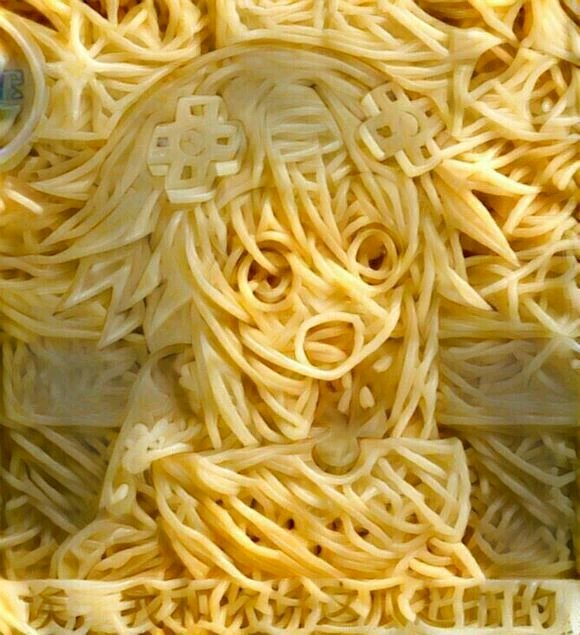
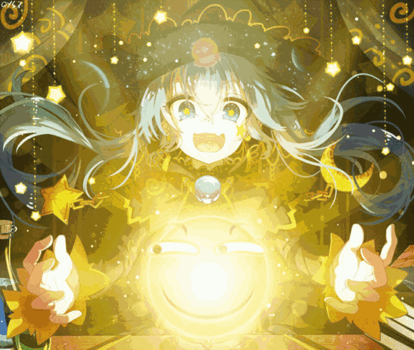
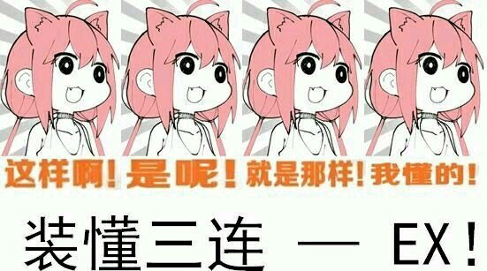
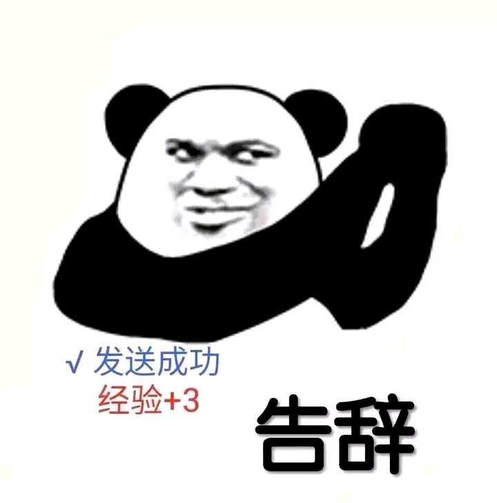
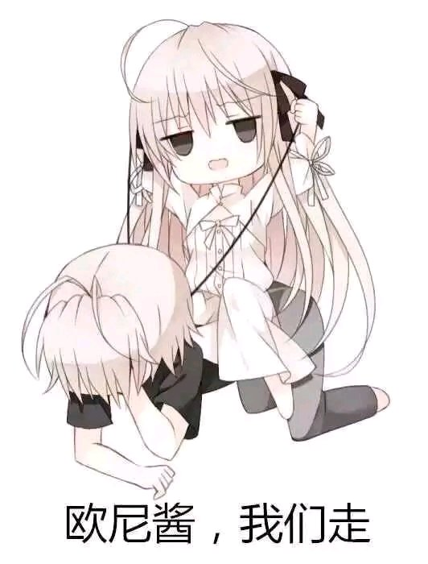

什么样的妹妹才能“名留青史”
* * *
——关于“无妹恨穹不是妹，有妹恨妹不成穹”言论以及妹系作品的一些想法
  

1楼 | tomlong98 | 2019-01-11 23:55
* * *
楼主曾经看过一段话：“穹妹之所以如此名垂千古，就是因为她和悠哥完成了古往今来数千年无数的兄控妹控没能完成的夙愿——推倒实妹。在真爱面前，他们没有向现实低头，而是打破道德的枷锁，穿越世俗的城墙。然而，隐藏在这段禁忌之恋背后的，是穹对悠专一深沉的爱！”
  

2楼 | tomlong98 | 2019-01-11 23:55
* * *
楼主想说：第三句很有道理，第二句勉强算那么回事儿，第一句狗屁不通。
  

3楼 | tomlong98 | 2019-01-11 23:55
    
    2019-01-12 02:10 | 是春日野穹呀:
    > 论如何打通狗屁
    2019-01-12 02:10 | 是春日野穹呀:
    > 应该叫疏通
    2019-01-12 12:15 | tomlong98:
    > 回复 是春日野穹呀 :你如果通过马桶或者高中宿舍洗手台的下水道你就知道了
* * *
如果说推实妹这个元素的话，galgame里满大街都是；小说界有《戏梦巴黎》（还是双子实妹……有同名电影，在国内电影广为人知一点，不过电影版翻译的是姐姐；可话说回来正如穹妹所说双生子不应该分大小……）；神话传说中的伏羲/女娲、伊耶那岐/伊耶那美；历史上的齐襄公/文姜、西泽尔/卢克雷齐娅·波吉亚的故事白纸黑字；现实中更有德国骨科、英国法庭近在眼前。论戏剧化程度悠穹兄妹的恋情基本上排不上号。从80年代的《美雪美雪》至今，妹属性的作品少说上百塑造的妹妹形象没有两百也有一百五六十挂零。然而从最早的真正意义上妹属性作品到今年39年了（本文作于2019年，第一部以妹属性为卖点的作品，漫画《美雪美雪》于1980年开始连载），真的让当代的宅男宅女们记住的妹妹形象也不过是一段以五言绝句的形式写出来的口诀的事情：
  

4楼 | tomlong98 | 2019-01-11 23:56
    
    2021-05-09 10:25 | 在悠远的苍穹º:
    > 七言
* * *
桐乃月火羽濑川，琴里火怜萌美柑。  
公主小凑迷千万，穹妹萌点占一半[1]。
  

5楼 | tomlong98 | 2019-01-11 23:57
* * *
那么，让我们从头开始。
  

7楼 | tomlong98 | 2019-01-11 23:57
* * *
Q：一个妹妹形象只要可爱就能深入人心吗？
  

8楼 | tomlong98 | 2019-01-11 23:58
* * *
A：NO！论及可爱程度，《妹妹公主》里的12个妹妹基本上全方位吊打了上面这首诗里的九个妹妹。即便在这首诗内部，属于第二梯队的琴里和小鸠的可爱程度也稍胜第一梯队的娜娜莉，但这并不妨碍娜娜莉成为第一次妹控狂潮的源头和三大最经典的妹妹形象之首载入二次元文化圈的史册。可见可爱可能是必要条件但是绝对不是充分条件。
  

9楼 | tomlong98 | 2019-01-11 23:58
* * *
Q：一个妹妹形象只要控兄就能深入人心吗？
  

10楼 | tomlong98 | 2019-01-11 23:58
* * *
Q：一对兄妹形象之间有与纲常伦理相悖的情感纠葛，会让他们深入人心吗？
  

12楼 | tomlong98 | 2019-01-11 23:59
* * *
A：这个因素可能有影响但绝对不是核心原因甚至连重要原因都不算。鲁路修、娜娜莉兄妹的情感就是发乎情止乎礼的可他们的人气之高也是有目共睹的，想要给出否定回答这个例子足矣。
  

13楼 | tomlong98 | 2019-01-11 23:59
* * *
Q：是不是作为人物形象的兄妹，越立体、越丰满或者越真实就越能深入人心？
  

14楼 | tomlong98 | 2019-01-11 23:59
* * *
A：总算见到一个明白人了，但可惜也不一定。这是因为文艺作品里的兄妹依然是人物形象，而人物形象能不能为人所铭记本身就不像打游戏BP那样有所谓的胜利方程式的。简单来说，丰满（人物身上有多个矛盾的特征，比如叶文洁、鲁路修）、真实（能够激起受众的强烈认同和感同身受，比如路明非、黑猫）、极致（将人物的某种情感或者特质放大到某种夸张的程度比如穹妹和西园寺世界）都很容易给人留下深刻的印象。
  

15楼 | tomlong98 | 2019-01-11 23:59
* * *
但是很多时候丰满的人物未必真实，我们并不容易对维克托或者杨威利的举动产生共鸣因为作为理想主义者的他们的思想境界我们望尘莫及；很多真实的人物也因为没有那么多矛盾的元素而算不上丰满比如六花、花火；我们更不希望自己的身边有一个“画家”李问或者马尔扎哈那样的疯子，单靠任何一点显然都支撑不起他们为我们铭记的理由。而一些模板化严重的人物比如金毛败犬泽村英梨梨同学或者归纳不出什么让人印象深刻的点的人物比如圣人加藤惠反倒是让大家印象深刻。除此之外，也不乏形象塑造成功但因为大家并不关注人物内核导致被忽略了的例子（比如《龙族》里的酒德麻衣，这样一个忠心耿耿但又有些虚无主义的忍者手下实在是太让我印象深刻了然而就我所知大部分人只记得她是个长腿美女忍者……反倒是那个“留着龙血的穹妹”上杉绘梨衣人气颇高……）。可见人物形象本身和它是否深入人心也建立不起明确的因果关系。
  

16楼 | tomlong98 | 2019-01-12 00:00
* * *
Q：剧情越精彩、人物关系越复杂、情感越真挚就越能让妹妹们深入人心吗？
  

17楼 | tomlong98 | 2019-01-12 00:00
* * *
A：很遗憾，未必。那些嚷嚷着“千反田爱瑠我老婆！”还顺手把她送上了萌王宝座的人有多少是真的能谨记《冰菓》剧情的？那些沉醉于《恋风》里兄妹感情的跌宕起伏的人也不全能够把主人公的名字记全吧？可见剧情的精彩、人物关系或者情感都不是让人物深入人心的根本原因。
  

18楼 | tomlong98 | 2019-01-12 00:00
* * *
Q：越满足受众喜好的妹妹一定越不容易被忘记吗？
  

19楼 | tomlong98 | 2019-01-12 00:01
* * *
A：你老婆和泉纱雾的棺材板我帮你焊上了，希望五十年以后你弥留之际还能记得这个当年立誓要葬在一起的女人叫什么名字。
  

20楼 | tomlong98 | 2019-01-12 00:01
* * *
说了这么多，我们发现很多因素都会让妹妹们“名留青史”但是好像没有一个既是充分条件又是必要条件。这是因为我们必须明白，一部文艺作品一定是由两部分组成的：人物、故事。故事情节的发展必须服务于人物形象的塑造而人物形象的变化（或者说主人公的成长吧……）也必须紧跟故事情节的推进。因此，如果人物形象所带来的行为人物行为不能让剧情合理化或者剧情不能很好地体现一个人物形象的成长过程那么就会显得脱节或者说“不合理”，这样一来人物形象也就不可能为大家所铭记了。进一步地说，一部作品的各个部分其实是互锁的：需要有优秀的人设和属性来吸引观众、需要有出彩的剧情和制作让观众坚持看下去、需要有实实在在的人物内核来激起受众的情感共鸣、需要与人物形象挂钩的作品主旨来唤起受众的思考……这才能让其中的人物真正为观众所铭记。
  

21楼 | tomlong98 | 2019-01-12 00:01
* * *
从三次妹控狂潮的源头——娜娜莉、长濑凑和春日野穹——就可以窥见其中的端倪。这三个妹妹形象其实是有共同的吸引人和让人铭记的点的。我概括为可怜、可爱和可悲。
  

22楼 | tomlong98 | 2019-01-12 00:01
* * *
娜娜莉的可怜，在于历经童年创伤，身有残疾，又被迫远走他乡当做外交工具。作为皇家子弟的她却从来没有自己选择的机会和权利，只能随着他人的意愿而动。也正因为没有选择，她对于同样没有选择的人们感同身受，是作品中仅有的将理想与悲悯合而为一的人物。
  

23楼 | tomlong98 | 2019-01-12 00:02
* * *
小凑的可怜，在于她生长在一个特工家庭，自幼过着颠沛漂泊的生活，同时对哥哥有着负罪感和愧疚感（有兴趣的可以对比一下《盗梦空间》里柯布对孩子们的感情，会发现这两个人物有相似之处）。这让小凑成长为了一个典型的讨好型人格，为了周围人的认可和快乐不惜忽视自己的感情。顺带一提，《缘之空》里的巫女天女目瑛也是一个类似的人物，只不过二人的讨好型人格成因不同而已。
  

24楼 | tomlong98 | 2019-01-12 00:02
* * *
穹妹的可怜，在于疾病缠身[3]、与世隔绝，除了家人没有别的风景；家庭支离破碎以后，也只有小悠作为她生活的依靠和情感的慰藉。这也导致她后来将小悠看做自己的情人乃至精神支柱，强烈的依恋和渴望占有。
  

25楼 | tomlong98 | 2019-01-12 00:03
* * *
三个妹妹的可怜之处，让哥哥们对于她们的关怀和兄妹彼此的情感纽带变得理所应当，推进了剧情的发展和人物关系的深化；同时也激起了受众（主要是幻想自己有个妹妹的死宅们……）的同情心和保护欲，让他们有动力追番看下去。
  

26楼 | tomlong98 | 2019-01-12 00:03
* * *

  

27楼 | 咕噜灵波✨ | 2019-01-12 00:03
    
    2019-01-12 00:09 | tomlong98:
    > 乖啊，等我更完我在回复你。
    2019-01-12 00:09 | tomlong98:
    > 再
    2019-01-12 04:00 | 咕噜灵波✨:
    > 回复 tomlong98 :
* * *
娜娜莉的可爱，在于对鲁路修的依恋和信任、对民众和人权的尊重——注意她是为数不多称11区人民为日本人的人，在黑色叛乱、为11区争取独立、鲁路修的超级合众国等事件中也立下了汗马功劳，可以说是一个有人文关怀和悲悯情怀的改良派形象了——和……嗯……残疾公主这个标签。
  

28楼 | tomlong98 | 2019-01-12 00:03
* * *
小凑的可爱，在于她是一个看着糊涂揣着明白的人；她率先意识到了优姬和准一的感情发芽滋长，也意识到不论是小司、学姐还是华恋都不是哥哥的菜，自己当然也排不上号了。而她自己又一直清楚地明白自己的感情但又压抑着它；直到准一和优姬迸发矛盾、准一也开始思考自己真正想要的是什么，小凑又及时出面告白，简直不要太萌[4]！
  

29楼 | tomlong98 | 2019-01-12 00:03
* * *
穹妹的可爱，在于她对小悠从亲人的依恋到爱人的疼惜，从傲娇任性到关照担忧，从单方面的依赖到相互扶持、相互依靠的成长过程；更在于她对自己的情感清晰的认知和敢说敢做。这样一个妹妹，你怎么能不喜欢？
  

30楼 | tomlong98 | 2019-01-12 00:04
* * *
三个妹妹的可爱之处，不仅成为了她们的卖点吸引受众入坑进而广为流传，更唤起了死宅们对于作品里哥哥们的同理心和“在虚拟作品中找现实感”的渴望（毕竟这都是现实中有或者应有的美好的东西）。
  

31楼 | tomlong98 | 2019-01-12 00:04
* * *
娜娜莉的可悲，在于她最后终于得到了自己梦寐以求的东西和选择的机会，但为了继承哥鲁路修的遗志，她又亲手放弃了哥哥用命给她换来的选择权，毅然接过了鲁路修曾经的使命。可以说，自从她选择按照鲁路修的安排“负”了他之后，她就只能沿着哥哥规划好的路线一直走下去再也没有回头路可走了。一个人给了你选择的权利就是想让你按照自己的意思好好活下去而你选择了他最不希望的方式：继承他的意志继续走下去；这很难说不是一种悲哀了。
  

32楼 | tomlong98 | 2019-01-12 00:04
* * *
小凑的可悲，在于她一直以来都在为别人而活。尽管她有自己的情感和想法，但为了成全口嫌体正直的哥哥和优姬，她一直选择退让；不论是邮轮危机、校园风波还是出游时的温泉事件，小凑都是消防队员一样的存在。某种意义上说，小凑是自愿成为了一个影子、一个人偶，在上帝视角中，大部分时候的她都没有自我。她人生的一大悲哀就是自己选择了不做自己。
  

33楼 | tomlong98 | 2019-01-12 00:04
* * *
穹妹的可悲，在于她生活的唯一动力和唯一目的就是小悠。正如我上文所说，小悠就是穹妹的精神支柱。如果说为偶像、为他人的眼光而活已经很无奈悲哀，那么世界上最大的可悲莫过于把自己生活的动力寄托在另一个人身上。从这个角度来说穹妹甚至比娜娜莉还要可悲一些，娜娜莉至少知道像鲁路修希望的那样好好活下去，然而若是小悠死了穹妹大概率也会殉情的吧。
  

34楼 | tomlong98 | 2019-01-12 00:05
* * *
想到了这一点，第二、第三个问题的答案已经呼之欲出了：如果把一个像穹妹一样的女孩子送给没有妹妹的你做妹妹，她的可怜和可爱会激起你全部的保护欲和同情心；她从肉体到精神全方位依靠你而活，弱不禁风脱离社会，而你非常爱她也就不忍心打破她的美好念想。她生活上需要你照顾，精神上需要你支持；不论你做什么，你都需要也会本能地考虑她的感受和需要；你的一举一动都会想到她，想要包揽她的一切、承担起她需要的任何事情；不想也不敢伤她的心；你会一直为她操心。这种责任只会让人疲倦，又怎么会让你开心起来呢？而如果已经有妹妹的你突然发现自己的妹妹变成了穹妹，估计你的心都得疼死吧；要知道，她的可怜和可悲，有你的一份责任啊……或者说，正是因为我爱我自己的妹妹，我才不希望她经历穹妹经历的任何事情甚至成为穹妹那样的妹妹。
  

36楼 | tomlong98 | 2019-01-12 00:06
* * *
既然这样，我们欣赏妹系作品还欣赏个什么劲儿啊？又未必看得到乱伦背德的快感，又不总是见得到可爱控兄又讨人喜欢的妹妹，妹妹形象还不一定符合“艺术性（笑）”的需要，我们还看妹控番干嘛？直接看后宫……啊呸！直接看恋爱番不是更好？
  

37楼 | tomlong98 | 2019-01-12 00:07
* * *
很多人说没有妹妹的人才会看妹控番幻想自己有个妹妹，真的有妹妹的都会很讨厌妹控番。对此我只能说甲之参汤，乙之砒霜；老实说我也不喜欢那种纯粹为了满足某些特殊妹控的喜好而创作出来的妹妹甚至于那些只是猎奇而没有任何内核的真·纸片人妹妹。但我相信对于那些抱着在现实中找虚幻感、在虚拟世界中找现实感、努力建立起现实与虚幻的联系并认真思考妹控番本身的观众也就是“哥哥们”而言，他们看完妹控番爽了一把之后还会进一步地反思自己的所作所为进而更加珍惜自己的妹妹——不论现实中有没有妹妹，都是一样的。
  

39楼 | tomlong98 | 2019-01-12 00:07
* * *
正文完，以下为补充说明——
  

40楼 | tomlong98 | 2019-01-12 00:08
* * *
[1]：原诗为“桐乃月火羽濑川，琴里小凑萌美柑。天下有妹千千万，穹妹萌点占一半。”但我个人认为火怜和娜娜莉不能上榜就不太合理；而且按照这个标准，小凑、娜娜莉完全可以和穹妹齐名，所以我才做了一点修改。
  

41楼 | tomlong98 | 2019-01-12 00:08
* * *
[2]：原著设定司波兄妹为基因经过修饰的人造人，即便生下后代也不会有基因缺陷……
  

42楼 | tomlong98 | 2019-01-12 00:08
* * *

  

43楼 | 我总是那麽松懈 | 2019-01-12 00:10
* * *
[3]：动画和游戏都没有明说穹妹得的是什么病，但从长期住院和动画里奈绪之母“妹妹的身体刚刚好转”一句话来看，穹妹得的应该是很难根治的先天性慢性病而且随时可能会危及生命。此外漫画里夏祭一段，穹妹在夏祭典上病倒的时候，也有“明明不舒服为什么勉强？”“在家吃药就没事，想和悠一起玩到最后。”的线索。可见穹妹的病应该是要靠药物压制的，可能是先天性心脏病或者青少年糖尿病（考虑到穹妹那么吃垃圾食品还那么瘦，说实话这个理由我都忍不住想笑一笑但实在笑不出来……）之类的吧……
  

45楼 | tomlong98 | 2019-01-12 00:14
* * *
去跟吧主说让这个帖子加精，就说是我说的
  

47楼 | 不知QING | 2019-01-12 00:16
* * *
完结了？
  

50楼 | 風華▫恋 | 2019-01-12 00:28
* * *
全文完。
  

51楼 | tomlong98 | 2019-01-12 00:29
* * *
二次元妹妹
  

53楼 | 轮回的乐园😍 | 2019-01-12 00:38
* * *
好长  
收藏了慢慢看
  

56楼 | 哦一样兔儿童 | 2019-01-12 00:45
    
    2019-02-16 10:40 | island🎅:
    > 哦结果你看了没
* * *
怎么说呢，喜欢就好，身在中国就请遵守中国法律和传统的三观（bu cun zai的），最重要的一点，你要确保你爸不会把你退打断就行了
  

57楼 | 是春日野穹呀 | 2019-01-12 02:11
* * *
但其实最开始我是抱着水贴+3的心态来看的
  

58楼 | 是春日野穹呀 | 2019-01-12 02:14
* * *
发完这条就是+9了
  

59楼 | 是春日野穹呀 | 2019-01-12 02:14
* * *
不过我又想到一点，那时候PC game不发达，手机游戏就算了吧，所以呢（笑）
  

60楼 | 是春日野穹呀 | 2019-01-12 02:17
* * *
不行，还要再水多几条  
怎么说爱之类的，全凭感觉，  
现实生活中，***b说对妹妹有多爱，要是你妹妹长得不忍直视（捂脸）你还会那么爱她吗，而不是觉得她像个累赘吗
  

61楼 | 是春日野穹呀 | 2019-01-12 02:20
    
    2019-01-12 12:21 | tomlong98:
    > 这个问题我觉得可以讨论一下，因人而异吧而且也取决于环境什么的。因为我自己的妹妹长得也只是一般般但毕竟不是把她当做女孩子而是当做亲人和朋友的，所以我觉得这个因素没什么影响的。此外，就像儿不嫌母丑一样的道理，亲人之间这种缺陷应该还是可以接受的，我个人认为如此。
    2019-01-12 12:33 | 是春日野穹呀:
    > 回复 tomlong98 :是我心术不正了
    2019-01-12 12:33 | tomlong98:
    > 你的话勾起了我一点不太好但又有点温暖的回忆……我以前为了治皮肤病用过激素类的药物还做过很多调理。这种疗法其实挺伤身体的，然后激素药就让我比较胖而且有胸部。就连我妈妈都经常拿这个话题开我的玩笑说我没有意志力把胸部练下去才会让胸比妹妹还大什么的，只有妹妹从不戳我这个痛处。
    2019-01-12 12:35 | 是春日野穹呀:
    > 回复 tomlong98 :这个可以有，是个好妹妹
    2019-01-12 12:39 | tomlong98:
    > 回复 是春日野穹呀 :也不能说心术不正吧……只是因为我有上面那样的回忆，所以我能体会到家人之间不会因为有某种缺陷而影响关系的。尽管我因为治病的副作用加上缺乏锻炼和以前被欺负的旧伤所以身体不好，现在我都没法骑车，学羽毛球矫正了肩膀才能下水游泳。但妹妹从来不嫌弃我，所以我挺感动的。
    2019-01-12 12:45 | 是春日野穹呀:
    > 回复 tomlong98 :算了吧，我独生，跟我好的也就俩姐姐，不过都工作了
    2019-01-12 12:46 | tomlong98:
    > 回复 是春日野穹呀 :对不起……最后一个你指代的是伏见司……我删掉一下改一个措辞……
    2019-01-12 12:47 | tomlong98:
    > 回复 是春日野穹呀 :总之我在亲情这方面体会挺深的，所以我很不能理解伏见司那号对妹妹有某种……病态情结的人；你说像吧里那些晒妹的或者骨科大佬那样真的亲密融洽的还好，他伏见司自己跟妹妹的搞不好关系还写小说吐槽社会不容？笑话！
    2021-05-08 15:55 | 日暮的余晖😄:
    > 只要不是特别特别丑都会喜欢的，说真的那种特别丑是很少的。
* * *
这些问题真是引（ling）人深（tou）思（da），但还是那句话，看脸的成分早已根植入大众心中
  

62楼 | 是春日野穹呀 | 2019-01-12 02:22
* * *
怎么好像没有经验+3了
  

63楼 | 是春日野穹呀 | 2019-01-12 02:22
* * *
穹的人设和禁断话题性及情色话题性，既符合颜值即是正义的大众审美，也符合禁果分外甜的诱惑效应。具有传播的出色底子，再加上缘之空出色的天人合一物哀主义及BGM加持，脱颖而出也是天然。
  

64楼 | 龙与凤凰🔯 | 2019-01-12 02:57
    
    2019-01-12 10:52 | tomlong98:
    > 这些当然都是原因，其实我在论证的时候就说了文艺作品中的人物形象是不存在胜利方程式的，这也是明明千百年来人类故事和人物的经典元素就那么多但是新的经典形象和故事却层出不穷的原因。只是我觉得，如果纯粹把缘之空看做一部商业作品，实在可惜了一点……
* * *
别人的妹妹
  

65楼 | 贴吧用户_QSKP8S3 | 2019-01-12 04:20
* * *

  

66楼 | 有個變態姐姐💫 | 2019-01-12 08:43
* * *
不知道该说什么，反正就对了
  

67楼 | ♀加藤恵♀ლ | 2019-01-12 10:42
* * *
路过，
  

68楼 | 路过的空我♬ | 2019-01-12 12:21
    
    2019-01-12 12:23 | tomlong98:
    > 为什么到处都有你……我好像在别的吧也见过你不止一两次
    2019-01-12 12:23 | tomlong98:
    > 然后这个吧什么帖子下面都有你的路过二字
    2019-01-12 12:26 | 路过的空我♬:
    > 回复 tomlong98 :不知道回什么。就回这个。
* * *
是大佬，我死了
  

70楼 | 我心悠我 | 2019-01-12 12:52
* * *
没看完 意思懂了
  

71楼 | 佛系冰水 | 2019-01-12 15:20
* * *

  

72楼 | 贴吧用户_QbJ6S8W | 2019-01-12 17:03
* * *
阅读完毕，确定楼主是个大佬。  
希望以后能有更多的精品贴。  
最主要的是楼主的更新很良心，比那些秀妹的楼主快了不知多少倍。
  

73楼 | 奇光点 | 2019-01-12 21:05
    
    2019-01-13 01:43 | tomlong98:
    > 这个……是我肝了一晚上的作品然后排了下版就发上来了……其实正如@鳥之穹鳴所说，我的观点和论证的基础就是值得商榷的所以其实也没必要在这种问题上较真，你就当我在那天实验室被溶剂熏晕了吧 （另，我不会告诉你我的朋友圈偶尔的一两张合影就会让同学们叫我晒妹狂魔）
    2019-01-13 01:44 | tomlong98:
    > 相对而言我的另外两个帖子里关于缘之空人物关系和权利与伦理界限的讨论应该更有意义一点，欢迎阅读哦
* * *
lz好厉害,mark一个
  

74楼 | 贴吧用户_QRA7C4N | 2019-01-12 22:58
* * *
OTZ
  

75楼 | 贴吧用户_QRA7C4N | 2019-01-12 23:00
* * *
太长不看
  

77楼 | 发热神殿🔥 | 2019-01-13 00:51
* * *
问个问题，如果楼主以后开个秀妹的帖子会有人来捧场吗
  

78楼 | tomlong98 | 2019-01-13 01:45
    
    2019-01-13 01:54 | tomlong98:
    > 回复 乔苍◆桑 :看你的标准是什么，如果只要聊到妹妹的好就是秀妹那么我已经开始了。你可以去看一下我和@是春日野穹啊 在61楼下面的互动
* * *
当然短时间内肯定不会了，起码得等我写完最后一篇关于缘之空的文章《情感的三相平衡点》以后了。因为楼主现在还是单身，在我高中最难熬的时候我的妹妹给了我很多支持和帮助而在大学期间她也代替了女朋友的大部分作用。因此我才开始思考对于同样的关系，人会不会有不同的情感选项，比如有的人只是把妹妹当妹妹但有的人可以把妹妹在亲情之外附上友情和爱情的元素了。三相点是物理化学上的概念，这里我用物质的固液气三态类比亲情友情爱情三种情感走向的相互转化和平衡过程，敬请期待。
  

79楼 | tomlong98 | 2019-01-13 01:52
* * *
感觉不是你原创的
  

80楼 | 風華▫恋 | 2019-01-13 02:26
    
    2019-01-13 02:41 | tomlong98:
    > 绝对原创，不怕查对，三个妹妹的可怜可爱可悲的对比就是只此一家别无分号的。作为写作爱好者，龙某人我敢以我自己的生命起誓，我绝对没有抄袭或洗稿过任何一篇既有的文章。本文最初是2019年1月11日23：54发在简书平台上的，号主也是我（ID与头像为证）。
    2019-01-13 02:46 | 風華▫恋:
    > 回复 tomlong98 :<https://m.sohu.com/a/242158612_502842/?pvid=000115_3w_a>你看一下这个吧
    2019-01-13 10:12 | tomlong98:
    > 回复 🌌十年缘悠💞 ：我开头引号里那句话是从百度上的一篇文章引用过来的，这个不影响原创啊
* * *
去跟吧主说让这个帖子加精，就说是我说的
  

81楼 | 叫我悠远☜就好 | 2019-01-21 13:26
* * *
已精
  

83楼 | 風華▫恋 | 2019-02-15 21:06
* * *
作品名垂青史，主要角色就会名垂青史……哪怕是臭名昭著，也比一般角色更广为人知
  

84楼 | 这个真不存在 | 2019-02-16 00:05
* * *
， 

  

85楼 | 段晰桐 | 2019-02-16 00:27
* * *

  

86楼 | island🎅 | 2019-02-16 10:41
* * *
顶
  

88楼 | 仙九哭唧唧💧 | 2019-03-12 15:15
* * *
射精
  

90楼 | ▫本宅要逆天 | 2019-07-17 17:16
    
    2020-03-22 07:44 | 不懂你在路上:
    > ？？？
* * *
关于穹妹这一点居然和我看完的观后感差不多，我就是想到这些个点莫名其妙地控制不住自己。。从最后那个巴士一直哭到ed结束……
  

91楼 | 远空♬ | 2019-07-20 02:51
* * *
dd
  

92楼 | 風華▫恋 | 2019-10-16 01:27
* * *
顶
  

93楼 | 蓝鹄º | 2020-03-21 22:06
* * *
氵
  

95楼 | 蕾蕾子🍀 | 2021-03-23 11:58
