新帖来袭
* * *
楼主是一名对ACGN有兴趣的文学爱好者，受吧友@第一苍穹的关于攻略《缘之空》中妹子们的方法的旧帖的启发，撰写了一篇关于《缘之空》里哪个妹子最适合小悠的讨论文。欢迎吧友们参与讨论，多多交流指教—— 
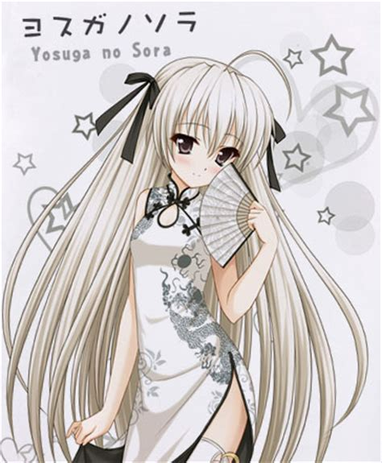
旗袍穹妹镇楼（图源百度）。
  

1楼 | tomlong98 | 2019-02-08 21:27
* * *
第一
  

2楼 | 赛特破哥哥 | 2019-02-08 21:36
* * *

  

3楼 | 怨憎聚 | 2019-02-08 21:37
* * *
第三
  

4楼 | natuko▫ | 2019-02-08 21:45
* * *
讨论是不存在的说
  

5楼 | 五月雨🍒 | 2019-02-08 22:05
* * *
《谁才是小悠的最佳伴侣》
  

6楼 | tomlong98 | 2019-02-08 22:10
* * *
楼主以前写过一篇关于俺妹的文章《谁才是最适合京介的那个姑娘》。文中采取的是建模评分的方式。由于被人指出过于理性，工程师思维很重，因此这次调整思路，改用一个排除法的方式。
  

8楼 | tomlong98 | 2019-02-08 22:13
* * *
首先，一对最理想的伴侣应当年龄尽可能趋近。虽然很多人说年龄不是问题，然而实践是检验真理的唯一标准，从现实中的案例来看，忘年恋要么不会长久要么会成为纯粹的利益勾连。偶尔的特例例如杨振宁和翁帆，最后也被指出后者仅仅是杨原配妻子的替代品而已。因此两个比小悠年龄大一截的女性——伊福部八寻和乃木坂初佳——最先被排除。
  

9楼 | tomlong98 | 2019-02-08 22:14
* * *
有人可能会说她们的年龄也不比小悠大很多啊？别急，最先排除她们的原因可不仅仅是年龄，还有其他方面的考量。作为已经在社会上闯荡过，饱尝世态炎凉的女性，二位的阅历本身就领先小悠不少，自然会更加实际；而从游戏中小悠攻略的方式来看，无非也就是帮助她们走出自己的心结。这是因为她们当时都处于感情受挫的状态，急需精神上的慰藉。这也就注定了她们并不一定需要长相厮守，谈个恋爱玩玩儿还行，等到精神需求被满足以后就很难说了。而随着时间的推移，由于年龄和经历的差距，他们性格中的不合也注定会不断地积累，最终导致感情的破裂甚至磨灭。基于上面的论述，我首先排除了这两个大龄熟女。
  

10楼 | tomlong98 | 2019-02-08 22:14
* * *
楼主明早抽血，准备睡了。此外有一些截图需要修改补充，先暂停一下，明天中午继续更。欢迎大家就现有的论述提出自己的见解
  

12楼 | tomlong98 | 2019-02-08 22:30
* * *
又是你
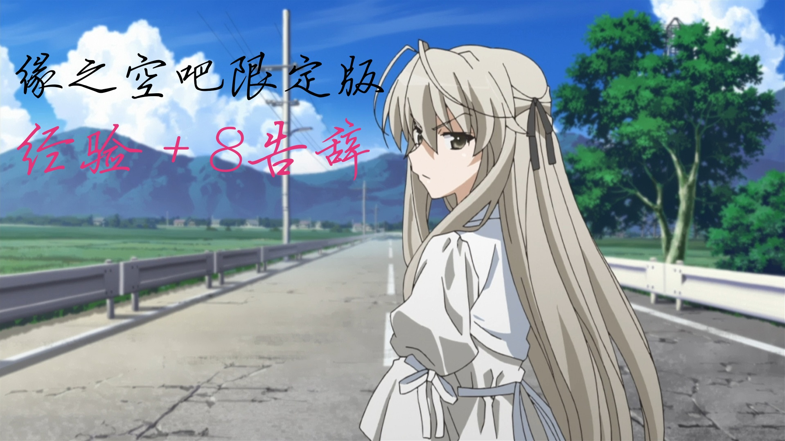
  

13楼 | 鳥之穹鳴 | 2019-02-08 23:31
    
    2019-02-09 12:16 | tomlong98:
    > 我更完了，大佬请轻怼
    2019-02-09 12:26 | 鳥之穹鳴:
    > 回复 tomlong98 :不不不你才是大佬
* * *
当然是穹了
  

14楼 | 我心悠我 | 2019-02-09 00:11
* * *
当然是瑛啦
  

16楼 | 初见u♋ | 2019-02-09 08:58
* * *
悠穹之间的深爱会让他们走得更远
  

17楼 | 失落的迩梦 | 2019-02-09 09:06
* * *
小孩都有了需要你讨论？
  

18楼 | 爱你山河皆可平 | 2019-02-09 09:18
* * *
都很不错  
穹的话，本身是兄妹，互相体谅，而且后来的穹妹人妻感满满  
初佳和奈绪也不错，都特别懂的照顾人，应该是这样的吧，咳咳咳...初佳小姐应该行  
瑛的话，很贴心，什么都明白，和穹一样卡哇伊ฅฅ* 
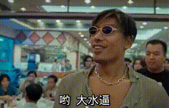
  

19楼 | island🎅 | 2019-02-09 09:47
* * *
穹悠
  

20楼 | -白色的雪- | 2019-02-09 10:58
* * *
dd
  

21楼 | 春日野穹fan | 2019-02-09 11:08
* * *
楼主归来，继续更新。
  

22楼 | tomlong98 | 2019-02-09 11:11
* * *
接下来排除的是班长仓永梢。这是因为班长对于小悠的情感有相当大的主观和美化成分，长期相处之后，随着双方了解的进一步加深，原有的美好印象会逐渐消失甚至带来巨大的反差，加速感情的破裂。这一点在动画里展现的淋漓尽致：在动画大结局的时候，班长和奈绪撞见了小悠跟穹妹在玄关的事情；此后——
  

23楼 | tomlong98 | 2019-02-09 11:12
    
    2019-02-09 11:17 | tomlong98:
    > 外婆家网络不稳定，上传图片不成功，我在处理
* * *
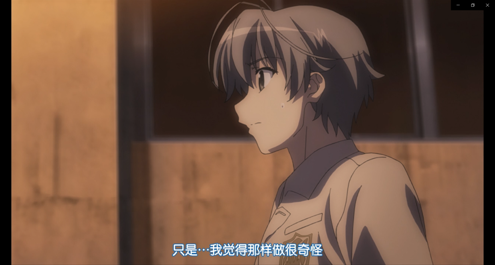
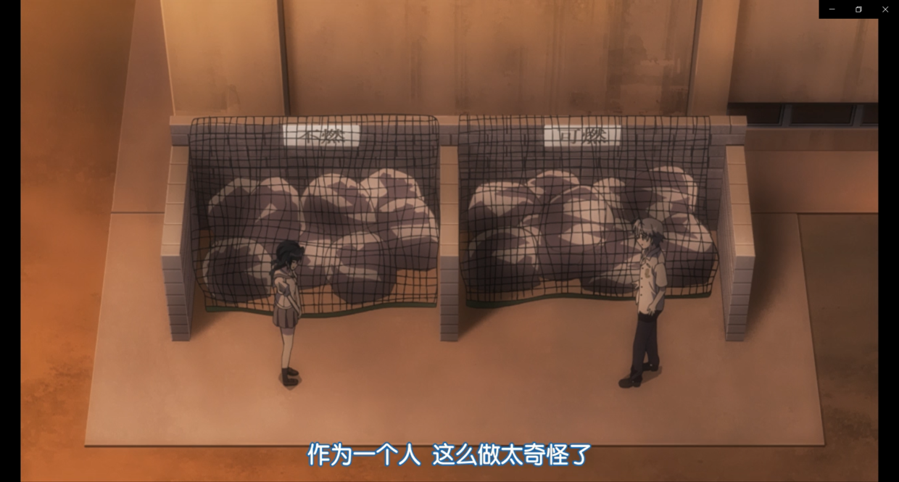
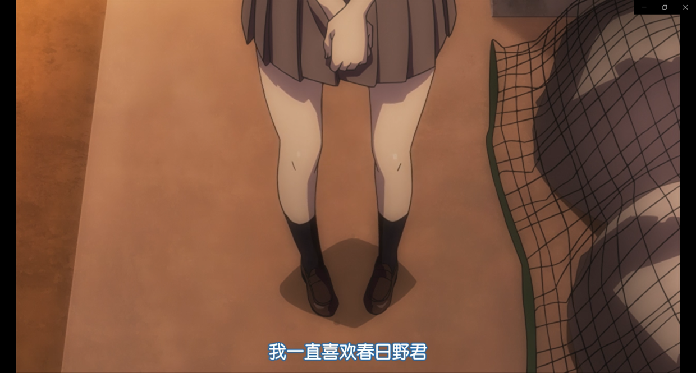
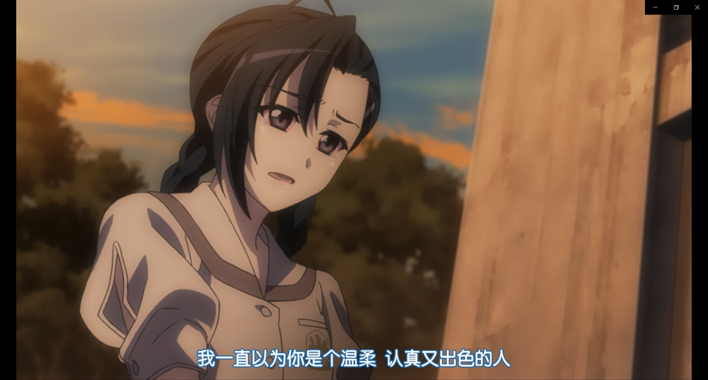
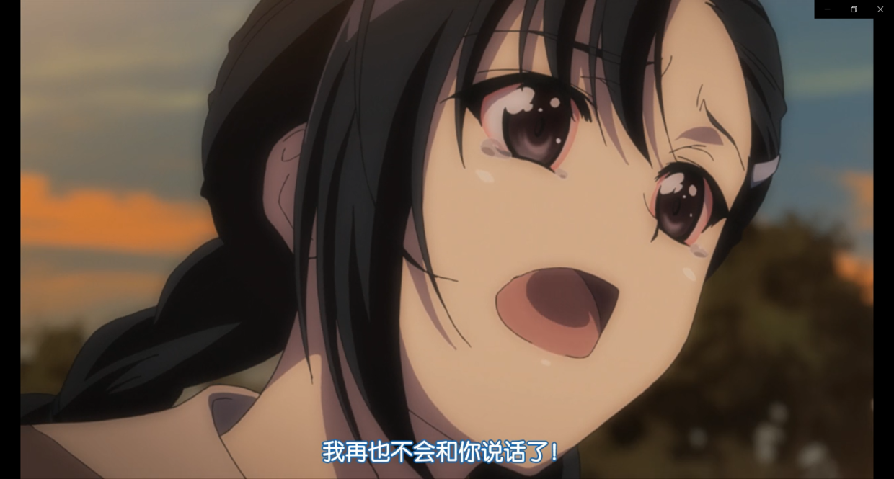
（目睹心上人不堪入目的一面班长哭红了双眼，足见她内心的崩溃）
  

24楼 | tomlong98 | 2019-02-09 11:18
* * *
这个中缘由可能是因为班长是一个所谓“守序善良”的人。这种人物一方面认同一种约定俗成的秩序比如法律、伦理道德或者一些约定俗成的道理；但另一方面他们也会基于优先利他的原则而做出对他人好的事情。但实际上很多时候为别人好的事情未必与符合秩序而遵循秩序办事则对别人不利。因此他们往往会基于自己的价值观，出于真心为别人好的动机而希望别人改变。然而他们眼中的善良/秩序/为别人好对于当事人而言可未必如是。如果不是价值观高度吻合，别说白头偕老，拍拖三个月都够你受的了。这一点在动画最后也有体现—— 
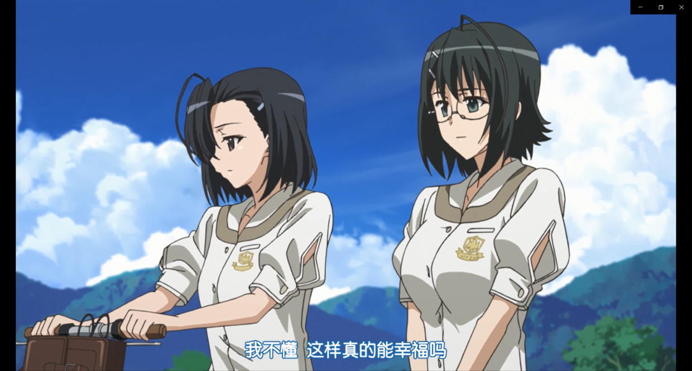
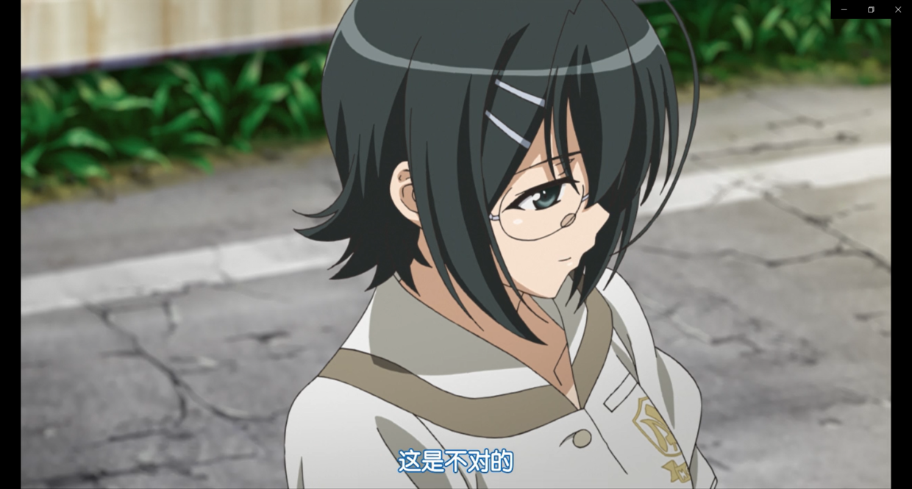
  

25楼 | tomlong98 | 2019-02-09 11:19
    
    2019-02-09 11:20 | tomlong98:
    > 顺便一说，楼主的一个朋友便是这种类型，如果不是我们都是讲道理的理工男而且基本公理高度契合我估计我们早就闹翻了……
* * *
基于以上论述，班长也不是最合适的选择。
  

26楼 | tomlong98 | 2019-02-09 11:21
* * *
再下一个被排除的是巫女天女目瑛。巫女的问题，在于她是一个讨好型人格，一切都顺着别人的想法。尽管自己心里有感受和体会，但绝对不会展现出来给你看。偏偏小悠是个老好人，跟这样一个女孩子待在一块儿不心疼死才见鬼了。因为二人都是会主动迁就对方的人，如此一来二去互相让步虽然和谐，但也绝对够令人疲倦了。
  

27楼 | tomlong98 | 2019-02-09 11:21
* * *
更麻烦的事情还在后头。在亲密关系中，有一样东西对于情感的维系至关重要那就是新鲜感。然而无奈巫女见闻有限性格温和，对于外面的世界格外向往但也喜欢奥木染平和安定的生活。这样一个女孩子最后肯定还是会选择回到自己熟悉的港湾，游戏中她甚至建议小悠留下来做叉依姬神社的宫司。套用《三体》里的一个概念：用低光速慢雾把自己包裹起来的恒星文明。这样一个女孩子能有多少新鲜感可供发掘呢？而小悠却是一个并不安分、有些优柔寡断并且有极大不确定性的男生。单纯的星海征途或者落日余晖都难以满足他的需要。这也就意味着终有一天，当巫女这本书被小悠翻来覆去以至于倒背如流了，两人的关系还怎么维系呢？虽然以二人的性格，他们未必会分开，但是名存实亡的感情，勉强涂饰裱糊着有意义吗？从这个角度来说，巫女并不是最优解。
  

28楼 | tomlong98 | 2019-02-09 11:21
    
    2019-02-09 11:22 | tomlong98:
    > 不能不提，妹坡里的小凑和巫女有相通之处，只是二人讨好型人格的成因不同。事实上这种敞开心扉的过程原本就是双方相互成就的过程，需要有很多的偶然因素才能达成真正的大团圆结局。
* * *
接下来是人气颇高的穹妹。我知道很多人非常喜欢穹妹非常希望她和小悠在一起，但还是请大家先把家伙什儿都放下好听我说完。
  

29楼 | tomlong98 | 2019-02-09 11:22
* * *
穹妹和小悠作为孪生兄妹，关系基础自不一般。但是二人的关系却为伦理道德所不容。世俗异样的目光、终身无后的苦楚、年少求生的艰辛……这些都是压力。更糟糕的是，由于穹妹把小悠当作精神支柱，这也就导致二人的关系被彻底锁死了——穹妹因为脱离社会所以精神上需要小悠作为活下去的动力；而因为她的世界只有小悠所以她的一切行为都是为她和小悠的关系服务的，因此她只会越来越与社会貌合神离自然也就越来越需要小悠作为精神支柱，如此恶性循环。这些小悠绝对是看在眼里疼在心里。而兄妹俩的生活这样沉重的责任也是小悠难以承担的。终有一天，这种恶性循环和情感与责任带来的重担会将小悠压垮进而磨灭二人的感情。这一点我在《苍穹固悠远，其心永恒乎》里也提到过。情感让他们得以突破社会的桎梏最终却会磨灭他们的情感，这难道不是最大的悲剧吗？可见穹妹也不是最合适的人选。
  

30楼 | tomlong98 | 2019-02-09 11:22
* * *
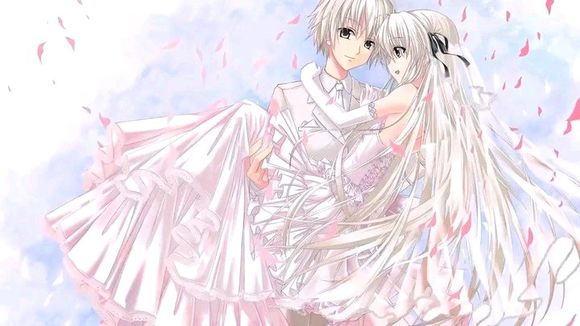
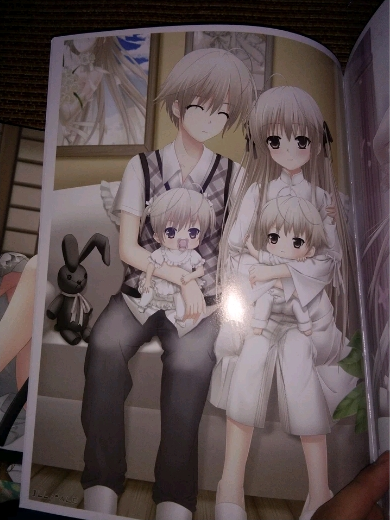
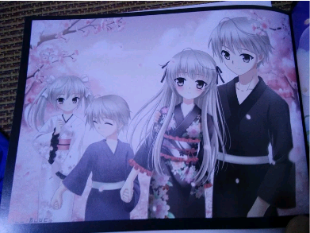
（虽然我也很希望这三张照片变成现实毕竟穹妹这个可怜可爱又可悲的妹妹形象真的打动了我，但是从理性思考的角度，她真的不是那个最适合小悠的妹子）
  

31楼 | tomlong98 | 2019-02-09 11:24
* * *
接下来奈绪粉们可能按捺不住了。作为青梅竹马邻家学姐的奈绪的确是个相当不错的选择：奈绪性格善良温和能体谅小悠的难处，身材丰腴结实，家务事方面也很在行还会照顾人；更重要的是，奈绪冷静而富有包容心——在知道小悠和穹妹的关系之后，她选择了接受并祝福他们；游戏里和班长偶然撞见他们玄关的秘密时，班长情绪失控直接跑路小悠也吓懵了但是奈绪还稳得住知道让小悠赶紧给穹妹穿好衣服而她自己去找班长和大家避免事情闹大。这样一个女人娶回家绝对是幸福温馨。
  

32楼 | tomlong98 | 2019-02-09 11:25
* * *
路过。
  

33楼 | 路过的空我♬ | 2019-02-09 11:27
* * *

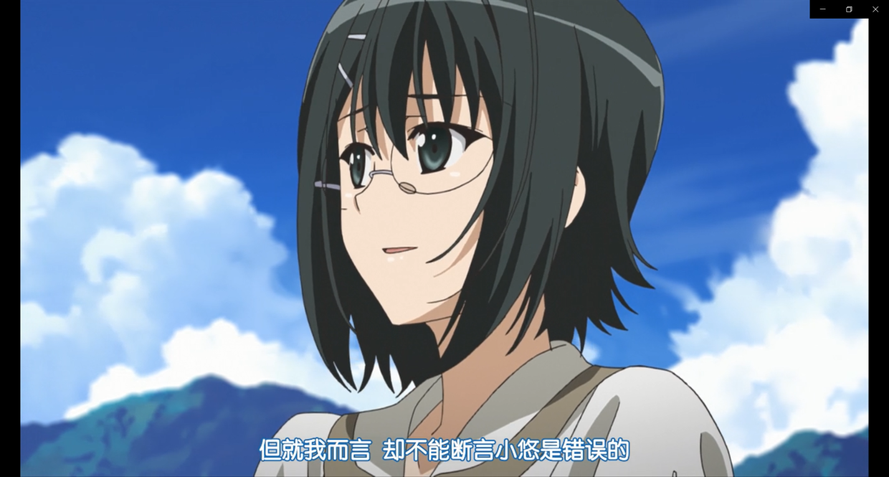
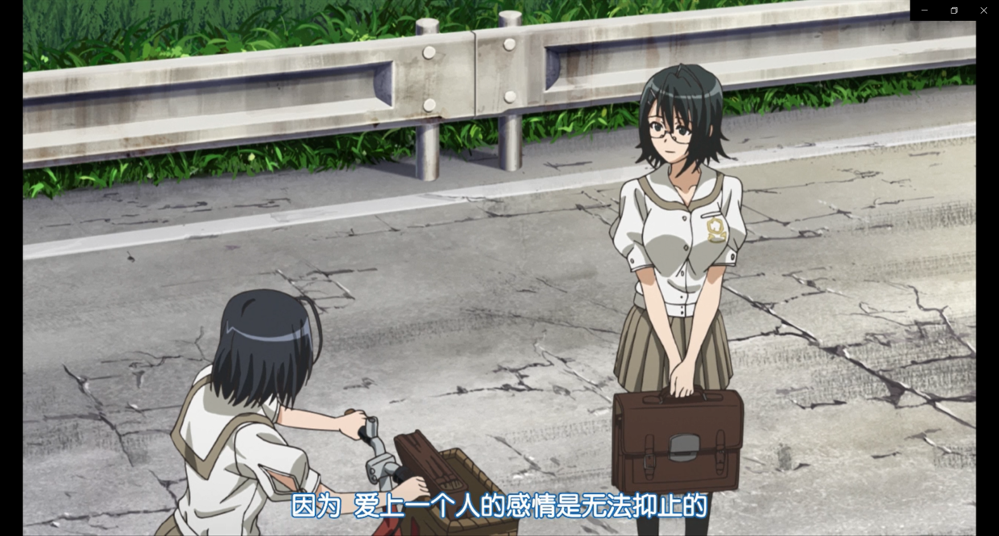
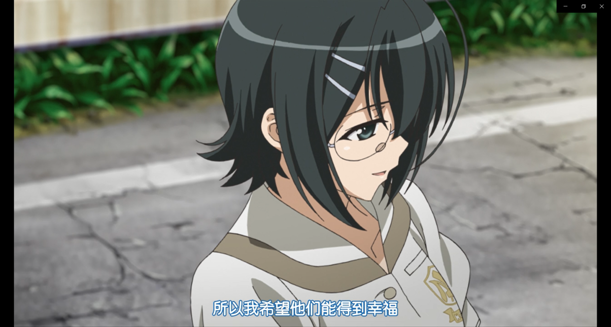
  

34楼 | tomlong98 | 2019-02-09 11:34
* * *
那么，奈绪就一定是最好的吗？
  

35楼 | tomlong98 | 2019-02-09 11:34
* * *
很遗憾，答案也是否定的。原因和巫女有些类似。如果大家看过俺妹的话就会发现奈绪和麻奈实的形象非常接近——二人都是很会照顾人而且没有太多的所谓进取心的人。游戏中奈绪甚至连去小悠曾经生活的城市看一眼的欲望都没有。如果说巫女好歹还会开着光速飞船出去闯一闯等到宇宙被降维打击的差不多了才用慢雾保护自己，那么奈绪注定就是和小悠一起在夕阳下共赏落日余晖的女孩子。而小悠的不确定性在上文巫女的部分已经说明。况且奈绪对小悠可以说是真爱，她最希望的就是小悠幸福然而小悠的幸福里她可不是必需品，由此可见奈绪也不是最佳的选择。
  

36楼 | tomlong98 | 2019-02-09 11:34
    
    2019-09-02 00:21 | jun808080:
    > 如果悠跟穹在一起之后，瑛有跟一叶宣布她们俩又在一起了，不知道后面的剧情会怎样
    2019-09-02 08:21 | tomlong98:
    > 回复 jun808080 :那就……百合赛高
    2019-09-02 15:44 | jun808080:
    > 但是还有一个事情，从某种角度讲哈，悠哥一个父母双亡的孤儿，每家没业，除了颜值其他都是费，还带着一个外人看来基本上是个奇奇怪怪的**妹妹，好像议员大人不会让这么个女婿外加一个白混饭的小姑入赘到自己家吧，感觉也不会有什么好结果呢，还是奈绪的竞争力比较强，至少家庭环境差不多
    2019-09-02 18:26 | tomlong98:
    > 回复 jun808080 :渚一叶吧有人讨论过这个问题，有兴趣的话可以去那边搜索《三月的天空》，这是一篇同人短篇，大小姐最后的结局看哭我了
    2019-09-02 18:50 | jun808080:
    > 有没有一叶和瑛的百合同人？感觉跟这一对比起来悠穹那简直就是小孩子过家家了，毕竟悠穹再怎么折腾也就是那个样子，路人眼里只是一堆很有夫妻相的小情侣，朋友嘛，总归不会干涉太多，悠穹放弃主视角其实是两个野孩子，怎么闹是他们的事，瑛叶就不一样了，家族啊传统啊，性别啊同样的乱l啊
* * *
好了，一溜儿排除下来会发现只剩下一叶大小姐了。应该说，当我们抛开审美立场什么的来看的话，会发现一叶本身就是硬实力最好的——父亲是议员，家里条件超级好；漂亮端庄身材也好；基于经济基础决定上层建筑的原理，她的各种素养绝对不差（她妈年轻时就是中提琴演奏家和她自己的培养可见她的教育环境多么优越）；虽然是大小姐但没有一丝一毫的跋扈，能自己做饭照顾自己，对女仆、巫女和穹妹也很关心；善良又正直，对看不惯的事情说翻脸就翻脸；脑子好使又意志坚定，在小悠犯错或者陷入困境的时候可以提供绝佳的助力并且敦促他做出最好的选择。最最至关重要的是，相对于班长巫女和奈绪，大小姐见多识广对外面的世界有着强烈的憧憬，是五个同龄妹子中唯一一个认知水平接近小悠和穹妹的人；而另一方面，她又十分知足而且关心恋人，如果小悠想要留在光墓里享受夕阳下的坂道那么她绝对不会逼他和自己一起去乘曲速率飞船；此外，一叶和小悠一样，都是可以为了心爱的人负重前行的人。可以说他们三观投契本就是神仙眷侣，你说，还有比她更合适的吗？
  

37楼 | tomlong98 | 2019-02-09 11:45
    
    2019-02-21 00:31 | tomlong98:
    > 回复 比尔博º :夕阳染红的坡道，有兴趣的可以看一看
* * *
不过话说回来，本着实践是检验真理的唯一标准的原则，我们都不是小悠也就没办法亲身实践；加上游戏和动画中小悠和每个妹子都有自己的幸福，有的是一起享受岁月静好有的是一起承担负重前行。可以说这个IP向我们展示了一个人可以有多少种不同的可能，加上他们的年龄都不算大，各种变数都还说不准，因此我们在这里聊谁最适合小悠，本身也只是一种聊以自慰而已。
  

38楼 | tomlong98 | 2019-02-09 11:49
* * *
正文完，以下为补充说明——
  

39楼 | tomlong98 | 2019-02-09 11:50
* * *
楼主自己是一名科幻小说迷与准科普工作者（用爱发电ing……），因此在我的很多文章中都会用到来自科学体系的概念或者科幻小说的脑洞。文中我经常提到的光墓和曲速率飞船是《三体》中的一个比喻：“宇宙中最后只会剩下两种文明，一种是用低光速的慢雾把自己包裹起来的恒星文明，另一种是坐着曲速率飞船在星海中厮杀的星舰文明。”  
按照小说中的设定，曲速率飞船可以以光速飞行，但是经过的路径光速会被降低，因此也可以使用曲速率飞船降低恒星周围区域的光速来形成不可突破的屏障（慢雾），因为低光速之下大部分物理学定理都会失效而由他们定义的强大武器也会变成废铜烂铁。但是这种屏障也会锁死里面的人因为慢雾里的人将永远没有能力突破这个连光速都只有十几公里每小时的屏障，因此也被称为光墓。  
光墓里的恒星文明和飞船上的星舰文明其实代表着两种不同的价值观和生活态度。前者追求现实的安稳，但一旦资源耗尽就只能死亡，象征那些安于现状的人；后者追求遥远的未来，虽然随时有殒命星海的可能，但只要飞船还在飞，就还有一线生机，象征锐意进取的人。文中我就用这两者比喻安于待在奥木染镇的奈绪和巫女以及愿意出去厮杀闯荡的一叶。
  

40楼 | tomlong98 | 2019-02-09 11:58
* * *
顺便一说，楼主在重温《龙族》的时候，感觉路明非和小悠有点像，也是优柔寡断而且比较摇摆不定的男孩子。这种男生最需要的恐怕就是一个不离不弃生死相依、走到哪儿就能跟到哪儿而且既能共享岁月静好也能一同负重前行的妹子。所以我一直很吃路零这对CP，因为零就是一个身边触手可及的温暖，不需要你带她去星海厮杀不需要你用光墓保护她，她需要的只是你的陪伴；只要有你的陪伴，她既可以牵着你的手走上光速飞船永远不再回来，也可以握着你的手坐在海滩上共赏落日的余晖。
  

41楼 | tomlong98 | 2019-02-09 12:05
* * *
全文完，欢迎吧友们点评！
  

42楼 | tomlong98 | 2019-02-09 12:06
    
    2019-02-09 22:41 | 怨憎聚:
    > 
    2019-02-16 19:18 | chenpenshu:
    > 路零党+1 悠叶党+1！！ 楼主握手！！
    2019-02-16 19:42 | tomlong98:
    > 回复 chenpenshu :握爪握爪
* * *

  

44楼 | 是春日野穹呀 | 2019-02-09 12:38
    
    2019-02-09 12:49 | tomlong98:
    > 
* * *

  

45楼 | q蝶l恋花p | 2019-02-09 12:53
* * *
写的很好不过我依旧支持悠穹
  

46楼 | 银河帝国X1 | 2019-02-09 13:08
    
    2019-02-09 13:17 | tomlong98:
    > 其实我也很喜欢作为一个人物形象的穹妹，整个缘之空中塑造的最成功的形象莫过于穹妹和巫女。
* * *
奈绪:瑛，班长，连穹都被淘汰了，那我岂不是？  
一叶:没错，是我了
  

48楼 | 寒天凉秋 | 2019-02-09 13:38
* * *
我想为穹妹说一点w  
小穹和小悠不一般的关系基础注定了彼此足够熟悉和相互了解 在发生矛盾时也一定能比其他人更轻松的处理 在彼此相爱的面前世俗什么的我相信小悠能在小穹的陪伴和支持下撑下去的 经历了这些磨难不更使得这场感情更为珍贵么w 二者也一定会更加珍惜这段不易的感情 小穹后来不也因为小悠选择去上学渐渐融入社会么 小穹已经在试着慢慢改变哇 她会在后来的努力中成为最适合小悠的那个她的 小悠对小穹的必需性不也正好说明小穹是不会抛弃小悠的么 w【难得正经一会 说了这么多总结起来就一句话：悠穹赛高！】
  

49楼 | natuko▫ | 2019-02-09 14:10
    
    2019-02-09 16:25 | tomlong98:
    > 嗯，此处我的表述有误。我想说的其实是二人的感情最后会逐渐的磨损最终消失殆尽。而磨损的原因便是小悠对穹妹的关爱。我自己就有妹妹，她一点难受我都觉得很不舒服，我都很难想象那种“她的可怜可悲有我的责任”这种感觉小悠怎么扛得住……
    2019-02-09 16:28 | tomlong98:
    > 在这种前提之下，关爱和相互的情感既是纽带也是枷锁，尽管他们互相需要，但是这种精神压力迟早会压垮他们……穹妹不可能忍心一辈子看着小悠为自己负重前行，小悠也不可能一辈子守护着穹妹。所以我才觉得他们的感情也不可能延续终生的……
    2019-02-09 16:30 | tomlong98:
    > 说实话，对于《缘之空》而言，最好的大团圆结局，就是小悠和穹妹背井离乡追求自己的悠远苍穹，然后他们也意识到了这样下去彼此的关系是一个恶性循环；加上他们的成长、成熟，情感方面不再以他人为依赖，因此他们开始寻找自己真正的伴侣。他们还是兄妹甚至情人，只是各自组建家庭，依旧幸福生活而已。
    2019-02-09 16:33 | tomlong98:
    > 不过就像小吧主@第一苍穹 所说，他们还只是高中生，说穿了也不过是小孩子，他们的很多东西都还没有完全定型有改变的余地。所以我最后也说了实践是检验真理的唯一标准。或许他们真的可以找到自己的悠远苍穹，组建自己的幸福家庭呢？
    2019-02-09 16:40 | natuko▫:
    > 你@错了是这个@第一苍穹🌊 我认为如果小穹能够成长 替悠分担一点是最好的啦 不管是兄妹关系还是恋人关系对方都应该只是自己一件可以暂时离开的必需品 相互依存但又可以自己暂时独立 彼此很重要但不互相过多约束 彼此太过太过亲密反而只会成为压力和累赘 感情中本来就是太多不确定性啦
    2019-02-09 17:04 | natuko▫:
    > 回复 乔苍◆桑 :你还能看见不就好了
    2019-02-09 17:10 | natuko▫:
    > 回复 乔苍◆桑 :emmm反正这次召唤你也没什么事 不然我就在下面重新召唤一次了
    2019-02-09 18:37 | tomlong98:
    > 回复 乔苍◆桑 :sorry啦……以后直接@你本人
    2019-02-10 10:04 | utuyuitg:
    > 回复 natuko▫ :召唤界的耻辱
    2019-02-10 10:07 | natuko▫:
    > 回复 utuyuitg :你也很丢人的好吧
    2019-02-10 10:07 | natuko▫:
    > 回复 utuyuitg :为什么哪都有你
    2019-02-10 10:22 | tomlong98:
    > 回复 utuyuitg :说起来我好像在哪见过你？应该不是在缘吧
    2019-02-10 10:53 | utuyuitg:
    > 回复 natuko▫ :我哪里丢人了
    2019-02-10 10:53 | utuyuitg:
    > 回复 tomlong98 :是吗，但我没见过你啊
    2019-02-10 10:54 | utuyuitg:
    > 回复 natuko▫ :关注99+个吧的无处不在百合hentai别说了
    2019-02-10 10:54 | natuko▫:
    > 回复 utuyuitg :哪都丢人 什么都是百科复制的
    2019-02-10 10:55 | natuko▫:
    > 回复 utuyuitg :我不是hentai 而且我那叫活跃 你自己不也无处不在才能看见我
    2019-02-10 10:58 | utuyuitg:
    > 回复 natuko▫ :你又猜错了，我用的谷歌浏览器
    2019-02-10 10:58 | utuyuitg:
    > 回复 natuko▫ :但我没有关注99+个吧
    2019-02-10 11:24 | natuko▫:
    > 回复 utuyuitg :有区别么
    2019-02-10 11:24 | natuko▫:
    > 回复 utuyuitg :你不到处乱逛你能看到我 ？
    2019-02-10 11:26 | utuyuitg:
    > 回复 natuko▫ :你哪只眼睛看到我复制了？
    2019-02-10 11:26 | utuyuitg:
    > 回复 natuko▫ :本人常驻缘吧
    2019-02-10 11:28 | natuko▫:
    > 回复 utuyuitg :你之前自己说的
    2019-02-10 11:28 | natuko▫:
    > 回复 utuyuitg :那你解释下我怎么在妹调和约战吧看见你
    2019-02-10 12:02 | utuyuitg:
    > 回复 natuko▫ :只有一次吧，你这个断章取义的家伙
    2019-02-10 12:03 | utuyuitg:
    > 回复 natuko▫ :还不是因为你无处不在
    2019-02-10 12:05 | natuko▫:
    > 回复 utuyuitg :关我什么事你自己要到处逛的
    2019-02-10 12:08 | utuyuitg:
    > 回复 natuko▫ :你不到处逛能看到我吗
    2019-02-10 12:14 | natuko▫:
    > 回复 utuyuitg :我只是回个贴就被你揪住了好吧
    2019-02-10 12:27 | utuyuitg:
    > 回复 natuko▫ :回帖是礼貌
    2019-02-10 12:51 | natuko▫:
    > 回复 utuyuitg :我又不是回你的
    2019-02-10 12:57 | utuyuitg:
    > 回复 natuko▫ :但是我看到了啊
    2019-02-10 12:58 | natuko▫:
    > 回复 utuyuitg :关我什么事
    2019-02-10 12:59 | utuyuitg:
    > 回复 natuko▫ :我没说和你有关系啊
    2019-02-10 13:00 | natuko▫:
    > 回复 utuyuitg :那我走 告辞
    2019-02-10 13:07 | utuyuitg:
    > 回复 natuko▫ :这是你的贴你走什么啊
    2019-02-10 13:34 | natuko▫:
    > 回复 utuyuitg :我不管 我走
    2019-02-10 13:38 | utuyuitg:
    > 回复 natuko▫ :那好吧，不送
* * *
不错，很理性的分析
  

50楼 | 哦一样兔儿童 | 2019-02-09 14:22
* * *
硬核
  

53楼 | 風華▫恋 | 2019-02-09 22:43
* * *
求楼主把《谁才是最适合京介的那个女孩》再发一遍！
  

54楼 | 卡兹戴尔流民🍀 | 2019-02-10 00:02
    
    2019-02-10 08:07 | tomlong98:
    > 这篇文章我没法上来过缘吧，只是放过链接。以后可能会看情况发到俺妹吧吧……原文链接：<https://www.jianshu.com/p/391ef0671a3f>
    2019-02-10 08:31 | 卡兹戴尔流民🍀:
    > 回复 tomlong98 :感谢楼主
* * *
不错加油
  

55楼 | 梦梦samaლ | 2019-02-10 00:14
* * *
分析可以说是挺不错的可以说是很理性了。（如果刨除感性的考虑的话）但所谓最适合你的不一定是你最想要的嘛，我还是支持悠穹哦
  

56楼 | 悠远的苍穹💞 | 2019-02-10 12:10
    
    2019-02-10 12:24 | tomlong98:
    > 对我而言我当然最想要一叶大小姐而且我也的确认为她最适合小悠；至于小悠最想要谁，那还用说吗
    2019-02-10 13:01 | 悠远的苍穹💞:
    > 回复 tomlong98 :正解
* * *

  

57楼 | 寒天凉秋 | 2019-02-10 12:28
* * *
不懂就问 俺妹是什么番 好看不
  

58楼 | P城小霸王 | 2019-02-10 13:04
    
    2019-02-10 13:05 | 悠远的苍穹💞:
    > 我的妹妹不可能那么可爱
    2019-02-10 13:06 | 悠远的苍穹💞:
    > b站就有，妹系，好不好看就看个人见解了，我觉得还不错，虽然更喜欢小说就是了
    2019-02-10 13:09 | 悠远的苍穹💞:
    > 还有，没关吧的话就顺便关注一下最好的说
    2019-02-10 13:10 | P城小霸王:
    > 回复 悠远的苍穹💞 :大佬有适配iPhoneX的手游么！找了一半天没找到
    2019-02-10 13:13 | 悠远的苍穹💞:
    > 回复 P城小霸王 :我不是大佬的说手游?我不太懂?
    2019-02-10 13:13 | 悠远的苍穹💞:
    > 回复 P城小霸王 :你是说gal?
    2019-02-10 13:14 | P城小霸王:
    > 回复 悠远的苍穹💞 :emmm 就是手机游戏 没有的话电脑游戏也可以私聊给个链接吗
    2019-02-10 13:16 | 悠远的苍穹💞:
    > 回复 P城小霸王 :哦，galgame呀，吧里有资源贴呀，去找找就能找得到的说
    2019-02-10 13:18 | 悠远的苍穹💞:
    > 回复 P城小霸王 :而且这个是要下个psp模拟器才能玩的。
* * *
一叶的话，不会有阶级矛盾吗？我是说，女方家里条件要比男方好这么多，悠不会心有芥蒂吗？
  

59楼 | 念两句诗◎-◎ | 2019-02-10 13:18
    
    2019-02-10 15:35 | tomlong98:
    > 楼中楼回复字数限制太短，我在原贴下面回了你了。
* * *
大佬大佬
  

61楼 | 阿伟去世器º | 2019-02-11 21:42
* * *
说这么多有什么用呢，他喜欢的才是最适合他的  
哲，我好想你啊
  

62楼 | Aya-Ray | 2019-02-16 18:00
* * *
感觉到了 悠之空的时候 穹妹已经跟班级里面的女生处的很好了 还有就分担生存压力这一点来说，记得两人去北欧的时候，悠有通过两人互补的能力可以再开一次家具店的想法 而且从悠之空的最初穹妹就有替悠分担压力的想法
  

63楼 | chenpenshu | 2019-02-16 20:11
* * *
好文！ 

  

64楼 | 我还要氵😄 | 2020-03-18 22:27
