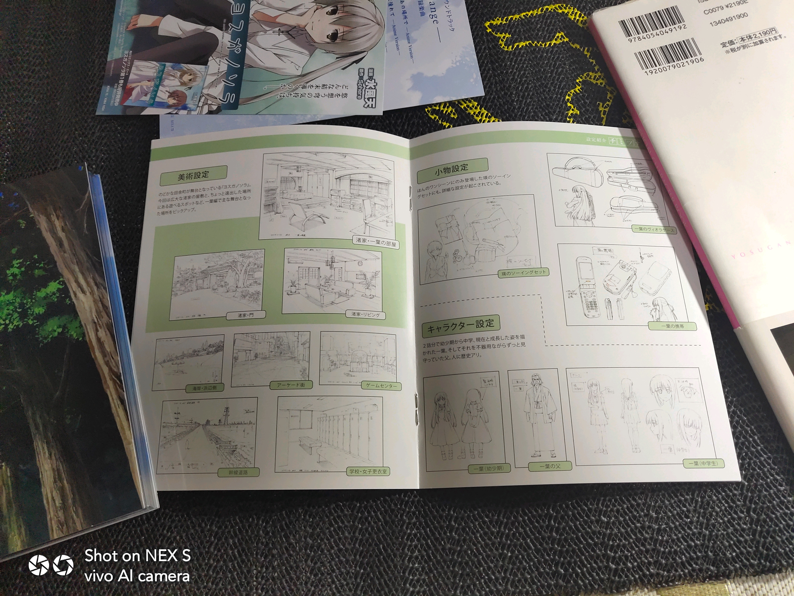
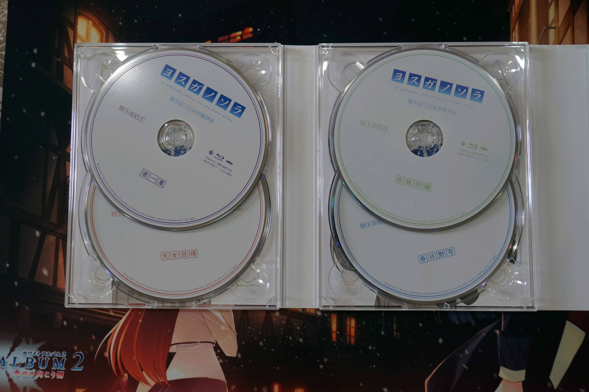
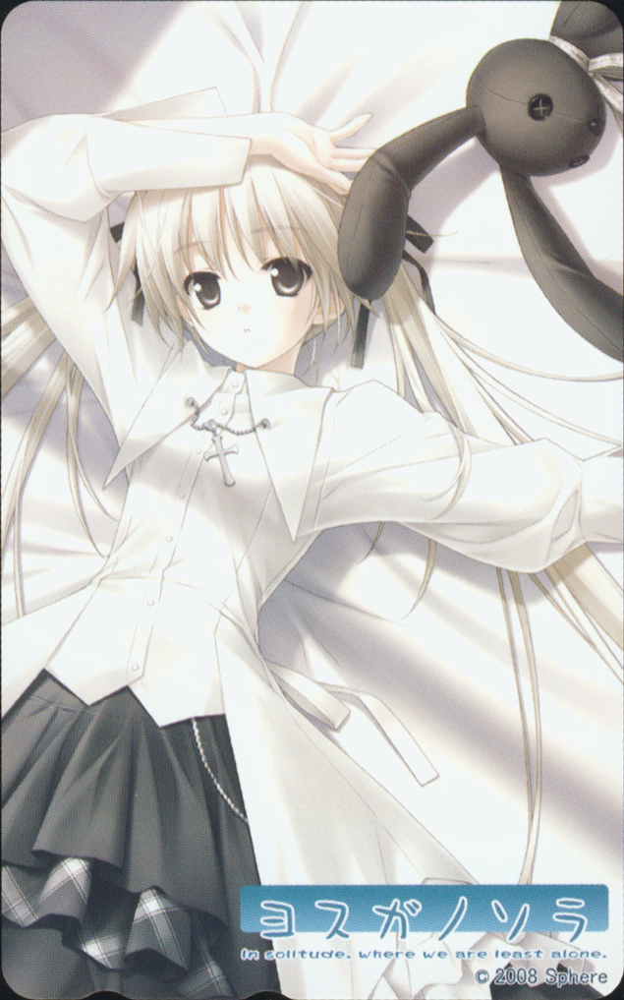
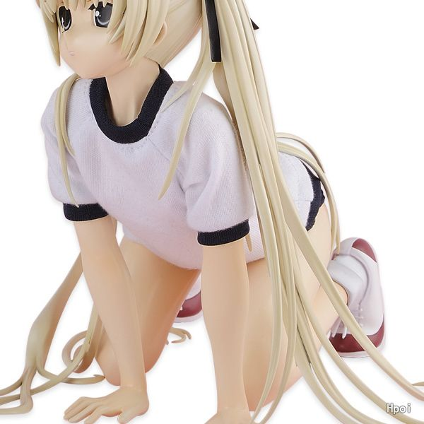
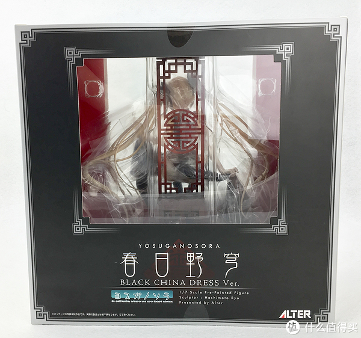
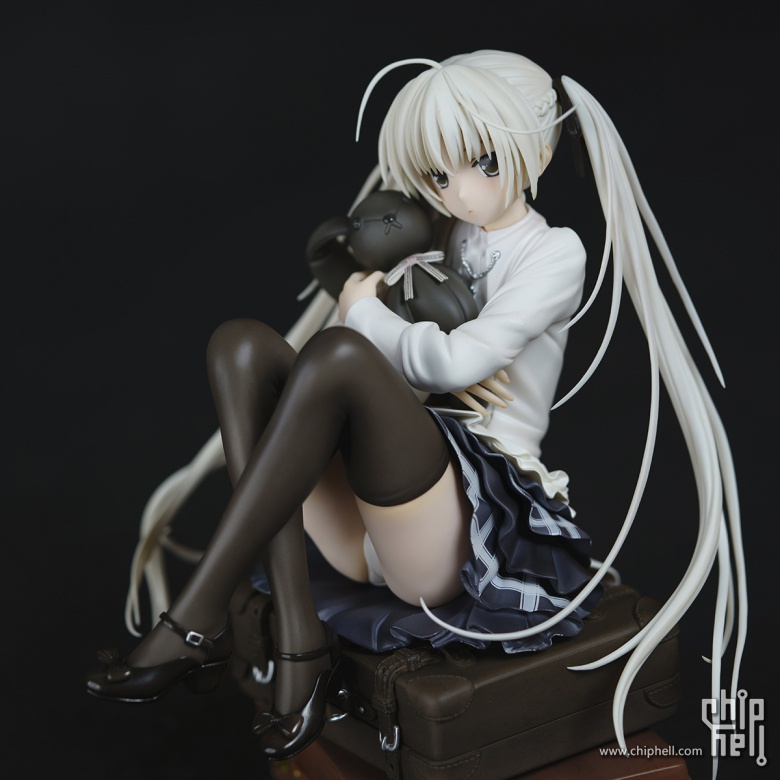
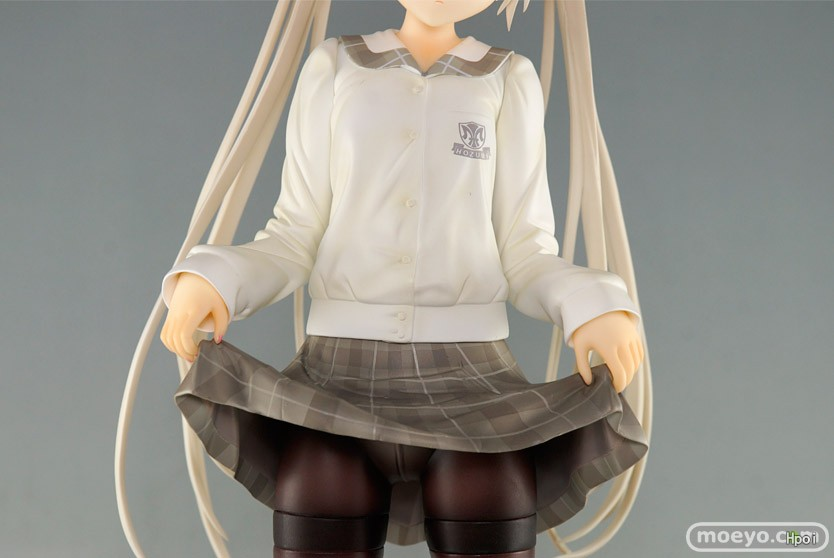

[Prototype]ヨスガノソラ周边补完计划
* * *
伪·科普/晒物贴。  
姑且算个缘吧官方周边贴  
个人最喜欢的这张16年BD/Hi-Res专辑封面以及我的大部分周边合影镇楼。 

  

1楼 | 鳥之穹鳴 | 2019-07-23 21:07
* * *
二楼自留。  
鸣谢大佬@咸鱼肥鸽💯 @安乐冈入川- @Tegami丶null
  

2楼 | 鳥之穹鳴 | 2019-07-23 21:08
* * *
太强了！！！
  

3楼 | Tegami丶null | 2019-07-23 21:09
* * *
科普/晒物贴。  
姑且算个缘吧官方周边贴  
本周边贴会包括本吧@咸鱼肥鸽💯 @Tegami丶null @安乐冈入川- 等（我知道的）周边持有量较多的几个大佬一起发帖，聊以供吧友欣赏以及供想购买周边的吧友了解相关信息和行情。  
———————分割线———————  
众所周知，缘之空这个IP出过Galgame、TV番組动画和本子画师水風天创作的漫画。以下基本以发售/发行的时间顺序介绍，包括出版和内容等详细信息、外实物高清照片欣赏、截至发帖日的行情价格等。  
具体来说，会以游戏、BD、CD、手办、挂画（这里指有B2以上尺寸的全尺寸挂画，小尺寸挂画一般都是限定特典，列为特典类）、各类特典的顺序介绍。现在还没有人做到真正制霸，所以如果有大佬新入了什么周边，我会在楼下补齐。大家也看到我这帖子前面打的prototype标签了，也就是说我在将来估计着周边收的差不多的时候，可能会开一个比较系统完整的帖子。  
最近忙，慢更。
  

4楼 | 鳥之穹鳴 | 2019-07-23 21:09
* * *
1\. galgame:  
缘之空/悠之空初回限定版  
基本信息:缘之空为游戏公司Cuffs子公司（姊妹公司?）Sphere处女作，具体发售时间为2008年12月5日(初回限定版)/2010年10月29日(通常版)。  
悠之空为其续集（准确的说是Fun Disk，外传一样的东西），具体发售时间为2009年9月25日（初回）/2009年10月24日（通常版）。  
两者一起在去年底发售了10周年限定电子版。  
图片如下。楼下放具体拆箱。 

  

8楼 | 鳥之穹鳴 | 2019-07-23 21:22
    
    2020-09-05 21:37 | wps-:
    > 初回限定版和通常版有啥区别？
    2020-09-05 21:46 | 鳥之穹鳴:
    > 回复 wps- :初回盘多一张CD特典，本体游戏文件应该是没区别的
* * *
顶
  

9楼 | 偽夢💤 | 2019-07-23 21:24
* * *
最菜的来了
  

10楼 | 咸鱼肥鸽💯 | 2019-07-23 21:25
    
    2019-07-23 21:28 | 鳥之穹鳴:
    > 别别别你是最大的大佬
* * *
整个吧务组里你是最有钱的了吧

  

13楼 | 🌐網上沖浪 | 2019-07-23 21:37
    
    2019-07-23 21:43 | 鳥之穹鳴:
    > 怎么可能，我只是好几年爆发一次
* * *
六面图。  
那倫·理·协·会的贴纸是认真的吗  
这游戏还能过，还有什么游戏不能过

  

14楼 | 鳥之穹鳴 | 2019-07-23 21:40
* * *
具体内容物。  
说明书/用户手册，用户反馈明信片，本体光盘，同捆特典CD。说明书我就不一张一张照了，以后什么时候有心情了再补吧。  
总之是需要下载一个DirectX来运行。当然国内的那些汉化（其实就是盗版）直接就已经给弄成上手就玩exe格式了

  

15楼 | 鳥之穹鳴 | 2019-07-23 21:43
* * *
本体。是DVD盘。大概一个多G吧。  
还有同捆特典。还算挺好听的。我发的音乐帖里有无损分轨。 

  

16楼 | 鳥之穹鳴 | 2019-07-23 21:47
    
    2019-07-23 21:48 | 鳥之穹鳴:
    > 这是初回限定版，缘之空就这些东西。
* * *

  

17楼 | 有信仰的盗贼😈 | 2019-07-23 21:48
    
    2019-07-23 22:04 | 鳥之穹鳴:
    > 现在的世道是怎么了为什么一发这些东西就会有人发柠檬帖你以为我是很轻松的就能买到这些东西吗我这基本上是透支了十多年所有的零花钱和压岁钱
    2019-07-23 22:18 | 有信仰的盗贼😈:
    > 回复 鳥之穹鳴 :
    2019-07-23 22:29 | 夜寒-酱:
    > 
    2019-08-07 23:51 | 贴吧用户_7CA7G8y:
    > 回复 鳥之穹鳴 :任然不能阻止我酸
    2019-08-10 08:21 | 你不经世的慌º:
    > 我到现在都不知道你们怎么买到的
    2019-08-28 02:54 | 🌀Zero:
    > 同问楼主，这些东西是哪里买到的
* * *
悠之空因为是特典外传一样的东西，看上去比缘之空稍微好点。其实价格反而低。  
以下为六面图。  
仍然是那个无力吐槽的协会

  

18楼 | 鳥之穹鳴 | 2019-07-23 21:51
* * *
内容物。  
也有一章同捆特典CD这张同捆特典CD是各声优唱的自己配音的女性角色的角色歌，还有游戏的op。穹妹的角色歌唱的很好听。  
统一声明，我发的这些所有的CD和BD都在我的音乐贴和资源贴里可以找到。  
用户手册包在本体DVD的盒里（第二张图的就是），由于和缘之空基本是一样的东西，用户手册里面的内容也都是一样的，我就不打开照了。  
不同的是比缘之空多了一个同捆特典兔子布偶。  
兔子布偶是电动的，按压肚子会发出一些穹妹说的语音，一直在一起、最喜欢你什么的。  
尴尬的是由于年代久远，电池报废，声音变得极其诡异，基本上就是丧·尸版的穹妹

  

19楼 | 鳥之穹鳴 | 2019-07-23 22:01
    
    2019-07-27 00:31 | 風華▫恋:
    > 这个某鱼有卖吗，怎么搜
    2019-07-27 00:39 | 鳥之穹鳴:
    > 回复 風華▫恋 :不知道，从来不去某鱼
    2019-07-29 18:40 | 陆沂_:
    > 突然好想听丧尸版穹妹的声音
* * *
今晚先更到这里，明天开始更BD。
  

20楼 | 鳥之穹鳴 | 2019-07-23 22:02
* * *
dd
  

21楼 | 夜寒-酱 | 2019-07-23 22:25
    
    2019-07-23 22:26 | 鳥之穹鳴:
    > 
* * *
dd
  

22楼 | 安乐冈入川- | 2019-07-23 22:32
    
    2019-07-23 22:33 | 鳥之穹鳴:
    > 
    2019-07-23 23:08 | 安乐冈入川-:
    > 回复 鳥之穹鳴 :
* * *
介意我发两楼吗
  

23楼 | 安乐冈入川- | 2019-07-23 22:32
    
    2019-07-23 22:33 | 鳥之穹鳴:
    > 先等等吧，养肥了你再发
    2019-07-23 23:07 | 安乐冈入川-:
    > 回复 鳥之穹鳴 :好
* * *
Dd
  

24楼 | 悠远的苍😘穹 | 2019-07-23 22:34
* * *

  

25楼 | 繁花落尽几时歌 | 2019-07-23 22:42
* * *
对了，说明一下，因为年代过于久远缘之空悠之空初回版都不支持win7及以上系统通常版倒是支持到win10
  

26楼 | 鳥之穹鳴 | 2019-07-23 22:45
    
    2019-07-24 01:06 | 夜寒-酱:
    > 话说初回限定版里面什么内容，手头没有pc看不了
    2019-07-24 12:06 | 夜寒-酱:
    > @鳥之穹鳴 戳
    2019-07-24 12:07 | 鳥之穹鳴:
    > 回复 夜寒-酱 :都是一样的东西，多几个特典而已，应该是
    2019-07-24 12:09 | 夜寒-酱:
    > 回复 鳥之穹鳴 :我说的是贴吧里【叉依姬。。。】里面的那个资源
    2019-07-24 12:11 | 鳥之穹鳴:
    > 回复 夜寒-酱 :那不是真·资源贴，一切以我发的资源贴为准本来都说好的，那吧主看见我迟迟不发先发了一个，还有我发过这个特典，在音乐贴
    2019-07-24 12:12 | 夜寒-酱:
    > 回复 鳥之穹鳴 :好吧
* * *
sdl，awsl
  

27楼 | 缘悠灯ლ | 2019-07-24 00:51
* * *
Sony hires没找到……
  

28楼 | 是春日野穹呀 | 2019-07-24 03:00
    
    2019-07-24 06:55 | 鳥之穹鳴:
    > 安桥坛和mora上面有，Sony的还是比较少
    2019-12-29 23:39 | º恐懼之褲◆◎:
    > mora只有aac。。听不下去
    2019-12-29 23:39 | º恐懼之褲◆◎:
    > 而且只有动漫没有游戏ost
    2019-12-29 23:55 | 鳥之穹鳴:
    > 回复 º恐懼之褲◆◎ :安桥有flac的，AAC确实基本弃用了
* * *
嘤嘤嘤

  

29楼 | 是春日野穹呀 | 2019-07-24 03:04
    
    2019-07-24 07:05 | 鳥之穹鳴:
    > Sony商店就一**去mora和安桥找找，有，我把截图发楼下了
* * *
可以可以
  

30楼 | 水哥是直男 | 2019-07-24 04:13
* * *
安桥和mora都有 

  

31楼 | 鳥之穹鳴 | 2019-07-24 07:05
    
    2019-07-24 07:07 | 鳥之穹鳴:
    > @是春日野穹呀
    2019-07-24 12:38 | 是春日野穹呀:
    > 回复 鳥之穹鳴 :好啦好啦我知道了
* * *
多少钱？
  

32楼 | 路过的空我♬ | 2019-07-24 11:23
    
    2019-07-24 11:45 | 鳥之穹鳴:
    > 能问的再不明确点么
    2019-07-24 11:54 | 路过的空我♬:
    > 回复 鳥之穹鳴 :这里总共多少钱
    2019-07-24 11:57 | 鳥之穹鳴:
    > 回复 路过的空我♬ :至少2w5吧，没统计过
    2019-07-24 12:23 | 路过的空我♬:
    > 回复 鳥之穹鳴 :继续充，不要停。
    2019-07-24 12:24 | 鳥之穹鳴:
    > 回复 路过的空我♬ :基本上神物收完了，该淡坑了
    2019-07-30 01:47 | 羽之爱爱:
    > 回复 鳥之穹鳴 :日元还是人民币
    2019-07-30 07:53 | 鳥之穹鳴:
    > 回复 羽之爱爱 :当然是软妹币，2w5円约合一千五块
* * *
sphere应该算旗下工作室吧？cube和它才是姊妹关系？
  

34楼 | tomlong98 | 2019-07-24 21:20
    
    2019-07-24 21:27 | 鳥之穹鳴:
    > 应该是算子公司吧，关系比较模糊，官方也没说
* * *
本体六面图。  
值得一提的是BD的封面插画仍然是桥本凉画的。 

  

36楼 | 鳥之穹鳴 | 2019-07-24 21:36
    
    2020-12-04 00:02 | 穹妹天下第一🔯:
    > 问一下楼主这一套的价格，想攒钱入一套
* * *
那个还没出的手办，有消息通知一下我。另外，sdl，awsl
  

37楼 | 佛系冰水 | 2019-07-24 21:45
    
    2019-07-24 21:51 | 鳥之穹鳴:
    > 自己去大A官网找啊
    2019-07-24 21:52 | 佛系冰水:
    > 回复 鳥之穹鳴 :伸手党不会啊
* * *
一叶线本体。  
外面的纸盒是瑛线和穹线的，一叶和奈绪没有。  
包括最外面的塑料盒和里面的塑料/纸质光盘盒。光盘盒里面夹了一个小册子。  
光盘一共有两张，分别是BD和CD。一叶线和奈绪线的CD是BGM(其中一叶线的叫“Arrange”,是三輪学作曲的游戏bgm变奏，奈绪线的叫“New”，是Bruno Wen-li做的原创，个人觉得后者更好听，名曲Old Memory、記憶、遠い空へ都属于后者)，瑛线和穹线的CD是四个女主的所谓陪·睡CD。 

  

38楼 | 鳥之穹鳴 | 2019-07-24 21:50
    
    2019-08-01 12:06 | 哇哒西哇_操:
    > 原来我最喜欢的歌不是三轮学做
    2019-09-05 11:59 | 鳥之穹鳴:
    > 回复 哇哒西哇_操 :不好意思，但是确实是这样，游戏原本的BGM做的确实很棒，但是动漫做的游戏BGM变奏实话说不如Bruno做的部分
    2020-02-29 17:33 | 花落相偎ლ:
    > 回复 鳥之穹鳴 :听说动漫的音乐是Bruno Wen-li和三輪学合作的，也不知道准不准确
    2020-02-29 21:53 | 花落相偎ლ:
    > 回复 鳥之穹鳴 :谢谢大佬科普
* * *
小册子主要是人物和线稿作画的设定以及剧情介绍，还有编剧和cv的访谈等等内容。  
里面夹了两张纸，其中一张是漫画的广告，另一张是CD的歌单。 

  

39楼 | 鳥之穹鳴 | 2019-07-24 21:54
* * *
瑛线本体的图。  
包括外层的纸盒，可以包住一叶线和瑛线，还有和一叶线一样的本体，还有一个小同人插画画集。 

  

40楼 | 鳥之穹鳴 | 2019-07-24 21:59
* * *
缘之空的光盘盒都挺有意思的，人物在外面的塑料盒上，背景在里面的纸盒上。瑛线也是一张BD一张添い寝CD。 

  

41楼 | 鳥之穹鳴 | 2019-07-24 22:04
* * *
这一卷的小册子和一叶线的内容也一样。  
这个时候第二卷漫画还没有发售，所以并没有漫画的广告，只有CD的歌单。 

  

42楼 | 鳥之穹鳴 | 2019-07-24 22:06
* * *
附赠的小画集。  
有插画的原图和画师的个人网站。因为年代久远，有些老画师的个人网站(比如cuteg大神)已经登不上去了。  
哪怕是我也不能找齐这里面的所有电子版原图。  
不得不说这插画的质量是真™低，一群杂修，能看的屈指可数照的这两张是选的比较能看的

  

43楼 | 鳥之穹鳴 | 2019-07-24 22:11
* * *
奈绪线本体。  
也是和一叶线一样的东西。  
这张CD里面真的全是神曲，Old Memory、記憶、遠い空へ都在这张里面。 

  

44楼 | 鳥之穹鳴 | 2019-07-24 22:18
* * *
dd
  

45楼 | 安乐冈入川- | 2019-07-24 22:20
* * *
小册子，和前两卷也都是一样的东西。  
区别就是我需要打🐴了

  

46楼 | 鳥之穹鳴 | 2019-07-24 22:21
* * *
最终到了大家喜欢的穹线。  
穹线外面包的纸盒有两层，里层可以包着奈绪线和穹线，外层包着瑛线纸盒和里层，这样就可以把四卷套在一起了。  
数量限定生产版带一个GIFT出品的布偶。  
我的布偶的塑料袋可能保存条件不好，碰一下就碎了

  

47楼 | 鳥之穹鳴 | 2019-07-24 22:28
* * *
美到爆炸的光盘盒和小册子。  
忍不住附上原图。 

  

49楼 | 鳥之穹鳴 | 2019-07-24 22:36
* * *
小册子具体内容。  
人物和线稿场景等作画设定和剧情设定。  
世界上最可爱的妹妹和世界上最宠妹妹的哥哥。 

  

51楼 | 鳥之穹鳴 | 2019-07-24 22:43
* * *
数量限定生产版还附送了一个布偶，就是下图这个黑裙。  
精细程度还算可以。脑门顶上既有本体呆毛也有钥匙环可以挂在书包上。  
和我的白洋服布偶合个影。 

  

53楼 | 鳥之穹鳴 | 2019-07-24 22:49
    
    2019-07-31 08:37 | 安乐冈入川-:
    > 你要是把白洋服挂着书包上你是真的厉害
    2019-07-31 08:38 | 鳥之穹鳴:
    > 回复 安乐冈入川- :反正我现在有两个
    2019-07-31 17:29 | 安乐冈入川-:
    > 回复 鳥之穹鳴 :gck给我挂一个
* * *
以上就是数量限定生产版的本体部分。  
下面开始更全卷购入特典。
  

54楼 | 鳥之穹鳴 | 2019-07-24 22:50
* * *
全卷购入特典一共有九个，我买到了五个，现在手头有四个，分别是:  
animate限定全卷特典:穹妹半身抱枕(这个我有原图，不过明显不能发)  
toranoana限定全卷特典:特大画布(两米三)  
Getchu限定全卷特典电话卡  
Sofmap限定特典电话卡  
这两张电话卡可以在日本的公用电话亭(11区的公用电话亭远比天朝的发达)打出50个单位时长的电话。当然我肯定是不会去打的，因为好像每打一次就要打一个孔  
现在单买基本上每个都得小一千吧。BD的灵魂就在特典哪怕是刚发售的，带特典和不带特典的价格都能差出将近一倍。  
今晚先更到这里。 

  

55楼 | 鳥之穹鳴 | 2019-07-24 23:23
    
    2021-02-19 23:38 | 宇智波叔:
    > 楼主抱枕原图能发我一份吗
* * *
接下来是16年发售的初回限定版。  
feel.在2016年再版了一次缘之空BD，被称为初回限定BD Box.  
虽然叫box可是我觉得数量限定生产版更应该叫box吧  
一起发售的还有电子版的Hires OST合集。  
楼下放详细图。 

  

56楼 | 鳥之穹鳴 | 2019-07-25 10:57
* * *
盒子大图。  
鸣谢大佬@咸鱼肥鸽💯 ，图是他的，我的初限得明后天到。  
纸质内容有一本版权绘画集，一本小册子还有特典CD歌单。  
七张盘，四张BD三张CD，BD应该和数量限定生产版一样。我还没扫盘。  
这版的特典CD有三张，其中两张是和11年版一叶和奈绪线CD一样的bgm，还有一张是四个女主的添い寝CD。  
这版的添い寝和11年版的不一样，是新配的。  
其中穹妹的是陪悠哥洗·澡哦

  

57楼 | 鳥之穹鳴 | 2019-07-25 11:07
    
    2019-08-01 12:22 | 哇哒西哇_操:
    > 我似乎看到了东马
* * *
盒子、光盘大图。  
小册子和海报大图。  
小册子包括各种图，其中有11年的全卷特典的图。  
还有一张是cosplay来着？  
海报就是封面。 

  

58楼 | 鳥之穹鳴 | 2019-07-25 11:14
    
    2019-07-25 15:38 | 咸鱼肥鸽💯:
    > 补充：那个小册子是圣地巡游的cos嗷，虽然啥都看不清就是了。要是有兴趣我可以扫。
    2019-07-25 15:40 | 鳥之穹鳴:
    > 回复 咸鱼肥鸽💯 :谢谢大佬我得明后天就到了，就不麻烦你了我来吧
* * *
最近是真没钱了
  

60楼 | 安乐冈入川- | 2019-07-25 11:28
* * *

  

62楼 | 鳥之穹鳴 | 2019-07-25 15:04
* * *
数量限定生产版BD的全卷特典一共有九个，我买了五个，现在有四个，分别为:(不好意思老是有辣🐔删我贴，电子版原图就不放了)  
Animate特典半身抱枕，非常漂亮  
Toranoana特大画布(两米三)  
Getchu特典电话卡(右边)  
Sofmap特典电话卡(左边)  
两张电话卡可以在11区公用电话亭(11区公用电话系统远比我们完善，他们总会固执于一些我们早不用的东西，比如电话亭、光盘、翻盖手机)打五十个单位长度的电话(好像包括国际电话)不过我肯定是不会用的，因为好像每打一次要在电话卡上打一个孔

  

63楼 | 鳥之穹鳴 | 2019-07-25 15:06
* * *
aaaaaaaaawsl
  

64楼 | 夜寒-酱 | 2019-07-25 15:44
    
    2019-07-25 15:45 | 鳥之穹鳴:
    > 不要总是我们这几个氵怪自娱自乐嘛
    2019-07-25 15:47 | 夜寒-酱:
    > 回复 鳥之穹鳴 :真的羡慕但是贫穷限制了我的脚步
* * *
我就等开更特典了，电话卡真的头疼，收不完的唉。
  

65楼 | 咸鱼肥鸽💯 | 2019-07-25 17:06
    
    2019-07-25 17:16 | 鳥之穹鳴:
    > 不如说想收完这种想法本身就是不太可能实现的
* * *
暖暖
  

66楼 | 梦梦samaლ | 2019-07-25 17:16
* * *
捧场
  

67楼 | 梦梦samaლ | 2019-07-25 17:16
    
    2019-07-25 17:16 | 鳥之穹鳴:
    > 谢谢
    2019-07-25 17:20 | 梦梦samaლ:
    > 回复 鳥之穹鳴 :希望可以看到更多你这样精品内容的贴子
    2019-07-25 17:23 | 鳥之穹鳴:
    > 回复 梦梦samaლ :那就好了
    2019-07-25 17:23 | 鳥之穹鳴:
    > 回复 梦梦samaლ :我将来肯定是要放一大波这样的帖子的
* * *
给大佬递茶
  

68楼 | 寒天凉秋 | 2019-07-25 23:38
* * *
萌新，我就看看
  

69楼 | 吃辣条的笨女孩 | 2019-07-26 11:23
* * *
大佬是什么时候开始收集这些的呀，收了多久了
  

70楼 | 穹妹天下第一🌸 | 2019-07-26 13:43
    
    2019-07-26 14:04 | 鳥之穹鳴:
    > 一年多前
* * *
明后天我初限BDCD就到了到时候更新吧
  

71楼 | 鳥之穹鳴 | 2019-07-26 14:05
* * *
暖
  

72楼 | 夜寒-酱 | 2019-07-26 14:06
* * *

  

73楼 | wyt407680725 | 2019-07-26 14:07
* * *
dd
  

74楼 | 安乐冈入川- | 2019-07-26 15:15
* * *
哇
  

76楼 | ♀圣光♂ | 2019-07-27 12:58
* * *
顶
  

77楼 | 守护她的笑容🌂 | 2019-07-27 13:12
* * *
dd
  

78楼 | 哦一样兔儿童 | 2019-07-27 16:42
* * *
dd
  

79楼 | 妖魔夜行♬ | 2019-07-28 01:52
* * *
dd
  

80楼 | 玖玖玖玖玖玖- | 2019-07-28 10:41
* * *
预告  
初限bd和messe特典终于到了，晚上继续开更 

  

81楼 | 鳥之穹鳴 | 2019-07-28 12:21
* * *
不好意思，刚才摸鱼去看bl之海了  
补一张我刚到的初限BD box的图。  
由于大佬@咸鱼肥鸽💯 拆照了我就不拆了。  
下面更CD(包括特典CD)。  
你鳥鸽鸽骗过你吗

  

82楼 | 鳥之穹鳴 | 2019-07-28 20:51
* * *
以下按发售顺序介绍。  
3.1.C74限定galgame 主題歌  
专辑名:PCゲーム ヨスガノソラ 主題歌「道の先、空の向こう」  
艺术家: Rita  
作曲: 三輪学  
厂牌: Sphere  
作词: 綾菓  
编曲: 三輪学  
别名: PCゲーム ヨスガノソラ 主題歌  
版本特性: Maxi, Single  
发售日期: 2008-08-15 (C74)  
价格: ￥（这是日元） 1,200  
播放时长: 19 分  
录音: Sphere  
碟片数量: 1  
专辑图片:见下  
galgame开局音乐和每条线推完放的音乐。还凑合，个人觉得不如Old Memory、比翼の羽根、遠い空へ等等动漫版的顶级音乐。  
很多缘之空的音乐已经缘之空的动漫都有一个奇怪的特性，听完以后会陷入一种莫名的惆怅，好像世界只剩下自己一个人的那种感觉 这首歌就是其中比较明显的。  
很多吧友看完明明是he的缘之空却自闭了，很大一部分原因是音乐比较悲 。  
由于是C74限定，不大好买，不过还行，能买到。正常CD价格吧，两三百。(以下价格介绍不经过特殊说明均指全新未拆)  
入手方式:某宝，某鱼，日拍(日亚好像也没有，哪怕有也不是官方直营)。 

  

83楼 | 鳥之穹鳴 | 2019-07-28 21:00
* * *
我接下来要说的东西就是神物了，你们千万不要害怕  
3.2ヨスガノソラ游戏盘初回限定版messe购入特典:Original Drama 「叉依姫神社祭り」  
这特典是一个广播剧，也就是说只有声音没有画面的内容。具体内容我没仔细听，大致就是类似于gal的一段情节吧。顾名思义就好了。  
购入信息:这玩意儿是真的难搞，加上我手里这张在过去的一两年里我只见到过两张。(我这张还是全新未拆哦)  
入手方式:蹲日拍。某宝某鱼估计看不见了，日亚常年无货。  
要是你想收的话真遇到了就不要计较价钱了，秒收就是。 

  

84楼 | 鳥之穹鳴 | 2019-07-28 21:10
    
    2019-07-28 21:13 | 安乐冈入川-:
    > 8000日币
    2019-07-28 21:16 | 鳥之穹鳴:
    > 回复 安乐冈入川- :8000円是小事，关键是有价无市，你能买到就烧高香了
    2019-07-28 21:20 | 安乐冈入川-:
    > 回复 鳥之穹鳴 :当初太磨叽了 也没想到你买的那是最后一份
    2019-07-31 22:14 | 鳥之穹鳴:
    > @3014zz
* * *
dd
  

85楼 | 安乐冈入川- | 2019-07-28 21:14
* * *
dd
  

86楼 | 安乐冈入川- | 2019-07-28 21:14
* * *
另一张特典:  
3.3ヨスガノソラ 初回限定版 Sofmap特典 ボイスドラマ 「秘密のリゾート遊び」  
上面那个忘了说，这个和上面那个一样，因为都是初回gal附送的特典，所以和游戏发售的时间一样，都是08年12月5日。  
这个也是广播剧，有声音没画面儿的。  
不过这个比刚才的存世量大的多，也好买，可能是因为Sofmap比messe销量更大吧。  
大概也是两三百块的样子。  
盘面是一张版权绘，出过床单，镇楼里有。  
入手方式:某宝某鱼日拍(不记得日亚有没有了) 

  

87楼 | 鳥之穹鳴 | 2019-07-28 21:15
* * *
3.4:08年galgame初回限定版同捆特典  
专辑名:ヨスガノソラ Game Image CD 「君、繋ぐ空。」  
艺术家: Rita  
作曲: 折倉俊則  
厂牌: Sphere  
作词: コツキミヤ  
编曲: 折倉俊則  
别名: ヨスガノソラ IMAGE CD  
版本特性: Maxi  
发售日期: 2008-12-05  
播放时长: 17 分  
录音: Sphere  
碟片数量:1  
专辑封面:见下  
初回限定同捆特典。没什么好说的。音乐很安静。不如说几乎所有缘之空的音乐都很安静。  
买初限galgame就附带在盒子里，当然也有单卖的。  
入手方式:单卖的比较少，所以一般是和galgame一起卖，相关信息就和gal一样。 

  

88楼 | 鳥之穹鳴 | 2019-07-28 21:23
* * *
3.5.09年galgame OST  
专辑名:ヨスガノソラ Game OST「ヨスガノソラ SOUND TRACK CD」  
艺术家: Rita  
作曲: 三輪学  
厂牌: Sphere  
作词: 綾菓  
录音: Sphere  
作詞: 綾菓  
发行商: Sphere  
版本特性: OST  
发售日期: 2009-02-27  
价格: 2,625(税込)  
碟片数量: 1  
专辑与CD封面：见下  
不愧是单张最贵的缘之空光盘，装帧也很精美，里面好像还送了一些别的纸片  
购入信息:这个和messe那个特典恰恰相反，那个是虽然不是很贵，但是有价无市，这个是虽然好买，但是现在贼™贵，我几个月前买的700多一张全新   
缘之空无论是动漫还是gal出名的原因，除了题材硬核、穹妹人设讨喜、画作精良之外，主要就是这些神级音乐了。在galgame音乐里算相当优秀的。 

  

89楼 | 鳥之穹鳴 | 2019-07-28 21:32
    
    2019-12-29 23:46 | º恐懼之褲◆◎:
    > 请问大佬这张除了闲鱼还有哪里能买到!!!闲鱼全网只剩两张了!
    2019-12-29 23:56 | 鳥之穹鳴:
    > 回复 º恐懼之褲◆◎ :emmmm你要的话我可以把我的出给你
    2019-12-29 23:57 | 鳥之穹鳴:
    > 回复 º恐懼之褲◆◎ :再就是雅虎拍卖和日亚了
    2019-12-30 07:06 | º恐懼之褲◆◎:
    > 我先试着收闲鱼上的吧，不行再试试日亚这是我见到过最难买的ost了
* * *
接下来是重头戏。  
3.6.悠之空予约特典，穹妹陪睡CD  
专辑名:ハルカナソラ 春日野穹 ピロートークCD (予約特典)「ソイネノソラ」（英文名"sleep is the best pleasure"）  
因为是予约特典，所以应该发售的比悠之空要早，但是我不知道具体是什么时候发售的。  
cv:白波遥，也就是田口宏子阿姨(配gal的声优因为各种原因往往不会用真名，起个马甲作化名)  
专辑与实物图如下  
这是发售的第一张陪·睡特典，内容很足，整整27分钟。内容大概是穹妹晚上睡不着，去找悠哥一起睡   
需要强调的一点是尽管穹妹平时叫悠『小悠』（ハル，悠的名字是ハルカ），但是她确实是叫过悠『哥哥』（お兄ちゃん）的，只有一次，就在这张CD里，在七分十九秒     
购买的话这张不算太稀有，不过因为是予约特典所以也不太好买，某宝日亚应该有，我300买的 

  

90楼 | 鳥之穹鳴 | 2019-07-28 21:42
* * *
3.7.悠之空初回限定同捆特典CD  
专辑名:ハルカナソラ Game Char (初回限定版特典)「ハルカナソラ オリジナルキャラクターソング集」  
音乐家:Duca、田口宏子（穹妹cv）、冈嶋纱（初佳cv）、小野凉子（一叶cv）、阪田佳代（瑛cv）  
发行时间:09年9月25日  
专辑封面、实物图见下  
内含田口阿姨以穹妹身份唱的唯一一首歌。  
话说田口宏子唱歌是真好听，无论是本CD中以偏萌系的声音唱的歌还是16年陪洗澡特典里哼歌的颤音都非常好听。 

  

91楼 | 鳥之穹鳴 | 2019-07-28 21:49
* * *
游戏相关的CD就这么多。  
今晚收工，明天更。
  

92楼 | 鳥之穹鳴 | 2019-07-28 21:50
* * *
dd
  

93楼 | 安乐冈入川- | 2019-07-29 17:06
* * *
问下大佬，那个，穹妹抱枕哪里买
  

95楼 | 玖玖玖玖玖玖- | 2019-07-31 06:02
    
    2019-07-31 07:33 | 鳥之穹鳴:
    > 下面会说到。某宝日亚日拍都行。我有一个出的你要不要
    2019-07-31 07:57 | 玖玖玖玖玖玖-:
    > 现在有点穷，为了一双鞋已经吃土2个月了
    2019-07-31 08:32 | 鳥之穹鳴:
    > 回复 玖玖玖玖玖玖- :……你买的是北卡还是稀有色椰子……
    2019-07-31 09:03 | 玖玖玖玖玖玖-:
    > AJ芝加哥
* * *
楼主强!
  

96楼 | Ast茅rix | 2019-07-31 08:01
* * *
真爱大佬 顶一下  
马上要上大学了 然后开始攒钱 看现在还能不能收一些官方周边
  

97楼 | 永远的悠穹º | 2019-07-31 14:57
* * *
进来找手办
  

98楼 | 贴吧用户_0y33WW7 | 2019-08-02 00:43
    
    2019-08-02 01:14 | 鳥之穹鳴:
    > 手办还没发
* * *
好久没上贴吧都忘了来帮顶了祝早日收齐~
  

99楼 | Reigen | 2019-08-05 22:54
    
    2019-08-05 23:28 | 鳥之穹鳴:
    > 大佬本体！
* * *
不好意思，前几天一开始是空调吹多了肚子疼，躺在床上躺了两天，然后我又去做那个资源贴了，这几天一直没更，从明天开始继续更
  

100楼 | 鳥之穹鳴 | 2019-08-09 22:47
* * *
淼
  

101楼 | 没有她的世界◎ | 2019-08-10 01:32
* * *
继续更，开坑动漫CD的介绍  
3.8.TV版OP  
专辑名:TＶアニメ「ヨスガノソラ」オープニングテーマ 「比翼の羽根」  
艺术家: eufonius  
作曲: 菊地創  
厂牌: キングレコード  
作词: riya  
录音: キングレコード  
编曲: 菊地創  
别名: TVアニメ「ヨスガノソラ」OP  
版本特性: Single, Maxi  
发售日期: 2010-10-27  
价格: ￥ 1,200  
播放时长: 19 分  
碟片数量: 1  
专辑封面、实物图如下  
自 古 肉 番 出 神 曲定律在缘之空这部番上得到了完美的诠释，几乎每首都是精品  
eufonius是我最喜欢的歌手（所有音乐范围），本专辑主打的op比翼の羽根是被无数B站up作为BGM、无数人作为铃声的神曲，值得一听  
购买的话，这张是普通的CD，发行量大，日 亚官方就有，价格也低，直接买爆就行

  

103楼 | 鳥之穹鳴 | 2019-08-10 21:31
* * *
3.9.动漫番組挿入歌（主线放完初佳线之前的音乐）  
专辑名:ＴＶアニメ「ヨスガノソラ」番組挿入歌『ツナグキズナ』  
艺术家: Team.ねこかん【猫】feat.天乙准花  
作曲: nyanyannya  
厂牌: キングレコード  
作词: nyanyannya、天乙准花  
录音: キングレコード  
编曲: nyanyannya  
别名: TVアニメ「ヨスガノソラ」挿入歌  
版本特性: Single / Maxi  
发售日期: 2010-10-27  
价格: ￥ 1,200  
发行商: キングレコード  
CD扫图见下  
挺好听的，没什么需要特别说的  
最近听的歌里面最令我触动的就是第一首歌里的那一句“你脆弱的像易碎的玻璃，我终究是无能为力”  
话说动漫的配图是真的美  
没有op名气没那么大，存世量也不大，所以比「比翼の羽根」稍微难买一点，价格倒贵不了太多。 

  

104楼 | 鳥之穹鳴 | 2019-08-10 21:35
* * *
3.10.动漫ED「ピンキージョーンズ」（初佳线放完后的音乐）  
专辑名:ヨスガノソラ ED「ピンキージョーンズ」  
艺术家: ももいろクローバー、ももいろクローバーZ  
作曲: 前山田健一、NARASAKI  
厂牌: キングレコード  
作词: 前山田健一、村野直球  
录音: キングレコード  
编曲: NARASAKI、前山田健一  
别名: Pinky Jones  
版本特性: Single / CD+DVD / Limited Edition / Maxi  
发售日期: 2010-11-10  
价格: ￥ 1,700  
播放时长: 25 分  
碟片数量: 1  
发行商: キングレコード  
各版本专辑封面依次见下  
这张专辑有四个版本，ABC三个版本的初回盘和一张通常盘，大佬当然是要集齐的啦 我暂时还没有收齐，高考完太忙了。  
图片依次见下  
初回盘好像带DVD特典  
有点聒噪，和莫名其妙剧情、莫名其妙Q版画风、四处透露经费不足气息的初佳线气氛倒是挺配，不过配着高桥丈夫神本兼利画的唯美中透露着瑟 琴的插画听着莫名带感

  

106楼 | 鳥之穹鳴 | 2019-08-10 21:40
* * *
3.11.2016年KIXA-90677 初回限定版Blu-ray BOX封入特典  
专辑名:ヨスガノソラ Blu-ray BOX(初回限定版)特典 シチュエーションドラマ CD「イチャイチャノソラ」  
艺术家: 田口宏子，いのくちゆか，阪田佳代，小野凉子  
厂牌: キングレコード  
版本特性: CD  
发售日期: 2016/9/21  
价格: ￥ 22000＋税  
专辑封面就一张白盘，带的版本信息、曲目名称之类  
最新的一张添い寝CD(也就是所谓的陪 睡 c d)，穹妹的那个是陪 洗 澡CD  ，强烈推荐，穹妹边洗澡边哼歌超好听的   
像这种动漫刚放送完出一版BD Box,n年以后再出一个所谓“初回限定版”BD倒也是业界常有操作，比如某二网管也是如此  
封入特典还包括11年BD中的那两张OST，内容完全一样，这里不作赘述  
这版BD现在日亚官方还有售而且经常特价，折算成软妹币有时候特价1k都不到(不包括运费)，相比没有货源价格逐渐走高的数量限定生产版BD实惠的多，也是买爆就好啦

  

107楼 | 鳥之穹鳴 | 2019-08-10 21:45
* * *
全部的音乐资源我都已经发在资源帖里了，明后天也会开一个专门的音乐帖，大家去白剽就好了  
渣设备纪念一下 

  

109楼 | 鳥之穹鳴 | 2019-08-10 21:56
    
    2019-12-29 23:50 | º恐懼之褲◆◎:
    > n5005＋哥套好评
    2019-12-29 23:57 | 鳥之穹鳴:
    > 回复 º恐懼之褲◆◎ :老哥好眼力
    2019-12-29 23:58 | 鳥之穹鳴:
    > 回复 º恐懼之褲◆◎ :不过不是哥套哦，当时是原配的套，不过现在换新版哥套了
    2019-12-30 07:24 | º恐懼之褲◆◎:
    > 中间绿的的确像中号哥套
* * *
漫画出版信息:  
本作改编自Sphere同名galgame『ヨスガノソラ』，作者是著名本子画师水风天。  
两卷单行本由株式会社KADOKAWA出版发行，分别于2010年5月21日和12月21日发售。  
繁体中文版译著两册由台 湾KADOKAWA于次年九月24发行。 

  

110楼 | 鳥之穹鳴 | 2019-08-10 21:58
* * *
日版。 

  

111楼 | 鳥之穹鳴 | 2019-08-10 22:00
* * *
繁体中文版。  
小知识:按照一般惯例，只有首刷(日本和使用繁体的地区习惯将第一版第一次印刷称为首刷)才可能有书腰，也就是包在书皮外面的那一小条儿，首刷不一定有书腰，有书腰的几乎肯定是首刷。  
我买的这两本是初版二刷，但是上册仍然有书腰，不知为什么。  
我不知道下册首刷有没有书腰，因为我目前在全网见过的五套中文版(加上我这套)都不是首刷。  
话说果然是物以稀为贵，中文版的发售量比较少，而且又不是那种收藏价值非常高的，一般买来之后不会特别珍惜，也不会卖，所以导致现在市面上的流通量极少，价格也往往高的吓人。我刚才说的那五套里面，有一套是某宝大佬在台 湾翻旧书店是无意中发现的，在发给我的半路被海关扣下了  
剩下的四套，包括我这套，全都只是大佬在晒，不出  
所以中文缘之空漫画也算是神物了，能搞到这个也算是够厉害的了

  

112楼 | 鳥之穹鳴 | 2019-08-10 22:09
* * *
大佬的天穹缘从哪入的
  

115楼 | 妖魔夜行♬ | 2019-08-15 11:49
    
    2019-08-15 11:52 | 鳥之穹鳴:
    > 忘了
    2019-08-15 14:15 | wps-:
    > 闲鱼上还有一本，260
* * *

  

116楼 | 剑447上 | 2019-08-15 14:27
* * *
dl快更手办
  

117楼 | 零碎的你º | 2019-08-20 16:53
    
    2019-08-20 17:52 | 鳥之穹鳴:
    > 军训呢，累死了看看吧
* * *
支持一下
  

118楼 | 風与天空- | 2019-08-23 16:13
* * *
楼主这些周边你都是从哪里买的啊
  

119楼 | 風与天空- | 2019-08-23 16:14
    
    2019-08-23 17:44 | 鳥之穹鳴:
    > 各种地方，想制霸就得路子宽
    2019-08-23 17:55 | 風与天空-:
    > 回复 鳥之穹鳴 :阔以阔以
* * *
加起来花了多少钱
  

120楼 | 蓝色的兔耳朵 | 2019-08-23 16:23
* * *
军训贼™累 我们学校可能是非军校最地狱难度的军训了 昨天刚20公里拉练   
这楼前几天删了，今天重发一次  
开更手办  
我忘了照我的合影，而且我也没收齐手办，只收了睡衣、体操服、会场限定箱穹这些神物。  
图片鸣谢大佬@Tegami丶null 的收藏  
为防吞，做的彩色幻影坦克。  
而且原图做的幻影坦克太大发不了原图，只能改成低清晰度

  

124楼 | 鳥之穹鳴 | 2019-08-26 20:44
* * *
pwp我来啦w
  

125楼 | Tegami丶null | 2019-08-26 20:45
* * *
dd🐮🍺
  

126楼 | 安乐冈入川▫ | 2019-08-31 18:14
    
    2019-08-31 20:39 | 鳥之穹鳴:
    > 真惨啊
    2019-09-01 15:03 | 安乐冈入川▫:
    > 回复 鳥之穹鳴 :
* * *
所以大佬，有CD的图吗？我要让朋友帮忙带
  

127楼 | 苏雨尘♬ | 2019-09-03 08:35
    
    2019-09-03 11:12 | 鳥之穹鳴:
    > 请你先看完帖子再问。我都发了
* * *
所以大佬，一万能全部入手吗？
  

128楼 | 苏雨尘♬ | 2019-09-06 10:08
    
    2019-09-06 10:11 | 鳥之穹鳴:
    > 再加两万都不一定
* * *
失踪人口回归  
我都快忘了我还有帖子没更新了  
其实是我们学校军训太累了  
开始更手办
  

129楼 | 鳥之穹鳴 | 2019-09-07 12:05
* * *
以下按照出荷的顺序介绍。我只收了那几个神物，部分图片鸣谢大佬@Tegami丶null   
1.ヨスガノソラ 春日野穹  
常用称呼:睡衣/衬衫Ver./大妈穹  
出荷时定价:7,800日元 （523元）发售日:2009年4月1日比例:1/8制作:taki-co  
系列:キャストオフフィギュア  
原型:絵里子  
原画应该是桥本凉画那张图  
值得一提的是缘之空几乎所有的手办都不是动漫的手办，而是游戏的手办。  
介绍:让人幻灭的一款手办明明桥本凉大神画的原图那么好看 官方放出的图就很丑，实物出荷之后发现更丑（正是因为丑所以有人叫她大妈穹 ），还有站不住等诸多问题   
更蛋痛的是由于他很丑，所以销量很低，如果你现在想制霸的话，这款很难买   
唯一还可圈可点的地方是可 脱，而且no bra，但是也做的不好。  
为了防止和谐，下面的图片很多都会使用幻影坦克。  
购入信息:存世量很少。  
蹲日拍吧。  
淘宝偶尔会有。  
大概拆过封的不大到两千，未拆的很难遇到，差不多3000左右吧。  
大多数都会出油，这是老物的通病  
雪梨纸就想都不要想了。老物一般不会有这些东西的。  
部分官图和原图见下。  
没🐴的百度不让我发全我也没办法。
  

133楼 | 鳥之穹鳴 | 2019-09-07 12:35
    
    2019-11-25 07:18 | sora◆◆:
    > 是真的丑的一匹
* * *
官图＆照片。我的是未拆就不拆开照片了。 

  

136楼 | 鳥之穹鳴 | 2019-09-07 12:59
    
    2019-10-28 23:59 | 永远的悠穹º:
    > 这脸要不是看到说是官方的话 我可能都觉得是淘宝盗版
* * *
少见……有原图吗？😂
  

137楼 | 天女目☜ | 2019-09-07 17:14
    
    2019-09-07 17:27 | 鳥之穹鳴:
    > 我发了好几次，没🐴的百度不让我发
    2019-09-07 17:59 | 天女目☜:
    > 能否私一下😂😂😂
    2019-09-07 19:59 | 鳥之穹鳴:
    > 回复 天女目☜ :放在楼下了
* * *
原图。桥本凉绘。  
只能幻影坦克

  

140楼 | 鳥之穹鳴 | 2019-09-07 19:20
    
    2019-09-08 00:33 | 天女目☜:
    > 谢谢了，感觉马了一下😂
    2019-09-08 00:56 | 鳥之穹鳴:
    > 回复 天女目☜ :老哥你不会用幻影坦克吗点开看啊
* * *
谢谢楼主了。
  

142楼 | 天女目☜ | 2019-09-08 06:51
* * *
@悠远的苍穹🔯 来这里看一下，有你想找的东西
  

143楼 | 鳥之穹鳴 | 2019-09-11 18:16
* * *
马克
  

144楼 | -神乐º | 2019-09-12 17:15
* * *
……已经是第二次吞了
  

145楼 | 鳥之穹鳴 | 2019-09-13 13:14
* * *
我鳥之穹鳴回来辣！
  

146楼 | 鳥之穹鳴 | 2019-10-26 19:32
* * *
2.ヨスガノソラ 春日野穹 4:1 体操服ver.  
厂商FREEing  
出荷2011年4月  
当年价格14,800日元  
当年官图做的不怎么样，然后很少有人预定，但是出荷之后意外的好看，又因为一开始买的人少，于是价格就上来了  
很大。  
质量还可以，做工不如最强的大A这个没办法。  
可 脱。可以脱成只有下着。  
FREEing的手办可玩性都比较高，基本都是4:1可 脱，而且这个社的手办穿的黑丝全都是真的布制黑丝，不是路人女主手办那种涂的颜色。  
应该是目前价格最高的穹妹手办(虽然卖的人不少)，大妈穹虽然极少见但是也不会比这个贵。比较常见的价格是大概全新未拆要3k左右。 

  

147楼 | 鳥之穹鳴 | 2019-10-26 19:54
* * *
官图 

  

148楼 | 鳥之穹鳴 | 2019-10-26 19:59
* * *
实物图 

  

149楼 | 鳥之穹鳴 | 2019-10-26 20:30
* * *
脱 掉之后的状态  
鸣谢大佬@Tegami丶null ，照片里这只穹妹是他的，楼上那个是我的。 

  

150楼 | 鳥之穹鳴 | 2019-10-26 20:35
* * *
还把衣服给……
  

151楼 | 天女目☜ | 2019-10-27 10:55
* * *
最近天还那么冷😂
  

152楼 | 天女目☜ | 2019-10-27 10:55
    
    2019-10-27 11:18 | 鳥之穹鳴:
    > 这图今年夏天照的
* * *
值得一提的是，体操服穹是唯一的动漫缘之空手办。可以看到盒子上的标是动漫的标。 

  

153楼 | 鳥之穹鳴 | 2019-10-27 22:17
    
    2019-10-27 22:17 | 鳥之穹鳴:
    > 其他的都是游戏手办。
* * *
3.水着穹/泳装穹  
官方名：BrilliantStage 缘之空 春日野穹  
厂商MegaHouse  
出荷2011年5月23日  
价格6,800日元  
脸比较丑。  
不过话说本来原图就不太行。  
兔子做的还行，脸不太好。  
做工比起前两个算是强了点，这价位算可以的了。但还是跟两个A社有差距。 

  

156楼 | 鳥之穹鳴 | 2019-10-27 22:29
* * *
原图。  
我收回刚才的话，原图很好看，是手办厂的锅   
没妈的度娘不让发原图，整成了幻影坦克。 

  

160楼 | 鳥之穹鳴 | 2019-10-28 08:00
* * *
4.死库水穹  
名称：4・Leaves 缘之空 春日野穹－死库水－  
厂商：寿屋  
出荷：2011年9月15日  
价格：6,800日元  
寿屋产，做工比大A差点，不过还可以。  
某宝500左右。  
图片来自某宝，侵删。 

  

166楼 | 鳥之穹鳴 | 2019-10-28 20:18
* * *
tql
  

174楼 | ey口香糖º | 2019-10-28 23:25
* * *
这贴我不是记得被删了吗?复活了?
  

175楼 | 永远的悠穹º | 2019-10-28 23:57
    
    2019-10-29 01:35 | 鳥之穹鳴:
    > 是我采取了保护措施而已
    2019-10-29 10:43 | 永远的悠穹º:
    > 回复 鳥之穹鳴 :好之前就收藏了 后来发现被删除了 昨天突然发现恢复了这种精品贴可不能没了
* * *
对缘之空够执着
  

176楼 | 第二虚空◆ | 2019-11-06 21:54
* * *
手办某宝慢慢有收的 只是那个bd op 游戏 挂画 真的是每天都去看下某猫通贩 生怕没了不知道去哪里搞
  

177楼 | jsjdjsjdiea | 2019-11-09 00:26
    
    2019-11-09 01:23 | 鳥之穹鳴:
    > 硬货某猫不往外放的，你看见的都是某几个大佬剩下的
    2019-11-09 10:18 | jsjdjsjdiea:
    > 回复 鳥之穹鳴 :大佬们太顶了
    2019-11-11 00:44 | jsjdjsjdiea:
    > 回复 鳥之穹鳴 :刚才去问了 看上的一个图集没货了 太*了
    2019-11-11 00:45 | 鳥之穹鳴:
    > 回复 jsjdjsjdiea :所以说嘛我们不一样
    2019-11-11 00:45 | 鳥之穹鳴:
    > 回复 jsjdjsjdiea :其实我最近也没买，没去他家
    2019-11-11 00:46 | jsjdjsjdiea:
    > 回复 鳥之穹鳴 :我们不一样 我是小萌新
    2019-11-11 00:46 | jsjdjsjdiea:
    > 回复 鳥之穹鳴 :也不会操作日亚
* * *
这么一照上色还不错。 

  

182楼 | 鳥之穹鳴 | 2019-11-20 10:35
    
    2019-11-26 12:14 | 鳥之穹鳴:
    > 出处见水印，侵删
* * *
以上都是偏旧的手办。  
接下来大A要来砸场子了
  

185楼 | 鳥之穹鳴 | 2019-11-20 10:39
* * *
首先是洋服ver.  
手办信息：  
名称：缘之空 春日野穹  
厂商：Alter  
出荷：2011年11月11日/2014年9月10日再版  
价格：7800日元/8,800日元（再版）  
现日亚约1.1k，某宝便宜，七八百吧 

  

186楼 | 鳥之穹鳴 | 2019-11-20 10:54
* * *
大A早期作品。  
和现在的手办比差不少，上色和闹着玩似的  
有两个头可以换，散发和双马尾。 

  

187楼 | 鳥之穹鳴 | 2019-11-20 10:57
* * *
详细信息：  
比例:1/8  
制作:Alter  
原型:乙山法純  
需要注意的是再版和初版本体没有区别，只是纸盒换成了塑料盒  
个人觉得塑料盒好看一点。  
图为初版盒子。 

  

191楼 | 鳥之穹鳴 | 2019-11-20 11:09
    
    2020-04-09 23:23 | 糖梨培根:
    > 这个好像也是动漫版的吧大佬？（上上上…楼 楼主说哪一款是唯一一款的吧）
    2020-04-09 23:58 | 鳥之穹鳴:
    > 回复 糖梨培根 :不说我还真忘了，这个也是
* * *
再版塑料盒。  
我见过一些大佬为了同时看两个头而初版再版一样买一个的

  

193楼 | 鳥之穹鳴 | 2019-11-20 11:12
* * *
h p o i上大佬照的美图。 

  

195楼 | 鳥之穹鳴 | 2019-11-20 11:14
* * *
再丑的手办，也可以通过相机和修图拯救何况这个不算丑 

  

200楼 | 鳥之穹鳴 | 2019-11-20 11:31
* * *
雪中穹妹 

  

201楼 | 鳥之穹鳴 | 2019-11-20 11:31
* * *
喜欢二手手办的人会被鄙视吗？
  

202楼 | 天女目☜ | 2019-11-20 11:59
    
    2019-11-20 13:02 | Welkin◎:
    > 不一定，你老婆被人用过你不嫌弃没人管你，不过你要是想贪便宜（尤其是如果因为贪便宜被坑了）的话就不一定了
    2019-11-20 14:49 | 天女目☜:
    > 回复 Welkin◎ :我不单单是喜欢便宜，是既便宜又高质量的😂
    2019-11-20 14:52 | 鳥之穹鳴:
    > 回复 天女目☜ :那你想吧不知道是不是你，我上个月刚遇到一个和你一样的人想捡漏，然后被坑的很惨
* * *
兔穹gkd
  

203楼 | 🌿骨科先锋🍁 | 2019-11-20 12:19
* * *
以上，都是比较旧的手办。  
接下来的几只，才真正把穹妹推上了手办界质量和知名度的第一梯队。  
每一只都是经典。  
每一只都是精品。  
晚上开更，我上课去。 

  

204楼 | 鳥之穹鳴 | 2019-11-20 12:37
    
    2019-11-21 23:29 | 永远的悠穹º:
    > 最上面那个我好像两个多月前看到的预售消息 不了解手办这行 不知道好久发售
    2019-11-21 23:40 | 鳥之穹鳴:
    > 回复 永远的悠穹º :一般都得一年多
    2019-11-21 23:42 | 鳥之穹鳴:
    > 回复 永远的悠穹º :我不看好那个，之前的十一个穹妹手办，只要没有桥本凉的原画的，哪怕是大A的，都不好，这个也没有原画，只有铃平广之前随便画的一张非缘之空画和它差不多
    2019-11-21 23:44 | 鳥之穹鳴:
    > 回复 永远的悠穹º :啊不好意思我看错了以为你说的是最新的那个相反这个endinver就是我最喜欢得了，桥本凉画的最好的一张穹妹的原画，穹妹最漂亮的一套洋服，又是大A还是1/6，白模细节满满，肯定质量高
    2019-11-22 00:27 | 永远的悠穹º:
    > 回复 鳥之穹鳴 :穹妹配上这套衣服是真的好看也是我最喜欢的一个 准备现在开始存钱了 等待发售的那天 估计得上千
* * *
大佬也上hpoi啊
  

205楼 | 倾生一世只为你 | 2019-11-20 17:06
    
    2019-11-20 17:12 | 鳥之穹鳴:
    > 当然不，只是去捞几张图hpoi上面也没什么信息嘛
    2019-11-20 17:23 | 倾生一世只为你:
    > 回复 鳥之穹鳴 :之前在hpoi上捞了好多洋服穹的手办图
* * *
6.白旗袍穹  
名称:ヨスガノソラ 春日野穹 チャイナドレス（china dress的片假名）Ver.  
中文名:缘之空 春日野穹 旗袍Ver.  
属性:女 、比例人形 、全年龄  
定价:13,800日元 （925元）  
发售日:2014年11月20日  
比例:1/7  
制作:Alter  
原型:桥本凉（洋服不好看可能就是因为没人画原画，随便做的）  
涂装:彩部一路  
我心目中手办排前五。大A造型和做工水平的完美诠释。 

  

206楼 | 鳥之穹鳴 | 2019-11-21 23:20
* * *
官图。  
有一说一，椅子塑料感有点强，这是缺点 

  

207楼 | 鳥之穹鳴 | 2019-11-21 23:24
* * *
我自己的旗袍穹。 

  

209楼 | 鳥之穹鳴 | 2019-11-21 23:36
* * *
脸部细节 

  

210楼 | 鳥之穹鳴 | 2019-11-21 23:37
    
    2019-11-21 23:39 | 鳥之穹鳴:
    > 头部发丝细节就可以看出和体操服的差距了。
* * *
飘逸的发丝细节  
桥本凉本来就画的很好看，加上大A，穹妹手办的头发绝对是最好看的 

  

211楼 | 鳥之穹鳴 | 2019-11-22 00:25
* * *
美图 

  

215楼 | 鳥之穹鳴 | 2019-11-22 00:28
* * *
楼主请问正品手办哪里有卖
  

220楼 | sora◆◆ | 2019-11-22 00:36
    
    2019-11-22 00:38 | 鳥之穹鳴:
    > 以你现在的问题分析你买手办的能力，去淘宝吧估计日亚什么的你搞不了
    2019-11-22 00:43 | sora◆◆:
    > 回复 鳥之穹鳴 :淘宝太假啦。
    2019-11-22 07:43 | 鳥之穹鳴:
    > 回复 sora◆◆ :你非得看那些一百来块钱的我也没办法价格比较正常的一般都是真的。
* * *
壁纸 

  

221楼 | 鳥之穹鳴 | 2019-11-22 00:38
* * *

  

222楼 | 鳥之穹鳴 | 2019-11-22 00:42
* * *
外盒。出处见水印。  
当时我爸不清楚情况把内盒扔了，害的我这个盒控只能买了重新买一个

  

223楼 | 鳥之穹鳴 | 2019-11-22 13:38
    
    2019-11-22 13:39 | 鳥之穹鳴:
    > 打错，卖了重新买一个
* * *
脸部细节  
表情略微妙，眼神略呆滞，比小A箱穹怪怪的，因为原画就怪怪的…… 

  

225楼 | 鳥之穹鳴 | 2019-11-22 13:44
* * *
据说这是当时的官图  
那么，在哪里可以买到这脸部色彩滤镜呢 

  

226楼 | 鳥之穹鳴 | 2019-11-22 13:46
* * *
更多细节  
再一次盛赞这完美的发丝造型。 

  

227楼 | 鳥之穹鳴 | 2019-11-22 14:01
* * *
大佬啥时候更新呢
  

228楼 | sora◆◆ | 2019-11-26 07:59
    
    2019-11-26 08:03 | 鳥之穹鳴:
    > 等我今天肝玩作业
    2019-11-26 10:01 | sora◆◆:
    > 回复 鳥之穹鳴 :看来大学轻松都是哄人的，tui，我们也是一大堆作业，感觉活的跟高中一样。
    2019-11-26 10:17 | 鳥之穹鳴:
    > 回复 sora◆◆ :不不不是我上个周太浪了周末又要去参观😅大学基本上还是轻松啦，除非你报经管之类的秃头系
    2019-11-26 10:26 | sora◆◆:
    > 回复 鳥之穹鳴 :唉，你知道学工科的痛苦吗，经管相对已经算好了，我学的又是电子科学，我们下学期就要开始准备康王了。
    2019-11-26 10:30 | sora◆◆:
    > 回复 鳥之穹鳴 :团建吧？我们团建是去海边
    2019-11-26 11:30 | 鳥之穹鳴:
    > 回复 sora◆◆ :我就工科啊
    2019-11-26 15:34 | sora◆◆:
    > 回复 鳥之穹鳴 :家里蹲+浪=学霸
    2019-11-26 15:55 | 鳥之穹鳴:
    > 回复 sora◆◆ :我就是浪大了才现在这么菜，真就是校强我渣，我要是稍微不那么浪我可能高二就进了北大的预科班了
    2019-11-26 15:58 | 鳥之穹鳴:
    > 回复 sora◆◆ :而且我说的经管那种系累，并不是说他学业重，我不怕这个，毕竟报的肯定是自己喜欢的专业，学的多数是自己喜欢的东西，而是说乱七八糟的破事比较多，比如说作业必须要提前交上，英语语文之类的课还必须要跟老师搞好关系之类的,一股子铜臭，一股子社会习气
    2019-11-26 15:59 | 鳥之穹鳴:
    > 回复 sora◆◆ :我有同学在经管，以上都是他亲自告诉我的
    2019-11-26 17:28 | 夜寒-酱:
    > 回复 鳥之穹鳴 :今晚更新？坐等
    2019-11-26 18:22 | sora◆◆:
    > 回复 鳥之穹鳴 :哎，毕竟这世上处处都有恶心的，原来以为大学里能真的学到自己喜欢的，结果真的一进来就破事多，各种什么乱七八糟的讲座还必须到场呢，很多压根就跟没啥鸟用。
    2019-11-26 18:22 | sora◆◆:
    > 回复 鳥之穹鳴 :我以前也听说过清华，北大里官僚气息种的很，两所学校还互怼呢，真是太复杂啦现在这社会。
    2019-11-26 18:51 | 鳥之穹鳴:
    > 回复 sora◆◆ :清华还好，至少我们这些为国贡献的工科系不会整那些花里胡哨的东西，北大好像稍微更重一点；还有互黑这个事是真的恶心,随便开一个什么级部的或者是学校的会，主持人总得互黑一下，无论是调侃还是互黑，恶不恶心啊？我经常就想把桌子掀了
    2019-11-26 18:52 | 鳥之穹鳴:
    > 回复 sora◆◆ :我念的这个系还算是比较实干的，我们平时很少开那些没什么鸟用的会议
    2019-11-26 20:47 | sora◆◆:
    > 回复 鳥之穹鳴 :就是这样，黑来黑去不知黑啥呢，都是顶级高校啦。
    2019-11-26 20:47 | sora◆◆:
    > 回复 鳥之穹鳴 :坐等lz更新
    2019-11-26 22:48 | 天女目☜:
    > 上次在B站看的清华北大学生做的调研报告，吓得我瑟瑟发抖😂
* * *
7.缘之空 春日野穹 黑色旗袍Ver.  
名称:ヨスガノソラ 春日野穹 黒チャイナドレスVer.  
中文名:缘之空 春日野穹 黑色旗袍Ver.  
属性:女 、比例人形 、全年龄  
定价:13,800日元 （925元）  
发售:2016/5/31 , ￥13,800  
2015/3/12 , ￥13,800  
比例:1/7  
制作:Alter  
原型:桥本凉  
涂装:彩部一路  
就是白旗袍的异色版，一开始好像还是某处的限定。  
各方面和白旗袍都完全一样，颜色更加神秘一点。 

  

232楼 | 鳥之穹鳴 | 2019-11-27 21:04
    
    2019-11-28 11:01 | sora◆◆:
    > 我个人觉得没白旗袍好看
    2019-11-28 11:04 | 鳥之穹鳴:
    > 回复 sora◆◆ :我觉得差不多吧
    2019-11-28 13:45 | sora◆◆:
    > 回复 鳥之穹鳴 :可能是拍出来色差的原因吧
* * *
官图 

  

233楼 | 鳥之穹鳴 | 2019-11-27 21:05
* * *
盒、说明书  
出处见水印，侵删 

  

234楼 | 鳥之穹鳴 | 2019-11-27 21:07
* * *
椅子细节图  
我当时没注意自己的那个倒是，不过据说椅子还有磁性，可以牢牢把穹妹的菊花吸在上面  
留的那两个坑简直了

  

235楼 | 鳥之穹鳴 | 2019-11-27 21:10
* * *
多面图 

  

236楼 | 鳥之穹鳴 | 2019-11-27 21:11
* * *
细节  
仍然是迷之表情 

  

237楼 | 鳥之穹鳴 | 2019-11-27 21:11
* * *
旗袍细节  
黑白旗袍上的龙纹都非常完美  
是五爪龙，不过说穹妹是妹控之王也不过分

  

238楼 | 鳥之穹鳴 | 2019-11-27 21:13
* * *
更多细节  
可能是灯光问题，这样看的话黑旗袍穹发色上的不是很自然 

  

239楼 | 鳥之穹鳴 | 2019-11-27 21:14
* * *

  

240楼 | 按R重新装弹 | 2019-11-28 13:58
* * *
小a也要进入战场了   
接下来是另一个质量极高的手办，箱穹  
名称:ヨスガノソラ 春日野穹  
中文名:缘之空 春日野穹  
属性:女 、比例人形 、全年龄  
定价:12,800日元 （858元）  
发售日:2016年10月5日  
比例:1/7  
制作:Alphamax  
原型:MOON  
原画:桥本隆  
忘了说，现在的价格的话，从白旗袍开始的这几个手办基本保持了原价，波动在±150块钱差不多。 

  

251楼 | 鳥之穹鳴 | 2019-12-01 11:00
* * *
值得一提的是这只穹妹有两版，一个是普通版，一个是会场限定。我的当然是会限    
以下是普通版盒子照片。 

  

252楼 | 鳥之穹鳴 | 2019-12-01 11:01
* * *
我的会场限定版的图片  
多了一个会场限定的贴纸  
本体当然都是一样的，会限版多了一张小海报，一张明信片，一张透明的塑料卡片吧，大概，记不清了 没舍得拆箱，当时是某猫大佬告诉我的 

  

253楼 | 鳥之穹鳴 | 2019-12-01 11:02
* * *
特典都贴在盒子上面，这是我照的细节图 

  

254楼 | 鳥之穹鳴 | 2019-12-01 11:04
* * *
官图  
这版头发细节稍微比大A逊色一点，上色偏淡 

  

263楼 | 鳥之穹鳴 | 2019-12-01 11:26
* * *

  

264楼 | 鳥之穹鳴 | 2019-12-01 11:26
* * *
原图 

  

267楼 | 鳥之穹鳴 | 2019-12-01 11:31
* * *
chiphell上一个列文虎克大佬的图。  
原帖链接[https://www.chiphell.com/thread-1630396-1-1.html](http://tieba.baidu.com/mo/q/checkurl?url=https%3A%2F%2Fwww.chiphell.com%2Fthread-1630396-1-1.html&meta=1&urlrefer=1edff99b1309acd2f9d9174e54f54294)

  

269楼 | 鳥之穹鳴 | 2019-12-01 11:38
* * *
各角度 

  

270楼 | 鳥之穹鳴 | 2019-12-01 11:40
* * *
各角度 

  

271楼 | 鳥之穹鳴 | 2019-12-01 11:42
* * *
后面 

  

272楼 | 鳥之穹鳴 | 2019-12-01 11:45
    
    2019-12-01 18:20 | sora◆◆:
    > 爱了，爱了
* * *
腿控福利

  

277楼 | 鳥之穹鳴 | 2019-12-01 12:00
* * *
腿 控 福 利

  

279楼 | 鳥之穹鳴 | 2019-12-01 12:06
* * *
指南贴啊，好多没收到。  
某猫那里有些东西也不齐，还是得看缘分蹲
  

282楼 | 思时♬叶鬼 | 2019-12-01 14:00
* * *
lz现在在白天要复习考试和补觉，晚上七开galgame，帖子断更 等我放假再说

  

283楼 | 鳥之穹鳴 | 2019-12-12 22:05
* * *
想问问dalao穹妹有没有出过吧唧立牌色纸生写什么的游戏原画的柄都太好看了我好想拥有……
  

284楼 | 买谷吃土 | 2019-12-19 01:38
* * *
dd
  

286楼 | 鳥之穹鳴 | 2019-12-29 19:10
* * *
支持一波我就差衬衣穹了，收不到

  

287楼 | 贰三3三♂ | 2019-12-29 23:11
    
    2019-12-29 23:12 | 鳥之穹鳴:
    > 淘宝那家还有一只哦，喜欢的话可以私聊一下
    2019-12-29 23:17 | 贰三3三♂:
    > 回复 鳥之穹鳴 : 话说我能借你一些图吗_(:з」∠)_我想写个专栏，但我有些东西在国内所以没法拍照
    2019-12-29 23:23 | 贰三3三♂:
    > 回复 鳥之穹鳴 :而且我淘宝搜出来那家也没货了_(:з」∠)_
    2019-12-29 23:28 | 鳥之穹鳴:
    > 回复 贰三3三♂ :有货，你搜的不是那一家
    2019-12-29 23:29 | 鳥之穹鳴:
    > 回复 贰三3三♂ :借哪张？手办图的话有些我也是转载，都注明出处了你自己去找找吧，我自己照的图用之前告诉我一声就行
    2019-12-29 23:30 | 鳥之穹鳴:
    > 回复 贰三3三♂ :顺便告诉我网址我去围观
    2019-12-29 23:31 | 鳥之穹鳴:
    > 回复 贰三3三♂ :有货的那一家暂时被整改了，可能得过几天上架，你要是想要元旦后私信我吧
    2019-12-29 23:50 | 贰三3三♂:
    > 回复 鳥之穹鳴 :okok
* * *
都快把这帖忘了，明天开更
  

288楼 | 鳥之穹鳴 | 2020-01-13 20:30
* * *
大佬 请问悠之空哪里可以买到呀 好想要那个小兔子
  

289楼 | 养一只Ray | 2020-01-15 00:09
    
    2020-01-15 00:53 | 养一只Ray:
    > 才看见33楼！方便私信一下店铺嘛 谢谢
    2020-01-15 14:16 | 鳥之穹鳴:
    > 回复 养一只Ray :发了
    2020-01-15 14:18 | 养一只Ray:
    > 回复 鳥之穹鳴 :看见啦 谢谢
* * *
下一个手办比较质量相当高，但是比较色气，估计发出来也会被吞，我就少发点儿吧  
9.兔女郎穹妹  
名称:ヨスガノソラ 春日野穹 - Bunny Style  
中文名:缘之空 春日野穹 兔女郎  
属性:女 、比例人形 、全年龄  
定价:13,800日元 （896元）  
发售日:2017年4月27日  
比例:1/7  
制作:Alter  
原型:桥本凉  
角色:春日野穹  
依然是大A，质量也相当高，非常完美地还原了原图的色气  
发丝依然是那么飘逸，说起来兔女郎装的双马尾好像不太多的样子 

  

290楼 | 鳥之穹鳴 | 2020-01-15 18:41
* * *
官图 

  

291楼 | 鳥之穹鳴 | 2020-01-15 19:17
* * *
原图  
惊了，居然能发出去

  

292楼 | 鳥之穹鳴 | 2020-01-15 19:26
* * *
我买的还没到货，就借某手办网站大佬的图吧  
一垃圾佬拍的  
看得出来身材比例把握的相当色气

  

293楼 | 鳥之穹鳴 | 2020-01-15 19:28
* * *
身体各处细节。  
有一说一，黑丝上的不算非常好 

  

295楼 | 鳥之穹鳴 | 2020-01-15 19:34
* * *
脸部细节  
这只的表情比之前的自然了不少 

  

296楼 | 鳥之穹鳴 | 2020-01-15 19:37
* * *
蝴蝶结细节 

  

297楼 | 鳥之穹鳴 | 2020-01-15 19:37
* * *
再上两张渲染的很好的美图  
今晚收工

  

298楼 | 鳥之穹鳴 | 2020-01-15 19:39
* * *
各角度官图。 

  

302楼 | 鳥之穹鳴 | 2020-02-20 21:48
* * *
脸部细节。  
个人的感觉，小A出的手段一般上色都偏浅，所以有时候上的腮红可能不是很自然。 

  

304楼 | 鳥之穹鳴 | 2020-02-20 21:55
* * *
画师原图。这图应该是比手办出名，因为在手手办出的几年之前就已经出过挂画。  
又到了喜闻乐见的吞楼环节😅  
改个幻影坦克发吧 

  

306楼 | 鳥之穹鳴 | 2020-02-20 22:08
* * *
衣服细节。  
消光和上色做的都很好。 

  

307楼 | 鳥之穹鳴 | 2020-02-20 22:12
* * *
绅士细节  
值得一提的是裙子是可拆的，不过我认为厂商可能不是有意为之，只是方便组装或者运输而已，毕竟腰部也莫名其妙的上上了裤袜的颜色  
有一说一我个人一直认为手办的黑丝/裤袜是个老大难，很容易做不好，无论是gsc的路人女主那种上色的方法还是freeing的直接布制黑丝都是。二者各有特点吧 

  

308楼 | 鳥之穹鳴 | 2020-02-20 22:15
    
    2020-02-20 22:21 | 远空之忆◎:
    > 这么绅士的嘛
* * *
挽尊  
快来水，快来水@远空之忆◎ @🌐網上沖浪 @恨穹不是妹😂 @集原美- @醉小楼😡 @穹滴RBQ✨ @世界即我穹º @倾生一世只为你 @咕噜灵波✨ @我心悠我 @经验加3💦告辞 @Tegami丶null
  

309楼 | 鳥之穹鳴 | 2020-02-20 22:18
    
    2020-02-20 22:20 | 鳥之穹鳴:
    > @安乐冈入川-
    2020-02-20 22:20 | 远空之忆◎:
    > 应召前来
* * *
顶
  

310楼 | 远空之忆◎ | 2020-02-20 22:21
* * *
11.和服穹  
名称:ヨスガノソラ 春日野穹 着物ver.  
中文名:缘之空 春日野穹 和服ver.  
属性:女 、比例人形 、全年龄  
定价:16,800日元 （1051元）  
发售日:2019年8月27日  
比例:1/7  
制作:Alphamax  
原型:MOON  
原画:桥本隆  
去年（还是前年来着）刚出荷。  
质量也算是可以。 

  

311楼 | 鳥之穹鳴 | 2020-02-20 22:23
    
    2020-02-23 14:35 | 恨穹不是妹😂:
    > 这款我有，嘻嘻
* * *
不得不提的是，这只手办在发售前后产生了两件非常恶劣的事件，至少是添堵的事件。  
一件事就是极其极其泛滥的盗版（撞车？）。  
之前穹妹的“国产”手办也很泛滥，尤其是旗袍穹，但是可能之前没有哪个穹妹手办像这个手办这样泛滥。  
这事还有点儿说道，因为这手办的原画发行也比手办早很长一段时间，手办其实是鸽了两年左右才宣布坐实，而早在官方手办发售前一年多，国内就有很多以妹盟和漫趣两家淘宝店为首的厂商做出了几乎完全一样的手办，也就是所谓的“和风穹语”。  
这两家店声称根据国内某画师的画做的，所以与其说盗版，更应该说是撞车，但是由于实在与和服穹过于雷同，再加上小A的这个手办鸽了很长时间，所以我相信她们分去了大量用户。  
不讨论那位画师到底有没有参（抄）考（袭）桥本凉的原画，问题是这手办没有经过sphere授权，用的椅子的建模也是照搬旗袍穹，其制作用心程度也可想而知。  
我倒不是无脑黑国产手办，但是我真的认为要是想做就正儿八经用点心，最好再申请一下人家官方的授权，最起码最起码最起码不要画的这么撞车，避避嫌，别™自己粗制滥造的出来圈钱。  
国产手办和兵人又不是没有好的，比如说四大名著角色那些，还有斗罗大陆的那个手办也算凑合。  
嘛，没办法，毕竟现在国人这方面意识普遍不高。 

  

312楼 | 鳥之穹鳴 | 2020-02-20 22:41
    
    2020-02-23 14:39 | 恨穹不是妹😂:
    > 从来不买祖国版本，从买第一个手办就开始有这个意识的我！有钱人的生活就是怎么无聊且枯燥
* * *
第二件事就是带节奏，就是很多人带节奏说这是悠哥的手办。  
这事其实也是有一点儿历史渊源的，一开始的“悠哥”是说的最早的那个洋服alter，那是大A早期作品，质量不是很高，脸部做的也确实不是很好，所以叫成悠哥也就算了，我真的不知道这个手办这么好看，为什么还有人说是悠哥？  
当然我知道B站和贴吧这些地方基本上就是带节奏的在引领舆论，我也一般都是自己买周边不混手办圈，有谁混手这圈子了解这事究竟是怎么起来的希望还是给我解释一下。
  

313楼 | 鳥之穹鳴 | 2020-02-20 22:44
* * *
手办什么的大家基本都每款人手一个吧，更着没意思，今晚把出过的手办全都发出来，明天开始正儿八经的翻翻我那些收藏   
下来的这个是我最喜欢的穹妹手办，也是我最喜欢的手办，简直就是有生之年啊   
ヨスガノソラ 春日野 穹 Ending Ver.  
12.中文名:缘之空 春日野穹 Ending Ver.  
属性:女 、比例人形 、全年龄 、可脱  
定价:20,800日元 （1301元）  
发售日:2020年12月  
比例:1/6  
制作:Alter  
原型:苍炎的人形师  
涂装:渡边恭大  
这个手办采用的原图应该就是2016年初回限定版BD封面的原图（就在前几天sphere还刚出了这张图的挂画），也就是镇楼图，我最喜欢的一张图。  
值得一提的是这个手办是6:1。  
目前还没发售，不过大A社的质量肯定是有保证的，B站应该仍然开着预定，买爆就是

  

319楼 | 鳥之穹鳴 | 2020-02-20 22:54
    
    2020-02-23 14:37 | 恨穹不是妹😂:
    > 再买吃骨灰盒了
* * *
各角度。  
因为还没发售，所以只有官图。 

  

320楼 | 鳥之穹鳴 | 2020-02-20 22:56
* * *
细节 

  

321楼 | 鳥之穹鳴 | 2020-02-20 22:56
    
    2020-02-23 14:35 | 恨穹不是妹😂:
    > 这是最新的
* * *
白模。  
白模看着好像更有视觉冲击力？ 

  

322楼 | 鳥之穹鳴 | 2020-02-20 22:57
* * *
这就是大佬吧
  

324楼 | 唯爱春日野穹♂ | 2020-02-20 22:59
* * *
手办就这么多，以后开始更各种色纸画集挂画等等等等的特典。
  

327楼 | 鳥之穹鳴 | 2020-02-20 23:22
    
    2020-04-06 09:00 | 思时♬叶鬼:
    > 没更了吗
* * *
第二张图带走了以后可以撑一撑门面
  

328楼 | 远空之忆◎ | 2020-02-20 23:31
    
    2020-02-21 00:01 | 鳥之穹鳴:
    > 我的周边怎么撑你的门面？
* * *
真正的dalao
  

329楼 | 🌐網上沖浪 | 2020-02-21 10:21
* * *
来啊来啦
  

330楼 | 恨穹不是妹😂 | 2020-02-23 14:34
* * *
我的兔女郎呢alter的
  

331楼 | 恨穹不是妹😂 | 2020-02-23 14:36
    
    2020-02-23 15:19 | 鳥之穹鳴:
    > 楼上不是有吗？
* * *
dd
  

332楼 | 祖🌟梦 | 2020-02-23 16:21
    
    2020-02-23 16:22 | 祖🌟梦:
    > dalao能私 发一下某 宝那家店吗？
    2020-02-23 21:17 | 鳥之穹鳴:
    > 回复 祖🌟梦 :店名萌猫通贩
    2020-02-23 23:04 | 祖🌟梦:
    > 回复 鳥之穹鳴 :跪谢
* * *
dd
  

333楼 | 醉小楼😡 | 2020-02-23 23:49
* * *
dd
  

334楼 | 妖魔夜行♬ | 2020-02-24 23:50
* * *
这个手办b站有，好像是1199来着，看这价格就直接打扰了再过几个月再考虑
  

336楼 | 不懂你在路上 | 2020-02-25 21:36
    
    2020-02-25 21:40 | 鳥之穹鳴:
    > 1200块钱的手办不能算贵了，大哥两三千的也不是没有
    2020-02-25 21:43 | 不懂你在路上:
    > 回复 鳥之穹鳴 :那些就想想就好了，我家不开矿，1500已经封顶，除非真的质量爆炸，有这么多钱，多补点其他周边他不香吗
* * *
停更了吗
  

337楼 | Bad橙子😳 | 2020-03-10 20:16
    
    2020-03-11 00:03 | 鳥之穹鳴:
    > 最近补作业来着，周末续上
* * *
顶一下，超喜欢那个白色洋服Ending的穹妹，但是还是想吃现（笑）
  

338楼 | 沐修0v0 | 2020-04-11 12:12
* * *
我的箱穹眼鼻之间有一小块黑了，好吧我就是强迫症了
  

339楼 | 贴吧用户_7Za78E8 | 2020-05-03 18:35
* * *
不更了吗？最近打算收挂画，以前的周边贴没了
  

340楼 | wps- | 2020-09-13 16:48
* * *

  

341楼 | sora♬◎ | 2021-02-18 23:29
* * *

  

342楼 | 蒙牛没我牛💧 | 2021-02-19 18:19
* * *
不愧是你
  

343楼 | 单推春日野穹🌻 | 2021-02-20 00:05
* * *
继续更新  
东西在家，回去两个假期都给忘了照照片，就鸽了一年
  

344楼 | 鳥之穹鳴 | 2021-03-01 19:31
* * *
记得去年一开始更完手办想继续介绍挂画的，不过现在想想反正形制都一样，那个画又大多数发不出来，而且@咸鱼肥鸽💯 大佬也发过很多帖子介绍，把现在这些乱七八糟的别的周边发完了看看简单介绍下吧
  

345楼 | 鳥之穹鳴 | 2021-03-01 19:35
* * *
所谓周边其实是一个很大的概念，动漫相关产品都算周边，按萌娘百科的定义，按用途可以分为可以日用的软周边（卡包、水杯、电话卡、文具等等，甚至我记得hiten有一次CM出过无线充电器）和纯拿来看的硬周边（挂画、手办等等），按版本可以分为初回版、异色版、典藏版、通常版……等等等等不一而足。
  

346楼 | 鳥之穹鳴 | 2021-03-01 19:47
* * *
搞快点gkd
  

347楼 | 蒙牛没我牛💧 | 2021-03-01 19:48
* * *
不过呢，在缘之空的周边这个范围内，我个人收周边的计划更多是按照来源收的，比如sphere（现在是cuffs）每年两次的通贩卖的挂画等等周边，时不时发一个的手办，BD的予约特典，gal盘的予约特典、店铺特典等等，第三方特典则是随缘，毕竟虽然版权费还算是挺贵的，但是毕竟宅比较多，消费能力很强，所以还是有很多第三方的厂子拿到了授权（仅限11区，就我所知国内这些辣鸡应该是没有哪个有的 ），这些算不算周边，或者说算不算正版周边我也没有想法，所以之前很多人私下找到我说“我要收齐所有缘之空或者什么什么作品的周边”这种话其实是完全不可能实现的  很多周边当时发售的只有两位数甚至几个，当时没买到以后可能就永远买不到了，前几天萌猫大佬跟我聊的时候还提到我那张穹的死库水的电话卡最近在日本都要价三千了，离谱
  

350楼 | 鳥之穹鳴 | 2021-03-01 19:54
* * *
今晚先发这几句吧，看看明天会不会又被删
  

352楼 | 鳥之穹鳴 | 2021-03-01 20:02
* * *
dd
  

353楼 | 祖🌟梦 | 2021-03-02 12:55
* * *
🔥速
  

354楼 | 蒙牛没我牛💧 | 2021-03-06 14:06
* * *
更新
  

355楼 | 蒙牛没我牛💧 | 2021-03-06 14:06
