〖赏析〗黯痕谈《缘之空》动画——从画面和音乐入手。
* * *
我在  
2013年和  
2015年分别写过一篇缘之空的观后感，时间已久了。  
如今也没办法显示了，所以又重写了一篇文章，供大家一看。  
黯痕回来了，但是他改名叫做“生命”了。
  

1楼 | 黯痕🍁 | 2019-08-10 20:23
* * *
顶顶
  

3楼 | 偽夢💤 | 2019-08-10 20:25
    
    2019-10-12 18:03 | 黯痕🍁:
    > 
* * *
动画《ヨスガノソラ》（缘之空）是以2008年日本Sphere公司发行的同名游戏为蓝本，对剧情再创作，使用“平行世界”的故事模式。第一集为共通线路，此后共有4个线路，或者说4个不同的世界（以女主名字命名）：渚一叶线、天女目瑛线、依媛奈绪线、春日野穹线。即这是一部由四个短篇故事构成的动画片。  
  
作品大意。作品讲述的是春日野兄妹在父母双亡后，回到乡间生活发生的一系列故事，其中不免欢笑与悲伤，追忆与希望，苦恼与成长。  
  
标题「ヨスガノソラ」的含义。ヨスガ的汉字写做“  
縁”，意指人与人之间的羁绊，有“エン”“エニシ”“ヨスガ”三种读法，后者更符合这个含义。面对像语言一样瞬息万变的人际关系，憧憬身边不变的“天空（ソラ）”，在标题《缘之空》中也包含了那样强烈祈祷想要变成那种  
向往天空、向往真实的交往的心情。
  

4楼 | 黯痕🍁 | 2019-08-10 20:27
* * *
本作想要描绘的主题。原脚本作者太刀風雪路认为，本影片描绘的主题是  
温和、朴素、或者说  
纯粹的饱含  
情意的感情，也会因为误解还有价值观的不同而改变。本作，是一部以这种人与人之间的  
不安定、笨拙为焦点，描绘相互之间  
成长的作品。黯痕认为，春日野兄妹二人的爱情故事，是作者对于脱离世俗的爱情的向往，也是对阻碍自由恋爱的世俗之人的蔑视，能引起观众依据自身见闻体会对“世俗”与“愿望”发表看法。  
  
影片场景色调多选用  
浅色调元素，像乡村、田野、天空，平淡而和谐，容易舒缓观众的神经，平缓心率，在大量的风景的影响下，全神贯注地观看会产生身临其境的感觉。动画的色彩运用，设计者将动画主调的情绪、人物的羁绊、回忆和愿望都  
放大到了天空、远山、近木里，用其色彩宣泄情感。下面我来举例分析。
  

5楼 | 黯痕🍁 | 2019-08-10 20:29
* * *
顶
  

7楼 | 凯旋之歌17🔯 | 2019-08-10 20:42
* * *
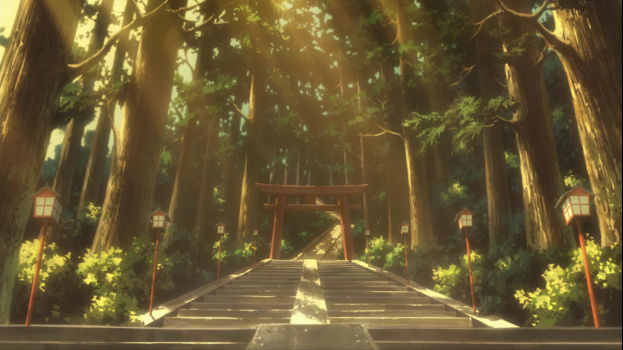
这是  
叉依姬神社的入口，讲这幅图我觉得应该讲一下缘之空的舞台背景。缘之空故事的地理位置处于四面环山的山野地带，海拔在1000米以上。这个神社的入口其实是建立在一座高山的半山腰，现实世界的对应地点为日本足利市桦崎町的八幡宫，不过缘之空的叉依姬神社是  
八幡宫与另一个箱根神社的结合版。作画方面虽然将神明鸟居置于中央却并没有凸显鸟居的特色，只是简单的一带而过，该画面设计更注重自然氛围的构建，你看从左上方打下来的黄色调光线，穿过道路两周三十米开外的杉树和松树，给这个场景增添了一份慵懒恰意的舒适感，也因为这个色调构成具有类棕色的老沉氛围和春绿色的生机力量，所以也会流露出  
“暮年乐趣”「懐かしい」的感觉，总之应该说是  
「木漏れ日」的进阶老年版。参道由大及小由近及远，蕴有吸引力，虽然是二维画面，却通过构图让在看这张图的时候获得三维立体的空间伸缩感，而且参道上的树影画的也相当用心。看到这个场景的时候，我会超脱于动画的束缚，联想到我记忆中类似的空间记忆，由此脑子里产生  
“暑温”“树林间浓郁的自然气味”“林荫间的人造建筑”“失落的夏日”等等的印象。
  

8楼 | 黯痕🍁 | 2019-08-10 20:43
* * *

（上图） 
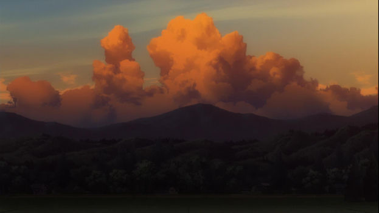
该画面的光源在右上角，实际上在该空间里是西方，因为在动画里这幅图画的出现时间是日暮时分。虽然是日暮时分，但画面三分之二的色调组成专挑令人感到  
恐惧、压抑、紧张的暗橙色、墨绿色、深灰色等等暗色调，首先映入眼帘的是横贯画面中上部的积雨云和雨层云，然后其背后的发蓝紫色的卷层云和白色的碎积云。然后才是画面正中央被高云的阴影覆盖的山峦和地面。该画面呈现出一幅暴风骤雨的前奏状态，正是主人公平静表面下波涛翻涌的内心写照，很直观地告诉观众后续剧情特点。
  

10楼 | 黯痕🍁 | 2019-08-10 20:47
* * *
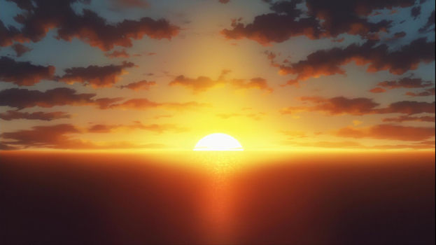
这幅图的光源在正中央，海平线上的落日。耀眼的金光仿佛带着清除一切障碍的力量，往各个方向散射，空中漂浮着高积云，这呈现的是一幅很纯粹的景象，蕴含的就是积极向上的力量，画中的夕阳在这里并不象征着落幕，画师赋予这里的是新生的力量、是某种  
“重生”的坚定信念，这个光源可没有任何负面的信息。
  

11楼 | 黯痕🍁 | 2019-08-10 20:48
* * *
哇哦
  

12楼 | 有信仰的盗贼😈 | 2019-08-10 20:50
* * *

这也是一张很纯粹的画面，展现的是早晨清爽的面貌，心中什么思绪都没有，只有光明。画面中下部分是高杉木的树顶，这种日本高杉木就算画的再夸张也不会超过50米，但是该树的树顶顶上方就有薄薄的云海景象，触碰到了薄暮卷层云，画面的中上部的毛卷层云都有  
七彩日晕，可以说这山的海拔  
超过两千米，而图片最上部的光晕在五千五百米之上的高空。 
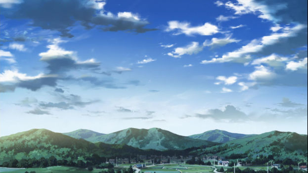
这张图看似平平无奇，其实是  
“动态”的。画面中央几乎没有云彩，而是散布在周围，这其实是因为在几个小时前有积云性层积云在中央堆积，后来慢慢散掉后就成了现在漂浮的这些  
淡积云和碎积云和高积云。这幅图是雨后完全放晴的状态，也象征着主人公经历了内心的  
纠葛之后过渡到平静又拾起信心的状态。  
  
下图就是上图的  
过渡前状态，也是雷雨的次日彻底放晴之后的天气状态，这就是非常现实的  
浓积云，后面还有些  
伪卷云和层云。
  

13楼 | 黯痕🍁 | 2019-08-10 20:51
* * *
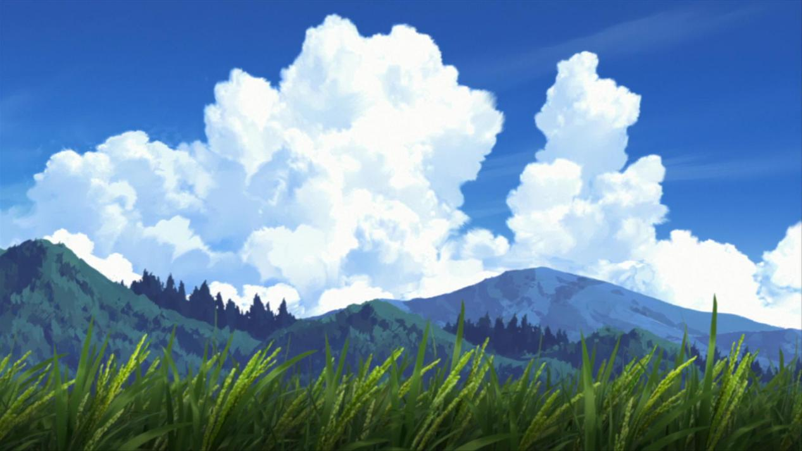
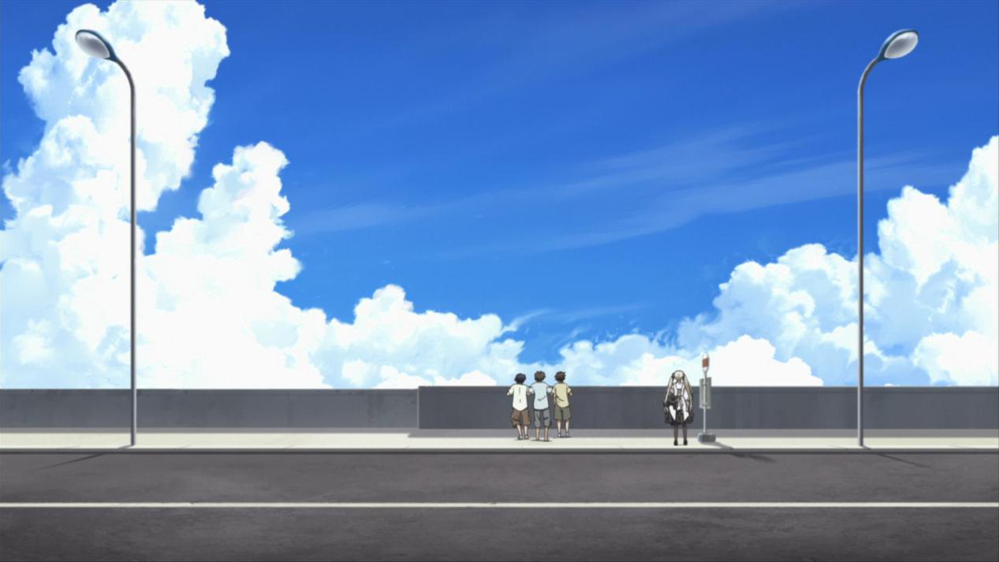
这张图也是浓积云，我老家在内蒙的高海拔地段，经常能看到这种云彩，出现这种浓积云也不一定会变成积雨云，出现一周都不一定会下雨。在缘之空里看到这种景象我确实很惊讶，这种画面有  
纯真质朴、回归自然天地的感觉，有着向往  
清澈、和谐、原生态的精气神的意思，当然这是单以画面而论的，虽然二次元作画并不是完全复刻真实世界的景象，但这种风格依旧叫做“写实”，写实派就是把现实的景象所能蕴含的意思放大给人看，也可以加入个人的主观意愿。色彩的搭配也是情感的搭配，是意志思想的传递。
  

14楼 | 黯痕🍁 | 2019-08-10 20:53
    
    2020-05-04 10:59 | EpicPantss:
    > 我好想在现实生活中见到这种道路外就是云的景色啊
    2020-05-05 23:04 | 黯痕🍁:
    > 回复 EpicPantss :得海拔高点了，1200起步
    2021-06-28 12:42 | 山宴ლ:
    > 同内蒙
    2021-06-28 18:03 | 黯痕🍁:
    > 回复 山宴ლ :握手
    2021-06-28 18:03 | 黯痕🍁:
    > 回复 山宴ლ :握手
    2021-06-28 23:45 | 山宴ლ:
    > 回复 黯痕🍁 :
* * *
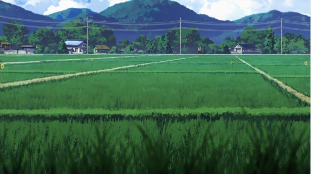
风景图就说到这里。不少天空的景色，天阔云繁或天高云淡，都表现出悠、穹、其他人物不同时间的心境，比如说影片结尾处的天空，表现出这样一种思想信息：悠穹甩开了世俗压力的负担，他们的  
未来像  
蓝天那样广阔晴朗，心中的忧愁如同那时  
天空上的云彩般浅淡，显然是没有了“是否可以在一起”的顾虑与困扰，再加上悠穹相拥而吻的情景，充分展现了悠穹内心的温馨和对未来的向往。这样对色彩的感情用在了深化主题、制造气氛上，表现了二人感情的美好，温暖了观众的心扉。
  

15楼 | 黯痕🍁 | 2019-08-10 20:55
    
    2021-06-28 13:16 | 茅店小王子🌸:
    > 但天空中总会有几朵云甚至是乌云
    2021-07-22 18:48 | 黯痕🍁:
    > 1
* * *
  
画面镜语。影片剧情由于动画的制作限制，因而进行大量删改，最有争议的一点是“第十二集十六分之后  
悠穹沉入那么深的水中且悠已失去意识为何两人还能  
活着上岸？”在悠穹进入水中的场景中，出现了很多的树，是在OP中看到的那种树。请想一想，  
那真的是树吗？我的解释是：那是悠溺水后出现的  
幻觉，设计出这么个场景，是营造精神上的沉入水底，并非身体真正沉入水底。其实我还有一种想法，那就是制作组故弄玄虚而已，在OP中也有类似的图像： 
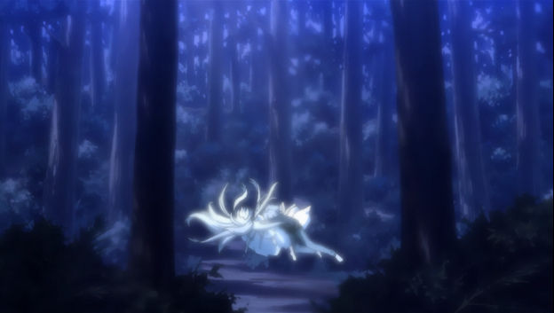
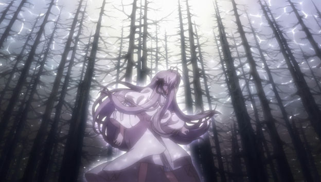
  

16楼 | 黯痕🍁 | 2019-08-10 20:57
    
    2020-02-03 00:20 | 龙与凤凰🔯:
    > 因为有神湖复生的梗，可以自圆其说，悲喜均可。
    2020-02-06 11:46 | 远空之忆◎:
    > 或许是那里很久以前是森林也说不定呢
    2020-02-06 11:50 | 黯痕🍁:
    > 回复 远空之忆◎ :可以
    2020-04-11 17:15 | 澄思渺虑😄:
    > 我觉得还是往喜的方向想比较好
    2020-04-23 16:52 | EpicPantss:
    > 这个解释很有意思 楼主能否详细分析一下
* * *
OP中有几个挺妙的镜头，比如说： 
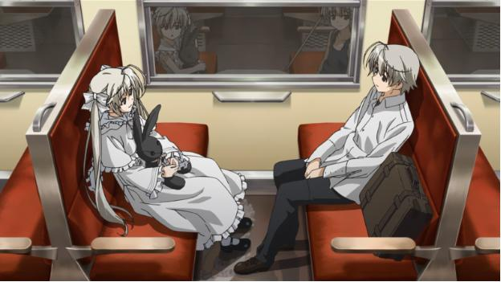
注意儿时的穹的表情，是惊讶的，而悠是泰然自若的。 
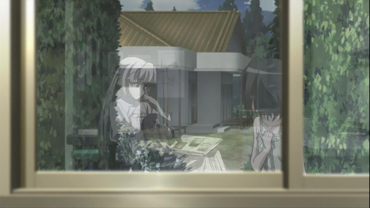
此时的穹和儿时做错事后的奈绪。 
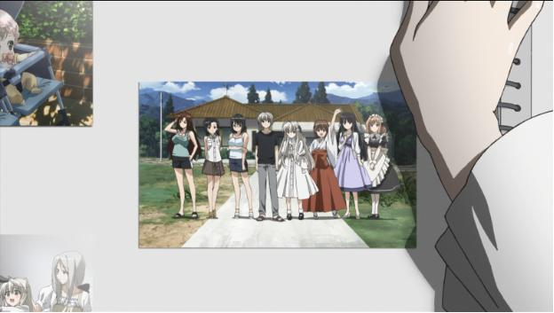
无论是从都市离群索居，还是回到乡下，悠和穹都  
从未真正融入过集体，他们两个人只有和彼此组成一个集体。 
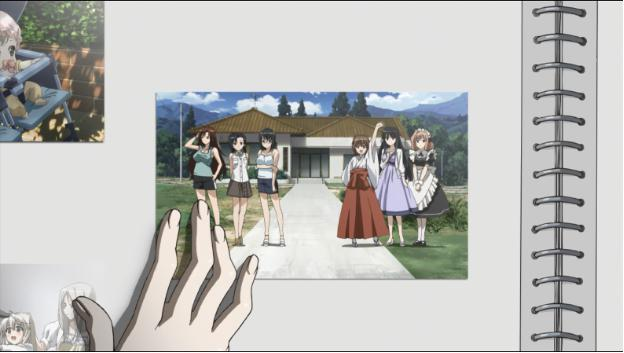
  

18楼 | 黯痕🍁 | 2019-08-10 21:02
    
    2019-09-04 02:22 | 龍門小昊♋🐵:
    > 我觉得亮平挺好呀 挺好的一个悠哥的同学 比诚哥的死基佬好多了
    2020-02-07 10:47 | 莲瑛ლ:
    > in solitude,where we are least alone
    2020-02-08 17:09 | 黯痕🍁:
    > 回复 龍門小昊♋🐵 :亮平确实是个好人
* * *
正片动画ED就像相册一样，虽然制作平平无奇，相当简陋，但是搭配着片尾歌曲来听却揪心、无奈、失落，却又感动。 
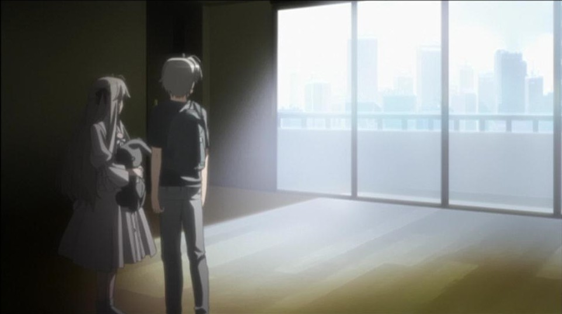
拿这张图来说，左暗右明的  
强对比，两个人物均处于阴影区，从低到高排列，右半部分全部是光源，宽敞、空旷，没有任何摆设，窗外景随便画画，表示该楼层很高。看过动画的朋友很明白，这是悠和穹在父母双亡，变卖房产后，准备离开这个“家”的场景。这个场景构造的很简单，色调也很简单，但也蕴含着太多的情感，我看着就觉得心沉到海底了，有深深的无力感。这个家，悠和穹从小到大都生活在这里，和爸爸妈妈生活在这里，突然有一天爸妈死了，家里没什么存款，想和妹妹一起生活下去，只能变卖家产。房产转让出去了，这个家，永远都不会是他们的家了，熟悉的那个家只会在记忆里了，他们别无选择，这是最后一次了，感受这个家的光影。悠背上包，穹拿着最珍惜的兔子，两个人默默地望着这个房间，最后一次，和过去告别。
  

19楼 | 黯痕🍁 | 2019-08-10 21:05
* * *
如果将组成接收源的动画场景画面的所有要素归结于  
色彩这个集合，那么，一个影视场景是否能使观众产生情绪上的触动，除了色彩因素，还必须要有相衬的  
配乐。  
场景配乐的作用可以是  
烘托角色心理变化和内心的情感世界、强化人物个性特征、表现景物特色、传递制作者的“个人私货”等，但最重要的作用是  
营造场景氛围  
从而  
影响观众情绪，至于之后的事情，就由观众自己去烦恼了。因为音乐能够对大多数人类进行生理性干扰，所以特定的音乐可以对人类的精神能产生特定的干扰作用，又被称为引导／控制思维作用，这种引导效果在影视中使用还具有转移观众对画面质量、剧情问题的注意力，缘之空的配乐就将这个作用发挥到了较大效果。  
  
《缘之空》动画的原创配乐由三輪学和Bruno Wen-li负责，不计改编自游戏的19曲，共有24曲，其中有一首曲子经常被用于各央视频道的配乐，那便是主旋律  
「  
遠い空へ」。  
  
这首主题曲贯穿整个动画，是开场曲，也是故事的结尾曲，每到跟主题相关的场景，便会响起这首曲子，由此能深化主题，展现景物特色与人物心境（借景抒情，情景交融），每集都会出现两次以上，但是我并没有发现有违和感的地方。  
  
寓情于景，确实是很高明的做法，而且不是低俗的感情，也正是因为这样才会具有广泛的适用性。一般寓情于景的音乐都会被某些水平的人吹捧，但在这基础上要看看是什么情，亲情？友情？爱情？还是都有？还是都无？还是混杂？程度又是什么样的？暂且不谈，我们继续赏析——  
看到曲名，听众自然能获得一个很直观的意境——蓝天白云、外加些许苍茫大地。也可以说是自己登高望远时的感受，可能是作者联觉了剧本与场景色彩而成，是  
以远方之景喻悠穹之情，存在着美好的向往、不沾染黑暗的明亮——这样的寄托也在乐句之间，听众也会因各自经历联觉到更多的内容。  
如果要用一个词形容这首曲子，那就是“纯净”，再加一个，就是“遥远”。纯净，这么形容其实不准确，因为这里面仍掺杂着很多的  
红尘中哀乐，但是啊，其曲风既不附庸风雅，也不俗艳。抚景感怀，哀而不伤。又与自然界联系，可说天人和谐，具有五行属性中的水木土，是  
初窥天籁的合成乐。  
在这首曲子里能看到的远不止是动画中所搭配的那些场景，不但能内视自己，还能外视不少的旷丽风景，以及人类希望中最美好的部分。以我看来，这曲子  
叙事...抒情...写景...地位非同一般，真个“  
器乐虽简，然意境深远，可博万象”。  
  
其实欣赏这曲子需要的是足够的联觉力和足够的  
阅历，不需要看过动画才能理解，由于这曲子做得合适，所以不但是动画的主题曲，也是原声中的创作母体，三輪学以此曲为样改编出了“祈り”“記憶”“願い”“追憶ハート”“Before it's too late”。
  

20楼 | 黯痕🍁 | 2019-08-10 21:08
    
    2019-08-10 21:56 | bh20728:
    > 用于各央视频道
    2019-08-10 22:44 | 黯痕🍁:
    > 回复 bh20728 :
    2019-08-17 04:23 | 夜寒-酱:
    > 
    2019-08-31 23:28 | EternalYoke:
    > 远空的竖琴过渡简直大赞，直接将第三次的主旋律推向高潮，紧接着如烟花一样消逝了，最后三轮学传统钢琴渐慢收尾～推荐楼主听听 盛开的钢琴师森下 的BGM，绝对三轮学
    2019-09-01 11:42 | 黯痕🍁:
    > 回复 EternalYoke :你好，其实我也是超资深黄油音乐鉴赏玩家
    2019-09-01 19:24 | EternalYoke:
    > 回复 黯痕 :变态！人渣！**！社会性死亡
    2019-12-12 01:10 | 莲瑛ლ:
    > 记忆是原曲。远空是根据记忆改的，主旋律相同但表达的意境却前后不一。在片尾处两首连放兴许才算得一首完整的曲子，从意境上承接对过往（爱情）经历乃至磨难的沉郁与感伤，到未来向遥远天穹离去追求幸福的满怀憧憬以及心中夹杂的对未来的丝丝担忧。可以说,bgm增添了动画的诗意，也升华了动画的主旨
    2019-12-12 12:09 | 黯痕🍁:
    > 回复 莲瑛ლ :没错
* * *
第二首要评论的配乐是  
Old Memory  
前奏的八音盒是中性音乐，可能更  
偏女性，因为太  
阴柔了。而后面响起的钢琴声却是属于  
优雅小男人的浪漫。曲子中的纯洁是指春日野兄妹的感情，以及他们儿时及现在所处的乡下环境这个自然背景。多么美好的感情，多么的单纯，多么的令人向往，这样的感情，是  
无杂质的  
「爱」，这样的爱  
能容万物，而不仅限于男女爱情，虽然这曲子听起来感觉单薄而且过于  
优柔寡断，细腻得给人没有像「博爱、成熟」的感觉，但是博爱也不一定非要交响形式才能表现，而「纯粹」的表现就需要少量音色的参加即可。  
顺便说一下这首曲子的空间结构吧，最小是点，最大是面，由点及线然后及面。时间过程是先自白再倒叙，然也后在倒叙中  
自白，最后说  
愿望。不过根据我的经验，能听得出来只这是一个人的心理过程，所描述的事件也不具有现实性，顶多是创作者自己把一些小事和自己的  
幻想细腻加工了，如果不添加缘之空的故事情节作为构思范畴的话，应该达不到这种成果，当然也有例外啊，比如说这是个玩合成器玩的很溜的大现充。嘛，尾音部分的笑容（  
自我欺骗的笑容，或者还流著泪在微笑）倒是显得他有点孤单啊。
  

21楼 | 黯痕🍁 | 2019-08-10 21:11
* * *
题外话，关于不同题材音乐间的比较问题。有人将缘之空动画配乐与KEY社配乐比较，通过这件事我也想起来很多题材不同之间的音乐都被拿来比较谁比谁更优秀。我认为是两个原因。一种是比较者想的比懂的多，第二种是  
争名夺利，或为作品争名。这不应该比较，自己听一首曲子，相当于是用作曲人、编曲人给出的元素塑造一个世界，当然有一部分声音-时空间五感联觉者  
听音乐时是在解析世界。但是，用自己看到的声音世界、自己的感受去打压别人，那就不是认知问题，是人格问题了。邓丽君和贝多芬没法比，泽野弘之与喜多郎没法比，能比较的只有题材相同的存在。缘之空的配乐，从以声音来构景的方面看，情景交融，以情辅景，这样的构思很难得，比起专于写  
小伤小感的煽情可不容易得多。这里我还要劝诫一些人：因为被旋律感动了就觉着某某乐曲太上等了某某影视太优秀了......只会招惹嘲讽，能感动你的东西只能说对你来说是好的，不能说对别人也一定是好的。  

  

22楼 | 黯痕🍁 | 2019-08-10 21:13
    
    2019-08-31 23:22 | EternalYoke:
    > 咱三轮学可是key社外援编曲哦 Key社很多曲子也是有三轮学味道的～比如鸟之诗～
    2019-08-31 23:24 | EternalYoke:
    > 当然 编曲≠作曲 但很多细节的相似冥冥之中还是能感觉出来都有三轮学风格的（咱乐理不好，还请大佬补充）
* * *
动画的主题曲，eufonius演唱的OP比翼の羽根，歌名暗喻悠穹的关系，编曲曲乐部组成：2小提琴，1中提琴，1木吉他，1贝斯，1大提琴，1键盘手。内容充斥着  
希望和忧伤，在这曲子里好像真的能感觉到晴空、流云、和煦日光。riya飘忽不定的转音配上乐队的伴奏，充满了  
自由感的表现力，就像是在  
向蓝天白云的诉说心愿，想要摆脱世俗情感纷扰的心情也体现在里面。  
  
这里我要给出OP的歌词。以我十多年来听音乐的感受，我认为  
听歌曲不一定要结合歌词，歌曲的歌词仅仅是理解歌曲的一个要素，歌词在一首歌曲中的地位是弱的，是提供给单听声音听不懂声音中的思想感情和意境意象的听众，歌词的作用是衬托辅佐、深化曲子的表情达意效果，歌词创作最怕的就是  
词的存在感太强，让人忽略了声音这个整体，  
词与曲是局部和整体的关系，一定要协调，比例应该是三比七。好的歌词的字音搭配可以和曲谱起到1+1＞2的效果，就连说唱也是要讲  
旋律性的。我听歌曲往往是将其  
作为一首器乐曲来听，这种方式既能检验一首歌曲的人曲（词曲）契合度，也能更纯粹地欣赏歌曲，然而对于本国歌曲就很难用这种方法，因为咱们能明确听懂歌词意思，而大家听自己  
熟悉语言之外的外文歌曲的时候，就会很容易把它当做一首器乐曲去听，这可不是因为“听不懂所以喜欢”，而是因为你听懂了，你是  
纯粹的欣赏，从整体的角度感受器乐和人的声音，包括演唱者呼吸在你耳朵里都有意义，你没有带任何  
有色眼镜或杂念。有的人听歌只能从感官上感觉好不好听，这是缺乏联觉能力的表现，但纯粹地体会自己想感觉的东西，也不错，  
音乐也是世界，谁都可以拥有自己的世界。  
  
——————————————————  
  
TVアニメ「ヨスガノソラ」OPテーマ  
「比翼の羽根」  
作词：riya / 作•编曲：菊地 创 / 歌：eufonis  
  
在渐变渐远的云间  
倾注而下的光辉会照亮谁?  
  
带着夏日的余影 展翅高飞  
思念仍遗留于此  
  
那些残余的痛楚  
总有一天会抚平  
再没有任何顾虑  
  
穿越蓝天  
希望比昨日飞得更远  
一点点就好 微笑吧  
  
乘着轻风  
让这心灵始终自由  
如若在同片天空下彼此触碰  
  
想以坦然直率的心情  
以无限延伸的光芒  
包围一切  
  
抬头仰望蓝天白云  
透明的光辉映照出何物?  
  
带上怀念的梦 翱翔远空  
握紧理想  
  
轮回变迁的季节  
一直陪在左右  
不再需要泪水  
  
溶入蓝天  
如若温柔轻呼你的名字  
一点点就好 请回应我  
  
清风之中  
这颗心深切期望的地方  
若能在广阔的天空下找到的话  
就以无比崭新的心情  
以极致柔和的光芒  
传达所有一切  
  
仿佛水滴 摇曳心田  
微弱的回忆  
仅是怀着这思念  
勇往直前 永不停息  
  
就这样穿越蓝天  
希望比昨日飞得更远  
一点点就好 微笑吧  
  
乘着轻风  
让这心灵始终自由  
如若在同片天空下彼此触碰  
  
想以坦然直率的心情  
以无限延伸的光芒  
包围所有一切
  

23楼 | 黯痕🍁 | 2019-08-10 21:15
* * *
——————————————————  
  
IN（插入曲）  
ツナグキズナ，译名紧紧相连的羁绊。这首曲子是在缘之空动画中作为正片结尾曲出现的，歌名也是指悠穹，编曲乐部组成：2吉他，1贝斯，其他的全是由中島ノブコキ编排的合成音（弦乐器采样的品质真高啊），混音师是石井满，他构思的太棒，我想不出比他更好的混音方案。  
这首歌则是  
忧伤占据了主位，有时感觉像是一个人在  
昏暗色调的环境中  
追逐着阳光，向往着清澈天空，站在伤痛与未来的分界上。看着片尾动画中的悠穹身影，我也分不清是无奈还是感动了，因为二人的结局美好而高兴，因为二人的惆怅而惆怅，正因为心中好似打翻五味瓶，所以我第一次看的时候都泪眼朦胧了，不过，那是  
幸福的泪水，因为我能感受到耀眼的光芒。我喜欢在黑暗的、看得到星光的环境里感受这音乐脉绪，然后热泪盈眶。也许  
幸福的光芒，在长久的阴冷的环境下会变得格外瞩目，便会耀眼。如那二人的幸福，我曾追求过，要么望而却步，要么戛然而止。接触缘之空，是个契机，重新唤醒了我埋下去的愿望，所以我对悠穹的爱情格外在意。最后看到他们的愿望成真，我仿佛也得到了释然一样，这就像是将一些东西寄托在他人身上，由完成之后，自己也能获得满足，虽然有点荒诞，但这种事情，需要的总归是一种心理感受，并非物质上的得到，而是精神上的解脱。  
  
歌曲的旋律、编曲、混音、歌手、词，哪个最重要？是旋律吗？有时候是唱这词的声音啊，当然旋律犹如人的灵魂一样。以前我看网上没有这首插入曲的视频，我就剪辑之后发到音悦台了，有兴趣的可以去看看。下面我附上这首歌曲的歌词：  
  
——————————————————  
  
TVアニメ「ヨスガノソラ」Insertテーマ  
「ツナグキズナ」  
作词：nyanyanya / 编•作曲：nyanyanya  
  
最终是个让人怀念的季节，  
追寻着明天。  
在那个寄托了容身之地的夏天之中  
每当相互触碰彼此的时候，一切都像是要崩坏一般，  
而我们对此却什么也挽救不了。  
  
在彼此度过了相互伤害的煎熬之后，  
明白了并不仅仅是相互珍惜那么简单。  
  
虚幻的思念也好，带来的痛楚也好，一切都想挽留住。  
因为在其中遇到了你的温柔。  
即便有一天，这段缘分会变得面目全非，  
而称为羁绊的，相遇的意义是不会改变的。  
  
怀抱着生锈却不曾消失的孤独感所带来的寂寞，露出了笨拙的微笑。  
描绘过的幸福画卷中，在哪里有我的容身之地呢？  
  
许愿吧，  
至少能被给予一个容身的地方，来避开散落的雨滴。  
  
想要让你感受到弱小的花儿在温情之中绽放的心情，  
即便受到伤害也无所谓。  
哪怕只是一点点，你给予我的笑容和深深的思念，  
全部都成为了我最珍贵的宝物。  
  
若是着眼于当前的话，现在从此时此地开始，  
一点一点的，迈开前进的步伐吧。  
这段深厚的缘分 定会微笑地为紧握的双手指引着前进的方向。  
  
在这广阔的世界里，我们的事情，  
存在着我们的守护者的事情，  
无论如何都想要传达出来。  
将传向淡蓝天空中的两段相同的思念，  
真真切切地编织在一起。
  

24楼 | 黯痕🍁 | 2019-08-10 21:17
    
    2019-08-20 12:21 | 風華▫恋:
    > 羁绊，个人感觉可以比肩远空
* * *
另外两首未使用的插入曲中，有一首叫做  
「美空に続く光」，译作“在这绮丽天空下延续的光芒”，至于“延续的光芒”，大家应该能想到吧，自然指悠穹，或是他们的情感。我认为这首歌曲的前８秒，是做的最成功的，引人入胜至斯，每听一次都觉得  
心中的尘埃  
荡涤一空，心神一凛。编曲的确做到了向听众展现光芒，这光芒，我觉得很像海拔1500米以上的地区  
雨后黄昏的霞光，十分美丽。  
这首曲子的  
创作用意是什么呢？各位，还记得悠穹于水中自尽吗？还记得穹把悠救出后他们的对话吗？还记得他们  
相拥之时的天空  
景象吗？如果记得，那我也不必多言了，只要记得，就能理解这首曲子的意义——记录悠和穹向着新生活前进时，他们看向天空的神情，和天空照向他们的光芒。这首歌曲的曲，表现出“  
绮丽天空下的光芒”这种意象，是非常成功的，让我十分惊叹。演唱者的声音轻松愉快，很阳光，但总感觉声音里有一种  
尚未释然的感觉，能把歌词中的情感用相当合适的语调唱出来，与伴奏巧妙的搭配，真是绝佳的配合。这首歌曲我也多在夜晚用随身听播放，与「ツナグキズナ」区别于整体色彩的明暗。「ツナグキズナ」曲调先抑后扬，压抑感不断，而「美空に続く光」则不同，就像是看到  
乌云间隙透过的光芒，透光层积云的感觉。我不习惯太美好、幸福的感觉，一旦涌上心头，带来的反而是痛楚，潜意识里拒绝这种感觉，认为自己没有那种可享受的资格，并不甚渴望，常隔岸观灯，望而止步。歌词：  
——————————————————  
  
「美空に続く光」  
作词：天乙准花 / 编•作曲：sham  
  
在一成不变的日子当中 今天也只是孤独一人烦恼着  
从云间照射下来的光 今天依旧光辉耀眼  
  
内心与你的温暖紧紧相牵 虽然有着确实的感觉  
这份遥远的想念却按捺不住  
  
在这绮丽天空下延续的光芒  
一直坚定不移下去的话  
从此以后这份心愿也能够  
与两手紧紧相牵继续前行的吧  
  
在这一成不变的日子的前方还是一片迷茫  
就如同闹别扭的为难的孩子一般 掩饰着寂寞  
  
不断叩击我的胸口的你的声音 虽然确实的传达了  
这份遥远的想念永不改变  
  
在这绮丽天空下铭刻的心愿  
即使受到了伤害  
从此以后也一直允许  
手牵着手一直走下去  
  
仅仅只是一点点的 迷惘与烦恼之类的东西  
全部使之消失继续笑出来吧  
为了明天也能够在一起  
  
内心与你的温暖紧紧相牵 虽然有着确实的感觉  
遥远的有着淡淡感觉的回忆 从今以后只要这样便好  
  
如果这绮丽的天空一直延续下去的话  
就算心愿终不能实现  
也将一直持续下去 陪伴在你身旁  
即使痛苦也将坚信  
  
在这绮丽天空下延续的光芒  
无论如何也绝对不会动摇  
以后我也能够一直微笑着  
与两手紧紧相牵继续前行的吧  
——————————————————
  

25楼 | 黯痕🍁 | 2019-08-10 21:24
* * *

  

27楼 | 百代之过客-▫ | 2019-08-10 21:38
    
    2019-08-10 21:45 | 黯痕🍁:
    > 再发信不信我把你打到只能发这个
    2019-08-12 02:10 | 百代之过客-▫:
    > 回复 黯痕🍁 :
    2019-09-11 16:48 | 🌚Gerry🌝:
    > 回复 黯痕🍁 :大佬！
    2019-09-11 22:21 | 黯痕🍁:
    > 回复 🌚Gerry🌝 :
* * *
百变大叔就是我，一朝回到青少年～虽然看这片的时候我已经在职了，装嫩要挨打啊哈哈，签名档是我设计的，怎么样，好看吧～不要擅自拿啊魂淡～如果是一个认真阅读了我上述文章的人看到我现在说的这些话，是不是会大跌眼镜呢哇哈哈哈哈恩嗝．．．．．．原来是个逗比呀～～～  
毕竟人是多面的，我的人格面具可是多到记不清，我也有过黑暗到怀疑一切拒绝任何人好意的时期，也有过天真宝宝时期，也有过带小弟带新人的基佬大哥时期······但人不会停留在同一片天地，人际交往也讲究的就是变化，永恒只存在于宏观事态，人在这时会成熟，在那时会幼稚，跟S人说S话，跟M人说M话，这都是理所当然的，像水一样吧，我的朋友。
  

29楼 | 黯痕🍁 | 2019-08-10 21:43
    
    2020-03-05 17:39 | 守望者的迷途🐵:
    > 顶
* * *
你现在也是一副基佬大哥样
  

30楼 | bh20728 | 2019-08-10 21:57
    
    2019-08-10 22:47 | 黯痕🍁:
    > 谁说我是基佬？我要把你日得喵喵叫
    2021-01-29 13:48 | 初创知之:
    > 回复 黯痕🍁 :好色哦
* * *
轮回般的楼主，精英化的赏析
  

31楼 | 龙与凤凰🔯 | 2019-08-10 22:16
    
    2019-08-10 22:39 | 黯痕🍁:
    > 这吧里我就属你最熟了，你也经常留意这个吧啊，我就感觉你会出现的
* * *
dd
  

32楼 | 远空♬ | 2019-08-10 22:20
    
    2019-08-10 22:46 | 黯痕🍁:
    > 
* * *
说得好
  

34楼 | 🌐網上沖浪 | 2019-08-10 23:22
    
    2019-08-10 23:24 | 黯痕🍁:
    > 我要把塞进你的菊花
    2019-08-10 23:48 | 🌐網上沖浪:
    > 回复 黯痕🍁 :
* * *
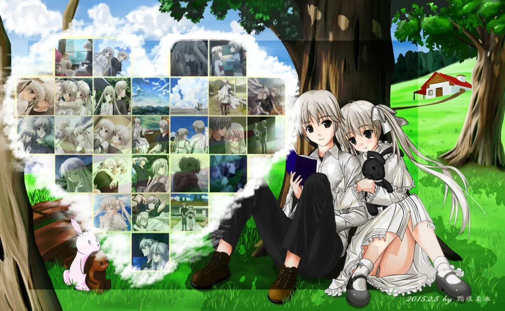
  

35楼 | 黯痕🍁 | 2019-08-10 23:23
    
    2020-03-09 16:38 | 黯痕🍁:
    > 2015年发的版本，帖子里有很多吧友的讨论：<https://tieba.baidu.com/p/3569236862>
* * *
bdbd
  

36楼 | ▫本宅要逆天 | 2019-08-10 23:27
* * *
很久没见了，一如既往地精彩点评
  

37楼 | tomlong98 | 2019-08-11 00:48
    
    2019-08-11 10:46 | 黯痕🍁:
    > 好久不见～
* * *
路过。
  

38楼 | 路过的空我♬ | 2019-08-11 01:25
* * *
顶楼主
  

39楼 | 点646499 | 2019-08-11 04:21
* * *
顶顶
  

40楼 | 梦的远方º | 2019-08-11 08:01
* * *
角度刁钻的帖子
  

41楼 | 鳥之穹鳴 | 2019-08-11 10:31
* * *
dd 
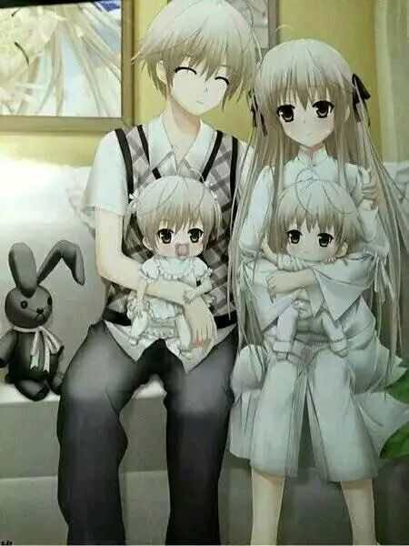
  

47楼 | 深空下的回忆🙈 | 2019-08-11 11:19
    
    2019-12-11 13:45 | 一睁眼就开卷🐭:
    > 
* * *

  

49楼 | 夜寒-酱 | 2019-08-11 22:34
    
    2019-08-12 16:43 | 黯痕🍁:
    > 
* * *
插眼
  

51楼 | 猫猫8帝 | 2019-08-13 00:42
* * *
虽然音乐这边不了解，但知道是大佬就行了
  

52楼 | 风急渚清🍁 | 2019-08-13 07:14
    
    2019-08-13 21:16 | 黯痕🍁:
    > 
    2019-08-13 21:16 | 黯痕🍁:
    > 
    2019-08-13 21:18 | 风急渚清🍁:
    > 回复 黯痕🍁 :还可以这样氵吗？
* * *
膜拜大佬，原谅我走马观花
  

53楼 | 摸鱼带师🐭🐭 | 2019-08-14 21:26
    
    2019-08-15 12:03 | 黯痕🍁:
    > 
* * *
dalao，顶一下
  

59楼 | Lings丶 | 2019-08-17 23:00
    
    2019-08-19 19:38 | 黯痕🍁:
    > 
* * *
收藏了楼主，不敢再往下看了，害怕再难受
  

60楼 | 雨夜灬♬ | 2019-08-17 23:06
    
    2019-08-18 13:01 | 黯痕🍁:
    > 咱俩头像一样
    2019-08-18 14:03 | 雨夜灬♬:
    > 回复 黯痕🍁 :是的呀
    2019-09-04 11:13 | Livnr💨:
    > 把这个高清图片发一下呗
* * *
高中语文阅读理解满分
  

70楼 | djxxhxd | 2019-08-20 15:15
    
    2019-08-22 18:02 | 黯痕🍁:
    > ··
* * *
说得好！虽然我离楼楼这种大佬还有差距，但“见S说S话，见M说M话”这种道理，我自认还是和楼楼一样清楚的用缘之空这部动画来说就是——对萌豚小孩子就讲穹妹、床戏，对正经成年人就讲画面、音乐，无论如何都不要提剧情安排、叙事节奏！谁提谁傻子！  
再说，楼楼介绍音乐的时候也是，第一首讲远向天空，第二首讲Old Memory，正巧是我过了这么多年还唯二留在云歌单里没删掉的动画bgm呀，而且我也确实更喜欢前面那首，看来我们这审美还是跟大多数人都差不多？
  

71楼 | 羽毛卡比II | 2019-08-20 16:25
    
    2019-08-20 16:52 | 黯痕🍁:
    > 有缘
* * *
那种谬寂的感觉真好
  

73楼 | 090909t00 | 2019-08-23 09:27
* * *
日本人？
  

75楼 | 老Q在此🐵 | 2019-08-23 12:59
* * *
男主啥时候被带绿帽的啊
  

76楼 | 老Q在此🐵 | 2019-08-23 13:00
    
    2019-08-23 17:15 | 黯痕🍁:
    > 没有过
    2019-08-23 17:16 | 老Q在此🐵:
    > 哦
    2019-08-23 17:16 | 老Q在此🐵:
    > 谢谢大佬
    2019-08-23 17:16 | 老Q在此🐵:
    > 那穹妹自慰他为啥哭啊？
    2019-08-23 17:19 | 黯痕🍁:
    > 回复 老Q在此🐵 :因为他没想到他妹这么喜欢他，又因为内心深刻的伦理观导致自己不敢正视他妹妹的心意，所以流泪了
    2019-08-23 17:38 | 老Q在此🐵:
    > 大佬好厉害
    2019-08-23 17:38 | 老Q在此🐵:
    > 已关注
* * *
好期待他们的美好生活，出第二部是不可能的，只能自己yy了
  

77楼 | 穹妹我老婆😁 | 2019-08-24 09:52
    
    2019-09-05 17:58 | 龍門小昊♋🐵:
    > 悠之空 第二部
* * *

  

78楼 | 穹妹我老婆😁 | 2019-08-24 09:52
* * *
bgm完美
  

80楼 | 巴塞罗那☞Ω☜ | 2019-08-25 22:26
    
    2019-08-26 19:41 | 黯痕🍁:
    > 
* * *
2
  

85楼 | 滑滑蛋♬♬ | 2019-08-28 18:38
* * *

  

87楼 | FPX冲冲冲💦 | 2019-08-29 01:21
    
    2019-08-30 10:11 | 黯痕🍁:
    > 滑稽我要日你
    2019-08-30 23:35 | FPX冲冲冲💦:
    > 回复 黯痕🍁 :
* * *

  

88楼 | 滑滑蛋♬♬ | 2019-08-30 10:18
    
    2019-09-01 11:44 | 黯痕🍁:
    > * * *
诶，虽然只看懂一点点，但还是觉得楼楼是个大佬
  

90楼 | 雨落◆罪断 | 2019-08-30 22:19
    
    2019-08-31 11:35 | 黯痕🍁:
    > 你再对我一下试试
* * *
dalao太厉害了！咱也是个逗比，然而并没有dalao的耐心去写BGM分析，也没耐心从头到尾啃下缘之空配乐翻奏水就完事
  

91楼 | EternalYoke | 2019-08-31 23:30
* * *
帖子别删 可能我以后就看懂了
  

93楼 | 龍門小昊♋🐵 | 2019-09-04 02:26
* * *
最后穹妹为什么跳河 那么久还能救上来 然后结束了……是幻觉吗？ 游戏也是这样的吗？
  

94楼 | 龍門小昊♋🐵 | 2019-09-04 06:25
    
    2019-09-04 15:24 | 黯痕🍁:
    > 这个是制造一种“精神沉入深处”的夸张内容，实际上没沉入水中几米，穹把悠也带着游上去是真的。穹最后跳河主要是觉得自己的存在会使悠一直处于担惊受怕不敢面对世人的状态
    2020-03-22 16:58 | 二人的距離º:
    > 也有一部分是由于经济的原因。（稍微补充一下）
    2020-03-23 16:49 | 黯痕🍁:
    > 回复 二人的距離º :不错啊，能考虑到经济因素，明白人。
* * *
还有 为啥班长没线啊 是因为人气不够高吗？
  

95楼 | 龍門小昊♋🐵 | 2019-09-04 06:43
    
    2019-10-13 03:09 | 洛里安cº:
    > 班长有的，悠之空，性质上是缘之空游戏剧情的补完，动画结尾的二人前往北欧的剧情实际上就出自悠之空
* * *
我想知道穹妹篇的真结局 有的人说淹死了 到底是不是真的 楼主玩过游戏结局吗？ 是怎样的 求回复 刚看完没多久 有点自闭
  

96楼 | 龍門小昊♋🐵 | 2019-09-04 13:33
    
    2019-09-04 15:30 | 黯痕🍁:
    > 缘之空的游戏结局是二人去欧洲了。
    2019-09-04 18:19 | 龍門小昊♋🐵:
    > 回复 黯痕🍁 :也就是和动漫一样是吧
    2019-09-04 19:03 | 黯痕🍁:
    > 回复 龍門小昊♋🐵 :是啊
    2019-09-04 19:55 | 龍門小昊♋🐵:
    > 回复 黯痕🍁 :原作游戏 去旅游 动漫更真实 也很伤感 互相爱着却不被接受 （终于懂了）
    2020-03-22 17:01 | 二人的距離º:
    > 回复 龍門小昊♋🐵 :我认为是穹最后救了悠，在前几集有暗示穹会游泳（穹离家出走时不小心掉进河里，但也没事，）穹是为了不拖累悠而去选择跳湖，而不想悠因为她而si。个人见解，错误请指出。
    2020-03-23 16:50 | 黯痕🍁:
    > 回复 二人的距離º :对的
* * *
sdl tql awsl
  

97楼 | 🌿骨科先锋🍁 | 2019-09-04 18:12
    
    2019-09-04 19:01 | 黯痕🍁:
    > 
* * *
楼主，你这个有点东西
  

98楼 | 霞丘诗雨😄 | 2019-09-04 23:13
    
    2019-09-05 14:02 | 黯痕🍁:
    > 你好
* * *
还有一个疑问 为什么穹去跳湖的时候 她撕坏人偶的房间 为啥那么红啊？ 是因为黄昏的养过照射进来的原因吗？感觉也太红了
  

99楼 | 龍門小昊♋🐵 | 2019-09-07 14:02
    
    2019-09-07 19:27 | 黯痕🍁:
    > 夸张的表现效果，属于意识流的艺术效果。你知道夕阳是橙色的，当橙色深化为暗色调的时候会表现出恐惧悲哀凄惨的效果，当夕阳的橙色变成烧火红色的时候表现的是荒诞、不真实、意识冲突、大脑当机····这样的内容。这种色彩风格是为了制造让观众惊悸猜疑不定的氛围
* * *
顶
  

100楼 | 知世🎁 | 2019-09-07 14:12
    
    2019-09-08 14:46 | 黯痕🍁:
    > 
* * *
大佬nb！
  

102楼 | 🌚Gerry🌝 | 2019-09-11 16:49
    
    2019-10-07 12:40 | 黯痕🍁:
    > 
* * *

  

112楼 | 贴吧用户_54573tN | 2019-10-07 07:53
    
    2019-10-10 14:15 | 黯痕🍁:
    > 
* * *
看哭🌶️
  

113楼 | 源稚生y✨ | 2019-10-07 19:31
    
    2019-10-08 10:56 | 黯痕🍁:
    > 
* * *
dd
  

120楼 | 缘分💫天空 | 2019-11-09 12:38
    
    2019-11-09 18:26 | 黯痕🍁:
    > 
* * *
缘之空才推了一叶篇，又忍不住去推穹妹篇，好后悔，越推越少，不够看
  

121楼 | 北川--- | 2019-11-09 21:11
* * *
我认为有两个结局
  

122楼 | 回答Asrwer | 2019-11-09 22:06
    
    2019-11-10 15:22 | 黯痕🍁:
    > 你的意思是二人已经沉入水底了吧
* * *
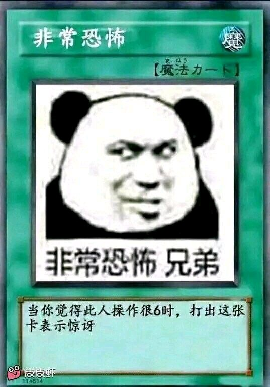
  

123楼 | 无言lyc♋ | 2019-11-11 23:44
    
    2019-11-12 19:05 | 黯痕🍁:
    > 
    2019-11-12 19:05 | 黯痕🍁:
    > 
* * *
有看到你的贴了 当时第一遍看完挺致郁的，当时还跑到知道上去问结尾班长的那段话是什么意思，应该不是简单的她也喜欢悠的意思吧，这部作品至少能让人引发思考，还是很好的。另外在意境这一块，目前我看过最好的就是缘之空和sola了。就是那种无法言语的忧伤感，有一个共同点就是这2部作品的音乐都超神了。
  

125楼 | 土豆来也1 | 2019-11-24 02:26
    
    2019-11-24 13:14 | 黯痕🍁:
    > 不错
* * *

  

126楼 | 晴子🌺 | 2019-11-24 07:22
    
    2019-11-25 23:07 | 黯痕🍁:
    > 
* * *
你这个写的确实吊，吊哥喜欢
  

129楼 | 大吊插小B | 2019-12-06 10:58
    
    2019-12-06 11:02 | 风姥:
    > 小伙你这个ID。。。。围观
    2019-12-06 13:11 | 黯痕🍁:
    > ？？？？？？
    2020-02-01 12:21 | 红芋仔仔😂:
    > 举报ID
* * *
大佬nb！
  

133楼 | 红芋仔仔😂 | 2020-02-01 12:21
* * *

  

134楼 | ✨悠遠的苍穹✨ | 2020-02-02 20:42
* * *
缘之空BGM还有一首超神的：困惑之中。这首我听的最多，甚至超过远空。
  

135楼 | 龙与凤凰🔯 | 2020-02-03 00:45
* * *
楼主对音乐和OPED观察的仔细程度令我十分佩服，有很多观点，尤其是歌词，画面渲染等的看法和我不谋而合。那我也来分享一下我的一些个人理解吧。  
我个人印象很深刻的是正片ED中这样的一个画面： 
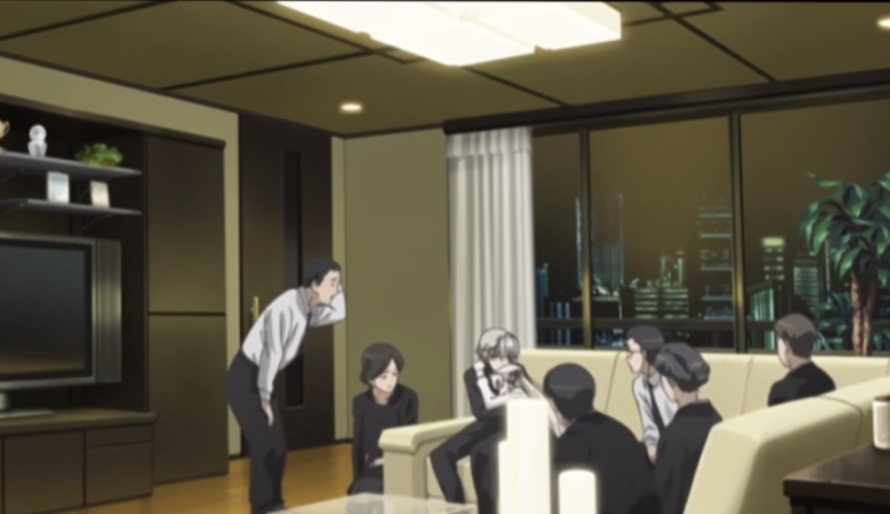
这个地方游戏中描绘到，动画中未着重描写：画面上悠穿着黑色西服，穹正抱着悠大哭。可以推断：悠穹的父母刚刚去世，悠正在和邻居们，亲戚们（身着黑色衣服）商讨遗产的分配，父母开的家具店的处理，还有最重要的事情，悠穹的归属，上学，生活问题。亲戚提出分别收养悠穹，穹却表示不想和悠分开，大哭着扑到了悠的怀中。画面上几人穿着黑色衣服，渲染凝重的氛围，给人以压抑感，凸显出悠穹处境的艰难。
  

136楼 | Xiao_Yu_Ge_Ge | 2020-02-05 10:50
* * *
《笑顔の行方》：四条线的动画第1集，悠穹在小商店买完东西后，悠骑着自行车载着妹妹回家时的BGM。节奏轻快明朗，象征着悠穹即将开始新的生活。  
动画OP《比翼の羽根》：空灵的一段前奏，接上弦乐从低到高，又转下，（同时配上穹坐在床边，抬头仰望窗外，头发飞扬的画面），给人一种寂寥悲伤的感觉。接下来的主歌娓娓道来，感情平和。主歌后半部分的导歌（主副歌之间的衔接部分，方便切换到副歌的旋律）（残った痛みはいつか，消えて行くから，もう何も迷わない）直接切换调式（A→降A），进入副歌时候又切换一次调式（降A→A），副歌后半段再转调（触れ合えるのなら。 ）（A→降A），同时到达最高潮，接着回落到副歌结尾，最后一句再次转调（全てを包みたいから）（降A→A），充分地表达了穹想要摆脱束缚，向往蓝天的感情，令我惊叹的是这样复杂多变的调式，广阔的音域，歌手riya却能充分地表达到每一个转音，唱功不浅。这首OP个人看来魅力不输Oldmemory，远空等名曲。
  

137楼 | Xiao_Yu_Ge_Ge | 2020-02-05 11:09
    
    2020-02-16 15:54 | 黯痕🍁:
    > 
* * *
插眼
  

139楼 | ♬Ink | 2020-02-21 01:41
    
    2020-02-26 15:39 | 黯痕🍁:
    > 
* * *
七年前有个吧友ＩＤ里有个红什么灯，反正有这俩字。我跟他算是仇人，其实吧里有很多人跟他都是仇人，包括当初爆吧的那个家伙。  
１４年的时候我用安迪那类的贴吧系列软件给缘之空吧刷了６万关注，正巧那时候爆吧的哥们也给缘之空吧刷了１万多关注，当时贴吧的关注数直接就破了１０万。
  

140楼 | 黯痕🍁 | 2020-02-27 00:03
    
    2020-02-29 15:14 | 黯痕🍁:
    > 2010年秋色之空吧资源全被删没了，10月份缘之空动画开播吧里也被爆了，不过程度一般般
* * *
10年的大吧一开始是字母，后来是誓炎，主要是誓炎在刷真爱楼，这家伙刷的是亮平的，一个人开刷帖机码了30万以上的楼，在吧里弥漫了基佬的气息。10年老囧也来吧里了，11年开始活跃的，主要是和虾米一起声讨雾谷希，虽然说这家伙被封了好多次。11年的时候雾谷希当时才17岁吧，老囧当时20岁了，雾谷希这个女孩给人的印象怎么说呢，以现在的眼光来看就是个小孩子，与其说是懒得应付他人，不如说是缺乏应付他人的社交能力。总之一言不发地删帖封人，不会理会他人，即便理会也只会是几个字，很少见他说过10个字以上的话。其实当时吧，11年的时候，大多数人不过是14岁的年纪，像笨蛋的寂寞当时才12岁。虾米给人的感觉一会是男孩一会是女孩，谁知道呢，我到现在都不知道。虾米非常活跃，应该说比较闹腾，但是如果没有他存在的话，缘吧也会相对冷清一些的。  
14年8月17日，准确的说是这个时间，关注数整100000，转角处珍惜还发了个帖子说这事。同年旧的春日野穹真爱楼被百度抽风消失了，转角处珍惜开了个真爱楼，开始刷帖，我也开始跟帖，开了刷帖机堆了几万楼。
  

141楼 | 黯痕🍁 | 2020-02-27 22:41
* * *
另外推荐下我的短乐评音乐精选集，欢迎大家欣赏：[https://emumo.xiami.com/collect/280079679](http://tieba.baidu.com/mo/q/checkurl?url=https%3A%2F%2Femumo.xiami.com%2Fcollect%2F280079679&meta=1&urlrefer=df13e34c38cb5be95e19d9177884bf6a)
  

142楼 | 黯痕🍁 | 2020-03-01 12:01
* * *
刚刚回吧dd
  

144楼 | 祖梦🔯 | 2020-03-02 11:21
    
    2020-03-02 11:22 | 祖梦🔯:
    > 听说大佬会中医，脑科学。那么萌新跪问：多重人格，能治吗。。。
    2020-03-02 11:32 | 黯痕🍁:
    > 回复 祖梦🔯 :人格分裂有可控和不可控的区别，可控的程度也不重，一定是基于你的个人需要才有，不是病。不可控的可以治疗，但得分清楚，一般把多重人格归为精神分裂，从大脑结构上看属于右楔前叶增大。其实认为自己有多重人格的诱因一定是创伤后遗症，为了规避伤害对自我保护机制进行控制，
    2020-03-02 11:34 | 祖梦🔯:
    > 回复 黯痕🍁 :谢谢大佬，跪安
    2020-03-02 11:36 | 黯痕🍁:
    > 回复 祖梦🔯 :真正的创伤后遗症大脑的海马回、杏仁核一定会监测到过度活跃的现象 。而病理性的多重人格也就是解离性身份障碍是没有这种现象的，不如说，多重人格往往是抗应激能力弱，喜欢幻想的人在看到或被接受了什么样的暗示啊、摄入他人的经历并过度共情设身处地套用在自己身上之后的结果
    2020-03-02 11:38 | 黯痕🍁:
    > 回复 祖梦🔯 :对于大脑结构并没有出现明显改变的人，或者说就算改变了，中医都治的了，但凡是抑郁症，躁郁症，精神疾病，像日本那边属阴柔的人多，都是用疏肝解郁补肾等等兴奋你的副交感神经抑制交感神经，提升免疫力和平衡各种激素···········之类的结果
    2020-03-02 11:38 | 祖梦🔯:
    > 回复 黯痕🍁 :多谢
* * *
吧主水平nb啊
  

145楼 | 考虑考把控虑吧 | 2020-03-04 17:27
* * *

  

148楼 | POLOº | 2020-03-08 11:09
    
    2020-03-08 13:18 | 黯痕🍁:
    > ㄟ( ▔, ▔ )ㄏ
* * *
现在回过头来看，这一篇赏析是我见过最全面，最细节了。备份了
  

150楼 | 🌐網上沖浪 | 2020-03-11 04:50
    
    2020-03-12 12:15 | 黯痕🍁:
    > 哈哈，谢谢
* * *
楼主666 品鉴深刻有内涵 （好吧我承认我不懂 一本正经的胡说八道） 但是大佬解析很让人舒适 刚推完游戏除了穹线 动漫没看 看到楼主讲解画面和音乐 让人有点忍不住想去看看动漫了
  

151楼 | kdhww | 2020-03-17 09:32
    
    2020-03-17 10:41 | 黯痕🍁:
    > 谢谢
    2020-03-17 11:13 | kdhww:
    > 没事 对于好的东西应有的评价
    2020-03-17 11:14 | kdhww:
    > 但是这动漫也太让人感动了看看楼主的解析心情好很多了
    2020-03-18 13:00 | 黯痕🍁:
    > 回复 kdhww :当年我看完这部番，每次抬头看向天空都会想到悠穹
    2020-03-18 18:08 | kdhww:
    > 确实了不过我想到的是鸟之诗
* * *
dd
  

152楼 | 祖梦🔯 | 2020-03-17 10:48
* * *
哪位大佬给我发一下缘之空的网盘啊，我找不到了
  

154楼 | ♤猎祖猎宗♤ | 2020-03-18 13:39
    
    2020-03-18 14:17 | 黯痕🍁:
    > <https://www.agefans.tv/detail/20100003>这里有下的啊
    2020-03-18 22:08 | ♤猎祖猎宗♤:
    > 回复 黯痕🍁 :谢谢大佬
* * *
大佬nb，顶顶顶
  

155楼 | 远空之忆◎ | 2020-03-21 21:59
* * *

  

157楼 | 我还要氵😄 | 2020-03-23 16:57
* * *
新冠时期看的缘之空，看完之后心情特别郁闷，正如大部分人喜欢缘之空喜欢穹妹的原因并不是因为h，而是被缘之空中的穹妹对爱情的勇敢，坚持，和不顾一切的追求所打动，都是渴望拥有一段真挚，纯洁的爱情的人。我即是如此。
  

158楼 | 二人的距離º | 2020-03-23 18:02
* * *
缘之空对于细节的刻画是超级棒的，尤其是对悠的心理刻画可谓是精妙绝伦。悠在幼年时期就对穹拥有特殊的情感，又缺乏父母的教育与约束，所以穹悠之恋自幼便产生，而理智却告诉他不能这样，于是出现了与奈绪之间的恋情，但是对穹的爱却一直埋在心中；在班长等人的无心言语中让他更加的对穹的爱情加以禁锢，害怕世俗的眼光和穹的心理，可在目睹了穹在房间中另类的“告白”中内心十分触动，在与奈绪的约会中就心猿意马，一直忘怀对穹的爱恋，无法抑制心中的情感。在穹发烧为穹擦拭身体时一遍又一遍的叫着穹的名字就可以看出悠对穹的重视，在听到穹的直接表白时再也抑制不住自己的情感，与穹结合了。在与穹之后的日子里就十分的快乐，但在班长的劝告和众人的眼光之下悠心中就有些不安，后来两人的“关系”被人目睹和得知储蓄不多时，心中就想要放弃这段恋情，可在穹准备跳湖“重来”之时，终于所有冲破了心中所有禁锢，奋不顾身的跳进湖中阻止穹自杀。而穹最后将悠救了出来。在这个湖中两人终于突破了心中的枷锁，冲破了世俗的封锁，迎来了“新生”，所以可以认为兄妹两人在湖中“重来”了。
  

160楼 | 二人的距離º | 2020-03-23 19:07
    
    2020-04-23 16:47 | EpicPantss:
    > 最后的这个解释好，去掉了超自然的神秘色彩，而又完美契合结局主题
* * *
写得好吊....
  

161楼 | Sakura千木 | 2020-03-23 19:09
* * *
其实对其他人的心理描写也是非常好的，例如穹对悠的恋情就是如此，开始比较朦胧，但在与悠的相处中一点一点产生了异样的感情，对悠一直都十分的喜欢，渴望与悠在一起，即使会有很多的问题，也在所不惜，愿意为爱而付出自己的一切，在看到悠因为他人的眼光而烦恼和经济状况不佳时。为了不给悠添麻烦，于是希望通过跳湖来“人生重来”，在悠奋不顾身救穹的时候，穹顿悟了，明白爱情是两个人的事，不应该只让一人承担，于是救起了悠，在最后终于如愿的与悠在一起了。其实爱还是十分矛盾的，悠因为爱穹，所以不想让她遭到世俗眼光的歧视，在知道经济状况不好时，就希望可以与穹分开，这样就可以不被世俗所唾弃，也可以解决经济压力。而穹也是因为爱悠，所以希望悠不在因为世俗和经济方面而苦恼，所以选择了跳湖“重来”。这也是十分矛盾的，索性最终结局还是十分圆满的，这也是编剧故意安排和观众所期盼的结局。
  

162楼 | 二人的距離º | 2020-03-23 19:25
    
    2020-03-23 21:47 | 黯痕🍁:
    > 你可真是个细致的人，写的好
    2020-03-23 22:51 | 二人的距離º:
    > 还好啦，多谢夸奖
* * *
班长和奈绪作为两个配角形象，也是比较重要的，她们也推动了剧情的发展，她们的影响也是具有一定的象征的，奈绪代表的是思想开明，思想不被世俗所束缚，能接受违背伦理道德的事的人。而班长则是代表着大多数人，思想被世俗所禁锢，理解不了违背伦理道德的事的人；最后所说的话也道出了大多的事都不会十分圆满。“有感情就可以为所欲为，我也想做很多事”。
  

163楼 | 二人的距離º | 2020-03-23 19:37
* * *
dd
  

164楼 | 蒐拉ლ雨薇 | 2020-03-23 22:58
    
    2020-03-24 15:30 | 黯痕🍁:
    > 
* * *
dd
  

165楼 | 祖梦🔯 | 2020-03-25 09:31
* * *
黯痕大佬nb
  

168楼 | 远空之忆◎ | 2020-04-11 17:26
    
    2020-04-11 17:28 | 黯痕🍁:
    > 
* * *
Dd，黯痕大佬nb
  

169楼 | 澄思渺虑😄 | 2020-04-11 17:28
* * *
大佬啊
  

171楼 | Hjhjjj2046 | 2020-04-22 18:46
    
    2020-04-23 14:29 | 黯痕🍁:
    > 
* * *
大佬就是大佬，萌新帮d
  

172楼 | 最美的穹酱呀▫ | 2020-04-23 14:51
    
    2020-04-23 14:59 | 黯痕🍁:
    > 
* * *
楼主厉害啊 佩服佩服
  

173楼 | EpicPantss | 2020-04-23 16:49
* * *
话说lz怎么看最后那只被撕碎又重新回到穹手上的兔子
  

174楼 | EpicPantss | 2020-04-23 16:50
    
    2020-04-24 23:03 | 黯痕🍁:
    > 从放弃到捡起
* * *
dalao厉害，音乐这方面我只能听懂那种忧伤，但就是描绘不出来，我记得刚开始（应该是第一话）有一个穹妹一个人在家的镜头，然后BGM起，我就抑郁了
  

180楼 | 湛温烟º | 2020-05-08 09:35
    
    2020-05-08 09:55 | 黯痕🍁:
    > 
    2020-05-08 09:56 | 湛温烟º:
    > 回复 黯痕🍁 :
* * *
dalao厉害（再夸一遍  
你对缘之空的评论给我带来了更深入的理解啊
  

182楼 | EpicPantss | 2020-05-08 11:20
* * *
顶顶
  

183楼 | 符号君👺 | 2020-05-08 12:20
* * *
从萌娘百科提到的15年贴子过来的，我可以把上面15年版换成这个吗？
  

184楼 | 空城jokes | 2020-05-14 20:16
    
    2020-05-15 21:55 | 黯痕🍁:
    > 我都忘了有这事了，行啊兄弟
* * *
有空了多说几句。内天悠打了穹之后，我认为作品里本该有段过渡剧情的，但作品没呈现，这段过渡剧情我认为是：悠因为纠结于禁断关系的种种异常性与未来生存会出现的不利因素导致对自身和穹未来发展的可能性存在各种打压甚至毁灭的可能性，但又因为悠本身还是个年少无知的人所以会茫然失措，继而在茫然失措之际出于宣泄压力故而做出种种应激行为如打骂亲友、不断埋怨、自闭。然后不断恶化跟穹的关系，和周边人事物的关系。  
（如果我是作者的话，我还会增加悠与同学们和邻里和老师等等人之间的负面戏剧冲突，使观众对悠穹的关系失去良性期待打压观众的舒适体验，这是为最后悠穹“破镜重圆”制造心理过山车效应，打压一下再拉升观众才能感觉深刻一些嘛。而且增加悠黑化的相关剧情能增加后续穹自杀的合理性。除了第一人称描述以外还要加上比如说亮平、更多第三人称角度的剧情）  
穹是很爱悠的，别去分析什么爱为什么爱，穹对悠的情感是依恋症还是什么根本无所谓。  
【爱一个人会无条件不计回报地付出哪怕是死都心甘情愿】，这个是自古以来的各种爱情桥段里都这么用的，在本作也一样，不论起因只看结果，穹完全爱悠，所以当出现上述情况的时候，她认为让悠不再痛苦的办法就是消除自己的存在，从利益的角度看自己的存在对悠而言弊大于利，所以穹选择了自杀。撕烂的兔子也象征着穹冲动之下选择了破坏掉现在的自己，也是不理智的态度造就的。别管二人沉入湖底为啥没死，别管是穹救了悠还是神湖重生，看结果就对了，二人破镜重圆，从水里出来后的两个人脑子不但没进水，反而清醒多了，肯定了彼此的心意在一起了，所以说，兔子是被作者当作象征意义来用的。
  

185楼 | 黯痕🍁 | 2020-05-17 19:51
    
    2020-06-10 20:38 | 黯痕🍁:
    > 其实相对于说我喜欢这部动画，不如说我喜欢这种题材的人物设计和感情路线。至于具体的剧本框架和剧本节奏算不得我很喜欢的，从我之前的分析大家应该发现了，我对详细的剧本并不谈，我是将由这个剧本所延伸联系自身的其他幻想构筑了其他的遗觉、联觉与这个故事叠加融合，组成了全新的缘之空，非原作本身
* * *
大佬
  

188楼 | 乾道坤道💧 | 2020-05-30 22:48
    
    2020-05-30 23:38 | 黯痕🍁:
    > 
* * *
dd
  

191楼 | 祖梦🔯 | 2020-06-14 18:22
* * *
是大佬啊
  

194楼 | EpicPantss | 2020-06-27 16:23
* * *
太强了，留个名
  

197楼 | 贴吧用户_7QV8ZK8 | 2020-08-03 00:56
* * *
顶
  

201楼 | lb500114 | 2020-10-07 18:36
* * *
顶
  

202楼 | 我爱败犬º | 2020-10-07 19:17
* * *
建议楼主将画面与配乐结合起来会不会更有感觉
  

204楼 | laire♂ | 2020-10-09 22:53
* * *
顶
  

213楼 | 神之殤99 | 2020-12-25 16:52
* * *
i
  

215楼 | 火批犯👦 | 2020-12-27 02:22
    
    2021-05-24 10:26 | 黯痕🍁:
    > 帖子之前被系统给山了
* * *
哦
  

220楼 | 泽野螳螂♂ | 2021-08-07 16:51
* * *
大佬🐮
  

222楼 | 我的小猫丢哪了 | 2021-08-23 04:38
* * *
写的真的太好了
  

225楼 | Exyope😘 | 2021-12-10 08:50
    
    2021-12-10 14:42 | 黯痕🍁:
    > 
