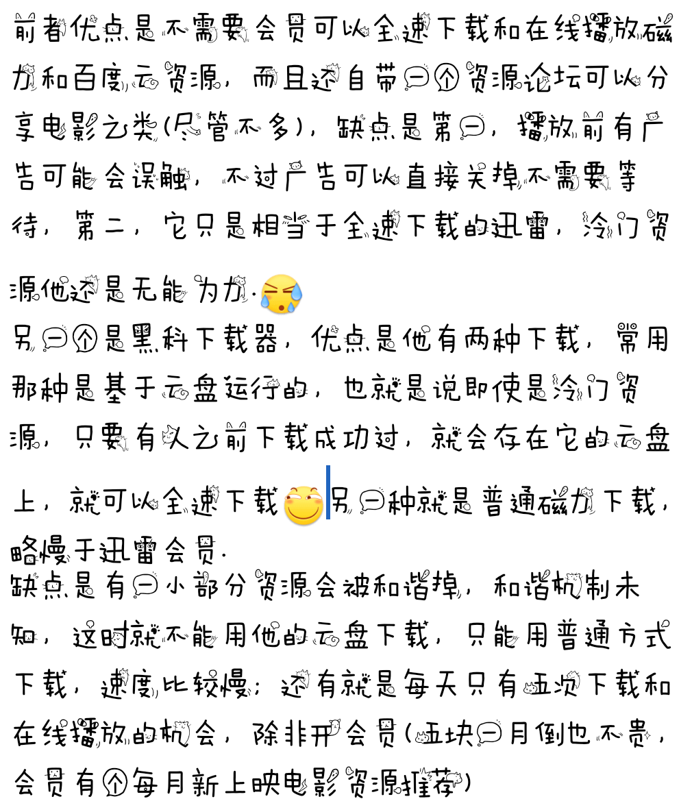

【干货】大佬手把手教你从萌新进化到老司机
* * *
13级留念  
算是我给吧里留下了点东西  
包括如何求动漫原图、如何求番名以及找资源等等司机基本车技   
穹妹镇楼 

  

1楼 | 鳥之穹鳴 | 2019-08-24 22:08
* * *
二楼自留。
  

2楼 | 鳥之穹鳴 | 2019-08-24 22:08
    
    2019-08-31 15:03 | 鳥之穹鳴:
    > 重要信息，本楼里很多网页都被辣鸡QQ浏览器和谐掉了，用QQ浏览器的赶快换Chrome/夸克吧
    2019-10-03 13:17 | 鳥之穹鳴:
    > 前排提示，本帖只教如何找资源，以后在我帖子里伸手的直接删帖禁言不解释。你们不配获得帮助。
* * *
本贴发过一次，被吞的太惨，重发一下。
  

3楼 | 鳥之穹鳴 | 2019-08-24 22:08
    
    2019-08-24 22:14 | 鳥之穹鳴:
    > 回复 乔苍◆桑 :没办法，本来这就是冒着敌人的炮火了
* * *
写在前面，本帖会完全包括一个看番/本/gal比较多的司机所需的全部技能，但并不会包括我的所有找物技能，而只是一小部分，第一是因为有些冷门方法麻烦而且用处不大，没必要教；第二是本吧为缘之空吧，缘之空的资源都很好找，我没有必要也没有义务教你找遍全网的本领 (对我就是这么傲娇 )第三是本吧人员成分问题，感谢某大吧的付出，尽管比如前几天一些事处理的不怎么好，至少我受不了，但是无论如何起码我们吧人数是越来越多，气氛也是逐渐热烈了 但这就导致了另一个问题，人多了不可避免的制杖就多，所以如果我把一些很好用但是可能比较那啥的网站传上来，不可避免的会有孤儿乱用导致被炸掉。
  

4楼 | 鳥之穹鳴 | 2019-08-24 22:09
    
    2020-05-25 00:26 | 穹即来世º:
    > em，完了，我觉得这么傲娇很可爱怎么办⁄(⁄ ⁄ ⁄ω⁄ ⁄ ⁄)⁄
    2020-05-30 21:06 | 一方通行℃℃:
    > 啊这
* * *
对某些新人的友好，就是对老司机的残忍。  
这个我是无数次体会过的。我这两年至少见证了五个贼良心的各种网站被搞掉。我不想成为这种糟心事的始作俑者。  
再比如我发的那个资源贴，有多少人直接把链 接发上来？知不知道这会给资源蓝链造成极大的危险，很可能直接就被吞了？一个一个删帖封禁我很忙的。请大家以后不要增加我的工作量了   
话不多说直接开始。  
慢更。
  

5楼 | 鳥之穹鳴 | 2019-08-24 22:09
* * *
先教最基本的。  
文件分享一般有两种形式，一种是百度云，一种是磁力。  
当然也有上古方式比如howfile、城通网盘(基本废弃)、115(已关闭分享链接功能)、360盘(已关闭)和歪果的mega盘之类，比较少见，就不赘述了。
  

6楼 | 鳥之穹鳴 | 2019-08-24 22:09
    
    2020-03-25 14:47 | 鳥之穹鳴:
    > 回复 6穹妹是我的9 :蓝奏云也是一个网盘，有一部分司机会用，不过我是懒得用
* * *

  

7楼 | 小萝莉的胖次🍁 | 2019-08-24 22:12
* * *
前排
  

8楼 | 小萝莉的胖次🍁 | 2019-08-24 22:13
* * *
车技娴熟，告辞另外网站不要发了吧
  

10楼 | 有個變態姐姐💫 | 2019-08-24 22:14
* * *
需要说明的一点，由于老司机一般不会直接放链，很多蓝链都在图片中需要手打，很多眼神欠佳的人会打错，然后就以为链接失效。  
打错和链接失效的显示是不一样的。打错的话因为你打的这个链接不存在这个链接，显示的一般是页面不存在，而链接失效显示的一般是“你来晚了，文件已取消”或者“文件违规”。分别如下图。 

  

11楼 | 鳥之穹鳴 | 2019-08-24 22:15
    
    2019-09-08 14:28 | 有点累Ω:
    > 我想知道楼主这两个示范文件是什么
    2019-09-08 14:40 | 鳥之穹鳴:
    > 回复 有点累Ω :都失效了还有个屁用
    2019-09-08 14:42 | 有点累Ω:
    > 回复 鳥之穹鳴 :我只是觉得这两个东西应该很有意思
    2019-12-10 09:55 | 🍁Inori🍁:
    > 清华，太强了
    2019-12-10 09:58 | 鳥之穹鳴:
    > 回复 有点累Ω :一个是音乐合集一个是某本子来着好像
    2021-01-05 18:01 | 我不正常♬:
    > 真清华?
* * *
惨 又得重发
  

13楼 | 战五张 | 2019-08-24 22:21
    
    2019-08-25 13:29 | 在历史中吹风Ω:
    > 楼主真好人，教萌新
    2019-08-25 13:48 | 战五张:
    > 回复 在历史中吹风Ω :对啊还不快谢谢穹鸣哥
    2019-08-25 13:52 | 在历史中吹风Ω:
    > 回复 战五张 :我不是萌新啊，在我来这个吧前我早都知道这些了，等级不能说明问题
    2019-08-25 13:53 | 在历史中吹风Ω:
    > 回复 在历史中吹风Ω :我在贴吧都呆了蛮久了，但是当然比不上关注十几年的大佬
    2019-08-25 13:54 | 战五张:
    > 回复 在历史中吹风Ω :我也没说你是萌新啊
    2019-08-25 13:56 | 在历史中吹风Ω:
    > 回复 战五张 :谢谢穹鸣大佬
    2019-08-25 13:57 | 在历史中吹风Ω:
    > 这是小号，干“正事”的小号
    2019-08-25 13:58 | 战五张:
    > 回复 在历史中吹风Ω :话说在楼中发有经验吗
    2019-08-25 14:00 | 在历史中吹风Ω:
    > 不知道
* * *

  

14楼 | 鳥之穹鳴 | 2019-08-24 22:21
* * *

  

16楼 | 鳥之穹鳴 | 2019-08-24 22:27
    
    2019-11-15 12:24 | plagueLCH:
    > 百度云链接多以1开头
    2020-02-14 15:48 | 最美的穹酱呀▫:
    > 哎呦，不错哦
* * *
两者优劣：  
磁力的优点是永远不会失效，缺点是冷门的磁力下载速度会极慢甚至下不下来。  
度盘的优点是只要开了会员，所有文件都可以以比较高的速度下载，而缺点就是容易失效，而且需要开会员
  

17楼 | 鳥之穹鳴 | 2019-08-24 22:28
    
    2020-07-13 19:32 | 所希望的永恒🌿:
    > 我开了度盘的svip有的时候下载也很慢，有的文件也下载不下来，我猜想是不是下载的人数少了还是其他原因
    2021-01-05 18:02 | 我不正常♬:
    > 我家百度网盘72MB/s
* * *
今晚先更到这吧，我要去20公里拉练了  
我们大学这个地狱难度的军训啊

  

18楼 | 鳥之穹鳴 | 2019-08-24 22:36
    
    2019-08-24 22:57 | -我乱说你也信:
    > 清华大学晚上训练？
    2019-08-24 22:58 | 鳥之穹鳴:
    > 回复 -我乱说你也信 :自己去查查，清华新生有拉练的
    2019-08-24 23:15 | -我乱说你也信:
    > 回复 鳥之穹鳴 :可怕啊，肥宅都是什么来头，人均985，我丢脸了
    2019-08-24 23:22 | -我乱说你也信:
    > 回复 鳥之穹鳴 :学什么专业呀。是不是人工智能之类的？
    2019-08-25 13:33 | 在历史中吹风Ω:
    > 现在才知道楼主这个老司机竟然是大学生，而且还是清华大学的。。
    2019-08-27 13:40 | 悠远的苍穹-1:
    > 本以为同是废柴死宅结果现在当个肥宅都....
    2019-08-27 14:03 | 神之殤99:
    > 哈哈哈加油
    2019-08-27 18:59 | 鳥之穹鳴:
    > 回复 在历史中吹风Ω :怎么说话的，我这叫大佬不叫司机
    2019-08-27 18:59 | 鳥之穹鳴:
    > 回复 悠远的苍穹-1 :谁说我是死宅的？
    2019-08-27 20:58 | 在历史中吹风Ω:
    > 回复 鳥之穹鳴 :放屁！明明就是大佬司机
    2019-08-27 20:58 | 在历史中吹风Ω:
    > 回复 鳥之穹鳴 :放屁！明明就是大佬司机
    2019-08-28 13:01 | 悠远的苍穹-1:
    > 回复 鳥之穹鳴 :我看咱们这吧每天发帖都是求妹妹怎么功略自己妹妹的所以我以为这个吧就是个死宅聚集地每天幻想妹妹好奇怪
    2019-08-28 23:01 | 漆黑烈焰使V🌟:
    > 我就是个死肥宅
    2019-08-29 13:17 | 在原七海c-:
    > 行吧，人均985，我给吧丢脸了
    2019-09-08 14:31 | 有点累Ω:
    > 大佬来张与抱枕在校门下合影我就信
    2019-09-19 19:55 | 鳥之穹鳴:
    > 回复 有点累Ω :回头搞一张
    2019-12-17 09:10 | 有人抢我名字55:
    > 同大一诶(･∀･)！等等，你清华的？！让我静静。。。
    2020-04-20 16:05 | -久睡成瘾-:
    > 回复 鳥之穹鳴 :楼主什么专业
    2020-04-22 03:26 | 彭千瑞没有妹妹:
    > 我给吧里丢脸了
    2020-05-24 18:53 | 缘吧成员1号🌈:
    > 我给吧里丢脸了
    2020-05-30 21:08 | 一方通行℃℃:
    > 我。。。。。。不配
    2020-06-29 19:12 | 月下残影moon:
    > 我连给吧里丢脸都不配……
    2021-01-05 18:05 | 之北Ω:
    > 居然是清华的大佬
* * *
前排
  

22楼 | 叶皇- | 2019-08-24 22:59
* * *
只要是正经番的资源会不好找?说白了有些人就是懒，伸手伸习惯了
  

23楼 | 佛系冰水 | 2019-08-24 23:03
    
    2020-01-13 10:36 | 喜欢蕾姆人好多:
    > 正经的我都快堆满半个盘了，gal一个盘，那啥倒是收集不多，感觉网盘炸裂越来越快了
* * *
清华毕竟是🇨🇳top学习的同时身体不能垮了
  

24楼 | ♤廻世行者♤ | 2019-08-24 23:05
* * *
前来支持
  

25楼 | Limitlº | 2019-08-24 23:20
* * *

  

27楼 | 苍穹之末º | 2019-08-24 23:43
* * *

  

30楼 | 有信仰的盗贼😈 | 2019-08-25 00:59
* * *
百度就行了。
  

31楼 | 路过的空我♬ | 2019-08-25 02:28
* * *
爬虫
  

32楼 | 🌐網上沖浪 | 2019-08-25 02:37
    
    2020-04-12 15:23 | -Rifs-:
    > 爬虫学得好 牢饭吃到饱
    2020-05-04 15:42 | 一拳轰穿尼🐴🍺:
    > 爬虫学的好，坐牢做的早
    2020-05-04 15:45 | 云墨吟风💤:
    > 爬虫学的好，坐牢做的早
    2020-05-24 18:54 | 缘吧成员1号🌈:
    > 爬虫学得好，坐牢做到老
* * *
我要死了  
十点前我不会回话的

  

33楼 | 鳥之穹鳴 | 2019-08-25 04:48
    
    2019-08-25 19:53 | 浮影的心:
    > 图没了，我就没来得及保存，想再重温一遍的
* * *
dd
  

34楼 | 拆则繁 | 2019-08-25 05:40
* * *
感谢小吧
  

35楼 | 拆则繁 | 2019-08-25 05:40
* * *
留名，感谢小吧
  

36楼 | 我不能侮辱你 | 2019-08-25 09:48
* * *

  

38楼 | 🐶Cloud | 2019-08-25 10:33
* * *
感谢小吧
  

39楼 | 繁花落尽几时歌 | 2019-08-25 10:37
* * *
游戏动漫资源都有的我是不会在意的
  

40楼 | 予独爱穹ლ | 2019-08-25 11:21
    
    2019-08-25 11:53 | 鳥之穹鳴:
    > 确实是面相新手，大佬级技能我是不会教的
    2019-08-27 14:04 | 神之殤99:
    > 回复 鳥之穹鳴 :你是大佬的大佬
* * *
暖
  

41楼 | 飞行荷兰人☜ | 2019-08-25 13:54
* * *
氵
  

46楼 | 安哥拉绒兔 | 2019-08-25 14:36
* * *
啧啧啧，好评
  

48楼 | 風与天空- | 2019-08-25 15:55
* * *
以上是最基本的技能，也是多数人可以无师自通的  
没打过草稿，所以想起什么说什么了今天太忙了
  

49楼 | 鳥之穹鳴 | 2019-08-25 16:11
* * *

  

50楼 | 鳥之穹鳴 | 2019-08-25 18:43
    
    2019-08-27 19:15 | Rio✆:
    > 为什么我人在外国了还是访问不了？非得加速器是吧
    2019-09-08 12:35 | 鳥之穹鳴:
    > 回复 Rio✆ :可能你用中国的电话卡还是中国的网吧
    2019-12-26 12:02 | 小高😢:
    > 大佬 可以稍稍推荐几个吗
    2019-12-26 14:57 | 鳥之穹鳴:
    > 回复 小高😢 :这个不方便，比较敏感
    2020-03-24 09:56 | 事不过三兄º:
    > 现在不好找了啧啧啧
    2020-03-24 10:31 | 鳥之穹鳴:
    > 回复 事不过三兄º :之前好用的那几个现在仍然好用，不过确实这行被打压的太严重了
* * *
dd
  

51楼 | GHC-º | 2019-08-25 20:32
* * *
你怎么能教坏他们呢
  

52楼 | 1351586109 | 2019-08-25 20:34
* * *

  

53楼 | 巴塞罗那☞Ω☜ | 2019-08-25 22:35
    
    2020-04-12 15:25 | -Rifs-:
    > 这不是那谁吗
* * *
资源贴被删了。
  

54楼 | -daze | 2019-08-26 00:11
* * *
一天更一张图

  

55楼 | 战五张 | 2019-08-26 00:25
    
    2019-12-10 16:51 | 战五张:
    > 谁踩的我知道是你 过这么久就为了猜我一脚
    2020-04-29 01:26 | 奇怪的贩卖机🍀:
    > hhhhhhhhh
* * *
dd
  

56楼 | 哦一样兔儿童 | 2019-08-26 00:35
    
    2021-01-05 18:06 | 之北Ω:
    > 偶遇奈绪吧吧主
* * *
实话说，把资源分享吧，又有种ntr的感觉，还有些白嫖怪，谢谢都没说，拿了资源就删好友...不分享吧，想到以前我找的时候很辛苦，几乎都是要钱的，又不忍心。(同时能装大佬的感觉很兴奋)
  

57楼 | MLYKXC | 2019-08-26 01:02
    
    2020-03-21 00:20 | 进击的萌新😂:
    > 和那些有一点资源的人换就好了，这样双方都不亏。毕竟资源又不是我下载了别人的就没了
    2020-08-19 18:17 | 考虑考把控虑吧:
    > 关键是有人拿了反手一个举报
* * *
资瓷一哈
  

58楼 | 习惯孤独🌌 | 2019-08-26 13:50
* * *

  

59楼 | 鳥之穹鳴 | 2019-08-26 19:43
    
    2019-08-27 19:16 | Rio✆:
    > ios能用吗
    2019-10-02 14:04 | 鳥之穹鳴:
    > 回复 Rio✆ :我记得可以
    2019-11-15 12:23 | plagueLCH:
    > 某雷：敏感资源无法加速
    2019-11-15 12:33 | 鳥之穹鳴:
    > 回复 plagueLCH :你不说这个我都忘了，好多年不用迅雷了
    2019-11-15 12:34 | plagueLCH:
    > 回复 鳥之穹鳴 :一直用黒科和闪电?好像最近闪电速度不咋样了
    2019-11-15 12:40 | 鳥之穹鳴:
    > 回复 plagueLCH :还行吧，我最近就没太用磁力，只推了几个黄油
    2020-03-03 00:13 | Platon◆:
    > 请问大佬为什么我用黑科下载器有相当一部分磁链都显示需要排队解析？这种时候要怎么办？
    2020-03-03 10:08 | 鳥之穹鳴:
    > 回复 Platon◆ :等呗他的原理就是他自己先下载到他那里然后你再从他那里下载
    2020-03-18 02:55 | TGV♀:
    > 闪电现在好像已经暴毙了，最近已经用不了了
* * *
以上都是比较基本技能，下面教求图等等进阶车技
  

60楼 | 鳥之穹鳴 | 2019-08-26 19:45
* * *
顶，支持LZ
  

61楼 | Alanni℃ | 2019-08-26 20:02
* * *
周边贴不更了？
  

62楼 | wps- | 2019-08-26 20:09
    
    2019-08-26 20:30 | 鳥之穹鳴:
    > 正在尝试发出不被吞的方法
    2019-08-26 20:30 | 鳥之穹鳴:
    > 
    2019-08-26 20:44 | 鳥之穹鳴:
    > 更了
    2019-08-26 20:48 | wps-:
    > 回复 鳥之穹鳴 :
* * *
今晚太懒了，明天再发吧
  

63楼 | 鳥之穹鳴 | 2019-08-26 22:59
    
    2019-08-27 13:23 | 源氏空♬:
    > 回复 鳥之穹鳴 :楼主看看私信可好，叫你那么久🥺
    2019-08-27 17:28 | 鳥之穹鳴:
    > 回复 源氏空♬ :问题是你光发个嘿嘿，我要回什么起码把你想干什么告诉我啊
    2019-08-27 20:42 | 源氏空♬:
    > 回复 鳥之穹鳴 :不会吧，发嘿嘿前面还有许多内容的，被度娘吞了?那我重发下
* * *

  

64楼 | 藤原拓海🌳 | 2019-08-26 23:06
* * *
但在功能与服务上迅雷仍然还是最强大的（没VIP除外）比如处理死链 所以有钱（凯子）还是用迅雷更优
  

65楼 | 战五张 | 2019-08-26 23:54
    
    2019-08-27 19:02 | 鳥之穹鳴:
    > 这可能就是你我接触范围大小不同的问题了，对付冷门资源迅雷就是个废·物，他确实不能说是最强的
* * *
dd
  

66楼 | 夜寒-酱 | 2019-08-27 13:33
* * *
再更新一波。  
大佬和萌新的区别其实主要就在网站和APP持有量不同  
下面开始教如何搜图。
  

68楼 | 鳥之穹鳴 | 2019-08-27 19:06
* * *
搜图网站主要有以下这么几个：s a u c e n a o,t i n e y e,谷歌识图和百度识图。什么360,搜狗之类的就算了吧.  
以下一个一个介绍。
  

69楼 | 鳥之穹鳴 | 2019-08-27 19:09
* * *
嚯，赶上直播还行
  

72楼 | Rio✆ | 2019-08-27 19:17
* * *
先从大家最熟悉的开始。  
百度识图：主要是识别相似的图，不论清晰度，不如说绝大多数是低清的，搜到原图的可能性基本为零。  
不过百度识图有一个比较好的作用就是他可以通过一张图的一部分搜到完整的图。这个有点可以和其他网站结合并加以利用。  
图片是幻影坦克不这样我发不出去

  

73楼 | 鳥之穹鳴 | 2019-08-27 19:22
    
    2020-04-14 15:08 | 汐山▫凉音:
    > 大佬，这种怎么看原图
* * *

  

74楼 | 夜寒-酱 | 2019-08-27 19:34
* * *

  

75楼 | 咕噜灵波✨ | 2019-08-27 19:34
    
    2019-08-27 19:49 | 鳥之穹鳴:
    > 大佬你来啦
    2019-08-27 20:01 | 咕噜灵波✨:
    > 回复 鳥之穹鳴 :
* * *

  

76楼 | 皮鸽鸽🌚 | 2019-08-27 20:03
* * *

  

77楼 | 玄十三月 | 2019-08-27 21:04
* * *
dd
  

78楼 | POLOº | 2019-08-27 21:28
* * *
大佬我想问一下，现在howfile要怎么用  
网上拿的链点不进去，翻出去找也没办法注册。  
想知道是网站问题还是我的网络问题
  

79楼 | airt1589 | 2019-08-27 21:55
    
    2019-08-27 22:44 | 鳥之穹鳴:
    > 基本废弃了vivo自带的浏览器偶尔可以下载你转战别的资源站吧有什么找不到的问我要吧
    2019-08-27 23:11 | airt1589:
    > 回复 鳥之穹鳴 :这件事起因是上个月我在熊猫上看到别人发了个合集链接，当时没登上然后熊猫关了忘了链最近又想到了就去找方法，然后检索到了这个贴子就来问一下。现在知道它用不了就足够了回头再去别的地方找资源
    2019-08-27 23:28 | 鳥之穹鳴:
    > 回复 airt1589 :小文件还行，大文件想都不要想系统已经关了，你想充都不行会员
* * *
然后是谷歌；  
谷歌能力远强于度娘，不如说后者现在的垄断完全就是因为前者退出了而已  
可惜谷歌也主要是搜三次元图，因为二次元主要是发在各大图站上，只有少部分首发在推上和B站上，而多数网站是搜不到图站的图的，所以谷歌也基本只能搜到这一小部分图。  
by the way，谷歌识图手机版没有以图搜图功能，需要去电脑版网页找  
t i n e y e的话以前属于强于百度但弱于谷歌的，还算好用，但是现在好像被墙了，相比Google就没有半点竞争力了  
图片仍然是幻影坦克，自己打开

  

80楼 | 鳥之穹鳴 | 2019-08-27 23:29
* * *
赶上直播这些东西多逛逛拱坝和打牌吧就学会了
  

81楼 | 风-名 | 2019-08-27 23:36
    
    2019-08-27 23:39 | 鳥之穹鳴:
    > 打牌吧都亡了
* * *
重头戏(其实基本上搜图网站这一个就够了)：s a u c e n a o  
这个搜图网站搜索的数据库主要是各大二次元图站，所以搜动漫原图贼方便，因为绝大多数画师是直接把原图上传到各大图站的  
楼下示范具体用法 

  

82楼 | 鳥之穹鳴 | 2019-08-28 22:10
    
    2020-02-14 14:21 | 悠远的苍穹-1:
    > 知道了完美
* * *
s a u c e n a o利用的图站主要有这么几个:  
p i x i v  
d a n b o o r u  
g e l b o o r u  
y a n d e.r e  
s a n k a k u ……  
有意思的是国内一个主攻二次元cos和插画的网站半次元也被列入了。  
还有就是各大galgame的官网，不过这些官网的图片下载不下来。  
以下用三张例图分别说明。
  

83楼 | 鳥之穹鳴 | 2019-08-28 22:25
    
    2019-08-28 22:38 | 鳥之穹鳴:
    > 忘了加，还有一个k o n a c h a n
* * *
补截图: 

  

89楼 | 鳥之穹鳴 | 2019-08-28 22:53
* * *
剩下的图站的相关搜图以缘之空一张比较著名的版权绘为例:  
搜索结果如下图截屏。  
右边几个小图标从上向下分别代表d、y、g、s、k站。  
点那个小图标就可以进入相关源网页。 

  

90楼 | 鳥之穹鳴 | 2019-08-28 22:55
* * *
d:界面很友好，可以用各种萌属性(比如双马尾、飞机场)搜图，下图片也快。  
我比较常用这个。 

  

93楼 | 鳥之穹鳴 | 2019-08-28 23:09
    
    2019-12-09 23:04 | plagueLCH:
    > 大佬，你这些是在手机上搜的吧。我怎么好像没发现上传图片的地址是只能用文字搜吗
    2019-12-09 23:08 | 鳥之穹鳴:
    > 回复 plagueLCH :这个站没有以图搜图
    2019-12-09 23:10 | plagueLCH:
    > 回复 鳥之穹鳴 :是不是只能那个sau可以啊
    2020-05-25 01:04 | 穹即来世º:
    > 翻墙什么的大概英语一定要很好叭（衰<(。_。)>）
* * *
g站:界面不怎么友好，国内加载速度又慢，我几乎没用过 

  

94楼 | 鳥之穹鳴 | 2019-08-29 07:00
* * *
y站:界面也友好，下载速度也不算慢，主要是有很多成套的画集，图片质量很高，我现在主要用这个。下载的图片文件名还包括图中各种属性。(d站也是) 

  

95楼 | 鳥之穹鳴 | 2019-08-29 07:02
    
    2019-11-17 00:24 | 雨露星空1:
    > D站不是dilidili吗？
    2019-11-17 00:26 | 鳥之穹鳴:
    > 回复 雨露星空1 :说了只是放和谐用首字母代替这些图站嘛，不是说正常的那些站
    2019-11-17 01:03 | 雨露星空1:
    > 奥。。。，知道了
* * *
y站有很多成套的画集扫图/dl图，下载很方便，比如这个缘之空gal的特典画集 

  

96楼 | 鳥之穹鳴 | 2019-08-29 07:06
    
    2019-09-05 05:46 | 夜寒-酱:
    > yandere。。病娇啊
    2019-11-06 21:52 | 第二虚空◆:
    > 这网站我居然就去过，贴吧百度识图找到过这个网站，但很不稳定，可能是浏览器问题，那时候烦死我了
    2019-11-06 21:55 | 鳥之穹鳴:
    > 回复 第二虚空◆ :应该是浏览器问题。还有这网站确实慢点，用梯 子比较快
* * *
k站:和y站一模一样，唯一区别是有广告

  

97楼 | 鳥之穹鳴 | 2019-08-29 07:07
    
    2019-09-08 12:08 | 悠远的苍穹-1:
    > 学渣留下了无助的眼泪完全看不懂这些英语
    2019-09-08 12:42 | 鳥之穹鳴:
    > 回复 悠远的苍穹-1 :这点英语都看不懂么
    2019-09-08 13:26 | 悠远的苍穹-1:
    > 英语课都是睡过来的
    2019-09-08 13:27 | 悠远的苍穹-1:
    > 我忽然有点想日语或则英语了大佬那个比较实用
* * *
s站:广告更多不过图片也多，很多图片只有它有 

  

98楼 | 鳥之穹鳴 | 2019-08-29 07:08
* * *
以上是各大图站。
  

99楼 | 鳥之穹鳴 | 2019-08-29 07:09
    
    2019-08-29 13:14 | 日月星辰MXY:
    > 话说浏览器插件有去广告功能的吧？
    2019-08-29 13:59 | 鳥之穹鳴:
    > 回复 日月星辰MXY :去不干净的，哪怕是夸克也去不干净的
* * *
s a u c e n a o更好的一点是他可以通过完整的里番截图搜到名字和播放位置  
楼下这个例图有没有大佬认识或者看过gal改的，也算经典作了

  

100楼 | 鳥之穹鳴 | 2019-08-29 07:11
    
    2019-09-08 11:57 | 悠远的苍穹-1:
    > 还可以找里番怀疑你果然开车
    2019-09-08 15:34 | 鳥之穹鳴:
    > 回复 悠远的苍穹-1 :还用怀疑我发这个帖子最开头就说了我是在开车以及教你们开车 
    2019-12-13 16:55 | 鳥之穹鳴:
    > 回复 乔苍◆桑 :没试过不知道，普通的用whatanime呗
    2020-03-21 00:31 | 鳥之穹鳴:
    > 回复 进击的萌新😂 :可以的，我之前也用这种方法
    2020-03-21 00:46 | 进击的萌新😂:
    > 回复 鳥之穹鳴 :换手机可以解决那只熊猫吗？看了一下我的那个APP有熊猫。我还傻傻的在找里站
    2020-03-21 08:51 | 鳥之穹鳴:
    > 回复 进击的萌新😂 :把那个浏览器删除应用数据或者卸载重装，还有一少部分浏览器不支持的，因为cookie是和个人信息有关的，所以会有一部分浏览器禁止，比如Chrome canary
* * *
先收藏
  

101楼 | 乐事薯片ლ | 2019-08-29 07:17
* * *
lz辛苦了
  

102楼 | Hik-N▫ | 2019-08-29 08:43
* * *
只有我看成了大佬手把手教你从萌新进化到老司机13级么
  

103楼 | 滑滑蛋♬♬ | 2019-08-29 08:47
    
    2019-08-29 12:16 | 鳥之穹鳴:
    > 水贴谁不会
    2019-08-29 12:27 | 滑滑蛋♬♬:
    > 回复 鳥之穹鳴 :
* * *
收藏了，谢谢楼主
  

104楼 | 薄樱747 | 2019-08-30 13:30
* * *
我们晚上上课来着，一会更吧😅
  

105楼 | 鳥之穹鳴 | 2019-08-30 19:00
* * *
车技NB
  

107楼 | djxxhxd | 2019-08-30 19:09
    
    2019-08-30 19:11 | 鳥之穹鳴:
    > 这算什么车技这都是最基本操作进阶的我不准备放
    2019-09-08 11:55 | 悠远的苍穹-1:
    > 翻墙翻过去了也看不懂
    2019-09-08 11:55 | 悠远的苍穹-1:
    > 翻墙翻过去了也看不懂
* * *
浏览器有些网址打不开怎么办。大佬求助。
  

108楼 | 谭真成神 | 2019-08-31 15:00
    
    2019-08-31 15:02 | 鳥之穹鳴:
    > QQ浏览器吧，那辣鸡，换浏览器
* * *
不收学费吗
  

110楼 | 安乐冈入川▫ | 2019-08-31 18:16
    
    2019-08-31 20:01 | 鳥之穹鳴:
    > 你要肉偿也不是不可以
    2019-09-01 15:04 | 安乐冈入川▫:
    > 回复 鳥之穹鳴 :好可怕哦哥哥
* * *

  

111楼 | 🌿春日野穹 | 2019-09-01 23:38
* * *
果然是大佬呢
  

112楼 | 诗诺诺▫ | 2019-09-02 01:59
* * *
后排
  

113楼 | 不入尘世♬ | 2019-09-05 01:53
* * *
我等了一会发现一个星期过去了，于是就氵了一下
  

114楼 | 苏雨尘♬ | 2019-09-06 09:48
* * *
人呢
  

115楼 | 人心淡影 | 2019-09-06 11:44
* * *
厉害了呢
  

116楼 | 悠远的苍穹🔯 | 2019-09-06 12:26
* * *
水死了吧
  

117楼 | dede神 | 2019-09-07 17:22
* * *
大佬求教，怎么搞游戏？
  

118楼 | 道法自然2233 | 2019-09-07 18:42
    
    2019-09-07 19:22 | 鳥之穹鳴:
    > 等下就讲到了
* * *
不好意思前几天军训去了我这就开更  
你鸟鸽鸽骗过你吗
  

119楼 | 鳥之穹鳴 | 2019-09-07 21:25
    
    2019-09-14 23:13 | 日月星辰MXY:
    > 楼主鸽了几天了，咕咕咕？
    2019-10-07 23:26 | 悠远的苍穹-1:
    > 咕咕咕
* * *

  

120楼 | 荆棘蓝蔷薇º | 2019-09-07 22:22
* * *
前排
  

121楼 | 我永远喜欢穹👀 | 2019-09-08 11:58
* * *
我想要资源❌我也想当大佬✔️
  

122楼 | 🌿骨科先锋🍁 | 2019-09-08 12:45
* * *
会等到资源吗
  

124楼 | 123929好 | 2019-09-12 21:53
    
    2019-09-13 18:03 | 鳥之穹鳴:
    > 会的，最近风头紧，过去了再说
* * *
资刺
  

125楼 | 人形师👻 | 2019-09-13 21:19
* * *
果然是鸟鸽鸽 鸽子精
  

127楼 | 安乐冈入川▫ | 2019-09-16 22:45
* * *
实在不好意思，学业过于繁忙😅  
更重要的是这几天抓的太紧，我很多贴都被吞了  
今晚补一个找番的网站:w h a t a n i m e  
网址见幻影坦克  
对于这个站还有个有意思的历史，他的网站名本来就叫w h a t a n i m e.g a的，后来服务器炸了，换了现在这个网址  
这个站的功能相当强大，可以通过任何一张基本完整的动漫截图找到出处，包括动漫名字、播放位置，而且位置是精确到第几季几集几分几秒的，屡试不爽。  
下面放例子。 

  

128楼 | 鳥之穹鳴 | 2019-09-17 20:49
    
    2020-08-08 15:13 | 笔273k👀:
    > 幻影坦克是什么
    2020-08-08 22:19 | 鳥之穹鳴:
    > 回复 笔273k👀 :自己百度
* * *
使用:以渡老贼笔下的两位妹妹千种明日叶和比企谷小町为例:见下图  
上传截图，点击search，结束。  
相关信息就会以相关度排序在下面显示。  
最近这个站功能更新了，搜索的时候会看到出处前后的一小段gif格式的内容，比如第一张明日叶的图搜索时就会有，甚至会告诉你片源名字(下面那一行灰色英文)。 

  

129楼 | 鳥之穹鳴 | 2019-09-17 21:07
* * *
静可爱 

  

130楼 | 鳥之穹鳴 | 2019-09-17 22:46
    
    2019-10-08 11:06 | 悠远的苍穹-1:
    > 这是春物吗感觉好像也可能是我忘了
    2019-10-08 11:47 | 鳥之穹鳴:
    > 回复 悠远的苍穹-1 :当然是，平冢静，第二季画风
    2019-10-08 13:22 | 悠远的苍穹-1:
    > 哪个老师吧春物好像快出第三季了
    2019-10-08 13:23 | 鳥之穹鳴:
    > 回复 悠远的苍穹-1 :当然，渡鸽鸽也快完结小说了
    2019-10-08 13:32 | 悠远的苍穹-1:
    > 回复 鳥之穹鳴 :听说不是去打麻将了吗
* * *
但是有时候由于截图有多张别的截图与之相似，可能搜起来比较难。以下面这张静可爱的截图为例。  
这张图反而是带黑边的更好用

  

131楼 | 鳥之穹鳴 | 2019-09-17 22:47
* * *
dd
  

132楼 | 天龙的帝国 | 2019-09-19 19:21
* * *
整点ACG网就好了
  

133楼 | 💞洛茵洛茵💕 | 2019-09-19 19:36
    
    2019-09-19 19:42 | 鳥之穹鳴:
    > 那个虽然我有一大堆但是看看再说吧，我也说过这个帖子是所有人都能看的，不可避免会有孤儿搞事情
    2019-09-19 19:43 | 💞洛茵洛茵💕:
    > 回复 鳥之穹鳴 :我又不要整，我怎么可能缺这个，我的意思是，自己找很快的，究极巨婴伸手党谁管
* * *
催更催更
  

134楼 | 日月星辰MXY | 2019-09-21 13:11
* * *
缘之空的留级生是谁啊，我连官方群都进不去
  

135楼 | ABJJJZLX | 2019-09-25 20:17
    
    2019-09-26 10:20 | 按时阿大声道:
    > 亮平
* * *

  

136楼 | 取名为1 | 2019-09-27 10:05
* * *
催更催更
  

137楼 | 日月星辰MXY | 2019-09-28 09:03
    
    2019-09-28 09:07 | 鳥之穹鳴:
    > 让我先考虑考虑什么该放出来有的东西不传外的
    2019-09-29 17:42 | 日月星辰MXY:
    > 回复 鳥之穹鳴 :私信分享一下那些不能外传的呗
* * *

  

138楼 | 萘世凛🌿 | 2019-09-28 09:29
* * *

  

139楼 | ✨时间的魔法✨ | 2019-09-29 00:31
* * *
顶顶
  

141楼 | project2453 | 2019-09-30 10:34
* * *

  

142楼 | aptt486 | 2019-09-30 11:13
* * *
楼主是最良心的大佬了脾气贼好回答都很耐心他喜欢的是整个缘之空愿意吧自己花几千元买的光碟来分享也愿意花大量时间来做攻略贴 贴里大部分攻略贴都是他做的（虽然被吞了好多）
  

143楼 | 你不经世的慌º | 2019-10-01 09:13
* * *

  

146楼 | 是咕哒子啊♬ | 2019-10-03 16:36
* * *
一个没有妹妹的无情氵b转身离去
  

147楼 | 吃牛排打桥牌🐶 | 2019-10-05 08:02
* * *
发送成功经验＋3  
  

148楼 | 吃牛排打桥牌🐶 | 2019-10-05 12:07
* * *
冒泡
  

149楼 | 慕尚丶殇 | 2019-10-05 20:24
* * *
那游戏下载地址在哪里呢 帖子看完了还是一脸懵 求大佬别骂 真的啥也不懂
  

150楼 | 婷婷呢_ | 2019-10-05 23:08
    
    2019-10-05 23:26 | 鳥之穹鳴:
    > 本来有资源贴的，最近戒严删了，过几天就重新开一个
* * *
催更催更
  

151楼 | 日月星辰MXY | 2019-10-06 17:31
* * *
再回来更一波  
你鸟鸽鸽骗过你吗
  

153楼 | 鳥之穹鳴 | 2019-10-07 22:29
* * *
YosuganoSora是缘之空的罗马音。  
因为各种文件限制绝大多数汉化组出的资源不会用日文名字，都会有罗马音。
  

156楼 | 鳥之穹鳴 | 2019-10-07 23:01
* * *
GB/Big5、tc/sc:这个指字幕的繁简。  
GB:国标，指简体国语。  
Big5:又称为大五码或五大码，是使用繁体中文（正体中文）社区中最常用的电脑汉字字符集标准。  
其实就是繁体中文。  
tc:Traditional Chinese,繁体  
sc:Simplified Chinese,简体。
  

159楼 | 鳥之穹鳴 | 2019-10-07 23:12
* * *
捕获更新！赞！
  

160楼 | 神猪🐷猪人 | 2019-10-08 00:26
* * *
感谢小吧
  

161楼 | 咸鱼玩家℃ | 2019-10-08 11:48
* * *
感谢科普
  

162楼 | 飞翔的小牛哟 | 2019-10-08 11:52
* * *
以在地下城寻求邂逅是否搞错了什么为例:第一、三张是BD原盘截图，第二、四张是BD Rip截图。  
手机肉眼观看几乎没有区别。 

  

163楼 | 鳥之穹鳴 | 2019-10-09 13:23
* * *
lz昨天做了个眼部的手术，最近更得可能会慢一点(虽然前几天也没多快)。过几天恢复了爆更一下。
  

164楼 | 鳥之穹鳴 | 2019-10-10 16:50
* * *
AVC/h264/x264、HEVC/h265/x265:视频编码相关参数。h264/265是视频压缩标准，AVC、h264/HEVC/h265是应用该标准的视频/软件。  
定义历史之类的详细信息自己找Wikipedia/百度百科或者贴吧知道之类的地方吧，我懒得码字，我现在也码不了字。  
简单来说，x265比x264有更高的压缩率，亦及携带更好的画质、码率。举例来说，一集普通的20min的番，1080p,其他参数相同的情况下，AVC压制大约需要600M到1G大小，而HEVC压制只需二三百兆。  
画质理论上x265更好，但实际应用其实看不太出来，因为平时用的显示器本身就支持不了多高的画质。手机肯定是一点都看不出来了，连我的xps15那张RGB全都点满的4k屏也不怎么看得出来。
  

165楼 | 鳥之穹鳴 | 2019-10-10 17:11
* * *
萌新技能篇
  

166楼 | ▫rnsar | 2019-10-10 17:20
* * *
不过我存了2份资源
  

167楼 | ▫rnsar | 2019-10-10 17:21
* * *
AAC/FLAC:音轨格式。  
AAC是用于代替MP3的格式，FLAC就是大家熟悉的那个flac。  
前者是有损压缩，后者是无损压缩，从技术层面本质上有区别。  
前面那一堆画质参数不同的视频我看不出来，但是音轨不同我是真的能听出来区别的。耳机n5005，电脑xps15，播放器potplayer的环境下，蓝光和普通压制1080p的缘之空一耳朵区别。  
不过我听音乐很久没听过CD抓轨之外的音乐了，所以我现在不知道AAC、MP3、flac什么的有没有区别。
  

168楼 | 鳥之穹鳴 | 2019-10-10 17:24
* * *
养伤的话就慢点吧，不急的，把自己安顿好了再说
  

169楼 | 悠丶綠茶🍁 | 2019-10-10 17:26
* * *
最后面括号里那一坨东西我也不知道是什么。可能是视频编号或者方便找到字幕文件的。  
  
再就是色准:一般是8bit/10bit,12bit连电影动漫的制作者都极少使用。  
10bit比8bit多四倍的颜色信息。技术层面差距很大但是实际差距不那么大，而且也有很多显示器不支持10bit.
  

170楼 | 鳥之穹鳴 | 2019-10-10 17:33
    
    2020-05-10 02:06 | 普通的名字🌌:
    > 测了一下括号里的值是文件的CRC32校验码
    2020-06-15 17:20 | 鳥之穹鳴:
    > 回复 普通的名字🌌 :谢谢提醒
* * *
还有一点要补充的是:mkv一般比MP4质量高一点，文件大小也是两到三倍。mkv一般封装外挂字幕，MP4都是直接嵌入硬字幕。  
字幕的问题下面解释。
  

171楼 | 鳥之穹鳴 | 2019-10-10 17:33
* * *
总之就是数字越大的越好，但是你的设备未必支持。  
比如说动漫国的无彩限的怪灵世界，因为格式过于先进(或者偏)，连国内能力最强的(手机)播放器暴风影音都播不了，只能用MX Player之类的专业播放器。
  

172楼 | 鳥之穹鳴 | 2019-10-10 17:36
* * *
已收藏 ，大佬
  

173楼 | 未丨暖丨央 | 2019-10-16 23:00
* * *
顶
  

174楼 | 安乐冈入川- | 2019-10-20 00:02
* * *
顶顶，感谢带佬
  

175楼 | 春日野穹-Ω | 2019-10-20 20:28
* * *
谢谢大佬～(￣▽￣～)~  
不过还有吗(≧ω≦)  
我还想看！
  

176楼 | nice12d | 2019-10-20 21:53
    
    2019-10-20 22:12 | 鳥之穹鳴:
    > 有，前几天做了眼部手术，最近不太方便
* * *
干货满满
  

177楼 | new晓晓 | 2019-10-20 22:57
* * *

  

180楼 | 掏鼻手杰克🐒 | 2019-10-23 17:03
* * *
催更催更
  

182楼 | 日月星辰MXY | 2019-10-25 17:01
    
    2019-10-25 20:50 | 鳥之穹鳴:
    > 你催了几次了
    2019-10-25 23:38 | 日月星辰MXY:
    > 回复 鳥之穹鳴 :日常催更
    2019-10-25 23:47 | 鳥之穹鳴:
    > 回复 日月星辰MXY :码字的不是你是吧
    2019-10-25 23:47 | 鳥之穹鳴:
    > 回复 日月星辰MXY :连缘吧都不关注的
    2019-10-26 20:44 | 日月星辰MXY:
    > 回复 鳥之穹鳴 :呃呃，因为这个号不是自己的号，也不敢让朋友看到，所以就没点关注，但是我人在关注就好了，对吗？（唯唯诺诺）
    2019-10-26 20:47 | 鳥之穹鳴:
    > 回复 日月星辰MXY :那无所谓了
* * *
lz眼睛还在恢复，下个周又期中考试，这几天就先鸽了吧 

  

183楼 | 鳥之穹鳴 | 2019-10-25 20:52
* * *
大佬 你该把你你的周边补全计划帖子恢复了 我双十一还指望着通过你的帖子补点周边呢
  

184楼 | jsjdjsjdiea | 2019-10-26 00:10
* * *
百度云不在线解压，不然爆炸
  

185楼 | 第二虚空◆ | 2019-11-06 21:47
    
    2019-11-06 21:47 | 鳥之穹鳴:
    > 肯定的
    2019-11-06 21:56 | 第二虚空◆:
    > 回复 鳥之穹鳴 :幸亏我第一次留血充会员的前几天知道了这事，不然我的视频就都灰飞烟灭了
    2019-11-06 21:56 | 第二虚空◆:
    > 回复 鳥之穹鳴 :好险好险
    2019-11-06 22:00 | 鳥之穹鳴:
    > 回复 第二虚空◆ :也是身正不怕影子斜，你视频没问题就不怕解压
* * *
大佬
  

186楼 | 北川--- | 2019-11-07 12:49
* * *
凳子搬过来 听大佬慢慢讲
  

187楼 | Kurumi💋 | 2019-11-12 17:47
* * *
认真听讲。好好学习
  

188楼 | 穹悠秋空💞 | 2019-11-13 01:16
* * *
厉害
  

189楼 | 尸化-道长 | 2019-11-13 13:39
* * *
看完一脸懵逼，果然我还是太年轻了，楼主大佬，谢谢楼主一片苦心……老司机的路还任重而道远啊
  

190楼 | 魔幻世界Ω凡人 | 2019-11-17 02:16
* * *
以上主要是知识性的车技，让你知道你在下的/看的/用的是什么东西  
晚上开始更一点应用性的车技，让你有方法找到你想要的资源
  

191楼 | 鳥之穹鳴 | 2019-11-21 08:57
* * *
lz该更新了
  

192楼 | 泠衣- | 2019-11-21 22:41
* * *

  

195楼 | Sa🌼kura | 2019-11-21 23:10
* * *
你升级太快了，我才刚一级
  

197楼 | 💧清穗🌿 | 2019-11-24 11:55
    
    2019-11-24 12:05 | 鳥之穹鳴:
    > 你发贴少呗
    2019-11-24 12:08 | 💧清穗🌿:
    > 回复 鳥之穹鳴 :我十分钟前才刚关注这个吧
    2019-11-24 12:08 | 💧清穗🌿:
    > 回复 鳥之穹鳴 :毕竟资源存到U盘里了
    2019-11-24 12:08 | 💧清穗🌿:
    > 回复 鳥之穹鳴 :
* * *
鸟之穹鸣该更新了
  

198楼 | 泠衣- | 2019-11-24 18:56
* * *
小吧飙车飙到失联了
  

199楼 | 泠衣- | 2019-11-25 11:49
* * *
今晚要是有空我就在更一点
  

200楼 | 鳥之穹鳴 | 2019-11-26 16:31
* * *
dd，顺便小吧错字受
  

201楼 | 泠衣- | 2019-11-26 20:14
* * *

  

206楼 | 我不叫雒晓晔▫ | 2019-11-26 23:44
* * *

  

207楼 | 鳥之穹鳴 | 2019-11-27 20:53
* * *

  

208楼 | 鳥之穹鳴 | 2019-11-27 20:53
    
    2020-02-11 21:53 | 汽水罐º:
    > 大佬，图是在209楼吗，好像被吞了诶
    2020-02-11 22:08 | 鳥之穹鳴:
    > 回复 汽水罐º :直接用百度搜索也可以，我下面补一张图吧
* * *

  

210楼 | 鳥之穹鳴 | 2019-11-27 21:07
* * *
关于本子:看本子分为两种方式，在线看和下载看；在线看的方法主要有两种，一个是某粉色软件，一个是E站。  
下面介绍之余就顺便说说这两个东西的用法吧
  

213楼 | 鳥之穹鳴 | 2019-11-27 21:25
* * *

  

214楼 | 鳥之穹鳴 | 2019-11-27 21:33
    
    2019-11-28 00:56 | 悠远的苍穹-1:
    > 大佬辛苦了给大佬递可乐
    2019-11-30 10:19 | sora◆◆:
    > 这个东西很好用
    2019-12-23 22:10 | 鳥之穹鳴:
    > 回复 sora◆◆ :这东西和ehv相比，一点也不好用
* * *

  

215楼 | 鳥之穹鳴 | 2019-11-27 21:49
* * *

  

218楼 | 鳥之穹鳴 | 2019-11-27 22:06
* * *

  

219楼 | 鳥之穹鳴 | 2019-11-27 22:14
    
    2020-04-13 01:47 | 离烽◆:
    > 现在是不是里站上不了了，我连那只熊猫都没看到，不管挂不挂梯子
    2020-04-13 08:06 | 鳥之穹鳴:
    > 回复 离烽◆ :有时候是浏览器的问题，比如Chrome canary就不行，因为里站需要读取cookie，但是cookie可能泄露个人信息，所以一些浏览器不让登
* * *
直播
  

220楼 | 泠衣- | 2019-11-27 22:25
* * *
虽然bika E站漫猫M盘我都有
  

221楼 | 泠衣- | 2019-11-27 22:26
* * *
我记得e 站只要注册账号后等一个星期就能进里站了吧，今年e 站搬完服务器后大概9月我帮人注册了一个账号也是等了一个星期后就能通过APP进里站的
  

224楼 | LONELY◆ | 2019-11-27 22:55
    
    2019-11-27 22:57 | LONELY◆:
    > 至于等一个星期的说法我是听e 站吧老哥说的，也确实等一个星期就能进了
    2019-11-27 22:57 | 鳥之穹鳴:
    > 那应该是极个别情况，我认识的几个人加上我自己注册的小号，可能得有十个了，现在都不能用
    2019-11-27 23:04 | LONELY◆:
    > 回复 鳥之穹鳴 :APP里站进不去可能是设置那的 内置hosts.txt 没开，表站加载的速度纯属看自己网络的速度和梯子的速度
    2019-11-27 23:06 | 鳥之穹鳴:
    > 回复 LONELY◆ :开了也没用，试过
    2019-11-27 23:06 | 鳥之穹鳴:
    > 回复 LONELY◆ :之前南+里讨论过这个问题，至少当时给出的方案是无解
    2019-11-27 23:06 | 鳥之穹鳴:
    > 回复 鳥之穹鳴 :我回头再试试吧
    2019-11-27 23:18 | LONELY◆:
    > 回复 鳥之穹鳴 :如果是单纯的图片无法加载有可能是梯子的问题，e 站好像有一个设定是同IP单日浏览图片过多后直接加载图片错误，换号也没用，除非那账号赞助过。解决办法我只知道有换节点/换梯子/去赞助e 站使当前使用的账号解除IP绑定
    2019-11-27 23:32 | LONELY◆:
    > 刚看了下e 站手机吧居然炸掉了还行，现在连原帖都找不到了
    2019-11-27 23:52 | 鳥之穹鳴:
    > 回复 LONELY◆ :不是那个问题，我用的梯子很可靠，而且还换过几个
    2019-11-28 00:16 | LONELY◆:
    > 回复 鳥之穹鳴 :那我也不知道了，可惜e 站手机吧炸掉了，不然还能去找找原帖
* * *
感觉发现了新天地，楼主可以推荐几个学习技术的贴吧嘛
  

227楼 | ssdhjl♤ | 2019-11-28 01:35
    
    2019-11-28 02:20 | 鳥之穹鳴:
    > 之前四散的尘埃吧可以，但是现在没🐴的度娘把吧务全撤了，现在乱成一锅粥了
    2019-11-28 21:08 | LONELY◆:
    > 回复 鳥之穹鳴 :我记得四散的尘埃吧的大佬不都全跑到五散的尘埃吧了吗？
    2019-11-28 21:45 | 鳥之穹鳴:
    > 回复 LONELY◆ :五散的尘埃也不行，他也没有吧主，没有监管，现在和四散一样乱，而且因为他人数少，还成不了气候
    2019-11-28 22:06 | ssdhjl♤:
    > 回复 鳥之穹鳴 :简单看了下，好多让人羞耻的东西头一次觉得贴吧比百度好用
* * *
楼主牛逼，已收藏
  

229楼 | 按R重新装弹 | 2019-11-28 14:22
* * *
赶上了
  

232楼 | 有人想让我ºº | 2019-11-28 23:59
* * *

  

233楼 | 某年六月五日😳 | 2019-11-29 00:01
* * *
dd
  

234楼 | 悠远的苍穹-1 | 2019-11-29 13:13
* * *
自从跟了大佬，车技日渐娴熟
  

236楼 | trance◆ | 2019-11-29 21:52
* * *
x的老是吞贴等会我再整理下语言
  

237楼 | 鳥之穹鳴 | 2019-11-30 20:52
* * *

  

238楼 | 鳥之穹鳴 | 2019-11-30 23:03
    
    2020-07-05 11:19 | Junehu😞:
    > 那app登录不了是只能用表站还是没账号就用不了
    2020-07-05 12:02 | 鳥之穹鳴:
    > 回复 Junehu😞 :只能用表站，表站不用登录也可以看
    2020-07-05 12:11 | Junehu😞:
    > 回复 鳥之穹鳴 :好滴，楼主辛苦了
    2020-08-08 16:16 | 笔273k👀:
    > 表站怎么注册都通不过，显示一股神奇的力量阻止了
    2020-08-08 22:18 | 鳥之穹鳴:
    > 回复 笔273k👀 :是经常有这种情况，审查挺严的
* * *

  

239楼 | 鳥之穹鳴 | 2019-11-30 23:04
    
    2020-05-25 02:22 | 疯狂的小巫😚:
    > 全世界宅男的合力？
    2020-05-25 08:01 | 鳥之穹鳴:
    > 回复 疯狂的小巫😚 :第一，这个网站确实是一个全球范围的网站，很多语言的本子都有 ，而当时在恢复的时候也确实有很多很多人帮了忙，第二，说是合力其实主要是针对当时另外一件事，有一个瑞士的还是哪里的宅男声称是自己捐了一百万美金才让这个网站恢复运行的
* * *
可能最令全世界老司机心碎的，就是当时里站关闭之后显示的这张图吧。

  

240楼 | 鳥之穹鳴 | 2019-11-30 23:09
* * *
官网和GitHub。后者不需要梯子。 

  

241楼 | 鳥之穹鳴 | 2019-11-30 23:13
* * *
你们说，我要不要在这个帖里一直更新着粉色软件和绿色软件的文件分享呢
  

242楼 | 鳥之穹鳴 | 2019-11-30 23:14
    
    2019-12-01 00:36 | 泠衣-:
    > 当然
* * *

  

243楼 | 任人远疏▫ | 2019-12-01 00:40
* * *
lz今晚要撸出血，继续断更

  

244楼 | 鳥之穹鳴 | 2019-12-01 23:30
    
    2019-12-01 23:32 | 鳥之穹鳴:
    > 我要是有这么个双胞胎姐姐我估计我活不过半年
    2019-12-02 01:38 | 泠衣-:
    > 你这是要重温一遍镜4？
    2019-12-02 08:17 | 鳥之穹鳴:
    > 回复 泠衣- :没，第一次
    2019-12-02 09:53 | 泠衣-:
    > 回复 鳥之穹鳴 :惊了，老司机之前竟没玩过镜4
    2019-12-02 09:58 | 鳥之穹鳴:
    > 回复 泠衣- :我不爱推拔作的，看本子都是为了吃狗粮，我虽然车技颇有几分但是我个人还是纯洁的
    2019-12-02 10:01 | 泠衣-:
    > 回复 鳥之穹鳴 :万华镜也有狗粮呀，狗粮要和社保搭配食用嘛
    2019-12-02 11:11 | 鳥之穹鳴:
    > 回复 泠衣- :所以说我会去推嘛
    2020-01-02 20:39 | 悠远的苍穹-1:
    > 回复 鳥之穹鳴 :万华镜有好几部呢这几部是通的吗？哪部比较好玩
    2020-01-02 20:46 | 鳥之穹鳴:
    > 回复 悠远的苍穹-1 :1234，2.5外传，刚出5
    2020-01-02 20:47 | 鳥之穹鳴:
    > 回复 悠远的苍穹-1 :我只玩了第一部和第二部，通关了第四部，除了第一部主线总体观感还不错之外，剩下的每一部或多或少都有玻璃碴，哪怕你走的是主线
    2020-01-02 20:47 | 鳥之穹鳴:
    > 回复 悠远的苍穹-1 :好玩的话除了有玻璃碴之外，每一部都挺好玩的
    2020-01-02 20:48 | 鳥之穹鳴:
    > 回复 悠远的苍穹-1 :个人推荐第四部，因为没有乱七八糟的神话设定，而且也是双胞胎骨科
    2020-01-02 20:52 | 鳥之穹鳴:
    > 回复 悠远的苍穹-1 :几部之间互相没有剧情联系，总设定是一个作家在一个旅馆里取材的时候遇到一个幽灵（就是第五部女主莲华），然后莲华给他了一个万花筒，让他看各种故事作为他写小说的材料，万华镜前几部就是这些故事
    2020-01-02 20:52 | 鳥之穹鳴:
    > 回复 悠远的苍穹-1 :番外讲的是那个旅馆的老板娘
* * *
突然发现gal站没更完就写别的了
  

245楼 | 鳥之穹鳴 | 2019-12-02 20:08
* * *

  

246楼 | 鳥之穹鳴 | 2019-12-02 20:08
    
    2020-11-16 15:19 | 蝴蝶筱雅🎁:
    > lz幻影坦克是什么？
    2020-11-16 17:26 | 鳥之穹鳴:
    > 回复 蝴蝶筱雅🎁 :下面的图，预览图和点开的原图不一样，百度不就行了
* * *

  

247楼 | 鳥之穹鳴 | 2019-12-02 20:09
* * *

  

253楼 | 鳥之穹鳴 | 2019-12-02 21:13
* * *

  

254楼 | 鳥之穹鳴 | 2019-12-02 21:35
* * *

  

255楼 | 鳥之穹鳴 | 2019-12-02 21:35
    
    2019-12-03 00:36 | 泠衣-:
    > gal站的话初音的青葱它不好用吗
    2019-12-03 01:56 | 鳥之穹鳴:
    > 回复 泠衣- :一般，你不提我都忘了，网页有点乱，分享全都是百度云，我有点信不过百度云，重要的是他东西不全，我没找到ons的资源而且他好像大多数只有PC版所以当时只是存了档
    2019-12-03 01:57 | 鳥之穹鳴:
    > 回复 泠衣- :最好的还是之前的绅士天堂，但是不知道为什么这几个月给把好多ons和krkr的资源都给弄没了 ，原来很全的
    2019-12-03 08:14 | 泠衣-:
    > 回复 鳥之穹鳴 :然而我大多都玩pc，初音上模拟器主要是krkr
    2019-12-03 08:15 | 泠衣-:
    > 回复 鳥之穹鳴 :可能是今年有些jin zhang吧
    2019-12-03 08:16 | 泠衣-:
    > 回复 鳥之穹鳴 :话说你早上没课的吗，睡这么晚
* * *

  

256楼 | 鳥之穹鳴 | 2019-12-02 21:36
* * *

  

257楼 | 再无绘梨衣- | 2019-12-03 10:55
* * *
最后那个gal站用什么玩好
  

259楼 | 穹了个妹😘 | 2019-12-05 14:02
    
    2019-12-05 14:13 | 鳥之穹鳴:
    > 这些都是资源站，你需要下载然后本地玩，有手机端也有电脑端
    2019-12-05 16:06 | 穹了个妹😘:
    > 回复 鳥之穹鳴 :不需要模拟器吗
    2019-12-05 16:15 | 鳥之穹鳴:
    > 回复 穹了个妹😘 :手机需要啊
    2019-12-05 16:15 | 鳥之穹鳴:
    > 回复 穹了个妹😘 :就和你平时看的资源一样，我只是列出几个不用你四处找直接可以搜索下载的网站
* * *
～
  

260楼 | 藤宫的日记º | 2019-12-05 19:57
* * *
请问大佬，这些是做什么用的？  

  

261楼 | 陽的拾柒君🌌 | 2019-12-07 15:05
    
    2019-12-07 16:19 | 鳥之穹鳴:
    > 左边一列是解压软件，adm Pro是下载网页中的文件的软件，剩下的两个是种子下载的软件
    2019-12-07 17:43 | 陽的拾柒君🌌:
    > 谢谢lz
    2019-12-07 17:45 | 鳥之穹鳴:
    > 回复 陽的拾柒君🌌 :这种东西百度就好啦
* * *
该更新啦
  

262楼 | 泠衣- | 2019-12-10 00:28
    
    2019-12-10 00:38 | 鳥之穹鳴:
    > 还有三个周期末考试，没空
    2019-12-10 08:07 | 泠衣-:
    > 回复 鳥之穹鳴 :建筑集中周了解一下
* * *
楼主太强了
  

263楼 | 🍁Inori🍁 | 2019-12-10 10:21
* * *
lz现在在白天要复习考试和补觉，晚上七开galgame，帖子断更 等我放假再说

  

264楼 | 鳥之穹鳴 | 2019-12-12 22:05
    
    2019-12-13 00:43 | 泠衣-:
    > 那lz加油，今天刚把镜3重推了一遍
* * *
dd
  

265楼 | jczufº | 2019-12-14 22:25
* * *
顶
  

268楼 | 按R重新装弹 | 2019-12-17 11:02
* * *
干货满满。
  

269楼 | A燊乧 | 2019-12-17 15:11
* * *
感谢大佬，现在在大佬分享的里面找到了个nos的缘之空，拿流量真在死磕，希望能玩，谢谢大佬
  

270楼 | 折木悠穹😁 | 2019-12-18 20:19
* * *
这个功能就是底部工具栏。  
大多数浏览器的工具栏都是在底部，只有Chrome工具栏是在顶部的，这对于大屏的手机很淡疼，但其实Google早在至少2016年前（我好像见过13年就有）就有这功能了，测试版Chrome canary偶尔会有这个功能但是现在的版本是没有的，所以也可以估计在可预见的未来Google也并不想把这功能实装  
Chrome电脑版最大的优点就是可编辑性，插件很多，安卓就没有，但其实安卓是有的，虽然不多。  
具体方法：chrome://flags/#enable-chrome-duet复制这地址到地址栏然后启用，然后重启Chrome（是要从后台关掉再重启）就弄好了，可能要重启两次  
然后就有非常方便的底部工具栏啦  
话说Chrome的UI设计是真的友好，至少对我的习惯是这样  
before&after截图 

  

272楼 | 鳥之穹鳴 | 2019-12-19 10:42
    
    2019-12-19 14:06 | trance◆:
    > 没整明白啊
    2019-12-19 17:10 | 鳥之穹鳴:
    > 回复 trance◆ :就复制那个地址然后用Chrome打开，把default调成enabled就行
    2019-12-19 17:50 | trance◆:
    > 回复 鳥之穹鳴 :谢谢楼主
* * *
BTW相比普通版，推荐用Chrome canary，各种测试功能都很好用，比如Chromecanary版可以给书签排序，Chrome就没有，这功能对我这种书签很多而且有几个网站是很常用的人来说是很方便的 

  

273楼 | 鳥之穹鳴 | 2019-12-19 10:45
    
    2020-01-02 20:27 | 悠远的苍穹-1:
    > 我现在终于知道国外炼铜为什么会被封了同音字于伊利亚 无意中打了一下这个字知道了应该没猜错话说欧美地区的真变态啊
* * *
先看看大佬的手机桌面有什么
  

275楼 | 悠远的苍穹-1 | 2020-01-02 20:11
* * *
都快把这帖忘了，我明天就开更
  

276楼 | 鳥之穹鳴 | 2020-01-13 20:31
* * *

  

277楼 | 8610💫 | 2020-01-15 12:57
    
    2020-01-15 14:12 | 鳥之穹鳴:
    > 
* * *
其实大家需要的已经更的差不多了，我平时90%以上都是在用这些技能，下面补一些边边角角吧，主要是Galgame站，因为本子和里番，尤其是本子，都是比较好找的，gal有时候不太好找
  

278楼 | 鳥之穹鳴 | 2020-01-15 18:33
* * *
1.初音的青葱：类似于绅士天堂，不过只有电脑版页面。他的站里有默示狗汉化组的资源所以比绅士天堂资源多一点。手机端的主要是krkr，我还没在他上面搜过ons。  
比较简单好用。如果不想用其他的网站嫌麻烦的话就用这个网站吧。 

  

279楼 | 鳥之穹鳴 | 2020-01-15 18:35
    
    2020-01-16 08:55 | 泠衣-:
    > 初音的青葱有app的
    2020-01-16 09:39 | 鳥之穹鳴:
    > 回复 泠衣- :我知道，漫猫BT也有，我不太爱用这些单个的小网站的APP，尤其是工具网站，和网页版没区别
    2020-01-16 13:45 | 泠衣-:
    > 回复 鳥之穹鳴 :你一说我才发现换域名了
    2020-05-02 11:22 | 椿姐嘶哈嘶哈😜:
    > 初音的青葱好像炸了，我记得注册不了账号还是登不进去来着，记得网站多了，忘了
    2020-05-02 11:24 | 鳥之穹鳴:
    > 回复 椿姐嘶哈嘶哈😜 :还好用，我前几天还下的樱舞落花恋模样，虽然那是粪作
* * *
2.GGBases  
没怎么用过，只是留着，据说是生肉的资源比较多。 

  

280楼 | 鳥之穹鳴 | 2020-01-15 19:41
* * *
3.花火学园。  
这个比较出名了，毕竟直到现在很多gal压缩包密码还是花火  
也属于老牌资源站了 

  

281楼 | 鳥之穹鳴 | 2020-01-15 19:41
    
    2020-01-16 19:26 | 8610💫:
    > 还有绯月和终点
    2020-01-16 19:35 | 鳥之穹鳴:
    > 回复 8610💫 :上面说了
    2020-05-06 12:45 | 98点24℉:
    > 当时答题差点给我答哭了
* * *
谢谢大佬，我能上那个截图搜番软件了
  

282楼 | 贴吧用户_58DtC1N | 2020-01-15 19:48
* * *
就是很好奇大佬手机玩gal游戏不容易崩溃吗
  

283楼 | 贴吧用户_58DtC1N | 2020-01-15 19:49
    
    2020-01-15 19:51 | 鳥之穹鳴:
    > 当然不会
    2020-01-15 19:54 | 贴吧用户_58DtC1N:
    > 回复 鳥之穹鳴 :唉，那为什么我开日在校园资源都是乱码呢
* * *
bdbd
  

284楼 | ▫本宅要逆天 | 2020-01-19 14:22
* * *
顶大佬
  

285楼 | ▫本宅要逆天 | 2020-01-19 14:22
* * *
lz，[http://blog.sina.cn/dpool/blog/s/blog_59cd738a0102uxrn.html](http://tieba.baidu.com/mo/q/checkurl?url=http%3A%2F%2Fblog.sina.cn%2Fdpool%2Fblog%2Fs%2Fblog_59cd738a0102uxrn.html&meta=1&urlrefer=d74b52111b87da43c01c168fb63dacd6)，这个教程还有用吗？
  

286楼 | 陽的拾柒君🌌 | 2020-01-21 21:22
    
    2020-01-22 12:15 | 陽的拾柒君🌌:
    > 回复 鳥之穹鳴 :OK
* * *

  

287楼 | 心之臧 | 2020-01-30 16:29
* * *
做的很用心，反正刚有人挖过，就再挖一次道谢好了。
  

288楼 | 世界即我穹º | 2020-01-31 01:00
* * *
谢谢大佬
  

289楼 | 一身-诗意 | 2020-02-01 01:49
* * *
顶一波，真技术贴
  

291楼 | new晓晓 | 2020-02-08 22:52
* * *
大佬这个这么弄

  

292楼 | 💍無意穿堂風 | 2020-02-09 21:50
    
    2020-04-02 18:33 | 某年六月五日😳:
    > 换资源解决百分之九十问题
    2020-04-02 18:50 | 💍無意穿堂風:
    > 回复 某年六月五日😳 :两个月我都推了好几次了
* * *
没了？
  

293楼 | 清水zhww | 2020-02-09 23:59
* * *
补图：漫猫动漫界面 

  

295楼 | 鳥之穹鳴 | 2020-02-11 22:19
    
    2020-03-24 21:36 | ✨时间的魔法✨:
    > 大佬，请问正版神社有广告吗？
    2020-03-24 21:46 | 鳥之穹鳴:
    > 回复 ✨时间的魔法✨ :琉璃神社吗？我看的那个版本也是几乎没有广告的，虽然说现在这些网站一般都有很多分身，但是应该是基本没有广告的，我不太常用这个，我不清楚
* * *
难不成我这智商不配玩贴吧💢💢💢
  

296楼 | 转角遇到你619 | 2020-02-12 00:10
    
    2020-04-12 15:59 | -Rifs-:
    > 你不是一个人
    2020-06-17 21:18 | 是爱梦单的💕:
    > 人骂你不是他
* * *
已全部保存，谨防失效
  

297楼 | new晓晓 | 2020-02-12 12:39
* * *
求一个找图技能
  

298楼 | 悠远的苍穹-1 | 2020-02-13 16:09
    
    2020-02-13 16:45 | 鳥之穹鳴:
    > 楼上那么多不够你使的吗
    2020-02-14 10:59 | 悠远的苍穹-1:
    > 回复 鳥之穹鳴 :没找到啊请指路
    2020-02-14 11:34 | 鳥之穹鳴:
    > 回复 悠远的苍穹-1 :你saucenao会不会用？在82楼，用好的话基本上这一个就够了
    2020-02-14 14:31 | 悠远的苍穹-1:
    > 回复 鳥之穹鳴 :那里面的图好糊啊而且还要从文件夹里选择好多图片都找不到请指教
    2020-02-14 14:53 | 鳥之穹鳴:
    > 回复 悠远的苍穹-1 :……你看的那™是预览图预览图右边和下面有源网页传送门的
    2020-02-14 14:55 | 鳥之穹鳴:
    > 回复 悠远的苍穹-1 :楼上有说明，自己看看吧
    2020-02-14 21:05 | 悠远的苍穹-1:
    > 回复 鳥之穹鳴 :尴尬😓
* * *
里番还没更呢我的青春难道就要结束了吗
  

299楼 | 悠远💞的苍穹 | 2020-03-12 09:50
* * *
涨姿势了
  

300楼 | 碟_夜 | 2020-03-18 09:02
* * *
学到了
  

301楼 | 贤狼赤赤萝♤ | 2020-03-19 11:49
* * *

  

302楼 | 还没选好爱🎏 | 2020-03-21 00:31
* * *
你们都是正真的大佬，我发现楼主所说的最基础的我看的懵
  

303楼 | 心欲无痕- | 2020-03-21 01:19
* * *
dd这几天有空更新下
  

304楼 | 鳥之穹鳴 | 2020-03-22 16:06
    
    2020-03-22 21:32 | Alter♬♬:
    > 天那还能看到更新
    2020-03-24 09:47 | ✨时间的魔法✨:
    > 感谢大佬
* * *
时隔半年发现原来一点儿不懂的东西现在已经可以看懂了
  

305楼 | 🌟曦星晓夜🌟 | 2020-03-22 17:21
* * *

  

306楼 | 小北门次郎 | 2020-03-22 18:42
* * *
？？？要更了？
  

307楼 | 8610💫 | 2020-03-23 09:15
* * *
dd
  

308楼 | 我还要氵😄 | 2020-03-31 10:57
* * *
大佬牛逼
  

309楼 | 11q2w3e4r10 | 2020-04-03 17:15
* * *
dd,这贴是不是被忘了
  

310楼 | 穹ლ鸣 | 2020-04-08 13:54
    
    2020-04-11 11:02 | 鳥之穹鳴:
    > 没，期中考试没空更
* * *
bdbd
  

311楼 | ▫本宅要逆天 | 2020-04-10 15:36
* * *
dd
  

312楼 | 颅内开瓢◆ | 2020-04-10 19:36
* * *
咦，好像找到了宝藏
  

313楼 | 幸运战神的家 | 2020-04-11 09:55
* * *
又翻到了，dd
  

314楼 | 🌟曦星晓夜🌟 | 2020-04-12 16:52
* * *
听君一席话，胜读十年书。
  

315楼 | 稽哥阿长💦 | 2020-04-13 00:15
* * *
小吧，求图贴为啥被删了
  

316楼 | 泠衣- | 2020-04-19 00:41
    
    2020-04-19 01:09 | 泠衣-:
    > 回复 鳥之穹鳴 :bd吃相越来越难看了(
    2020-04-19 01:22 | 鳥之穹鳴:
    > 回复 泠衣- :虽然说不一定是为了吃相什么的可能只是普通的人员调动，但是bd这孙子的吃相就从来没好看过
    2020-04-19 01:23 | 鳥之穹鳴:
    > 回复 泠衣- :永远也不可能指望一个没有任何有力监管的垄断性组织自己当个人，尤其是资本家
    2020-04-19 09:19 | 泠衣-:
    > 回复 鳥之穹鳴 :这个确实，但现阶段也就这样了
* * *
萌新前来观摩
  

317楼 | 骨科学课代表💦 | 2020-04-19 00:48
* * *
啥时候开课啊，鳥鴿鴿给吱个声呗，人没有知识会死的[滑稽] 

  

318楼 | 穹ლ鸣 | 2020-04-20 00:31
* * *

  

319楼 | 12亡灵归来34 | 2020-04-29 01:29
* * *
woc，清华的大佬
  

320楼 | 亦筱霖º | 2020-04-30 12:38
* * *
大佬，没有找漫画的路子吗？动漫之家越来越不顶用了
  

321楼 | 莲反乌托邦 | 2020-05-01 20:26
    
    2020-05-01 21:48 | 鳥之穹鳴:
    > 你倒是提醒了我，非r18的确实不好找一会我说一个吧
* * *
大佬，为什么三月更的资源和四月更的资源大小差那么多啊？
  

322楼 | 心欲无痕- | 2020-05-01 21:50
    
    2020-05-01 22:03 | 鳥之穹鳴:
    > 四月多加了一些
* * *
在帖子里问了大佬一个问题，然后重温帖子，重温到最后发现大佬回答了我的问题✧٩(ˊωˋ*)و✧
  

325楼 | 心欲无痕- | 2020-05-01 23:06
* * *

  

326楼 | 鳥之穹鳴 | 2020-05-02 23:44
* * *
小弟想问一下大佬您这些周边介绍详细信息是从哪里弄到的，国内除了您的精华贴之外其他的基本一丁点也没有，翻遍官网也只有有限的信息，是从日本一些论坛上收集的信息吗
  

329楼 | 我叫死神射手 | 2020-05-03 18:25
    
    2020-05-03 19:56 | 鳥之穹鳴:
    > 其实具体数据也没有多少嘛，手办的基本信息在hpoi上就能查到，其他的一些特典之类的信息在sphere和feel等几个官网上可以查到，剩下的基本就靠几个大佬口口相传了
    2020-05-03 20:06 | 鳥之穹鳴:
    > 就是直接经历过那个时间的几个上古大佬，比如淘宝那个店主
    2020-05-04 06:54 | 我叫死神射手:
    > 回复 鳥之穹鳴 :手办的信息能找到，主要是CD和特典，除了问淘宝那个店主及一些大佬外，在哪些网站能找到？“sphere和feel等几个官网"等是指还有哪些，我目前也仅仅发现sphere. cuffs. feel 这三个网站上有，大佬您还知道哪些
* * *
萌新没看懂，像我要缘之空CG资源是要去哪找，没看懂脑子瓦特了
  

330楼 | 骄傲的骚年😈 | 2020-05-04 02:12
* * *
这是不是你→_→ 

  

331楼 | sora酱º | 2020-05-04 14:05
    
    2020-05-04 15:37 | 鳥之穹鳴:
    > 不知道，可能是，不记得了
    2020-05-04 15:37 | 鳥之穹鳴:
    > 绅士天堂随便加个名字就可以回复
    2020-05-04 20:54 | sora酱º:
    > 回复 鳥之穹鳴 :还是觉得应该是你，跟***顿的时间都对上了，当时看到这个名字就注意了一下
    2020-05-04 20:55 | sora酱º:
    > 回复 sora酱º :你，日，牛顿
    2020-05-04 21:06 | 鳥之穹鳴:
    > 回复 sora酱º :emmmm为什么说时间对上了，我之前在这个吧里有讨论过这部作品吗？虽然我确实推过那个八成是我没错
* * *
氵
  

332楼 | 孤傲的小狼王 | 2020-05-06 19:18
* * *
活到老，学到老
  

333楼 | 湛温烟º | 2020-05-07 17:53
* * *

  

334楼 | 123147q9 | 2020-05-23 18:26
* * *
坚持终身学习，
  

335楼 | 悠遠的天穹♂ | 2020-05-23 18:49
* * *
留名，感谢小吧
  

336楼 | 路惠天下第1 | 2020-05-23 18:50
* * *
顶一下，转身离去
  

337楼 | 缘吧成员1号🌈 | 2020-05-23 22:04
* * *
顶下
  

338楼 | 墨子楚zz | 2020-05-24 22:57
* * *
em，完了，我觉得这么傲娇很可爱怎么办⁄(⁄ ⁄ ⁄ω⁄ ⁄ ⁄)⁄
  

339楼 | 穹即来世º | 2020-05-25 00:27
* * *
氵
  

340楼 | 正义人🎁 | 2020-05-25 08:03
* * *
鳥之穹鳴，永远的Dalao
  

341楼 | 缘吧成员1号🌈 | 2020-05-25 21:05
* * *
上面的漫画我也推荐一个吧异次元漫画
  

342楼 | 💘朱雀院椿 | 2020-05-26 12:08
    
    2020-05-26 13:04 | 鳥之穹鳴:
    > 那个和cimoc本质上是一样的，都是整合各站资源
* * *
这个很好用资源多
  

343楼 | 💘朱雀院椿 | 2020-05-26 12:09
* * *
又更了呀
  

344楼 | 心欲无痕- | 2020-05-30 19:35
* * *
np，I了，Dalao不愧是Dalao
  

345楼 | 缘吧成员1号🌈 | 2020-05-30 20:54
* * *
大佬
  

346楼 | 心欲无痕- | 2020-05-31 17:04
* * *
百度网盘他开始嗯，就是保存的视频被“删”了，但还是有文件名，也不能下载，理由是有涉嫌违规的内容，要怎样才好，另外压缩包和其他的一些会不会也被“删”？目前“删”了三集了，（啊！60补帧版的缘之空）
  

347楼 | 心欲无痕- | 2020-05-31 17:10
* * *
希望大佬看到能尽快回答我，学生党一月回一次家，麻烦大佬了@鳥之穹鳴
  

348楼 | 心欲无痕- | 2020-05-31 17:11
    
    2020-05-31 17:15 | 鳥之穹鳴:
    > 没用，用人家的资源库就得听人家的话
    2020-05-31 17:16 | 鳥之穹鳴:
    > 还有你催我也没用，我的人生不是绕着贴吧转的，我也得期末考试 60fps是说的我做的那个？
    2020-06-01 19:06 | 心欲无痕-:
    > 谢谢大佬
* * *
留言，赞
  

349楼 | 小萌新老司机🐴 | 2020-06-02 12:19
* * *
顶贴
  

350楼 | 悠遠的天穹♂ | 2020-06-07 15:38
* * *
顶
  

351楼 | 缘吧成员1号🌈 | 2020-06-10 20:52
* * *
dddddd
  

352楼 | 我还要氵😄 | 2020-06-11 08:49
* * *
羡慕别人用百度
  

357楼 | 孩子爸1969 | 2020-06-11 11:14
* * *
我只能用 the o n i o n r outer
  

358楼 | 孩子爸1969 | 2020-06-11 11:14
* * *
就是tor
  

359楼 | 孩子爸1969 | 2020-06-11 11:15
    
    2020-06-11 21:26 | 💘朱雀院椿:
    > 你是无聊吗?能用tor的用不了百度?
    2020-06-11 21:26 | 💘朱雀院椿:
    > 羡慕毛线啊?
    2020-06-11 23:49 | 鳥之穹鳴:
    > 回复 💘朱雀院椿 :这个老哥好像在国外？国外上不了百度
    2020-06-12 08:42 | 💘朱雀院椿:
    > 回复 鳥之穹鳴 :那也有谷歌吧不至于用tor吧
* * *
这个软件好像之前在四月左右弄模拟光驱的时候也碰到过....极其流氓.....幸好360更流氓帮我弄掉了...不过那一次我失去了很多galgame的dat文件...深恶痛绝QAQ
  

360楼 | 小怪兽🌸绘梨衣 | 2020-06-11 18:51
    
    2020-06-11 23:50 | 鳥之穹鳴:
    > galgame文件都是杀毒软件人人喊打的
    2020-06-12 13:50 | 鳥之穹鳴:
    > 你说的是PotPlayer还是bytefence？
    2020-06-12 18:48 | 小怪兽🌸绘梨衣:
    > 回复 鳥之穹鳴 :bytefence，就那个绿色盾牌型的那个. 我记得好像还遇到过一个蓝色的盾图标的不过名字不记得了...
    2020-06-12 18:51 | 鳥之穹鳴:
    > 回复 小怪兽🌸绘梨衣 :那个是真的恶心，据说是删不掉， 最后就整的你电脑养蠱似的 ，最后留下一个最不要脸的
    2020-06-12 18:56 | 小怪兽🌸绘梨衣:
    > 回复 鳥之穹鳴 :所以国内的360果然还是流氓中的流氓
* * *
大佬有没有动漫高清的，求求
  

361楼 | 花火城铭yu- | 2020-06-14 08:31
* * *

  

362楼 | 小嚶🌸 | 2020-06-14 08:48
* * *
小白留下足迹
  

363楼 | 林小戏º | 2020-06-15 10:44
* * *

  

364楼 | 为醉◎人 | 2020-06-17 21:29
* * *
知识点太多，一时间吸收不完了大佬辛苦了
  

365楼 | Junehu😞 | 2020-07-01 20:48
* * *
谢谢 留下痕迹
  

366楼 | _黑风123 | 2020-07-05 16:01
* * *
顶
  

368楼 | 心欲无痕- | 2020-07-23 18:12
* * *
大佬还会更吗？
  

369楼 | 心欲无痕- | 2020-07-23 18:12
* * *
膜拜清华大佬qaq  
这里一只瑟瑟发抖妄想玩galgame的小透萌一只
  

373楼 | 猫萝ლ | 2020-08-08 17:27
    
    2020-08-15 03:46 | 贴吧用户_QN1N7b6:
    > T
* * *
大佬给力。
  

374楼 | 穹妹天下第一🔯 | 2020-08-10 12:49
* * *
挽一下，随缘更新
  

375楼 | 鳥之穹鳴 | 2020-08-14 22:41
    
    2020-08-15 08:35 | 所希望的永恒🌿:
    > 终于更新了
    2020-08-17 18:14 | 小高😢:
    > 大佬加油 您是我的启蒙导师 hero
    2020-08-18 08:34 | 蒙德今天亡了🔯:
    > 鬼鬼
* * *
dd
  

376楼 | 🔯灬是生命之源 | 2020-08-16 13:05
* * *
dd
  

377楼 | ckwszcg | 2020-08-17 19:18
* * *
dd
  

378楼 | 精♂罗的妹控 | 2020-08-19 16:29
* * *
犯法不
  

379楼 | 疯隐00 | 2020-08-20 11:06
* * *
膜拜大佬，谢谢大佬
  

380楼 | 遇云- | 2020-08-26 10:32
* * *
深爱着大佬。DD
  

381楼 | 姬如千泷司令 | 2020-08-29 15:43
* * *
dd
  

382楼 | 猛杰出山 | 2020-09-09 23:22
* * *
深夜顶帖
  

383楼 | Roko◎ | 2020-09-13 02:24
* * *
萌新坐等
  

384楼 | 树叶的一生🌿 | 2020-09-21 09:37
* * *
楼主还在更新，朕心甚慰。
  

385楼 | 斜阳吾爱夏娜 | 2020-09-27 00:06
* * *
暖贴
  

386楼 | 悠遠的天穹♂ | 2020-10-02 02:48
* * *
谢谢大佬传授
  

387楼 | 贴吧用户_a64yX59 | 2020-11-15 23:08
* * *
sauce被搞了唉…………
  

388楼 | 善良的erete | 2020-11-16 18:03
    
    2020-11-16 20:48 | 鳥之穹鳴:
    > 哪被搞了？不是能上吗？你怕是服务器定期维护吧
    2020-11-16 21:12 | 善良的erete:
    > 回复 鳥之穹鳴 :不是在百度里上不去了
    2020-11-17 01:37 | 鳥之穹鳴:
    > 回复 善良的erete :？你没收藏书签？
    2020-11-17 08:32 | 善良的erete:
    > 回复 鳥之穹鳴 :收藏了就是收藏里的打不开了
    2020-11-17 15:26 | 鳥之穹鳴:
    > 回复 善良的erete :把网址后面的index.php删了
    2020-11-17 16:45 | 善良的erete:
    > 回复 鳥之穹鳴 :我搞了个带翻墙的llq可以上了,移动网太坑了
    2020-11-17 16:49 | 善良的erete:
    > 回复 鳥之穹鳴 :另外对由我乱发图给您带来的麻烦感到非常抱歉
    2020-11-17 16:52 | 鳥之穹鳴:
    > 回复 善良的erete :没事没事，只是怕没注意的吧友看见当成别的什么
    2020-11-17 16:52 | 善良的erete:
    > 回复 鳥之穹鳴 :谢谢
* * *
帖子之前被删，已恢复。
  

390楼 | 鳥之穹鳴 | 2021-02-22 15:36
    
    2021-02-22 15:44 | 叶落止秋:
    > 好耶
    2021-02-22 16:40 | 所希望的永恒🌿:
    > 喵窝等好多网站都莫得啦，感到痛心
    2021-02-22 16:47 | 鳥之穹鳴:
    > 回复 所希望的永恒🌿 :喵窝还在哦，挂个梯就可以上，如果老网址上不了百度或者Google一下就能找到新的了
* * *
帖子回来了 好耶w
  

391楼 | 小乔恋丶♤ | 2021-02-22 16:59
