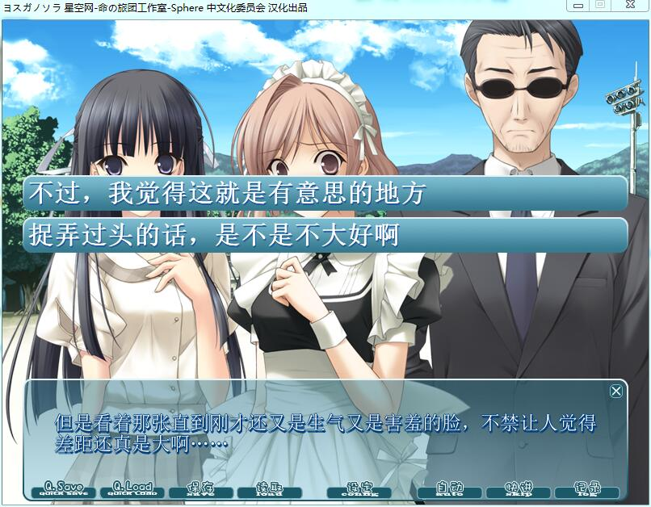
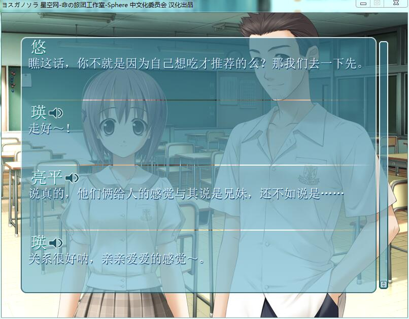
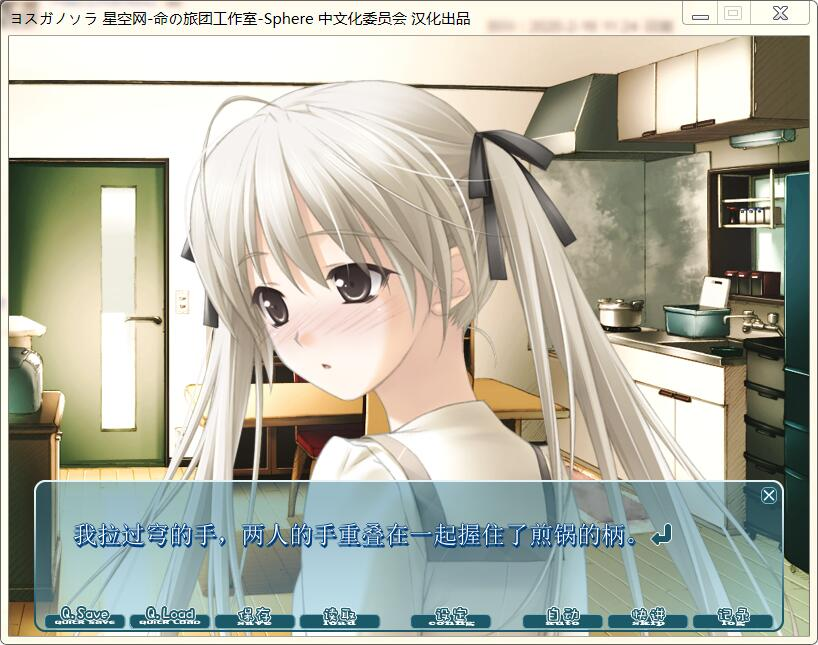

缘之空穹线时间线（含事件线）V20
* * *
好的各位，我又双叒叕回来了。  
在我昨天重刷缘之空时，发现了自己的失误。  
改正后，发现可能还是会有错误，而且改正后的阅读体验...  
所以，我觉得重发一篇，关于缘之空穹线的时间线。如果可能的话，我也会把游戏中的穹线推出来。  
那，废话少说，让我们开始吧 

  

1楼 | 风起苍岚影如幻 | 2020-02-02 17:33
* * *
前排说明：这次我先把推理过程放在前面，时间线及事件线放在后。
  

2楼 | 风起苍岚影如幻 | 2020-02-02 17:34
* * *
本图为悠穹二人到达奥木染的第一天，2010年6月20号（之后省略年份） 

  

3楼 | 风起苍岚影如幻 | 2020-02-02 17:36
* * *
补充一下，上图出自第一集4：22处
  

4楼 | 风起苍岚影如幻 | 2020-02-02 17:37
* * *
这四张图是悠上学第一天，穹给悠发的短信。  
出自第一集18:22-18:24处 

  

5楼 | 风起苍岚影如幻 | 2020-02-02 17:39
* * *
这两张图没什么好说的，只是明确了悠和奈绪复合是在7月7日左右 

  

6楼 | 风起苍岚影如幻 | 2020-02-02 17:44
* * *
再次补充，上图1出自第七集9：15处，图二出自第七集10:00处
  

7楼 | 风起苍岚影如幻 | 2020-02-02 17:46
* * *
好的，这是推出整个时间线最重要的线索，日历。以及穹妹所说的上上周，锁定2010年 

  

8楼 | 风起苍岚影如幻 | 2020-02-02 17:52
* * *
整合一下，我们有的明摆的时间。  
第一个6月20日 6 22以及7月7日
  

10楼 | 风起苍岚影如幻 | 2020-02-02 17:56
* * *
忘记我们之前所推出来的结论，开始重新归纳时间线  
let`s go
  

11楼 | 风起苍岚影如幻 | 2020-02-02 17:56
* * *
提前说一句，这回推的可能会比较慢（深思熟虑，反复推敲）  
我也不想再出错了
  

14楼 | 风起苍岚影如幻 | 2020-02-02 18:00
* * *
第一集  
6月20日 TV时间 0:00—1:28 3:04——10:20  
悠和穹到达奥木染，一叶，初佳在车上见到悠穹。瑛在便利店遇到悠和穹。仓永与悠穹撞车（永远忘不了穹那吃醋的表情）晚上，悠拜访邻居遇到奈绪
  

15楼 | 风起苍岚影如幻 | 2020-02-02 18:10
    
    2020-02-02 19:18 | 风起苍岚影如幻:
    > 集名，悠远的记忆
* * *
6月21日或6月22日 10:21—15:00  
这个日期无法明确推出，从游戏及现实角度我更倾向于后者（毕竟刚到奥木染，安顿下来才可能去上学嘛）  
悠上学的第一天，白天是日常，结识瑛 ，一叶，亮平。穹独自在家看着相片想着悠。  
夜间悠穹日常
  

17楼 | 风起苍岚影如幻 | 2020-02-02 18:30
* * *
6月23日 15:01—结束  
接着上个镜头，画面一转来到办公室，悠正在印资料，仓永询问穹是谁。  
下午6:03之后（就是这么细），奈绪骑车差点撞上悠。悠送奈绪回家并被穹撞见，悠向奈绪提出一起上学的邀请。  
夜间 穹罚跪悠 悠思春  
深夜，穹让悠帮忙量三围
  

18楼 | 风起苍岚影如幻 | 2020-02-02 18:38
* * *
第七集   
7月7日（很少的明确时间的一天）2:35—9:31  
早上7点，穹被蚊子咬醒，早饭后，穹说反正自己就是小。上学时，悠想起幼时经历。  
晚上，穹问悠网接没接上。看到悠的不对劲。（就是6l图一）
  

19楼 | 风起苍岚影如幻 | 2020-02-02 19:01
    
    2020-02-02 19:18 | 风起苍岚影如幻:
    > 集名：罪孽的少女们
* * *
7月9日 9:32—11:57  
黄昏 悠将穹的校服带回来，奈绪帮忙缝纽扣被穹捉奸在桌  
夜间，穹亲自尝试缝纽扣
  

21楼 | 风起苍岚影如幻 | 2020-02-02 19:08
* * *
7月10日 12:00—14:30  
悠穹一起上学，晚上瑛，亮平等人为奈绪和悠设局
  

22楼 | 风起苍岚影如幻 | 2020-02-02 19:10
* * *
7月11日 14:30—结束  
周日，奈绪教悠游泳，二者复合
  

23楼 | 风起苍岚影如幻 | 2020-02-02 19:11
    
    2020-04-30 20:17 | 恢复重建吃饭:
    > 复合是什么鬼？？？
* * *
第十集 鸟之穹鸣  
还是7月11日 片头  
晚上，穹再次撞见见悠和奈绪  
7月12日 3:52—9:47  
白天日常，绅士亮平询问穹睡衣风格 ，中午，奈绪约悠周日约会  
晚上，悠看到穹仅穿浴巾躺在门口吹风。穹问悠：你性奋了？
  

25楼 | 风起苍岚影如幻 | 2020-02-02 19:25
* * *
7月16日 9:48—11:29  
白天日常，入夜，穹撒谎让悠陪她过周末  
7月17日 11:30—13:04  
白天日常，悠和奈绪为明天的约会做准备。夜间，穹试衣服（衣柜中能看见穹的衣服都一样....）为明天做准备，悠欺骗穹没有推脱掉，穹很生气，后果很严重，暴锤兔兔
  

26楼 | 风起苍岚影如幻 | 2020-02-02 19:32
* * *
7月18日 13:05—17:30  
白天悠和奈绪约会，悠却处处想着穹，被奈绪指出后意识到自己对穹的感情可能超过常规的兄妹  
夜间，穹因梦到悠离去而哭泣，悠劝慰穹  
7月19日 17:31—结束  
早上，能看到穹把悠买的发卡别在头发上。中午，奈绪指出穹对悠的感情。  
夜间，悠因偷窥到穹以自己为对象自我安慰而痛哭。悠意识到自己深爱着穹，穹也对自己抱有更深的感情
  

28楼 | 风起苍岚影如幻 | 2020-02-02 19:43
* * *
第十一集 飘渺的两人  
7月25日 片头 —6:37  
白天悠和奈绪约会，下午悠和奈绪分手，  
晚上悠看到累倒的穹，穹的转变。  
7月26日 6:38—8:59  
亮平暴露想看穹泳装的想法 ，瑛告诉众人神社的湖 下午悠查阅近亲结婚的书  
7月27日 9:00—13:16  
穹发烧，悠照顾穹，穹再也克制不住对悠的情感，两人融为一体。  
7月28日 13:18—14:00  
穹病好 ，上学路上穹拉着悠的胳膊  
7月29日 14:01—15:02  
下雨，穹为悠做早饭（这个好孩子穹真滴卡哇伊）奈绪看见悠穹打伞出去吃便当  
7月30日 15:03—15:50  
悠被班长提醒和穹关系过近  
7月31日 15:51—结束  
白天穹吃鸡，晚上没锁门
  

29楼 | 风起苍岚影如幻 | 2020-02-02 20:06
    
    2020-04-04 22:16 | 六道鸣人99:
    > 吃鸡（真实）
* * *
第十二集 向着悠远的天穹（这同时也是主题曲的名字哟）  
8月2日 2:07-10:20  
白天，穹裸身为悠做饭，悠穹一起上学，班长与悠绝交，悠向奈绪坦白祈求谅解。  
夜间，悠崩溃，打了穹。  
晚饭时，悠问穹是否要分开。（看穹的反应，白挨一巴掌，她也一点不气啊）  
8月3日 10:22-结束  
白天，悠穹共枕。夜间，穹出走，悠穹跳湖，悠决定无论对错，无论怎样，都要和穹一起寻找前方的路。
  

30楼 | 风起苍岚影如幻 | 2020-02-02 20:53
* * *
至此穹线结束，共45天，一个半月。所以，改一下《论如何一个半月攻略我妹》
  

31楼 | 风起苍岚影如幻 | 2020-02-02 20:55
    
    2020-02-06 18:27 | 远空之忆◎:
    > 不是来奥木染之前就攻略了吗？我看剧情一直是穹主动最后终于和悠在一起了啊
    2020-02-06 18:47 | 风起苍岚影如幻:
    > 就是那个说法而已，不要在意那些细节
* * *
dd
  

32楼 | 无尽的苍穹-o | 2020-02-02 21:18
* * *

  

33楼 | 咕噜灵波✨ | 2020-02-02 23:00
* * *
路过。
  

34楼 | 路过的空我♬ | 2020-02-03 01:23
* * *
一切明白了，感谢楼主
  

35楼 | 筱原佳信🌟 | 2020-02-03 10:44
    
    2020-02-03 10:46 | 风起苍岚影如幻:
    > 客气
* * *
你可以去整整游戏的时间线，保证要命
  

36楼 | Reki雷姬º | 2020-02-03 13:56
    
    2020-02-03 14:05 | 风起苍岚影如幻:
    > 不会的，我初步推了下，游戏和动漫时间线基本一致
* * *
顶一个
  

38楼 | 巴别塔之殇- | 2020-02-03 17:41
* * *
谢
  

39楼 | 风起苍岚影如幻 | 2020-02-03 18:43
* * *
关于穹线的bug，我也简单列一下，其中最典型的就是这个（不过我估计没多少人注意）
  

41楼 | 风起苍岚影如幻 | 2020-02-04 12:17
* * *
本图是第十二集，穹投湖前给悠发送的短信 

  

42楼 | 风起苍岚影如幻 | 2020-02-04 12:19
* * *
日期上写的是7月14日，但这和我们推出来的时间，和游戏时间，和实际事实都不符
  

43楼 | 风起苍岚影如幻 | 2020-02-04 12:20
* * *
所以，这也是feel.的锅，这个bug真的硬伤
  

44楼 | 风起苍岚影如幻 | 2020-02-04 12:21
* * *
诸如此类的还有一些，如穹悠家的钟表，厨房那个，时间永远对不上。这个我就不发图了
  

45楼 | 风起苍岚影如幻 | 2020-02-04 12:21
    
    2020-03-20 15:55 | asd12wh:
    > 另一种可能是忘记调时间了或者不回调或者懒得调（嘿siri现在几点了）
* * *
关于这个最后手机的镜头，多说几句。  
就算是把天数都排在一起也是22天。从6月20到7月14总共24天。  
而且中间约会时只能在周日。  
所以，那些说bug的来先看看这个贴吧
  

46楼 | 风起苍岚影如幻 | 2020-02-05 07:42
* * *
@我º好穹♂啊-
  

47楼 | 风起苍岚影如幻 | 2020-02-05 07:44
* * *
最近缘吧事挺多，不如来温习下缘之空
  

48楼 | 风起苍岚影如幻 | 2020-02-06 17:43
* * *
辛苦了
  

49楼 | 神之殤99 | 2020-02-06 18:53
* * *
那些和妹妹玩缘之空的，不如直接看遍动漫，能动还直观
  

50楼 | 风起苍岚影如幻 | 2020-02-07 11:39
    
    2020-02-10 17:36 | 我放弃了思考º:
    > 我怀疑你在忽悠我
    2020-02-16 12:21 | 奈落之渊◆:
    > 你这个魔鬼
    2020-02-16 16:35 | 风起苍岚影如幻:
    > 回复 奈落之渊◆ :
* * *
所以说动漫时间线推不推了我就见你整天跑着催文了你自己的都不更吗?
  

51楼 | 远空之忆◎ | 2020-02-08 15:10
    
    2020-02-08 15:13 | 风起苍岚影如幻:
    > 不要在意那些细节
    2020-02-08 15:29 | 远空之忆◎:
    > 回复 风起苍岚影如幻 :还看不出来我是来催更的?
    2020-02-08 15:36 | 风起苍岚影如幻:
    > 看出来了，那也不要在意那些细节
* * *
看帖的评个论，发个滑稽也行啊...别让贴沉了
  

52楼 | 风起苍岚影如幻 | 2020-02-10 17:35
    
    2020-02-10 18:41 | 远空之忆◎:
    > 你都不更了沉不沉有区别嘛想让人顶就快更更更！加精了还这么懈怠
    2020-02-10 19:03 | 风起苍岚影如幻:
    > 回复 远空之忆◎ :这个真的快不了....
    2020-02-10 19:09 | 远空之忆◎:
    > 回复 风起苍岚影如幻 :但是这都五天了一点都没吗
    2020-02-10 19:35 | 风起苍岚影如幻:
    > 有的，一会慢慢发吧
* * *
放大镜看的吧
  

53楼 | 名字🌜🌛 | 2020-02-10 17:41
* * *
我七天前绿牌的时候，你刚把动漫分析完，说要分析游戏。现在你还是只有一点，催更
  

54楼 | 灵虚🔯砚 | 2020-02-10 17:46
    
    2020-02-10 19:03 | 风起苍岚影如幻:
    > 铁子，我刷动漫刷了五六遍弄出来的时间线，这游戏也得差不多
    2020-02-11 08:42 | 灵虚🔯砚:
    > 回复 风起苍岚影如幻 :没看到我都黄牌了吗？ 更，催更，快点更
    2020-02-11 09:20 | 风起苍岚影如幻:
    > 回复 灵虚🔯砚 :人民币的力量
    2020-02-11 09:23 | 灵虚🔯砚:
    > 回复 风起苍岚影如幻 :人民币力量无限
* * *
要不要我把我缘之空流程给发出来，就当更新了？
  

55楼 | 风起苍岚影如幻 | 2020-02-10 19:04
* * *
顶顶
  

56楼 | 用户927- | 2020-02-10 19:36
* * *
大家吼啊，著名鸽子又回来了  
言归正传，这回我们一起来推游戏的时间线
  

57楼 | 风起苍岚影如幻 | 2020-02-10 20:23
* * *
dd
  

58楼 | 弑梦人º | 2020-02-10 20:27
* * *
我们先不算第一天的日期。  
第一天 

  

59楼 | 风起苍岚影如幻 | 2020-02-10 20:30
* * *
有点糊，可以看到第一天只是悠和穹初到奥木染，瑛看到悠而已，和动漫中的第一天差了很多的
  

60楼 | 风起苍岚影如幻 | 2020-02-10 20:32
* * *
第二天 

  

61楼 | 风起苍岚影如幻 | 2020-02-10 20:35
* * *
第二天也只是日常，以及奈绪遇到悠
  

62楼 | 风起苍岚影如幻 | 2020-02-10 20:36
* * *
第三天 

  

63楼 | 风起苍岚影如幻 | 2020-02-10 20:37
* * *
虽说剧情很长，但实际对我们有用的可能就这些
  

64楼 | 风起苍岚影如幻 | 2020-02-10 20:38
* * *
第四天 今天内容有点多 分开放 

（穹线 一周目没有的哦）
  

65楼 | 风起苍岚影如幻 | 2020-02-10 20:46
    
    2020-04-05 08:31 | 西宫是天使🌸:
    > 大佬，游戏怎么来的？
* * *

悠第一天的学校生活
  

66楼 | 风起苍岚影如幻 | 2020-02-10 20:48
* * *

（名场面，穹拿生发水（发胶）喷蚊子）
  

67楼 | 风起苍岚影如幻 | 2020-02-10 20:51
* * *
hxd们，别康故事会了，来康康技术贴
  

68楼 | 风起苍岚影如幻 | 2020-02-10 20:53
* * *
頂lz
  

69楼 | 普鲁士十教皇 | 2020-02-10 23:36
* * *
頂，給lz頂頂
  

70楼 | 普鲁士十教皇 | 2020-02-10 23:37
* * *
？游戏你要怎么推
  

71楼 | 贴吧用户_5EP5UbM | 2020-02-11 00:24
    
    2020-02-11 07:26 | 风起苍岚影如幻:
    > 不管了，先试试。 毕竟还有一天是明确的 盂兰盆节
* * *
推过就知道，跳跃的天数很多，推不了的建议放弃
  

72楼 | 贴吧用户_5EP5UbM | 2020-02-11 00:40
* * *
我猜测在游戏里起始日期应该是中学春季开学后不久，终止于秋季开学后一段时间
  

73楼 | 蜜獾君💦 | 2020-02-11 05:14
* * *
楼主又🕊了？
  

74楼 | 灵虚🔯砚 | 2020-02-11 08:21
    
    2020-02-11 08:32 | 风起苍岚影如幻:
    > ？
    2020-02-11 08:38 | 灵虚🔯砚:
    > 回复 风起苍岚影如幻 :额.... 掉了
* * *
顶dd
  

75楼 | 灵虚🔯砚 | 2020-02-11 08:42
* * *
顶
  

76楼 | 贴吧用户_7b11ES6 | 2020-02-11 08:43
* * *
由于网课，早班车是不可能的了，更新集中在晚八点左右
  

77楼 | 风起苍岚影如幻 | 2020-02-11 08:48
    
    2020-02-11 09:23 | 灵虚🔯砚:
    > 网课.... 我已经翘了
    2020-02-11 09:59 | 风起苍岚影如幻:
    > 高三党....
* * *
这个贴也可以当缘之空流程来看，我会把每一天的事发出来的（当然，简化版）
  

78楼 | 风起苍岚影如幻 | 2020-02-11 10:00
* * *
资源不是在精华里吗新手求告知
  

79楼 | 转角遇到你619 | 2020-02-11 23:02
    
    2020-02-12 07:23 | 风起苍岚影如幻:
    > ？
* * *

  

80楼 | 唯爱春日野穹♂ | 2020-02-11 23:15
* * *
dd
  

81楼 | 灵虚🔯砚 | 2020-02-12 07:14
* * *
頂
  

82楼 | 灵虚🔯砚 | 2020-02-12 11:31
* * *

  

83楼 | 叶惠美🍦 | 2020-02-12 14:08
* * *
伪更新，穹妹连环问（莫名戳中笑点） 

  

84楼 | 风起苍岚影如幻 | 2020-02-12 14:27
    
    2020-02-12 21:37 | 🌟曦星晓夜🌟:
    > 为什么？
* * *
dd
  

85楼 | 灵虚🔯砚 | 2020-02-12 17:56
* * *
占楼
  

86楼 | 😈绫小路 | 2020-02-12 18:48
* * *
【穹】算了……  
【悠】哎？  
穹在纸箱里悉悉索索的找出来了……  
【悠】等下，穹……你想干嘛……？  
【穹】吵死了……  
不管怎么看我都觉得她手里拿着的那个是喷发剂。  
【穹】呜呜呜呜……  
【悠】呜哇！？  
【穹】咳咳……咳咳…………呜…………  
【悠】喂！你，你在干嘛啊……快点住手！  
在我的四周像一层白雾一样甜的发腻的强力味道扩散开来。  
【穹】呜ーーーー！！！  
【悠】咳……呜……穹………来这边……  
我强行把一边满眼泪光一边半自暴自弃的挥舞着喷发剂的穹从房间里拉了出来。
  

87楼 | 灵虚🔯砚 | 2020-02-12 18:50
    
    2020-02-12 20:13 | 风起苍岚影如幻:
    > 满分讲解
    2020-02-12 20:22 | 灵虚🔯砚:
    > 回复 风起苍岚影如幻 :这是提取的文本，改编必需品
    2020-02-12 21:19 | 风起苍岚影如幻:
    > 回复 灵虚🔯砚 :能给我发下吗？
    2020-02-12 21:20 | 灵虚🔯砚:
    > 回复 风起苍岚影如幻 :？
    2020-02-12 21:21 | 灵虚🔯砚:
    > 回复 风起苍岚影如幻 :不是有原贴吗？
    2020-02-12 21:25 | 灵虚🔯砚:
    > 回复 风起苍岚影如幻 :那个文本错误极多，想要了明天给你私发
* * *
第五天 

  

88楼 | 风起苍岚影如幻 | 2020-02-12 20:40
* * *
悠第二天上学，除了日常，最主要的剧情就是和瑛的，这里触发选项（果断选二）
  

89楼 | 风起苍岚影如幻 | 2020-02-12 20:41
* * *
第六天 

  

90楼 | 风起苍岚影如幻 | 2020-02-12 21:10
* * *
悠上学的第三天，一叶线出现，然后就是帮穹量三围了（那处我是不会发的）
  

91楼 | 风起苍岚影如幻 | 2020-02-12 21:12
* * *
第七天 跳跃天出现 

  

92楼 | 风起苍岚影如幻 | 2020-02-12 21:13
* * *
显而易见，制服不是一天炼成的中间有跳跃的天数，我们姑且放下，继续往下推进
  

93楼 | 风起苍岚影如幻 | 2020-02-12 21:14
* * *
加油，这个不好推
  

94楼 | 🌟曦星晓夜🌟 | 2020-02-12 21:39
* * *
互顶
  

95楼 | 灵虚🔯砚 | 2020-02-13 08:00
* * *
顶！楼主高三抽时间整理，辛苦啦！
  

96楼 | 贴吧用户_QRNXVWe | 2020-02-13 13:59
* * *

  

97楼 | 黄老咩 | 2020-02-13 15:53
* * *
顶
  

98楼 | 灵虚🔯砚 | 2020-02-13 18:41
* * *
申请拖更  
沉浸于老色鬼信条无法自拔（重温经典）  
明天多更
  

99楼 | 风起苍岚影如幻 | 2020-02-13 19:57
    
    2020-02-13 19:58 | 风起苍岚影如幻:
    > 下次一定
    2020-02-13 19:59 | 我想当氵怪🌊:
    > 回复 风起苍岚影如幻 :有在群里面划水的时间，你早就更了
    2020-02-13 20:01 | 风起苍岚影如幻:
    > 回复 我想当氵怪🌊 :
* * *
接着第七天 

  

100楼 | 风起苍岚影如幻 | 2020-02-14 17:31
* * *
第七天主要就是奈绪为悠揭开穹的一层面纱，以及后续的悠对父母的回忆（这个就不放图了）
  

101楼 | 风起苍岚影如幻 | 2020-02-14 17:32
* * *
第八天 

要素察觉
  

102楼 | 风起苍岚影如幻 | 2020-02-14 18:12
    
    2020-03-22 15:59 | 悠遠的天穹♂:
    > 你还知道锁门？
* * *

  

103楼 | 风起苍岚影如幻 | 2020-02-14 18:15
* * *

  

104楼 | 风起苍岚影如幻 | 2020-02-14 18:19
* * *
从旁人的眼光，更能看出兄妹两人的不一般
  

105楼 | 风起苍岚影如幻 | 2020-02-14 18:20
* * *
第九天 悠穹第二天上学 

  

106楼 | 风起苍岚影如幻 | 2020-02-14 18:23
* * *

这就是我穹吗，i了i了
  

107楼 | 风起苍岚影如幻 | 2020-02-14 18:26
* * *

只能说，穹对悠的情感一直都是明确的
  

108楼 | 风起苍岚影如幻 | 2020-02-14 18:32
* * *

  

109楼 | 风起苍岚影如幻 | 2020-02-14 18:37
* * *
顶顶
  

110楼 | 贴吧用户_7ZMEabV | 2020-02-15 10:01
    
    2020-02-15 10:02 | 风起苍岚影如幻:
    > 谢
    2020-02-15 10:03 | 贴吧用户_7ZMEabV:
    > 回复 风起苍岚影如幻 :嘿嘿
* * *
dd
  

111楼 | 蒐拉ლ雨薇 | 2020-02-15 16:29
* * *
咕咕咕咕咕咕咕咕咕咕咕咕咕~  

  

112楼 | 灵虚🔯砚 | 2020-02-15 21:16
    
    2020-02-15 21:57 | 风起苍岚影如幻:
    > 其人之道
* * *
顶
  

113楼 | 😈绫小路 | 2020-02-16 11:15
    
    2020-02-16 11:24 | 风起苍岚影如幻:
    > 谢
* * *
第十天 

  

114楼 | 风起苍岚影如幻 | 2020-02-16 14:59
* * *
(没在自己家，电脑破，图糊....)  
高能的一天，从早上开始
  

115楼 | 风起苍岚影如幻 | 2020-02-16 15:01
* * *

悠被亮平推进泳池，穹救了悠（伏笔，别再说什么双结局了）
  

116楼 | 风起苍岚影如幻 | 2020-02-16 15:02
* * *

穹直说那段事，同时名场面
  

117楼 | 风起苍岚影如幻 | 2020-02-16 15:05
    
    2020-02-18 15:40 | 灵虚🔯砚:
    > 我的图
    2020-02-18 16:10 | 风起苍岚影如幻:
    > 回复 灵虚🔯砚 :
* * *
第十一天 学习会 

穹与奈绪和解。（动漫都没有淦）  
揭示穹学霸原因，只是希望和悠在一起
  

118楼 | 风起苍岚影如幻 | 2020-02-16 15:39
* * *
第十二天 第二个跳跃天，夏日祭 

  

119楼 | 风起苍岚影如幻 | 2020-02-16 16:17
* * *

重 要 伏 笔
  

120楼 | 风起苍岚影如幻 | 2020-02-16 16:18
* * *

夏日祭完
  

121楼 | 风起苍岚影如幻 | 2020-02-16 16:20
* * *
夏日祭作为游戏中唯一出现的时间点，意义不言而喻。  
现在，小结一下，我们仍以2010年为基准  
先来看看第一个跳跃天 就是悠为穹拿校服那天。  
这里在动漫中，校服的制作用了三天，姑且挪用一下，
  

122楼 | 风起苍岚影如幻 | 2020-02-16 16:38
* * *
从盂兰盆节倒着推7月15日  
这也是第二个跳跃天，而前一天就是学习会。  
怎么推出前一天时间呢？我选择问问神奇的百度  
可惜，百度没有给我们一个准确的考试时间，不过他给出了高二的考试时长，三天，这就足够了。
  

123楼 | 风起苍岚影如幻 | 2020-02-16 16:51
    
    2020-03-05 22:29 | 贴吧用户_6S5DWEJVW:
    > 那么从哪里看出是高二呢？
    2020-03-05 22:33 | 风起苍岚影如幻:
    > 回复 贴吧用户_6S5DWEJVW :大多设定给的高二，我就按这个推了，其实高一也无所谓的，因为后来用的那个三段学期制好像更符合高一的。
    2020-03-06 20:21 | 贴吧用户_6S5DWEJVW:
    > 回复 风起苍岚影如幻 :emmm百度百科上写的悠穹16岁，不知道咋判断的，但是如果是16应该是高一吧
    2020-04-30 20:23 | 恢复重建吃饭:
    > 回复 风起苍岚影如幻 :一年级，楼主可以去看一下悠之空里的WGB内容小剧场明确说了高一
    2020-04-30 20:40 | 风起苍岚影如幻:
    > 回复 恢复重建吃饭 :嗯，知道是 高一，这个也是按高一的推的
    2020-04-30 20:43 | 恢复重建吃饭:
    > 回复 风起苍岚影如幻 :小吧主有爱~
    2020-04-30 20:55 | 风起苍岚影如幻:
    > 回复 恢复重建吃饭 :
* * *
那，让我们开始推理吧  
首先，盂兰盆节（夏日祭）在7月15日，如果我们直接简单粗暴的倒退三天，认为在7月12日是期末考试，也不是不可以。日历上并无冲突。  
蛋这样的话，考试的前一天是周日，也就是说，学习会应该在前一天，7月10日。  
合情合理，日本的周六半天（意外收获，第三周的周六不用上，先记下）  
所以，我们就完全可以这样认为。  
那么脉络就极为清晰了。
  

124楼 | 风起苍岚影如幻 | 2020-02-16 16:58
* * *
dd
  

126楼 | 贴吧用户_7ZMEabV | 2020-02-16 23:42
* * *
OK，以夏日祭为分割点，现在进入下半部分。  
第十三天 海边，无法确定是否是跳跃天，姑且看作没有跳跃的一天 

怪力少女
  

127楼 | 风起苍岚影如幻 | 2020-02-18 15:25
* * *

奈绪真的是本线最重要的配角
  

128楼 | 风起苍岚影如幻 | 2020-02-18 15:26
* * *

睡着的穹。悠察觉穹对自己的心意，并且自己开始考虑如何处理
  

129楼 | 风起苍岚影如幻 | 2020-02-18 15:27
* * *
好的各位， 又出现错误了 

  

130楼 | 风起苍岚影如幻 | 2020-02-18 15:29
* * *
那也就是说明了两个月的时间，自刚到奥木染到盂兰盆节总共两个月。  
也就是6月15到8月15
  

133楼 | 风起苍岚影如幻 | 2020-02-18 15:44
* * *
SO，让我们重新更正时间线  
6月15日 一切的开始。  
6月16日 悠初遇奈绪  
6月17日 穹初遇奈绪  
6月18日 悠第一天上学，出穹线选项  
6月19日 瑛线选项，今天是周六，而且是每个月第三个周六，日本高中规定今天休息。  
6月26日 悠为穹量尺寸。这是个不明显的跳跃天，但从天色看出是半天，所以仍是周六。  
出一叶线选项  
6月29日 悠为穹取校服，奈绪为悠揭开家族的羁绊以及后续的悠对父母的回忆  
6月30日 悠穹第一天上学，  
7月1日 悠穹第二天上学，对穹的心理刻画易知穹只是怕被悠抛弃  
7月2日 悠溺水，穹明说奈绪和悠过去吞食禁果的事  
7月3日 学习会 同样是周六所以半天。  
7月16日 夏日祭
  

134楼 | 风起苍岚影如幻 | 2020-02-18 16:05
* * *
lz可以打字打在一起么
  

135楼 | 贴吧用户_Qa5yR7W | 2020-02-18 16:48
    
    2020-02-18 17:28 | 风起苍岚影如幻:
    > ？怎么个意思没听懂
* * *
第十四天 

  

137楼 | 风起苍岚影如幻 | 2020-02-19 16:11
* * *
盂兰盆节后，悠穹同床，上图是悠在装睡时穹的反应
  

138楼 | 风起苍岚影如幻 | 2020-02-19 16:12
    
    2020-02-19 16:14 | 风起苍岚影如幻:
    > 准确点，穹的告白
    2020-02-19 16:14 | 风起苍岚影如幻:
    > 呸，表白
* * *
第十五天 

  

139楼 | 风起苍岚影如幻 | 2020-02-19 16:41
* * *
之后紊乱段开始， 

可以大体推断出至少过去了三天
  

140楼 | 风起苍岚影如幻 | 2020-02-19 16:44
* * *

又是一天
  

141楼 | 风起苍岚影如幻 | 2020-02-19 16:45
* * *
接着上图，第十八天 

  

142楼 | 风起苍岚影如幻 | 2020-02-19 17:17
* * *
这一张图就够了，不需要解说
  

143楼 | 风起苍岚影如幻 | 2020-02-19 17:17
* * *
穹线转折点永远都是h片段..
  

144楼 | 风起苍岚影如幻 | 2020-02-19 17:17
* * *
第十九天，悠接受穹 

  

145楼 | 风起苍岚影如幻 | 2020-02-19 17:32
* * *
这已经不是梦.....
  

146楼 | 风起苍岚影如幻 | 2020-02-19 17:32
* * *
这是我我第二天看缘之空，目标一天四集
  

147楼 | 初星大魔王 | 2020-02-19 17:48
    
    2020-02-19 17:56 | 风起苍岚影如幻:
    > 速度太快会致郁的哦
    2020-02-20 15:46 | 常娥大大:
    > 我是一天看完的啊啊啊难怪我致郁了！！！
    2020-02-22 00:47 | 吃肉的大飞馕♂:
    > 回复 常娥大大 :我也是，现在致郁死了
* * *
既然发不了图，就简单发文字吧。  
穹：想要更多的....更多的感觉这悠.....让我相信，这不是梦。  
穹：虽然我们是双生子........但是彼此的心意也不一定能够传达.....所以.....我曾经很害怕  
穹：但是......现在终于相通了.......悠和我的心意...  
悠：嗯.....穹.....我喜欢你.....  
穹：悠！.......悠！ 抱紧我.....不要离开我.....  
穹：悠...这，这....不是梦吗......  
悠：不是梦...这是真的哦  
穹：太好了........从此往后......也能一直感受到悠了......  
穹：让我永远不会忘记的.....疼爱我
  

148楼 | 风起苍岚影如幻 | 2020-02-19 17:55
    
    2020-03-09 17:46 | 风起苍岚影如幻:
    > 回复 🌐见切如风🌀 :有图你就看不到这个贴了
    2020-03-11 09:51 | Invert💦:
    > 
    2020-03-12 02:11 | Invert💦:
    > 深夜刚过穹线第一次H，穹的声音令人潸然泪下
* * *
里番看人生
  

149楼 | 风起苍岚影如幻 | 2020-02-19 18:09
* * *
穹的不安感一直都在，不论与悠结合与否
  

150楼 | 风起苍岚影如幻 | 2020-02-19 18:13
* * *
太长了我不看就赏个滑稽吧
  

151楼 | 威莲的珂学家💍 | 2020-02-19 18:20
    
    2020-02-19 18:33 | 风起苍岚影如幻:
    > 到最后会直接有总体时间线的
    2020-02-19 18:46 | 威莲的珂学家💍:
    > 回复 风起苍岚影如幻 :那到时候再赏个滑稽吧
    2020-02-19 19:13 | 风起苍岚影如幻:
    > 回复 威莲的珂学家💍 :
* * *
顶
  

152楼 | 我不想虐-菜 | 2020-02-19 22:33
* * *
第二十天 

  

153楼 | 风起苍岚影如幻 | 2020-02-20 14:39
* * *
有一说一，我酸了
  

154楼 | 风起苍岚影如幻 | 2020-02-20 14:39
* * *
第二十一天，开学典礼 

  

155楼 | 风起苍岚影如幻 | 2020-02-20 14:45
* * *
第二十二天 

  

157楼 | 风起苍岚影如幻 | 2020-02-20 16:34
* * *
班长第一次捉奸（不过应该不算，就是看到喂食）  
奈绪意识到问题的微妙
  

158楼 | 风起苍岚影如幻 | 2020-02-20 16:34
* * *
dd  
gexiang
  

159楼 | 灵虚🔯砚 | 2020-02-20 16:37
* * *
第二十三天 

  

160楼 | 风起苍岚影如幻 | 2020-02-21 16:52
* * *
dddd！
  

161楼 | 吃肉的大飞馕♂ | 2020-02-22 00:49
    
    2020-02-22 07:59 | 风起苍岚影如幻:
    > 谢
* * *
顶顶
  

162楼 | 用户927- | 2020-02-22 07:45
    
    2020-02-22 08:00 | 风起苍岚影如幻:
    > 谢谢皮卡丘
* * *
大佬 我终于捋清思路了
  

163楼 | 寂兮♬ | 2020-02-22 08:06
    
    2020-02-22 09:24 | 风起苍岚影如幻:
    > 
* * *
今天更完，不学xu jiang~
  

164楼 | 风起苍岚影如幻 | 2020-02-22 09:25
* * *
还是第二十三天 

  

165楼 | 风起苍岚影如幻 | 2020-02-22 09:37
* * *
第二十四天 

  

166楼 | 风起苍岚影如幻 | 2020-02-22 10:32
* * *
dd  
ge~xiang~~
  

167楼 | 灵虚🔯砚 | 2020-02-22 10:36
* * *
楼主nb
  

168楼 | 贴吧用户_aSEZ1Rb | 2020-02-22 13:14
* * *
名场面，穹自己走出来，图就不放了，打字吧  
穹：悠……怎么啦？呐，回房间吧？在渴求着我的声音再次响起时……  
穹：……给我回去。……不要来妨碍我和悠  
穹面无表情地睥睨着奈绪和班长放出冰冷刺骨的言词……  
穹：……那又如何？不是很好么？我也和奈绪做了同样的事情  
穹面无表情地向着打开的门撇了一眼。  
就好像在说碍事者已经消失了一人一样……
  

169楼 | 风起苍岚影如幻 | 2020-02-22 14:08
    
    2020-02-22 15:03 | 世界即我穹º:
    > 班长被双重ntr。。。
* * *
第二十五天 

  

170楼 | 风起苍岚影如幻 | 2020-02-22 14:15
* * *
穹失踪
  

171楼 | 风起苍岚影如幻 | 2020-02-22 14:16
* * *

  

172楼 | 风起苍岚影如幻 | 2020-02-22 14:18
* * *
第二十六天 

  

173楼 | 风起苍岚影如幻 | 2020-02-22 14:18
* * *
悠穹下山，穹线结束。（末尾还有些后续，不过和我们需要的无关不放图了）
  

174楼 | 风起苍岚影如幻 | 2020-02-22 14:19
* * *
6月15日 一切的开始。  
6月16日 悠初遇奈绪  
6月17日 穹初遇奈绪  
6月18日 悠第一天上学，出穹线选项  
6月19日 瑛线选项，今天是周六，而且是每个月第三个周六，日本高中规定今天休息。  
6月26日 悠为穹量尺寸。这是个不明显的跳跃天，但从天色看出是半天，所以仍是周六。出一叶线选项  
6月29日 悠为穹取校服，奈绪为悠揭开家族的羁绊以及后续的对父母的回忆  
6月30日 悠穹第一天上学，  
7月1日 悠穹第二天上学，对穹的心理刻画易知穹只是怕被悠抛弃  
7月2日 悠溺水，穹明说奈绪和悠过去吞食禁果的事  
7月3日 学习会 同样是周六所以半天。  
7月16日 夏日祭  
7月17日 海边  
8月18日 盂兰盆节后，重返奥木然，穹向装睡的悠告白  
8月19日 悠回避穹的表白  
8月20日—8月23日 悠找借口离开穹  
8月24日 穹自慰  
8月25日 悠接受穹  
8月26日 日常  
8月27日 开学典礼  
8月28日 悠穹喂食被班长撞见  
8月29日 白天穹吃鸡，晚上嘿嘿嘿  
8月30日 穹自己走出来宣布主权  
8月31日 穹投湖  
9月1日 悠穹下山   
穹线结束
  

175楼 | 风起苍岚影如幻 | 2020-02-22 14:42
* * *
很明显，动漫比游戏短小很多。而至于其他人的线我就不推了（多提一下，动漫除穹线都是6月20日-7月16）  
悠之空可能会推，但我粗浅的估计下也就一周左右。  
所以，不管怎样，完结散花
  

176楼 | 风起苍岚影如幻 | 2020-02-22 14:46
* * *
完结  
不撒花了  
撒点鸽子的翔  
让你鸽  
让你鸽
  

177楼 | 灵虚🔯砚 | 2020-02-22 14:59
    
    2020-02-22 15:02 | 世界即我穹º:
    > 蒙娜丽莎来了dd
    2020-02-22 16:04 | 风起苍岚影如幻:
    > 淦
* * *
你好细啊
  

180楼 | 纵横三十三重天 | 2020-02-24 07:56
    
    2020-02-24 08:03 | 风起苍岚影如幻:
    > 
* * *
dd
  

182楼 | 贴吧用户_7ZMEabV | 2020-02-29 04:25
* * *
游戏结尾是他们两个还在小镇上生活还是像动画那样离开了？我没玩游戏
  

184楼 | 🌐见切如风🌀 | 2020-03-09 17:31
    
    2020-03-09 17:47 | 风起苍岚影如幻:
    > 离开了，去赫尔辛基
    2020-03-12 19:27 | 毁灭♂打稽:
    > 啊……理论上是离开了，去了赫尔辛基，其实就是去旅游，完事了还会回来
* * *
悠之空gkd我要看
  

185楼 | wangshº | 2020-03-09 19:18
    
    2020-03-09 19:30 | 风起苍岚影如幻:
    > 都说是拖更时候更了~
* * *
大佬gkd我快郁死了听说悠之空会有点腻可以缓一缓
  

186楼 | Invert💦 | 2020-03-11 09:59
    
    2020-03-12 06:36 | 缘之悠穹😄:
    > 是的，悠之空结局很好
* * *
大佬666时间线合理 刚推完游戏 没推穹妹 对这个经典有点恋恋不舍 不敢推完结局 怕难受了
  

187楼 | kdhww | 2020-03-17 09:34
* * *
厉害，幸苦了

  

188楼 | 我还要氵😄 | 2020-03-18 22:17
* * *
提问：春日野一家搬去东京，穹住院，穹出院，奈绪推倒悠被穹看到，这些大概是什么时候的事…能推出年份吗
  

189楼 | 贴吧用户_6S5DWEJVW | 2020-03-20 10:38
    
    2020-03-20 11:40 | 风起苍岚影如幻:
    > 能，但我懒的推了
    2020-03-20 12:07 | 贴吧用户_6S5DWEJVW:
    > 回复 风起苍岚影如幻 :抱住大佬大腿
    2020-03-20 12:18 | 风起苍岚影如幻:
    > 回复 贴吧用户_6S5DWEJVW :抱住也没用，懒就是懒
    2020-03-20 15:25 | 贴吧用户_6S5DWEJVW:
    > 回复 风起苍岚影如幻 :QAQ…试图思考怎么打动大佬
    2020-04-04 09:48 | 毁灭♂打稽:
    > 悠和穹应该是在城市里出生成长的他们年龄都是16岁的话从2010年往下推春日野他们搬到东京不晚于1996年
    2020-04-04 09:50 | 毁灭♂打稽:
    > 然后动漫里说过悠和奈绪干那事是四年前，也就是2006年的暑假当时悠12岁奈绪13岁的样子至于穹住院和出院的话好像没有提示过，这个就不推了
* * *
列文虎克二代
  

190楼 | 红芋仔仔😂 | 2020-03-20 15:59
* * *

  

191楼 | i1111115983617 | 2020-03-23 14:30
* * *
lz属实强
  

192楼 | AA😈🌼 | 2020-04-04 20:12
* * *
这时间线都能崩我是旺旺也没有想到的
  

194楼 | 风起苍岚影如幻 | 2020-04-19 21:11
    
    2020-06-28 09:16 | qabcga-:
    > 
* * *
强，真细致
  

195楼 | 寰-宇 | 2020-04-19 22:08
* * *
游戏的每条线都是从春季4，5月开始（可以从天气看出来，这个时候的热气是刚升腾的，没有7,8月那么毒辣）到开学后一点点结束，基本上到不了亮平的生日（9月25），然后他们那里放暑假大概是6月中下旬，开学是8月上中旬，所以很明显看到整个游戏的时间段拉长了（或者不如说动漫强行缩短了）  
悠之空里，班长和八寻都是开学就结束，穹妹因为是连着上一部的剧情所以大概到了9,10月份那样，但我觉得最多也就过了一个月吧，大多都是琐碎的日常  
大家同意我吗~
  

196楼 | 恢复重建吃饭 | 2020-04-30 20:20
    
    2020-04-30 20:44 | 风起苍岚影如幻:
    > 我这个很明确的按日期推的，你的理由请明确给出 所谓热气不感觉不靠谱嘛？
    2020-04-30 23:29 | 恢复重建吃饭:
    > 嗯，就是有没有可能它中间会跳过一些天呢？其实我也希望尽量把时间线拉长，不然尤其是动漫其它几条线，二十几天攻略素昧平生的大小姐好奇怪啊
    2020-05-01 16:45 | 风起苍岚影如幻:
    > 回复 恢复重建吃饭 :跳是肯定有跳的，其它线我也没推时间，不清楚
    2020-05-01 16:45 | 风起苍岚影如幻:
    > 回复 恢复重建吃饭 :动漫是没有跳多少的，就是二十多天攻略那三个
    2020-05-02 08:23 | 恢复重建吃饭:
    > 回复 风起苍岚影如幻 :唉，不愧是男主加成
* * *
我总觉得游戏里有在跳天数啦，不像是从6月开始的剧哦。
  

197楼 | 恢复重建吃饭 | 2020-04-30 20:24
* * *

  

198楼 | 月下残影moon | 2020-06-29 16:01
