【原创】【缘之空&秋色之空】《秋日苍穹》（Aki-Sora）
* * *
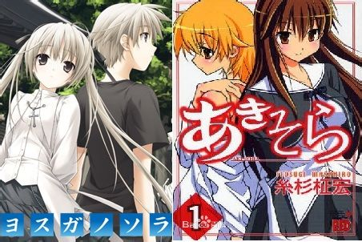
之前有过这个想法，但是时间有限一直没能实现，现在终于有时间实现这个愿望，在我玩过缘之空系列，看完秋色之空后，一直觉得意犹未尽，所以决定发布这部小说《秋日苍穹》，希望大家支持。  
新手发文，有很多不足，人物有时把握的也不是很准，请大家原谅。  
随更随发，我会尽量保证更新。
  

1楼 | 白夜Hara | 2014-01-27 23:26
* * *
楔子  
蔚蓝的天空令人觉得异常的清澈，就像奥木染那里的天空一样，纯粹的蓝，和天空一样，连白云也显示出了和奥木染中一样的色彩，不禁让人会有“城市变化好大”这样的想法。  
列车上，悠和穹伏在窗户边，一起看着窗外的景色，随着列车的前进，树林渐渐消失，浮现在他们眼前的是林立的高楼大厦，这对兄妹恋人离开了奥木染，重新来到繁华的都市，如悠当年所说，他们并不是为了离开，而是为了更好地回来。  
不知不觉，自从他们的异国之旅结束后，转眼已是两年。  
在赫尔辛基，悠坚定了自己的信念，要知道那个单词Siunaus（祝福）的意思，和穹再次前去那个国家，也想要去父母去过的其他国家看一看，追随他们的旅途，现在，正是他们的循序渐进中的一部分——大学进修。  
在赫尔辛基之旅结束后，悠充满了干劲，在穹的帮助之下，学习成绩开始逐步提升，班级里面的人明显感觉到了悠的改变，不过这样的话，吊车尾的亮平也就少了一个“伙伴”呢，不过换句话说，多了一个抄作业的人选，或多或少地减轻了一叶的“压力”……吧。  
他们之所以选择这里，是因为这里有一所大学的在培养经商人员方面闻名全国，想要重拾父业，这是必不可少的一环，所以当悠知道的时候便立即选择了这里，而且穹通过上网查阅得知，这里也有家具设计专业，于是他们决定在学专业课的基础上修这样的课程。  
其实，穹原本有更好的选择，可是为了不和悠分开，毅然选择和悠一样的大学。  
对于大学生活，他们已经有了规划，现如今，距离梦想，又近了一步。
  

2楼 | 白夜Hara | 2014-01-27 23:27
    
    2014-02-08 19:43 | z1016043042:
    > 前排兜售热翔
    2014-03-16 20:10 | 302715862:
    > 以收藏
    2014-04-08 13:42 | 龙牙与狼:
    > 加油吧，希望你能坚持下去，写作是一件很苦的事哦。
    2014-08-19 21:52 | 盖世侠盗:
    > 顶
    2015-06-07 16:01 | Daydreak_黎明:
    > 顶
* * *
顺便说一句，这个小说里面LZ是假设它们是相同的世界观，相同的时间发生，所以有些地方就不要过于纠结了
  

3楼 | 白夜Hara | 2014-01-27 23:43
    
    2016-08-16 18:41 | d1...*.com:
    > <http://pan.baidu.com/share/home?uk=3914815370#category/type=0?oH=%E8%85%BF%E7%83%88>
    2017-04-28 08:12 | 煽壳粟刳歉:
    > <http://t.cn/RX6w64C>
* * *
挽~~  
~~挽
  

6楼 | Oo市丸銀oO | 2014-01-28 02:13
    
    2014-02-14 17:21 | 慵懒天使SK:
    > 下图好容易误会。。。。
    2014-04-27 15:23 | xvgerh:
    > 作死
* * *
顶 虽然没怎么看粗略一看很不错啊~~~~~~~~  
————仙境何处觅，切尔洛贝利
  

8楼 | 唯独爱穹妹 | 2014-01-28 09:37
    
    2014-01-28 19:53 | 白夜Hara:
    > 谢谢夸奖，我一定会努力的
* * *
“悠，悠。”  
“嗯？”穹的话将我带回现实。  
“到了哦。”  
我居然没注意到车子已经停了，司机正看着我。  
“对不起！”我赶忙从衣袋里面拿出钱，递给司机，随后取出行李，和穹下了车。  
走进公寓，乘坐电梯，我和穹来到了我们所在的楼层，钥匙的话，之前阿姨已经给过我们，她原本要来这里，但是因为工作的原因抽不开身，而且这边也没有熟人，所以只能靠我们自己了。  
这时，隔壁的房门，突然打开了，从里面走出一位女生，体形和渚同学很像，但是比她要高一些，给人一种大姐姐的感觉。  
“悠，开门啊，在看什么呢？”穹不满地说道。  
“啊，对不起。”  
“悠真是的。”  
“啊嘞？”我们的对话吸引了那个人的注意力，她向我们这边看了过来。  
“你们是……新来的邻居吧？”她问道。  
“是的，请多关照。”我说。  
“不用客气，认识一下，我叫葵亚希，你们呢？”  
“我叫春日野悠，这位是我的妹妹，穹。”  
“……请多关照。”  
“好啦，和我不用那么拘谨，话说，你们是双胞胎吗？”  
“诶？”葵亚希突然的一问令我和穹同时发出了惊叹，平时陌生人见到我们的时候，都会问我们是不是兄妹，问我们是不是双胞胎的人，她还是头一个。
  

9楼 | 白夜Hara | 2014-01-28 12:39
    
    2014-03-02 19:17 | 老子要杀了名字:
    > 葵亚希的弟弟呢？
    2014-03-04 23:08 | 白夜Hara:
    > 回复 老子要杀了名字 :不知道在干啥
* * *
“哦……是这样的。”我说道。  
“只有你们两个吗？你们的父母呢？”  
虽然已经过了两年，但是当葵亚希问到这件事的时候，心中还是有一阵酸楚，穹也是一样。  
“……我知道了，对不起，提到了你们的伤心事。”葵亚希似乎看穿了我们内心所想，于是表情也变得严肃起来，不过，这么快就能够理解，很出乎我们的意料。  
“哦，没事，毕竟是很长时间以前发生的事情了。”我说道。  
“是吗，两个人互相搀扶着生活，很辛苦吧？”  
“还好，开始的时候有些不适应，但是后来慢慢地也就好了。”  
“这样吗？你们两个，感情一定很好呢。”葵亚希这句话似乎别有用意，仅仅是这短暂的交流，我就感觉自己所有的秘密都被她看穿了一般。  
“开始的时候，悠都是自己一个人背负一切，直到后来，我们才一起面对。”身后的穹突然说道。  
“原来如此，那么好好珍惜彼此吧，我还有事，要先走了，欢迎常来我家玩。”  
说罢，葵亚希按动按钮，回身对我们告别后，从电梯下楼。  
“进屋吧。”我说道。  
“嗯。”
  

10楼 | 白夜Hara | 2014-01-28 16:46
* * *
单机的节奏？
  

11楼 | 白夜Hara | 2014-01-28 17:23
* * *
路过前排~
  

12楼 | zhfy2000 | 2014-01-28 18:09
* * *
快更啦
  

13楼 | 唯love灬悠穹 | 2014-01-28 18:45
    
    2014-01-28 19:54 | 白夜Hara:
    > 过年的时候有很多事情要忙，所以更新方面有些慢，抱歉
    2014-01-28 22:28 | 唯love灬悠穹:
    > 回复 白夜Hara :很喜欢缘之空的同人文，可挺少的，所以求速度
    2014-02-09 08:44 | house无聊的101:
    > 擦……撞头像了
* * *
顶下
  

14楼 | 暮日血宆 | 2014-01-28 19:48
    
    2014-01-28 19:53 | 白夜Hara:
    > 谢谢！
    2014-02-01 17:11 | º零º:
    > 写的不错哇
    2014-02-04 09:38 | 妮可酱♬七璃酱:
    > 顶上·~~好文笔·~
    2014-02-04 10:31 | 白夜Hara:
    > 回复 琉璃灬萝莉控 :谢谢！
* * *
打开房门，面前是一个很大的起居室，明媚的阳光照射到了每一个角落，沙发、电视应有尽有，想必是房东留下的吧，从门口向右拐是厨房，我和穹换好拖鞋，走进屋内。  
“起居室真大啊。”我说道。  
卧室一共有四个，对于我们来说显得太多了吧，此外，我和穹也看了浴室和盥洗室，都很满意，之前的物品也由搬家公司送到并且摆放整齐。  
和最初来到奥木染一样，穹选择了最靠里面的卧室，不过，每当到了晚上，我们还是会一起睡的，一起把行李箱里面的物品归类放好以后，坐在沙发上，不过谁都没有看电视的打算。  
“呐，悠，刚刚那个人好奇怪”  
毫无疑问，她所说的就是那个叫葵亚希的女子。  
“悠是怎么看她的？”  
“我感觉……她就像是一个大姐姐一样的人，但是和奈绪还不一样，亲和力很强，也很擅长察言观色。”  
“我感觉她的想法很简单，却又捉摸不透，眼神也很特别，不过，和他说话她似乎有一种安心感，能让我们毫无顾忌地把话说出来，我并不讨厌她，甚至有些喜欢她。”  
“我也一样哦。”我打算逗逗她。  
“悠！”  
“啊，并不是那种意义上的，你担心了？”  
“唔……”  
“别生气了，有一件事情要告诉你。”其实，当说到这件事的时候，我也有些犹豫，这可能彻底解开穹内心中的一个封印。  
“这里的网线已经接好了，穹可以不用手机上网了。”  
穹听到这句话的时候，原本阴郁的表情立刻出现了阳光，这到底是好是坏？  
“诶？”穹一副难以置信的样子。  
“今天没有什么事情了，所以穹可以尽情地上网哦。”  
“嗯！”穹瞬间露出了笑脸。  
在家里面，穹总是在催促我安网线，可是我也一直是拖延，实在想上的话就用手机连上网线，不过时间要严格控制，不然话费可就会成为每月最大的支出了。  
我也打开了电视，看看有没有什么好节目.  
仅仅过了一个小时，穹便从自己的房间走了出来。  
“悠，肚子饿了。”  
已经是中午了，于是，我起身说道：“那么，一起做饭吧，穹。”  
“嗯。”  
我正准备去做饭的时候，穹突然问道：“食材有吗？”  
果然，我还以为这里是奥木染，下意识地要从冰箱里面拿食材，穹看出了这一点，中午没有什么吃的，我想出去吃比较好，顺便看看哪里可以买菜。  
“出去吃一些吧，这是……和悠第一次来到这里呢。”  
“是啊，那走吧。”  
“嗯！悠，我来带路。”穹微笑着说道，话说回来，穹知道这里吗？
  

15楼 | 白夜Hara | 2014-01-28 19:52
    
    2014-01-28 22:32 | 唯love灬悠穹:
    > 更新求艾特
    2014-01-29 10:04 | 白夜Hara:
    > 回复 唯love灬悠穹 :嗯，不过每次更新的话内容可能很少
    2014-02-27 20:44 | 拾忆依ლ:
    > 感觉跟游戏一样，楼主一定是屌丝穹的语气抓的很准！
    2014-02-27 22:47 | 白夜Hara:
    > 回复 优库利德 :心里知道就行了说出来干吗？
    2014-06-30 07:35 | 无涯寂寞2:
    > 回复 白夜Hara :HOHOHOHO
* * *
就喜欢悠穹片段
  

16楼 | 唯love灬悠穹 | 2014-01-28 22:31
* * *
不错看哦
  

17楼 | 雾谷希 | 2014-01-28 23:05
    
    2014-01-29 10:06 | 白夜Hara:
    > 谢谢吧主加精，太感谢了，我会努力的
* * *
很棒呢
  

18楼 | 我是你家琦女神 | 2014-01-29 02:52
    
    2014-01-29 10:05 | 白夜Hara:
    > 多谢夸奖
* * *
反正这里也没有人认识我们，所以牵着手也没什么关系，所以，我们就这样牵手走，穹很高兴，每当有人看到我们的时候，都会发出赞叹，在商业街和穹约会那天，穹也令我有了自信，只有我们相互辉映，才会有更大的魅力。  
穹牵着我的手，走得非常快，时不时地还会催促我，不过看她一脸兴奋的样子，我也就加快了脚步。  
“呐，悠，就是这里。”  
面前是一家规模很大的餐厅。  
“穹，你是怎么知道这里的？”  
“是我刚才在网上查到的。”  
原来如此，穹刚上网就在查中午就餐，不，应该说是约会的地方。  
“嘻。”穹突然笑了一下。  
“诶，我有什么好笑的地方吗？”  
“悠发呆时的样子很可爱。”  
“有吗？”  
“悠应该对自己更有自信才对。”  
类似的话，以前穹也对我说过一次。
  

19楼 | 白夜Hara | 2014-01-29 10:06
* * *
顶，希望lz不太监
  

21楼 | 琥珀之瞳℃ | 2014-01-29 11:12
    
    2014-01-29 17:30 | 白夜Hara:
    > 我会一直坚持到完结的
* * *
快更呀Lz，好不容易看到一个缘之空的同人文，好期待～^O^
  

22楼 | 木简希西嶽 | 2014-01-29 11:20
    
    2014-01-29 17:29 | 白夜Hara:
    > 抱歉，有事情所以更新有些慢
    2014-01-29 18:57 | 木简希西嶽:
    > 回复 白夜Hara :没关系，星星眼
* * *
“嗯……哈欠……”  
模糊的视线慢慢变得清楚，与此同时颈部感到了疼痛。  
……现在几点了啊……  
呜啊啊！  
“嘻。”  
我惊讶地发现，穹就坐在我的身边。  
“你，你从什么时候就在这里的？”  
“一直都在……”  
“一直……”  
我突然意识到，外面已经出现了火烧云，外面的光播洒进起居室，呈现出一派晚霞的红色。  
“刚刚她来过了。”穹说道。  
“她？”思前想后，也只有那一个人了“她来做什么？”  
“她邀请我们去她家吃晚饭。”  
我看了看表，已经6点多了，这样的话，他们会着急啊。  
“啊，穹，快些走吧。”  
“不用着急，她说7点到就好，她妈妈工作很忙，所以做饭会很晚，要到那个时候饭菜才能做好。”  
“……话是这么说，不过我们还是现在去吧，也好帮助她们。”  
“真是拿悠没辙。”穹似乎还想多享受一下二人时光。  
“不过，晚上相处的时间会很多吧，回来我会好好地补偿穹的。”  
“悠……”  
“所以说啊，先去吧，穹。”  
“嗯！”  
我换好衣服，和穹一起去葵亚希的家。
  

24楼 | 白夜Hara | 2014-01-29 12:10
    
    2014-01-29 12:14 | 白夜Hara:
    > @唯love灬悠穹
    2014-01-29 14:06 | 唯love灬悠穹:
    > 回复 白夜Hara :我怎么看不到你艾特我，不懂这个，求前辈指教
    2014-01-29 14:50 | 白夜Hara:
    > 回复 唯love灬悠穹 :其实我也不懂
    2014-01-29 20:41 | 唯love灬悠穹:
    > 回复 白夜Hara :
    2014-02-13 15:57 | qhy001🌴:
    > 补偿..
    2014-03-24 23:08 | 温蒂马贝尔:
    > 回复 A372505763 :你懂的～
    2014-06-08 21:22 | 飞啊灰T_T:
    > 回复 温蒂马贝尔 :温蒂 ！！！夏露露脸
    2016-07-20 09:06 | 琪♬露♬诺:
    > 她妈不是被车撞死了么，那个不是她妈妈
    2016-07-20 10:55 | 白夜Hara:
    > 回复 吾也是 :这个大家都已经知道了，只不过叫那么多年叫顺口了，就一直没改
* * *
顶
  

25楼 | 唯love灬悠穹 | 2014-01-29 13:27
* * *
一收藏
  

26楼 | 嗳乾弑神 | 2014-01-29 13:50
    
    2014-01-29 17:28 | 白夜Hara:
    > 谢谢！
    2014-01-29 17:30 | 嗳乾弑神:
    > 回复 白夜Hara :喵～不谢
* * *
up~~
  

28楼 | 冬沫灬殇♬ | 2014-01-29 17:14
    
    2014-01-29 17:29 | 白夜Hara:
    > 
* * *
暖…写的不错…那种朴实悠闲的文风很适合本文
  

29楼 | 飘飞的节操 | 2014-01-29 19:05
* * *
楼主可以慢慢更不要累着…不太监就行…很多人都是被催烦了断更得…新年快乐。已粉
  

30楼 | 飘飞的节操 | 2014-01-29 19:14
    
    2014-01-29 21:46 | 白夜Hara:
    > 谢谢你的看好，我不会断更的，也祝你新年快乐
    2014-01-29 21:49 | 飘飞的节操:
    > 回复 白夜Hara :恩呢…好的
* * *
给楼主顶一个，继续顶，不坑，别太慢就好了
  

31楼 | 唯love灬悠穹 | 2014-01-29 20:44
    
    2014-01-29 21:48 | 白夜Hara:
    > 其实我最担心的一点就是把不准人物尤其是穹妹的性格，有时候就容易写偏了
    2014-01-29 21:51 | 唯love灬悠穹:
    > 回复 白夜Hara :呵呵，穹妹跟悠在一起也改变了很多，别差太多就好
    2014-01-29 21:54 | 白夜Hara:
    > 回复 唯love灬悠穹 :担心的就是这个……
    2014-01-29 22:11 | 唯love灬悠穹:
    > 回复 白夜Hara :你可以写穹把真心话告诉悠，而且目前楼主写得很棒
    2014-02-12 10:08 | 7012117:
    > 回复 白夜Hara ：lz要把穹妹的傲娇写出来一下啊…
    2014-02-12 11:27 | 白夜Hara:
    > 回复 7012117 :其实在这里面我打算更多地把穹妹懂事的那一面写出来，毕竟他们也要开始面对更广阔的世界了
* * *
顶一个，楼楼加油
  

32楼 | 我会陪你到老丶 | 2014-01-29 21:47
    
    2014-01-29 21:48 | 白夜Hara:
    > 谢谢！
* * *
顶楼主，快更，坐等...
  

33楼 | home彼岸花谢 | 2014-01-29 22:01
    
    2014-02-01 22:27 | 八月圣诞:
    > 求签名档！
    2014-02-01 23:10 | 白夜Hara:
    > 我会努力的
* * *
顶
  

34楼 | 我就是这么diao | 2014-01-29 22:22
    
    2014-01-29 23:11 | 白夜Hara:
    > 谢谢！
* * *
楼主，该更新了哟
  

35楼 | 唯love灬悠穹 | 2014-01-29 22:26
    
    2014-01-29 23:11 | 白夜Hara:
    > 一边看春晚一边写的……今天最后一更，太累了
* * *
“一直以来都是他在做饭吗？”穹问道。  
“是啊。”秋姐说道。  
“你们都不会做饭吧？”  
穹的这句话说出来，就像两根箭同时刺进秋姐和奈美的心坎里面一样，顿时，她们露出了难堪的表情。  
“我们家的女人，都不会做饭的说……”奈美说。  
“悠很会做饭吧？”秋姐问道  
“是啊，不过一直都是我们一起做，而且穹做的比我做的好吃。”  
穹很高兴的样子，不过貌似这姐妹俩又被戳到一下，整体气氛不太对劲啊。  
“穹……”奈美突然不怀好意地笑道。  
“那个，我们先去帮忙了。”我见势不妙，赶忙拉着穹的手，向厨房跑去。  
我们两个赶忙跑到厨房，直到见到葵苍空的时候还是牵着手。  
“你……你们好。”  
“那个，葵苍空是吗？”我问道。  
“是的，秋姐也和我提过你们了。”  
“那……我叫你空君可以吗？”还是把穹和空区分开比较好。  
“当然可以。”空说道。  
说着，我们松开了手，我问道：“有什么需要我们帮忙的吗？”  
“已经没有什么需要帮忙，现在已经做得差不多了，再等一下就好了。”  
“空君。”穹突然发问，对别人发这个音还是有些不太好意思。  
“有什么事情吗？”空问道。  
“一直都是你一个人做饭吗？”  
“嗯，我家的女人，都不会做饭的说。”空只是很平淡地说这句话，没有任何抱怨，刚刚从奈美口中得知，秋姐的厨艺很恐怖，就算她要帮忙，奈美也不会允许。  
“这么说来，空君还真是辛苦呢。”我说道。  
“其实，做这些对于我来说没什么，早已经习惯了。”  
“你们的妈妈一直都这么忙吗？”  
“嗯，她为了我们三个，每天都要早出晚归。”  
“你们的父亲呢？”我突然感觉有些后悔去问这个问题，穹也在看着我。  
“他已经因病去世了。”不知何时，秋姐和奈美已经出现在我们身后。  
“啊，对不起。”我为自己的言语道歉。  
“不用道歉，很长时间以前的事情了，我们有相似的遭遇，所以，都要相互扶持，不是吗？”秋姐说道。  
“秋姐，你们也很坚强。”穹说道。  
“你们也是一样，小悠，小穹。”秋姐说道。  
沉寂了片刻后，奈美突然问道：“空哥，好了吗？”  
“哦，稍等一下，马上就好了。”  
“既然是这样的的话，穹……”  
“诶？”穹抓紧了我的胳膊。  
“现在找你哥哥也是没有用的哦。”  
说着，奈美向这边走了过来，不过，也就在同时，传来了开门的声音。
  

36楼 | 白夜Hara | 2014-01-29 23:10
    
    2014-01-30 23:13 | bbsdfhgcx:
    > 难道剧情用的是秋空漫画结局之后团圆的故事？？？
    2014-01-30 23:22 | 白夜Hara:
    > 回复 bbsdfhgcx :后面也暗示秋姐回归了，所以就按照秋姐回来的写了
    2014-01-31 00:18 | bbsdfhgcx:
    > 回复 白夜Hara :真是好啊
    2014-01-31 17:01 | 🌟星落♬:
    > 最后一句现在找你哥哥也是没用的哦是奈美说的？啥意思啊。。。
    2014-01-31 17:06 | 白夜Hara:
    > 回复 liuruizhe888 :是啊，就是奈美要报复穹一下，穹要悠帮她，奈美就说出这么一句话了
    2014-01-31 17:07 | 🌟星落♬:
    > 回复 白夜Hara :哦(⊙o⊙)好吧
    2014-02-14 23:49 | 卡骗大师🌚:
    > 写得不错
    2014-03-04 01:32 | 苏打丿黑羽:
    > 回复 白夜Hara :楼主，大团圆之后，空他们的母亲已经死掉了的吧？
    2014-03-04 23:07 | 白夜Hara:
    > 回复 苏打丿黑羽 :为啥？
    2014-03-05 19:00 | 苏打丿黑羽:
    > 回复 白夜Hara :最后一集的漫画有写到的吧
    2014-03-05 19:02 | 白夜Hara:
    > 回复 苏打丿黑羽 :这个我知道，那个是他们的亲生母亲，在他们很小的时候就已经死了
    2014-03-05 19:03 | 白夜Hara:
    > 回复 苏打丿黑羽 :在这个小说里面姐弟妹三个人没改口，毕竟已经叫了将近20年
    2014-03-05 19:05 | 苏打丿黑羽:
    > 回复 白夜Hara :搜噶
    2014-03-05 19:20 | 白夜Hara:
    > 回复 苏打丿黑羽 :毕竟他们和悠穹还没有亲密到那种地步，这种事情只能先瞒着
* * *
顺便提一句，原设想中，小说到了后期还会有一名来自另一个动漫的角色出场，虽然他的剧情不多但却起到了至关重要的作用，大家可以在这个楼里面猜一下他是谁
  

37楼 | 白夜Hara | 2014-01-30 00:53
    
    2014-01-30 22:57 | ◆胜负师◆:
    > 大蛇丸
    2014-01-31 16:58 | 🌟星落♬:
    > 诚哥
    2014-02-02 03:59 | 勇仪王☜😈:
    > 这个有点难猜吧
    2014-02-02 07:18 | 白夜Hara:
    > 回复 1002915943 :只不过是娱乐一下而已
    2014-02-02 23:30 | 隐筒月子酱:
    > 缨一叶?
    2014-02-03 01:09 | lakecabbage:
    > 回复 liuruizhe888 :为了世界和平 还是别了~~~看见诚哥就想砍他~~
    2014-02-12 09:17 | MADAO--:
    > 渣城是不可能了 已经死翘翘了 ！ 我猜是高坂京介。
    2014-02-14 23:49 | 卡骗大师🌚:
    > 银八老师？
    2014-03-06 22:00 | Tu梦幻:
    > 楼主还是给点提示塞，比如，是哪个类型的，几几年发的！
    2014-03-23 18:52 | 怒打10斤酱油:
    > 宇智波。鼬 用了月读 都沉浸在了幻术世界中
    2014-06-08 21:28 | 飞啊灰T_T:
    > 面码
    2014-12-01 21:33 | 似羽缟衣:
    > 名侦探柯南
    2014-12-09 16:35 | 你还记得我么🍁:
    > 成哥+1
    2015-06-07 20:47 | windy足球:
    > 回复 lakecabbage :0
    2016-08-16 18:36 | 小笨手7788:
    > 梨神
* * *
路过支持
  

38楼 | Pneumaº | 2014-01-30 00:54
* * *
“我回来了。”一个成熟女性的声音传来。  
“已经来了啊，欢迎。”葵家的母亲一头短发，身材高大，长得也很有成熟女人的韵味，和姐弟妹三人也有很多相似之处。  
“阿姨好。”我和穹同时说道。  
葵家母亲热情地招待我们，带我们去了起居室，我们三人坐在沙发上，秋姐和奈美站在一边，我们对她们讲述了我们的一些事情，却隐瞒了我们之间的关系。  
“……事情就是这样。”我说道。  
“相互依存的生活，小悠和小穹都很了不起呢，这么说来，你们的羁绊也真的很牢固。”  
“只要有悠在……”&“只要有穹在……”  
我们同时说出了这句话，同步率真是很高，就连有着双胞胎哥哥的奈美也吃了一惊。  
“空哥从来没有和我同步率这么高的说……”  
“谁叫奈美的性格这么强势，和空完全不一样呢？”秋姐说道。  
“话说回来，你们要在那所大学读书？”葵家母亲问道。  
我说了那个名字，她笑了一下，说道：“秋也是在那里哦。”  
“所以说，上学的时候，咱们一起去吧。”秋姐说道。  
“嗯。”穹说。  
“那空君和奈美呢？”我问道。  
“空和奈美考上了不同的两个大学，不过都是在这个市内。”葵家母亲说。  
随后，我们又聊了一些其他方面的话题，包括周围的环境以及店面，渐渐地忘了时间，等到聊天结束的时候，已经很晚了。
  

39楼 | 白夜Hara | 2014-01-30 09:16
* * *
楼主，新年快乐，给你一亿个赞，顶
  

40楼 | 唯love灬悠穹 | 2014-01-30 11:23
* * *
楼主快更，不然下次更长点
  

41楼 | 唯love灬悠穹 | 2014-01-30 14:11
* * *
一番云雨过后，我们赤裸着躺在一起，穹枕着我的胳膊，一只手抱着我，滑腻的肌肤，令人心醉的发香以及温柔的吐息，无一不在刺激着我的感官，不过，我们也都已经累了，看着穹精疲力尽的样子，我也就没有再来一次的想法，不过，没有阻隔的身体靠在一起，我能够明显感受到穹的心跳，黑暗中，穹的双眸仿佛要将我吸入一般。  
“睡不着吗？穹。”我问道。  
“嗯，悠也是吗？”  
“没什么，我在这里一点归宿感也没有，而且，心里有一种说不出来的感觉。”  
“悠的心情我能理解，因为我也是。”  
“穹……”  
“只要我们在一起，无论到了哪里都是我们的家，不是吗？”  
“话是这么说没错……”  
“我觉得，只要悠在我身边，无论在哪，我都会很安心，赫尔辛基也好，这里也好，只要我知道悠在我身边，那么我就什么都不怕，所以，悠也要坚强起来。”  
我轻轻地抚摸了穹的小脑袋，没错，面前这个可爱的女孩子就是最令我安心的存在，陪我来到奥木染，陪我前往芬兰，现在又和我重新回到繁华的都市，最爱的人就在这里，身在何处又有何妨，只要穹在这里，我也就有了归宿感，悠远的苍穹，缺一不可，是过去的经历让我明白对于自己来说最重要的是什么，对于那险些失去这一切的那个夜晚，我至今心有余悸，现在，穹就在这里，我的家就在这里。
  

42楼 | 白夜Hara | 2014-01-30 17:00
    
    2014-03-11 20:26 | Rhapsody_alpha:
    > 悠哥推倒穹妹的日常。。。
    2014-04-19 08:38 | 妹控的路人甲:
    > 第一句话可以换吗？俗爆……
* * *
顶，顺便问下，为什么是再来一次
  

43楼 | 唯love灬悠穹 | 2014-01-30 20:35
    
    2014-01-30 23:19 | 白夜Hara:
    > 已经来过一次了
    2014-01-31 09:33 | 唯love灬悠穹:
    > 回复 白夜Hara :我怎么没看到呢
    2014-01-31 10:09 | 白夜Hara:
    > 回复 唯love灬悠穹 :云雨过后……
    2014-01-31 10:10 | 唯love灬悠穹:
    > 回复 白夜Hara :都不说明一下，你对得起我们吗
    2014-01-31 11:06 | 白夜Hara:
    > 回复 唯love灬悠穹 :我错了……
    2014-01-31 12:12 | 唯love灬悠穹:
    > 回复 白夜Hara :那就补偿一下
    2014-02-14 23:54 | 卡骗大师🌚:
    > 快，快，我要详细过程
* * *
你懂得
  

44楼 | 落叶88纷飞 | 2014-01-30 22:38
    
    2014-01-30 23:24 | 白夜Hara:
    > 懂得
    2015-02-27 16:45 | chensi无悔:
    > 呵呵
* * *
挽尊 - -
  

45楼 | 854946966 | 2014-01-30 23:15
    
    2014-01-30 23:21 | 白夜Hara:
    > 哪里写的不好吗
    2014-01-30 23:29 | 854946966:
    > 回复 白夜Hara :挺好的
* * *
穹妹性格毫无违和感。  
只怕中途7了啊
  

46楼 | 落叶88纷飞 | 2014-01-30 23:34
    
    2014-01-30 23:55 | 白夜Hara:
    > 我尽量让还原度达到最大
    2014-01-31 00:16 | 落叶88纷飞:
    > 回复 白夜Hara :LZ干巴爹
* * *
速度更新啊！
  

47楼 | 残耀S◎ | 2014-01-31 01:20
* * *
楼主更新可以说个时间么
  

48楼 | 唯love灬悠穹 | 2014-01-31 09:37
    
    2014-01-31 10:09 | 白夜Hara:
    > 我也有很多事情要忙的，不一定什么时候能写
    2014-01-31 10:10 | 唯love灬悠穹:
    > 回复 白夜Hara :加油吧
* * *
我来顶了
  

50楼 | 唯love灬悠穹 | 2014-01-31 12:15
* * *
继续顶
  

51楼 | 唯love灬悠穹 | 2014-01-31 16:32
* * *
已收藏 楼主顶赞  
——————我们最终会相知相识，在那遥远的苍穹
  

52楼 | 这破名真难取V | 2014-01-31 17:11
* * *
我还顶
  

53楼 | 唯love灬悠穹 | 2014-01-31 18:17
    
    2014-01-31 19:01 | 白夜Hara:
    > 谢谢！
    2015-03-26 08:43 | 汐丶小贝▫:
    > 赞
* * *
被子里依旧有着温暖的感觉，迷迷糊糊地恢复了意识，我眯起了眼睛，感受到无情照射进来的耀眼白光，缓慢地睁开沉重的眼皮，模糊的视线变得清晰起来，在我眼前的是……  
“……”  
“嗯……呜……穹！”  
穹注视着我，她的脸离我很近，如果是以前的穹，在网络的诱惑下怕是会熬夜到很晚然后早上不起来，但是，现在的她已经完全变了，整齐地梳理好头发，衣服也已经穿好了，在阳光下就像天使一样。  
“总算醒了。”  
“嗯……现在几点了？”  
“六点半。”穹两手拿着闹钟给我看。  
“悠。”  
“嗯？什么？”  
“早上好。”每天，穹都会这样，所以我也很自然地回了一句：“早上好。”  
“早饭已经做好了，快些起来吧。”  
“嗯，好的。”  
我也要做准备了，迎接即将到来的大学生活。  
我伸了个懒腰，迅速地把被子放进壁橱里。
  

54楼 | 白夜Hara | 2014-01-31 19:00
* * *
顶
  

55楼 | 唯love灬悠穹 | 2014-01-31 19:14
* * *
在我们刚刚准备好的时候，门铃响起，外面传来秋姐悦耳的声音。  
“打扰了！”  
秋姐穿着一件很合身的连衣裙，正在门口等我和穹，由于距离并不是很远，昨天她也和我们达成一致，步行上学。  
一路上，秋姐都在向我们介绍这所学校，这所学校在秋姐的描述之下变得充满了吸引力。  
不知不觉，大学校门已经出现在我们的眼前，两座足以擎天的石柱，学校的名字在其上赫然可见，宛若天然形成一般，鲜有加工过的痕迹，和两面的围墙很好地结合在一起，宛若绘画大师极其自然的一笔，柱子的中间是木质的两扇巨大的门，光是从外表上的纹理就足以看出它极好的木质，上面镶嵌着这所学校的校徽，仅仅是看到校门，我和穹便感到了无比的震撼，这是在网上图片中所无法体会的。  
“好厉害……”穹不禁惊叹道。  
“我说得没错吧，这所大学在设计上在整个日本都很少有能够与它媲美的。”  
毕竟是大二的学姐，对于学校内部的设计已经习以为常。  
沿着秋姐所带的路，我们看到道路两边宛若士兵一般挺直的树木，上面写着各种各样的标语，我们就像旅游一样在校园中漫步，里面有不少哥特式建筑，也有传统中国式建筑，就像建筑展览馆一样，来自世界各地的学生在校园中与我们同向而行抑或擦肩而过，有些人和秋姐热情地打招呼。  
由于穹和我专业不同，而且也远好于我，因此我们不可能被分到同一个班级，不过我们也早已做好了心理准备，毕竟我和穹在高中时也不是同一个班级，下课之后还是能见到彼此，我们之间也约定好，如果其中一人有课另一人没课的话，那么两人就一起去上课，我们的专业和未来的工作有着很大的关联，多听一些也会有不少收获。  
和其他学校不同的是，我们的学校有几个很大的宿舍楼，而且很便宜，人也不是很多，所以亲戚们也为我们交了寝室的费用以方便中午休息。  
看到学校安排的寝室，丝毫不像想象中那样简朴，有独立的卫生间，两套白色的木质桌椅，床在书桌上方，看起来似乎是全新的，摸起来手感非常好，两张床之间有一个梯子以供学生上去，说是梯子倒不如说是台阶，上去的时候脚底没有一点不适的感觉，穹住在这里的话一定会很舒适的，虽说离家很近，但如果上下午都有课的话还是住在这里比较方便，我会和穹一起吃饭，之后回到各自的寝室。  
“你们这一届学生真是幸运，直到上届毕业生走了以后学校新寝室楼才开放，怎么样，满意吗，小穹？”秋姐问道。  
“很满意。”穹说道。
  

56楼 | 白夜Hara | 2014-01-31 19:31
* * *
顶个
  

57楼 | liuzipu111 | 2014-01-31 19:55
* * *
我无限顶
  

58楼 | 唯love灬悠穹 | 2014-01-31 21:43
* * *
默默再顶
  

59楼 | 唯love灬悠穹 | 2014-01-31 22:57
* * *
我帮穹收拾好寝室，铺上被子，和室友打过招呼以后，和穹、秋姐一起去我的寝室，果然，和穹的寝室几乎完全一样，不过我的室友还没有到，处理了相关事情以后，今天就没有什么事情了，秋姐是这个学校中网球社的一员，还要负责很多事情，所以不能再陪我们了，在和她道别之后，我和穹一起在大学中闲逛。  
这所学校无论是哪个细节都能感受到学校的用心，由于是开学日，学校内部人来人往，在熟悉了教学楼、食堂、图书馆等地方的大概位置后，我和穹在食堂就餐。  
“悠，这所学校怎么样？”  
“各个方面都很好，设备也非常先进，绿化程度很高，而且我最喜欢这里的氛围，每个人都很热情，也很积极向上。”  
“对吧，悠，这里真的很不错。”  
“哈哈，也是，说来这些都是穹的功劳呢，如果不是穹的话，我们也不会到这么好的一所学校。”  
“……我也是在网上知道的。”每当我夸赞穹的时候，她都会脸红，直到现在还是一样，不过这也是她可爱的地方。  
“穹真的很厉害呢，好啦，快吃饭吧，不然就凉了。”  
“……嗯。”  
学校的饭菜味道还算不错，但毕竟是食堂，和外面比起来还是差了一些，不过我们并无不满，因为比穗见学园好吃多了。  
“悠？”  
“嗯？什么？”  
“悠以后是要带自制便当来，还是在这里吃？”穹问我。  
“如果时间够用的话，我还是想带自制的便当过来。”  
“悠觉得这里的饭菜不好吃吗？”穹问道。  
“因为我更想吃穹做的，穹，你愿意吗？”我说道。  
“当然……”  
“那么，以后就交给你了呢，穹。”我笑道。  
“唔……悠是想偷懒吧？”
  

60楼 | 白夜Hara | 2014-01-31 23:22
    
    2014-03-18 07:33 | 三中矬男:
    > 穹居然会做便当
    2014-03-27 14:27 | 祈求泳装武藏💞:
    > 我也想吃她做的。。。
    2014-04-24 20:54 | 苁茨1嗰朲辵:
    > 悠之空里穹的确学会了做几道菜
    2019-04-24 22:45 | 破晓-黎明:
    > 穹妹会不会是正好听见学校领导**逼（打叉）然后顺口复述了一遍。。。
* * *
我顶
  

61楼 | 唯love灬悠穹 | 2014-02-01 08:49
    
    2015-03-26 08:46 | 汐丶小贝▫:
    > 默默的赞
* * *
我们的午饭就在这样的氛围下结束了，我和穹吃得很愉快，这里的饭菜相对于穗见学园的饭菜来说显得很贵，所以说平时自带便当的话经济上也会相对宽松一些，不过，更重要的是，我的确很爱吃我和穹一起做的饭菜，每一次我们都会有创新的尝试，虽说曾经有一次因为做中国菜险些烧焦了穹漂亮的头发，可是在那以后，我们吸取了上一次的教训，不过为了以防万一，掌勺的任务就交给我了。  
两年之内，穹的水平完全超过了奈绪和瑛，如此神速的进步令大家叹为观止呢，当然，亮平和我提出交换饭菜的次数也就越来越多了，不过那个时候大家一起真是很开心呢，不知道他们现在怎么样了。  
回家的路上，我们遇到了秋姐，于是便一起回家，我们问了她很多事情，同时也对她说了一些我们的感受，我们和秋姐有说有笑，秋姐的谈吐能力极强，这一点是穹望尘莫及的，她告诉了我们很多关于这所学校的趣闻，更重要的是，能够和穹非常好地交流，穹也很喜欢秋姐，穹又能交到一个朋友，我感到很欣慰。  
以后，穹也会交到更多的朋友，我相信。  
悠远的天空，我相信会延伸得无限宽广。  
  
随着入学式的结束，我和穹正式成为了这所学校的学生，虽然离得太远，没能看清长相，但是通过他的演说能够知道，他是一个富有激情的人，风趣幽默的言辞中不乏他对我们殷切的期望，精彩的演说赢得了阵阵喝彩。  
第二天，课程便正式开始，为了学好大学课程，我在前一天晚上便开始预习功课。  
“悠真努力呢。”穹看着我学习的样子说道。  
“是啊，为了将来能够像爸爸妈妈那样走遍世界，穹你不是也说过吗？我们迷茫是因为我们还不懂得如何去经商，现在机会已经到了，所以我们要牢牢地抓紧。”  
“加油，悠，有什么不会的地方可以问我哦。”  
“穹已经看过了吗？”  
“嗯，书上的内容很简单，只要一遍就能懂。”  
不得不说，穹真是很聪明，有很多地方我看了几遍都不明白，穹却如同老师一般为我解答。  
所以，今天的课程我完全听懂了，而且还和老师探讨了很多地方，铃声响起，大学的第一堂课宣告结束，到了吃午饭的时间。
  

62楼 | 白夜Hara | 2014-02-01 09:45
    
    2014-02-01 10:45 | 白夜Hara:
    > 回复 liuruizhe888 :穹妹的智力不是本来就很imba吗
    2014-02-22 23:38 | lafeierluo:
    > …我去，穹妹居然还有学霸属性
    2014-03-11 20:28 | Rhapsody_alpha:
    > 回复 白夜Hara :我一直以为穹妹是学渣
    2016-07-05 20:44 | 梦回伊甸º:
    > 说学渣的回去玩儿游戏吧...然后你就真学渣了洛阳铲
    2019-04-24 22:49 | 破晓-黎明:
    > 看我来把上一个挖坟的人坟给挖了，小弟，拿哥的洛阳铲！
* * *
最近LZ要出远门，所以更新会变得很慢，请大家谅解
  

63楼 | 白夜Hara | 2014-02-01 09:46
    
    2014-02-01 12:41 | 唯love灬悠穹:
    > 木事，
* * *
我顶
  

64楼 | 唯love灬悠穹 | 2014-02-01 12:41
* * *
我顶 不错啊 继续努力！  
  
  

  

66楼 | º零º | 2014-02-01 18:18
    
    2014-02-01 23:07 | 白夜Hara:
    > 谢谢夸奖
* * *
顶啊
  

67楼 | 午夜天空星 | 2014-02-01 18:20
* * *
没了吗
  

68楼 | 午夜天空星 | 2014-02-01 20:44
    
    2014-02-01 23:08 | 白夜Hara:
    > 这两天出远门，所以更新会很慢，抱歉
    2014-02-02 14:46 | 午夜天空星:
    > 没事顶
* * *
火钳留名。。。楼主我顶你，加油更！！！
  

69楼 | 泠子寒- | 2014-02-01 20:55
    
    2014-02-01 23:08 | 白夜Hara:
    > 谢谢哦，我会努力的
* * *
再顶
  

70楼 | 唯love灬悠穹 | 2014-02-01 21:59
    
    2014-02-01 23:09 | 白夜Hara:
    > 感谢一直以来的支持，今天忙一天直到刚才才有空
    2014-02-02 11:50 | 唯love灬悠穹:
    > 回复 白夜Hara :没事，我一登录，必来顶
* * *
“那个……你是春日野君吧？”我旁边的一个女生问我道，我转过头来，对她似乎有些印象，好象是叫伊东夏美，虽然一头短发，穿着一身学生装，但是很娴静，长得很漂亮，也很有气质。  
“哦？是啊，你是……”  
“我是伊东夏美，请多多指教。”  
“请多指教……有什么事吗？”  
“是这样，这个地方我不太明白，春日野君能帮我讲一讲吗？”说着，她拿起教科书，指着她标记的地方问道。  
“哦？这里是这样的……”  
我为她详细地解答，刚刚讲完，一转身的时候，好像碰到了什么东西，等等……  
“悠，到底要让我等多久啊？”  
果然我猜的没错，看看表，已经过了十分钟了，不知道什么时候穹已经站在我后面，我却没留意到。  
“抱歉，穹，已经好了，我们走吧。”  
“诶？这位是你妹妹吗？”  
“哦，忘了介绍了，这是我妹妹，穹。”  
“好可爱，我是你哥哥的同学，伊东夏美。”  
“……初次见面。”穹似乎有些不太情愿的样子。  
“那么，我就不打扰你们了，再见。”  
我本打算目送一下她，头却被穹牢牢地控制住。  
“很痛啊，穹。”  
“悠，吃饭吧。”穹说道。  
“不去食堂吗？”我问道。  
“在这里就好了。”  
反正也是便当，在哪里吃都一样，所以我们就在教室里面吃完，我和穹聊到了各自的班级，果然，穹在班级中很受欢迎。  
“刚才那个人是你的同学吗？”  
“嗯，有一个地方没明白，所以问我。”  
“她怎么直到你会那里？”  
“都是穹的功劳，昨天我不懂的地方穹都给我讲明白了，所以今天听起来一点障碍都没有，可能也是看到我听课的样子才要问我。”  
“是吗？”  
“穹做得很好吃呢。”我吃着便当说道。  
“……当然了。”  
“刚才难道说穹吃醋了吗？”  
“笨……笨蛋，才没有！”  
“穹，放心，我的心里面除了你，谁都装不下。”  
这一句听起来很肉麻的话不知怎么就从我的最里面蹦出来，穹听到以后露出笑脸的同时满脸通红，就像一个熟透了的大苹果。  
“……悠……我也是。”听到这句话，穹好半天才挤出这句来。
  

72楼 | 白夜Hara | 2014-02-01 23:06
    
    2014-02-02 12:54 | 白榜糖糖TT:
    > 
    2014-02-02 16:11 | 一人站:
    > 无数个赞
    2014-02-14 23:57 | 卡骗大师🌚:
    > 别这样，好感动
    2014-03-25 11:14 | ▫面包卖女孩:
    > 
    2014-07-23 14:03 | xc329273117:
    > 楼主我爱你
    2017-01-14 01:08 | 宇宙银河系老大:
    > 难道世界上只有我散发着单身狗的清香吗
    2017-02-01 22:33 | 耶俱矢◆:
    > 悠穹兄妹实力虐狗
>     
>     
>     
>     
    2017-02-09 14:23 | Jourly◎:
    > 猝不及防之下又被喂了一口狗粮
    2019-04-24 22:52 | 破晓-黎明:
    > 否，某亦是，汝非一狗也（洛阳铲）
* * *
顶顶顶顶顶顶顶顶顶顶顶顶顶顶顶顶顶顶
  

73楼 | 热情的伤心童话 | 2014-02-01 23:12
    
    2014-02-01 23:39 | 白夜Hara:
    > 谢谢！
* * *
mark 楼主能不能转
  

74楼 | cxsgx2 | 2014-02-01 23:34
    
    2014-02-01 23:45 | 白夜Hara:
    > 要转到哪里？
    2014-02-02 09:43 | cxsgx2:
    > 回复 白夜Hara :德国骨科吧
    2014-02-02 13:03 | 白夜Hara:
    > 回复 cxsgx2 :我最近有些事，你要是想转的话就帮我转一下吧
    2014-02-02 13:04 | 白夜Hara:
    > 回复 cxsgx2 :别忘了注明原处哦亲
    2014-02-02 13:27 | cxsgx2:
    > 回复 白夜Hara :好哒~
    2014-02-03 01:16 | lakecabbage:
    > 回复 cxsgx2 :这吧的名字好犀利啊 下次去看看
    2014-02-03 08:09 | 德意志骨科院长:
    > 回复 lakecabbage :热烈欢迎楼主来我大德骨
    2014-02-03 13:14 | lakecabbage:
    > 回复 德意志骨科院长 :嗯~~已经关注了 后面就去看看
    2017-01-14 01:09 | 宇宙银河系老大:
    > 我已住院
* * *
顶顶顶顶顶顶顶顶
  

75楼 | 热情的伤心童话 | 2014-02-02 00:46
* * *
顶顶顶顶顶顶顶顶顶顶顶顶顶顶顶顶顶顶顶顶顶顶顶顶
  

76楼 | 热情的伤心童话 | 2014-02-02 00:46
* * *
我还是喜欢原作...任何同人小说一概无视
  

77楼 | 清风止水º | 2014-02-02 04:20
    
    2014-02-02 07:19 | 白夜Hara:
    > 无视的话还进来干啥
    2014-02-02 15:28 | lakecabbage:
    > 这层主突出一个欠 既然无视你还进来 进来还回复这个 你想表达什么？
    2014-02-03 03:45 | 清风止水º:
    > 回复 白夜Hara :表达原作在我心中的地位..难道犯法么？？
    2014-02-03 13:18 | lakecabbage:
    > 回复 ad崛起 :你表达你自己的看法没人不让 问题是你不觉得你的说法很不客气礼貌么 这是lz的创作楼 你觉得的不好大可不看 何必进来说什么无视让别人看着不舒服 要知道这种同人文创作本就不是本职 往往都是一时兴起所为 不鼓励没人怨你但何必说这些
    2014-02-04 03:41 | 清风止水º:
    > 回复 lakecabbage :我又没有打击他..又没有过激..
    2014-02-22 23:40 | lafeierluo:
    > 原作和同人无所谓的…开心就好
    2014-07-23 15:13 | lf8882286:
    > 好看就成
* * *
顶啊
  

78楼 | º零º | 2014-02-02 09:49
    
    2014-02-02 13:05 | 白夜Hara:
    > 谢谢！
* * *
a ki so ra←_←为何我想起了a ki ra  
\--药，药，切开脑，喝酒不如来喝药~
  

79楼 | 七ლ菌 | 2014-02-02 12:01
    
    2014-02-02 13:08 | 白夜Hara:
    > 秋姐+穹≈瑛是吗？
    2014-02-02 13:37 | 七ლ菌:
    > 回复 白夜Hara :素滴素滴　　　　 ——七君这样说
* * *
顶
  

80楼 | Shin-闇栞 | 2014-02-02 12:27
    
    2014-02-02 13:08 | 白夜Hara:
    > 谢谢
* * *
我顶  
  
我不会去统治这片大海，因为在这片大海上，最自由的人...就是海贼王！！！ ––蒙奇·D·路飞  

  

81楼 | kiss☆ | 2014-02-02 14:10
* * *
顶加油阿lz
  

82楼 | 午夜天空星 | 2014-02-02 14:49
* * *
对于缘之空的结局 个人还是觉得蛮好的 虽然虐 也算圆满 秋色之空的结局一直不太喜欢 我总是喜欢圆满大结局的那种 不过秋色之空的男主比我看比悠要艹蛋的多~~ LZ想把两个融合在一起 嗯 想法感觉很不错 但是难度感觉也不小 希望LZ加油哦   
ps~~写同人最最重要的一点就是有始有终啊 至于剧情和人物的描写我也没法给出什么好的建议 只能希望LZ加油 有一部我很喜欢的缘之空同人不知道LZ看没看过 貌似吧里也有人转过 叫《缘分的苍穹》 LZ有兴趣可以看看 也许会有所启发
  

83楼 | lakecabbage | 2014-02-02 15:35
    
    2014-02-02 16:11 | 白夜Hara:
    > 谢谢你的建议，为了写这部小说我重新玩过缘之空并且看过秋色之空，同时也看过一些同人，那部小说我也看过一部分，其实写这个小说的时候我也不是很有信心，总是担心自己误读了原著中的某些部分导致出现bug，我一定会有始有终的，因为缘之空触动了我的内心，如果不全部写出来的话自己的感情也没法释放
    2014-02-02 16:17 | 白夜Hara:
    > 写之前我也构思过，主题也很明确，至于怎么深入融合还是敬请关注吧，个人感觉葵苍空只是生性懦弱而不敢拒绝女生而已，到了后来明确自己心中所爱的时候也拒绝了咲月露娜的感情，这两个作品给我的印象都很深，所以才要把它们一起写出来，谢谢你能够说这么多，我一定会努力把它写完
    2014-02-02 17:57 | lakecabbage:
    > 回复 白夜Hara :嗯嗯 加油哦 当初因为萌一对CP 所以也尝试过自己写文 所以很清楚写同人文往往不像想象中的那么简单 把脑海中的构思转化为书面的文字经常会碰上各种各样的问题 所以也一直很佩服愿意为自己喜欢的CP写同人文的人 LZ一定要加油哦 希望LZ能把这部作品完美的写完
* * *

  

85楼 | di调的_LJ | 2014-02-02 17:50
    
    2014-02-02 23:52 | 白夜Hara:
    > 
* * *
过来顶一下~~~
  

86楼 | lakecabbage | 2014-02-02 17:57
    
    2014-02-02 23:52 | 白夜Hara:
    > 谢谢
* * *
人工置顶  
——经X委讨论决定，满十五字才能发
  

87楼 | 落叶88纷飞 | 2014-02-02 20:55
    
    2014-02-02 23:52 | 白夜Hara:
    > 感谢
* * *
“拓也，这么想可不对哦。”  
“为什么？”  
“无论你身处什么境地，都有去实现梦想的权力，这是任何人都无法阻止的，就算不被认可也好，就算困难重重也好，只要想去做，就要勇敢一些！”我反对道，同时，这些也是对我自己说的。  
拓也会意地一笑：“你说的对，和我想得一样，校队的报名表我已经写好了，即便我未来不能从事篮球，也要最大程度地散发我的光和热，争取获得父亲认可。”  
“追逐梦想没有错的。”  
“嗯，很高兴能够交到你这样的朋友。”  
“哪里，我也只是偶然有一些感触而已。”  
“你太谦虚了。”
  

88楼 | 白夜Hara | 2014-02-02 22:06
    
    2014-02-02 23:39 | 一人站:
    > 继续
    2014-02-17 19:56 | 回忆早已划过:
    > 此楼人少 冒个泡 支持楼主
    2014-05-08 21:58 | 明丶友人Aლ:
    > 支持支持！
* * *
楼主速度更！！！求艾特
  

89楼 | 隐筒月子酱 | 2014-02-02 23:34
* * *
更了球艾特
  

90楼 | 隐筒月子酱 | 2014-02-02 23:34
    
    2014-02-02 23:49 | 白夜Hara:
    > 抱歉，最近事情很多，无法一一@，请谅解
    2014-02-03 00:19 | 隐筒月子酱:
    > 回复 白夜Hara :哦哦，没事
    2014-02-03 00:19 | 隐筒月子酱:
    > 支持楼主！
* * *
顺便说一下，本来打算分章节来发的，可是写着写着却发现忘了分章节这件事，所以整个小说没有所谓的章节，写到哪算哪
  

92楼 | 白夜Hara | 2014-02-02 23:50
    
    2014-02-03 00:47 | lakecabbage:
    > 推荐 嗯 就是完全写完之后 可以搞个润色修订什么的 那个时候可以分过章节重新发一遍 清水申精 现在这样写一段发一段可能会有些凌乱吧
    2014-02-03 14:43 | 白夜Hara:
    > 谢谢，不过不过我没想的那么远，只是要写出自己的想法而已，以后的事情以后再说
* * *
留名养肥看
  

93楼 | 无为无不为🌙 | 2014-02-03 00:00
* * *
楼主，我看好你，继续更，虽然没有看过秋色之空，但是依然觉得你写的不错  
——  
hentai  
那是犹如绽放的玫瑰  
夜晚振翅飞翔的蝴蝶一般  
I can't stop the loneliness  
这样的我 又有谁能够理解?
  

94楼 | 德意志骨科院长 | 2014-02-03 08:15
* * *
顶。。。。。。。。。。。。
  

95楼 | Eueeka7 | 2014-02-03 08:35
* * *
楼主，原谅我吧，这几天很忙，没来顶
  

96楼 | 唯love灬悠穹 | 2014-02-03 08:43
    
    2014-02-03 14:41 | 白夜Hara:
    > 没事，只要有这份心就好
    2014-02-03 18:52 | 唯love灬悠穹:
    > 回复 白夜Hara :嗯嗯
* * *
顶一下坐等更新
  

97楼 | 救赎——法神 | 2014-02-03 08:47
* * *
挽尊下。虽不是本吧人→_→但还是感觉写的很好←_←那个想挖墙角的必须死→_→
  

98楼 | 坑爹安全感 | 2014-02-03 09:39
* * *
顶一下
  

99楼 | YLM丶丶 | 2014-02-03 09:58
    
    2014-02-03 14:41 | 白夜Hara:
    > 谢谢
* * *
那个拓也，我是送他去德国骨科还是北京青山。
  

100楼 | 魂——灭 | 2014-02-03 10:29
    
    2014-02-03 14:40 | 白夜Hara:
    > 随便，话说这个炮灰很不受人待见啊
    2014-02-03 14:50 | 魂——灭:
    > 回复 白夜Hara :是啊，德玛西亚
    2014-02-03 15:19 | lakecabbage:
    > 回复 白夜Hara :大家都是纯爱党嘛~~虽然想撬穹是正常的事情 不过估计没人会接受的吧~~别人两人走到一起多么辛苦 怎么允许现在出来个挖墙角的撒
    2014-02-03 15:37 | 白夜Hara:
    > 回复 lakecabbage :对于悠穹应该有点信心
    2014-02-03 15:39 | lakecabbage:
    > 回复 白夜Hara :有信心自然是有信心撒 只是这种人大家都不会很待见的原因差不多就是我前面说的那些啊~~
    2014-02-03 15:44 | 白夜Hara:
    > 回复 lakecabbage :上句话说的不太对劲，重说一下，我最开始就是要设计炮灰来写悠穹，不接受也很正常
    2014-02-03 15:45 | lakecabbage:
    > 回复 白夜Hara :soga 加油哦 期待后面的剧情发展
    2014-02-03 15:51 | 白夜Hara:
    > 回复 lakecabbage :谢谢，不过后面可能也会有些不太令人接受的剧情
    2014-02-03 16:00 | lakecabbage:
    > 回复 白夜Hara :纳尼~~~是什么方面的？透露一下下撒~~你这句话让我联想到了很多不太和谐的东西啊~~~
    2014-02-23 13:24 | 卜木曹你:
    > 可怜的拓，他带该根本不知道悠穹的关系吧，同情
* * *
顶咯 楼主神马时候更
  

102楼 | º零º | 2014-02-03 11:56
    
    2014-02-03 14:39 | 白夜Hara:
    > 今天电脑被人霸占了，没时间更新，晚上之前一定发
    2014-02-03 14:41 | º零º:
    > 0.0
* * *
每日一顶  
——经X委讨论决定，满十五字才能发
  

103楼 | 落叶88纷飞 | 2014-02-03 13:20
* * *
再顶
  

104楼 | 唯love灬悠穹 | 2014-02-03 13:20
* * *
比赛一点点地进行着，球场周围的人越来越多，很多都是奔着拓也来的，我能够听到大家的议论，很多女生都表示出了对他的倾慕，每当他进球，都会有女生为他呼喊，可是他连看都不看他们一眼，我能够感觉到他的目光焦点所在，可是，他所注视的人连一眼都不会去看他。  
又是他带球强行突破，四个人上来防守，我这里出现了空位，之间拓也一个漂亮的击地背传，球很舒服地飞到了我的手上，我见势一个三步上篮，很轻松地将球送入篮筐，这时，一向沉默的穹喊了起来：“漂亮，悠！”  
“加油！小悠！”  
不知何时，秋姐也已经站在了穹的身后。  
“小穹，一起为小悠加油吧！”秋姐说道。  
“嗯。”  
“悠，加油！”两人一起喊道。  
后来，我又得到了好几次机会，每一次都是拓也传来的球，我没有辜负他，每个球都准确命中，也得到了来自穹和秋姐的欢呼，她们的欢呼就像是杂乱乐章中之中仅有的一段悦耳的旋律，她们的同步率是那么高，我每进一个球都会看到穹那天使般的笑颜，那完美的笑容是上天送给我最好的奖励。  
这场比赛，我也进了不少球，这都要感谢来自拓也的助攻，比赛结束的一刹那，穹先于所有人奔跑到我的面前，飞扑进我的怀里，这幸福的拥抱令我们忘记了时间，忘记了人生的嘈杂，此刻，所有的一切，都凝聚在其中，穹娇小的身躯整备我紧紧地拥抱着，真的希望这一刻能够持续到永远。  
“悠……喘不过来气了……”穹艰难地说道。  
听到这句话，我才意识到，刚才自己太过于激动了，甚至都没有考虑穹的感受，于是赶忙松开一些。  
“小悠和小穹的感情真的很好呢。”秋姐说道“从一开始，小穹的视线就没有从你那里移开过。”  
“谢谢你，穹。”我望着双臂之间的穹，轻声说道。  
“悠今天真的好帅，最喜欢你了。”  
在嘈杂的人群中，这句话只有我能听见，但是，在我心里，这句话却盖过了人群中的一切嘈杂声。  
“悠打得不错。”拓也突然在我身后说道，我松开了抱着穹的双臂，和穹一起面对拓也。  
“果然，你们兄妹之间感情好得令人嫉妒呢。”拓也说道。  
“那是当然。”穹说道。  
“嗯，穹同学，我能够理解你们一路走来的艰辛，所以，努力吧。”说着，他面向我说道：“今天很愉快，我先走了。”  
“嗯，再见。”我说道  
“再见。”
  

105楼 | 白夜Hara | 2014-02-03 15:05
    
    2014-02-20 22:57 | 安特雷斯-:
    > 留名
    2014-05-04 23:01 | SoLa丶飒太:
    > 诶，我也闻到点什么
    2017-01-14 01:20 | 宇宙银河系老大:
    > 虐狗
    2019-04-24 22:59 | 破晓-黎明:
    > 我大概可以确定拓也童鞋不会撬墙角了
    2019-04-24 23:00 | 破晓-黎明:
    > 好吧我收回之前的话
    2019-04-24 23:02 | 破晓-黎明:
    > 但我可以发毒誓他肯定撬不动
* * *
继续等更
  

107楼 | Shin-闇栞 | 2014-02-03 15:08
* * *
“所以，悠，什么都不要怕，无论发生了什么，我都会陪在你身边。”  
“我现在到底该怎么办？”  
这个时候，我就像一个不知所措，寻求母亲帮助的孩子一样。  
“悠还是像以前一样就可以，无论他怎么邀请我，我都不会答应的。”  
“嗯……”原本和穹度过了湖边那死亡边缘的那一幕以后，就不会有什么会难得倒我们，现在想想，那个时候还是太天真，自从我们定下终身约定后，穹也走出了自己的那片天空，随我到了更远的地方，可是，那里并不是晴空万里。  
“悠很困惑吗？”  
“是啊，没想到仅仅是有一个执着的人喜欢你这件事就这么难办。”  
其实，回来的路上，我倒想到了一个办法，假装说穹已经有了男朋友，那个人可以让空来暂代，可是，后来我却发现这个办法是那么的可笑，不仅仅是给空添麻烦，这样一来我们相互之间都成为了彼此的阴影，每当有人谈到她对象的时候，总是要用空搪塞过去，到头来还是逃避。  
“没有，我已经决定好了，如果他真的对穹紧追不舍的话，我会告诉他真实的情况。”我说过，我们不期待所有的人理解我们，我们要面对这个世界。  
“悠变得勇敢了。”穹说道。  
“这都多亏了穹。”我说道。  
“这是悠自己的功劳……喝啊~”穹轻轻地打了个哈欠，气息轻轻地拂过我的身体。  
“穹也困了呢，快些睡吧，今天让我来看看穹的睡相吧。”我说道。  
“……悠……这样很难为情的……”  
没有等穹说话，我便将她揽入自己的怀中，轻轻拍打着他的后背，就像父亲哄着女儿睡觉一样，穹的呼吸渐渐平静下来，不久后，便能听到她均匀的的轻呼声。  
“……悠……”  
在梦里也是在念着我吗？  
我的父性在此刻得到了完全的释放，这里，是最能让穹安心的地方，这也是最值得我去守护的人，所以，我不会让任何人夺走她。  
困意席卷而来，就这样抱着穹，和她睡在一起。
  

110楼 | 白夜Hara | 2014-02-03 22:09
    
    2014-02-27 01:31 | 伪鳝者º:
    > 我的兽性在此刻得到了完全的释放
    2014-02-27 01:31 | 伪鳝者º:
    > 我的兽性在此刻得到了完全的释放
    2014-03-05 08:55 | 插瞎你驴眼:
    > 我的兽性在此刻得到了完全的释放
    2014-03-28 04:29 | 无意识的人:
    > 为什么我没找到这句话在哪？。。。zzz
    2014-04-01 20:32 | 朔州雪月-:
    > 回复 无意识的人 :原话是”我的父性在此刻得到了完全释放，
    2014-04-01 21:08 | 白夜Hara:
    > 回复 观琪步语 :上面的回复一开始把我都弄懵了
    2014-04-07 07:07 | 絮唉1:
    > 我的兽性在此刻得到了完全的释放
    2014-04-25 12:23 | 苁茨1嗰朲辵:
    > 我的兽性在此刻得到了完全的释放 保持队形！
    2014-05-08 21:06 | 白羊不悔的青春:
    > 我的兽性在此刻得到了完全的释放
    2014-07-02 01:12 | Blance01:
    > 我的兽性在此刻得到了完全的释放
    2014-07-14 22:59 | zys121219:
    > 我的兽性在此刻得到了完全的释放
    2014-07-29 00:05 | 痴情woman岁月:
    > 我的兽性在此刻得到了完全的释放
    2014-08-20 13:02 | bbk打火机8:
    > 我的兽性在此刻得到了完全的释放
    2015-07-31 23:36 | 乖巧体贴🌸山城:
    > 我的兽性在此刻得到了完全的释放　　　　　　——月光泼湿忧伤，雨水交响　宿怨赐予灵感，泻在纸上　谁在夜空划下一道硬伤　温柔只是折寿前的凄凉　一地冰，霜白的诡异牵强　映着你莞尔梳妆的模样　爱情怎会是遥遥默默的守望　直到遗忘
    2016-07-29 11:09 | 溶解莉莉丝✨:
    > 我的兽性在此刻得到了完全的释放
    2016-10-03 22:21 | 夕夏欲求不满😁:
    > 你们这群禽兽，让我来！！
    2017-02-09 14:30 | Jourly◎:
    > 放开那个妹子，让老衲先来！！！
    2017-02-16 11:42 | 数字157💯:
    > 我的兽性在此刻得到了完全的释放
    2017-04-02 20:55 | 黄xx456:
    > 我的兽性在此刻得到了完全的释放
    2017-04-26 15:52 | Dio哒◎:
    > 我的兽性在此刻得到了完全的释放
* * *
|(￣3￣)|顶
  

111楼 | Shin-闇栞 | 2014-02-03 22:32
* * *
顶一个~~
  

112楼 | lakecabbage | 2014-02-03 22:32
    
    2014-02-04 10:43 | 白夜Hara:
    > 
* * *
顶
  

113楼 | 唯love灬悠穹 | 2014-02-03 23:54
* * *
顶顶顶
  

115楼 | 唯love灬悠穹 | 2014-02-04 09:16
    
    2014-02-04 10:32 | 白夜Hara:
    > 
    2014-02-04 14:05 | 唯love灬悠穹:
    > 回复 白夜Hara :楼主更新辛苦了
* * *
顶一下  
——我是可爱的小尾巴。ONE DAY LEFT
  

118楼 | 落叶88纷飞 | 2014-02-04 13:40
* * *
顶
  

119楼 | Shin-闇栞 | 2014-02-04 13:43
* * *
德玛西亚
  

120楼 | 魂——灭 | 2014-02-04 14:02
* * *
这天放学的时候，秋姐还是没有忙完，不过也不需要穹的帮忙了，所以穹在我下课后，一个人等我，回家的路上，我对穹说了今天拓也的事情。  
“真是麻烦……”  
是啊，如果穹不是我的妹妹的话，我直接对他说穹是我的女朋友就好，可是我们现在的情况，不到万不得已的时候不要去说，这也是为了我们好。  
“悠只要这样就好，我会一直拒绝他，如果他真的还是执着的话，就告诉他吧。”穹说道。  
“可是，我觉得这样真的很累。”  
“悠已经承受不了了吗？”  
“我没这么说。”  
“不过和我说完了以后，悠就好多了，不是吗？”  
“是这样。”我说道“对了，前几天，他还向我要过你的邮箱。”  
“告诉他就好。”穹的回答令我很意外。  
“为什么？”  
“不然他不就会一直问你吗？把我的邮箱告诉他的话他就可以直接对我说，悠的麻烦就少了不少。”  
“可是这样穹不就……”  
“没事，邮件悠回复就好。”  
我来回复吗？果然穹是个怕麻烦的人，话说回来，我的压力还是不小。  
“好吧，就先这样。”  
果然，隐瞒这样的事情是这样令人不安。  
“悠不要有任何的担心，就算我们被全世界遗弃，我们还可以回到奥木染，那里还有我们的朋友。”穹说。  
  
我们一起回家，由于秋姐没带手机，所以让我们给空捎个口信，所以，我们到家后，先敲响了她家的门。  
开门的是空。  
“悠，穹，欢迎。”  
“哦，我们不进屋，只是来告诉你一声，秋姐在社团那边还有些事，要晚回来一些。”  
“是这样啊。”  
不知何时，我们的身后出现了一个很可爱的男孩。  
“你们是空哥的朋友吗？”他问我们道。  
“我是他新来的邻居。”
  

121楼 | 白夜Hara | 2014-02-04 14:45
    
    2014-02-04 15:14 | º零º:
    > 吼吼 
    2014-11-30 01:42 | 觉不loli控:
    > 顶
* * *
顶啊lz 加油更
  

122楼 | 午夜天空星 | 2014-02-04 15:22
* * *
顶   

  

123楼 | º零º | 2014-02-04 16:19
* * *
顶，期待下文
  

124楼 | 唯love灬悠穹 | 2014-02-04 18:02
    
    2014-02-04 21:39 | 白夜Hara:
    > 阿里嘎多！
    2014-02-04 22:05 | 唯love灬悠穹:
    > 回复 白夜Hara :
* * *
加油，顶。
  

125楼 | 黑桐秋五♤ | 2014-02-04 18:30
    
    2014-02-04 21:40 | 白夜Hara:
    > 谢谢！
* * *
虽然每天只能看一点 但是写的不错 楼主继续努力 加油 顶  
  
  

  

126楼 | º零º | 2014-02-04 20:12
    
    2014-02-04 21:41 | 白夜Hara:
    > 这句话说得我有些不好意思了，每天只能更这么点谢谢一直以来的支持
    2014-02-05 11:02 | º零º:
    > 呵呵;-)
* * *
留名
  

127楼 | 莫惑神念 | 2014-02-04 20:28
    
    2014-02-05 21:12 | 白夜Hara:
    > 
* * *
这时，空说道：“小美，你怎么来了。”  
“我来找奈美姐，她在吗？”  
奈美也从里面走了出来，到了门口，对这个他们称为小美的男孩说道：“美春酱已经来了啊，衣服已经准备好了。”  
“衣服？”我们感到莫名其妙。  
“哦？悠和穹也来了啊，也都进来坐吧。”奈美说。  
我们正要推辞，后面的小美也说道：“进去吧。”  
架不住这合体技，我们还是进去了，空为我们倒了水，和我们一起坐在沙发上，奈美带着那个男孩去了她的房间。  
通过谈话我们了解到，这个男孩名字叫美原美春，是和我们住在同一栋楼的邻居，和空一家人关系很要好，女友曾经是秋姐的同班同学，他喜欢穿着奈美的一个叫澄弥可奈的同学设计的衣服去迷倒自己的女朋友，而且空对我说，我们直接叫他小美就可以了。  
过了一会，奈美走了出来。  
“小美呢？”空问道。  
“在换衣服呢，不过这次一共拿来了三套衣服，空哥……”奈美朝着空笑了一下。  
“我不会穿的！”  
奈美无奈地叹了一口气：“唉，没办法，谁让你现在不是服装部的一员呢。”  
不过就在这时，奈美的目光突然朝向了我们这边，只见她走到了我们这边，先是站在我的身边，先是比量身高，然后又是目测三围，露出了失望的表情后，走到了穹的身边。  
“干……干什么？”穹一副惊讶的表情看着奈美。  
“本来想要悠君试一试的，可是没办法，尺码差太多了。”说着，奈美一副郑重其事的样子把手搭在穹的肩上“穹，事到如今就拜托你了。”  
“诶？”穹还是那副表情没有变。  
开门的声音传来，美原美春穿着一种只有在Cosplay上才能看到的女装走了出来，红色和蓝色，仿佛地狱与天堂的交界处，一件短裙配合合身的上衣，这套衣服虽然很简单，但是很能够突出女性的美，不过更主要的是，小美是个男孩子啊。  
“诶！”我和穹同时惊讶地看着小美。  
“怎么样，好看吗？”  
“很好看哦，小美。”奈美说道。  
“不过，那两件怎么办？”小美问。  
“空哥不穿的话，我穿一件，还有一件的话，嘿嘿……”奈美看着穹。  
“要我穿那样的衣服，不要！”  
不过穹的抗议完全无效，只见她直接被奈美推着，强行带到了奈美的房间。  
“绝对不要……我绝对不会穿的……诶……奈美，别硬脱啊………快把丝袜还给我！……”  
“穹也是贫乳，和我一样啊……嘿嘿……皮肤好白啊……别穿回来啊，好不容易才脱掉的说……”  
奈美和穹的声音从里面传了出来，穹一定会视此次当模特为奇耻大辱的。
  

128楼 | 白夜Hara | 2014-02-04 21:39
    
    2014-02-07 12:49 | bbsdfhgcx:
    > 小美的女友应该就是姬川爱丽丝前辈吧
    2014-02-07 16:46 | 白夜Hara:
    > 回复 bbsdfhgcx :必须是啊
    2017-10-13 21:52 | 莫名其妙😇:
    > 有这个人吗
* * *
过来顶一下 喝酒喝多了 整个人都好难受啊 日~~~~
  

129楼 | lakecabbage | 2014-02-04 21:54
    
    2014-02-04 21:58 | 白夜Hara:
    > 不要紧吧？快点醒醒酒然后好好睡一觉，下回别喝这么多了
    2014-02-04 22:16 | lakecabbage:
    > 回复 白夜Hara :唉 这次确实喝上头了 主要是陪几个亲戚长辈喝 中午喝了3两白的 结果整个下午头都痛死了 到现在还稍微好些 准备吃点东西垫垫就去睡觉了
    2014-02-04 22:17 | 白夜Hara:
    > 回复 lakecabbage :快点去休息吧，过年就是图个乐呵，量力而行就好。
    2014-02-04 22:19 | lakecabbage:
    > 回复 白夜Hara :是啊 以后绝对不能喝那么多了 吃不消~~
* * *
顶
  

130楼 | 唯love灬悠穹 | 2014-02-04 22:08
    
    2014-02-04 22:18 | 白夜Hara:
    > 谢谢！
* * *
继续顶顺便祝悠穹生日快乐
  

131楼 | 唯love灬悠穹 | 2014-02-05 09:20
    
    2014-02-05 10:16 | Shin-闇栞:
    > 顶
    2014-02-05 10:31 | 白夜Hara:
    > 一起祝悠穹生日快乐
    2014-02-05 11:02 | º零º:
    > 森日快乐
    2014-03-18 07:51 | 三中矬男:
    > 是什么时候
* * *
里面抗议声不断，可是两人之间并没有什么火药味，应该可以看作女生之间的玩闹，我和空不约而同地发出了苦笑。  
当吵闹声结束以后，奈美率先走了出来，红色的低胸衣配合紧身的裤子将奈美可爱的一面完全显现出来，外面的一个超长披肩遮住了奈美的双肩，同时披在后面也显得很有女性的风度，色系和搭配与奈美强势的性格完全吻合。  
随后，她从房间里拉着穹的手将她硬拽出来，当穹刚刚出现的一刹那，我简直不敢相信自己的眼睛，心跳骤然加速，血液向头上急速窜涌，整个人不觉后退了一步，红色与黑色的搭配完全就是地狱的配色，低胸紧身的衣服上身对于穹这种贫乳系的女孩子来说很适合，同时下摆在大腿两侧，似乎有什么支撑，并没有下坠，下半身是一个紧身短裤，长度刚刚到达穹的膝盖，整个设计仿佛一朵刚刚盛开的恶之花，衬托着穹的另一种气质，穹穿上这件衣服少了些许气质，但是我却能感受到一种前所未有的魅力，仿佛一名堕天使，穹变得很妖艳，却并不令人反感，相反能够吸引所有人的眼球，那是之前的穹所不具有的一种独特的魅力，激起了我埋藏在心中的欲望。  
穹低着头，红着脸，轻声问我道：“悠……怎么样？”  
“穹，没想到你这么有魅力。”  
穹顿时喜笑颜开，这种妖艳的笑颜带给我一种以前完全没有过的视觉冲击：“真的吗，悠？”  
“真的，穹，太美了，从来不知道你会这么美。”  
穹顿时变得很高兴，奈美见状说道：“怎么样，我说得没错吧。”  
“嗯！”穹高兴地回答道。  
穹走到我面前，对我说道：“如果悠喜欢的话，我会一直穿着这件衣服的。”  
门外响起开门的声音，看样子应该是秋姐回来了。  
当她打开门，看到这三个人的时候瞬间惊呆了。
  

132楼 | 白夜Hara | 2014-02-05 10:29
    
    2017-01-14 01:31 | 宇宙银河系老大:
    > 骨科医院
* * *
顶
  

133楼 | Shin-闇栞 | 2014-02-05 12:06
    
    2014-02-05 16:51 | 白夜Hara:
    > 谢谢！
* * *
顶
  

134楼 | 唯love灬悠穹 | 2014-02-05 13:37
    
    2014-02-05 16:51 | 白夜Hara:
    > 谢谢
* * *
高端大气上档次地道奢华有内涵延年益寿啊
  

135楼 | 离心率my | 2014-02-05 13:41
    
    2014-02-05 16:52 | 白夜Hara:
    > 
* * *
继续顶
  

136楼 | 唯love灬悠穹 | 2014-02-05 15:03
    
    2014-02-05 16:52 | 白夜Hara:
    > 谢谢
* * *
又来顶  
悠哥穹妹生日快乐  
——啦啦啦我是可爱的蓝蓝路
  

137楼 | 落叶88纷飞 | 2014-02-05 16:50
    
    2014-02-05 16:52 | 白夜Hara:
    > 谢谢，一起同祝
* * *
精神支持，写得很好啊！
  

139楼 | 隳鹄醠 | 2014-02-05 17:59
* * *
没看够啊
  

140楼 | 隳鹄醠 | 2014-02-05 18:05
    
    2014-02-05 21:13 | 白夜Hara:
    > 抱歉。我也有事，没法写的太多，我会尽量多写一些
    2014-02-05 21:22 | 隳鹄醠:
    > 回复 白夜Hara :明白的，无论如何，都会鼎力支持
* * *
妹控x姐控
  

141楼 | 小结算单 | 2014-02-05 18:20
    
    2014-02-05 21:13 | 白夜Hara:
    > 必须
    2014-02-05 22:03 | 小结算单:
    > 回复 白夜Hara :
    2014-02-08 23:03 | 小结算单:
    > 回复 小小时代0627 :
    2014-04-16 17:01 | 咲夜露娜酱:
    > 弟控x兄控
* * *
继续顶剧情，文笔都很好呢
  

142楼 | 唯love灬悠穹 | 2014-02-05 18:32
    
    2014-02-05 21:14 | 白夜Hara:
    > 谢谢夸奖
* * *
继续顶
  

143楼 | Shin-闇栞 | 2014-02-05 18:47
    
    2014-02-05 21:14 | 白夜Hara:
    > 谢谢
* * *
太好看了啊
  

144楼 | 晴梦羽琳 | 2014-02-05 19:00
    
    2014-02-05 21:14 | 白夜Hara:
    > 真的吗？非常感谢，我会继续努力的
* * *
呵~ 呵~ 呵~ 呵~ 
  

145楼 | º零º | 2014-02-05 19:58
    
    2014-02-05 21:15 | 白夜Hara:
    > 怕被河蟹没敢写太多
    2014-02-06 18:32 | º零º:
    > = =
* * *
顶一下  

  

146楼 | º零º | 2014-02-05 19:59
* * *
过来顶一下~~
  

147楼 | lakecabbage | 2014-02-05 20:22
    
    2014-02-05 21:15 | 白夜Hara:
    > 谢谢噢
* * *
我用尽全身力气才勉强站起来，刚刚的疯狂耗尽了我们所有的体力，强烈的饥饿感从肚子里传来，令我们难以起身，不光是我，从穹的肚子里面也传出了这种声音。  
洗完澡，穿好衣服之后，我们谁都没有做饭的力气，一起坐在沙发上，谁都懒得动弹。  
“悠，我饿了，快去做饭。”穹说道。  
“穹不做吗？”  
“谁让悠刚才那么疯狂，我现在一点力气都没有了。”穹有气无力地说道。  
“我也没有力气了，那么，叫外卖吧。”事到如今，也只有这个办法，不过，就在我即将拨通电话的时候，门铃响了起来。  
“悠……去开门。”穹极不情愿地说道。  
我晃晃悠悠地站起来，双腿直打颤，仿佛有千斤重，每挪一步都要用尽全身力气。  
打开了门，只见空君手里提着一个很大的袋子站在门口。  
“啊，空君，请进。”我感觉没有接过袋子的力气。  
空走了进来，将袋子放在茶几上，看到穹虚脱的样子，并没有询问，就像知道原因一般。  
“空君。”穹正要起身，却被秋姐制止住。  
“没事，你看起来很累的样子，就不用起来了，我做了一些水饺，谁知道做得太多了，我们根本吃不了，所以秋姐叫我给你们带来了一些。”空一副紧张的样子样子，似乎别有用意，不过一听说有吃的，原本迷茫的眼神立刻充满了光芒，我一听说了以后，浑身上下也充满了力量。  
“那么，我先走了，你们慢慢吃吧。”空说罢，快步走出我们的家，轻轻地关门。  
短暂的一刹那之后，我和穹也顾不得所谓的吃相，如同饿虎扑食一般，就像刚刚一样疯狂，我们的双手往返于袋子和嘴之间，速度之快就像上了马达一般，穹也是大口大口地吃着水饺，弄脏了双手也毫不在意，仅仅几分钟的时间，满满一袋子的水饺被我们吃个底朝天。  
我和穹鼓着发胀的肚子，靠坐在沙发上。  
“吃得好饱~嗝~”我打了个嗝。  
“我也是……”  
扔掉袋子，洗过手以后，我和穹一起坐在沙发上看电视。  
“悠，你不觉得空有些奇怪吗？”  
“看起来好像很紧张的样子。”我说道。  
“我总感觉，他们一家好像知道我们的事。”穹说道  
“怎么可能？墙壁隔音效果这么好，而且我们也从来没有告诉他们这些事情啊。”我说道。  
“笨蛋……”  
“我又说错什么了？”  
“悠这方面真的还是不行。”
  

149楼 | 白夜Hara | 2014-02-05 21:12
    
    2014-02-05 21:27 | 唯love灬悠穹:
    > 打错了，是被空制止住，不是秋姐
    2014-02-05 22:36 | 魂——灭:
    > 为什么会知道呢？因为都是一样的两家子。不同的是空玩的是双飞
    2014-02-05 22:43 | 白夜Hara:
    > 回复 唯love灬悠穹 :抱歉，一着急打错了
    2014-02-05 22:43 | 白夜Hara:
    > 回复 魂——灭 :是的是的，不过话说空已经是N飞了吧？
    2014-02-05 22:46 | 魂——灭:
    > 回复 白夜Hara :是上过N个，现在么晚上就喝老姐妹妹玩双飞
    2014-02-06 09:06 | 唯love灬悠穹:
    > 回复 白夜Hara :表示没看过秋色之空，。
    2014-02-06 17:53 | 白夜Hara:
    > 回复 唯love灬悠穹 :有时间建议看看秋色之空，剧情也很不错的
    2014-02-06 18:16 | 唯love灬悠穹:
    > 回复 白夜Hara :嗯
    2014-03-05 09:23 | 插瞎你驴眼:
    > 回复 白夜Hara ：丧心病狂 你是在教坏他们
    2014-03-30 10:36 | 彼尔为荷:
    > 这真是我辈楷模，秋色之空大爱！
    2014-08-20 18:33 | chensi无悔:
    > 回复 魂——灭 :同感
* * *
先顶再看
  

150楼 | 唯love灬悠穹 | 2014-02-05 21:16
* * *
顶
  

151楼 | di调的_LJ | 2014-02-05 21:25
    
    2014-02-05 22:44 | 白夜Hara:
    > 谢谢！
* * *
顶
  

152楼 | 温良恭谨℃ | 2014-02-05 21:25
    
    2014-02-05 21:26 | 温良恭谨℃:
    > 卤煮知道夏之雨吗？
    2014-02-05 22:44 | 白夜Hara:
    > 回复 晓之宇瞳X翼Sun :听说过，但是没玩过
* * *
继续顶，继续顶 

  

153楼 | 隳鹄醠 | 2014-02-05 21:28
    
    2014-02-05 22:44 | 白夜Hara:
    > 
* * *
顶
  

154楼 | Shin-闇栞 | 2014-02-05 21:52
    
    2014-02-05 22:44 | 白夜Hara:
    > 谢谢！
* * *
顶
  

155楼 | TrafalgarLeo | 2014-02-05 21:53
    
    2014-02-05 22:44 | 白夜Hara:
    > 谢谢！
* * *
翻页了啊 多顶一下~~
  

156楼 | lakecabbage | 2014-02-05 22:40
    
    2014-02-05 22:45 | 白夜Hara:
    > 谢谢一直以来的支持
    2014-02-05 22:47 | lakecabbage:
    > 回复 白夜Hara :会一直支持的哦~~
    2014-02-05 22:49 | 白夜Hara:
    > 回复 lakecabbage :谢谢我不会辜负你的信任的
* * *
抓住楼主！让他回来'
  

157楼 | 4476⚡ | 2014-02-06 01:43
    
    2014-02-06 10:14 | 白夜Hara:
    > 
    2014-02-06 11:28 | 4476⚡:
    > 回复 白夜Hara ：更
* * *
继续顶
  

158楼 | 唯love灬悠穹 | 2014-02-06 09:07
* * *
“到底在说什么啊？”我一头雾水。  
“不知道就算了，也不是什么值得担心的事情。”  
这还不值得关心吗？穹到底想到了什么？  
“不想告诉我吗？”我问道。  
“不是……”  
“那就告诉我，好吗？”  
穹有些没有自信的样子，但还是将自己的想法告诉了我：“我感觉，秋姐似乎看出了我们之间的关系。”  
我不禁心中一颤，我们对秋姐只字未提，她又是怎么看出来的。  
“悠感觉很奇怪吗？”穹问我。  
“是啊，穹是怎么看出来的？”  
“只是直觉，我感觉秋姐这个人的察言观色的能力不比瑛要差。”穹说道。  
仔细想想，秋姐曾经对我说过的那句话——  
“小悠，要小心了哦。”  
那句话，起初的时候我并没有往心里去，可是现在再回味这句话，却发现的确如此，这样的话空为什么紧张也就能够有了解释。  
可是，秋姐到底是怎么看出我们之间的关系的？我问穹，穹也是摇头。  
“我也不知道，她委托空来送水饺的话可能也是察觉到我们回来会做色色的事情。”穹说。  
“这么说来也对，但是这样一来秋姐也太厉害了。”  
“可能秋姐天生就有这种能力。”穹说道“我总是读不透她的心思。”  
“也许吧。”我说道。  
秋姐的事情是穹和我经常的话题，可是到头来也没有什么结果，和秋姐相似的人吗？我倒是想起了一个，那是一部小说中的人物，可是，如果是和这个人相似的话，那足以令人汗毛直立。  
“悠，你想起什么了吗？”  
我对穹提起了这个人的名字——  
唐泽雪穗！（有疑问着请自行百度(＃－－)/ .）
  

159楼 | 白夜Hara | 2014-02-06 10:17
    
    2014-02-06 11:58 | 唯love灬悠穹:
    > 有点少呢
    2014-02-07 18:19 | ◆胜负师◆:
    > 回复 无涯寂寞 :总感觉用色色的更有天使的感觉(别喷)
    2014-02-07 19:18 | 白夜Hara:
    > 回复 无涯寂寞 :我记得悠之空里面穹好像说过这么一句“悠又在想色色的事情了吗”，所以这里就用这三个字了
    2014-02-07 19:18 | 白夜Hara:
    > 回复 787063146 :是不是魔界的？
    2014-06-10 14:31 | 伤不起的余辉:
    > 留名
    2014-07-23 14:28 | xc329273117:
    > 这小说超赞！楼主实在感谢你
    2016-07-21 18:52 | 琪♬露♬诺:
    > 白夜行我看过
    2016-07-21 18:54 | 琪♬露♬诺:
    > 雪穗把父母都杀了，聪明的利用着男人，可惜最后也没有好下场
* * *
原来是小说，叹，
  

160楼 | o小明而已 | 2014-02-06 11:13
    
    2014-02-06 17:55 | 白夜Hara:
    > 要不然呢？
    2014-02-06 18:24 | o小明而已:
    > 回复 白夜Hara :如果是游戏我就玩……
* * *
顶
  

161楼 | º零º | 2014-02-06 11:17
* * *
顶
  

162楼 | 隳鹄醠 | 2014-02-06 11:48
* * *
我还顶
  

163楼 | 唯love灬悠穹 | 2014-02-06 11:58
* * *
再来顶  
——我是一只可爱的蓝蓝路
  

165楼 | 落叶88纷飞 | 2014-02-06 13:23
* * *
顶
  

166楼 | Shin-闇栞 | 2014-02-06 13:30
* * *

  

170楼 | 隳鹄醠 | 2014-02-06 14:22
* * *
更.
  

173楼 | 4476⚡ | 2014-02-06 14:51
* * *
过来顶一下~~
  

174楼 | lakecabbage | 2014-02-06 16:00
* * *
顶
  

175楼 | 唯love灬悠穹 | 2014-02-06 18:19
* * *
顶下
  

176楼 | 晕星哟 | 2014-02-06 18:39
    
    2014-02-07 19:19 | 白夜Hara:
    > 谢谢！
* * *
顶啊顶啊顶！
  

179楼 | 隳鹄醠 | 2014-02-06 21:30
    
    2014-02-06 22:18 | 白夜Hara:
    > 谢谢哦！
* * *
顶，好高产！！！
  

180楼 | Shin-闇栞 | 2014-02-06 21:39
    
    2014-02-06 22:18 | 白夜Hara:
    > 
* * *
哇！大才啊！屎国亿
  

181楼 | 初三某大神 | 2014-02-06 21:43
    
    2014-02-06 22:17 | 白夜Hara:
    > 谢谢夸奖不过这个sigoyi能不能换个字眼
    2014-02-06 22:21 | 初三某大神:
    > 回复 白夜Hara :嘻嘻！前辈请教！
* * *
顶顶顶
  

182楼 | 唯love灬悠穹 | 2014-02-06 21:49
    
    2014-02-06 22:18 | 白夜Hara:
    > 谢谢
* * *
“悠，有这样一个妹妹真的是一件值得自豪的事情，尤其是……”说道这里，我似乎明白他接下来的话，可是，他到这里却突然地收住了，不像触及我们心灵中的那道伤疤。  
“说出来也没有事，我明白，而且我们早已经看淡了，所以，但说无妨。”  
“嗯，尤其是你们在一起生活在乡下的那段时候，彼此之间即便是有磕磕绊绊也会彼此加油打气，相互扶持。”  
“那只是我们应该做的。”我说道。  
穹却欲言又止。  
“所以说，我发自内心佩服你们的那种坚强，也许你们会认为经历过的事情就像理所应当一样，可是我想如果发生在我身上，我不知道能不能像你们那样做得这么好。”  
我和穹彼此看了一眼对方，没有说话。  
“你们在经历了那么多的事情以后还能像现在活得这么好，我的这点不如意又算得了什么呢？”  
这时，菜端了上来，的确，光是从颜色上就能看出来，这家餐馆的菜和其他餐馆相比起来显得更加干净，而且色泽也很令人愉悦，只是看一看便馋涎欲滴，我和穹一起动筷，如同之前在穗见学园时那样，两只手伸向同一个菜，动作幅度完全相同，就像重叠的两组镜头一样。  
吃到嘴里，我和穹同时发出了赞叹声。  
入口即化，而且回味无穷，虽然已经吃下，但是那独特的味道却依旧在刺激着我们的神经，回味无穷，刚刚吃下第一口有着强烈的意愿要吃下一口。  
“怎么样？”拓也问道。  
“真的很好吃。”我说道。  
“穹同学感觉怎么样？”  
“……”穹没有说话。  
“真好吃。”穹说道。  
“你们能够喜欢真是太好了，就请好好品尝吧。”拓也很有礼貌地说道。  
菜上齐了以后，我和穹风卷残云一般将盘中的菜一扫而空，似乎拓也并没有吃多少，我和穹吃得很饱。  
“太好吃了。“我说道。  
“这里开业的时间也不算是很长，没什么资金，所以门面并不是很大，不过我相信这里很快就会变成一家大饭店。”  
随后，我们又聊了一些别的话题，当问到穹的时候，她也只是敷衍了事，最多没有超过五个字，对于穹这种态度，他很有耐心，这种人就是这样，如果自己看着没有感觉，就不会去追求，如果看到了真正令自己动心的人，那他无论如何也要拼一把。  
我让穹这片天空变得广阔，却也带来了不少麻烦，想到这里，我不觉苦笑了一下。
  

183楼 | 白夜Hara | 2014-02-06 22:16
    
    2014-02-10 23:48 | LOVE苦巧克力:
    > 等等，拓也是什么情况？‖我们都不是失败者，都只是遗失了某样重要的东西。有的还能找的回来，有的却永远也找不回来了。 　　　--来自冥王星贴吧客户端‖
* * *
顶，可惜我是第二个
  

185楼 | 唯love灬悠穹 | 2014-02-06 23:38
* * *
顶，第三到手  
——我是一只可爱的蓝蓝路
  

186楼 | 落叶88纷飞 | 2014-02-07 00:06
* * *
顶
  

187楼 | Shin-闇栞 | 2014-02-07 00:19
* * *
睡前顶一下 就是喜欢lz这种天天都有更的啊 不过不用勉强哦 如果感到有点卡 或者有点累的话 可以歇息几天在更 用休息的时间去丰富思路和情节描写以及放松心情 切结不要急躁的写文 写的高兴才是最好的
  

188楼 | lakecabbage | 2014-02-07 01:14
    
    2014-02-07 16:44 | 白夜Hara:
    > 谢谢，最近确实有些累，不过没什么事，我写的时候都是一边写一边放缘之空的背景音乐，就像在玩一个自己做的续作一样，很有意思的
    2014-02-07 19:34 | lakecabbage:
    > 回复 白夜Hara :那就好 加油~~
* * *
继续顶
  

189楼 | 唯love灬悠穹 | 2014-02-07 05:03
    
    2014-02-07 08:44 | 唯love灬悠穹:
    > 回复 无涯寂寞 :是半夜忽醒顺顶
* * *
我又来顶了
  

191楼 | 唯love灬悠穹 | 2014-02-07 08:45
* * *
顶楼主，记得更新啊  
呵呵。。今天果然是粉色蛙太啊。。  
\--来自风纪委员第177支部黑子偷窥专用针孔摄像头接收器
  

193楼 | 孜然苏苏º | 2014-02-07 10:17
    
    2014-02-07 19:19 | 白夜Hara:
    > 我有时间就会写一点
    2014-02-07 19:37 | 孜然苏苏º:
    > 回复 白夜Hara :写的不错的，要坚持哦
* * *
回到家的时候，我们遇到了葵家的母亲，她总是很忙，所以我们有时间也会去她家去帮忙，她也很喜欢我们，穹也很喜欢她，而且她们一家也经常来看望我们，找我们玩，偶尔葵家母亲也会送给我们一些零花钱，好得就像一家人一样，奈美也曾经开玩笑说让我们也加入到她家好了，对此，秋姐和空也都在怂恿我们。  
“阿姨好。”我和穹同时说道。  
“你们好，小悠，小穹，出去玩了吗？这么晚回来。”  
“我们陪同学出去吃了顿饭。”我说道。  
“阿姨，你胳膊上这道疤是怎么回事？”穹突然问道，这一说我才发现，她的右臂上有一道伤疤，看样子应该是烫伤。  
说到这句话的时候，她似乎很惊讶的样子，表情变得奇怪，可是很快又恢复正常，说道：“空小时候很淘气，有一次在我做饭的时候碰翻了开水壶，我为了保护他，胳膊上才留下了这道疤。”  
“阿姨很伟大呢。”我说道。  
“已经是很久以前的事情了。”  
“阿姨是从什么时候开始不做饭了？”穹问道。  
“这个嘛……”她忖思片刻，说道：“是我们搬家以后，自那以后，我就变得很忙，没有什么时间做家事，他们三个只能相互扶持，一直走到现在，现在想想真的很对不起他们，我不在的时候，秋代替我尽到了妈妈的责任，家事全都是由空来做，我没有尽到一点责任。”  
“不是的，阿姨只要在那里，就是尽到了妈妈的责任，即便没有时间陪在身旁，也会让他们赶到安心，这是秋姐无论如何也无法代替的，您只是妈妈，秋姐无论如何也无法成为他们真正的妈妈哦。”失去了父母的我们比任何人都明白父母的含义，正是因为这样穹才会说出这样的话。  
“阿姨，所以不要感觉自己不称职，因为您已经很努力了，他们也一定会理解您的苦心。”我说道。  
葵家母亲的身躯一颤，仅仅是几句话，就令她的眼睛有些湿润了，她轻轻地抚摸我们两个的头，这是一种久违的母亲的感觉，穹也是一样，温馨地笑了，就像找到了真正的家一样。  
“谢谢你们，秋曾经对我说过类似的话，不过直到现在我才真正地明白了它的含义，真的很感谢你们，小悠，小穹。”  
“不用谢，阿姨。”  
“我能理解你们失去父母的那种悲痛和失落，小穹说得对，没有我的话，他们也就没有了心里的依靠，小悠和小穹，你们真的是很坚强，即便是身处那样的逆境也能做得这么好，阿姨真是自愧不如。”  
“阿姨，您过奖了，我们只不过是……”  
葵家母亲摇摇头，打断了我将要说出的话。  
“不必再说什么，小悠，小穹，真的很希望你们是我的儿女呢。”  
“阿姨……”  
她轻轻地将我们揽入怀中。  
过了一会，她松开了我们，说道：“走吧，回家。”  
“嗯！”我们同时点头。  
“真的是双胞胎呢。”葵家母亲笑道。  
她一只手领着我，另一只手领着穹，就像我们的亲生母亲当年那样，随之而来的是一丝温暖，我们似乎感受到了一种缺失已久的感觉。
  

194楼 | 白夜Hara | 2014-02-07 10:28
    
    2014-02-07 11:13 | º零º:
    > 哇哦 顶
    2014-02-07 13:36 | 金拱门线上店😄:
    > 顶
    2014-02-11 15:25 | 我是打酱油滴03:
    > 现在空的母亲其实是他姑姑，
    2014-03-30 10:48 | 彼尔为荷:
    > 是的，漫画30多卷的有说
* * *
呵呵
  

195楼 | 隳鹄醠 | 2014-02-07 10:30
* * *
顶
  

196楼 | º零º | 2014-02-07 11:21
* * *
顶
  

198楼 | Shin-闇栞 | 2014-02-07 12:27
* * *
有更新我就天天来顶  
呵呵。。今天果然是粉色蛙太啊。。  
\--来自风纪委员第177支部黑子偷窥专用针孔摄像头接收器
  

199楼 | 孜然苏苏º | 2014-02-07 13:18
* * *
棒～
  

200楼 | 欣欣麚♋ | 2014-02-07 14:10
    
    2014-02-07 19:20 | 白夜Hara:
    > 谢谢！
    2014-02-07 21:55 | 欣欣麚♋:
    > 回复 白夜Hara :
* * *
更一次，顶一下
  

201楼 | 隳鹄醠 | 2014-02-07 15:10
* * *
顶
  

203楼 | 唯love灬悠穹 | 2014-02-07 15:43
* * *
“秋天已经到了。”穹趴在窗台上，向外眺望，树叶已经开始变红，风中也开始夹杂一丝凉意，穹的裙子已经有些遮挡不住寒冷，为此我们找到了秋装。  
“叮咚！”门铃声响起，开门后发现是葵家的母亲，脸上一副无奈的笑容。  
“你好，阿姨，进来坐吧。”  
“不了，那个……我今天有事情回不来，秋带空去游乐场了，所以……能不能让奈美今天在你家吃饭？”看得出来，求我们做这种事，她显得很不好意思。  
“当然可以。”我说道。  
“太好了，不好意思，给你们添麻烦了。”  
“没事没事。”  
“谢谢你们了。”  
“嗯，阿姨您放心工作，奈美就交给我们了。”  
“谢谢，小悠真是懂事呢，那么我先走了，麻烦你们了。”  
“没事，阿姨，放心走吧。”  
关上门的时候，已经回到了沙发上。  
“怎么了？悠。”  
“今天奈美要到咱们家来吃饭。”我说道。  
“空君呢？”  
“他和秋姐一起去游乐场了，估计今天要玩一天。”我说道。  
“……”  
“怎么了？难道说穹讨厌奈美吗？”我问道。  
“奈美的话，我并不讨厌。”穹说道。  
“那你是在想什么？”  
“没什么，还是在想那一家的事情，他们的氛围很不对劲。”  
“穹是怎么看出来的，现在有些线索吗？”我问道。  
“我也不知道，不过我可以确定他们很友好，只是和一般的家庭不一样。”  
“也许以后就会明白的，现在无论怎么想都没用，不是吗？”  
“嗯。”
  

204楼 | 白夜Hara | 2014-02-07 16:42
    
    2014-02-07 18:39 | ◆胜负师◆:
    > 马克顶起
    2014-02-07 20:00 | cxsgx2:
    > 游乐园，摩天轮
    2014-02-11 15:27 | 我是打酱油滴03:
    > 11话
    2014-02-23 13:57 | 卜木曹你:
    > 呵呵呵呵
    2014-03-30 10:51 | 彼尔为荷:
    > 回复 我是打酱油滴03 :空（车）震呢，哈哈
    2016-07-21 19:02 | 琪♬露♬诺:
    > 之前秋和空也去了一次游乐场，还做了摩天轮呵呵你们懂的
    2017-10-13 22:09 | 莫名其妙😇:
    > 想起了什么
* * *
吼吼 赶上直播
  

205楼 | º零º | 2014-02-07 16:43
* * *
秋空吧的路过……
  

207楼 | 天幽之白 | 2014-02-07 18:28
    
    2014-02-07 19:20 | 白夜Hara:
    > 觉得好的话就在秋空吧宣传一下吧
    2014-02-07 19:21 | 天幽之白:
    > 回复 白夜Hara :OK
* * *
中午的时候，奈美很早就来到了我们家，来到这里的时候，奈美很不好意思，完全不像以前那个强势的她。  
“奈美，进来坐吧。”我将奈美带进屋子里面，留下穹来招待她，我则是去厨房做饭，在里面我能看到两人在沙发上聊得很投入的样子，奈美在说些什么我听不见，但是能看到穹时不时露出的笑容，穹和奈美的关系很好呢。  
虽然总是能看到她们拌嘴，但是之后却像什么都没有发生过一样，每一次都是奈美在说，穹则是一个倾听者。  
“穹，奈美，吃饭了。”我做好饭后说道。  
两个人走上餐桌，在这之前一直在聊着什么，有说有笑的样子，不过占据主动的一直是奈美。  
“悠君做的饭真好吃。”奈美说道。  
“还好，穹做的比我的还要好呢。”  
“哦？是吗？穹。”奈美问穹。  
“……稍微好一些。”  
“是吗，下次有空的话真想尝尝。”  
“晚上我来做。”穹说道。  
“真的可以吗，穹？”  
“当然可以。”  
“不过穹这样的话会让我自愧不如的说。”奈美有些尴尬。  
“我可以教你。”  
“不用，家里面有空哥就可以了。”  
“奈美今天怎么没去找澄弥玩？”  
澄弥这个名字似乎在哪里听过，全名好像是澄弥可奈，是奈美的一个很要好的朋友。  
“别提了，本来我打算找可奈出去玩的，可是她的父亲要出去摄影，可奈去当模特了，没什么事情要做，就呆在家里，无论妈妈、秋姐还是空哥都放心不下我，所以就让我来找你们。”奈美说道。  
“秋姐和空怎么没带你去？”我问奈美道。  
“就算是我想去这对笨蛋情侣也不会答应，我要是去了就破坏了他们的二人时间。”  
“不至于吧？”我说道。  
“当然至于了，从小空哥就很喜欢粘着秋姐，直到现在都是这样，就像穹总喜欢粘着悠君一样。”
  

208楼 | 白夜Hara | 2014-02-07 19:16
* * *
吼吼再次赶上
  

209楼 | º零º | 2014-02-07 19:26
* * *
顶
  

212楼 | 奏和麻婆豆腐 | 2014-02-07 19:32
* * *

  

213楼 | 4476⚡ | 2014-02-07 20:50
* * *
顶，期待下文
  

214楼 | 唯love灬悠穹 | 2014-02-07 21:21
* * *
飘过。。
  

216楼 | 叶唯冰 | 2014-02-07 21:51
* * *
再次顶起
  

218楼 | 唯love灬悠穹 | 2014-02-07 22:42
* * *
速
  

219楼 | 4476⚡ | 2014-02-07 22:46
* * *
顶
  

220楼 | Shin-闇栞 | 2014-02-08 00:39
* * *
楼楼加油
  

221楼 | 點擊收費兩元 | 2014-02-08 00:41
    
    2014-02-08 13:21 | 白夜Hara:
    > 会的会的
* * *
每日顶  
——我是一只可爱的蓝蓝路
  

222楼 | 落叶88纷飞 | 2014-02-08 02:21
    
    2014-02-08 13:21 | 白夜Hara:
    > 谢谢！
* * *
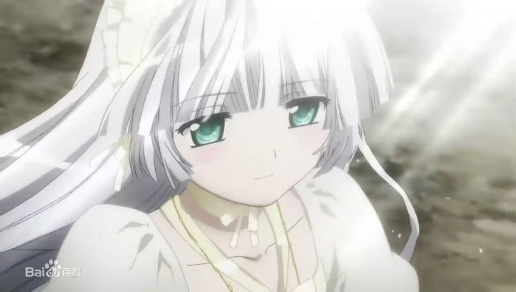
冒泡
  

224楼 | 白榜糖糖TT | 2014-02-08 09:11
    
    2014-02-08 13:21 | 白夜Hara:
    > 欢迎浮上来
* * *
“奈美！”  
“本来就是这样，穹不用不好意思。”奈美说“说起来你们的关系跟我和空哥在某些地方很像，你们也……”说到这，奈美没有继续说下去。  
“也怎么样？”我问道。  
“不，没什么。”奈美不想要继续说下去。  
“你说的没错，是这样。”穹说道。  
“真的是这样啊，果然我猜得没错。”奈美很自然地说道。  
不过我一头雾水，什么也没听懂。  
“奈美不觉得奇怪吗？”穹问道。  
“这有什么奇怪的。”奈美说。  
后来，我们又聊了一些别的话题，不过我似乎成了背景，穹和奈美的性格表面上看起来是那样格格不入，却又能够相处得这么好，很出乎我的意料。  
“穹，真希望我们是一家人呢，什么时候你们一起加入我家好了。”奈美又开起了这个玩笑。  
“有机会的话会考虑的。”穹说道。  
在我家和穹聊了几句后，奈美离开了我家，晚上还会来这里，到时候是穹来做饭，如果奈美吃到了穹的做的菜，怕是会更加自愧不如，在洗碗的时候，我问穹：“奈美那句话到底是什么意思？”  
“哪句？”  
“就是她说我们的关系那句。”  
“H。”  
“H？”一秒后我才反应过来：“难道说……”  
想到这里，我的心骤然一紧。  
“悠不用担心的，奈美不会对别人说。”  
“你为什么这么确定？”我问。  
“因为我比悠更了解奈美的性格。”  
“如果穹确认的话，我也确认。”我说道。  
“悠……”  
“我相信穹的判断是没错的。”  
穹高兴地看着我。
  

225楼 | 白夜Hara | 2014-02-08 09:42
* * *
顶
  

227楼 | Shin-闇栞 | 2014-02-08 10:18
    
    2014-02-08 13:20 | 白夜Hara:
    > 谢谢！
* * *
顶顶顶
  

228楼 | 唯love灬悠穹 | 2014-02-08 10:54
* * *
顶一下的说
  

231楼 | lakecabbage | 2014-02-08 12:08
    
    2014-02-08 13:17 | 白夜Hara:
    > 谢谢！
* * *
继续顶，每次我都来得好晚啊
  

232楼 | 唯love灬悠穹 | 2014-02-08 12:38
    
    2014-02-08 13:17 | 白夜Hara:
    > 不晚不晚
    2014-02-08 13:19 | 唯love灬悠穹:
    > 回复 白夜Hara :现在都不是第一个顶
    2014-02-08 13:22 | 白夜Hara:
    > 有这份心就好
    2014-02-08 13:30 | 唯love灬悠穹:
    > 回复 白夜Hara :嗯，我爸不让我玩手机，所以老是来得很晚
* * *
是边写边码字，还是已经写好了往这里发布……  
N8贝拉reflash 硬格加XX 贴吧V2.1
  

233楼 | DreamlYELLOW | 2014-02-08 12:42
    
    2014-02-08 13:18 | 白夜Hara:
    > 写点发点，有灵感的话就多写一些
    2014-02-08 13:21 | DreamlYELLOW:
    > 哦哦，楼主继续
* * *
“如果想学的话欢迎随时来我家，我和悠都会帮助你的，不过你为什么这么突然就像学做饭？”穹问道：“不仅仅是因为我吧？”  
奈美轻轻点点头：“因为……”  
她突然看了我一眼，似乎有些在意我。  
“没事的，我和悠一心同体，不用不好意思。”  
“一心同体是吗？真羡慕你们。”  
“如果我碍事的话，那我先回避一下。”我正起身要走，突然被奈美拦住：“刚才是我不对，的确，应该对你们一起说，原因是这样的，那天我听到了妈妈和秋姐的谈话……  
母亲：秋，这段时间真是辛苦你了。  
秋：妈妈为了我们每天都这么忙，我这是应该的，更何况我也没有做什么，家事一直都是空在做。  
母亲：是呢，不过，秋，真的是不放心你们，你和空都还好，可是奈美……  
秋：放心，我们会好好地照顾她。  
母亲：说的不是这个，等到将来你和空都走了，又有谁来照顾她，你也知道，她生性强势，又不会做家务，没有什么生存的本事，是不是应该做一些新娘修行？  
秋：每个人都有每个人的路，奈美自会有她的未来。  
母亲：说是这么说，我也没有什么权力去管你们，而且你和……（奈美犹豫了一下，后面的话没有说）  
秋：我们会很好的。  
母亲：但愿是这样。  
后来说的什么我也没有去听，果然我是三个人里面最没用的吗？仔细想想也是，我没有什么地方不让妈妈和秋姐操心，果然我是最不令人省心的一个吗？”  
“别这么想，每个人都有存在的价值，奈美也是一样。”我说道。  
“奈美，最起码在一家人的心中，以及澄弥的心中都是不可或缺的存在，你的存在，才令这一家人充满活力，尽管有时会让空穿女装，也会逼迫他……但是，大家却没有因为这些而对你心存怨恨，因为大家明白，你的强势只是为了掩饰心中的脆弱，不是吗？正是因为奈美的存在才会让大家变得坚强，也有很多时候，跟空之间以及跟穹之间的拌嘴，不就是在给大家带来欢乐吗设想一下，没有了奈美，这个家就会变得死气沉沉，而澄弥也会因为一直被男生骚扰而无法坚强起来，所以，奈美，你也是不可或缺的一员。”  
“穹……”奈美低着头，双手紧紧地攥拳，不停地颤抖：“……谢谢你，不过我也要向他们证明，我还有更大的价值。”  
“如果自己得不到，就宁愿破坏掉的想法，不要再有了。”  
“你什么时候知道的？”奈美惊讶地抬头看着穹，眼眶有些红。  
“奈美已经展现出来了，很容易就会发现。”  
“是这样吗？这方面，你和秋姐真的很像啊。”奈美说道。  
我和穹都没有做声，一阵沉默后，奈美用力地抹抹脸，说道：“谢谢你们，我会让我能够做更多的事情。”  
“洗碗。”  
“哦，我这就去。”我说道。  
“奈美去洗碗。”  
“唉？”奈美惊讶地说道：“现在就开始吗？”  
“任何事都要从现在做起。”穹说道。
  

236楼 | 白夜Hara | 2014-02-08 15:43
    
    2014-02-08 15:51 | ◆胜负师◆:
    > 我没看过秋色之空，但是我猜到剧情了≥﹏≤希望是我猜错了
    2014-02-08 15:55 | lakecabbage:
    > 回复 787063146 :可以去看看也是一部不错的作品
    2014-02-08 16:07 | ◆胜负师◆:
    > 回复 lakecabbage :≥﹏≤自从被二次元吧那些邪恶的家伙骗去看缘之空我就再也不看吧友让我看的动漫了，不过你看起来是可信的
    2014-02-08 16:12 | lakecabbage:
    > 回复 787063146 :啊 看缘之空也不算差啊 叫人去看SD才是坑爹啊 缘之空 秋色之空 虽然有虐 好歹结局还算可以接受的 SD看的我当时就想骂人的~~
    2014-02-08 16:14 | lakecabbage:
    > 回复 787063146 :不过如果你觉得像缘之空这类有点虐的都有点受不了的话 我最推荐的就是去看看圣诞之吻的 完全纯爱 轻松搞笑 很适合抚平心情 也是平行世界 男主绝对专一的~~
    2014-02-08 16:24 | ◆胜负师◆:
    > 回复 lakecabbage :那是因为H情节太多。。。。。不过看完缘之空我还真被虐了一个月。没事没事，我只想不要再让我14看18的东西啦！≥﹏≤
    2014-02-08 16:24 | ◆胜负师◆:
    > 回复 lakecabbage :school day？是不是？
    2014-02-08 16:25 | lakecabbage:
    > 回复 无涯寂寞 :目测在向贤妻良母转变 话多是应该的~~
    2014-02-08 16:29 | lakecabbage:
    > 回复 787063146 :是啊 当初看完sd 整个人都不好了 诚哥确实让人无话可说 算起来我也是被同学坑的 要是事先了解了 万万是不会去看的
    2014-02-08 16:32 | ◆胜负师◆:
    > 回复 lakecabbage :你这一说我突然想看了(我这人啊。。。)
    2014-02-08 16:32 | lakecabbage:
    > 回复 787063146 :如果你嫌H多的话 那还是别看秋色之空了 秋色之空最开始我就直接当里番看的 毕竟作者就是画成人向作品的
    2014-02-08 16:35 | lakecabbage:
    > 回复 787063146 :囧 你没看过sd吗 那首先我是不推荐你去看的 毕竟人渣实在可恶 不过你要去了解一下也不是什么坏事~~做好一定的心理准备就是了
    2014-02-08 17:00 | ◆胜负师◆:
    > 回复 lakecabbage :卧槽。。。。没事我忍了
    2014-07-04 12:30 | 喂那谁我稀饭你:
    > 回复 lakecabbage :为什么看SD就想骂人 首先 当时的水平来说 SD已经相当不错了 而且 SD所要表达的几乎已经完美了 尽管画质一般 甚至可以说差 但是 无碍它是神作
* * *
顶
  

238楼 | Shin-闇栞 | 2014-02-08 16:21
* * *
第三个顶
  

239楼 | 唯love灬悠穹 | 2014-02-08 16:46
* * *
一天之内看了8页，还真累，LZ写的真心不错，  
顶（我是新人的说）
  

240楼 | 阿波卡利斯♀ | 2014-02-08 17:35
    
    2014-02-08 21:10 | 白夜Hara:
    > 谢谢哦，今天有点事所以更新的慢了些
* * *
是啊，楼主呢？
  

242楼 | 阿波卡利斯♀ | 2014-02-08 18:39
* * *
哦，翻页了，连占2楼，等lz，赞一个
  

245楼 | 阿波卡利斯♀ | 2014-02-08 19:03
* * *
更的好快，但是还是需求量太大了吗
  

248楼 | ◆胜负师◆ | 2014-02-08 20:51
* * *
好吧 这是无涯寂寞的小号
  

249楼 | 无涯寂寞2 | 2014-02-08 20:53
    
    2014-02-08 23:56 | lakecabbage:
    > 你这小号很明显~~
    2014-02-09 08:44 | 无涯寂寞2:
    > 回复 lakecabbage :是滴
* * *
顶2
  

252楼 | 无涯寂寞2 | 2014-02-08 21:11
* * *
喵
  

253楼 | 无涯寂寞2 | 2014-02-08 21:47
    
    2014-02-08 21:48 | 白夜Hara:
    > 
    2014-02-08 21:57 | 白夜Hara:
    > 回复 无涯寂寞 :不知道，现在没多少灵感，没写几个字……
* * *
顶
  

254楼 | 唯love灬悠穹 | 2014-02-08 22:22
* * *
就在刚刚，穹被秋姐叫去一起购物，凭借穹优异的成绩，每个月都会获得奖学金，她和秋姐的数额完全相同，两人要去一起购物，我也答应了她，相比之下，我的奖学金显得很少，不过也够我花了，做完家务以后，我躺在沙发上，闲来无事打开电视收看，这个时候电视上正在播放着很久没有看过的奥特曼系列，现在已经出了多少部TV版了？这一部似乎是97年出的那一部。  
没有什么事情，就看一看吧。  
人间体已经被人们发现了，剧情已经接近尾声，不过我还是津津有味地看了下去，这个奥特曼，原来是叫戴拿，以前看过，但是忘记了叫什么名字，直到刚刚才想起来。  
随着剧情的发展，结局已经到来，戴拿最后击败了索菲亚，却被因爆炸而产生的黑洞吸入，离开了他的伙伴，以及他爱的人，和父亲一起消失在了光芒之中。  
看过以后，我不禁想到了我和穹，如果我是奥特曼，我会不会也像他一样不顾生命地守护自己心爱的人。  
我想起了两人曾经唱过的那首歌，我被它的曲调以及歌词所吸引，它的歌词足以传达我对穹炽烈的感情，所以，我想要学会它。  
于是我用穹的电脑查到了那首歌，在电脑前反复地学习。  
几天后，我们几个关系比较好的人决定一起去KTV唱歌，算上我和穹一共6个人，其中有拓也和夏美，男女数量恰好相等，听说夏美不光是钢琴，唱歌也曾经拿过奖，对此很多人都想亲耳听一听她的歌，本来夏美没有答应，可是后来突然就变卦说想去了。  
自然，我也会带着穹一起去，很多人都称赞穹很可爱，穹也只是象征性地回应一下，可是，夏美却说道：“春日野君和穹在一起真的是魅力四射，这是你们所共有的，少了谁都不可以。”  
这一次，穹对夏美的话的态度完全不同于其他人。  
“你们的羁绊真的很深，就像原本就是一体一样，真令人羡慕。”  
“谢谢你，夏美。”穹说道。  
“你们本来就很优秀，我真的很羡慕你们。”夏美说道。  
大家开始点歌，我们一人点了一首，我们被排到了后面，在我们前面的是拓也和夏美，似乎是他们有意而为之。
  

255楼 | 白夜Hara | 2014-02-08 22:55
    
    2014-03-28 04:38 | 无意识的人:
    > 奥特曼。。。楼主你赢了。。。为什么不是哆啦A梦。。。
    2014-03-28 11:33 | 白夜Hara:
    > 回复 无意识的人 :因为我爱看奥特曼，而且很喜欢戴拿的片尾曲
    2017-02-09 14:50 | Jourly◎:
    > 戴拿的大结局里飞鸟在虫洞里见到父亲的那一段好让人感动！
    2018-02-14 18:15 | 可塑并不可逆▫:
    > 233333
* * *
无论在什么地方，什么时候，在我们的头顶都是同样悠远的天穹，就好像是永远都无法分开的羁绊一样.
  

258楼 | 苍玄之灵 | 2014-02-08 23:39
* * *
睡前顶一下
  

259楼 | lakecabbage | 2014-02-08 23:56
* * *
戴拿凹凸曼是什么？好久没看过凹凸曼了，睡前顶一下
  

260楼 | 阿波卡利斯♀ | 2014-02-09 00:02
    
    2014-02-09 09:45 | 白夜Hara:
    > 戴拿·奥特曼，圆谷株式会社在1996年成功拍摄《迪迦·奥特曼》后，又于1997年开拍了“平成三部曲”之二的新作《戴拿·奥特曼》。戴拿奥特曼被设定在迪迦故事结束7年后。像迪迦一样，戴拿是有3种形态的奥特曼。默认的是蓝红银相间的闪亮型，是平成三杰里实力很强悍的战士之一——摘自百度百科
    2014-02-09 12:33 | 阿波卡利斯♀:
    > 恩，迪迦我看过
* * *
顶
  

261楼 | Shin-闇栞 | 2014-02-09 00:07
* * *
凹凸曼
  

262楼 | 4476⚡ | 2014-02-09 00:15
* * *
大家开始点歌，我们一人点了一首，我们被排到了后面，在我们前面的是拓也和夏美，似乎是他们有意而为之。  
大家的唱歌似乎都不错呢，很快便轮到了拓也，选过后，他拿起麦克风，向我们这边看过来，穹就像什么也没有一样，目光依旧停留在电视上，上面显示的名字是《Push Me Away》。  
  
Pushing Me Away - Linkin Park  
  
  
前奏响起，是一阵伴奏，随后是架子鼓和贝斯的混合摇滚，歌曲正式开始，风格很符合拓也呢，只见他站在前面，宛若一名摇滚歌手，配合里面的灯光，就像真正的歌星一样，若是能够登台演出的话，会迷倒无数女性，举手投足之中尽数展现着球场上的那般狂野，歌曲就这样一直进行下去，他的英语说得很好，就像是一个地地道道的美国人一样，我们的身体不觉开始动起来……
  

266楼 | 白夜Hara | 2014-02-09 09:39
* * *
随后是夏美，她的声音所有都很期待，所有人都在注视着她，仿佛在等待偶像的登场，点了一首歌以后，向我这里看了过来，并且做了一个手势，其他的人她一个都没有看，随后向我微笑了一下，笑容很甜美。  
她在音乐方面很有天赋，钢琴弹得很好，说起话来声音也很好听，到底会唱的怎么样，真的很期待。  
她点的是一首《玻璃镜之梦》。  
前奏很恬静，令我们仿佛置身于梦境之中。  
  
  
  
当她的声音刚刚传出的时候，我们便已经被吸引，悦耳而又甜美，足以净化人的灵魂，就连穹也赞叹不已。  
“太好听了……”穹说道。  
夏美果然名不虚传，而且在节奏的把握上准确无误，悠扬的旋律配合她的完美无瑕的，纯净的声音，将我们完全带入了那个世界，沉睡中醒来的纯真少女望着面前的一切，充满了好奇，皎洁的月亮映照在她的脸上，那清澈的眼眸中映照着整个世界。  
鸟语花开之中，女孩怀抱着光与暗离开了森林，当音乐临近尾声的时候，我们仿佛感觉到女孩走出了这里，前往了一个更广阔的天地，在那里，她走过了春夏秋冬，作为一个人类的孩子，生活得很快乐。  
结束的一刻，歌声中表达着对女孩的祝福，即便是她唱完了，我们也依旧沉浸在那完美的歌曲中意犹未尽。
  

267楼 | 白夜Hara | 2014-02-09 09:39
    
    2014-07-28 11:45 | 灰夜之莺◆:
    > 楼主一定玩过美少女梦工厂4
* * *
顶～
  

268楼 | 随风DE逝去FCB | 2014-02-09 09:40
* * *
“穹，到你了哦。”我说道。  
“嗯。”  
穹点下了那首熟悉的歌，在当年的那一次，我才第一次听到穹的歌声，被初佳小姐誉为天使之音，现如今，穹将再一次唱起的时候，我变得紧张起来。  
（没有MP3只好用视频了）  
无法获取该视频,已自动跳过!{'type': '5', 'text': 'http://www.tudou.com/programs/view/FuK_Z87aSxE/'}  
视频来自：[土豆](http://tieba.baidu.com/mo/q/checkurl?url=http%3A%2F%2Fwww.tudou.com%2Fprograms%2Fview%2FFuK_Z87aSxE%2F&meta=1&urlrefer=046dad62b5d99d03ff77879a660f2c13)  
  
所有的人都安静下来，静静地听着穹的歌声，尽管不像夏美那般意蕴深长，可是却给我一种不一样的感觉，不同与夏美的一种澄澈与甜美，就像两个人一个是来自森林的精灵，一个是来自天界的天使，我十分投入地听着，穹一直看向我这边，完美的声音令我想起了我们的曾经，正如歌词中所说，世上最珍贵的记忆是我们一起的时间，世上最幸福的事，就是我们亲密的羁绊，这是穹唱给我的歌，我也已经准备好要回应给穹的歌。  
结束后，穹走到我的身边，红着脸说道：“悠，好听吗？”  
“穹唱的很棒！”我说道。  
“轮到你了哦，悠要唱什么歌？”  
“你马上就会知道了，这首歌的主旨这是我对你的承诺。”
  

269楼 | 白夜Hara | 2014-02-09 09:40
    
    2014-02-09 09:43 | ◆胜负师◆:
    > 楼主你欺负爪机，不过好评
    2014-02-09 09:49 | 白夜Hara:
    > 回复 787063146 :有时间上电脑看一下吧……这是没办法的事情，一开始就决定这么样的，抱歉……
    2014-02-09 09:54 | ◆胜负师◆:
    > 回复 白夜Hara :没事没事，我马上上电脑喵
    2014-02-09 10:11 | 星落苍穹Ex:
    > 回复 白夜Hara :爪机无力+1，话说这视频是悠之空里KTV那段吗？
    2014-02-09 10:20 | Shin-闇栞:
    > 能听到的说
    2014-02-09 15:52 | 白榜糖糖TT:
    > 回复 白夜Hara :真的和QQ音乐里声音不一样呢。。这个更好听些。。。
    2014-02-09 20:28 | 落叶88纷飞:
    > 居然是フタリ。。haruka主题曲啊
    2014-02-18 13:59 | Eephy-:
    > 看到这里 立马用生命去听 果然不亏 顶一顶
    2019-04-14 14:42 | ♤dante♤:
    > 回复 Eephy- :话说视频挂了，那是什么歌呀？
* * *
马
  

270楼 | 冯二进一的帅哥 | 2014-02-09 09:41
* * *
点过歌后，我站在前面，摇滚的声音传了出来，似乎不符合我的气质，和我平日里一贯的作风乍一搭配起来似乎有些无厘头，但是我要通过这首歌，向穹表明心声，这是只唱给穹的！  
  
（插曲：君だけを守りたい - つるの刚士）  
  
  
第一句响起的时候，我看到穹顿时眼前一亮，我选择这首歌令她感觉很意外，娇小的身躯随着我的歌声摆动着，很高兴地看着我。  
“唉？春日野君竟然选择这样的歌曲！”夏美不敢相信。  
在穹的注视下，我展现出了前所未有的爆发力，即便是在高音的部分也没有任何破音的迹象，这首歌赐予我力量，也带动了所有的人，大家跟着我一起摆动起来，穹更是直接跑到我这里，即便没有麦克风，也和我一起高歌，我揽过她的肩膀，唱得更有力量，这首歌是我向全世界的宣言，无论何时何地，无论发生什么，我都只想守护你，穹。  
“悠！加油！”穹喊道。  
我用最后的力量唱过最后一段：“没有人比得上,没有什么比得上,我只想守护着你,不论何时,不论何地,我只想守护着你,啦啦啦啦啦......我只想守护着你,啦啦啦啦啦......我只想守护着你,WOW WOW WOW,再一次,WOW WOW WOW大声呐喊,世界永远不灭!”的时候，所有人都沸腾了，我把穹抱得更紧，宣言过后，是这无声的幸福，我的热血依旧没有冷却，穹就在我的怀中，这是我只想守护的东西。  
“太棒了！悠！”穹高声喊道。  
拓也对我竖起了大拇指。  
“这首歌真的让我对春日野君刮目相看，唱得太好了，而且很有情感。”  
那两个同学也是夸赞我，我的心脏依旧在剧烈的跳动，我感到的不仅仅是血液的极速流动，也是我对于我们的宣言的热情满满。  
今天，我和穹都很开心。
  

271楼 | 白夜Hara | 2014-02-09 09:41
    
    2014-02-09 11:28 | ◆胜负师◆:
    > 好评
    2014-02-09 12:38 | 信仰还在吗✨:
    > 最后一句好像小学生日记
    2014-02-09 13:03 | ◆胜负师◆:
    > 回复 782956070 :是有点，我小学日记结尾斗是今天很开心
    2014-02-09 13:10 | 白夜Hara:
    > 回复 782956070 :貌似是的，写到最后没过脑子直接打完就发上来了，抱歉
    2014-02-09 13:31 | 信仰还在吗✨:
    > 回复 白夜Hara 没关系，楼主加油写
    2014-02-09 13:57 | qq573717931:
    > 好评
    2014-02-09 16:57 | lakecabbage:
    > 回复 白夜Hara :现在这个可以像到哪写到哪嘛 后面再做一次修改润色就好了
    2014-07-23 14:58 | xc329273117:
    > 这篇有泪点啊
* * *
顶顶顶顶顶顶顶顶顶顶顶顶顶顶顶顶顶顶顶顶
  

273楼 | Shin-闇栞 | 2014-02-09 10:22
* * *
来得好晚，竟然已经更了３次
  

274楼 | 唯love灬悠穹 | 2014-02-09 10:37
* * *
顶
  

275楼 | 唯love灬悠穹 | 2014-02-09 10:37
* * *
楼主结局准备写什么呢？先剧透一下，让我们有个底
  

276楼 | 浅唱寒心了 | 2014-02-09 11:03
    
    2014-09-16 08:27 | 🌸夏恋:
    > 撞头像了
* * *
好像我每次都来得很晚，已经更了这么多了啊，顶一个
  

277楼 | 阿波卡利斯♀ | 2014-02-09 12:33
* * *
加了个油
  

282楼 | ◆胜负师◆ | 2014-02-09 13:03
* * *
lz加油
  

284楼 | 嗨咯咯诺 | 2014-02-09 13:34
* * *
@白夜Hara 还更么
  

285楼 | 嗨咯咯诺 | 2014-02-09 14:12
    
    2014-02-09 14:42 | 白夜Hara:
    > 我也不总在贴吧，有时间的话就会码一些字
* * *
天气越来越热，毒辣的太阳再度开始照耀大地，穹的白裙子里面的衣服也变得越来越少，说起来她很少穿除了白色以外的衣服，不过自从她穿过魔公主礼服之后，我的态度发生了很大的转变，偶尔穿一穿其他颜色的衣服也不错，不过我没有对她说。  
放学后，我和空一起去买菜，穹和秋姐一起回家，望着她们远去的背影，感觉她们两人就像亲姐妹一样。  
“她们的感情还真是好呢。”我说道。  
“原本秋姐和奈美的交流相对来说少一些，可是自从穹介入以来，她们就像一个三人组一样无话不说，我甚至都有些被冷落了。”  
“哈哈，空君吃醋了？”  
“才没有，多亏了穹，我们家才能变得这么团结，原本妈妈每天要忙工作，秋姐和奈美也是各忙各的，我要做家务，自从上了大学以来，交流就变得少了，可是自从穹到来以后，秋姐、奈美还有妈妈也会经常说话了，几乎每次聊的都是你们，这一点真是要感谢你们。”  
“更要感谢穹，是她带动了你们。”  
“也有悠君的功劳。”  
“为什么？”我感到不解。  
“因为大家都想要像你一样坚强呢，虽然你没有穹来的那么频繁，可是每次我们说的都是你，你能够在那样的逆境下带着穹走过来，就连秋姐也自叹不如，你是她们之间的纽带，没有你的话穹也很难和她们交流的，所以，悠君在精神方面帮了我们很多，所以，悠君不要贬低自己。”  
“我知道了，空君。”  
“真的希望我能够变得像悠那样坚强，这样我就可以真正地保护秋姐了。”  
“唉？”  
“啊……我的意思是，不让秋姐为我操心了。”  
“不过，就算再怎么样，秋姐都会为你操心的。”  
“为什么？”
  

287楼 | 白夜Hara | 2014-02-09 14:38
    
    2014-02-09 15:03 | ◆胜负师◆:
    > 高产帝你好
* * *
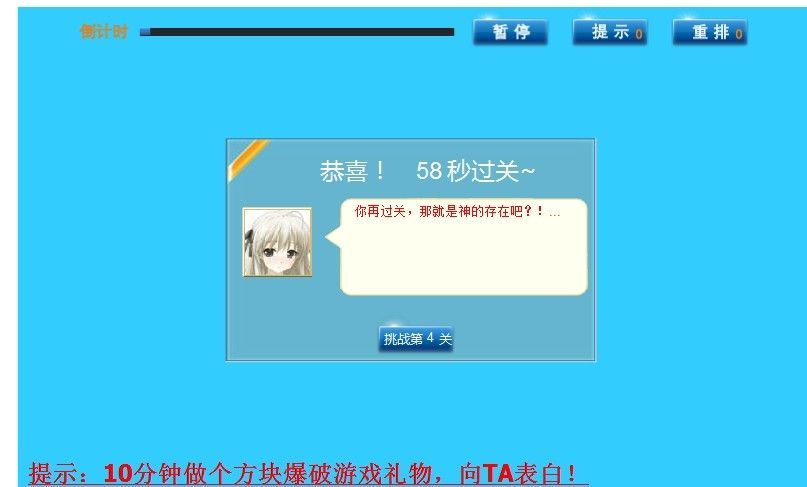
  

288楼 | 阿波卡利斯♀ | 2014-02-09 14:38
* * *
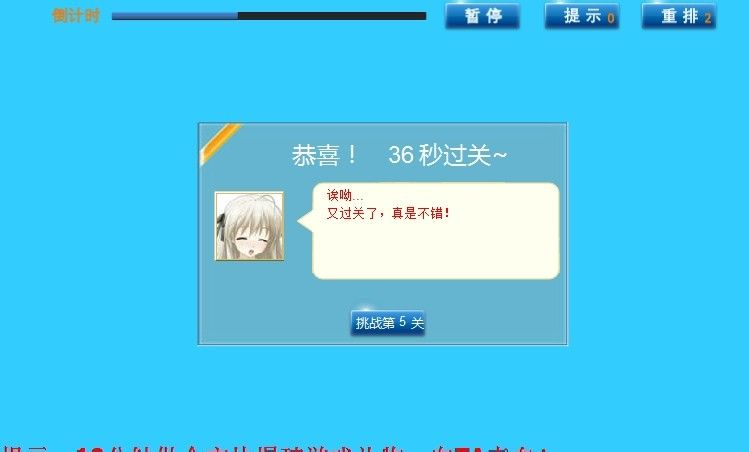
  

289楼 | 阿波卡利斯♀ | 2014-02-09 14:38
* * *
表示刚才玩穹妹连连看，只玩到4关，现在眼里全是穹妹了
  

290楼 | 阿波卡利斯♀ | 2014-02-09 14:39
    
    2014-02-09 14:41 | 白夜Hara:
    > 表示我眼神捉鸡，连连看基本玩不过去
    2014-02-09 14:42 | 阿波卡利斯♀:
    > 额，lz你终于来了，期待更文
    2014-02-09 14:43 | 白夜Hara:
    > 回复 户户户1234562 :刚更完，就在楼上
    2014-02-09 15:02 | 阿波卡利斯♀:
    > 哦，马上发
    2014-02-18 14:05 | Eephy-:
    > 第一次玩 斗鸡眼就出来了
* * *
成功突破第五关，才发现我是第一名，等待楼主更文
  

294楼 | 阿波卡利斯♀ | 2014-02-09 14:51
* * *
苍穹是谁？
  

295楼 | 羽殇and三月 | 2014-02-09 15:01
    
    2014-02-09 20:26 | 无涯寂寞2:
    > 你不适和来火星，回去吧—
* * *
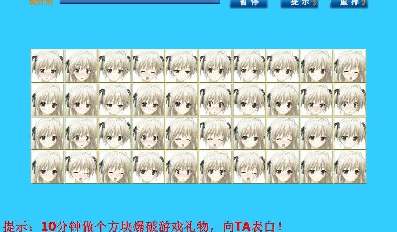
  

296楼 | 阿波卡利斯♀ | 2014-02-09 15:02
    
    2014-02-23 00:11 | lafeierluo:
    > 丝勾唉
* * *
这连连看的游戏看起来很凶残的样子啊
  

297楼 | lakecabbage | 2014-02-09 16:58
* * *
不错 楼主 支持
  

301楼 | 最爱消失的枫叶 | 2014-02-09 17:34
    
    2014-02-09 21:20 | 白夜Hara:
    > 谢谢
* * *
我是不是最晚的
  

302楼 | 唯love灬悠穹 | 2014-02-09 18:23
    
    2014-02-09 22:11 | 唯love灬悠穹:
    > 回复 无涯寂寞 :
* * *
偶最晚= =
  

303楼 | º零º | 2014-02-09 18:45
    
    2014-02-09 21:20 | 白夜Hara:
    > 没有晚不晚这一说
* * *
这么长的时间过去，大家都算好基友了吧
  

304楼 | 无涯寂寞2 | 2014-02-09 20:24
    
    2014-02-09 21:19 | 白夜Hara:
    > 估计是这样
* * *
送给大家供着 

  

305楼 | 无涯寂寞2 | 2014-02-09 20:27
* * *

  

306楼 | 无涯寂寞2 | 2014-02-09 20:28
* * *
还要吗
  

307楼 | 无涯寂寞2 | 2014-02-09 20:28
    
    2014-05-06 18:34 | 卫子栋饶星系:
    > 要 我就是毁天灭地的卫子栋，我几曾怕过这些！
* * *
不错啊。  
顶顶更健康  
——我是一只可爱的蓝蓝路
  

308楼 | 落叶88纷飞 | 2014-02-09 20:37
* * *
充满智慧的(楼)主啊，愿你用你的智慧更新更美好的下一篇，阿门
  

309楼 | 无涯寂寞2 | 2014-02-09 21:06
    
    2014-02-09 21:19 | 白夜Hara:
    > 担当不起啊
* * *
为啥笑涅坐等更新，，顶顶顶顶顶顶顶顶顶顶
  

311楼 | 无涯寂寞2 | 2014-02-09 21:37
    
    2014-02-09 21:39 | 白夜Hara:
    > 中里这个姓氏难道没有想到某个人吗？
    2014-02-09 21:40 | 无涯寂寞2:
    > 回复 白夜Hara :哦————算了 不要剧透
    2014-02-09 21:42 | 白夜Hara:
    > 回复 无涯寂寞2 :这个不是剧不剧透的事吧？
    2014-02-09 21:45 | 无涯寂寞2:
    > 是啊，很显然啊，我是个笨蛋
    2014-02-09 21:46 | 白夜Hara:
    > 回复 无涯寂寞2 :我不是这个意思，别自暴自弃啊
    2014-02-09 21:48 | 无涯寂寞2:
    > 回复 白夜Hara :没事
    2014-02-09 22:11 | 唯love灬悠穹:
    > 回复 白夜Hara :亮平大叔
    2014-02-09 22:22 | 无涯寂寞2:
    > 回复 唯love灬悠穹 :说了不剧透的
    2014-02-09 22:24 | 唯love灬悠穹:
    > 回复 无涯寂寞2 :可亮平前辈不是一般人
    2014-02-09 22:32 | 无涯寂寞2:
    > 回复 唯love灬悠穹 :好吧，这是事实
    2014-02-10 00:15 | Shin-闇栞:
    > 亮平。。。
* * *
顶一下
  

312楼 | lakecabbage | 2014-02-09 22:03
* * *
顶 晚安
  

313楼 | 无涯寂寞2 | 2014-02-09 22:22
* * *
顶
  

314楼 | 唯love灬悠穹 | 2014-02-09 22:24
* * *
顶 不太上网 但基本都看  
LZ加油
  

315楼 | 午夜天空星 | 2014-02-09 22:40
* * *
留
  

316楼 | 无为无不为🌙 | 2014-02-09 23:18
* * *
顶
  

317楼 | Shin-闇栞 | 2014-02-10 00:15
* * *
早安，，顶
  

318楼 | 无涯寂寞2 | 2014-02-10 09:29
* * *
“怎么了，悠？”  
“我以前有个同学也姓中里，而且大叔化非常严重，经常调戏女生，每次都免不了被暴打一顿，可是就算是这样她还是死性不改。”  
“哈哈！”空也笑了起来：“有这么个同学还真是麻烦。”  
“不过他表面上是那样，实际上非常善解人意，而且很热心，在我困惑的时候他会安慰我，又一次我和穹……”说到这件事的时候，我收住了自己将要说出的话。  
“怎么了？”  
“我们曾经大吵过一架，穹离家出走，他和我的几个朋友帮我们找了一天，却没有要求什么，对于这件事，我非常感激。”  
“悠有非常好的朋友。”  
“是啊，要是没有她们，我和穹不知道会怎么样。”  
“有这么多理解你的朋友，真好啊……”  
“唉，空怎么这么说？”  
“我有很多朋友，可是很少有真正能够理解我的，曾经有过一个为我着想过一次的，可是我拒绝了她。”  
“为什么？”  
“因为我的心里根本容不下她。”  
“那你心里的人是谁？”  
“……”空感到自己说漏了什么，接下来也没有说话。  
“既然空不愿意，那我就不问了，不过空君，我想你应该更好地融入他们，向他们表达你自己的内心。”很多时候因为叫穹的时候直接说Sora，所以当说到空君（SoraKun）的时候容易混淆，当年为了区分他们的举措现在看来简直是在给自己找麻烦，不过当着两个人的面喊他们两个的确也表达不清，也就只能这样了。  
“很多时候空君过于为他人着想，不去表达自己的意愿，这样的话很少有人会理解你的，空君不会拒绝别人，这一点虽然有时候很好，可是对于自己来说，也要有自己坚定的信念，该拒绝的就要拒绝，就像你说的，拒绝了为你考虑的那个人一样。”  
这似乎勾起了空的回忆，他正在想过去拒绝那个女生那件事情吗？
  

319楼 | 白夜Hara | 2014-02-10 09:58
* * *
顶
  

320楼 | 无涯寂寞2 | 2014-02-10 10:04
* * *
潜水了那么就也该顶一下了
  

321楼 | v星v月v | 2014-02-10 10:46
* * *
顶个
  

322楼 | 爱情的红海 | 2014-02-10 11:01
* * *
都出来冒个泡啊，这么冷清
  

324楼 | 无涯寂寞2 | 2014-02-10 11:59
* * *
我顶
  

325楼 | 随风逝time | 2014-02-10 12:25
* * *
我妈给电脑设了密码，我试了快20次才成功，第一件事就是来看文，lz加油
  

326楼 | 阿波卡利斯♀ | 2014-02-10 14:02
    
    2014-02-10 14:39 | 无涯寂寞2:
    > 有毅力啊
    2014-02-10 14:43 | 阿波卡利斯♀:
    > 回复 无涯寂寞2 :恩，我打算自己把密码改掉，这样爸妈就开不了电脑了
    2014-02-10 14:44 | 无涯寂寞2:
    > 回复 户户户1234562 :顶你，愿你能看到明天升起的太阳，阿-----门
    2014-02-10 14:47 | 阿波卡利斯♀:
    > .......我想我爸妈应该会把电脑拿走吧（我家是笔记本电脑）
* * *
“那个，时间不早了，再不买菜的话她们可就要饿肚子了。”  
“哦，快走吧，抱歉，悠君。”  
“没什么，要是能够对空君有帮助的话，这些时间就很值得去浪费。”  
“嗯。”  
“你刚刚说那个中里大叔怎么回事？”  
“他可能是最近家里面有事情，他这个人的营业时间很不固定，有时候可能连着半年都不休息，可能三天打鱼两天晒网，这个人人员很好，说起话来很豪爽，但是也很随性，就算这样，每当他来的时候，人们都会选择他的菜。”  
“是这样啊。”  
我们一起在市场中走着，买菜期间，空教了我很多辨别蔬菜新鲜与否的方法，里面有很多技巧我在以前几乎没有听过，很多大妈也会对空打招呼，我问他时，他说在很小的时候家事就由自己来干，到现在已经过了很多年了，在买菜的人群中，空算是最特殊的一个，也难怪这么引人注目。  
好几次，我都挑了不新鲜的蔬菜，这时空来告诉我，并且拿了一个新鲜的和我手里的做对比，这样就直观很多，这一次和空买菜，我从他那里得到了不少的经验，在以后也会很有用处。  
我们拎着袋子，一起走在回家的路上，期间穹给我发了个短信，我像往常那样回复。  
“以后如果可以的话就一起来吧。”空说道。  
“好啊。”我说道。  
“和悠君感觉很聊得来。”空说道。  
“那么，空君可以来找我，随时欢迎哦。”我说道。  
“不会给你们添麻烦吧？”  
“当然不会，穹经常去你家，秋姐和奈美不是也很欢迎她吗？空君如果想来随时可以来，正好我有很多东西要向你请教。”  
“嗯，有时间我会去的。”  
“如果空君觉得累的话，我也可以去帮你去做一部分家务。”  
“这个我自己来就好，家务什么的我早就习惯了，这些对我不算什么。”  
“就算是这么说，能够每天坚持这么做也是一件很了不起的事情，不管怎么说，你也撑起了这个家。”  
“我撑起了这个家？”  
“是的，如果没有你的话，这个家会变成什么样子简直无法想像，所以说，空也是很重要的，要有信心，空。”  
当我们走到楼门前的时候，迎面碰上一个扎着马尾的长发女生，长得很可爱，典型的运动型女孩，一身运动服很符合她的气质。  
“嗨，葵君！”  
“咲月同学，你好。”  
“呵呵，要是我再出来晚一些的话就会和葵君相遇了。”  
“唉？难道你又……”  
“是啊，差点就和葵君相遇的说，现在一想想心就会挑个不停。”
  

327楼 | 白夜Hara | 2014-02-10 14:16
    
    2014-02-11 15:47 | 我是打酱油滴03:
    > 话说月之前那个字怎么读的？还有派对那一话至今令我印象深刻……
    2014-02-11 16:43 | 白夜Hara:
    > 回复 我是打酱油滴03 :念xiao，四声
    2014-02-11 17:35 | 我是打酱油滴03:
    > 我一直以为是 GUAN.....LZ文写的不错。很符合原著性格啊。赞一个
    2016-07-21 19:17 | 琪♬露♬诺:
    > 猜到她也差不多该出现了
    2016-08-04 11:47 | 周小鱼😜:
    > 啪的次数太少了，要知道他们是兄妹恋
* * *
顶一个
  

328楼 | 斯瓦尔巴123 | 2014-02-10 14:41
    
    2014-02-10 16:35 | 白夜Hara:
    > 谢谢
* * *
明明已经碰上面了，为啥又“差点相遇”涅
  

329楼 | 无涯寂寞2 | 2014-02-10 14:42
    
    2014-02-10 14:44 | 白夜Hara:
    > 看过秋色之空就理解啥意思了
    2014-02-10 14:46 | 无涯寂寞2:
    > 回复 白夜Hara :是是“贴”在一起的意思吗？
    2014-02-10 14:49 | 阿波卡利斯♀:
    > 表示还是不懂
    2014-02-10 14:52 | 白夜Hara:
    > 回复 户户户1234562 :咲月露娜不是暴露狂吗？经常会在外暴露，而且只有在空面前这样才会有心跳不已的感觉
* * *
lz加油
  

330楼 | 嗨咯咯诺 | 2014-02-10 14:43
    
    2014-02-10 16:35 | 白夜Hara:
    > 谢谢！
* * *
每次LZ更新时都有好大反响(褒意词)，还是LZ有魅力啊
  

331楼 | 无涯寂寞2 | 2014-02-10 15:37
    
    2014-02-10 16:36 | 白夜Hara:
    > 那是当然
* * *
平均更新速度为3小时一次，还不算睡觉时间，LZ要努力了
  

333楼 | 无涯寂寞2 | 2014-02-10 16:43
* * *
“太危险了啊，咲月同学。”  
“到现在为止还是只有你能让我的心跳个不停。”  
“还是这样吗……”  
“是啊，啊嘞？葵君，你旁边的这位是谁啊？是同一个大学的同学吗？”那个叫咲月的同学问道。  
“不是，他是新来的的邻居，住在我家隔壁，叫春日野悠。”  
“你好，春日野君，我叫咲月露娜，请多多指教。”  
“请多多指教，咲月同学。”  
“嗯，那我先走了，瞳还在等着我呢。”  
“是友崎同学吗？”  
“是啊，那我先走了，拜拜，葵君，春日野君！”  
之前咲月同学和空君说的话我怎么一个字都没有听懂？总感觉里面有些蹊跷，算了，反正也和我没有什么关系，不去想就是了。  
回到家的时候，穹正在房间里无聊地玩着电脑。  
“我回来了！”  
“好慢。”  
“抱歉，穹，我这就去做饭。”  
“你和空君聊了很多吧？”  
“嗯，是啊，空君这个人性格还是有些懦弱，不过我相信他能够改变。”  
“但愿如此。”  
“如果空能够改变的话，那个家也会有很大的变化啊。”  
“悠。”  
“什么？”  
“做饭吧，我饿了。”  
“啊，抱歉。”  
说着，我和穹一起进厨房做菜，在那之前奈美曾经来拜访过一次，我们教了她一些关于家事的技巧，并且她观摩了我们做菜的整个程序，我们留她在家里吃，可是奈美没有答应，这个时间，她的家里晚饭也快好了。
  

334楼 | 白夜Hara | 2014-02-10 17:27
    
    2014-02-12 16:02 | 我是打酱油滴03:
    > 瞳是不是那个美术部的？
    2014-02-12 16:36 | 白夜Hara:
    > 回复 我是打酱油滴03 :美术部的是朝菜优奈，友崎瞳是发起派对那个
    2014-02-12 17:37 | 我是打酱油滴03:
    > 回复 白夜Hara :……好吧，时间长忘了，可那次派对后不是已经不联系了？
    2014-02-12 17:55 | 白夜Hara:
    > 回复 我是打酱油滴03 :没表不代表不联系，原著只是说空和友崎瞳不联系了
    2014-02-12 18:02 | 我是打酱油滴03:
    > 回复 白夜Hara :露娜说那次后没有去过派对……第四话最后一点。这一话当时看了好多遍(≥▽≤) Y
    2014-02-12 18:10 | 白夜Hara:
    > 回复 我是打酱油滴03 :当时的构思只是安排见一面就完事没想到会有歧义，我的想法只是普通朋友之间一起玩而已，没留意到这个细节
    2014-02-14 18:07 | a1149072575:
    > mark
* * *
顶一下
  

335楼 | lakecabbage | 2014-02-10 17:46
* * *
顶
  

336楼 | 零泪雪痕 | 2014-02-10 17:46
* * *
顶
  

337楼 | 无涯寂寞2 | 2014-02-10 17:49
* * *
再顶
  

338楼 | 爱把时间冻结 | 2014-02-10 19:16
* * *
有活着的吗？
  

339楼 | 无涯寂寞2 | 2014-02-10 19:34
* * *
顶一下 话说你新建立的吧名字好神奇
  

342楼 | lakecabbage | 2014-02-10 22:31
    
    2014-02-11 16:45 | 白夜Hara:
    > 神奇……吗？
* * *
顶
  

343楼 | Shin-闇栞 | 2014-02-10 23:37
* * *
顶
  

344楼 | 唯love灬悠穹 | 2014-02-10 23:43
* * *
DDDDDD  
—————— 无论我们身在何处,头顶上永远是悠远的苍穹,就好像他们从未分开过一样。
  

345楼 | 浅唱T聆听 | 2014-02-11 00:40
* * *
lz加油，lz晚安。。。
  

346楼 | yt丶城 | 2014-02-11 01:47
* * *
顶个
  

348楼 | 唯love灬悠穹 | 2014-02-11 09:32
* * *
“怎么？”穹问道。  
“那件衣服，感觉还好吗？”那个女生问道。  
“哪……”穹话未说完，似乎想起来了什么，说道：“那件衣服就是你设计的吗？”  
“嗯，穿上感觉怎么样？”  
“嗯，感觉很好，而且……悠也很喜欢。”穹说道。  
“太好了。”  
“怎么样，我说的吧。”奈美骄傲地说道。  
“是啊。”  
“悠君，穹，这就是我说的澄弥可奈。”  
“初次见面，请多关照。”  
“请多关照，澄弥同学。”我说道。  
“请多关照。”穹说。  
“我说，穹。”奈美说道。  
“什么？”  
“穹也和我一起给澄弥当模特吧，喏。”说着，奈美拿出了一个入届书，放在穹眼前。  
“我来当模特吗？”  
“当然了，你当模特再适合不过了。”  
“可是，我们是同一个学校的吗？”我问道。  
“不是，不过坐新干线的话半个小时就到，我们经常往来就好。”奈美说道。  
“可是这样，春日野君和穹会认为很麻烦吧？”澄弥说道。  
“哪里，穹一穿上那件衣服悠君就直勾勾地看着，半天都没回过神。”奈美坏笑着说道。  
“而且穹不用担心，空哥也加入了。”说着，奈美拿出了另一张，在签名的地方“葵苍空”三字赫然在目。  
“这……我可没有要加入的说！”空说道。  
“你说些什么，已经加入了的说，证据就在这里！”  
“又是奈美你自作主张！我不会加入的！”  
“不行，抗议无效！”  
“那些衣服我不会穿的！”  
“是吗……空君不愿意吗？”澄弥有些失落的样子。  
“不……不是啦，我不是那个意思。”  
“那就是说，空哥愿意加入咯？”  
“唉？”  
“嘿嘿，那就是空哥答应了，那就说定了，空哥正式成为新服装社的外援！”
  

349楼 | 白夜Hara | 2014-02-11 10:30
    
    2014-02-11 14:40 | 白榜糖糖TT:
    > 语气和语言真的就和动漫一模一样呢
    2014-02-11 16:45 | 白夜Hara:
    > 回复 白榜糖糖TT :为了写这个我可是重新玩过缘之空和悠之空还看了动漫
* * *
楼主高产，良心啊。。。顶一个
  

350楼 | 斯瓦尔巴123 | 2014-02-11 11:44
    
    2014-02-11 16:44 | 白夜Hara:
    > 喜欢的话有空常来哦
* * *
“外援？”我不解地问道。  
“是啊，毕竟空哥不是和澄弥一个学校的，要不悠君也加入进来？可奈会为你特别定制一套大一号的，怎么样？要不要考虑一下？悠~君~”奈美坏笑地看着我，不过穿女装的话还是算了吧。  
“悠穿上女装和我就更像双胞胎了。”穹说道。  
“诶？连穹你也出卖我！”  
“哼~”穹的头朝向一边，轻轻地哼了一声。  
“你们先聊吧，我先回去了！”说着，我转身开溜。  
不过也就在我转身的时候，秋姐也从屋子里面走了出来，一件宽松的吊带上衣，下面和奈美一样穿着紧身短裤。  
“喝啊~”秋姐打了个哈欠，眼神很朦胧。  
“哦？小悠和小穹来了？澄弥同学也在，今天真热闹啊。”  
“啊，打扰葵前辈休息了，实在抱歉！”澄弥轻轻地鞠躬道歉。  
“没事没事，话说你们正在讨论什么啊，这么热闹。”秋姐问。  
“空答应要加入服装部，结果不承认。”奈美说道。  
“谁答应要加入服装部了！”空反驳道。  
“名字都在这里还要赖账吗？”奈美说道。  
“那根本不是我写的！”  
“啊~空的话穿女装还是蛮可爱的说，真的就像女孩子一样。”秋姐笑道。  
“诶？秋姐你也……”  
“虽说我也很想看，不过空不同意的话，奈美……”秋姐朝奈美笑了一下。  
“真是，你们这对笨蛋情侣！”奈美不服气地哼了一声。  
“好啦，奈美，要不我来当模特怎么样？”  
“唉？秋姐，你要当？”奈美不信的样子。  
“葵前辈本来就很漂亮，如果是这样那真是太好了！”澄弥说道。  
“我也加入。”穹说道。  
“小穹也加入吗？太好了。”秋姐说道。  
“没办法嘛，因为悠喜欢。”穹说。  
“看来澄弥同学那天设计的很成功呢，小悠当时真的是看得直勾勾的。”不愧是姐妹，同步率真高！  
“谁直勾勾了！”我反驳道。  
“哈哈，小悠害羞的表情真是可爱呢。”秋姐说道。
  

351楼 | 白夜Hara | 2014-02-11 12:46
* * *
顶
  

352楼 | 无涯寂寞2 | 2014-02-11 12:52
* * *
我回来啦
  

353楼 | 无涯寂寞2 | 2014-02-11 12:52
* * *
顶  
——我是蓝蓝路教主！快拜见教主！
  

354楼 | 落叶88纷飞 | 2014-02-11 13:37
* * *
顶
  

355楼 | 爱把时间冻结 | 2014-02-11 14:09
* * *
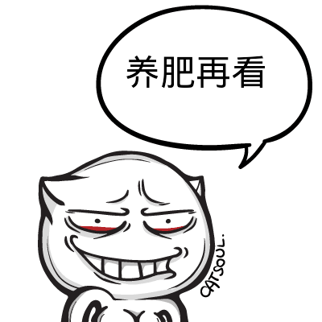
  

356楼 | 我是打酱油滴03 | 2014-02-11 15:13
* * *
第一人称不看。。。不过作者辛苦了，赞一个。
  

357楼 | 东寺鬼 | 2014-02-11 15:18
* * *
顶
  

358楼 | 赖根哟 | 2014-02-11 15:21
    
    2014-02-11 16:44 | 白夜Hara:
    > 谢谢！
* * *
我被秋姐弄得很尴尬，就算是空调的功率这么大，我依旧感觉脸上滚烫滚烫的，估计已经红得像烙铁一样了。  
“澄弥同学，你的服装部现在怎么样了？”秋姐问。  
“开始的时候人很少，后来渐渐就多了，大家对服装设计的热情很高，而且我们也和动漫部经常互动，参与Cosplay的制作，有些衣服也会在学校出售，很畅销呢。”澄弥说道。  
“那真是太好了。”秋姐说道。  
“穹同学那件衣服是我和一些主要部员花费了几天几夜才制作出来的，无论是外形还是颜色都是经过了激烈的讨论还有无数次整合才定下来，这种恶魔系的衣服我还是第一次尝试制作，没想到效果会这么好，不过，穹同学。”澄弥突然把目光转向穹。  
“什么？”  
“那件衣服只有在你的身上才会体现到极致，我也曾经又做了几件给女部员试穿，可是没有一个人的效果比穹更好。”澄弥说道。  
“那时的穹跟现在的穹完全就是两种气质。”我说道。  
“今天看到穹同学我真的很意外，穹竟然这么纯洁。”  
“那张照片你没给别人看吧？”我问道。  
“没有，奈美和我说过。”  
“澄弥同学，有什么我能穿的吗？”秋姐问道。  
“目前还没有，拿回来的都是按照奈美的体形设计的，所以没有葵前辈能穿的。”  
“这样啊，好可惜，上次看到穹那么漂亮我也有些心动的说。”  
不过澄弥很高兴：“下次我一定会把我们最新设计的成果带来的，秋前辈。”  
“我很期待哦。”秋姐说道。  
“那我可以退部了吗？”空弱弱地问道。  
“好啦好啦，想退就退吧，反正人也这么多。”说着，奈美将那张写着葵苍空的入届书往空君那边顺手一甩，被空捡起。  
“空君不来好可惜啊。”澄弥说道。  
“不是还有我吗？反正我和空哥相貌上也没什么差别。”奈美说。  
“嗯，是啊。”  
今天因为澄弥的到来，秋姐家变得很热闹，过了一会之后，澄弥同学就离开了，奈美出去送她，两人很亲昵的样子，就像一对情侣一样。
  

359楼 | 白夜Hara | 2014-02-11 16:37
    
    2014-08-10 14:20 | mianhuabao9:
    > 奈美和澄弥不都是女生吗，为什么会像情侣
    2014-08-10 14:20 | mianhuabao9:
    > 奈美和澄弥不都是女生吗，为什么会像情侣
    2014-11-30 02:20 | 觉不loli控:
    > 回复 mianhuabao9 :看过漫画就知道了奈美喜欢澄弥
    2014-11-30 16:31 | mianhuabao9:
    > 回复 觉不loli控 ：据说太邪恶不敢看
    2014-11-30 16:55 | 觉不loli控:
    > 回复 mianhuabao9 :可以看下挺不错的，邪恶的话在吧里待几天就可以无视了
    2014-11-30 16:56 | mianhuabao9:
    > 回复 觉不loli控 ：哈哈哈我有时间看
    2014-11-30 16:57 | 觉不loli控:
    > 回复 mianhuabao9 :好滴祝你阅读愉快
    2016-07-21 19:23 | 琪♬露♬诺:
    > 漫画里成为了情侣
    2016-08-15 12:18 | 乐观的秋姐穹妹:
    > 漫画里就是情侣啊
* * *
顶个
  

360楼 | 爱情的红海 | 2014-02-11 16:41
    
    2014-02-11 16:43 | 白夜Hara:
    > 谢谢！
* * *
太速度了吧！！
  

361楼 | 无涯寂寞2 | 2014-02-11 16:56
    
    2014-02-11 17:04 | 白夜Hara:
    > 反正今天没什么事就多写了一些
    2014-02-11 18:01 | 无涯寂寞2:
    > 回复 白夜Hara :加油哦，德玛西亚与你同在
* * *
于是LZ霸王硬上弓 把周围的妹子全部攻略了2........
  

362楼 | 威风的哈尼💤 | 2014-02-11 19:23
* * *
我凑
  

363楼 | 咻卡咻卡咻💕 | 2014-02-11 19:25
* * *
好百合……
  

364楼 | achiefangel | 2014-02-11 19:45
* * *
顶顶顶顶顶顶顶顶(#顶起)支持楼主
  

365楼 | 风丶穹 | 2014-02-11 21:11
* * *
目前出现的女性，帮忙整理一下
  

366楼 | 无涯寂寞2 | 2014-02-11 21:52
* * *
“小穹，我刚刚发现了一个很好玩的网站，要不要来看看？”秋姐问道。  
“嗯！”穹高兴地回应道。  
于是，两人进了房间，整个客厅一下子只剩下我和空两个人。  
“悠君要喝些麦茶吗？”空问道。  
“谢谢，不过我现在不渴。”  
“你先看会电视吧，我还有些家务活要干。”说着，空站了起来。  
“我也来帮忙，正好我还有很多这方面的问题要请教。”我也站了起来。  
我帮助空一起做家务活，他教了我很多关于家务活的技巧，这让我受益许多，在以后也会派上很大用场。  
我和空正在做家务的时候，葵家的母亲回来了。  
“我回来了！”  
当他看到我正帮助空做家务的时候，笑着摸摸我的头，说道：“小悠真是懂事呢。”  
“妈妈，您今天回得真早。”  
“是啊，连着忙了几天，公司的活总算干完了，老板也就特批我们早回来一些，小穹没来吗？”  
“她在屋里和秋姐一起玩电脑。”我说道。  
“这样啊，她们两个关系真好。”  
我和她一起坐在沙发上，空说剩下的活交给他就好。  
“小悠最近经济紧张吗？”葵家母亲问道。  
“还好，我和穹的奖学金还能支撑一阵子。”  
“如果需要的话随时跟阿姨说。”  
“阿姨工作也很辛苦，把她们养大也很不容易，不用担心我和穹，我们会照顾好自己。”我说道。  
空为我们端上了水果，阿姨让空也坐下。  
“每次小穹来到这里，秋和奈美都免不了要拌几句嘴，有时候小穹也会被卷在里面，秋和奈美都很喜欢小穹，也因此关系变得更好了，这也都多亏了你们。”阿姨说道。
  

367楼 | 白夜Hara | 2014-02-11 21:58
* * *
总结一下到目前为止出现的人物  
女：  
缘之空：春日野穹  
秋色之空：葵亚希、葵奈美、葵家母亲、咲月露娜、澄弥可奈  
原创：伊东夏美  
男：  
缘之空：春日野悠  
秋色之空：葵苍空、美原美春  
原创：五十岚拓也
  

368楼 | 白夜Hara | 2014-02-11 22:13
    
    2014-02-11 22:14 | 白夜Hara:
    > @无涯寂寞2
    2014-02-11 22:14 | 白夜Hara:
    > @无涯寂寞2
    2014-02-11 22:14 | 无涯寂寞2:
    > 谢谢，正凌乱着呢
    2014-02-12 10:50 | ◆胜负师◆:
    > 说好的别的动漫的人物(诚哥)呢
    2014-07-23 15:16 | xc329273117:
    > 为什么感觉现在穹悠又跟不是情侣一样
* * *
想看秋色，很H吗？
  

369楼 | 无涯寂寞2 | 2014-02-11 22:16
    
    2014-02-11 22:18 | 白夜Hara:
    > 还好，h情节比缘之空多，但也是只露上面两点
    2014-02-11 22:52 | 无涯寂寞2:
    > 回复 白夜Hara :
    2016-07-21 19:25 | 琪♬露♬诺:
    > 还有轮奸派对你说呢
* * *
默默顶
  

370楼 | 唯love灬悠穹 | 2014-02-11 22:30
* * *
好看，楼主辛苦了，给你赞一个。^ω^希望穹妹的戏份可以多点
  

371楼 | 星海曦澄 | 2014-02-11 23:15
    
    2014-02-12 13:36 | 白夜Hara:
    > 谢谢，我会尽量加一些
    2014-02-12 21:46 | 星海曦澄:
    > 回复 白夜Hara :
    2014-02-12 21:52 | 星海曦澄:
    > 回复 白夜Hara :楼主很细心呢，刷了好几层楼过去，还看见我的留言
* * *
顶
  

375楼 | Shin-闇栞 | 2014-02-12 00:59
* * *
顶，早上好
  

376楼 | 无涯寂寞2 | 2014-02-12 08:55
* * *
顶
  

377楼 | 唯love灬悠穹 | 2014-02-12 09:18
* * *
lz快更，我看着挺不错的，不过可不可以弄个txt文档整合一下
  

378楼 | 7012117 | 2014-02-12 09:56
    
    2014-02-12 11:48 | 白夜Hara:
    > 写完之后看看吧
* * *
每日一顶
  

379楼 | 斯瓦尔巴123 | 2014-02-12 10:41
* * *
“是啊，悠君，有很多有意思的事情你都错过了。”  
说着，母子俩开始给我讲秋姐、奈美和穹之间发生的趣事，很多事情弄得我笑个不停，阿姨的倦容也明显轻松了许多。  
“啊，妈妈你怎么回来了！对不起，刚才一直戴着耳机，没听到。”秋姐突然从自己的房间走了出来，看到阿姨，很吃惊地说道。  
“你和小穹在一起玩吗？”  
“嗯，我前些天在一个网站上看到一个很有意思的动漫，所以就叫小穹一起来了。”  
阿姨笑了笑，说道：“真是一对好姐妹。”  
“小穹真的就像我的妹妹一样。”秋姐说道。  
我不知道自己的脸上现在是什么表情。  
“啊嘞。小悠吃醋了吗？”秋姐笑道。  
“才……才没有！”越是这么解释貌似越没有说服力。  
“还说呢，你的脸都红了。”  
这时，奈美也回来了，看到阿姨回来这么早同样很惊讶，问出了和秋姐一样的问题，在看到了秋姐和穹以后不服气地说道：“上次输了是运气的原因，这次我一定要杀翻你们！”  
“奈美斗志这么高昂的话就来吧。”秋姐说道。  
“随时应战。”穹说。  
说着，奈美不服气地走进了秋姐的房间，房门被重重地扣上，没过多长时间便传来了奈美的惨叫声。  
“又输了！！！这局不算，不算！再来！”  
“她们在玩什么，这么起劲？”我问空道。  
“好像是叫《游戏王》。”空说道。  
这个名字好熟悉啊，好像以前的时候看过，那个时候班级里面很多人在玩，不过我并不是很感兴趣，没想到现如今她们竟然在玩。如果是在以前的话估计穹连碰都不会去碰。  
每隔一段时间，屋子里面都会传来奈美的声音，好像一直到现在奈美都没赢过，穹和秋姐的智力天生就很高，奈美想赢的确是太困难。  
不久后，奈美从屋子里走了出来，一副不服气的表情。  
“今天是我手风不顺，明天接着来！”  
说着，她走回了自己的房间。  
我走了过去，发现穹和秋姐的战斗仍在继续，两个人说的什么融合啊，召唤啊，魔法卡陷阱卡啊什么的我都听得不是很懂，她们的嘴里面说着各种各样的术语，随着她们说的话，桌子上的牌也在不停地变化，两个人就像用扑克斗法的魔术师一般，不停地变换着场上的牌。  
后来，貌似是秋姐的一个失误被穹抓到了机会，秋姐一路被动，最后被穹一击致命。
  

380楼 | 白夜Hara | 2014-02-12 11:25
    
    2014-02-12 12:04 | 星落苍穹Ex:
    > 穹妹果断上冥现卡组
    2014-02-12 16:26 | lakecabbage:
    > 试试我大卡手界
    2014-02-12 17:54 | ◆胜负师◆:
    > 穹妹用的是娘话卡组么。。。
    2014-02-12 18:57 | 我是打酱油滴03:
    > 黑魔导卡组表示穹妹我很适合你
    2014-02-15 22:47 | 纳over尼:
    > 还是入魔好玩，龙骑星爆也不错，65，熔岩也不错，打遍学校无敌手
    2014-03-08 12:31 | 五河琴里💍💍:
    > 回复 纳over尼 :六武众的确变态，当初就凭这卡组称霸全校。。。
    2014-07-23 15:18 | xc329273117:
    > 我要影依。。。。。
    2014-08-20 23:38 | chensi无悔:
    > 一定是黑暗大法师卡组！
* * *
靠，好像有奇怪的东西混进来了？
  

381楼 | 无涯寂寞2 | 2014-02-12 11:38
    
    2014-02-12 11:48 | 白夜Hara:
    > 就是凑个热闹而已
* * *
顶
  

382楼 | 无涯寂寞2 | 2014-02-12 11:38
* * *
小说写到现在已经过了一半了
  

383楼 | 白夜Hara | 2014-02-12 11:55
    
    2014-02-12 13:59 | 嗨咯咯诺:
    > 加油
    2014-02-12 14:42 | 无涯寂寞2:
    > 我还等着到1000楼庆祝一下呢！
    2014-02-12 15:26 | yt丶城:
    > 这好能整个文件，然后直接下载到手机里看。顶ll！
* * *
顶一个~~
  

384楼 | lakecabbage | 2014-02-12 16:27
* * *
“没办法呢。”秋姐叹气道。  
“悠，看见了吗，我赢了秋姐！”  
“穹很厉害哦！”我说道。  
“不过啊，小穹，你也不要得意忘形了，再来一把，我不会再犯同样的错误。”秋姐说道。  
“我现在要陪悠。”穹说道。  
“难道小穹是不敢了吗？”秋姐说道。  
“哼~”对于秋姐的挑衅，穹没有半点回应的样子。  
这天，又是和葵家的一家人在一起吃晚饭，晚饭是由我、穹和空君一起做的，不过穹说要主厨，我们也就让着她了，大家在吃过穹烧的菜以后纷纷赞叹有加。  
“穹当我亲妹妹好了，天天给我们做菜怎么样？”秋姐说道，奈美也在一边起哄。  
“我只当悠妹妹。”穹说道。  
“小悠，你说这该怎么办？”秋姐带着一股杀气问我。  
“事情怎么扯到我的身上来了？”我还不知道怎么回事，秋姐和奈美已经站起身来。  
“秋，奈美，别闹了。”还好这时候葵家母亲来给我们解围，不然我怕是要被这姐妹俩围攻。  
这已经不知道是我们两家第几次聚餐了，每一次都很高兴，穹也总算有了能和她说话的人。  
就在我和穹打开家门的同时，修空调的人给我们打来了电话，我请他们进屋，空调只是出了一些小故障，很快就修好了。
  

385楼 | 白夜Hara | 2014-02-12 16:34
* * *
天气变得愈发炎热，六月份还没几天，温度就变成这个样子，真的不敢想象盛夏的时候会是什么样子，由于今天上午的两节课我们都有课，所以一上午不能见面，在两节课的间隙时间，我得到了暂时的喘息。  
“春日野君。”这是伊东同学的声音。  
“你好，伊东同学。”我回应道。  
“春日野君怎么自己一个人，妹妹没来陪你吗？”  
“她上午也有两节课，所以来不了。”我说道。  
“是吗？”伊东同学似乎有些高兴的样子。  
“那个，你找我有什么事情吗？”我问道。  
“你知不知道全国音乐大赛？”伊东问我。  
“不知道，那是什么？”  
“那是全国规模最大的音乐大赛，分为声乐组、器乐组和混合组，春日野君有兴趣吗？”伊东问道。  
“还是算了吧，我对于这种比赛没有什么兴趣。”  
“真可惜啊，春日野君唱歌很好听的说。”伊东有些失落。  
“我真的没什么太高的兴趣，穹也是，我们不喜欢这种大型比赛。”我说道。  
“是这样啊。”  
“伊东同学要报名吗？”  
“是啊。”  
“钢琴还是唱歌？”我问道。  
“我也想了半天，还是弹钢琴好了，我在弹唱这方面感觉还是差些火候，所以就报了器乐。”  
“还是报一个有把握的比较好。”我说道。  
“反正我只是为了奖金去的，造诣什么的和我没什么关系。”伊东同学这句话和她的气质似乎有些不符，这样的人怎么看也不是这样玩世不恭。  
“不管怎么说，伊东同学要加油哦。”  
“会的，等我拿到奖金一定会请春日野君的。”  
“是吗，那我很期待哦。”这句下意识说出的话刚出口，我就感觉不太对劲。  
“那好，等我拿着奖金回来，春日野君。”
  

386楼 | 白夜Hara | 2014-02-12 16:34
* * *
顶
  

387楼 | 无涯寂寞2 | 2014-02-12 17:42
* * *
速度帝
  

388楼 | 无涯寂寞2 | 2014-02-12 17:44
* * *
上楼楼数表示不错。。。
  

389楼 | 午夜天空星 | 2014-02-12 19:12
* * *
“……嗯。”  
“话说回来，春日野君，你还记得我曾经说过要为你和穹同学写一首歌吗？”伊东同学说道，我仔细地想了想，她的确说过这句话，不过我当时以为只是一句玩笑话就没有当真，没想到伊东同学竟然真的用心去做了。  
“我还记得。”我说道。  
“嗯，我凭借我对你们的理解去作曲，可是弹出来以后发现总是觉得缺少点什么，我也说不好，但是总感觉不是那么完美，缺少一种情感，春日野君，你是不是有什么事情没有告诉我？”伊东同学这句话令我感到很惊讶，难道音乐可以做到这个地步吗？仅仅凭借一首曲子就能感觉到我对她隐瞒了事情，不得不说音乐是神奇的。  
“可是，我真的都已经告诉你了，没有对你们隐瞒什么。”  
“是吗？”伊东同学说道。  
“伊东同学已经做得很好了，我想你一时有了灵感就会找到答案的。”  
“春日野君，如果你有什么事情不便说出口的话，我不勉强你。”  
“我……”果然，这件事还是很难说出口，我还记得当年向大家表明我和穹的关系时的想法，尽管说过不要求所有人理解，但是真的到了更广阔的地方，接触到了其他人时，我们还是不希望公开，就像我们在路上牵手，到了校门前就松开那样，做一对秘密情侣。  
“这件事我就不去问了，但是，如果真的忍不住的话和我说，我不会告诉任何人。”伊东的表情变了，变得很真诚，令我不敢不相信。  
“如果真的有那么一天，我会说出来的。”我说道。  
“嗯。”伊东同学笑了，笑颜很美，但是，我心中最美的笑颜，永远是穹在赫尔辛基的那次象征着终身约定的笑容。  
下午还有一节课，我在下课以后，和穹一起回到了家，而秋姐因为下午两节课所以不能陪我们一起走。  
后来，伊东同学告诉我，她通过了海选，  
就在这天回家的路上，手机响了起来，我翻开手机盖，看到上面显示的是渚同学的名字。  
“喂。”  
“你好，春日野君。”里面传来渚同学彬彬有礼的声音。  
“嗯，渚同学，你还好吗？”  
“我很好，春日野君。”  
“渚同学有什么事吗？突然打电话给我。”  
“是这样的，春日野君听说过全国音乐大赛吗？”  
“嗯，听说过。”  
“是这样，我通过了海选，要去东京参赛，会顺道路过你家，所以我想去那里看看你和穹，在你家住一天，春日野君有空吗？”
  

391楼 | 白夜Hara | 2014-02-12 21:19
* * *
先顶再看
  

392楼 | 唯love灬悠穹 | 2014-02-12 21:26
* * *
顶，刷经验的不用删帖吗？
  

394楼 | 无涯寂寞2 | 2014-02-12 21:52
* * *
一叶酱要来啦
  

396楼 | cxsgx2 | 2014-02-13 00:41
* * *
收了慢慢看
  

397楼 | 😜胖可丁 | 2014-02-13 00:43
* * *
顶
  

398楼 | Shin-闇栞 | 2014-02-13 02:25
* * *
顶e
  

399楼 | 唯love灬悠穹 | 2014-02-13 09:20
* * *
“恭喜你了，渚同学，我们当然有空，欢迎你来。”我说道。  
“太好了，穹她现在怎么样？”  
“穹她很好，比以前进步了很多。”  
“是吗？春日野君和穹真是很坚强呢。”  
“一叶也是。”  
“是春日野君和穹让我有了面对一切的勇气，我要谢谢你们才是。”渚同学说道。  
“太客气了，渚同学。”  
“虽然我对你们的关系还是很……但我还是祝福你们，我相信理解你们的那一天已经不远了。”  
“渚同学还在意我们，这样就好，对了，大家还好吗？”  
“嗯，大家都很好。”  
“渚同学什么时候过来？”我问道。  
“大概是明天晚上到站。”一叶说道。  
“嗯，我知道了，我们会去接你的。”  
“那好，到时候再聊，再见，春日野君。”  
“再见。”说罢，我挂断了电话。  
“一叶什么时候到？”穹问道。  
“明天晚上到车站，去接她吗？”我问道。  
“嗯。”  
“是小悠和小穹的中学同学吗？”秋姐问道。  
“是的，我们一起在奥木染上中学。”  
“一定长得很漂亮吧？”  
“嗯，长得很有气质，而且还擅长中提琴。”  
“那还真的是一个很不错的女生，这次来是为了参赛吧？”  
“嗯，秋姐也知道这个比赛？”  
“听同学说过，不过选拔相当严格，你的同学能够到东京参赛很不容易，说起来我也很想学学音乐，可是一犯懒就什么都不想做，没办法呢。”秋姐说道。  
“如果秋姐想学的话，很多人就要自愧不如了。”  
“呵呵，小悠真会说话。”秋姐笑道。  
“悠。”穹唤我道。  
“怎么？”  
“回去给一叶腾出一个房间吧。”穹说道。  
我家有四个卧室，给一叶腾出一个不是什么难事，所以我也就答应下来。
  

400楼 | 白夜Hara | 2014-02-13 09:30
    
    2014-02-15 14:42 | SIMONks基斯:
    > 怎么秋姐又回来了。。
    2014-02-18 22:02 | Eephy-:
    > 我在这里插一句 不要打我 求复制穹在ktv唱的那首歌的名字
    2014-03-17 21:05 | z1007997298:
    > 回复 q244418792 :フタリ 春日野穹 Ver
    2014-03-17 23:14 | Eephy-:
    > 回复 z1007997298 :感谢
    2014-03-18 18:24 | z1007997298:
    > 回复 q244418792 :我当时找这首歌找了一个晚上好像从9点多找到1点多
    2014-03-18 18:39 | Eephy-:
    > 回复 z1007997298 : 更应该感谢你 阿里噶多过塞尼玛斯
    2014-03-18 21:28 | z1007997298:
    > 回复 q244418792 :呃，我现在基本没时间贴吧，高三党 今年亚历山大， 过了就好了，
    2014-03-18 21:46 | Eephy-:
    > 回复 z1007997298 : 嗯
* * *
顶，大结局的前奏
  

401楼 | 无涯寂寞2 | 2014-02-13 10:15
    
    2014-05-08 18:40 | 卫子栋饶星系:
    > 不会吧 我就是毁天灭地的卫子栋，我几曾怕过这些！
* * *
顶
  

402楼 | 唯love灬悠穹 | 2014-02-13 12:02
* * *
顶
  

404楼 | 无涯寂寞2 | 2014-02-13 12:49
* * *
“现在姐姐经常给我打电话，总会和我说她在学校的事情。”一叶说道。  
“现在一叶也很有活力。”穹说道。  
“哈哈，这件事要感谢你们才是。”  
“是一叶的功劳，我们只是做了我们该做的事情。”穹说道。  
门铃突然响了起来。  
“等下，我去开门。”我去开门的时候，发现秋姐正站在门前。  
“啊，秋姐，快请进。”  
穹很自然地看着我们，秋姐看到一叶的时候，轻轻地打了个招呼，随后对我说道：“这位就是你的那位中学同学吗？”  
“嗯，是啊，渚同学，介绍一下，这位是我的邻居，葵亚希，和我们在同一个学校，是比我们大一届的学姐。”我说道。  
“初次见面，请多指教，葵前辈。”  
“这位是我的高中同学，渚一叶。”我说道。  
“你好，一叶。”  
“你好，听春日野君和穹提起过你。”  
“秋姐一家自打我们搬过来以后帮过我们很多忙。”我说道。  
“哪里，邻里之间互相帮助是应该的。”秋姐说着，看到了一叶身旁的琴匣，问道：“这个是中提琴吗？”  
“嗯，是的。”  
“能借我看看吗？”秋姐问道。  
“当然可以。”  
一叶将中提琴拿出来，递给秋姐，秋姐小心翼翼地接下，用琴弓轻轻地划了几下，一阵噪音顿时从中传来，秋姐也意识到了自己的窘态，只得将琴还给了一叶：“啊哈哈，果然我还是不行呢，以前只拉过同学借给我的小提琴。”  
“没事的，我最开始也是什么都不会，只要肯练习一定能学会。”一叶说道。  
“你这次是参加器乐大赛吧？”秋姐问道。  
“嗯。”  
后来，我们聊了一些关于秋姐的话题，一叶也因此知道了葵家的一些事情，随后又说了关于一叶的事。  
“葵前辈真是很坚强呢，在这种情况下能够帮助自己的妈妈照顾弟弟妹妹，如果是我的话不知道能不能像葵前辈那样做得那么好。”  
“还好，那个时候我不帮妈妈谁来帮呢？话说回来，一叶也很勇敢，不是吗？明明可以置之不理，可是一叶却揽下了父亲的责任去照顾瑛，你们姐妹俩都很坚强，并且能够一起去面对，这一点我很佩服你。”秋姐说道。  
“没有什么，我只是为她感到不公。”  
“仅仅是因为这个本意就能够坚持这么多年吗？”  
“是的。”  
“我记得我当初也是，只是为了代替妈妈好好照看他们，结果一晃这么多年过来了，想一想我们都一样，小悠和小穹也是，因为一个信念，所以坚持到了现在。”  
“葵前辈……”  
“一叶当年隐瞒事实的时候很痛苦吧？明明想要喊一声姐姐，明明想要跟姐姐撒娇，别人眼中很正常的事情对于你们姐妹二人来说却是一个非常难以做到的事情，心中就像有一道难以逾越的墙一样，要有很大的勇气才能做到，这种勇气不是一般人所能拥有，所以，小叶很坚强呢。”  
这句话似乎说进了一叶的内心深处一般，瞬间引起了共鸣。一叶对秋姐的态度发生了极大的变化，说道：“葵前辈能够看透人的内心，就像姐姐那样。”  
“还好吧，有时间真的想去一次奥木染，见一见小悠和小穹的这些好朋友们，每个人的背后似乎都有故事，小悠的身边的人都很不一般。”  
“因为悠是老好人。”穹说道。  
“哈哈，是呢。”说着，秋姐又将头转向一叶，问道：“话说一叶要在这里呆多长时间？”  
“我只在这里休息一晚上，明天去参赛现场报到，如果时间充足的话，比赛结束回去之前也可能在这边待两天。”  
“是吗，如果一叶想来的话也可以来我家看看哦。”秋姐和一叶站在一起，虽说气质不太一样，但是形象上还是有很多共同之处。  
“嗯，我会的。”  
“一叶，那个………………”秋姐和一叶说了一些女生的话题，这方面我完全不懂，两人聊得很投机。  
看看表，已经八点了，秋姐知道一叶舟车劳顿，所以也就没有停留太长时间，一会儿以后就回去了，一叶的床铺在她来之前就已经整理好，这个不需要担心，对于我们为她安排的屋子她很满意，在她的房间里，我们又聊了一会。
  

406楼 | 白夜Hara | 2014-02-13 15:34
* * *
顶楼主。
  

407楼 | 斯瓦尔巴123 | 2014-02-13 16:41
* * *
顶顶顶顶顶顶顶顶顶顶顶顶顶顶顶顶顶顶顶顶顶顶顶顶顶顶顶顶顶顶
  

409楼 | 无涯寂寞2 | 2014-02-13 16:57
* * *
帮顶
  

410楼 | halukunosola | 2014-02-13 17:27
* * *
“春日野君，穹，你们现在的感情……还顺利吗？”一叶问道。  
我们对视一眼后，我说道：“不是很顺利，你知道，对于我们这种关系来说，要求是很苛刻的，我们班有个男生喜欢穹，可是我却不知道怎么拒绝他，虽说要面对，可是当真正到来的时候还是很难办。”  
“所以说，如果悠说不出来的话，我会代替悠去说。”  
“我总有一种感觉，我们就像见不得太阳的吸血鬼一样。”我说道。  
“悠……”  
“我现在很多事情都会对穹说，可是很多事情只凭借我们两个是办不成的。”我说道。  
“秋姐一家人帮助了我们，秋姐很多时候都会帮我们想办法，每当我有烦心事的时候都会去找她，可是这件事情我也不知道该不该说。”穹说道。  
“葵前辈真的很不简单，我能感觉到，她的背后也有故事，说出来似乎也无妨。”一叶说道。  
“不管怎么说，她一直都在帮助我们，而且似乎猜到了我们之间的事情。”穹说道。  
“如果是葵前辈的话或许可以，我也是这么认为。”一叶说道。  
“渚同学也这么认为吗？”  
“是的，我感觉葵前辈有这个能力，而且，虽然我也不是很明白，但是我还是想说，春日野君，小穹，我认为你们应该更勇敢地去面对世界，毕竟不能永远隐瞒下去。”  
“我明白，谢谢你，渚同学。”  
这个话题没有继续下去。  
“渚同学，你这次的曲目准备的怎么样？”  
“准备了几个经典曲目，要听听吗？”  
“当然想。”我说道。  
于是，一叶拿出了中提琴，开始演奏，她闭着眼睛，手持琴弓的姿势非常优美，悠扬的旋律从琴中飘出，宛若梦境一般，我和穹在静静地感受着中提琴为我们带来的惬意，跳动的音符充斥在整个房间之中，我们仿佛被带到了天空，随着曲子在其上畅游。  
旋律就像是一名导游，我和穹一起沉醉那恍若梦中的旋律世界，天空无限悠远，却无所不在，时而云朵飘过，时而百鸟齐鸣，当风暴来临之时，即为音乐的高潮，风暴中，一切似乎都要毁灭，我们在风中飘摇，忍受着它的摧残，却不放弃希望，无论如何都要活下去。  
渐渐地，随着风暴的停息，乐曲逐渐接近尾声，在末尾，又是一个万里无云，充满希望的澄澈的天空。  
乐曲戛然而止，我们也回到了现实。  
“好厉害。”穹赞叹道：“一叶已经今非昔比了。  
“哈哈，过奖了，穹。”  
“才没有。”穹说道。  
时间也不早了，带着刚刚感受到的惬意，我和穹回到了各自的房间，今天我们没有睡在一起，一叶换上睡衣，睡在我们为她准备的房间。
  

411楼 | 白夜Hara | 2014-02-13 20:50
* * *
顶起
  

412楼 | 无涯寂寞2 | 2014-02-13 22:25
* * *
顶一下
  

413楼 | lakecabbage | 2014-02-13 22:25
* * *
第二天，我们送一叶去了车站，这里到报名处仅有不到30分钟的车程。  
“加油，渚同学！”我说道。  
“春日野君，穹，你们怎么也在？”身后传来悦耳的声音，是伊东夏美。  
“你好，伊东同学。”  
“难道说悠是在背着我报好名了吗？”  
“没有，我和穹是来送我的一个同学。”说着，我看了看一叶。  
“你好。”一叶说道。  
“你好，我叫伊东夏美。”伊东说道。  
“原来你就是伊东同学，昨天听穹提到过你，幸会。”  
“幸会，渚同学，你手里拿的是中提琴吗？”伊东问道。  
“是的，伊东同学参与的是声乐部的比赛吗？”  
“也是器乐部，我的项目是钢琴，你知道，那家伙太大，没法拿。”  
“原来如此，届时请伊东同学多多指教。”  
“也请渚同学多多指教。”  
伊东和一叶开始聊起了音乐方面的话题，说的什么我完全听不明白，穹也是一样，聊了一会之后，一叶说道：“我们先走了，谢谢你们，春日野君，穹，再见。”  
“再见。”我和穹同时说道。  
没想到一叶和伊东同学竟然会相处得这么好，完全出乎我的意料，不过仔细想想也是，她们有着音乐方面的共同语言，交流起来并不是很困难的一件事。  
看着汽车渐渐地远去，我和穹转身回家。
  

414楼 | 白夜Hara | 2014-02-13 23:03
* * *
上学的路上，我、穹和秋姐聊到了当年关于报考大学的事情。  
“你们来这所大学是小穹的决定吗？”秋姐问道。  
“嗯，是穹挑选的。”  
“不过小穹的成绩这么好，应该会考上一个比这个更好的大学吧？”秋姐说道。  
“我不想离开悠。”穹说道。  
“这样啊，不过暂时的分开意味着更好的相聚。”秋姐说。  
“话是这么说……”穹说道  
“其实，我本来是希望穹能去另一所学校的。”我说道。  
“哦？是哪个？”  
我说了那个学校的名字。  
“那个女子学校虽说坐落在一个小山村里，但是那里却有着最先进的教学资源，全国乃至全世界最好的精英，凭借穹的能力，完全可以考入那里的大学部。”正说着，我发现秋姐的脸色突然变得凝重起来。  
“怎么了？秋姐。”  
“没……没什么。”秋姐在掩饰着什么。  
“到底怎么了？”穹问道。  
“哈哈，我没什么事，只不过刚刚有点不舒服，现在好多了。”秋姐强行挤出的笑容很难令她的话有什么说服力。
  

415楼 | 白夜Hara | 2014-02-13 23:04
    
    2019-04-25 06:45 | 破晓-黎明:
    > 联想到圣芙蕾雅的我。。。应该是没救了。。。
* * *
葵亚希怎么了
  

416楼 | 星海曦澄 | 2014-02-13 23:33
    
    2014-02-14 07:43 | 白夜Hara:
    > 这所学校勾起了她的回忆
* * *
顶
  

417楼 | Shin-闇栞 | 2014-02-14 00:30
* * *
先顶在看
  

418楼 | 唯love灬悠穹 | 2014-02-14 00:30
* * *
顶啊顶
  

420楼 | 无涯寂寞2 | 2014-02-14 09:30
* * *
不然的话…… 

  

421楼 | 嗨咯咯诺 | 2014-02-14 09:32
    
    2014-02-14 09:32 | 嗨咯咯诺:
    > 速更
* * *
求更啊！！！！！！
  

422楼 | 嗨咯咯诺 | 2014-02-14 10:16
* * *
1.先请大家注意我的头像。看到什麽诡异的吗。   
2\. 然后请大家仔细看我的ID，有什麽内涵？   
3.没看出来就默念我的ID三遍，然后结合我的头像一起看！！  
4\. 好了，你继续往楼下看吧，我就是来混脸熟的。
  

423楼 | 喵呜想变可爱😄 | 2014-02-14 10:22
    
    2016-08-04 22:23 | 卵子棒棒棒:
    > 不知道为什么，看到第一句的时候就翻了下去无视了你
* * *
顶
  

424楼 | 唯love灬悠穹 | 2014-02-14 11:35
* * *
顶顶
  

427楼 | 无涯寂寞2 | 2014-02-14 13:57
* * *
呵，呵，呵，呵，
  

428楼 | 无涯寂寞2 | 2014-02-14 13:58
* * *
喵？
  

430楼 | 无涯寂寞2 | 2014-02-14 15:50
* * *
圣战已至！  
吾辈与荣耀、鲜血共存！  
二月十四日，  
战火将划破黎明，  
怒火将燃烧天地，  
号角宣告着战争的开始，  
刀剑宣告着末日的丧钟，  
那时，欢乐已不复存在，  
悲伤将取而代之，  
鲜花将散落尘土，  
大地将落尽朱红，  
异端啊，颤抖吧！  
异端啊，恐惧吧！  
异端啊，哭泣吧！  
只有汝等的绝望，  
才能成就吾辈的荣誉！  
那时，吾将登立于高塔的顶峰，  
宣告情侣的恶业，  
审判现实充的罪孽！  
啊！那时，吾辈将欢舞！各位FFF团团员们，为了纯洁美好的生活！烧死所有异性恋吧！
  

432楼 | 吴轩颖 | 2014-02-14 16:23
    
    2014-02-14 17:39 | 慵懒天使SK:
    > 。。。。。。。。。你什么意思。本人也是异性恋！
    2014-02-14 18:48 | 吴轩颖:
    > 回复 慵懒天使SK :烧了你
    2014-02-15 20:42 | lakecabbage:
    > 先回家点了父母 我就支持你们
    2014-02-15 23:34 | 吴轩颖:
    > 回复 lakecabbage :点了你父母
* * *
顶
  

433楼 | 唯love灬悠穹 | 2014-02-14 16:35
* * *
顶顶顶顶
  

434楼 | 无涯寂寞2 | 2014-02-14 17:00
* * *
@白夜Hara
  

435楼 | 嗨咯咯诺 | 2014-02-14 17:15
    
    2014-02-14 17:16 | 嗨咯咯诺:
    > q求更啊
* * *
楼主千万不要来绑架之类的情节！
  

436楼 | cxsgx2 | 2014-02-14 18:23
    
    2014-02-14 18:56 | 无涯寂寞2:
    > 不要剧透
* * *
孤独求更
  

437楼 | 无涯寂寞2 | 2014-02-14 18:55
* * *
绑穹妹的站出来，我保证不打死他
  

438楼 | 无涯寂寞2 | 2014-02-14 19:30
* * *
您好，您已进入百度贴吧兄控版，以下回复均为春日野穹不能做答
  

440楼 | 嗨咯咯诺 | 2014-02-14 20:22
    
    2014-02-14 20:25 | 白夜Hara:
    > 
* * *
您好，您已进入百度贴吧兄控版，以下回复均为春日野穹不能做答
  

441楼 | 嗨咯咯诺 | 2014-02-14 20:29
* * *
顶起
  

442楼 | ◆胜负师◆ | 2014-02-14 21:23
* * *
继续顶啊啊啊啊
  

443楼 | Shin-闇栞 | 2014-02-14 22:10
* * *
“我会照看好小穹的，这是我的女儿。”葵家母亲说道。  
我和秋姐，还有等候在外面的空和奈美，一起去迎接救护车。  
经过急救，穹已经转危为安，所幸的是没有引发肺炎，休养几天就可以痊愈了。  
穹已经恢复了意识，躺在病床上输液，烧也已经退下去了，葵家母亲和秋姐正坐在她的身旁，很亲密的样子，不知在说些什么，我和奈美在那之前被她们“赶”了出来。  
“她们到底在说些什么啊？神神秘秘的。”奈美说道。  
我笑了一下，没有说话。  
突然，我的头被重重地敲击了一下：“笨蛋，笑什么。”  
“一会你就知道了。”我说道。  
“……”奈美很不服气的样子。  
“诶，对了，奈美。”  
“什么事？”  
“你是什么时候出生的？”我问道。  
奈美报出了她的生日，果然她和空的年龄要比我小：“怎么了？”  
“如果这么说，你应该叫我悠哥才对啊。”我说道。  
“才不会！”奈美说道。  
“哈哈，是这样吗……”  
“笑什么！”头部又是一阵剧痛。  
这时，空也赶来了，手里捧着便当。  
“空哥，好慢。”奈美说道。  
在穹被救护车带走时，我、秋姐、葵家母亲和奈美一起随同前往，秋姐让空留在家里给穹做一些吃的，做好以后送过来。  
便当似乎很好吃的样子，我已经在学校吃过了，所以并没有什么食欲，这些是专门为穹做的，我之前告诉过空穹喜欢吃什么，所以空是按照我说的去做的，应该会很合穹的胃口。  
秋姐从里面走了出来。  
“空已经到了啊，嗯，看起来很好吃的样子，辛苦了，空。”  
“没事的，秋姐。”  
“大家都进来吧，有件事情要对你们说。”  
我知道接下来要说的事情是什么，虽说是一件好事，但是心里仍然很紧张。  
穹已经恢复了很多，但是看起来仍旧很虚弱，从小就被病魔折磨的她此刻显得弱不禁风，看到我以后，露出了抱歉的表情。  
“对不起，悠……”  
“穹没事就好。”我说。
  

444楼 | 白夜Hara | 2014-02-14 22:25
* * *
话说那个叫拓也的，为嘛我有种想拿板砖砸他的冲动
  

445楼 | 星海曦澄 | 2014-02-14 22:32
* * *
话说那个叫拓也的，为嘛我有种想拿板砖砸他的冲动
  

446楼 | 星海曦澄 | 2014-02-14 22:32
    
    2014-02-14 23:34 | 白夜Hara:
    > 毕竟悠穹已经深入人心，换个角度想想或许就不一样了
    2014-02-15 20:43 | lakecabbage:
    > 回复 白夜Hara :确实 从常人角度看 只是想追求自己同学妹妹而已 可以理解
* * *
顶
  

447楼 | 无涯寂寞2 | 2014-02-15 00:11
* * *
楼主写的很用心 剧情好 顶顶顶顶顶顶
  

448楼 | 夏天下雨bys | 2014-02-15 00:16
* * *
顶
  

449楼 | 无涯寂寞2 | 2014-02-15 08:52
* * *
第一个顶
  

451楼 | 唯love灬悠穹 | 2014-02-15 10:48
* * *
第二
  

452楼 | 无涯寂寞2 | 2014-02-15 11:11
* * *
顶
  

453楼 | 无涯寂寞2 | 2014-02-15 11:12
* * *
我们依旧一起上学，中午的时候，我们在一起吃便当。  
“沾到了。”穹突然说道。  
“哦？”  
“碎面包，在嘴边。”穹说。  
我用手擦了擦嘴边后，问道：“擦掉了吗？”  
“还没。”  
我又擦拭了一下，问道：“怎么样？”  
穹没有说话，凑到了我的身边，吻上了我的嘴唇，我们就这样忘记了时间的流逝，忘情地亲吻着，结束的时候，穹居高临下地看着我，说道：“擦掉了。”  
午饭继续，我的嘴唇上一直保留着穹的触感，然而，我却没有意识到，命运的齿轮再一次开始运转，悬在我们头顶的达摩利斯之剑，终于坠落下来。  
几天后……  
我们正在家的时候，传来的急促的敲门声，连门铃都没有按。  
“小悠，小穹，快开门！”  
是秋姐的声音，很着急的样子，我停下了手中的家务活，跑去开门。  
秋姐气喘吁吁的样子，似乎是一路跑回家的，看到我以后没来得及喘口气便说道：“小悠……出大事了……”  
说着，她脱鞋之后没有换拖鞋就来到了客厅，步速非常快。  
“怎么了？秋姐。”穹问道。  
“你们看看这个！”说着，秋姐从口袋中拿出了一张相片，放在我们面前。  
当我看到照片的时候，我感觉世界一下子变成了黑白的，头一阵眩晕，上面的，是我和穹接吻的照片！  
“现在这张照片已经在学校疯传了，我已经联系了学生会彻查此事，学生会也表态说要用最大力度，现在已经联系校方开始调查。”秋姐说道。  
奇怪的是，秋姐口中没有半点责怪我们的意思。
  

455楼 | 白夜Hara | 2014-02-15 12:30
    
    2014-02-15 14:09 | 393857713:
    > 楼主加油
    2014-02-15 17:19 | 无涯寂寞2:
    > 这是动漫收尾的剧情吧
    2014-02-15 20:44 | lakecabbage:
    > 让我想起动漫里最后火车上的那一幕了
    2014-02-15 21:00 | 白夜Hara:
    > 回复 lakecabbage :本来就是照着那段写的。。。
    2014-02-15 21:22 | lakecabbage:
    > 回复 白夜Hara :那一段蛮不错的 我一直都很喜欢
    2014-02-15 21:50 | 白夜Hara:
    > 回复 lakecabbage :我也很喜欢，但是结局太突然了
    2014-02-15 22:15 | lakecabbage:
    > 回复 白夜Hara :动画太紧凑了 很多东西没有演出来
    2014-02-15 22:20 | 白夜Hara:
    > 回复 lakecabbage :是啊，不过我是先看的动漫，所以也就没有那种失望的感觉，不过无论是动漫还是游戏都留给人太多想象空间
    2014-02-15 22:20 | 白夜Hara:
    > 回复 lakecabbage :写这个小说的目的就是为了扼杀我所有的想象空间
    2014-02-15 22:42 | lakecabbage:
    > 回复 白夜Hara :我是动漫党 更喜欢动漫不过动漫的不足还是要承认的 当初就认为要是12集就拍穹线效果应该会好很多 不用那么紧凑
    2014-02-15 22:45 | 白夜Hara:
    > 回复 lakecabbage :是的，不过这么做的话怕是会引起喜欢其他人物的玩家的不满
    2014-03-08 12:59 | 五河琴里💍💍:
    > 动漫的结尾。。。好经典
    2016-04-12 11:22 | 白夜Hara:
    > 回复 渴望远方的温暖 :发现少打一个字的时候已经没法改了。。。
    2016-04-12 12:02 | 渴望远方的温暖:
    > 回复 白夜Hara :lz也喜欢k
* * *
虽然不喜欢看同人的，但是楼主文风还是蛮好的，顶一个！
  

457楼 | 墨林非雪 | 2014-02-15 12:46
* * *
神啊，被发现了
  

458楼 | 无涯寂寞2 | 2014-02-15 13:08
* * *
虐心的剧情又要开始了
  

459楼 | a1149072575 | 2014-02-15 14:27
* * *
啊。。。。虐心了。。不行，要坚强。
  

460楼 | SIMONks基斯 | 2014-02-15 14:58
* * *
希望有个好结局a！
  

462楼 | 隳鹄醠 | 2014-02-15 15:23
* * *
太虐心了，顶
  

463楼 | 无涯寂寞2 | 2014-02-15 17:18
* * *

  

465楼 | 小襟の脸蛋 | 2014-02-15 19:20
* * *
顶，要开始虐了么
  

466楼 | 唯love灬悠穹 | 2014-02-15 19:25
* * *
莫虐主a
  

467楼 | 隳鹄醠 | 2014-02-15 19:48
* * *
虐
  

468楼 | 无涯寂寞2 | 2014-02-15 19:53
* * *
顶一个
  

469楼 | lakecabbage | 2014-02-15 20:46
* * *
后面的两个人趁着这个时候抓住了他的胳膊将他擒住，可是拓也左右一甩后顺势一个前滚翻挣脱了两人，随后摆出了标准的泰国拳的姿势，我只知道他会打篮球，却不知道他也会功夫。  
即便是以一敌三，拓也也展现出了无与伦比的格斗能力，拳脚肘膝并用，这些人无论是从什么方向进攻都被拓也成功截击，他面目狰狞，仿佛在发泄之前某件事情的怒气一般，就像一个杀人不眨眼的恶魔，每打一拳还会伴随着疯狂的怒吼，仅仅是几分钟的时间，他们便已经被拓也打得血流满面，像虫子一样在地上蠕动，他之后再一次走到了那个大哥的面前，又要开始一阵拳打脚踢。  
“饶了我吧，我再也不敢了……”  
“哼~”拓也的一个恐怖的冷笑后，又是一记重拳狠命地打了下去，随后站了起来，仰着头指着他们说道：“你们都给我记住了，谁再敢欺负他们，就是这个下场！”最后一声震慑全场，没有人敢迎着他的目光。  
“小悠，小穹！”秋姐这时赶到，挤过人群，看到这幅场景以后，简直不敢相信面前的一切。  
“葵前辈。”拓也突然对秋姐说道。  
“什么？”  
“请你带穹离开，我有些事情要和悠说。”  
“嗯。”  
“悠……”穹担心而又恐惧地看着我。  
“没事的，我马上就会回去。”我说道。  
战斗过后，拓也的表情变得落寞起来，回头小声说道：“回寝室。”  
随后，他向寝室的方向走去，他的前方，所有人都自觉为他让开了一条道路。  
我做好了准备。  
这就是代价吗？奈绪曾经说过的苛刻，我现在真正地感受到了。  
我能理解他的心情，事到如今，没有必要再隐瞒了，我反而有了一种解脱的感觉。  
“悠……”拓也拿着照片给我看，问我道：“告诉我，这不是真的。”他的言语中透露着对这照片的怀疑，可是，我的话令他的希望彻底破灭。  
“是真的，我喜欢穹，比任何人都喜欢她。”我说道。  
“只是兄妹吗？”拓也问我。  
“已经越过了兄妹的界限，而且她早在两年前就已经将第一次献给了我。”我说道。
  

470楼 | 白夜Hara | 2014-02-15 21:17
    
    2014-02-15 23:02 | 393857713:
    > 楼主加油，继续哈
* * *
呃啊，感觉悠会被打
  

472楼 | 唯love灬悠穹 | 2014-02-15 22:05
* * *
一个字 赞(nue)
  

473楼 | 无涯寂寞2 | 2014-02-15 22:48
* * *
LZ，麻烦在开学之前完结，谢谢啊
  

474楼 | 无涯寂寞2 | 2014-02-15 22:49
    
    2014-02-15 22:59 | 白夜Hara:
    > 主线会完结的，后面还有点内容要到开学那段时间才能写完
    2014-02-15 23:02 | 无涯寂寞2:
    > 回复 白夜Hara :雅蠛蝶
* * *
怒顶。
  

475楼 | 你是我的私心 | 2014-02-15 22:58
* * *
虐啊啊啊啊啊啊啊啊啊啊
  

476楼 | 无涯寂寞2 | 2014-02-15 23:02
* * *
每日一顶
  

477楼 | 纳over尼 | 2014-02-15 23:06
* * *
楼主加油
  

478楼 | 纳over尼 | 2014-02-15 23:07
* * *
至少结局要悠和穹在一起的完美结局吧，别太虐，有时间每日一顶，午夜零时3顶
  

479楼 | 纳over尼 | 2014-02-15 23:09
* * *
看到底了在留言 顶你LZ
  

480楼 | 低调沉吟风华 | 2014-02-15 23:17
* * *
每日一顶
  

481楼 | 爱情的红海 | 2014-02-15 23:18
* * *
啥时候更啊！等死啦，楼主，先告诉我结局是喜剧还是悲剧？顶顶顶顶，
  

482楼 | DASH- | 2014-02-15 23:22
    
    2014-02-16 09:52 | 白夜Hara:
    > 剧透就没意思了
* * *
“什么！”拓也后退了一步，这句话对于他来说就像一柄千斤重锤，猛地捶打在他的心口上。  
“我之前说过，穹有心上人，那个人就是我。”我说道。  
拓也的眼圈不知何时变红了，说道：“原来是这样。”  
死一般的寂静。  
拓也长出了一口气，说道：“如果今天的情况再次发生，你会保护好她吗？”  
我不知道怎么回答，可是答案就在心中：“我不知道，不过我就会拼上性命也不会让她受到伤害。”  
“哈哈。”拓也突然笑了起来：“你总是这么天真呢。”  
我又是沉默。  
“既然你们能够突破这层关系，想必也经历了不少的事情吧？”拓也问道。  
“是的。”  
“其实，我并不是很理解你们，所以，能否将你们的故事，毫无保留地说给我听？”拓也问道。  
“嗯。”  
我们都坐了下来，我将我和穹这些年的事情，毫无保留地讲给拓也，这也令我的内心完全变得轻松，再也不用藏着掖着像做贼一样了。  
“悠远的苍穹，说得真好啊。”拓也说道：“我终于明白了，你们是一心同体，即便是血缘也无法将你们分开，羁绊已经牢牢地将你们连在一起，我说嘛，为什么穹总是对我冷淡，你也扭扭捏捏的，原来是这样。”  
“对不起，拓也。”我说道。  
“感情是你们两个人的事情，你没有必要道歉，倒是我，一直以来都在破坏它。”拓也说道。
  

485楼 | 白夜Hara | 2014-02-16 09:51
    
    2014-02-16 10:11 | 隳鹄醠:
    > 赞一个
    2014-02-16 11:08 | 393857713:
    > 顶楼主，
    2014-02-16 11:08 | 393857713:
    > 回复 393857713 :加油
* * *
顶赞
  

486楼 | 星海曦澄 | 2014-02-16 10:15
* * *
顶，往好的地方发展了
  

487楼 | 无涯寂寞2 | 2014-02-16 10:21
* * *
怒顶顶顶顶顶
  

488楼 | Shin-闇栞 | 2014-02-16 10:21
* * *
尼玛啊，图片全没了，WHY？
  

489楼 | 无涯寂寞2 | 2014-02-16 11:07
* * *
每日一顶
  

490楼 | 纳over尼 | 2014-02-16 11:22
* * *
求更
  

491楼 | 无涯寂寞2 | 2014-02-16 12:56
* * *
就这样??求速更
  

492楼 | SIMONks基斯 | 2014-02-16 12:58
* * *
“我们伤害了你。”我说道。  
“没事，只要你们好就好，真正的爱是希望对方过得更好，这点我是明白的，穹只有在你的身边才会快乐起来，这一点我无论如何都比不过悠呢。”  
“拓也……”  
“你的故事很感人，我也明白了你们之间为什么会有着那么牢固的羁绊，不过，有一句话，是我在电视上看到的，想要告诉你们。”  
“什么？”  
“热忱之心不可以被磨灭，无论什么人可以成为朋友，不要放弃内心中的爱，即使被背叛过千百次。”拓也说道。  
我并不理解这句话的含义。  
“嗯，谢谢你。”  
“知道就好。”拓也写了一张纸条，递给了我：“想要更好地保护穹的话，把身体练练吧，这家拳馆的老板跟我关系很好，你跟他提我就可以了。”  
这张纸条仿佛有千斤重，我的手在颤抖：“拓也，我夺走了你最爱的人，你还……”  
“我们还是……好朋友，不是吗？”拓也说道：“总是很不如意啊，你……先……回去吧，好好对……她，祝福……你们。”拓也转过身去，明显是在强忍着泪水，此刻我不便留下，于是说：“谢谢你，拓也。”之后，走出了寝室，顺手关了门。  
那是拓也对那段本不该有的暗恋的诀别。  
回到了家，秋姐见我回来，也就离开了这里。  
“悠，怎么样？”穹问道。  
“都已经和他说了，他理解了我们，还祝福我们，他说，你只有在我的身边才会快乐，这一点是他无论如何都比不上的，所以他希望你能快乐起来。”  
“……”穹低下了头。  
我也将拓也告诉我的那句话告诉了她。
  

493楼 | 白夜Hara | 2014-02-16 13:11
    
    2014-02-16 17:11 | lakecabbage:
    > 嗯 这里感觉 拓也最爱的人那里一小段不是很好啊 那种说法感觉有点违和
    2014-02-16 17:14 | 白夜Hara:
    > 回复 lakecabbage :貌似是这样。。。意思没表达好
    2014-02-16 17:20 | lakecabbage:
    > 回复 白夜Hara :嗯 没事没事 先写就是了 后面修改润色的时候可以再考虑
    2016-09-04 01:12 | 艾里克斯小莫:
    > 回复 白夜Hara :热枕之心啊~是艾斯奥特曼里头的吧？现在才在看楼主的文，相当的好呢
* * *
顶感人篇
  

494楼 | 无涯寂寞2 | 2014-02-16 13:13
* * *
顶
  

496楼 | 纳over尼 | 2014-02-16 14:15
* * *
不错不错，楼主继续！
  

497楼 | 你是我的私心 | 2014-02-16 15:44
* * *
后来，在学生会和校方的联合行动下，这些人终于被揪了出来，而且数量极大，他们都受到了最严厉的惩罚，估计很长一段时间不会有这种交易了。  
可即便是这样，事态也已经无可挽回，每当我们走过人群，都会传来一阵阵的非议声，我和穹一下子成为了众人的焦点，我的心情也随之越来越差，这些天来，我一直愁眉苦脸的，穹看我这个样子，也很担心，可是，这个时候，无论说什么都无济于事。  
这天放学的时候，穹问我：“悠的心情还是不好吗？”  
我无奈地点点头：“现在我们该怎么办才好？”  
“嘻，悠，别去想未来了，一定会有办法的。”  
“穹……”  
“我来让悠暂时地忘记吧。”穹笑着看着我，我明白了她要做什么。  
“嗯……那我们回家吧。”  
“不要。”  
“为什么？”我问道。  
“我发现了一个地方，绝对不会被发现。”穹说道。  
“在学校吗？”  
“是啊，悠跟我来吧。”穹说着，拉着我的手向那个方向走去，另一只手拎着透明袋子，从外面能够看出，那是魔公主礼服。  
或许穹能够让我忘记一切，可是，我的内心还是不能平静，那一次照片事件已经给我造成了很严重的后遗症，不过，看着面前的穹，想想她再一次变成恶魔的样子，我有了情欲，就让本能支配我一次，让我暂时忘掉烦恼吧。  
穹说的地方是一个废旧的体育用品储藏室，光是从外表上看就是一副人迹罕至的样子，落满了灰尘，还有蜘蛛网，可是这样子的话里面那里能躺的下，我不禁这样想。  
“悠，就是这里。”穹说道。  
“不过，这里这么脏，可以吗？”  
“嘻，当然可以，里面并不是很脏，而且有几个干净的垫子。”  
看看表，已经快到六点了，这个时候学校里面几乎没有什么人，更何况这里呢，按照穹的说法的确可以，于是，我打开了门。  
可是，当我推开门的时候，我简直不敢相信自己的眼睛！  
“啊，啊，去了！”那是秋姐的呻吟声。  
秋姐和空正在一个很大的垫子上一丝不挂地做，当发现了我们的时候，空赶忙拔了出来，转过身去，秋姐则不慌不忙地用连衣裙挡住自己的身体。
  

498楼 | 白夜Hara | 2014-02-16 16:09
    
    2014-02-16 20:11 | ◆胜负师◆:
    > 咳咳。。。
    2014-03-30 12:19 | 彼尔为荷:
    > 回复 787063146 : 怀念ova中的情节……呃呃，再看一遍好了
* * *
顶
  

499楼 | 纳over尼 | 2014-02-16 16:15
* * *
狂顶
  

500楼 | Shin-闇栞 | 2014-02-16 17:07
* * *
顶一个
  

501楼 | lakecabbage | 2014-02-16 17:12
* * *
秋姐，正在和自己的弟弟做！这是我从来未曾想过的事情，虽说我和穹也是要做违背伦理的事情，可是，当看到面前这对姐弟在做乱伦的事情时，我还是感到了前所未有的震撼，顿时我感到难以呼吸，身体动弹不得。  
“悠，你还在看什么，快转过来！”穹背对着我说道，这句话将我带回了现实，我赶忙转过身去。  
秋姐和空擦拭过身体，穿上衣服以后，让我们转过身来，秋姐并没有任何变化，仿佛刚刚是在做一件再正常不过的事情一样，空低着头，一动不动。  
“被你们看到了呢。”秋姐说道。  
“你们占了我们的地方。”穹的话令我很吃惊。  
“穹……”我唤了她一声。  
“已经没有保密的必要了。”穹说道。  
“穹说的没错，小悠。”秋姐对我说道。  
“什么？”  
“你们也是来和我们做一样的事情的吧？”秋姐问道。  
这个问题对于我来说答案很明确，却也是那样的难以启齿。  
一阵沉默后，我说道：“是的。”  
秋姐笑了笑，说道：“果然是这样呢，看来我们都是走在同一条路上的人。”  
可是，穹的表情却变得很不好。  
“怎么了，小穹？”秋姐问道。  
“本来想帮悠缓解一下，却遇到了你们，现在悠的心情一定更不好了。”穹的话完全说到了我的心里，现如今见到了这一幕，我的心绪变得无比复杂，秋姐和空这个行为令我彻底地重新认识了他们。  
“对不起，小悠，小穹，也许我们之间的关系一开始就不应该瞒着你们。”秋姐说道。  
“不是秋姐的错。”  
当答案到来的时候，想想过去的事情，的确，奈美以及葵家母亲的犹豫，还有秋和空之间的暧昧，还有穹的暗示，我本应察觉到的，可我又一次失去了那次机会，就像被穹看到我和奈绪偷吃禁果却一直没能察觉，导致穹对奈绪的积怨越来越深。  
“是啊，我怎么这么笨啊。”我自责地说道。  
看到我这个样子，穹挽着我的胳膊，说道：“不是悠的责任哦。”  
看着穹的眼睛，漆黑而又深邃的眼眸，仿佛要将我吸入一般。  
“是我们的错，也许我们一开始就坦诚相待的话，就不会有今天这么多事情了。”秋姐说着，转身对空说道：“空，我们不要再对他们说谎了，好吗？”  
空转过身来，原本畏缩的态度消失了，直挺挺地站了起来，说道：“我喜欢秋姐，这是不会输给任何人的。”  
“空……”我说道。
  

502楼 | 白夜Hara | 2014-02-16 18:36
    
    2014-02-16 20:41 | 393857713:
    > 秋日之空啊，有空去看看吧，楼主加油，我会陪伴你的
    2014-02-16 23:16 | 星落苍穹Ex:
    > 回复 393857713 :那部动画我有，是里番
    2014-03-30 12:24 | 彼尔为荷:
    > 回复 星落苍穹Ex :因为原著作者原因，所以秋姐才能马上用连衣裙遮住身体！诶，秋姐的衣服除了浴室（因为那有圣光）哦都会有裙子的（空不会觉得麻烦吗）！！
    2015-10-29 19:01 | iamwhitecat:
    > 回复 星落苍穹Ex :只是15x而已
* * *
顶
  

503楼 | 纳over尼 | 2014-02-16 19:59
* * *
爪机没电了，刚回家，顶晚了 sorry
  

505楼 | 无涯寂寞2 | 2014-02-16 20:31
* * *
晚上一顶
  

506楼 | 纳over尼 | 2014-02-16 21:06
* * *
“空……”秋姐说。  
“秋姐，既然我们决定在一起，既然你选择了回来和我在一起，我们就要面对一切，不是吗？”  
“嗯……谢谢你，空。”秋姐说罢，面向我们继续说道：“明天早上吃完饭以后去我家，正好明天早上妈妈会回来，我们会告诉你们一直以来隐瞒着的所有事情。”  
说着，秋姐和空起身离开，留下我和穹在这里。  
“都是我的错，如果我今天不任性，悠就不会这么……”她没有说下去，站在我的身边，身体因忍着泪而颤抖。  
“谢谢你，穹。”  
“诶？”穹以外地看着我。  
“终于可以真正地面对一切了。”说这句话的时候，我的心里五味杂陈，很不是滋味，原本一直担心着的一天，真正降临了，这将会是对于我们来说最难的一关，我期待时间慢一些，因为我不敢接受这个事实，却也期待时间快一些，因为我想知道到底是怎么回事。  
“回家吧。”我说道，此刻，我的情欲尽消。  
“嗯。”  
回到家以后，穹让我休息一下，她一个人做晚餐，我没有拒绝，对于秋姐和空这件事，穹是不是早就已经猜到了？  
“穹，你是不是早已经猜到了？”我问道。  
“嗯。”  
的确，穹曾经说的这个家很奇怪就是指的这方面，可是我却并没有理解它的含义所在。  
“秋姐似乎还有很多事要告诉我们，你说会是什么事情？”我问穹，可是穹也没有给出直接的回答。  
“到了那里以后，她们就会说出来了。”
  

507楼 | 白夜Hara | 2014-02-16 22:14
* * *
第二天早上，我和穹到了秋姐的家，她们一家人都在客厅等着我们，一家人的表情都很凝重，空见我们到来，过来迎接我们，整个过程我们一句话都没有说，那里摆着几张椅子，和沙发一起围成一圈。  
我们和空一起坐下，母亲率先发话了：“秋和空的事情，你们都看到了？”  
“是的。”我说道。  
“看来已经没法阻止了呢。”母亲说道。  
“小悠，小穹，等到我把事情说完以后，你们还会和我们像原来那样，作为一家人和睦地生活吗？”母亲这句话与其说是在问我们，倒不如是在问自己。  
我不知道，也没法回答。  
“事情要从我这一代说起，我有一个双胞姐姐，还有一个弟弟……  
母亲说着这对姐弟的事情，当说到这对姐弟走到了一起，并且生下了秋、空和奈美的时候，我简直不敢相信自己的耳朵，秋、空、奈美三人低下了头。  
“秋、空和奈美就是我的姐姐和弟弟的结晶，这是事实。”母亲说道。  
“妈妈，您不是她们的亲生母亲吗？”我问道。  
“嗯，小姨也好，姑姑也好，总之我不是她们的亲生母亲。”  
“都是我的错，我不该让妈妈来冒充我们的亲生母亲。”  
“不是秋的错哦。”母亲说道。  
“……”我和穹都无言以对。
  

508楼 | 白夜Hara | 2014-02-16 22:15
* * *
顶顶更健康~~
  

509楼 | lakecabbage | 2014-02-16 22:24
* * *
顶
  

510楼 | 无涯寂寞2 | 2014-02-16 22:44
* * *

  

511楼 | di调的_LJ | 2014-02-16 22:52
* * *
支持楼主100年
  

512楼 | 无涯寂寞2 | 2014-02-16 23:02
* * *
顶
  

513楼 | 纳over尼 | 2014-02-16 23:21
* * *
顶
  

514楼 | 无涯寂寞2 | 2014-02-16 23:45
* * *
顶
  

515楼 | Shin-闇栞 | 2014-02-17 00:21
* * *
好文!
  

516楼 | 小晓的未来 | 2014-02-17 01:39
* * *
顶起
  

518楼 | 无涯寂寞2 | 2014-02-17 09:06
* * *
秋姐接着说道：“本以为走到一起就好了，就会面对一切，可是，两个人的生活绝对谈不上是幸福，擦肩而过的人都会在她们身后指手画脚，不仅是在背地里被人说丑话，而且还被人厌恶，双方都互相希望结缘的两个人，仅此而已，却没有得到允许，周围的人也不容许此行为，之后，他就离家出走了，为了不伤害到孩子们。”  
母亲继续说着后来的事情，原来，在她们的亲生母亲买菜回家的时候，被迎面驶来的大卡车撞到，抢救无效死亡，秋在医院看到了母亲的尸体。  
“就在那时，我也到了那里，秋看到我以后瞪大了眼睛，那是自然表现做出的反应，姐姐和我是双胞胎，本以为应该是已经去了的母亲，却在那里站立着，那个时候……  
‘母亲？’  
‘没事吧，母亲？’  
‘母亲被车撞了吗？疼吗？’  
空和奈美关切地问我。  
我在想，这些孩子，为什么是双胞胎？  
我原本想要说明身份，可是，秋拉住了我的手，告诉我不要说出来，也就是在那个时候，我决定了，要为她们隐瞒身份，代替姐姐将她们抚养长大，本不知做母亲为何感觉，却在和她们接触的过程中，发生了变化……”  
我握紧了拳头。  
“后来的事情由我来说吧。”空说道。  
“空？”  
“秋姐，交给我吧。”  
秋姐看到了空那坚定的眼神，微笑着点点头。  
“我和秋姐从小经常一起玩，也总是一起洗澡，我问秋姐是否喜欢我的时候，秋姐说：‘最喜欢了’，可是，能像那样子说话的时代，已经一去不复返了，我渐渐发现，我对秋姐已经有了超越姐弟的感情……”  
空向我们叙述着他情感的变化，在某天晚上，秋和空彼此献出了自己的第一次。  
“这样好吗？还是说这样是不可以的，我在那个时候真的是不知道，希望能一直留在秋姐的怀抱中，这是我发自心底的想法，当秋姐再一次说：‘最喜欢你了’的时候，和之前相比，有着小小的不同。”  
“可是，事情却远远没有那么简单，从那以后，我变得很迷茫。”空说道。  
“后来的事情，也有我的责任……”奈美说道。  
“我本来是喜欢着可奈的，发自内心的喜欢，可是因为我没有那个东西，所以我希望为空哥介绍可奈来代入自己，可是，有一天，我撮合他们去约会，我在后面跟踪，然而，在服饰部，我却看到了可奈为空哥乳【河蟹】交的一幕，那个时候，我不知道自己到底是错在哪，只是心中在想，空哥为什么要把握最喜欢的东西夺去啊，第二天晚上，我强迫空哥和我发生了关系……”  
“等等，也就是说……”我已经说不出这是第几件让我难以置信的事情了，空和奈美，就像我和穹那样，也发生了关系！
  

520楼 | 白夜Hara | 2014-02-17 09:36
    
    2014-02-17 13:32 | SIMONks基斯:
    > 。。。。。各种乱，空搞了3个，，奈美居然是蕾丝边。。。
    2014-02-17 14:00 | 白夜Hara:
    > 回复 SIMONks基斯 :原作就是这么写的
    2014-02-17 22:07 | achiefangel:
    > 早说了，好百合
* * *
乱
  

521楼 | 无涯寂寞2 | 2014-02-17 10:08
    
    2014-02-17 10:13 | 白夜Hara:
    > 看过秋色之空就明白怎么回事了，原本关系就很乱
* * *
有一个问题问大家一下，大家希望亮平和初佳走到一起吗？ 
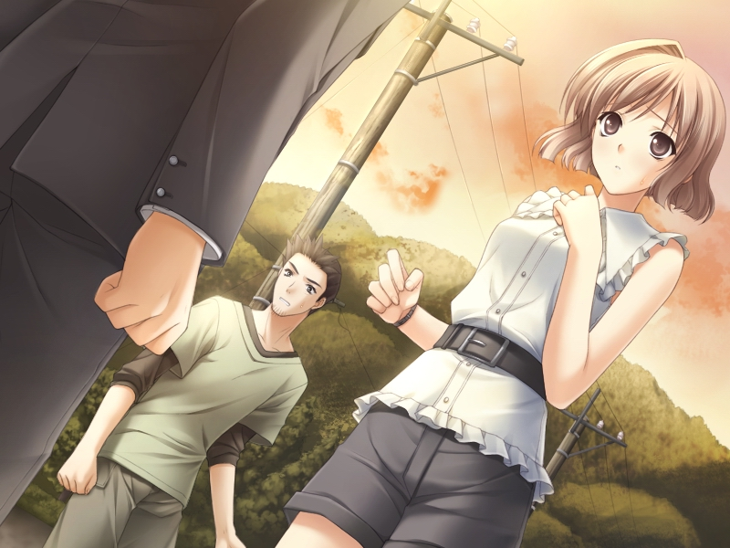
  

522楼 | 白夜Hara | 2014-02-17 10:24
    
    2014-02-17 12:52 | ◆胜负师◆:
    > 
    2014-02-17 13:24 | 无涯寂寞2:
    > 这图片是游戏CG吗？
    2014-02-17 13:54 | 白夜Hara:
    > 回复 无涯寂寞2 :女仆线里面的，你玩过就知道，其实亮平那么猥琐是有原因的
    2014-02-17 15:35 | 无涯寂寞2:
    > 回复 白夜Hara :哦？
    2014-02-17 19:19 | cxsgx2:
    > 诶，我唯一没玩的就是初佳线，没想到还有这种故事
    2014-02-17 19:28 | lakecabbage:
    > 亮平和初佳啊 感觉这个配对还可以啊 亮平从几个线的表现来看 其实人也不算坏的 有可取之处 虽然轻浮逗了些 不过端正一下姿态应该也是不错的人
* * *
纳尼？？？凌乱了，让我想想
  

523楼 | 无涯寂寞2 | 2014-02-17 11:09
* * *
顶
  

525楼 | 纳over尼 | 2014-02-17 12:30
* * *
好吧，其实他俩在一起也没什么，缘之空亮平的戏份也不多，不在乎，
  

526楼 | 无涯寂寞2 | 2014-02-17 13:23
    
    2014-02-17 13:59 | 白夜Hara:
    > 建议你玩一玩初佳线
* * *
顶
  

528楼 | 无涯寂寞2 | 2014-02-17 15:37
* * *
“在送别秋姐的列车前，我不希望秋姐离开，因为根本不需要迷茫，根本没有考虑的余地，答案从一开始就决定了，所以，我不会让秋姐离开我，可是，当我将思念化作话语的时候，秋姐早已一去不复返了，在梦中，如梦似幻的每一天，就这样结束了……”  
秋姐继续说道：“我何尝不是如此呢？在我离开的时候，也是每天思念着空啊，我也渐渐明白，没有了空的世界，对于我来说同样也是一片黑暗，就算是梦，我也希望一直做下去，抱着这个想法，我回来了，可是，梦终究会有醒来的一天，我也不知道到时候该怎么办。小悠，小穹，当我第一次看到你们的时候，我就有一种预感，你们会是帮助我们找到答案的人，就是这样，我才想接近你们，对不起……”  
“秋姐不必道歉。”穹说。  
不能在一起的人走到一起，终究会落得这幅光景吗？我感觉自己的身体越来越沉重，说了一句“我知道了”以后，走回了自己的家。  
“悠！”穹也追了过来，可是，我并没有理会她，我不知道该怎么面对，如果真的是这样，我们的未来到底是什么样？如果有了孩子，我们还要分离吗，我现在已经明显感觉到了肩上的压力，是那么重，压得我喘不过气来，不被允许的恋情只能惨淡收场吗？如果这样，我的坚持还有什么意义！我当初建立起来的信心，一下子倒塌了。  
我关上了门，将自己锁在房间里面。  
“呐，悠，悠！”  
真的是这样吗？我们真的就这样了吗？即便是走到了一起，未来也会惨淡收场，如果只是我来承受还好，可是……穹呢？  
“悠，快开门！”  
感到可怕，靠着墙壁，双脚无力。  
“悠！悠！悠！”穹拼命地呼喊着我，像是悲鸣一般刺进我的耳和心，我该怎么办才好？又该如何回应她？  
原本说好了要去守护，那个时候的确很天真，只是脑海里面那么想，真正到来的一天，听到了后果却十分害怕，明明该守护的，却是那样一个未来，未来，真的如同天空一般无限广阔吗？我开始怀疑自己曾经的誓言。  
如果，那个时候把穹交给拓也会怎么样？当年交给亲戚又会怎么样？到底该怎么办？我到底要不要和穹继续下去？
  

529楼 | 白夜Hara | 2014-02-17 16:53
* * *
顶
  

530楼 | v星v月v | 2014-02-17 17:33
* * *
两年几乎没成长a！
  

531楼 | 隳鹄醠 | 2014-02-17 18:49
* * *
写诗一样
  

532楼 | 无涯寂寞2 | 2014-02-17 18:53
* * *
悠不能坚强点吗
  

533楼 | 星海曦澄 | 2014-02-17 19:43
* * *
37楼的答案，已经呼之欲出了吧？
  

536楼 | 白夜Hara | 2014-02-17 21:14
    
    2014-02-17 21:42 | 星落苍穹Ex:
    > 地底人？为毛有种花名未闻的既视感
    2014-02-17 21:54 | 回忆早已划过:
    > 马克一下 楼主加油
    2014-02-17 22:03 | cxsgx2:
    > 噗
* * *
.
  

537楼 | 4476⚡ | 2014-02-17 21:21
* * *
秋色之空
  

538楼 | 4476⚡ | 2014-02-17 21:37
* * *
秋日之空有动漫吗？
  

539楼 | Nakami☞ | 2014-02-17 21:48
    
    2014-02-17 23:23 | 无涯寂寞2:
    > 秋色 有 三集
    2014-02-19 10:39 | Eephy-:
    > 哪个播放器
* * *
楼主加油吧 把心中所想写出来吧
  

540楼 | 回忆早已划过 | 2014-02-17 21:51
* * *
稍长的头发，地底人……这货该不会是宿海仁太吧？!!!该不会是想扯上花名吧
  

541楼 | 魂——灭 | 2014-02-17 21:51
    
    2014-02-17 22:51 | 你是我的私心:
    > 我去，地底人惊呆了！
* * *
楼主加油
  

542楼 | 回忆早已划过 | 2014-02-17 21:53
* * *
表示不知道
  

543楼 | 无涯寂寞2 | 2014-02-17 22:30
* * *
顶
  

544楼 | 空恋穹 | 2014-02-17 22:46
* * *
不会未闻花名也乱入了吧？！
  

545楼 | 星海曦澄 | 2014-02-17 23:23
* * *
花名么 这乱入看起来有点意思
  

546楼 | lakecabbage | 2014-02-17 23:31
* * *
跪求继续更文！！！点赞 加油~~~
  

547楼 | 小晓的未来 | 2014-02-17 23:32
* * *
Akisora就是秋空啊，我看完过秋日天空，快精尽人亡了
  

548楼 | 失去后才会思念 | 2014-02-17 23:37
    
    2014-02-18 09:48 | 白夜Hara:
    > 此Sora非彼Sora
* * *
顶
  

549楼 | Shin-闇栞 | 2014-02-18 00:18
* * *
醒来第一件事看看更新没更新……
  

550楼 | 回忆早已划过 | 2014-02-18 04:50
* * *
顶
  

551楼 | 纳over尼 | 2014-02-18 06:15
* * *
“有点事情，心烦。”我说。  
“是跟女朋友闹别扭了吗？”那人问道。  
“算是吧。”  
“是吗？”那人喝了一口果汁后，问我道：“是因为什么，在意的太多了吗？”  
“实在是太多了，我不知道怎么办。”我说道。  
“是因为在意别人的眼光吗？”  
“你怎么会知道？”我惊讶地问道。  
“如果是这样的话，你的女友一定很特殊吧？”那人的话句句刺进我的心里。  
“嗯。”我点点头，那个人似乎能够看透我的内心一般，仔细端详，发现他很有亲和力，就像一个小组织的领导者一样。  
“你在想些什么，能说一说吗？”  
“我……”我在想要不要说，这个人给我的第一感觉是很靠得住，我们之间的关系已经有那么多人知道，也不差这一个，于是，我说：“我的女友，就是我妹妹。”  
他起初很惊讶，随后却又恢复了微笑，说道：“是吗？那可是很苛刻的哦。”  
“我明白，我想知道，我们的未来到底是什么样。”  
“原来是这个原因，我明白了。”  
“你不会感到意外吗，我们这是不被允许的事情啊。”我说道。  
“说实话，我确实会感到意外，不过我也很佩服你的勇气。”  
这不仅令我想起了当年在操场上和亮平的对话，那个时候，他也是这么说的。  
“你们的事情有别人知道吗？”那个人问道。  
“几乎人尽皆知了。”我说道。  
“真的是勇气可嘉呢，如果说我当年能够有你一半的勇气，也许和现在就大不相同了。”  
“为什么？”  
“我问你，你相信这个世界上有幽灵吗？”  
那个人的眼光容不得我说不。  
“我不知道。”  
“那是我很小的时候呢。”他开始对我讲述他曾经的故事，从故事中得知，他的外号叫做“仁碳”。  
小时候的他，曾经和其他五名同学组成了一个超和平Buster组织，并且有着一个秘密基地，大家经常在那里玩，可是有一天……  
“呐，仁碳啊，你是不是喜欢面码？”据他说，问这个问题的女生外号是安鸣。  
“谁……谁会喜欢这个丑八怪！”  
可是，当他看到面码时，面码只是轻松地一笑。  
“这是我一生中最令我后悔的一句话，我不敢面对大家，选择了逃避，离开了基地，可是，面码随后朝我这边追来，却失足坠入了河中……”
  

553楼 | 白夜Hara | 2014-02-18 09:48
    
    2015-06-24 21:41 | 阿楠wº:
    > 是仁太，不是仁碳
* * *
顶
  

554楼 | 无涯寂寞2 | 2014-02-18 10:10
* * *
不要乱入啊。。。
  

555楼 | 你是我的私心 | 2014-02-18 14:41
* * *
顶啊顶
  

556楼 | 无涯寂寞2 | 2014-02-18 14:55
* * *
从那以后，超和平Busters就解散了，仁碳没能考上理想的高中，再加上母亲和面码的去世，便不去上学，将自己封闭起来，本来以为就会度过一生，可是，十年后的夏天，面码竟然以幽灵的形态回来了，只有仁碳能够看到，她希望仁碳能够实现她的一个愿望，为此，超和平Busters再次聚首，为了面码的愿望一起努力。  
可是，每个人都抱着私念不希望面码离开，因为这件事大家很痛苦，而且哭了起来，这个时候，却是面码愿望即将实现的时候，这时，连仁碳也看不到她了。  
大家去森林里寻找.终于,清晨的时候,大家都看到了面麻,面麻的愿望实现了。  
“她的愿望就是当初答应我的母亲：要我该哭的时候，就哭出来。”仁碳说道。  
  
我们找到了面码，看到了她留给我们每一个人的话，她说她最喜欢我了，是想要成为新娘的喜欢。  
面码消失前，曾经说：“面码还想再和大家在一起，还想和大家一起玩，所以我要转时，还要再和大家在一起！所以，仁太，哭了哦，道过别了哦，所以……”  
“预备！！！！！！！！！”仁碳喊。  
“面码！找到你了！”  
“被找到了……”面码说。  
最终，她含着泪，笑着消失在了清晨的阳光下。（参看动漫《我们仍未知道那天所看见的花的名字。》）  
听过这个故事，我已经泪流满面，分离是这样的令人心碎，我被他们的故事所感动，不过，仁碳似乎还没说完。  
“我们在慢慢地长大，一个个流转的季节，让路边开放的花朵随之变化，那个季节开放的花，我们仍未知道它的名字，轻盈地摇曳着，每次触碰都有点刺痛，把鼻子凑过去，有股淡淡的青涩的阳光的香气，渐渐地，这香气变模糊了，我们慢慢长大了，不过，那朵花一定还在什么地方盛开着，没错，我们不管到什么时候，都会继续实现那朵花的愿望。”  
我的泪水不断地落下，这个故事深深地令我感动。  
这时，仁碳为我递上了面巾纸。  
“谢谢。”  
擦拭过泪水后，仁碳继续说道：“如果那个时候，我不在乎大家的眼光，表明对面码的心意，现在或许就不会这样，珍惜现在吧，珍惜你喜欢的人，重要的是，实现那朵花的愿望。”  
那朵花的……愿望……  
“我明白了。”我说道：“可是，你为什么要和我说这么多？”  
“我第一眼看到你的时候，就有一种很特殊的感觉，但更重要的是因为你的勇气感动了我。”仁碳说道。  
勇气……  
“即便是兄妹的话，也要表明心意，实现她的愿望，不要像我一样，一时的冲动造成了无可挽回的后果，只能在十年后救赎，我相信你会做得很好。”
  

558楼 | 白夜Hara | 2014-02-18 15:29
    
    2014-02-27 03:15 | 伪鳝者º:
    > 这次错别字好多。。。仁太变仁碳，面码变面麻。。。。
    2014-02-27 16:16 | 白夜Hara:
    > 回复 土之使者 :我看的时候字幕组就是这么翻译的
    2017-02-09 15:22 | Jourly◎:
    > 未闻花名
* * *
顶
  

559楼 | v星v月v | 2014-02-18 17:22
* * *
顶
  

560楼 | 纳over尼 | 2014-02-18 17:29
* * *
“谢谢你，那你如今在做些什么？”  
“我大学毕业了以后，和安鸣一起出来闯荡，现在我们准备回家去祭奠面码，路过这里的时候，安鸣说要买些东西，要我在这里等她。”  
远处传来一个女生的声音。  
“喂，仁碳！”  
那个女生跑了过来，橙色的卷发，扎着双马尾，走到了仁碳面前。  
“走吧，一会赶不上列车了。”  
“那么，我先走了。”说着，他跟安鸣一起，走远了。  
“那是谁？”安鸣问仁碳。  
“一个过客。”  
“过客？”安鸣回头看了我一眼之后，两人踏上了旅途。  
看看表，距离我离开家已经过去了好几个小时，穹一定等着急了，刚刚走得匆忙没带手机，她会担心我的，说着我向家中走去。  
门一直开着，想必她们已经等我很久了吧？我开门后，说道：“我回来了。”过来的却是空和奈美。  
“穹呢？”我问道。  
“在医院。”奈美突然说道。  
难倒说……  
“穹没什么事，他陪你的一个同学在医院。”空说道。  
“怎么回事？”这句话我越听越糊涂。  
“事情是这样的……”  
  
由于我很长时间没有回家，所以穹很担心，再三央求之下，大家决定去找我，穹和秋姐一组，母亲和空一组，奈美等在家里，一旦我回去以后立即打电话。  
就这样，大家分头行动。  
“悠！”穹在街上喊着我，可是她因此没有注意道路，擅自走了过去，就在这时，一辆车驶来。  
“小穹！！！！！！！”秋姐惊声尖叫，想要阻止已经来不及了，死亡的阴影就这样悄然逼近，车越来越近，穹已经来不及躲闪。  
“危险！”就在这时，恰巧经过这里的拓也飞身冲了过去，一把将穹推到了一边。  
哐！！  
也正因此，拓也被那辆车撞飞，滚过很远后，痛苦地倒在地上。  
“拓也！”穹冲了上去，秋姐也跟了上来。  
“你……没事吧……穹。”拓也直到这时也在担心穹的安危。  
“对不起……对不起！”穹不住地道歉。  
“只要……你……没事就……”剧痛之下，拓也昏了过去。  
秋姐和穹一起，和肇事司机一起陪拓也去医院，闻讯后，母亲也迅速前往，让空和奈美留在家里等我回来。  
“怎么会这样？”  
“快去吧，悠哥，穹姐还在等你。”奈美说道。  
“嗯。”  
“我也一起去。”空说道。  
我下楼以后，顺手截了一辆出租车，和空一起前往医院。
  

563楼 | 白夜Hara | 2014-02-18 18:34
    
    2014-04-01 22:52 | hurriprince:
    > 又是车祸，本来就是由车祸引发的两场畸恋，合到一块还有车祸
* * *
顶
  

564楼 | 无涯寂寞2 | 2014-02-18 19:18
* * *
虐心又开始了
  

565楼 | 无涯寂寞2 | 2014-02-18 19:26
* * *
顶
  

566楼 | 纳over尼 | 2014-02-18 19:27
* * *
顶
  

567楼 | 纳over尼 | 2014-02-18 19:27
* * *
好冷清，潜水的都冒个泡，不怕憋死吗!??
  

568楼 | 无涯寂寞2 | 2014-02-18 19:27
* * *
会回楼上 冒个泡 继续潜
  

569楼 | a1149072575 | 2014-02-18 19:53
* * *
.
  

570楼 | 4476⚡ | 2014-02-18 20:05
* * *
好少啊
  

571楼 | 回忆早已划过 | 2014-02-18 20:31
* * *
求速更
  

572楼 | 无涯寂寞2 | 2014-02-18 21:32
* * *
抢救室外，穹、秋姐和母亲正在外面等候，穹看到我的时候，直接扑到了我的怀里。  
“悠……”穹啜泣起来。  
我的手放在她的后背上，自责地说道：“是我的不对……”  
“不是的，如果我能够不任性的话，拓也他也就……”  
医生走了出来。  
“哪位是他的家属？”  
“我们都是，医生，他现在怎么样了。”我问道。  
“病人暂时已经脱离了生命危险。”  
“真的吗，太好了！”我说道，穹也终于松了一口气。  
“可是，病人虽说已经脱离了生命危险，可是，他可能以后再也站不起来了，我们会尽力挽救。”医生的话又一次把我们打入了自责的深渊之中，说完之后，他又一次回到了抢救室中。  
“怎么会这样……”我不敢相信。  
拓也的话不禁回响在我的耳旁：  
“这样啊，有时间我教你吧，有我在，你不出三月，必有所成。”  
“你说的对，和我想得一样，校队的报名表我已经写好了，即便我未来不能从事篮球，也要最大程度地散发我的光和热，争取获得父亲认可。”  
如果真的是这样的话，拓也已经再也无法实现他的愿望了。  
“悠……对不起……”穹不断地道歉。  
“不是穹的责任哦，我也有一部分，这份责任，我们要一起担当。”  
“悠……总是把责任推到自己身上。”  
这时，从远处走来了几个人，最前面的一男一女看起来和母亲是同龄人，想必是拓也的父母，他的父亲看起来年纪不大，但是步履蹒跚，而且还不停地咳嗽，即便如此，他的眼睛依然炯炯有神。  
拓也的母亲一脸慌张的样子，看到我们在这里之后，上前便问道：“是你们把拓也送到这里的吗？他现在怎么样？”  
“已经脱离了生命危险。”母亲说到这里的时候，五十岚夫人松了一口气，可是后面的话却再一次令她难过：“可是……医生说，他可能再也站不起来了。”  
“如果不是为了救我，拓也他也不会……”穹说。  
“不是你的错，拓也救人是应该的，你们不必自责。”拓也的父亲说道，他的声音和低沉，而且充满了气场，就算是和一叶的父亲比起来也不落下风。  
不久后，拓也被推了出来，看起来很虚弱，他被安排在了一间单独的病房。
  

573楼 | 白夜Hara | 2014-02-18 22:42
* * *
顶一下
  

574楼 | lakecabbage | 2014-02-18 22:44
* * *
顶
  

575楼 | 无涯寂寞2 | 2014-02-18 23:08
* * *
顶
  

576楼 | Shin-闇栞 | 2014-02-19 00:11
* * *
我挫，小穹不知道会多自责。。
  

577楼 | SIMONks基斯 | 2014-02-19 00:21
* * *
顶
  

578楼 | 纳over尼 | 2014-02-19 05:35
* * *
在他醒过来之后，对大家说道：“你们出去一下，我想跟悠和穹单独说几句话。”  
只有我能听见，转达过后大家都走了出去，只留下我和穹。  
“对不起，拓也……”穹说道。  
“不必道歉，穹，是我决意要做的。”  
“可是……”拓也打断了穹的话。  
“穹，我听悠说了你们之间的故事，我也明白了你们之间是不可分开的，所以，我要对你们说一声对不起。”  
“喜欢一个人是你的自由，这一点拓也没必要道歉。”穹说道。  
“说的是啊，不过我也就只有喜欢的权力了，听了你们的故事以后我才发现，无论重来多少次，我都比不过悠。”  
“拓也一定会找到自己心仪的女孩子的。”穹说。  
“但愿吧，也许以后会找到，这一次，输给了悠，我心服口服，以后一定要好好照顾穹，别让她再像今天这样担心你了。”拓也的声音越来越小，渐渐失去了力气。  
“我不会再让她担心。”  
“那就好，你们先回去吧，我要休息了。”拓也说。  
“嗯，我先走了。”  
“再见……”穹说道。  
拓也的身体还不能动，只能象征性地张嘴示意。  
五十岚夫妇并没有追究我们的责任，令我们很过意不去，但是他们的态度很坚决，我们没有坚持，只得先行告退。  
秋姐一家人回家休息了，我和穹也回到了自己的家。  
“悠，你哭了吗？”穹问我。  
的确，穹当时也留意到了，但是并没有说，现在回到了家，她便开始问关于我的事情。  
“确实是哭过，但不是因为你。”  
“那是怎么回事？”  
“散步的时候，我遇到了一个人，他给我讲了一个故事。”  
“什么故事？”穹问道。  
于是，我便将那朵花的故事讲给了穹听。
  

579楼 | 白夜Hara | 2014-02-19 09:26
* * *
顶
  

580楼 | 无涯寂寞2 | 2014-02-19 09:56
* * *
顶
  

582楼 | Shin-闇栞 | 2014-02-19 10:27
* * *
速更 2个小时看完前面所有的了
  

583楼 | Eephy- | 2014-02-19 10:48
* * *
当穹听过以后，眼圈红了，眼眶湿湿的，我能看到她的泪滴划过面颊，滴在地上，变成一个个圆圈，偶尔能够听到啜泣声。  
“这就是那个人给我讲的故事，我听了以后完全抑制不住自己的情绪，而且我也决定好了，不会让穹成为第二个面码，我要实现你的愿望。”我说道。  
“悠，如果仁碳不在意大家的看法而说出了对面码的感情，就不会有这样的悲剧发生了，不过，如果不是这样，也就不会有这样一个故事让大家明白一切。”穹说道。  
“这也是我的想法，因为我的原因，让你受委屈了……对不起……现在一想想我就很害怕……”  
“悠，就像仁碳的妈妈所说的那样，想哭就哭出来吧，我知道悠受了太大的委屈，就让我也来为悠分担。”  
我没有抑制自己的泪水，任其奔流，穹就像母亲一样将我揽在自己的怀中，就像母亲在安抚自己的孩子一般，我又一次感受到了穹的母性所在，是那样的温暖，我就想婴儿一样哭着，泪水打湿了穹的白裙子，但是她毫不在意，只是用那纤细的双手抚摸着我的头。  
我哭出声来，将这么长时间以来积压的感情全都释放出来，穹一直在默默地接受，这一次，我们完全颠倒过来，轮到穹来安抚我的内心。  
“哭出来就好了……悠……”  
  
哭过之后，心情前所未有的轻松与舒畅，仿佛阴雨过后的天空一般，悠远而又澄澈，仿佛被雨水洗刷过一样，我的心中，也出现了从未有过的彩虹，父母去世之后逃到奥木染，再到与穹之间的事情，以及之后大学的事情，受到的委屈此刻全部释放出去，这个时候的我，心里无比轻松。  
穹的裙子已经湿了一大片，她却依旧没有在意，而是说道：“哭过之后，悠要继续加油。”  
“会的，穹也要加油。”  
“嘻，裙子穿不了了呢。”穹笑道。  
“对不起，穹。”  
“没事的，悠先等一下，我去换下衣服。”  
“嗯。”  
穹回到了自己的房间，出来的时候，她穿着那件魔公主礼服。  
“嘻，悠……”  
穹挑逗着我，我回应了她的心意。
  

584楼 | 白夜Hara | 2014-02-19 12:40
* * *
顶
  

585楼 | 纳over尼 | 2014-02-19 12:55
* * *
继续更 慢慢等
  

587楼 | Eephy- | 2014-02-19 15:33
* * *
这一次缠绵，令我想起了湖边的那一次，那时我们才真正地明确了彼此的内心，找回了另一半的自己，而这次，我已经不再迷茫，即便是未来也不会有任何事物能够令我动摇，因为我真正地知道了该怎么做。  
在赫尔辛基的时候，立下了志向，这一刻，我明确了方向！  
未来的事情，已经没有什么能够困扰我们，悠远的天空，会拓展到无限广阔的地方。  
我不希望穹会和面码有同样的命运，所以我决定实现这朵花的愿望，不会去在意别人的看法，即便被世界所遗弃，也不会有任何后悔，我今生想要守护的，只有这一个人。  
  
后来，我们又去探望一次拓也，他恢复得很好，但是，如同医生所说，再也站不起来了，对此他却显得很乐观。  
“是上天要我放弃篮球，继承父业。”他这样说道，不过，教练曾说他是未来的NBA巨星，他真的会甘心吗？我们已经无从得知，拓也说他就要去国外接受治疗了，之后可能会在那边留学，但愿一切都会好起来。  
不久，他便去了国外，我们因此失去了联系，从那以后，再也没有见过面，拓也的离去，留给我们一个沉重的人生十字架。  
而他曾经告诉我的那句话话，直到现在，我才明白它的真正含义。  
热忱之心不可以被磨灭，无论什么人可以成为朋友，不要放弃内心中的爱，即使被背叛过千百次。  
  
我们开始真正地面对外界，外界的冷眼相待我们笑颜以对，因为我们时刻都会保持着一刻热忱之心，热心对待身边的事物。  
终于，我们的付出得到了回报，一段时间过去以后，人们渐渐开始理性地看待这件事情，同学们也开始主动地接近我们，听我们讲述曾经的故事。  
我们又一次回到了人群之中，被大家所认可，很多人也曾为当时背地里说我们丑话而道歉，走在路上的时候，还会听到人们议论我们，只不过，这一次是赞美的话语。  
我们的恋情，渐渐地，成为了学校中的一段佳话。
  

588楼 | 白夜Hara | 2014-02-19 15:52
    
    2014-02-20 12:34 | ◆胜负师◆:
    > 扩也去了德国骨科治疗
    2014-04-10 09:53 | 天纵之殇:
    > 北京积水潭医院足够让他再次站起来了
    2019-04-25 12:23 | 破晓-黎明:
    > 我发现。。。缘之空里的好人真多啊。。。
* * *
顶
  

589楼 | 无涯寂寞2 | 2014-02-19 15:57
* * *
发重了一次吧？
  

590楼 | 无涯寂寞2 | 2014-02-19 15:59
    
    2014-02-19 16:05 | 白夜Hara:
    > 哪里重了？
    2014-02-19 16:14 | 无涯寂寞2:
    > 回复 白夜Hara :可能是我手机卡了，刚才逆袭那段出来两个
* * *
想起了GC.希望lz快更  
你一直都相信的事，让我也相信吧。活着，是一件很美好的事。  

  

591楼 | 寒窗叁月雪 | 2014-02-19 16:13
    
    2014-02-19 16:18 | 白夜Hara:
    > 谢谢，不管怎么说，热忱之心是很重要的，这也是我直到最近才明白了，这个小说的主线就是围绕它展开的，我会努力更新的，不过话说GC是什么？
    2014-02-19 16:27 | 寒窗叁月雪:
    > 罪恶王冠，悠说“就算世界背叛我们”那段联想到的，还想问问楼主是不是快结局了呢？　　　你一直都相信的事，让我也相信吧。活着，是一件很美好的事。
    2014-02-19 16:29 | 白夜Hara:
    > 回复 寒窗叁月雪 :快到了
    2014-02-19 16:32 | 寒窗叁月雪:
    > 一定要在开学之前完结啊..　　　你一直都相信的事，让我也相信吧。活着，是一件很美好的事。
    2014-02-19 16:35 | 白夜Hara:
    > 回复 寒窗叁月雪 :主线会的，不过还有一些事情怕是写不完了……
    2014-02-19 16:41 | 寒窗叁月雪:
    > 回复 白夜Hara :好吧，希望楼主来个圆满大结局，各种动漫虐的已经够呛了…　　　你一直都相信的事，让我也相信吧。活着，是一件很美好的事。
* * *
悠穹又重新开始二人世界了 没人打扰了
  

592楼 | Eephy- | 2014-02-19 16:38
* * *
慢慢等
  

593楼 | Eephy- | 2014-02-19 16:38
* * *
顶
  

594楼 | 纳over尼 | 2014-02-19 16:51
* * *
顶！  
楼主加油↖(^ω^)↗
  

595楼 | yuanzhecheng02 | 2014-02-19 17:08
* * *
已收藏顶赞楼主
  

596楼 | CharlesBaiYang | 2014-02-19 17:46
* * *
“叮铃铃铃！”  
我拿起电话，是一叶打来的，前段时间在电视上看到了一叶以及夏美的表现，都很不错，虽然没能晋级决赛，但是同样值得骄傲，她现在马上就要到我们家了。  
“谁的电话？”穹问道。  
“一叶打来的，他说马上就要到了。”  
“嗯。”  
之前我们已经得知一叶到来的时间，所以我们在准备饭菜，决定为一叶庆祝一下，葵家听到了以后，也来为我们帮忙。  
“空，把炒勺拿来一下。”穹说道，空将炒勺递给了她，这边空也在煲汤煮饭。  
另一边，母女三人正在布置房间。  
“秋姐，那边再挂高点……对，这样就好了。”奈美说道。  
“奈美，你看看这些字这么挂好吗？”母亲问道。  
“嗯，可以。”  
大家都充满了干劲。  
迎接一叶的任务交给了穹，穹在楼下等着她，我们则守候在门后，收到了穹的信号之后，所有人都做好了准备。  
门打开了，在一叶刚刚进来的一刹那，所有人手中的彩条拉炮一起发射。  
“砰！”  
彩条轻轻地落在一叶头上，屋内挂着横幅：“一叶，你最棒！”这是母亲花了很长时间亲手写的，一叶看到以后很感动。  
“春日野君，葵前辈，你们……”  
“祝贺你，一叶。”我说道。  
“谢谢你们。”  
“虽然没能拿到冠军，但是一叶你同样令我们骄傲。”我说道。  
“谢谢你，春日野君。”  
餐桌放在了客厅里面，上面摆满了一叶爱吃的东西，昨天我特意给瑛打了个电话询问这件事，当一叶看到了以后，说道：“春日野君太费心了。”  
“明明还有我们的说……”秋姐说道。  
“也感谢您，葵前辈。”  
“这次也多亏了秋姐一家人的帮忙，不然的话光是我和穹不知道要多长时间才能弄好，对了，我来介绍一下吧。”接着，我向一叶一一介绍了这一家人。  
“一路过来，饿了吧？”我问道。  
“嗯，时间太早，没来得及吃早饭。”一叶说道。  
“那么，就赶快坐下吧，这一顿是特别为你准备的。”  
一叶的坐姿很端庄，不愧为大家闺秀，我们在餐桌上一起用餐。
  

597楼 | 白夜Hara | 2014-02-19 18:34
* * *
顶
  

598楼 | v星v月v | 2014-02-19 20:10
* * *
顶
  

600楼 | 纳over尼 | 2014-02-19 20:20
* * *
顶
  

601楼 | 无涯寂寞2 | 2014-02-19 20:50
* * *
在那之后，我对一叶说道：“其实，今天我们还有一件事情要告诉你。”  
“什么事，春日野君？”  
“我们已经认葵家的母亲为义母，从今往后，我们和葵家就是一家人了。”我说道。  
“小悠和小穹就是我的弟弟妹妹，他们的朋友就是我们的朋友，所以也欢迎你常来我家。”秋姐说。  
“对了，还有一件事情。”我说道。  
“什么事？”  
“我和穹的关系，已经不需要隐瞒了，因为我们会一起面对。”我说道。  
“诶？也就是说，你们已经……”  
“已经有很多人知道了。”我说道。  
“你们真的已经做好准备了吗？”一叶问道。  
“我们尽管已经违背了人类的伦理，但是，既然在人群之中生活，我们就要明白，热忱之心不可以被磨灭，无论什么人可以成为朋友，不要放弃内心中的爱，即使被背叛过千百次。”我说道。  
“谢谢你们，小悠，小穹。”母亲突然说道。  
“为什么要谢我们？”  
“我现在终于理解你们了，而且也终于知道为什么弟弟和姐姐的恋情会落得如此地步。”  
说着，母亲开始讲述葵家父母曾经的一些细节。  
……  
“嘻嘻，你看，那是对姐弟诶，你知道吗，他们谈恋爱了……”旁人说道。  
“你说什么？你再给我说一遍！”葵家父亲怒吼道。  
“不要！别这样……”  
“姐姐，你难道就愿意被骂吗？”  
“我们走，快走！”  
……  
“姐姐，你到底要忍受到什么时候？那些人啊，我要去收拾他们！”  
“弟弟，听我一句话，别这样，好吗，只要我们在一起就好……”  
“不可能的，姐姐，我不能忍受，而且，我一定要保护你！”  
“只要我们在一起就好，别去理会他们了，好吗？”  
“不可能，只要我在，我就不会让他们说姐姐一句坏话！”  
……
  

602楼 | 白夜Hara | 2014-02-19 22:05
* * *
顶
  

603楼 | 无涯寂寞2 | 2014-02-19 22:21
* * *
顶 ~~
  

604楼 | lakecabbage | 2014-02-19 22:38
* * *
睡前顶一顶
  

605楼 | 无涯寂寞2 | 2014-02-19 22:59
* * *
顶啊啊啊啊啊啊啊啊
  

606楼 | Shin-闇栞 | 2014-02-20 00:15
* * *
表示连夜看完，出来顶一下
  

607楼 | 最强问题儿童 | 2014-02-20 00:42
* * *
顶
  

608楼 | 纳over尼 | 2014-02-20 06:27
* * *
早晨顶一顶
  

609楼 | 无涯寂寞2 | 2014-02-20 08:14
* * *
写的真好 顶一顶吧
  

610楼 | Eephy- | 2014-02-20 08:30
* * *
快点更吧 后来秋和空怎么面对的。。
  

611楼 | Eephy- | 2014-02-20 08:30
* * *
讲述过他们的故事后，母亲接着说道：“我现在终于明白了，他们落得这幅光景的原因，就是因为他们在和全世界做对，他们渐渐地明白，和世界作对是不会有好的结果的，然而直到这时，弟弟也不愿意真正地去面对，离家出走这件事，表面上说是为了孩子们好，可实际上，他还是在逃避，躲避全世界人的目光，到了最后，只能自己一个人孤独地死去，小悠，小穹，你们让我真正地明白了，没有什么事情是不可能的，所以，加油吧，小悠，小穹，还有秋和空，奈美也要和澄弥好好相处。”  
“是，妈妈。”所有人一起说道  
“In solitude ,where we are least alone……”一叶突然说道。  
“说的是啊，可是谁又能真正地离群索居呢，到头来还是会落得像爸爸那样的结局。”秋姐说道。  
“是的，可是我们以后再也不会了，因为我们明白了。”穹说道。  
“似乎我见证了一个很伟大的时刻呢，我也终于明白了，对不起，春日野君，穹，以前对于你们的关系总是带有偏见。”一叶说。  
“一叶也是在很努力地接纳我们，所以没有错哦。”穹说道。  
“穹……”一叶说：“回去我一定会把这件事告诉大家的，我希望能够让奥木染的各位能够真正理解大家。”  
我也真正地明白了一切，那朵花的故事以及拓也的话拯救了我和穹，令我们这片悠远的天空延伸到了无限的远方。  
以后，就要带着这种态度，重拾父业，走遍他们曾经去过的地方，我相信我们会得到大家的理解，相信父母的在天之灵也会笑得很开心。  
秋姐和空终于从梦中醒来，看到的不是绝望的阴云，而是一片晴朗的艳阳天。
  

612楼 | 白夜Hara | 2014-02-20 09:28
* * *
顶
  

613楼 | Shin-闇栞 | 2014-02-20 09:53
* * *
感人
  

614楼 | Eephy- | 2014-02-20 11:42
* * *
顶
  

615楼 | Eephy- | 2014-02-20 11:42
* * *
顶一个
  

616楼 | 斯瓦尔巴123 | 2014-02-20 11:46
* * *
顶，冒泡的顶一下，顺便帮楼主凑15字，别说我水贴，我都没加这个吧，看楼主发的挺辛苦，没经验怎么行呢。。
  

617楼 | v星v月v | 2014-02-20 12:08
    
    2014-02-20 18:27 | 白夜Hara:
    > 谢谢噢！
    2014-02-20 19:09 | v星v月v:
    > 回复 白夜Hara :额，，
* * *
顶，话说验证码好烦人啊尼玛呵呵
  

618楼 | v星v月v | 2014-02-20 12:09
* * *
顶
  

619楼 | 纳over尼 | 2014-02-20 12:56
* * *
顶
  

620楼 | 无涯寂寞2 | 2014-02-20 13:21
* * *
不错，顶一个～
  

621楼 | SIMONks基斯 | 2014-02-20 13:26
* * *
第二天……  
“穹，刚才你在给谁打电话？”我问道。  
“伊东夏美。”  
“给她打电话干什么？”我问道。  
“到家里来。”穹说。  
“诶？”我对穹的这个举动完全不理解。  
半个小时以后，伊东同学来到了我家。  
“很抱歉，打扰了，春日野君。”  
“没关系，请进吧。”穹说。  
“收拾得真好，小穹很贤惠啊。”夏美说道。  
“都是悠收拾的。”穹说道。  
“是吗，有这样一个……哥哥，小穹真的很幸运。”夏美说道。  
“欢迎，伊东同学。”出来迎接的一叶说道。  
“你好，渚同学。”夏美礼貌地回应。  
我们带她参观了我们的家，每走一处，夏美都会赞美。  
走过一圈后，我们在客厅里坐下，穹说道：“今天邀请你来，是要向你道歉。”  
“谢谢你，穹同学，不过，没有必要，不是吗？”夏美说道。  
她们两个的话弄的我一头雾水，我发出了疑问，可是，没有人应答。  
“伊东同学，你很喜欢悠吧？”穹问道。  
这个问题令我很惊讶，不过夏美却依旧微笑，保持礼貌地回答道：“没错的，春日野君，我喜欢你。”  
“伊……伊东同学？”我的嘴已经不受我大脑的控制。  
“我一直很喜欢春日野君这种类型的男生，在见到你第一面的时候，我就喜欢上了你，你说的每一句话，做的每一个动作都在吸引着我，在我看到你对穹同学无微不至的照顾的时候，我愈来愈感觉到自己已经无法自拔，也只有在你面前，我愿意露出我最真实的一面，因为我不想欺骗你。”夏美说道。  
“伊东同学，谢谢你的坦率，可是，很抱歉。”我说道。  
“我知道，当你们的照片被地下交易，后来成为全校众所周知的事情的时候，我是多么不相信那是真的啊，我最开始只是以为那是他们用电脑合成的，进而制造出的谣言，可是，你们却承认了这件事情，我真的……真的不敢相信，可是，这已经成为了事实，你们跨过了那道禁忌之门，走到了一起。”  
“伊东同学，春日野君曾经和穹经历过许多你无法想象的事情，进而走到了一起，世俗是无法阻止他们的，我知道伊东同学很难过，可是，我还是希望你能够理解她们。”  
“哈哈，是啊，我应该理解你们，可是，谁又能来理解我呢？”夏美说道。
  

622楼 | 白夜Hara | 2014-02-20 15:26
* * *
lz不要停 后来怎么了
  

623楼 | Eephy- | 2014-02-20 15:38
* * *
顶
  

624楼 | Eephy- | 2014-02-20 15:38
* * *
顶
  

625楼 | 无涯寂寞2 | 2014-02-20 16:43
* * *
不会是她搞得吧？
  

626楼 | 星海曦澄 | 2014-02-20 17:18
* * *
顶，冒泡的顶一下，顺便帮楼主凑15字，别说我水贴，我都没加这个吧，看楼主发的挺辛苦，没经验怎么行呢。。
  

628楼 | v星v月v | 2014-02-20 19:08
* * *
不会是“比翼的羽根”专辑吧？(只是猜测)
  

629楼 | 无涯寂寞2 | 2014-02-20 19:55
    
    2014-05-04 20:49 | 苁茨1嗰朲辵:
    > 也可能是 悠远的天空
* * *
顶
  

631楼 | 纳over尼 | 2014-02-20 20:41
* * *
一星期没看多了这么多。。  
LZ速度好快
  

632楼 | 落叶88纷飞 | 2014-02-20 21:44
* * *
睡前一顶
  

633楼 | 纳over尼 | 2014-02-20 22:18
* * *
晚安，顶楼主
  

634楼 | 无涯寂寞2 | 2014-02-20 22:21
* * *
楼主辛苦了
  

635楼 | a1149072575 | 2014-02-20 22:32
* * *
睡前顶一下，lz加油
  

636楼 | 最强问题儿童 | 2014-02-20 23:03
* * *
加油，这里纯纯的小新人哦！
  

637楼 | 殇之若然丶訡 | 2014-02-20 23:14
* * *
都收了算了呗
  

638楼 | Shin-闇栞 | 2014-02-21 00:11
* * *
作者真·良心更新！ 看的好爽qwq
  

639楼 | 八月圣诞 | 2014-02-21 03:32
* * *
;-)，你的愿望我来帮你实现这儿才是你的家@chtyuf600
  

640楼 | 那yi抹茶色 | 2014-02-21 03:49
    
    2014-02-21 12:54 | chtyuf600:
    > 
    2014-02-21 13:03 | 白夜Hara:
    > 回复 chtyuf600 :怎么个情况
    2014-02-21 13:12 | chtyuf600:
    > 回复 白夜Hara :没事~
* * *
早安，顶楼主
  

642楼 | 无涯寂寞2 | 2014-02-21 08:44
* * *
最近有点事，所以今天下午和晚上不能更新，明天也会很慢，请谅解，为了补偿，今天早起更了一大段
  

643楼 | 白夜Hara | 2014-02-21 09:21
* * *
没事
  

650楼 | 无涯寂寞2 | 2014-02-21 09:29
* * *
那个，我发现只有在第22页上面的时候插曲才能粘贴上，所以请允许LZ水
  

656楼 | 白夜Hara | 2014-02-21 09:36
* * *
再水一下
  

657楼 | 白夜Hara | 2014-02-21 09:37
* * *
这天晚上，我和穹一起来到了夏美的家中，她的家是一栋小别墅，里面虽然说不上是奢华，却也十分华丽，一架看起来非常昂贵的钢琴摆放在一个单独的屋子里面，据夏美说，今天晚上她的父母会回来得很晚。  
吊灯打开，整间屋子充满了白色的光，整间屋子充满了符合钢琴演奏应有的氛围，夏美身着一身非常正式的服装，就像是一名真正的女钢琴师，一叶正站在一个旁边的一个谱架旁，上面的摆放着打印好的五线谱，看得出来，她们两个都有些紧张。  
一切都在无声之中进行着。  
我们坐在一旁，夏美说道：“要开始了哦。”  
“嗯。”一叶回应道。  
演奏，正式开始。  
  
曲子开始，夏美的手指在钢琴上灵活地敲下琴键，几个紧凑的音符中间有着较长的空格时间，四组过后，连续的旋律开始了，我们似乎从中听到了我们的过去，就像是在来奥木染时的点点滴滴，悠扬的曲调将我们带到了悠远的天空，我们一起在感受着来自于天空的惬意，旋律就像天空的飞鸟，旋转着引领我们在天空飞翔。  
这时，一叶的琴声响起，将我们带到了一个更高的高度，在那里，我们仿佛置身与奥木染之上，看到了我们父母过世以后在那里的生活，虽然艰难却又充满快乐，磕磕绊绊之中有着属于我们的不可磨灭的记忆。  
夏美闭着眼睛，同样也在用心感受着我们的天空。  
一叶的琴声渐渐减弱，再一次回到了夏美的主导，意味着我们与乡下生活的逐渐磨合后开始适应，这一次，中间的旋律开始变得重复，就像我们的每一天一样，在适应了乡下生活以后，一切开始趋于平凡。  
突然，它发生了变化，音调再一次升高，仿佛我们之间的不信任，那个时候，我将所有的痛苦全都背负在自己一个人的肩上，造成了我们之间的不信任，我接受了穹的感情，却不敢正式面对它，那段高音仿佛我们因为彼此之间的矛盾和不解，在我和穹的心里不断地流淌，我和穹的矛盾开始激化，每一个音符都代表着我们之间的每一滴眼泪，落在地上，发出了很响的声音。  
可是，那段时间终究会过去，钢琴与提琴的合奏再一次开始，就如同我们的未来，我们开始正式面对我们的爱情，整个音乐开始了最高潮的部分，我们终于明白了彼此之间的感情，在那以后，天空变得更加广阔，延伸到了无穷远的地方，夏美在这个时候也开始了她人生中最辉煌的一刻，她变得愈发忘情，一叶也是一样。  
世俗无法阻断我们的羁绊，悠和穹，这对一心同体的兄妹终于开始直面这个世界，面对随之而来的所有的挑战，在明白了彼此的心意以后，我们仿佛拥有了翅膀，开始飞向天空，翱翔在那悠远的苍穹，夏美高超的技艺和优越的天赋此刻体现得淋漓尽致，闭目的她留下了最温暖的泪水，那是发自内心的骄傲。  
我们的思想，完全被卷入了这完美的旋律中，随着音符的跳动而在那悠远的天空中遨游。  
苍穹，我们来了，它永远不会有尽头，我们永远不会分开，在其中渐行渐远，走向属于我们那光明的未来。  
乐曲，在此刻戛然而止。  
“哈哈哈哈，啊哈哈哈哈哈哈哈哈！！！！！！！”在完成了这部作品以后，夏美大笑起来，似乎在发泄她体内的所有情绪，声音回荡在钢琴室中，久久没有散去。  
“简直就是天籁之音，我已经完全投入进去了。”一叶说道。  
“这是我一生中最令我骄傲的作品！”夏美说。  
“其实，夏美这一次完全用心了。”穹说道。  
“是啊，是你们让我拥有的灵感。”夏美说道。  
“穹是说，只要你能够真正地用心去体会音乐的世界，也许情况就完全不一样了。”我补充道。  
“悠……”穹高兴地看着我。  
“我以前也是一样，总是刻意地去希望别人认可我和穹，却从来没有从真正属于自己的角度去思考过，总是希望别人能够认可，可是到头来却一直适得其反，是因为到头来也没有真正地从心里面认可自己。”  
“是啊，伊东同学，我在演奏中提琴的时候，也是一样，无论别人说什么，我都会自己先投入到属于自己的音乐世界里面，只有这样才会得到来自内心的宁静，伊东同学，好好想一想刚才的演奏吧。”一叶说道。  
夏美闭上眼睛，做了一次深呼吸。  
“只有自己先认可自己，才会得到别人的认可，不是吗？”我说道。  
“是啊……”夏美说道：“音乐，真的是很神奇的东西啊，演奏过这首乐曲之后，我也终于能够从内心体会你们的羁绊了，所以，不会再为春日野君伤心，因为你注定是属于穹的，任何人都无法分开你们，就像这乐曲所表达的一样。”  
“你真的完全看开了吗？”一叶问道。  
“是的，演奏过这首曲子以后，我感觉整个人都变了，悠，穹，一叶，谢谢你们，我终于明白了，从今以后，我要为自己而活。”夏美说：“这首曲子是你们的，所以请你们为这首曲子起一个名字。”  
“悠远的天空（远い空へ）。”穹脱口而出。  
“很贴切的名字啊，就叫这个了，谢谢你，穹。”夏美说道。  
“夏美应该感谢自己才是。”  
在夏美家停留了一段时间后，拒绝了她的挽留，我们回到了家，她很热情地对待我们，之前的那种情绪已经全然消失，现在的她是一个充满了自信的女孩，这首曲子，拯救了她的灵魂，也将我和穹的羁绊体现得淋漓尽致。
  

659楼 | 白夜Hara | 2014-02-21 09:39
    
    2014-02-21 10:20 | 星落苍穹Ex:
    > 夏美的那个笑声有点违和感，给人一种有点疯狂的感觉=￣ω￣=
    2014-02-21 13:04 | 白夜Hara:
    > 回复 星落苍穹Ex :我的原意是夏美内心非常高兴，而且全都释然了，所以用这种方式把情绪全都释放出来了
    2014-02-21 16:25 | 星落苍穹Ex:
    > 回复 白夜Hara :嘛，这也只是我个人的感觉而已啦，不过老实说释放情绪用那个笑声还是有些过了
    2014-02-21 19:46 | 白夜Hara:
    > 回复 星落苍穹Ex :这个场面我参照的是一个老音乐家重新演奏之后大笑的场面
    2014-02-21 20:34 | a1149072575:
    > 回复 白夜Hara :楼主一句话没必要说4遍吧
    2014-02-21 20:38 | 白夜Hara:
    > 回复 a1149072575 :手机问题。。。。。
    2014-02-21 20:39 | 白夜Hara:
    > 回复 a1149072575 :刚才手机抽风了
    2014-02-21 20:40 | a1149072575:
    > 回复 白夜Hara :懂得
    2014-03-27 23:21 | 4ever2GD:
    > 楼主 为你鼓掌 超赞！！！
    2014-03-27 23:22 | 4ever2GD:
    > 好感动好温馨！
    2014-03-28 11:36 | 白夜Hara:
    > 回复 4ever2GD :谢谢
    2017-07-21 21:06 | 骨头骨头呀😍:
    > 一边看你写的，一边听远空，感觉意境完全和你写的一样，楼主一定是深刻理解了缘之空
* * *
顶
  

660楼 | Shin-闇栞 | 2014-02-21 10:16
* * *
例行来顶
  

661楼 | 斯瓦尔巴123 | 2014-02-21 12:03
* * *
顶，潜水的都给我顶起，十五字十五字
  

662楼 | v星v月v | 2014-02-21 12:23
* * *
好长
  

663楼 | 无涯寂寞2 | 2014-02-21 12:24
* * *
竟然是这首
  

664楼 | 无涯寂寞2 | 2014-02-21 12:27
* * *
顶一个
  

665楼 | 骚年别耍了 | 2014-02-21 12:34
* * *
soga 我都看投入了
  

667楼 | Eephy- | 2014-02-21 13:14
* * *
是这首啊。。
  

668楼 | SIMONks基斯 | 2014-02-21 13:36
* * *
对不起，我手机被我哥拿走了，所以最近没来顶
  

669楼 | 唯love灬悠穹 | 2014-02-21 19:17
    
    2014-02-21 19:44 | 白夜Hara:
    > 没事没事~
    2014-02-21 22:04 | 无涯寂寞2:
    > 接口！拉出去，毙五分钟
    2014-02-22 12:58 | 唯love灬悠穹:
    > 回复 无涯寂寞2 :遵命
* * *
呵呵呵呵呵呵呵呵呵呵呵呵呵呵呵呵呵呵呵呵呵呵
  

670楼 | xiaowy99 | 2014-02-21 19:46
* * *
赞赞赞赞赞赞赞赞赞赞赞赞赞赞赞
  

671楼 | xiaowy99 | 2014-02-21 19:47
* * *
顶
  

672楼 | 唯love灬悠穹 | 2014-02-21 19:47
* * *
lz加油
  

673楼 | 嗨咯咯诺 | 2014-02-21 20:01
* * *
加油，只不过一次太少了吧
  

674楼 | ajeyds | 2014-02-21 20:19
* * *
加油加油加油加油
  

675楼 | 枪惊云霄焰 | 2014-02-21 20:23
* * *
顶，潜水的都给我顶起，十五字十五字
  

676楼 | v星v月v | 2014-02-21 21:27
* * *
顶晚了，深表歉意
  

677楼 | 无涯寂寞2 | 2014-02-21 22:04
* * *

  

678楼 | 无涯寂寞2 | 2014-02-21 22:06
* * *
手机抽风，sorry
  

679楼 | 无涯寂寞2 | 2014-02-21 22:06
    
    2014-02-21 22:08 | 无涯寂寞2:
    > 刚才发一条蹦出来俩，还占楼层
* * *
次奥？
  

680楼 | 无涯寂寞2 | 2014-02-21 22:07
* * *
顶
  

681楼 | 纳over尼 | 2014-02-21 23:24
* * *
顶
  

683楼 | Shin-闇栞 | 2014-02-22 01:46
* * *
顶
  

684楼 | 无涯寂寞2 | 2014-02-22 08:39
* * *
顶
  

685楼 | 唯love灬悠穹 | 2014-02-22 12:58
* * *
顶啊顶
  

686楼 | 无涯寂寞2 | 2014-02-22 13:13
* * *
早上顶的和下午的竟然之隔一楼
  

687楼 | 无涯寂寞2 | 2014-02-22 13:14
* * *
一叶在我家住了一晚后，也要离开了，我们和葵家一起送一叶到了车站。  
“到了以后别忘了打个电话。”秋姐说道。  
“我会的，大家也要继续加油。”一叶说。  
“一叶也是，加油。”穹说道。  
“阿姨，葵前辈，葵君，奈美，欢迎你们来奥木染做客。”一叶说道。  
“这次放假的时候我们一家都会去的。”秋姐说道“一次很久都没有过的家族旅行。”  
“到时候，我们会一起去迎接你们的。”一叶说道。  
“我们等着哦。”秋姐说道。  
一叶上了车，列车缓缓启动，她从窗外向我们挥手告别，我们也一样。  
列车渐行渐远，很快便消失了踪影。  
我和穹牵着手，没有和他们一起回家，而是选择在附近漫步，一起在看着那旷阔的苍穹，在这空旷场景中的我们，成为了天空所构成的画面的一份子，无论何时，无论何地，我们的上方都是那广阔的天空，我想我们就像那绝对无法切断的羁绊一样，在这亘古不变，一直延续的天空下，我对穹的思念也会一直延伸下去，一定可以的。  
无论什么，都不会切断我们的纽带，经历过这么多坎坷以后，前方已经没有什么可以真正阻挡我们的障碍，我们一定会实现我们的梦想，一定可以的！  
从今往后，和穹一起形影成双。  
我们的心就像那天空一样，永不分离！
  

688楼 | 白夜Hara | 2014-02-22 16:26
    
    2014-02-22 16:34 | a1149072575:
    > 这是大结局吗？
    2014-02-22 16:34 | 嗨咯咯诺:
    > 完结了么？
    2014-02-22 16:36 | 嗨咯咯诺:
    > 回复 嗨咯咯诺 :@白夜Hara
* * *
这是 大结局？雅蔑蝶
  

689楼 | 无涯寂寞2 | 2014-02-22 16:51
* * *

  

690楼 | 无涯寂寞2 | 2014-02-22 16:52
* * *
@白夜Hara
  

691楼 | 无涯寂寞2 | 2014-02-22 16:52
* * *
楼主快给楼上露个脸 ，他都哭了
  

692楼 | a1149072575 | 2014-02-22 17:55
* * *
LZ如果你现在就消失我就跟你拼了
  

693楼 | 无涯寂寞2 | 2014-02-22 18:04
* * *

  

694楼 | 无涯寂寞2 | 2014-02-22 18:05
    
    2014-02-22 18:17 | 嗨咯咯诺:
    > 同
* * *
lz，快站出来
  

695楼 | 嗨咯咯诺 | 2014-02-22 18:17
* * *
LZ快粗线
  

696楼 | Shin-闇栞 | 2014-02-22 18:38
* * *
抱歉，刚才时间太忙，直到现在才有空回帖，声明一下，小说还没有结束
  

697楼 | 白夜Hara | 2014-02-22 18:55
* * *
列车发出了咣当咣当的，足以令人入睡响声，但是我却并没有感觉到无聊，因为这一次，回来的不只是我们两个人。  
这个学期是那样的漫长，我和穹都通过了考试，穹所有科目的成绩全都是A，相同的成绩只有秋姐达到过，我为穹感到骄傲。  
至于我，基本是以B为主，偶尔也会有几个科目为A，不过和穹比起来我的成绩便显得黯然失色。  
秋姐也正式公开了和空的关系，同样得到了大家的理解，经过我和穹的事情以后，所有人都变得更加理性，终于，秋姐和空也不用再像捉迷藏一样度过每一天。  
热忱之心不可以被磨灭，无论什么人可以成为朋友，不要放弃内心中的爱，即使被背叛过千百次。  
这句话和那朵花的故事拯救了我和穹，以及秋和空。  
不过，对于现在来说，这些都不是最重要的。  
“呐，想什么呢，悠哥，来玩扑克吗？”奈美问道。  
大家都在玩，似乎只有我一个人在倚在窗户边上看风景，于是我也加入了这支队伍，我、穹和母亲一组，葵家的姐弟妹三人一组，不过每一次都是穹和秋姐的对决，我们四个都只是陪衬。  
“悠哥，穹姐，奥木染真的像你们说的那么好吗？”奈美问道。  
“当然了，远离城市的喧嚣，到了那里之后你整个人都会有一种完全不同的感觉。”我说道。  
“你去过乡下吗？妈妈？”穹问道。  
“嗯，以前去过，但是那个时候乡下还很落后，而且交通也很差。”母亲说。  
“奥木染可是完全不一样呢，虽说还是有很多地方不方便，但是和那种农村相比还是要好上很多。”我说道。  
“有什么可以玩的东西吗？”奈美问道。  
“可以上山抓蝉玩，或者陪我们下地插秧也好。”我说。  
“插……插秧？”  
“是啊，我和穹去年的时候去插过一次，确实很累，但是看过自己的劳动成果以后也很高兴呢。”我说道。  
“我才不去。”奈美说。  
“别小看插秧哦，就连一叶这样的千金也去过。”我说道。  
“她也去过？”奈美不敢相信。  
“确实很难想象这样的大小姐会去做这种事情。”秋姐说。  
“我们可是亲眼见过，她戴着个草帽，一身旧衣服，别说，干起来真是有模有样。”我说道。  
“好像很有意思。”秋姐说。  
“秋姐你……”
  

698楼 | 白夜Hara | 2014-02-22 18:56
    
    2014-02-22 19:18 | 嗨咯咯诺:
    > 吓死了……lz下次在写那种片段时标注一下
    2014-02-22 19:20 | 白夜Hara:
    > 回复 嗨咯咯诺 :我错了……事太多结果忘了……
    2014-02-22 19:26 | 嗨咯咯诺:
    > 回复 白夜Hara :lz加油
    2014-02-23 18:25 | 393857713:
    > 回复 白夜Hara :应该快大结局了吧，估计看完大结局会不舍，加油
* * *
怎么没见穹说话 她有什么心事了
  

699楼 | Eephy- | 2014-02-22 19:58
* * *
顶
  

700楼 | Eephy- | 2014-02-22 19:59
* * *
吓死俺了
  

701楼 | 无涯寂寞2 | 2014-02-22 21:41
    
    2014-02-22 21:42 | 白夜Hara:
    > 。。。。。
* * *
都吓尿了
  

702楼 | 无涯寂寞2 | 2014-02-22 21:43
    
    2014-02-22 21:50 | 白夜Hara:
    > 我可是说过这个小说是要抹杀所有想象空间的
    2014-02-23 01:18 | 嗨咯咯诺:
    > 回复 白夜Hara :……
* * *
手机又抽了
  

703楼 | 无涯寂寞2 | 2014-02-22 21:44
* * *
顶
  

705楼 | 落叶88纷飞 | 2014-02-22 22:29
* * *
顶
  

706楼 | Shin-闇栞 | 2014-02-23 00:05
* * *
。。。。。。
  

707楼 | 🌸妮可绘里希🌸 | 2014-02-23 00:27
* * *
顶
  

710楼 | 无涯寂寞2 | 2014-02-23 13:33
* * *
赞～
  

711楼 | 加油漫天 | 2014-02-23 14:01
* * *
顶
  

713楼 | 纳over尼 | 2014-02-23 16:30
* * *
楼主加油，话说真心祝福拓也，楼主真忍心就这么让他酱油了？
  

715楼 | 卜木曹你 | 2014-02-23 19:00
    
    2014-02-23 20:58 | 白夜Hara:
    > 终于有一个喜欢拓也的了，本来写他就是为了促进悠穹的，但是写到后来我自己也开始喜欢上了这个角色，敢爱敢恨，为了心爱的人能够不惜一切，就算归属他人也会默默祝福，现如今他也很难再入场了，容我再想想
    2014-03-08 13:50 | 五河琴里💍💍:
    > 回复 白夜Hara :一开始并不是十分讨厌拓也，主要是他还不知道悠和穹的关系，只是单纯的有些不高兴得了，后来看到拓也的表现，热泪啊，兄弟什么的果然靠得住，楼主别让他太惨就好
    2014-03-08 21:13 | 白夜Hara:
    > 回复 a302858123 :的确拓也是一个很值得尊重的人，好人会一生平安的
    2014-03-08 21:18 | 五河琴里💍💍:
    > 回复 白夜Hara :是啊是啊
    2014-03-08 21:21 | 白夜Hara:
    > 回复 a302858123 :所以敬请期待吧。 顺嘴说一下，拓也这个名字其实是来自数码宝贝4的神原拓也，但是似乎有某个叫二丁目的和他名一样结果弄得很尴尬
    2014-03-08 21:23 | 五河琴里💍💍:
    > 回复 白夜Hara :纳尼。。。
    2014-03-08 21:25 | 白夜Hara:
    > 回复 a302858123 :你可以百度一下……
    2014-03-08 21:27 | 五河琴里💍💍:
    > 回复 白夜Hara :嗯嗯~好的
* * *
顶
  

716楼 | v星v月v | 2014-02-23 20:49
* * *
“哈哈，奈美这种城里长大的孩子是应该体会一下乡下的生活。”母亲说道。  
“这种事情叫空哥去吧，我是不会去的。”奈美说。  
“家里蹲。”穹说道。  
“谁……谁是家里蹲啦？去就去！有什么了不起！”奈美站了起来。  
“我会把奈美插秧的姿势照下来，拿回去给澄弥看的。”秋姐说道。  
“算了，我可不想在她面前丢人……”  
“那么，就做到最好哦，加油，奈美！”秋姐说。  
“好……好啦！”  
大家都笑了，笑得很开心，窗外阳光明媚，似乎在预示着一个好的开始。  
“下一站，即将到达穗见。”  
“准备好，要到了。”我说道。  
大家都很兴奋的样子，这一次假期，注定不同。  
  
穗见站外，一叶早已经等候在那里，她的身后，有两辆轿车。  
“大家都很有精神呢。”一叶说道。  
“等急了吧？渚同学。”我说道。  
“没有，我们也是刚到这里。”一叶说道。  
“一叶的家里，又多了一辆车吗？”我问道。  
“嗯，我离开家后不久，家里又购进了一辆，今天这两辆都没有什么事，所以就都派来了。”一叶说。  
“是吗？我还在担心这么多人会坐不下呢。”我说道。  
“这样子不就没关系了吗，走吧，大家都在等着呢。”一叶说。  
“嗯。”  
说着，我们坐上了车，我、穹、奈美和一叶坐上了前面的一辆，剩下的三个人坐在后面。  
“这辆车坐起来真舒服。”奈美说。  
“是啊，我们以前的时候也坐过几次，感觉很不错呢。”我说。  
“大家坐起来舒服就好。”  
一路上，奈美的脸一直在对着窗外，看着窗外的风景，这里的天空更加清澈，绿色的田野在道路两旁，远方山峦起伏，全然一副生机勃勃的景象，时而会看见一些人在里面忙碌着，蔚蓝的天空下，一切都充满了希望。  
“这是奈美第一次来乡下吧？”我问道。  
“是啊。”  
“是不是和想象的不一样？”  
“很不一样。”  
“奈美一定以为这里是穷乡僻壤。”穹说道。  
“谁这么想了！”奈美狡辩道。  
“难道是在想澄弥？”穹说道。  
“没……没有！”
  

717楼 | 白夜Hara | 2014-02-23 20:55
* * *
从明天开始lz就开学了，所以更新会变慢，有时间的话我会多写一些
  

718楼 | 白夜Hara | 2014-02-23 20:55
    
    2014-02-23 21:04 | 393857713:
    > 楼主加油
    2014-02-23 21:21 | 我是打酱油滴03:
    > 啊？我们这里已经开学一个星期了
    2014-02-23 22:05 | Shin-闇栞:
    > 加油
    2014-02-24 00:24 | SIMONks基斯:
    > 高三党表示寒假只有5天。。
* * *
LZ是几年级的啊？
  

719楼 | 无涯寂寞2 | 2014-02-23 21:05
    
    2014-02-23 21:21 | 白夜Hara:
    > 大三
    2014-02-23 21:28 | 无涯寂寞2:
    > 回复 白夜Hara :战士啊！
    2014-02-23 21:35 | 白夜Hara:
    > 回复 无涯寂寞2 :必须的
    2014-02-23 21:44 | 无涯寂寞2:
    > 回复 白夜Hara :哪个学校啊？开学这么晚
    2014-02-23 22:08 | 白夜Hara:
    > 回复 无涯寂寞2 :东北石油
    2014-02-23 22:22 | 无涯寂寞2:
    > 回复 白夜Hara :老乡啊
    2014-02-23 22:23 | 白夜Hara:
    > 回复 无涯寂寞2 :你也是东油的？
    2014-02-23 23:04 | 无涯寂寞2:
    > 回复 白夜Hara :啥啊，我说俺是东北人
    2014-02-23 23:04 | 无涯寂寞2:
    > 回复 白夜Hara :辽宁丹东
* * *
家里蹲
  

720楼 | 无涯寂寞2 | 2014-02-23 21:07
* * *
无法获取该图片,已自动跳过!{'type': '3', 'bsize': '200,200', 'size': '', 'is_long_pic': '0', 'show_original_btn': '0', 'cdn_src': 'http://c.tieba.baidu.com/c/p/img?src=http://static.tieba.baidu.com/tb/editor/images/qw_cat_small/qw_cat_0001.gif&width;=720&height;=720&qulity;=60&first;_gif=1&imgtype;=0', 'cdn_src_active': 'http://c.tieba.baidu.com/c/p/img?src=http://static.tieba.baidu.com/tb/editor/images/qw_cat_small/qw_cat_0001.gif&width;=720&height;=720&qulity;=60&first;_gif=1&imgtype;=0', 'big_cdn_src': 'http://c.tieba.baidu.com/c/p/img?src=http://static.tieba.baidu.com/tb/editor/images/qw_cat_small/qw_cat_0001.gif&width;=960&height;=640&qulity;=60&first;_gif=0&imgtype;=0'}
  

721楼 | 我是用户哥他哥 | 2014-02-23 21:23
* * *

路过顶一
  

722楼 | 我是用户哥他哥 | 2014-02-23 21:23
* * *
顶 楼主  
\------～  
有姐恨姐不成秋，无姐恨秋不是姐。有妹恨妹不成穹，无妹恨穹不是妹。～
  

723楼 | 葉白衣♀ | 2014-02-23 21:47
    
    2014-02-24 00:35 | 嗨咯咯诺:
    > 你的小尾巴
* * *
顶
  

724楼 | Shin-闇栞 | 2014-02-23 22:05
* * *
顶
  

725楼 | v星v月v | 2014-02-23 22:45
* * *
晚安，顶LZ
  

727楼 | 无涯寂寞2 | 2014-02-23 23:05
* * *
顶   
要顶   
必须顶   
不得不顶   
用尽全力顶  
再加上千斤顶   
总之把它顶到顶   
接着使出葵花宝顶   
就算顶到史前也要顶   
老子看了会用道德经顶  
孔子亲自拜你为师天天顶   
秦始皇站在阿房宫上使劲顶   
汉高祖挥师杀向东罗马为你顶   
吕布抛弃了貂禅而选择了帮你顶  
张三丰见了后用太极拳九式全力顶  
左冷禅召开武林盟主大会商讨如何顶   
西门吹雪从此学会了最强一招剑神一顶   
龙剑飞的如来神掌最后一式改为万佛朝顶   
陆小凤从此再也不管闲事了而专门来为你顶   
四大名捕四面出击看天下还有没有人敢不在顶  
黄飞鸿的宝芝林里从此多了一味药叫做吃了就顶  
霍元甲其实根本就没有死因为他还想要努力帮你顶  
蒋介石之所以秃了顶就是因为天天晚上在费力为你顶   
希特勒消失在人们的视线当中其实是在暗地里不断地顶   
爱因斯坦宁愿自已把相对论彻底的否定也要来为你顶一顶   
萨达姆成了亡国奴可是一直到现在都没有屈服而在拼命的顶
  

728楼 | 星_冰河 | 2014-02-24 00:27
* * *
顶啊顶
  

729楼 | 无涯寂寞2 | 2014-02-24 11:54
* * *
竟然只有我一个人
  

730楼 | 无涯寂寞2 | 2014-02-24 13:35
* * *
再一次顶，感觉到了无人岛
  

731楼 | 无涯寂寞2 | 2014-02-24 17:15
    
    2014-02-25 20:09 | 393857713:
    > 楼主么?加油
* * *
“奈美脸红了呢。”我说道。  
“才没有！”  
我和穹的组合似乎也颇具攻击力，这么下去的话似乎可以和双瑛一决高下。  
“悠君，你知道吗，现在奥木染这边也已经普及数字信号了。”一叶说道。  
“是吗？”  
“而且办理网络似乎也比以前更方便了。”这句话说出的时候，穹的眼前一辆。  
“悠，网络。”很简单的三个字完全表明了穹的想法，没办法呢，不过现在经济并不是很紧张，办理一下也不成什么问题。  
“会的，穹不用着急。”我说道。  
“悠自从两年前就一直这样说……”  
“不过，这次是认真的，明天就去。”  
“真的？”  
“说话算数。”我说道。  
“这样的话，明天我会带你们去的，现在办理网络的费用并不是很高，而且建议你们买一个路由器。”一叶说道。  
“那是什么？”我问道。  
“可以把有线网络转化为无线网络的仪器……”穹说道。  
“哈哈，是吗，看来我已经落后了。”  
“悠也买一个电脑吧。”穹说道。  
“可是那东西太贵了，经济不允许。”我说道。  
“如果是这样，我会想办法为悠买一部。”穹说道。  
凭借我对穹的理解，既然她这么说，真的有可能这么做。  
“等到工作了以后，我会着手为穹买上一部。”我说道。  
“那悠呢？”  
“我到时候就用穹之前的那一部就可以。”我说道。  
“不行，悠一定要用一部新的，我一直用自己的就好。”  
“那么，就一人一个新的好了。”  
就在这时，车已经经过了我家门前的那段下坡，从这里可以远远望见我家门口的那些人，没错的，就是大家，正在那里等着我。  
“大家已经等了很长时间了吧？他们从我出来的时候就一直等在那里了。”一叶说道。  
司机鸣笛，他们看到了以后，纷纷向这里招手。  
奥木染，我们回来了！
  

732楼 | 白夜Hara | 2014-02-24 18:30
    
    2014-02-24 19:16 | z7070308:
    > 咯哇抓
* * *
LZ.看到了吧，支持你的永远只有我一个
  

733楼 | 无涯寂寞2 | 2014-02-24 18:31
    
    2014-02-24 18:34 | 白夜Hara:
    > 感动ing…………
    2014-02-24 20:05 | 嗨咯咯诺:
    > 还有我……别无视我……
    2014-02-24 20:32 | 白夜Hara:
    > 回复 嗨咯咯诺 :每个支持lz的人lz都会牢记于心的
    2014-02-24 20:39 | 嗨咯咯诺:
    > 回复 白夜Hara :嗯～
    2014-02-24 20:56 | 无涯寂寞2:
    > 回复 嗨咯咯诺 :……………………………………………………………………………………………………………………………………………………………………………………………………………………………………………………………………………………………………………………………………………………#(滑
    2014-02-24 20:57 | 嗨咯咯诺:
    > 回复 无涯寂寞2 :-_-#
    2014-02-24 21:08 | 无涯寂寞2:
    > 回复 嗨咯咯诺 :
    2014-02-24 21:10 | 嗨咯咯诺:
    > 回复 无涯寂寞2 :T_T^_^*_*o(∩_∩)o╯＾╰╰_╯(-.-)zZ╮(╯ε╰)╭⊙⊙?(°o°)-_-#^_^)Y::>_<::(╯3╰)@>>--
    2014-02-24 21:25 | 无涯寂寞2:
    > 回复 嗨咯咯诺 :^•^
    2014-02-24 21:32 | 嗨咯咯诺:
    > 回复 无涯寂寞2 :我的癖好是挖坟……
    2015-03-06 16:27 | 予与宇💦:
    > 默默点赞的我。支持楼主
* * *
穹的眼前一辆
  

734楼 | 无涯寂寞2 | 2014-02-24 18:31
* * *
期待的大团园———坐等更新———顶ZL
  

735楼 | 无涯寂寞2 | 2014-02-24 18:34
    
    2014-02-24 18:34 | 无涯寂寞2:
    > LZ
* * *
整个世界除了我和LZ的更文全部消失了，LZ，你在哪里？——
  

736楼 | 无涯寂寞2 | 2014-02-24 18:36
    
    2014-02-24 18:40 | 白夜Hara:
    > 真的没有很多时间去更文……
    2014-02-25 20:10 | 393857713:
    > 回复 白夜Hara :楼主加油加油啊！~！！！
* * *
顶
  

737楼 | 纳over尼 | 2014-02-24 18:43
* * *
楼主别怕，我来了，刚放学
  

738楼 | v星v月v | 2014-02-24 19:15
* * *
楼主，我还想看他们回到奥木的生活，有吗？
  

739楼 | _清清蓝 | 2014-02-24 20:11
    
    2014-02-24 20:32 | 白夜Hara:
    > 这个可以有
    2014-02-25 00:33 | _清清蓝:
    > 回复 白夜Hara :哈哈。不错不错，顶一个
* * *
小说还有多少？
  

740楼 | Eephy- | 2014-02-24 21:12
    
    2014-02-24 21:24 | 白夜Hara:
    > 大概还有四分之一
    2014-02-24 22:23 | Eephy-:
    > 回复 白夜Hara : 不怕 慢慢来 别耽搁你学习了
* * *
求楼主宿舍以及基友照片
  

741楼 | 无涯寂寞2 | 2014-02-24 21:37
* * *
永久顶楼主——建议使用舒适达
  

742楼 | 无涯寂寞2 | 2014-02-24 22:18
* * *
顶
  

743楼 | 唯love灬悠穹 | 2014-02-24 22:48
* * *
顶一个支持下（话说LZ头像是DOTA2白虎妹的跳）
  

744楼 | 阿尔塞斯520 | 2014-02-25 00:35
    
    2014-02-25 20:52 | 白夜Hara:
    > 这都被你发现了
    2014-02-27 21:19 | 阿尔塞斯520:
    > 回复 白夜Hara :昨天玩OMG这技能帮我躲了4次潮汐大招
    2014-02-27 22:46 | 白夜Hara:
    > 回复 阿尔塞斯520 :这是个神技，有好几次都是用这个技能黑血逃生
* * *
顶
  

745楼 | Shin-闇栞 | 2014-02-25 07:05
* * *
再顶一次
  

746楼 | 斯瓦尔巴123 | 2014-02-25 09:08
* * *
早安顶楼主
  

747楼 | 无涯寂寞2 | 2014-02-25 12:27
* * *
擦，竟然已经中午了
  

748楼 | 无涯寂寞2 | 2014-02-25 12:27
* * *
顶  
In solitude ,where we are least alone.
  

749楼 | 血殇琳 | 2014-02-25 12:40
* * *
顶
  

750楼 | v星v月v | 2014-02-25 12:54
* * *
顶
  

751楼 | 嗨咯咯诺 | 2014-02-25 13:20
* * *
晚上好，顶楼主
  

752楼 | 无涯寂寞2 | 2014-02-25 18:54
    
    2014-02-25 20:53 | 白夜Hara:
    > 晚上好
* * *
兄弟姐妹一起上-_-#相亲相爱哦也
  

753楼 | Cherr🍒 | 2014-02-25 19:58
    
    2014-02-25 20:53 | 白夜Hara:
    > 相亲相爱一家人
* * *
哇卡偶黛丝依哇纳
  

754楼 | 无涯寂寞2 | 2014-02-25 20:05
* * *
顶
  

755楼 | v星v月v | 2014-02-25 20:06
* * *
楼主加油加油啊，如果时间允许希望楼主写他们在奥木染的生活，看完缘之空我就有要悠穹和小叶瑛他们一起生活下去的冲动，对他们生活中的一切都感兴趣啊！如果不能写下去了，也没事的哦，感谢楼主让我找到当初的感觉，永远支持楼主！
  

756楼 | 393857713 | 2014-02-25 20:13
    
    2014-02-25 20:39 | v星v月v:
    > 嗯嗯
    2014-02-25 20:56 | 白夜Hara:
    > 谢谢你的肯定，这部小说无论如何都会完结的，我要以我的角度给每个人一个好的结局，弥补缘之空和秋色之空（以及未闻花名）留下的所有的想象空间，能够让你们找回当年的感觉，是对我最大的肯定，谢谢
* * *
顶
  

758楼 | 纳over尼 | 2014-02-25 21:04
* * *
晚安，顶楼主
  

759楼 | 无涯寂寞2 | 2014-02-25 21:45
* * *
顶，话说楼主刚发完就有那么多人来顶了。。
  

761楼 | v星v月v | 2014-02-25 22:07
* * *
顶
  

762楼 | 嗨咯咯诺 | 2014-02-26 00:25
* * *
顶
  

764楼 | Shin-闇栞 | 2014-02-26 07:02
* * *
早安，顶楼主
  

765楼 | 无涯寂寞2 | 2014-02-26 07:18
* * *
加上实妹相伴的大泉君吧，同类作品
  

766楼 | saide番薯 | 2014-02-26 10:49
    
    2014-02-26 19:29 | 白夜Hara:
    > 大泉君是谁？
    2014-02-26 20:49 | saide番薯:
    > galgame，和缘之空属于同类作品，只是做妹妹的比主角小几岁
    2014-02-26 20:49 | saide番薯:
    > 也是有血缘的妹妹
    2014-02-26 20:52 | 白夜Hara:
    > 回复 saide番薯 :这样啊，不过小说已经快要结束了，没法再乱入了，更何况一开始的时候就只有三个动漫的设想
* * *
顶
  

767楼 | 393857713 | 2014-02-26 12:09
* * *
返校去也
  

768楼 | 无涯寂寞2 | 2014-02-26 12:55
* * *
顶
  

769楼 | 纳over尼 | 2014-02-26 13:17
* * *
“哼~”奈美和穹两个人一致对外的时候默契程度还真高。  
我们转过身来，开始介绍葵家人。  
“这位是葵亚希，秋姐。”  
“幸会，大家。”秋姐说道。  
“这位是葵苍空。”  
“我是葵苍空，请多多指教。”  
“这位是葵奈美，就像穹和我一样，奈美和空是双胞胎。”  
“……请多指教。”  
“欢迎小悠和小穹的家人来到这里，大家先休息吧，我们就先不打扰了。”奈绪说道。  
“今天中午一定要来神社哦！我们已经准备了很多好吃的。”瑛说道。  
“我们也去帮忙吧。”我说道。  
“不用了，我和奈绪还有班长就可以，奈绪的爸爸妈妈也会来帮忙，小悠和小穹还有大家都好好休息。”瑛说道。  
“瑛，我们走吧。”  
“嗯。”  
“喂，怎么把我忘了。”亮平说道。  
“哈哈，亮哥哥帮着拿东西就好。”  
“别小瞧我哦，我可是全能大厨！”  
“是吗，亮哥哥，那你来主厨吧。”瑛笑道。  
“中里前辈主厨的话就浪费那么多好的食材了。”一叶吐槽道。  
“亮哥哥做菜确实很好的。”瑛说道。  
“是啊，小叶，要不要尝尝？”  
“还……还是不要了吧。”一叶说道。  
“嘿嘿，我一定会做最黑暗的料理给小叶的。”  
“黑暗料理吗，我倒是很想试试啊，小叶~~”瑛说道。  
“哈哈，小叶，试一试啊~~”  
“你们两个都给我闭嘴！”  
“啪！”  
“啊喵！”  
“啪！”  
“呜哦哦哦哦哦！”  
铝制的盖子重出江湖，乍一出手便威力不凡。  
“真是的！”  
可是，当着大家的面爆发，一叶突然意识到了自己的尴尬，脸一下子变得很红。  
“一叶的吐槽还是这么厉害。”穹说道。  
“这件事就不要说了啊。”一叶很尴尬地说。  
“哈哈，小叶也来帮忙吧。”  
“嗯……”  
一叶将头探到车里，说道：“月见山先生，辛苦你了，你先回去吧。”  
“是，小姐。”  
两辆车开走了，留下我们在这里。  
大家在和我们寒暄一阵子之后，都朝向神社走去，我们带着葵家人走进了我们的家。  
“春日野君的家曾经是医院吗？”秋姐问道。  
“是的，我的爷爷曾经是一名医生。”我说道。  
“在这里一定很受人尊敬吧？”  
“嗯，我来到这里以后，当大家知道我是春日野医生的孙子时，帮助了我们很多。”我说。  
我带他们走进了房间里，由于长时间没有打扫，屋子里面也落了很多灰尘。
  

770楼 | 白夜Hara | 2014-02-26 18:15
* * *
顶
  

771楼 | 无涯寂寞2 | 2014-02-26 19:03
* * *
顶
  

772楼 | v星v月v | 2014-02-26 19:05
* * *
顶
  

773楼 | 嗨咯咯诺 | 2014-02-26 20:13
* * *

  

774楼 | 蒲公英的天蝎梦 | 2014-02-26 21:23
* * *
顶
  

775楼 | 唯love灬悠穹 | 2014-02-26 21:41
* * *
晚安，顶楼主
  

776楼 | 无涯寂寞2 | 2014-02-26 22:47
* * *
每天来顶
  

777楼 | 斯瓦尔巴123 | 2014-02-26 23:13
* * *
顶
  

778楼 | Shin-闇栞 | 2014-02-26 23:54
* * *
啊呀，一直在看，所以没时间冒泡，LZ抱歉了，话说我从11点看到凌晨4点，好困啊！晚安。。。。额。。。早安！
  

779楼 | 伪鳝者º | 2014-02-27 03:43
* * *
早安，LZ
  

780楼 | 无涯寂寞2 | 2014-02-27 09:25
* * *
楼主文采飞扬啊，人物要是刻画在生动一些就perfect 了！
  

781楼 | gslchange | 2014-02-27 09:51
    
    2014-02-27 16:13 | 白夜Hara:
    > 谢谢你的建议，确实这方面是我的软肋，以后会加强练习的
* * *
快要完结了吗？
  

782楼 | yt丶城 | 2014-02-27 10:00
    
    2014-02-27 16:11 | 白夜Hara:
    > 嗯，快了
* * *
顶
  

783楼 | v星v月v | 2014-02-27 12:23
* * *
那啥，LZ明天我就开学了，要是没完结的话就得下星期六顶你了，sorry.真心不想开学啊！
  

784楼 | 无涯寂寞2 | 2014-02-27 13:09
    
    2014-02-27 16:10 | 白夜Hara:
    > 没事没事，只要有这份心就好
    2014-02-27 16:11 | 白夜Hara:
    > 开学了好好学习吧
    2014-02-27 17:58 | 无涯寂寞2:
    > 回复 白夜Hara :谢谢LZ
* * *
顶
  

786楼 | 纳over尼 | 2014-02-27 18:01
* * *
顶
  

787楼 | v星v月v | 2014-02-27 18:12
* * *
“和我们以前的家很像呢。”空说道。  
“小空还记得以前的家吗？”母亲问道。  
“嗯，还有些印象，很传统的日式住宅。”空说。  
“是呢，以前我也经常去那里和姐姐聊天，那里的布置和这里非常像。”母亲说。  
带他们参观了一圈之后，我们在诊室坐下。  
“这里是充满了回忆的地方，除了那些过期的药品扔掉了，换了其他的药物以外，别的地方都没有动。”  
说着，我把相册拿了出来，把我们小时候的全家福照片给大家看。  
“小穹的母亲很美啊，你们长得很像。”母亲说道。  
“妈妈你也很美。”穹说道。  
“是吗，谢谢小穹。”母亲摸了摸穹的后脑勺。  
我们向母亲她们讲述着每一张相片背后的故事，他们也因此更加深入地了解到我们的过去，我告诉他们，我们的初吻发生在很小的时候，在药柜下面，不过我当时只是把它当作年少无知，没想到穹直到现在还记忆犹新。  
“悠从那个时候就很色。”穹说。  
“才不是。”我反驳道。  
“哼~”穹轻蔑地一笑。  
“好啦，悠哥就承认了吧，反正你们现在也已经在一起了。”奈美说。  
“哈哈，我承认，不过我只对穹一个人好色。”我说道。  
“悠！”穹一下子脸红了。  
大家笑了起来。  
“我有点累了，想躺一。”奈美说道。  
“那你先去我的屋子里吧，奈美。”我说道。  
“对了，话说我们晚上睡觉的话该怎么安排？”空问道。  
“我和穹就睡在穹的屋子里，我的房间里面可以睡两个人，诊室这也有两张床，可以睡下两个人。”  
“悠哥的房间那里是地铺吗？”奈美问道。  
“是的。”  
“我睡不习惯，那我就睡在诊室里。”奈美说道。  
“哈哈，这样的话，我就陪奈美睡在诊室好了，秋和空就睡在小悠的房间里面，怎么样？”母亲问道。  
“好的，妈妈。”秋姐很高兴地答应下来。  
“不过别打扰我们休息哦，这里的隔音效果不如我们的家。”母亲说。  
“诶？你在说什么啊妈妈，我们还没到那种地步啊。”空红着脸说道。  
“空害羞了。”秋姐笑道。
  

788楼 | 白夜Hara | 2014-02-27 19:09
    
    2014-02-28 17:18 | 那天下雨没打伞:
    > 加油
* * *
近期最后一次顶楼主哦！！
  

789楼 | 无涯寂寞2 | 2014-02-27 20:37
* * *
顶，在我爸还我小p之前，不能玩缘之空和看其他网文小说之前，我就看你的了
  

790楼 | 拾忆依ლ | 2014-02-27 20:40
* * *
顶
  

791楼 | 393857713 | 2014-02-27 20:56
* * *
顶
  

792楼 | 嗨咯咯诺 | 2014-02-27 23:05
* * *
顶
  

793楼 | v星v月v | 2014-02-27 23:21
* * *
顶
  

794楼 | Shin-闇栞 | 2014-02-27 23:30
* * *
顶上去
  

795楼 | 斯瓦尔巴123 | 2014-02-28 16:09
* * *
哦耶
  

796楼 | 丿名扬 | 2014-02-28 16:44
* * *
还有吗
  

798楼 | 蒲公英的天蝎梦 | 2014-02-28 20:50
    
    2014-02-28 20:53 | 白夜Hara:
    > 暂时没有了，最近事情多
    2014-02-28 21:16 | 蒲公英的天蝎梦:
    > 回复 白夜Hara :哦
* * *

  

799楼 | 蒲公英的天蝎梦 | 2014-02-28 21:16
* * *
8百
  

800楼 | 蒲公英的天蝎梦 | 2014-02-28 21:17
* * *
顶
  

801楼 | 嗨咯咯诺 | 2014-02-28 21:44
* * *
顶
  

802楼 | Shin-闇栞 | 2014-03-01 00:11
* * *
顶
  

803楼 | v星v月v | 2014-03-01 01:50
* * *
简单地收拾了一下以后，我们一起去了神社，那样的话或许会帮上忙，中途的时候路过了伊福部商店，但只是简单地提了一句，没有停留。  
“喂，还要走多远啊？”奈美有些失去了耐性。  
“啊哈哈，过了这里的话就没有多远了。”我说道。  
“奈美这么快就没劲了吗？加油哦，奈美。”秋姐说道。  
“我可没有秋姐那么好的耐性。”  
“要不，我来推你吧。”  
“诶？”  
秋姐推着奈美的后背，快速地向前走去。  
“好了，秋姐，我自己会走。”说着，奈美摆脱了秋姐的双手，继续向前走去。  
  
上了台阶以后，面前是叉依姬神社，瑛还是住在这里，她的家门前放置了几张桌子，拼在一起就显得很大，上面放着很多菜。  
“嗨！”瑛远远地对我们打招呼：“大家来得好早。”  
“在家也没什么事情，看看能不能帮助你们。”我说道。  
“谢谢大家，不过在这之前大家先去叉依姬面前祷告一下吧，告诉她你们终于回来了。”瑛说道。  
“嗯。”  
“那么，我先去忙了，还有好多菜没有做，拜拜~”  
我带着大家来到了叉依姬神像前，像瑛教我那样教大家怎么参拜，并且向叉依姬说明了我们的一些事情。  
大家跟着我一起做着参拜的动作。  
完成的时候，瑛端着盘子走了过来，将它们摆在供品桌上，说道：“叉依姬大人，很抱歉打扰了您的休息，可是，小悠和小穹回来了，还有了新的家人，您也会很高兴吧，我们做了很多好吃的，请您好好享用。”  
“大家都参拜好了吗？”瑛问道。  
“嗯，已经好了。”我说道。  
“我来帮你们吧。”空对瑛说道。  
“空君厨艺怎么样？”瑛问道。  
“相当好呢，做得很好吃。”我说道。  
“他家的家务活都是他做。”穹随后接道，秋姐、奈美和母亲同时露出了尴尬的神色。  
“哈哈，那空君就和我来厨房吧，就快要好了，大家再稍等一下。”瑛说道。  
在瑛的家门前，我们坐在椅子上，那里还有一叶和亮平，还有奈绪的母亲。  
“小悠，小穹，你们终于回来了。”奈绪的妈妈说道。  
“阿姨您好。“我说道。  
“这位就是你们的新妈妈吧？”奈绪妈妈问道。  
“嗯，我就是。”母亲说道。
  

804楼 | 白夜Hara | 2014-03-01 09:57
* * *
顶
  

805楼 | v星v月v | 2014-03-01 11:24
* * *
顶前排
  

806楼 | 蒲公英的天蝎梦 | 2014-03-01 11:25
* * *
顶
  

807楼 | 嗨咯咯诺 | 2014-03-01 13:30
* * *
顶
  

808楼 | 纳over尼 | 2014-03-01 13:56
* * *
“谢谢您能够照顾小悠和小穹。”  
“没关系，这都是我该做的，而且小悠和小穹都很懂事。”  
“不管怎么说，五个孩子要由你一个人抚养的话，还是很辛苦，我们感觉光是奈绪一个人就够累了。”  
“说实话，我也并没有怎么尽到责任，家务活都交给空，孩子们也都是秋来带。”  
“不管怎么说，你也是尽到了自己的责任，以前啊，奈绪她……”奈绪的妈妈开始说起了奈绪小时候的一些趣事。  
“哈哈，空和奈美小的时候……”母亲也开始说起姐弟妹三人小时候的事情，两个母亲聊得很投机，我们没有再打扰，我、一叶还有秋姐和奈美开始聊起天来。  
饭菜一道道地被端上来，瑛还是一如既往地活泼，我们也去帮了忙，围着桌子坐下，上面摆满了饭菜，看起来都很好吃的样子。  
这是一次充满了欢声笑语的的宴会，我们都很尽兴，为了不打扰我们的兴致，母亲还有奈绪的父母早早地吃完后就进屋聊天，我们一起又笑又闹，秋姐、空和奈美在瑛的调和之下很好地融入了这片氛围。  
吃过饭后，彼此分享各自在上学时期的趣事，瑛说出了很多囧事，弄得大家笑个不停，当然还有双瑛的合体技，不过最后还是被爆发的一叶以铝制盖子痛扁一顿。  
当然还少不了调侃班长，班长被双瑛弄得团团转，当然最后还是我帮她解围。  
渐渐地，话题转移到了秋姐、空和奈美身上。  
“秋姐对空真好啊。”瑛说道。  
“哈哈，当然了。”秋姐说道。  
“就像悠君对穹一样呢。”  
“不，我对空是不会输给小悠对小穹的，是吧，空？”  
“嗯！”  
“笨蛋情侣又在说什么呢。”奈美说道。  
“这样一来奈美就寂寞了呢。”瑛笑道。  
“诶？”  
“哈哈，我不会让奈美寂寞的。”瑛说道。  
“才没有！”奈美说道。  
即便是一向强势的奈美在瑛的面前也是占不到任何便宜。  
“嘿嘿，奈美你就不要逞强了，寂寞的话我会陪你的。”亮平也开始进攻。  
“谁要你陪！”  
“哈哈，奈美脸红了，没事的，抱抱，奈美。”  
“喂，别跟我抢啊。”亮平说道。  
一叶趁他们不注意的时候，塞给了奈美一样东西。  
“你们两个都给我闭嘴！”  
“啪！”  
铝制的盖子在太阳下闪闪发亮。  
“啊瞄！”  
“啪！”  
“呜啊啊啊啊啊！！”  
“小叶，你竟敢出卖我们！”亮平说道。  
“你们也太过分了。”一叶说道。  
“小叶想要和奈美一起是吗？”亮平笑道。  
“谁想要了，还有，别叫我小叶。”  
“小叶也害羞了吗，瑛！”  
“是！”两人没说完的时候，秋姐突然介入，站在一叶面前，说道：“欺负小叶可要先经过我这一关哦。”  
“事情变得越来越有趣了。”说着，亮平一把把空拉了过来，说道：“你们的弟弟可是在我们的手里哦。”  
“别以为这样就能挡得住我。”秋姐说道。  
“班长也加入我们吧！”瑛说着，把班长也拉了过来。  
“诶啊啊啊啊啊！！怎么还有我的事。”班长说道。  
我、穹和奈绪被秋姐和奈美不由分说地拉进了她们的阵营，一场空前激烈的对攻战就这样开始了，不过从阵容上看来，亮平和瑛那一组占尽劣势。  
果然，我们取得了对攻战的胜利。  
“啊哈哈，我们输了呢。”瑛摸着自己的头说道。  
“我会记住的，你们就在海滩那里接受我们的挑战吧！”亮平说道。  
“海滩？”秋姐和奈美不解。  
“我们每年都会去一次海滩，乘坐列车很快就会到。”一叶说道。  
“是吗，到时候我们会让你输得心服口服。”秋姐说。
  

809楼 | 白夜Hara | 2014-03-01 18:06
    
    2014-03-01 20:27 | 393857713:
    > 还有海滩呢，希望多写些事情，顶
* * *
顶一个 楼主还有么
  

810楼 | 🌸大姗姗 | 2014-03-01 18:27
* * *
一般来说小说的结尾要留有脑补空间，不过既然都希望看他们在澳木然的故事，建议楼主写他们的生活小剧场，当然如果愿意那就把拓也后来的故事也写出来吧，再次表示支持楼主
  

811楼 | 卜木曹你 | 2014-03-01 21:45
    
    2014-03-02 12:37 | 白夜Hara:
    > 谢谢 ，其实我这个小说就是为了弥补原作留下的脑部空间而写的，所以不会留下太多空间，不然它现在就已经完结了，我在写生活小剧场方面的能力不是很强，所以写起来很费力，我尽量多写一些
* * *
顶
  

812楼 | Shin-闇栞 | 2014-03-01 21:51
* * *
拓也人真的挺好的，楼主别把他悲剧了
  

813楼 | v星v月v | 2014-03-01 22:48
    
    2014-03-02 12:38 | 白夜Hara:
    > 这个……还是请期待下文吧
* * *
顶
  

814楼 | 嗨咯咯诺 | 2014-03-02 00:36
* * *
好文顶一个
  

815楼 | 斯瓦尔巴123 | 2014-03-02 09:41
* * *
顶
  

816楼 | 5422989720123 | 2014-03-02 10:04
* * *
顶
  

817楼 | 卜木曹你 | 2014-03-02 11:31
* * *
火线送上十五字经验，楼主大力更新吧！！！狂顶三十秒
  

818楼 | a1206023303 | 2014-03-02 15:02
* * *
加油吧
  

819楼 | 悠远的苍穹ZERO | 2014-03-02 16:31
* * *
o(≥ o ≤)o
  

821楼 | 蒲公英的天蝎梦 | 2014-03-02 17:23
* * *
顶
  

822楼 | 嗨咯咯诺 | 2014-03-02 17:36
* * *
好久没顶了 顶！！！！！！
  

823楼 | º零º | 2014-03-02 18:03
* * *
顶
  

824楼 | 卜木曹你 | 2014-03-02 19:01
* * *
顶
  

825楼 | 纳over尼 | 2014-03-02 19:31
* * *
顶
  

827楼 | v星v月v | 2014-03-02 21:02
* * *
顶啊 还有么
  

828楼 | 🌸大姗姗 | 2014-03-02 22:16
* * *
顶
  

829楼 | 嗨咯咯诺 | 2014-03-03 00:40
* * *
路过
  

830楼 | 作死的节奏呀吼 | 2014-03-03 00:52
* * *
顶
  

832楼 | Shin-闇栞 | 2014-03-03 07:09
* * *
顶
  

833楼 | 纳over尼 | 2014-03-03 17:50
* * *
顶
  

834楼 | v星v月v | 2014-03-03 17:58
* * *
顶
  

836楼 | 唯love灬悠穹 | 2014-03-03 19:38
* * *
顶
  

837楼 | v星v月v | 2014-03-03 20:23
* * *
o(≥ o ≤)oo(≥ o ≤)oo(≥ o ≤)o
  

838楼 | 蒲公英的天蝎梦 | 2014-03-03 20:24
* * *
顶
  

839楼 | Shin-闇栞 | 2014-03-03 20:38
* * *
再来顶
  

840楼 | 斯瓦尔巴123 | 2014-03-03 22:57
* * *
顶
  

841楼 | 嗨咯咯诺 | 2014-03-04 01:34
* * *
好想看穹吃醋~很可爱，不过两个对手戏好少
  

842楼 | 小晓的未来 | 2014-03-04 01:35
    
    2014-03-04 02:05 | 嗨咯咯诺:
    > ……
    2014-03-04 08:36 | 白夜Hara:
    > 这两个人只是为了促进悠穹而设置的炮灰角色，所以没有写太多，小穹的傲娇以前写的太多了，这里重点要写穹温柔贤惠的那一面
    2014-03-04 08:37 | 白夜Hara:
    > 我文笔有限，没能把所有的事情一一交代，请见谅
* * *
顶
  

843楼 | 纳over尼 | 2014-03-04 06:52
* * *
顶
  

844楼 | Shin-闇栞 | 2014-03-04 16:56
* * *
顶
  

846楼 | 唯love灬悠穹 | 2014-03-04 22:12
* * *
顶
  

847楼 | 嗨咯咯诺 | 2014-03-04 23:39
* * *
顶
  

848楼 | Shin-闇栞 | 2014-03-05 07:05
* * *
必须顶起！
  

849楼 | 丿miku喵鸣 | 2014-03-05 07:14
* * *
如果ntr lz你死了
  

850楼 | 插瞎你驴眼 | 2014-03-05 07:42
* * *
来顶。
  

851楼 | 斯瓦尔巴123 | 2014-03-05 08:10
* * *
顶
  

852楼 | v星v月v | 2014-03-05 12:48
* * *
顶
  

853楼 | 纳over尼 | 2014-03-05 13:02
* * *
顶
  

854楼 | 429643017 | 2014-03-05 13:28
* * *
准备粉楼主了！！！楼主我要粉你！！！好帖子要顶！！！
  

855楼 | 429643017 | 2014-03-05 13:30
    
    2014-03-05 22:54 | 白夜Hara:
    > 
* * *
顶
  

856楼 | 蒲公英的天蝎梦 | 2014-03-05 21:28
* * *
顶
  

857楼 | Shin-闇栞 | 2014-03-05 21:59
* * *
“我们也没想到会这样。”  
“秋姐对空君也很好呢，也是受到了你们的影响吧？”瑛问道。  
“瑛看出来了吗？”我问道。  
“是一叶对我们说的，空君不会介意吧？”瑛笑着问空。  
“当然不会，我和秋姐已经开始面对一切了。”空说道。  
“是吗，悠君和小穹真是伟大。”瑛说道。  
说着，已经到了家门口，大家都在院子里面等着，将东西放下以后，瑛和奈绪一起离开了，大家帮我们把东西搬进屋里。  
“拜拜，大家！”瑛很有元气地道别。  
“再见。”奈绪说道。  
我们将食材拿进了房间，却发现根本放不进冰箱，数量实在是太大了，先拿出很大一部分，我们平时只做两人份，对于六人份还是不会计算，这一点空远强于我们，略作思考，拿出了一些菜和肉，指着这些，脑海中想着够不够，略微添了一些之后，定量完成，动作非常熟练。  
正当我和空准备忙碌的时候，穹突然说：“奈美来做。”  
“诶？”奈美很吃惊。  
“不用了，交给我就行。”空说道。  
“不要，奈美来。”穹说道。  
“我知道了，空哥，你们都走开，我来。”奈美说道。  
“奈美，你真的可以吗？”空问道。  
“这还用说！”  
奈美几乎每天都会跟我和穹学艺，临放假的时候已经做得有模有样，若是说做两人份的话应该没什么问题，可是六人份的话，虽说空已经把量定好，但是对于奈美来说是不是挑战性太大了？  
“需要我帮忙吗？”秋姐问。  
“否决！”  
“太过分了，奈美，有什么是我做不了的吗？”  
“你不是一样菜都做不好吗？”  
“谁说的……杯面啥的。”秋姐说到这里，显然失去了底气，双手交叉着。  
“秋姐，交给奈美就好。”穹说道。  
“嘿嘿，秋姐你就去看电视吧。”奈美笑道。  
“怎么感觉这么诡异？”秋姐说。  
“我留下帮忙。”穹说道。  
“我也来帮忙吧。”我说。  
“不用，悠进屋吧，我一个人就好。”  
不知道她们在搞什么名堂，我和大家一起去看电视，留下她们两个一起做饭，可即便是穹在，所有人都还是不放心。
  

858楼 | 白夜Hara | 2014-03-05 22:02
* * *
顶
  

859楼 | v星v月v | 2014-03-05 22:31
* * *
顶
  

860楼 | Shin-闇栞 | 2014-03-05 23:41
* * *
好文采！！！
  

861楼 | 悠悠碧落苍穹 | 2014-03-05 23:49
* * *
顶
  

862楼 | 蒲公英的天蝎梦 | 2014-03-06 17:50
* * *
不知道她们在搞什么名堂，我和大家一起去看电视，留下她们两个一起做饭，可即便是穹在，所有人都还是不放心。  
“穹姐今天怎么回事，还有，奈美怎么也这么勤快。”空问道。  
“小穹这么做一定有她的原因，就先期待吧。”母亲说道。  
“妈妈说的是，对了，奈美前段时间是不是每天都去你家？”秋姐问道。  
诶？秋姐居然看出了这一点。  
“是的。“我回答的声音很小。  
“这样啊，那么，就期待奈美的表现吧。”秋姐笑道。  
  
“吃饭了。”穹说道。  
厨房里，奈美正解着围裙，做的菜全都整齐地摆放在桌面上，热气在上面翻滚着，色泽鲜艳，看起来很好吃的样子，看到奈美的表现令人大跌眼镜。  
“奈美做得真不错！”母亲夸赞道。  
秋姐拿起筷子，夹起一些放在嘴里仔细地嚼嚼，旋即露出惊喜的神情：“唔……奈美做得很好吃呢！”  
“我尝尝。”我也夹起了一块，放在嘴里，虽然没有穹和空做得好吃，但是也很不错，对于奈美来说，能做到这个水平相当不容易。  
“我只是打一些下手，其他的都是奈美一个人完成的。”穹说道。  
大家围着桌子坐了下来，奈美似乎有话要说的样子，但欲言又止。  
“奈美这么做，是为了向大家证明自己在家里，有属于自己的意义。”穹说道。  
“奈美……”大家很意外。  
“我知道，在家里秋姐要照看我们，空哥做家务活，而妈妈要忙于工作，只有我没有做出什么应该做的事情。”奈美说道。  
“怎么会呢，奈美，大家都很喜欢你啊。”秋姐说。  
“可是，你和妈妈曾经谈过我吧。”  
母亲很惊讶地用手遮住了嘴。  
“没错，可是，那也只是因为……”  
“不用为我辩解了，秋，没错，我的确说过，奈美，你听到了，现在还在记恨我吗？”母亲问道。  
“不可能的，我永远不可能会记恨妈妈，我是恨我自己，为什么什么都做不到，所以说，我希望能够证明自己也有存在的价值，前段时间，我去悠哥和穹姐家就是去学艺的，既然空哥能够做好家务，我也能，所以，请大家原谅过去那个任性的我。”奈美说。  
“对不起，奈美。”母亲说道。  
“不是妈妈的错。”奈美说。  
“奈美，我们以前真的小看你了，对不起……”秋姐说。  
“秋姐……”  
“奈美做这一顿饭，就是在证明自己，所以请大家以后真正地看待奈美。”奈美说道。  
“谢谢，穹姐。”奈美说道。  
此刻，奈美和当初那个强势而不成熟的她简直判若两人。  
“大家快点吃吧，别浪费了奈美的一番苦心。”秋姐说道。  
大家围着桌子坐下，品尝着奈美努力的成果，她的表现可圈可点，大家也是这么认为。  
“奈美。”空说道。  
“怎么？”  
“以后和我一起做家务吧。”空说道。  
“嗯……”  
“这样一来我就可以轻松不少了。”  
“空哥是要偷懒吧。”
  

863楼 | 白夜Hara | 2014-03-06 21:18
* * *
O(∩_∩)OO(∩_∩)O
  

864楼 | 蒲公英的天蝎梦 | 2014-03-06 21:22
* * *
顶
  

865楼 | 纳over尼 | 2014-03-06 21:44
* * *
顶
  

866楼 | 嗨咯咯诺 | 2014-03-06 22:57
* * *
顶
  

867楼 | Shin-闇栞 | 2014-03-07 07:05
* * *
我饿了
  

868楼 | Eephy- | 2014-03-07 08:04
* * *
顶
  

869楼 | 唯love灬悠穹 | 2014-03-07 12:15
* * *
顶一个
  

870楼 | 11asda167 | 2014-03-07 12:23
* * *
顶
  

871楼 | 纳over尼 | 2014-03-07 17:23
* * *
顶lz
  

872楼 | ccxxcvxc | 2014-03-07 17:30
* * *
顶
  

873楼 | 卜木曹你 | 2014-03-07 19:52
* * *
“呐，小悠，小穹，下次也教教我吧。”秋姐说道。  
我们还没来得及反应，奈美双手交叉说道：“否决。”  
“太过分了，奈美，有什么是我做不到的。”  
“空不是曾经教过你一个月吗？做出来还是那个样子，想想就有点想要吐了……”  
“秋姐要来也不是不可以。”我说道。  
“真的吗？小悠。”秋姐高兴地问。  
“不过悠哥你们可要考虑好，秋姐虽说德智体美全面发展，但是做家事的话真的是一窍不通。”奈美说道。  
“啊哈哈……奈美你也给我留点面子嘛……”秋姐笑道。  
“快点吃吧，一会要凉了。”穹说道。  
“我开动了！”大家双手合十，一起说道。  
看着我们吃饭的样子，奈美露出了难得的发自内心的笑容。  
  
天黑了，把床铺好以后，我和穹来到了穹的屋子，两年来，这还是我第一次睡在这张床上，不知为何，我失眠了，穹睡在旁边，发出均匀的吐息声，即便是在梦中，也是不断地在念着我的名字。  
“最喜欢……悠了。”  
我轻轻地为她盖好被子之后，穿上衣服，想要出去走走。  
外面蛙鸣声与虫鸣声不断，仿佛一首原生态的交响曲，门前有个人影，走过后发现是母亲。  
“小悠，还没睡吗？”母亲问道。  
“嗯，我睡不着，想出来走走。”  
“我也是，那小悠陪我吧，也好说说话。”  
“嗯。”  
我们一起走在街上，尽管有路灯，但是道路两边依旧是黑漆漆的，仿佛世界上只有这一条道路。  
“好久没有来过乡下了，这里的空气真好，而且到了夜晚能够看到星星。”母亲说。  
“嗯，城市里每天晚上都灯火通明的，虽说繁华，但是在城里面心真的是很难静下来。”母亲说：“等我退休了以后真的很想就在这种地方生活，虽然交通不太方便，但是在这里每天都是一种享受。”  
“妈妈一直都很忙，等到退休的时候欢迎您来奥木染，我和穹来孝敬您。”  
“呵呵，小悠真是懂事，其实，我在很早的时候真的有过这种想法，不过后来因为姐姐的事情，我也就留了下来，而且换了一个身份。”母亲说。  
“其实，无论什么身份，只要心情好就好。”  
“说的是，在真相大白以前，每天我都在想，我到底是谁，到底是我姐姐还是我自己，现在终于不用去想，而且也决定好要背负秋和空的事情，不过，我们一家四口谁都不愿意去真正地面对，虽然彼此心知肚明，可还是一直停留在梦中，是小悠和小穹让我们明白现实并不是那样黑暗。”  
“我们只是坦率地面对内心而已，而且我们还有过很多波折。”  
“嗯，我能理解，兄妹也好，姐弟也好，都是违背了人类伦理道德的事情，我曾经亲眼见证过姐姐和弟弟的爱情，所以也能理解你和小穹，小穹以前很任性，生活也很不规律，小悠也要突然支撑起一个家庭，和当年的我很像呢。”母亲说道。  
“妈妈的苦衷我明白，突然间家里多了三个孩子，那份辛苦根本无法想象，当初只是穹一个人就相当辛苦了，更重要的是，如果妈妈不去工作的话就没有经济保障，不像我，还会有父母的遗产和保险金。”  
“不过小悠当时还是个孩子，这一点不要忘了，你和秋一样，过早地承受生活的压力，而且没有任何人的支持，不管怎么说，小悠很了不起。”  
“妈妈，我已经决定好了，我要把我和穹的事情告诉支持我们的亲戚们。”我说道。  
“你真的决定好了吗？”  
“嗯，我不想再欺骗任何人，所以我要对他们说出来。”  
“既然如此，我支持你，小悠，而且我也想见见他们，毕竟我现在是你的新妈妈。”母亲说道。  
“可是，如果这样，他们也会对妈妈不好的。”  
“那又怎么样，退一万步说，最坏的结局无非是他们抛弃你，可人的心总是肉做的，他们在愤怒过后也会想起你们的，就算不是，我也会对你们负责。”  
“可是妈妈光是为了秋、空和奈美就已经精疲力竭，我们实在不像再给妈妈添麻烦。”我说道。
  

874楼 | 白夜Hara | 2014-03-07 21:50
* * *
漫长的一个星期，楼主，我回来啦太开心了
  

875楼 | 无涯寂寞2 | 2014-03-07 22:15
* * *
顶
  

876楼 | 嗨咯咯诺 | 2014-03-07 22:18
* * *
看来一千楼还是可以赶上的
  

877楼 | 无涯寂寞2 | 2014-03-07 22:19
* * *
顶
  

878楼 | Shin-闇栞 | 2014-03-08 00:21
* * *
哦哈已呦！LZ大人
  

879楼 | 无涯寂寞2 | 2014-03-08 09:09
    
    2014-03-08 21:12 | 白夜Hara:
    > 空把哇……
* * *
拉拉拉  
___________萧萧落叶送残秋  
___________沉留阮家诸侄秀  
___________吟诗得句翻停笔  
___________浸月落时君待漏  
___________蓝在幽林亦自芳  
___________幕兰为楫桂为舟  
___________雨向莎阶滴未休
  

880楼 | 萧沉吟浸蓝幕雨 | 2014-03-08 09:15
* * *
拉拉拉  
___________萧萧落叶送残秋  
___________沉留阮家诸侄秀  
___________吟诗得句翻停笔  
___________浸月落时君待漏  
___________蓝在幽林亦自芳  
___________幕兰为楫桂为舟  
___________雨向莎阶滴未休
  

881楼 | 萧沉吟浸蓝幕雨 | 2014-03-08 09:15
* * *
拉拉拉  
___________萧萧落叶送残秋  
___________沉留阮家诸侄秀  
___________吟诗得句翻停笔  
___________浸月落时君待漏  
___________蓝在幽林亦自芳  
___________幕兰为楫桂为舟  
___________雨向莎阶滴未休
  

882楼 | 萧沉吟浸蓝幕雨 | 2014-03-08 09:16
* * *
拉拉拉  
___________萧萧落叶送残秋  
___________沉留阮家诸侄秀  
___________吟诗得句翻停笔  
___________浸月落时君待漏  
___________蓝在幽林亦自芳  
___________幕兰为楫桂为舟  
___________雨向莎阶滴未休
  

883楼 | 萧沉吟浸蓝幕雨 | 2014-03-08 09:16
* * *
顶
  

885楼 | 蒲公英的天蝎梦 | 2014-03-08 13:15
* * *
顶
  

887楼 | 纳over尼 | 2014-03-08 22:05
* * *
晚安的顶楼主
  

888楼 | 无涯寂寞2 | 2014-03-08 23:24
* * *
顶
  

889楼 | Shin-闇栞 | 2014-03-08 23:26
* * *
顶
  

890楼 | 嗨咯咯诺 | 2014-03-09 00:14
* * *
刚从头看到这，lz好文
  

891楼 | 摇身一变厚脸皮 | 2014-03-09 01:03
    
    2014-03-09 23:30 | 白夜Hara:
    > 谢谢！
* * *
顶一个。
  

893楼 | 斯瓦尔巴123 | 2014-03-09 10:10
* * *
顶，好温馨
  

895楼 | Shin-闇栞 | 2014-03-09 11:44
* * *
写得很赞啊！能不能让俺妹也加入啊因为看过俺妹最后没在一起心里好不舒服啊
  

896楼 | huangwenhui | 2014-03-09 11:59
    
    2014-03-09 12:00 | 白夜Hara:
    > 俺妹没看过，而且现在小说已经快完结了，加不进来……
    2014-03-09 12:31 | huangwenhui:
    > 回复 白夜Hara ：最后两个人约定毕业前当情侣，毕业后就结束关系，最后还举办两人婚礼，但最后还是约定恢复普通兄妹关系很揪心
    2014-03-09 12:39 | 白夜Hara:
    > 回复 huangwenhui :有时间你可以尝试自己去写一部
    2014-05-05 16:40 | 苁茨1嗰朲辵:
    > 回复 huangwenhui :想看他们在一起的话就玩 俺妹2游戏吧
* * *
人工置顶人工置顶人工置顶人工置顶
  

897楼 | s暗灭s | 2014-03-09 12:33
* * *
人工置顶人工置顶人工置顶人工置顶
  

898楼 | s暗灭s | 2014-03-09 12:33
* * *
顶
  

900楼 | 纳over尼 | 2014-03-09 12:46
* * *
我用短信将事情告诉了一叶，一叶表态说她母亲在家，瑛显得很从容，倒是我显得很紧张。  
到她家后，一叶迎我们进屋，并将她母亲喊下来。  
“哦？瑛和小悠来了啊。”一叶母亲对瑛说不上热情，却也不算是冷淡，对于瑛，她还是心存芥蒂  
“您好，小叶的妈妈。”  
“有什么事情吗？小瑛？”一叶的妈妈的态度更像是对待一叶的同学，而非她的姐姐。  
“这个项链，您见过吗？”瑛将项链拿了出来。  
“咦？”  
仔细看会发现，瑛长得很像渚同学的妈妈，体形也很像，所以说面容上也有一点她的影子。  
瑛的笑容很自然，既温柔，又有些可爱，虽说一叶的母亲对她还是有点想法，但是她依旧以笑容面对。  
这个项链，难道是奶奶的日记里提到的那个从母亲那里继承的项链吗？  
“确实觉得在哪里看过……不过这个应该是一叶搞不见的东西吧？”  
“这个好像是我自从出生以后一直带在身上的东西。”  
“咦？”  
“我还给你，可能小叶在哪里掉了，然后被我捡到的吧？”  
“你之前一直都把它带在身上吗？”  
“……没有马上还给您，还丢了这么长时间，真是抱歉……”瑛深深地低下了头。  
“是我的责任，是我在和她捉蝉的时候弄丢的。”  
“现在已经不重要了。”瑛说道。  
一叶的妈妈收下了这个项链，仔细地端详着，突然，抬起了头。  
“我想起来了……”一叶之母说道。  
“诶？”瑛惊讶道。  
“那个时候，小瑛你还是一个健康可爱的婴儿，但是你的母亲却没怎么照顾你。”一叶之母说道：“某一天我在看着你时，由于太可爱所以情不自禁……  
‘乖乖~’  
这个时候，你一用力，把这个项链拉了下来。  
‘怎么了？’那个时候小悠的奶奶听到了声音，问我怎么回事，我说：‘这个孩子太活泼了，把我的项链扯了下来。’  
转院之后，听说你的母亲已经不在了，我就把挂坠送给了你。”  
“……”我们无话可说。  
“明明和那个女人一点都不像，我却……”一叶之母说到一半没有继续说下去。  
“我知道了真相，却在一直回避小瑛，虽然我也知道你是无辜的，小叶后来感动了我，而且渚也承认了错误，可是我还是对小瑛心存芥蒂，说实话，我还不知道如何是好，对不起，小瑛。”  
“谢谢你，小叶的妈妈，现在它已经物归原主，那么，我就失礼了。”瑛转身要离开。  
“……等等。”  
一叶的母亲朝瑛的正面走了过来。  
“这个项链，你继续戴着它吧。”说着，她温柔地给瑛戴上了项链。  
“可，这个是……”  
“以前真的是对不起了，小瑛，以后一叶也要拜托你，因为你们两个是同一天出生的姐妹。”一叶之母说道。  
“妈……妈妈……”  
一叶的母亲就像抱自己的孩子一样，温柔地张开双手，把瑛抱了起来。  
“是！”
  

902楼 | 白夜Hara | 2014-03-09 16:56
* * *
水
  

903楼 | 大象狂踩 | 2014-03-09 17:04
* * *
顶
  

904楼 | Shin-闇栞 | 2014-03-09 17:12
* * *
顶
  

905楼 | ccxxcvxc | 2014-03-09 18:26
* * *
这不是看过了么
  

906楼 | 🌸大姗姗 | 2014-03-09 21:58
    
    2014-03-09 23:30 | 白夜Hara:
    > 照着瑛的动漫和游戏的剧情写的
* * *
  

908楼 | 摇身一变厚脸皮 | 2014-03-09 23:41
* * *
顶
  

909楼 | Shin-闇栞 | 2014-03-10 07:08
* * *
小说要完结的节奏啊
  

910楼 | yt丶城 | 2014-03-10 11:46
    
    2014-03-10 20:30 | 白夜Hara:
    > 快了
* * *
.
  

911楼 | 丿miku喵鸣 | 2014-03-10 13:04
* * *
顶
  

912楼 | 纳over尼 | 2014-03-10 17:00
* * *
不可以不顶！我顶！——提莫！蘑菇！神奇的小尾巴！
  

913楼 | 天天爱逆袭 | 2014-03-10 17:52
* * *
这部小说已经快要完结了，LZ希望完结之后能够置顶，让更多的人看到可以吗？@yeshuya_cn @雾谷希 @牛X校友
  

915楼 | 白夜Hara | 2014-03-10 20:30
    
    2014-03-10 21:24 | 白夜Hara:
    > @呼延觉罗尚 @弦之奏
    2014-03-10 22:20 | yeshuya_cn:
    > 回复 @白夜Hara :…为啥置顶要找我
    2014-03-10 22:21 | 白夜Hara:
    > 回复 yeshuya_cn :新人不太懂贴吧，抱歉……
    2014-05-06 00:49 | 云谨-:
    > 顶
* * *
单机的节奏？
  

916楼 | 白夜Hara | 2014-03-10 20:32
* * *
顶
  

917楼 | 蒲公英的天蝎梦 | 2014-03-10 21:45
* * *
顶一个
  

918楼 | 斯瓦尔巴123 | 2014-03-10 22:37
* * *
继续顶
  

919楼 | 🌸大姗姗 | 2014-03-10 23:32
* * *
顶
  

920楼 | Shin-闇栞 | 2014-03-10 23:54
* * *
如果lz把这本小说推到淘宝网上去 绝对有人气又赚钱
  

921楼 | Eephy- | 2014-03-11 08:22
    
    2014-03-11 16:22 | 白夜Hara:
    > 我最希望的是寄给sphere，把这个做成缘之空的第三部
    2014-03-11 17:06 | Eephy-:
    > 回复 白夜Hara :但是呢？ 结果呢？ 一点味道都没
    2014-03-11 17:12 | 白夜Hara:
    > 回复 q244418792 :只是想想而已
    2014-03-11 17:14 | Eephy-:
    > 回复 白夜Hara :唉 坑爹的杂交小说
    2014-03-11 17:16 | 白夜Hara:
    > 回复 q244418792 :贴吧里有人喜欢就行
    2014-03-11 17:21 | Eephy-:
    > 回复 白夜Hara : 我比较喜欢 death～
    2017-01-16 16:56 | 穹妹我媳妇er:
    > 回复 白夜Hara :加油 我觉得应该会通过
* * *
求lz把小说推上淘宝
  

922楼 | Eephy- | 2014-03-11 08:22
* * *
顶lz，lol白银3被坑到五了。。
  

923楼 | yt丶城 | 2014-03-11 10:00
* * *
顶个
  

924楼 | ccxxcvxc | 2014-03-11 11:29
* * *
已收藏
  

925楼 | 珂💌朵💌莉 | 2014-03-11 13:26
* * *
每日一顶
  

926楼 | 纳over尼 | 2014-03-11 18:36
* * *
顶~'
  

928楼 | 蒲公英的天蝎梦 | 2014-03-11 19:55
* * *
顶
  

929楼 | 纳over尼 | 2014-03-12 04:56
* * *
顶
  

930楼 | Shin-闇栞 | 2014-03-12 07:10
* * *
顶一下
  

931楼 | 斯瓦尔巴123 | 2014-03-12 17:13
* * *
顶
  

933楼 | 嗨咯咯诺 | 2014-03-12 21:15
* * *
围观
  

934楼 | yanqice1116 | 2014-03-12 21:17
* * *
顶
  

935楼 | Shin-闇栞 | 2014-03-12 22:55
* * *
顶
  

936楼 | 纳over尼 | 2014-03-13 11:57
* * *
连镇内居委会也全体出动来帮忙，小镇中洋溢着祭祀的气氛。  
在这前一天，我和穹向他们讲述了叉依姬的故事。  
说起来，今天早上还发生了一件趣事。  
  
“嘿嘿，很合身哦，空哥。”  
“真是的，快把衣服还给我啦！”空说道。  
由于今天早上奈美一时兴起，强行给空穿上了自己的巫女服，空显得很尴尬。  
“不行！”奈美说着，拿起了照相机，对着空连续拍照，闪光灯晃得空睁不开眼睛。  
“干嘛要拍照啊，再说，我的衣服哪去了啊？”  
“已经没收了哦。”奈美说“因为空哥穿起来蛮好看的嘛。”  
“可是那样……”  
“好啦，站着别乱动。”  
“再说为什么要我穿巫女的衣服！”  
“因为空哥要去做巫女的说。”  
“我可没说过，不是奈美你要去吗？”  
“明明是空哥的说，再说空哥去也没事啦，没人能看出来你是男生的。”  
“怎么能这么说？”  
“空哥你就去吧，对了，嘿嘿，到时候你就说你叫空美。”  
“才不会！”  
空和奈美的声音吵醒了我们所有人，大家几乎是在同一时间全都走了出来。  
“大清早的就不能安静点？奈美，这么早就准备走了吗？”  
“那……妈妈，奈美在那边。”  
“无所谓啦，反正是双胞胎。”  
“好热闹啊……”秋姐睡眼朦胧地走了出来，但是看到空的时候，立即来了精神。  
“哇，好可爱唷，不是吗？空。”秋姐从后面抱住了空，下巴垫在空的头顶说道“看起来就像真的巫女一样。”  
“诶？”  
“什么时候真的变成女孩子就好了，对吧，妈妈？”  
“啥？秋姐你……”  
“好吧，不过这样的话秋你不寂寞吗？”母亲问道。  
“啊哈哈，是呢……”  
“空，去做饭吧。”  
“在这之前，这衣服……”  
“有什么不好，就这样嘛……”  
“可是，这是借来的，弄脏的话很不好的说。”  
在空的坚持之下，他终于换上了男生的衣服，早餐过后秋姐和奈美一起去了神社那边。  
  
在去神社的参拜路上，各种小摊林立在一起，各自开始准备等候着了，小吃的摊位上传来了阵阵香味，游戏的摊位上人们正在准备游戏的装置。  
“好多摊位啊。”空说道。  
“这里可以说应有尽有，等到晚上的时候很繁华呢，到时候我们可以玩得很痛快。”  
  
“哦，来了啊。”亮平说道。  
“早啊，悠君，小穹。”初佳一只手挽着亮平的胳膊说道。  
“早，你们两个也早。”  
“哇！小穹！”  
“咿！”  
“呜哇！！！疼疼疼！！！”亮平的耳朵直接被初佳抓住。  
“哼~当着我的面还敢这样逗别的女生~小穹，没事吧？”  
现在该问亮平的耳朵有没有事吧？  
亮平揉着自己发红的耳朵。  
“早，小悠，小穹，小空，还有阿姨。”奈绪说道。  
“早，奈绪。”  
“小穹好可爱，今天穿得很漂亮呢。”  
“这样的装束不知道能不能帮忙呢？”我看了看穿着浴衣的穹。  
“哼……”  
“啊啦啊啦，难得穿这么可爱的衣服，小悠不要给小穹泼冷水嘛。”  
“是啊，悠君，小穹很漂亮的说，是吧，小穹？”初佳说道。  
“嗯……”  
“如果亮平敢调戏你就尽管跟我说，我会为小穹做主的。”初佳说道。  
调戏这个词有些不太贴切吧？  
“喂，这么说有些太过分了吧？”  
“谁叫你死性不改了，当初你是怎么承诺的？”  
“好好，老婆大人，我错了。”  
“这还差不多~”  
“好了好了，来这里不是玩的，差不多要工作了，我和渚去会见来客。”  
“啊，大家，欢迎。”瑛对我们打招呼。  
“早安。”一叶说道。  
“多亏了秋姐和奈美，我才没有像以前那样忙得一点时间都没有，等工作结束后，大家去逛小摊吧。”瑛说道。
  

937楼 | 白夜Hara | 2014-03-13 18:14
* * *
顶一下
  

938楼 | y1个霸气筱男人 | 2014-03-13 18:15
* * *
顶
  

939楼 | 蒲公英的天蝎梦 | 2014-03-13 20:11
* * *
顶
  

940楼 | 嗨咯咯诺 | 2014-03-13 20:34
* * *
顶
  

941楼 | 蒲公英的天蝎梦 | 2014-03-14 17:31
* * *
以前看缘之空和秋色之空一直感觉心里空落落的，对于它们的戛然而止一直心情很不好，感谢楼主能够让我再次找到当时玩缘之空的感觉,能够找到这样的作品真的很高兴，我会一直支持lz的
  

942楼 | 八王是来过反 | 2014-03-14 21:04
* * *
对于潜水的人我想说，你们一直为断更的人留言催更，却把笔耕不辍的人更新当做理所当然，请大家多给lz一些鼓励，没有人是专门写这个的，LZ能够努力到现在真的已经很不容易了，要知道，缘之空吧到现在没有一部完结的小说，鼓励只是动手多打几个字而已，请大家让lz感受到我们的存在
  

943楼 | 八王是来过反 | 2014-03-14 21:12
    
    2014-03-14 22:05 | 白夜Hara:
    > 真的很感动，能够有这样的能够理解LZ的人，有你们在我就没有白写这部小说
* * *
我们已经有过夏日祭的经验，所以基本的步骤不用瑛去嘱咐，我们知道应该做什么。  
“拜托大家了。”瑛说道。  
“来，小穹，这边，啊，要不要多余的巫女服？”  
“……也不是不可以……”穹说道。  
“啊哈，他好了，跟我来吧，小穹。”瑛说道。  
“好了，我们也该去忙了，小悠，小空跟我来吧。”  
“我呢？”母亲问道。  
“阿姨，跟我来吧。”瑛说道。  
“嗯。”  
“不好意思，拜托了。”一叶说道。  
我们把社务所角落里的神签和护符等要卖的东西用箱子装好，向神社里搬运再从那里把箱子搬回社务所。  
从小镇那里来的巫女接过我们的箱子，并打开，里面的护符漂亮地排在一起，接着我们搬着其他各类东西的时候，会客厅那边的人也陆续汇聚起来，在这里的某些人已经认识了我，主动和我说话，问及我大学的事情，到最后他们纷纷夸赞我和穹。  
这时，一叶的父亲来了，依旧是那高高瘦瘦的身影，非常有气场，一叶的母亲也在他身旁。  
“你们好。”我行了一礼。  
“啊，你好，小悠。”渚先生对我笑了一下，用那浑厚的男低音回答道。  
“您能够在百忙中过来，真是万分感谢，爸爸，妈妈。”瑛说道。  
一叶的父母终于真正地承认了瑛，一叶的母亲也将瑛作为自己的女儿对待，在那次归还项链的事情以后一夜的母亲还曾邀请她来到渚家居住，但是被瑛婉拒了。  
一叶的父母在瑛的带领下，向会客室走去，于是乎，会客室的人一起站起来向他们打招呼。  
  
过了一会之后，我看到瑛和秋姐、奈美和穹一起走。  
“悠！”穹第一个看见了我。  
“啊哈，悠君。”  
“是要祓禊去吗？”我问道。  
“嗯，秋姐和奈美也很感兴趣，所以我带她们一起去。”瑛说道。  
“穹就交给你了。”我说道。  
于是，瑛带着她们向后山走去。  
那个湖被称为初源之地，据说人是从那里出生的，而且死之前回到那里就能转世，把后悔的人生从新来过，这不禁让我想起穹曾经的选择，我们那个时候存在误解，如果去那里，或许就能从新来过，穹抱着那个想法向那个湖走去。  
现在看来，不过是在逃避一切，如果我们当初都能敞开心扉，也就不会有那令我至今惊魂未定的事情发生了，没有什么所谓的后悔的人生，只要愿意付出代价去改变，无论什么时候都不晚，而且我坚信，无论选择了什么样的道路，现有的人生都是最好的，即便能够转世也不过是将痛苦无限循环，这是我直到和穹真正面对一切的时候才明白的。  
“哈，小悠，你在这里啊！”亮平喊道。  
“啊，你没陪初佳小姐吗？”我问道。  
“她还有些事情先走了，就留我在这里，小穹没在你身边吗。”亮平说道。  
“没有，陪瑛去后山祓禊去了。”  
“唔哦，祓禊？小悠，陪我去后山吗？”  
“……还是算了吧，初佳小姐听到了不得打死你啊？”  
“哈哈，不可能，她怎么可能忍心，不过说回来。”亮平说道“我能够有今天，也多亏了你们。”  
“为什么？”  
“自从你和穹当众做情侣宣言的时候，我就一直希望能够像你一样勇敢，后来初佳的前男友回来了，要带走她，我知道，那个人根本就是个负心汉，所以我要保护她，也就是在那个时候，我渐渐地喜欢上了她，本来只想暗中保护，可是一想到你和小穹我就明白了，不要重蹈之前的覆辙，所以，我向初佳表白了，并且得到了她的认可。”亮平说道。  
“你和穹鼓舞了我们所有人，没有你，小叶不可能那么勇敢，瑛也就不可能冲破那个诅咒，班长不可能会变得敢于面对内心，奈绪不可能家庭和睦，而我，不可能真正地成为瑛的笨蛋大哥，也不可能和初佳走到这一步，当听到一叶说你们已经得到了所有人认可的时候，我们都很高兴，她还说，你们有了新的家人，我能看出来，你们有一个好妈妈，还有那么好的兄弟姐妹，大家都很高兴啊，而且都重新认识了你们，理解了你们。”  
“我和穹只是按照内心去走而已。”  
“喂，别把自己说得那么高尚好吗？”  
“哈哈……”
  

944楼 | 白夜Hara | 2014-03-14 22:04
    
    2014-03-15 09:55 | 凹凸曼打小情受:
    > 楼主加油
* * *
顶
  

945楼 | 蒲公英的天蝎梦 | 2014-03-14 23:21
    
    2014-03-14 23:36 | 白夜Hara:
    > 谢谢一直以来的支持
* * *
顶啊
  

946楼 | 🌸大姗姗 | 2014-03-14 23:42
* * *
连续看了两个小时终于把前面的补起了。顶下
  

947楼 | 逸雨飞雪 | 2014-03-15 00:02
    
    2014-03-15 11:44 | 白夜Hara:
    > 谢谢
* * *
定
  

948楼 | 嗨咯咯诺 | 2014-03-15 00:16
* * *
顶
  

949楼 | 嗨咯咯诺 | 2014-03-15 00:16
* * *
顶
  

950楼 | Shin-闇栞 | 2014-03-15 07:08
* * *
“笑什么。”  
“啊……春日野君，你在这里啊。”班长突然走了过来。  
“喂，怎么把我忽略了。”  
亮平站了起来，似乎有意展示自己的甚平。  
“中里同学也辛苦了！”班长没好气地说道。  
“为什么对我这么冷淡？”  
“那个，春日野君，跟我一起去领便当吧。”  
对啊，居然忘了还有便当，它的口味是任何一家饭店都不能比的。  
“那么一起走吧，班长。”  
“还有我！”亮平说道。  
“……”班长显得很无奈，  
我们三个一起去领便当，这一次的队伍真的好长，至少要排半个小时才能领到，就这样，我们一边聊天一边等着，期间还遇到了空，我们便一起排队，到了我以后，我帮穹、秋姐、奈美和瑛一人领了一份。  
在她们下山回来以后，我将便当给了他们，对于厨师的手艺，秋姐和奈美赞不绝口，这期间，大家一起聊天，非常热闹，彼此有说有笑，话说这还是她们跟班长和亮平第一次这样聊天。  
后来我听瑛说，吃饭的那段时间母亲正在和一叶的父母聊天。  
  
祭典开始了，今年的人比往年更多，如果在未来，这似乎是一个商机，可以促进奥木染的旅游业，不过，如果这样的话，似乎会打破这里的平静，这个小镇还是保持原来的风貌比较好，至少我是这么想的，也许，穹也是一样。  
来回跑动的小孩子的声音，小摊边上人们的欢呼声以及各种热闹的吆喝声交织在一起，参拜的道路和神社的内部也挤着各种各样的人，这是奥木染最重要的祭典。  
我们又一次在仪式中看到了瑛所跳的神乐舞，我还记得在过去那奇妙的气氛下，天女目将平日里的忧伤全部写在了脸上，那是她唯一的机会展现自己的哀伤，可是那个时候我们都不理解，现如今，她已经走出了内心的桎梏，尽管现在看来表情依旧不是很好，但那已经是瑛的演技而非发自内心，也可能是她在回忆。  
这一次，她的舞步没有错误，不过在结束后露出了那可爱的而又毫无顾忌的笑容。  
掌声如同雷鸣一般响起，献给台上的瑛。  
瑛笑着鞠了一躬后，迈着轻快的脚步下场，从去年开始，祭典的节目开始变得多了，之后还有几个关于叉依姬的节目，其中不乏喜剧，搞得我们捧腹大笑。  
可玩的项目变得多了，不知不觉，天色暗了下来。  
母亲带着姐弟妹三人去了另一边玩，秋姐和奈美非常感兴趣，走走停停的，对每一个游戏都充满了兴趣。  
虽说是在夜晚，但是这里的繁华程度依然不减，秋姐和空在那里捞金鱼，奈美和母亲在玩飞镖，看起来大家都相当尽兴的样子，我和穹也是四处走动，看见什么都想玩，仅仅是两年，奥木染的夏日祭就变了这么多。  
天上传来烟火的光亮，各种颜色在天空中不断地闪烁，时而是红色，时而是绿色，绽放过后伴随着细小的二次爆鸣声，仿佛一朵朵闪着亮光盛开的花，在空中展现最美的姿态后凋落，光映照在穹白皙的面容上，红得可爱，让人忍不住仔细把玩，我将手放在了穹的脸上。  
穹将头发扎在一边，完全不同于以前的散发和双马尾，不知是烟花的映照还是血液上涌，穹的脸上浮现红晕。  
时间仿佛停止了，只有烟花不断地在空中盛开，绚丽的颜色伴随着轰隆的声响，将天空变得五光十色，人们驻足观赏，忘记了一切，注目于天空的火树银花。  
穹靠着我，我们在人群中，仿佛成为了永恒。  
秋姐和空也是一样，沉浸在火花雨的洗礼之中。
  

951楼 | 白夜Hara | 2014-03-15 11:44
    
    2014-03-23 14:46 | 无涯寂寞2:
    > 领便当
    2014-07-23 17:37 | xc329273117:
    > 回复 无涯寂寞2 ：大家一起领便当
    2015-06-11 14:30 | A空城♀♂:
    > 回复 xc329273117 :领便便
* * *
小说完结咯？
  

952楼 | yt丶城 | 2014-03-15 12:21
* * *
不会吧。。。。。。
  

953楼 | 蒲公英的天蝎梦 | 2014-03-15 13:07
* * *

发张自己做的图片顶下楼主  
等我学会PS再做张
  

955楼 | 逸雨飞雪 | 2014-03-15 16:10
    
    2014-03-15 18:31 | 白夜Hara:
    > 很喜欢这张图，谢谢！能够感受到你的心怡
    2014-03-15 21:52 | 逸雨飞雪:
    > 回复 白夜Hara :花了我一个小时呢
    2014-03-15 21:55 | 白夜Hara:
    > 回复 逸雨飞雪 :太感动了
    2014-03-23 14:48 | 无涯寂寞2:
    > 回复 逸雨飞雪 :这个，一个小时？
    2016-08-05 12:01 | 卵子棒棒棒:
    > 秋日穹哈哈哈哈哈哈
* * *
顶
  

956楼 | 纳over尼 | 2014-03-16 07:06
* * *
顶
  

957楼 | Shin-闇栞 | 2014-03-16 08:09
* * *
把遮阳伞插进沙子里依旧是一个艰苦的工作，虽然沙子非常柔软，但还是费了很大的功夫。  
“喂，那边好了吗？”亮平问道。  
“没问题了。”每一次都是我来做这个工作，所以我已经知道怎样才能让遮阳伞变得稳固。  
“很好，这样我们的前线基地就完成了！”  
这些年来，泳客虽然增多了，但还是非常稀少，和那个沙丁鱼罐头一般的城市泳池完全没得比，大学那边的泳池的人多得简直没法形容，不过我们一次都没有去过。  
“哇，悠君变强壮了呢。”背后传来莫名的发言，我回头一看。  
“啊，初佳啊。”初佳依旧是那一身炫目的白色泳装。  
“果然，说话还是很像亮平啊。”  
“是这样吗？那也是没办法的事情啊，话说悠君在那边经常锻炼吗？”初佳问道。  
“嗯，在那边经常和一个同学一起打篮球。”我说道。  
“唔，是这样吗？悠君本来就很帅，再会打篮球简直可以迷倒一大片，这就是青春啊~青春万岁~”  
“……初佳也很青春啊。”  
“诶？是吗，现在也是可以的哦？”  
“是，完全没问题的。”  
初佳相比于过去，成熟了许多，而且变得越来越漂亮了，原本的那头短发已经长到可以垂在肩膀上。  
“久等了~”瑛说道。  
“唔哦，咳，你们也太慢了吧？”  
其他众人闪亮登场，泳装依旧鲜艳，在太阳下令人目眩，大家的泳装基本没有变化，唯独班长，原本那一身朴素的连体泳衣已经成为了历史，现在她的泳衣是一身绿色的三点式泳衣，相比于以前来说暴露了许多，看样子她变得更有自信了。  
秋姐是一身棕色三点式泳衣，矫健的身躯呈现在我们面前，透露出一种运动女孩所独有的美，与她美丽的面容相互辉映，吸引着所有人的眼球，奈美相对来说就保守了许多，虽说是三点短裙泳装，但是遮盖的面积比秋姐要大得多，不过这样一来显得十分可爱，很适合奈美。  
至于母亲，穿着一身黑色的泳衣，呈现出成熟女性应有的美，不同于我们所有人。  
“原来成熟也是可以这么美啊。”初佳说道。  
“啊哈哈，初佳想要变得成熟些吗？”  
“有点想……”  
“呜哇！”瑛看着穹的胸，笑道：“啊哈，穹的胸变大了呢，让我摸摸！”  
“诶？”  
说时迟那时快，正当穹要抵抗的时候，瑛的手已经放在了那里，尽情地揉捏着。  
“啊哈，手感真好呢。”  
“唔哦，真的吗？瑛？”  
“真的，软软的，好舒服。”  
“我也要试试。”  
“你们两个！”瑛的身后传来了一叶的吼声。  
“啪！”  
“啊喵！”  
“啪！”  
“呜哦哦哦哦哦！”  
“真是的，小穹，没事吧？”一叶问道。  
穹满脸通红，嘟着嘴站在那里。  
“耻辱……”穹说道。
  

958楼 | 白夜Hara | 2014-03-16 10:14
* * *
顶
  

959楼 | 纳over尼 | 2014-03-16 10:38
* * *
顶
  

960楼 | 嗨咯咯诺 | 2014-03-16 11:32
* * *
请看帖的人冒个泡好吗？
  

962楼 | 白夜Hara | 2014-03-16 18:46
* * *
看贴的请在此楼留言，我想知道到底还有几个人在关注
  

963楼 | 白夜Hara | 2014-03-16 18:47
    
    2014-03-16 19:10 | lihaochen0321:
    > 顶……
    2014-03-16 19:35 | 嗨咯咯诺:
    > 回复 lihaochen0321 :顶
    2014-03-16 19:47 | 蒲公英的天蝎梦:
    > 顶`
    2014-03-16 19:52 | 火神aaa:
    > 楼主加油，窝一直在关注的说o(＞w＜)/~
    2014-03-16 20:08 | cxsgx2:
    > 哟~　　　--人类果然总是在寻找着什么，然后连寻找的是什么都忘却了
    2014-03-16 20:38 | 星落苍穹Ex:
    > 冒泡加油
    2014-03-16 22:01 | 亮出翔了:
    > 顶
    2014-03-16 22:19 | 白榜糖糖TT:
    > 顶
    2014-03-16 22:29 | 🌸大姗姗:
    > 顶
    2014-03-16 23:18 | 寐_Mei_龙:
    > 冒泡
    2014-03-17 10:18 | yt丶城:
    > 顶。。。。
    2014-03-17 18:52 | 黯然丿飘渺👻:
    > 新人帮顶
    2014-03-17 21:41 | CFY-JZ:
    > 冒泡
    2014-03-17 21:46 | 凹凸曼打小情受:
    > 
    2014-03-18 07:58 | Eephy-:
    > 冒泡
    2014-03-20 00:25 | 浅唱T聆听:
    > DDDDDDD —————— 无论我们身在何处,头顶上永远是悠远的苍穹,就好像他们从未分开过一样。
    2014-03-20 22:21 | 墨月之殤:
    > 顶
    2014-03-26 15:26 | LHW2013149:
    > 顶吧没关注，怕验证码
    2014-03-27 23:46 | 祈求泳装武藏💞:
    > 顶
    2014-03-28 04:52 | 无意识的人:
    > 刚看到这里～赞一个～
    2014-04-01 23:28 | hurriprince:
    > 顶
    2014-04-17 04:05 | shouldsee:
    > 冒泡。o O
    2014-05-04 23:41 | SoLa丶飒太:
    > 刚看，顶之
    2014-05-05 18:06 | 苁茨1嗰朲辵:
    > 顶个，好看
    2014-08-25 23:02 | sdo64210530:
    > 
    2017-01-16 17:37 | 穹妹我媳妇er:
    > 顶
    2017-02-09 15:44 | Jourly◎:
    > 顶
    2017-02-17 01:14 | 🌟时崎🔯狂三🌟:
    > 顶
    2017-04-03 21:07 | 黄xx456:
    > 顶
    2019-04-25 17:40 | 破晓-黎明:
    > 顶
    2020-04-03 22:23 | 懵懂少年阿宅🐶:
    > 来了来了
* * *
不要拆散悠和穹，
  

964楼 | DIFFERENTc | 2014-03-16 20:02
    
    2014-03-16 20:50 | 嗨咯咯诺:
    > 你觉得会么
    2014-03-16 20:53 | DIFFERENTc:
    > 回复 嗨咯咯诺 :想了想，不会，，因为大家都很爱悠和穹
* * *
顶
  

965楼 | Shin-闇栞 | 2014-03-16 20:55
* * *
力挺Lz刚刚补完所有你不出的！很喜欢！力挺！
  

966楼 | DIFFERENTc | 2014-03-16 21:16
    
    2014-03-17 19:58 | 白夜Hara:
    > 喜欢就好
* * *
不得不佩服楼主的想象力，不过这两部作品动画版确实有着千丝万缕的联系
  

967楼 | 复苏的系外行星 | 2014-03-16 22:54
    
    2014-03-17 20:00 | 白夜Hara:
    > 反正都是禁忌的爱情，我就把它们捏到一起了
* * *
我顶
  

968楼 | 逸雨飞雪 | 2014-03-17 10:12
* * *
顶
  

970楼 | 嗨咯咯诺 | 2014-03-17 20:25
* * *
哈哈哈哈哈，看我白花花的十五字啊!
  

971楼 | ugiui66 | 2014-03-17 21:03
* * *
顶
  

973楼 | Shin-闇栞 | 2014-03-17 23:06
* * *
顶
  

974楼 | 🌸大姗姗 | 2014-03-17 23:10
* * *
顶
  

975楼 | 纳over尼 | 2014-03-18 06:34
* * *
已收藏，楼主加油，我也第一次写文呢，握爪
  

976楼 | 幻月璃♀ | 2014-03-18 07:56
* * *
萌萌的搂搂，我会告诉你我在看的时候会把他们的对话不由自主的转换为日语对白吗
  

977楼 | 幻月璃♀ | 2014-03-18 07:57
    
    2014-03-18 10:24 | 白夜Hara:
    > 写的时候我就是模仿原作写的，其实我写的时候也是先在脑海里对白之后再写
* * *
卤煮好棒  
\--来自助手版贴吧客户端
  

978楼 | 九羡C | 2014-03-18 07:57
    
    2014-03-18 10:23 | 白夜Hara:
    > 
* * *
顶一个。
  

979楼 | 斯瓦尔巴123 | 2014-03-18 08:17
    
    2014-03-18 10:23 | 白夜Hara:
    > 
* * *
顶，，，，
  

980楼 | DIFFERENTc | 2014-03-18 12:08
* * *
“这里就是我们的学校。”我说道。  
我、穹、瑛、奈绪和亮平带着葵家人来到了曾经学习的地方，这里充满了我们的回忆，此时正值假期，不过大门依旧敞开。  
母亲随我们在学校参观过后就离开了，留下我们在这里。  
由于之前已经在海边尽情地玩，所以大家只是在泳池参观一下就离开了，不知不觉中来到了篮球场。  
“啊哈哈，篮球！我最喜欢打篮球了！”亮平说道。  
篮球的话，秋姐真的是不会打，只能无视亮平的挑衅。  
“小悠，会打篮球吗？”亮平问道。  
“嗯。”我说道。  
“唔哦？小悠居然会这个，跟我单挑怎么样？”亮平问道。  
“真是的。”奈绪说道“不要欺负小悠好吗？”  
“没事的，奈绪。”我说道。  
“悠可是非常厉害的。”穹说道。  
这么说虽说有些过，但是在校期间拓也会经常系统地训练我，所以几个月的时间我就已经学会了控球，投篮姿势也很标准，在学校的时候也能够击败一些普通的学生，但是和拓也比起来还是差的很远。  
拓也走后，我有空的时候也会打篮球，只是已经找不到以前的那种尽兴的感觉。  
“是啊，如果是找悠的话亮平可要小心了。“秋姐说道。  
我的身高比亮平要矮，而且看起来似乎也没有亮平有力量，殊不知在拓也教过我健身方法，在穹被欺负的那天以后，我每天都会照着它练习，并且还会趁着周末有空的时候去拓也为我推荐的拳馆，在教练的指导之下系统地训练，期末的时候已经小有所成，每次在学校中打球在力量上都不会吃亏，别看亮平块头大，防守起来并不是很难。  
“哦？是吗？”亮平并不相信的样子。  
“还好吧。”  
奈绪借来了篮球，先交给我，我按照拓也教给我的姿势，瞄准后出手，球应声入网。  
“唔哦？真的有两下子啊。”  
亮平拿过球来，出售姿势不是很标准，果然，球“当”的一声弹了出来。  
“你比不过悠的。”穹说道。  
“哼，这不算什么，有本事单挑啊，单挑！”亮平并不服气的样子。  
“别做无用功了。”奈绪说道。  
“不行，我身为长辈要为自己正名！”  
“暮年的张伯伦不是也比不过贾巴尔吗？”通过拓也的影响，我对于NBA也已经有了一定的了解。  
“张伯伦是谁？贾巴尔又是谁？”亮平问道。  
“好啦，再不比天都要黑了。”  
奈美说得有些夸张吧？现在可是上午啊。  
“嘿嘿，遵命，我的公主。”亮平说道。  
“变态！”奈美说。  
我们没有继续磨蹭，通过石头剪子布决定，亮平先发球。  
“亮哥哥加油！”瑛高声喊道。  
“悠加油！”&“小悠加油。”  
空和奈美没有喝彩，只是在一边默默地看着。  
亮平的技巧非常粗糙，那种运球一伸手就可以断掉，不过为了给他留些面子，我没有这么做，而是摆出防守的架势等着他攻过来，亮平想要强行背打，但是没想到我的下盘非常稳，防御他的进攻绰绰有余，没有办法的他只能出手，但是我立即跳起，将球直接盖掉。  
“啊！！”球直奔穹的脸飞去。  
“危险！”  
还好秋姐眼疾手快，挡在穹的面前将球接住，我赶忙跑了过去。  
“没事吧，穹？”  
“悠，你想杀了我吗？”穹没好气地说道。  
“啊哈哈，对不起哦，穹。”  
“这次就算了……”穹说道。  
“你竟敢这样对小穹。”亮平说道：“嘿嘿，小穹，我来保护你吧。”  
亮平的一只手扶着头，露出洁白的牙齿。  
“不要！”穹说道。  
“真的没想到呢，小悠的球技竟然这么好。”奈绪惊讶地说道。  
“是啊，悠君真的很厉害。”  
“瑛，连你也……”  
“啊哈，对不起呢，亮哥哥也要加油哦。”  
“谢谢瑛，小悠，这球不算，再来！”亮平说道。  
这一次，秋姐站在穹的前面以便于随时保护她。  
随后，亮平在我的面前吃尽了苦头，为了不让他太没有面子，有几次故意放了他进球，尽管如此，我还是占据着绝对的优势。  
“唔……这次不算，下次再来。”  
“无论你怎么比都不会比过悠哥的。”奈美说道。  
“悠可是非常厉害的。”穹说道。  
“是吗？我可是不会在意这些的。”在穹和奈美面前，亮平又一次耍帅。  
“变态！”穹和奈美一起说道。
  

981楼 | 白夜Hara | 2014-03-18 18:49
    
    2014-03-18 19:04 | 火神aaa:
    > 233楼主是篮球迷吗……加这些进去总有点莫名的违和感……
    2014-03-18 19:04 | 火神aaa:
    > 233楼主是篮球迷吗……加这些进去总有点莫名的违和感……
    2014-03-18 21:17 | 白夜Hara:
    > 回复 火神aaa :LZ确实是篮球迷，写的时候想着悠在拓也的训练下实力大增寻思让他回来秀一秀
* * *
顶
  

982楼 | 纳over尼 | 2014-03-18 18:59
* * *
顶
  

983楼 | 纳over尼 | 2014-03-18 18:59
* * *
顶
  

984楼 | 嗨咯咯诺 | 2014-03-18 20:06
* * *
顶
  

985楼 | DIFFERENTc | 2014-03-18 20:27
* * *
顶
  

986楼 | 🌸大姗姗 | 2014-03-18 23:05
* * *
顶
  

987楼 | Shin-闇栞 | 2014-03-18 23:29
* * *
顶
  

988楼 | yt丶城 | 2014-03-19 09:57
* * *
我顶
  

989楼 | 逸雨飞雪 | 2014-03-19 11:34
* * *
我要水那那那么么么十十十五五五字字字！
  

990楼 | qq1536026121 | 2014-03-19 11:41
* * *
首先很感谢cmwap和cmnet给我这个宝贵 机会，让我能在这里回复楼主的贴。还要 感谢主办方UC、中国移动！特别鸣谢UC浏 览器，还有我的NOKIA手机！我会继续努力顶贴！
  

991楼 | 米多芬铬 | 2014-03-19 12:28
* * *
速更 lz
  

992楼 | Eephy- | 2014-03-19 13:44
* * *
随后，我们又去了网球场，这一次轮到秋姐意气风发了，仅仅是大二就已经成为了网球社的社长足以证明她的实力与能力。  
穹这次来的时候穿着运动T恤和短裤，并不是以往的裙子，秋姐这一次成了老师，教我们所有人打网球，空是助教，听奈美说，以前秋姐曾经让空穿着女生的衣服陪她，只要看看奈美，就能联想到空穿女装的样子。  
所有人跟着秋姐的步调，对于我们大多数人来说，这是第一次打网球，不过我还是充分地体会到了它的魅力，以前在电视上也听说过费德勒、纳达尔、李娜、大小威廉姆斯这些猛将，也看过一些澳网比赛，但是这还是第一次亲身经历。  
所有人都认真地学习，随后玩得很尽兴，我和空联合起来向秋姐挑战，但还是以失败告终。  
我们在学校一直玩到下午，每个人都大汗淋漓，在校门的时候，亮平向一叶家的方向走去，去迎接下班的初佳。  
回到家，洗澡成了最大的一个问题，大家抓阄决定，结果我被排到了最后一位。  
  
“叮铃铃铃铃铃！”电话响了起来。  
“悠，接下电话。”穹喊道。  
我跑了过去，可是看到上面显示的是阿姨的电话号码，我感到心猛地颤动一下，一直没有接，手心出了汗。  
“怎么了，悠？”穹问道。  
“是阿姨打来的，我在想，要不要和她说。”我说话的时候，电话铃依响着，发出刺耳的铃声。  
“说吧，悠，我陪你。”穹赐予我勇气，我看到她自信的表情，按下了免提。  
“喂？”  
“小悠，我是阿姨。”  
“哦，阿姨您好，最近身体还好吧？”  
“哈哈，很好很好，小悠真是懂事，最近工作一直很忙，没时间打电话，这个学期过得还好吧？”  
“嗯，很好。”  
“小穹呢，她怎么样？”  
“穹她也很好，这学期的成绩都是A。”我说道。  
“是吗？小穹真是聪明，在城市那边生活还适应吗？”  
“嗯，非常适应，还交到了几个很好的朋友，而且……”  
“而且什么。”  
“有一家人对我们很好，我们已经认她为义母了。”我说道。  
阿姨听到这句话，很高兴的样子，说道：“那真的是太好了，有这样一个愿意照顾你们的人，阿姨真是很开心，真想什么时候见见她。”  
“一定会的，阿姨，我还有一件事情要告诉你……”说道这里，我犹豫了一下，穹也是很紧张的样子，挽着我的胳膊，让我感到有所依靠，她的眼神变得坚定，把我的胳膊挽得更紧了。  
长出了一口气后，我说出了事实：“我喜欢上了穹。”  
阿姨并没有听出这句话的意思，只是以为是一句玩笑：“哈哈，我知道你们兄妹情深，阿姨你的意思。”  
“不，阿姨，我爱她，已经超越了兄妹之间的感情。”我说道。  
“小悠，不要和阿姨开玩笑好吗？”阿姨的语气明显变了。  
“不，阿姨，我们是真心相爱的，而且……”我看了一眼穹，她给了我勇气，于是我继续说道：“穹已经将她的第一次给了我。”  
说完这句话之后，我感到了无比的畅快，终于说出了这句话，可反作用力旋即袭来，我很不安。  
“悠说得没错。”穹继续说道：“我爱他，不会输给任何人，我把自己交给他是我心甘情愿的。”
  

993楼 | 白夜Hara | 2014-03-19 17:25
* * *
。。。。。。。。顶
  

994楼 | 蒲公英的天蝎梦 | 2014-03-19 17:46
* * *
。。。。
  

995楼 | 蒲公英的天蝎梦 | 2014-03-19 17:47
* * *
。。。。。
  

996楼 | 蒲公英的天蝎梦 | 2014-03-19 17:47
* * *
盯
  

997楼 | 蒲公英的天蝎梦 | 2014-03-19 17:47
* * *
盯
  

998楼 | 蒲公英的天蝎梦 | 2014-03-19 17:47
* * *
盯
  

999楼 | 蒲公英的天蝎梦 | 2014-03-19 17:47
* * *
盯
  

1000楼 | 蒲公英的天蝎梦 | 2014-03-19 17:47
    
    2014-03-19 17:48 | 蒲公英的天蝎梦:
    > QQ1000到手
    2014-03-19 21:53 | 白夜Hara:
    > 回复 蒲公英的天蝎梦 :
    2014-03-19 21:57 | 蒲公英的天蝎梦:
    > 回复 白夜Hara :呵呵楼主
    2014-03-19 22:00 | 白夜Hara:
    > 回复 蒲公英的天蝎梦 :呵呵……
    2014-03-19 22:01 | 蒲公英的天蝎梦:
    > 回复 白夜Hara :。。
    2014-03-19 22:03 | 白夜Hara:
    > 回复 蒲公英的天蝎梦 :这么长时间对这个小说有什么看法吗？
    2014-03-19 22:06 | 蒲公英的天蝎梦:
    > 回复 白夜Hara :咱喜欢甜文。。。楼现在写的好悲。。。。
    2014-03-19 22:08 | 白夜Hara:
    > 回复 蒲公英的天蝎梦 :我感觉不怎么悲啊……
    2014-03-19 22:09 | 蒲公英的天蝎梦:
    > 回复 白夜Hara :有吗。。。。。。
    2014-03-19 22:12 | 白夜Hara:
    > 回复 蒲公英的天蝎梦 :我只是想要按照原作的风格延续下去，貌似也有人说写的悲
    2014-03-19 22:13 | 蒲公英的天蝎梦:
    > 回复 白夜Hara :楼结局要喜~
    2014-03-19 22:17 | 白夜Hara:
    > 回复 蒲公英的天蝎梦 :敬请期待吧
    2014-03-20 06:05 | 蒲公英的天蝎梦:
    > 嗷∝
* * *
楼主好！！！！！！！！！！！！！！！！！！！！！我又回来啦#
  

1001楼 | 无涯寂寞2 | 2014-03-19 18:42
* * *
差一点一千楼就归我了
  

1002楼 | 无涯寂寞2 | 2014-03-19 18:43
    
    2014-03-19 21:53 | 白夜Hara:
    > 不哭不哭~~
* * *
满千大庆祝——————大庆祝大庆祝大庆祝大庆大庆大庆大庆，在这举国欢庆人与自然和谐共处的美好时刻，让我们欢聚一堂来共同庆祝，那么现在，请所有潜水的各位来冒个泡
  

1003楼 | 无涯寂寞2 | 2014-03-19 18:50
* * *
顶
  

1004楼 | 纳over尼 | 2014-03-19 20:57
* * *
顶
  

1005楼 | DIFFERENTc | 2014-03-19 21:37
* * *
楼主，还要多久完结啊？
  

1006楼 | DS_周妹妹 | 2014-03-19 21:49
    
    2014-03-19 21:53 | 白夜Hara:
    > 没多少了
    2014-03-20 22:57 | DS_周妹妹:
    > 回复 白夜Hara :楼主继续加油啊，感谢你弥补了缘之空的空缺
    2014-03-20 23:11 | 白夜Hara:
    > 回复 DS_周妹妹 :一定会的，这也是我的一个愿望，我想要以我自己的观点把它补全
    2014-03-21 11:35 | DS_周妹妹:
    > 回复 白夜Hara :我个人也认为，后来读大学，不过我幻想到结婚，亮平和初佳也各自弥补了自己，这个LZ写的非常给力，支持
    2014-03-21 12:12 | 白夜Hara:
    > 回复 DS_周妹妹 :
* * *
顶
  

1007楼 | Shin-闇栞 | 2014-03-20 07:06
* * *
。
  

1008楼 | 蒲公英的天蝎梦 | 2014-03-20 17:07
* * *
顶
  

1009楼 | 纳over尼 | 2014-03-20 17:36
* * *
“小悠，小穹，你们……”这件事情是她始料未及的，在我们的解释之下，她找不到恰当的语言，一时语塞。  
短暂的沉默后，阿姨继续说道：“你们这是错误的知道吗，这等于是在和全世界做对，你们好糊涂啊！”  
“不，阿姨，事情不像你们想象的那样，我和穹已经得到了所有人的肯定。”  
“什么都不要说了，小悠，小穹，我现在就去奥木染！”说罢，阿姨挂断了电话。  
真正要面对的时刻马上就要到来，我和穹已经做好了被亲人所遗弃的准备。  
外出散步的母亲回来，走进了我和穹的房间。  
“怎么了，小悠，小穹，一副闷闷不乐的样子。”母亲问道。  
我和穹把事情告诉了母亲，母亲只是微笑着，把双手搭在我们的头上，说道：“既然我是你们的母亲，那么有必要和你们一起面对，我会让你们的亲人明白的，就算他们不理解，我也会一直支持你们，陪伴你们的，因为我是你们的妈妈啊，所以，大家一起来面对吧。”  
“谢谢妈妈。”我和穹同时说道  
“我想我要和你们的阿姨谈谈，毕竟孩子们的发言对她来说没什么说服力，如果是我和她说的话也许会有效果。”  
“让秋姐也来吧。”我说道。  
“嗯，让她见一见也好。”母亲说道“而且，秋和空的事情和她说一说也无妨，这样一来能够更有说服力。”  
“嗯，只是，我还是有些紧张。”  
“没事的，我们都在你的身边，不要忘了，就算是你的亲戚们舍弃了你，你们还是有家可归。”母亲说道。  
“我回来了！”门外传来了秋姐的声音。  
“大家都在这里啊，怎么了，小悠和小穹一副闷闷不乐的样子？”秋姐问。  
我们把事情告诉了秋姐。  
“原来是这样。”秋姐原本轻松的表情顿时消失不见：“这样的话，我也想见见你们的阿姨，把事情和她说一下。”  
“我们本来也希望你能够加入。”母亲说道。  
“小悠和小穹放心吧，我相信你们的阿姨一定会理解你们的。”秋姐说道。  
“话说她什么时候到？”母亲问道。  
“从她那里出发，如果是开车的话，下午三点左右就会到。”我说道。  
“如果是这样的话，大家想一想到时候应该说些什么吧。”母亲说道。  
“要不要叫空和奈美也来？”秋姐问道。  
“叫他们来吧。”母亲说道。  
  
下午，阿姨开车来到了家门口，我们看到了以后出去迎接她，下车的时候我们能够看到她的脸上写满了不悦。  
“阿姨好。”我说道。  
“初次见面，我是小悠的义母。”母亲说着，伸出了手，阿姨见状出于礼貌地握手行礼。  
“谢谢你这段时间照顾他们。”阿姨说道。  
“小悠和小穹都是很懂事的孩子，大家都很喜欢他们。”母亲说道：“这三位是我的孩子。”  
“阿姨好。”三人一起说道。  
“你们好。”  
“进屋说吧，关于小悠和小穹的事。”  
“你也知道？”阿姨问。  
“身为他们的义母，我当然知道。”  
大家来到了我的房间，里面被我收拾得很整洁，坐垫和桌子也都事先摆放好，因此进屋之后大家立即坐下，空为阿姨倒了茶水。  
“这是我儿子，葵苍空。”母亲说道。  
“阿姨好。”  
“你好，真可爱的孩子。”阿姨说道。  
“这两位是我的两个女儿，葵亚希和葵奈美。”  
“你们好。”阿姨说道。  
二人回礼，之后母亲没有任何寒暄，直接步入正题：“我们明白你来这里的目的，对于小悠和小穹的事情你是怎么看的？”  
“这件事情当然是错误的，你们是在乱伦，这样不会有结果的，而且还会害了彼此。”  
“稍安勿躁，其实，事情不应该只是以自己的角度去看，不是吗，对了，小悠和小穹的姨夫没有来吗？”  
“这件事情我怎么敢告诉他，他会很生气的。”阿姨说道。  
“其实说出来也无妨。”  
“为什么？”  
“因为他们已经得到了学校里面同学的承认，所以我想，也会得到他的理解的。”母亲说。  
阿姨很吃惊的样子：“什么？学校里面的人都已经知道了？”  
“没错。”母亲说道。  
“怎么会这样，你们对得起你们父母的在天之灵吗？”阿姨问道。  
“我们完全对得起。”穹说道。  
对于阿姨，穹真的是很少接触，在病房期间，阿姨很少探望她，生活的时候接触的也并不是很多，她来串门的时候穹几乎都是一个人在自己的房间里面玩电脑，最多也只是简单地回复一句之后便回了房间，所以她对于阿姨并不是很亲切。  
“小穹，你明白你们到底做了什么吗？”  
“我明白，悠也明白。”穹说道。
  

1010楼 | 白夜Hara | 2014-03-20 19:06
    
    2014-03-20 20:15 | DIFFERENTc:
    > 今天不更了么，，
    2014-03-20 21:23 | 白夜Hara:
    > 回复 DIFFERENTc :课程太紧了，今天只能写这么多
* * *
。。。
  

1011楼 | 蒲公英的天蝎梦 | 2014-03-20 20:03
* * *
顶
  

1012楼 | 蒲公英的天蝎梦 | 2014-03-20 20:03
* * *
顶，
  

1013楼 | DIFFERENTc | 2014-03-20 20:13
* * *
顶，正面。。。
  

1014楼 | Shin-闇栞 | 2014-03-20 20:35
    
    2014-03-20 21:24 | 白夜Hara:
    > 正面？
    2014-03-20 22:04 | Shin-闇栞:
    > 回复 白夜Hara ：正面对抗而已啦！不要想歪呦
* * *
养了一个月的又这么快看完了
  

1015楼 | 7012117 | 2014-03-20 21:22
    
    2014-03-20 21:31 | 白夜Hara:
    > 这个月开学了，没写多少
* * *
顶
  

1016楼 | 嗨咯咯诺 | 2014-03-20 23:33
* * *
半夜来顶
  

1017楼 | 斯瓦尔巴123 | 2014-03-21 01:27
* * *
顶
  

1018楼 | 纳over尼 | 2014-03-21 05:47
* * *
我觉得结局应该像日在校园一样会死几个人 但愿不会发生
  

1019楼 | Eephy- | 2014-03-21 11:28
    
    2014-03-21 12:12 | 白夜Hara:
    > 会吗？
    2014-03-21 12:14 | Eephy-:
    > 回复 白夜Hara :最好不要 我不喜欢他们两个死
* * *
。。
  

1020楼 | 蒲公英的天蝎梦 | 2014-03-21 16:57
* * *
“当初我真的应该强行把你们分开，这样就不会有这种事情了。”  
“如果这样，我宁愿去死。”穹说道  
看到这种情况，母亲赶忙出来解围：“先别激动，听他们说完以后再做评论也不迟。”  
“唉……”阿姨长叹一口气。  
“阿姨，很多事情其实不像您想象的那么糟。”穹说道。  
“小穹，你还小，很多事情你不懂。”  
“不，阿姨，您这么说就小看悠和穹了。”秋姐突然说道：“他们已经不小了，很多事情他们甚至比别人更加明白，他们两个人一路走来经历过很多您无法想像的艰辛，为了生活而努力，而且还要面对所有人的质疑，这些他们都已经度过了，而且完成得很好，所以阿姨，请您听一听他们的故事，好吗？”  
“好吧。”阿姨说道。  
之前已经商量好了，由母亲来说，我们做补充。  
于是，母亲将我们这些年来发生的故事娓娓道来，有一些细节由我和穹做补充，阿姨听过以后，由原本的反对变得模棱两可，让阿姨在这么短的时间之内接受我们还是很困难，不过我们相信她总有一天会承认我们。  
“没想到你们竟然经历过这么多的事情……不过就算是这样，你们也不该……”阿姨没有说出后面的话。  
“小悠和小穹是分不开的，这是事实。”母亲说道。  
阿姨还是不太同意的样子，只是在语言上已经无法说服我们。  
“如果可以的话，我希望把我们一家的故事也告诉你。”母亲说道。  
“你们……”阿姨似乎明白母亲要讲什么。  
母亲向阿姨说了自己家的故事。  
“也就是说，你不是那三个孩子的亲生母亲？“阿姨问道。  
“嗯。“  
“本来以为不能结缘的人在一起，就像姐姐和弟弟那样，连亲戚都不愿意与他们接近，每天都会被人在背地里说坏话，最后孤独地死去，可是，小悠和小穹的出现彻底改变了我们的命运，完全推翻了了我原本的深信不疑。”母亲说道。  
接着，我们说了我们上大学以后的事情，阿姨原本的态度渐渐地改变了，在这里，我有意隐瞒了仁碳的事情。  
“小悠和小穹的出现让我们所有人都明白了，即便是违背伦理的事情，只要保持一刻热忱之心，不放弃希望，就会化不可能为可能，他们的行动证明了这一点，在学校中，他们的事情成为了美谈，虽说还是有很多人不理解，但是已经有更多人站在他们这一边，再也不必像做贼一样维持这段关系了。”  
我也是一样，虽然当时下了决心，可是我感觉我们就像桐原亮司和唐泽雪穗那样，只能把彼此当作自己的亮光，走在白夜之中，可是，真正的太阳已经升起来了。  
“我原本以为自己和空只能生活在梦中，迟迟不愿接受它醒来的一天，可是小悠和小穹唤醒了我们，让我们明白现实也是充满了阳光。”秋姐说道。  
“所以，请静下来，冷静地想一想，我知道这么短的时间内，你还是难以理解，但是作为他们的亲人，我相信你一定会理解他们的。”  
阿姨静静地思考了一段时间后，说道：“首先，我想代我和你们的父母认错，穹住院的时候，我们确实缺乏对你的关心，只有小悠在小穹你的天空中。”  
“阿姨……”穹说道。  
“原本，小穹的眼中只有小悠，在这里，你们经历过这么多，能够走到一起，也是不可避免的事情吧。”阿姨说道。  
“这么说，阿姨……”  
“虽然我还是难以接受，但起码我理解了你们，我还需要一点时间。”阿姨说道。  
“我相信总有一天你会彻底理解他的。”  
“对不起，我还以为阿姨会抛弃我们。”穹说道。  
“阿姨怎么会这么做呢？”阿姨慈祥地笑道。  
“对不起……”  
“没事，小穹，知道了你们的故事以后，我已经理解了你们，所以，加油吧，小悠，小穹。”阿姨说道：“也谢谢你们能够照顾他们。”  
“不用谢，彼此帮忙是应该的。”母亲说道。  
“今天就在这里住下吧。”母亲说道。  
“谢谢，不过我还有事情，以后有时间的话我会带着大家来的。”阿姨说道。  
我们没有再做挽留，聊过一会天之后，阿姨走出了房间，走到了车旁。  
“回去我会和大家说明这件事，向他们讲述你们的故事，我相信大家会理解你们的。”  
说罢，阿姨那矮胖的身躯进入了车里，引擎启动，消失在远方。  
我们目送阿姨离开，直到再也看不见她为止。  
“看来一切都是美好的。”母亲说道。  
“嗯，爸爸和妈妈的结局是自己造成的，因为他们不敢去面对。”秋姐说道。  
“说的是啊，如同小悠所说，热忱之心不可泯灭。”  
“所以我们以后也要以一刻热忱之心面对一切。”  
“小悠，这句话你是从哪里听说的？”母亲问道。  
“是我的一个同学告诉我的。”我说道。  
“是吗，你的这个同学也很不简单呢。”  
“他曾经暗恋过穹，但是在得知了我们之间的事情以后，不仅原谅了我，还告诉了我这句话。”  
“五十岚拓也？”  
“嗯，就是他。”我说道。  
“是吗，只可惜很难见到他了。”秋姐说起拓也的时候，我的内心产生了一丝酸楚，如果我当初拒绝了穹的话，穹会不会答应他?他也许会成为一个好丈夫，可是，这一切都只是如果，时光无法逆流，不过我相信他的诚意会打动上天，上帝会为他选择一条最好的道路，但愿他一切都好。  
“好人一定会有好报的。”  
“嗯，我也这么相信着。”  
我之前已经做好了被遗弃的准备，可是事情并不像想象中的那么糟，阿姨接受了我们的恋情，相信亲戚们也一定会理解的。
  

1021楼 | 白夜Hara | 2014-03-21 18:25
    
    2014-03-21 20:43 | 中华鲟啊中华鲟:
    > 顶楼主，好评！ 　 　 　　--欢迎各位来飚坦克吧喝茶，专注作死三十年，敬请前来围观
* * *
顶
  

1022楼 | Shin-闇栞 | 2014-03-21 22:49
* * *
顶
  

1023楼 | 纳over尼 | 2014-03-21 23:03
* * *
顶
  

1024楼 | 嗨咯咯诺 | 2014-03-21 23:28
* * *
顶
  

1025楼 | 逸雨飞雪 | 2014-03-22 08:56
* * *
“喂，火还没点着吗？”亮平高声问道。  
“还差一点，马上就好了！”我喊道。  
在双瑛的组织之下，BBQ的活动正式开始，前一天在高野超市买好了食材，在一叶家的帮助之下弄来了一个非常大烤架，由我负责点火，我记得以前曾经说过，木炭不能堆得太密集，否则和空气接触不充分，今天试一试发现果然是这个样子，很快木炭被引燃，火烧的很旺，我拿起扇子扇了起来。  
“好了！”  
“太好了！”瑛说着，把实现准备好的铁丝网放上去，之后迫不及待地打开袋子，将肉放在上面，渐渐地，肉变了颜色。  
“啊哈~看起来很好吃的样子呢。”瑛说道。  
这时，秋姐也把一块肉放了上去，颇有兴趣地烤起来。  
可是，当秋姐拿起来的时候，却发现肉已经变成了彻底的黑色，一缕缕青烟从中飘出，不时地有碎末掉下。  
“秋姐，你把炭夹出来干什么？”  
“怎么能这么说呢，这可是我好不容易才烤出来的！”  
“诶？这是秋姐你的烤的吗？”  
“哈哈~是啊……”秋姐很尴尬的样子。  
“秋姐在这方面果然是一窍不通。”奈美说道。  
“还有什么是我做不到的吗？”秋姐说道。  
“秋姐，还是我来吧。”空说道。  
“那就交给你了，空。”  
“嗯。”  
“最喜欢你了。”秋姐说道。  
“喂，你看他们。”亮平指着我们说道。  
我发现我们的动作就连扇扇子的幅度和频率都完全一致，看上去就像中间有一面镜子一样。  
“悠君和小穹真是与生俱来默契呢。”初佳说道。  
“初佳姐姐一起来默契吧。”瑛笑道。  
两个人拿起扇子，尽量使节奏保持一致，可是无论怎么样，这种后天的配合也比不上先天的默契。  
“唔哦，小穹烤的看起来很好吃的样子，给我一块可以吗，啊~”  
穹没有理会他，而是转过身来，把里面的肉在蘸料里面滚过一圈以后，向我这边夹过来，手托着下面，说道：“悠，张嘴，啊~”  
我张开嘴，肉被穹送到了我的嘴里，味道非常好，火候恰到好处，又嫩又香。  
“好吃吗？悠。”  
“嗯，很好吃。”  
“唔哦，真是的，真令人嫉妒啊。”  
“来，亮哥哥，我来喂你，啊~”  
“小瑛真是好样的，啊~”  
就在这时，初佳突然挡在了瑛的身前，说道：“要喂也是我来，啊~”  
“啊~”亮平直接大口吞下初佳烤的肉片。  
“呜啊啊啊啊啊！”亮平突然发出了痛苦的哀号声。  
“没事吧亮哥哥？”瑛问道。  
由于亮平狼吞虎咽的关系，那块肉直接从嘴烫到胃。  
“初佳，你要烫死我吗？”  
“忘了蘸佐料了，不过你也吃得太快了。”初佳说道。  
“我是在回应你的爱意啊~”亮平笑道。  
“真是……”奈绪说着，看向旁边的一叶，她正坐在那里认真地烤着，优雅的姿态透露着高贵的气质，而且烤肉的色泽同样非常好，拿着小刀，切上几下以便于均匀受热，她不禁赞叹道：“一叶做得很不错啊。”  
“我昨天上网看过做法，只是照里面学。”  
“话是这么说，不过我做的真的不如小叶。”  
的确，从色泽上看，奈绪的虽说也很好，但是还是比一叶的差了一些。  
“仓永同学怎么一直在一个人烤呢？”奈绪问道。  
班长差点被忽略了，这时，最能制造气氛的双瑛凑了过来。  
“哇，班长的肉好鲜嫩，我要尝尝！”亮平故意把话这么说，脸上露出猥琐的笑容，班长的脸一下子就红了。  
“啊哈，班长脸红了，很可爱呢。”说着，瑛把手放在班长的脸上。  
“瑛，真是的，我也要摸。”亮平说道。  
“你们两个还不适可而止！”一叶吼道。  
“小叶也想要吗？”瑛问道。  
“诶，想要什么。”  
“班长烤的肉啊。”  
“这个要人家同意吧。”  
“小叶的肉看起来也很嫩啊！”  
“诶？”  
“真是啊，我也要尝尝！”瑛说道。  
亮平笑着走了过来。  
“你们给我安静一点！”  
“啪！”  
“啊瞄！”  
“啪！”  
“呜哦哦哦哦哦！”  
“真是的！”一叶说道。  
再看秋姐那边有如烽火狼烟，一阵阵黑色的烟雾升腾而起，飘向远方。
  

1026楼 | 白夜Hara | 2014-03-22 10:44
* * *
突然感到这个世界也可以如此美好
  

1027楼 | ccxxcvxc | 2014-03-22 11:13
* * *
顶lz,
  

1028楼 | yt丶城 | 2014-03-22 12:12
* * *
“秋姐，不是这样的。”空的指导显得苍白无力，秋姐无论怎么努力还是做不好，看来上帝还是公平的。  
“秋姐，一会食材都被你浪费了。”奈美说道。  
“马上就好！”秋姐说道。  
“我们的食材都被你用了……”奈美抱怨道。  
从这边看去，秋姐的身后堆满了烤焦的食材，那些足够我和穹两人的饭量。  
“秋姐，要不要尝尝我做的？“瑛问道。  
“谢谢小瑛。”  
“来，秋姐张嘴，啊~”  
“啊~”秋姐张嘴吃下瑛的烤肉。  
“小瑛做得真好吃。”秋姐说。  
“空君也来，啊~”  
“啊？”拗不过瑛，空也把瑛的烤肉吃了下去。  
“还有奈美！”  
“诶？”  
奈美也被迫吃下去一块。  
“悠和穹也都有份哦！还有奈绪。”  
“诶？”我们三个同时说道。  
气氛就这样被带动起来，大家玩了各种各样有趣的游戏，笑声此起彼伏。  
吃饱喝足，歇了大约有40分钟。  
“咱们比一比，看谁能最先从这里跑到那棵树。”瑛说道。  
“这个时候最需要展现男人的魅力了。”  
不过在秋姐和一叶这两员猛将面前，亮平会有机会吗？  
瑛并没有参加，选手只有一叶、秋姐和亮平三个人，我们去了。  
“3！2！1！开始！”  
他们总共也就要跑100米左右，不过三个人风驰电掣地前进，带起一阵强力的风，旁边的草向他们的方向歪倒过去，秋姐的优势非常明显，一叶虽然有一小段距离但是并没有被扩大，反观亮平则被拖得越来越远，最终以最后一名的成绩败给了秋姐和一叶。  
“秋姐真厉害！”奈美夸道。  
“秋姐，擦一擦吧。”空递上了手绢，秋姐接过，擦了擦额头。  
“空很细心呢。”奈绪说道。  
“当然。”秋姐说道。  
“看到你们这么要好，我也想有一个弟弟呢。”奈绪说道。  
“小悠不就是吗？”  
“也是呢，不过毕竟已经有穹了，我也很想有一个空这样的弟弟来照顾自己。”  
“要不，我来做你的弟弟吧，姐姐~”哪里都少不了亮平。  
“才不要！”奈绪一掌将亮平推到一边。  
“有这么一个弟弟，奈绪会气死的。”初佳说道。  
“是呢。”奈绪说道。  
回过头去，班长已经蒙上了眼睛，大家玩上了“摸瞎子”。  
“班长，我在这！”奈美喊道。  
“我在这里！”瑛喊道。  
可是，班长却不知不觉地走到了我这里，两只手直接摸到了脸上，穹顿时显露出不悦之色，发出了响亮的咂舌声：“啧……班长……”  
班长摘下蒙在眼睛上的毛巾，发现是我，脸一下子红到了脖子跟。  
“春……春日野君……”  
“把手拿下来。”班长还没意识到，她的双手还在我的脸上。  
“啊，对不起，春日野君！”  
“笨蛋……”  
“再玩摸瞎子啊，也加我一个！”奈绪说道。  
“穹，去吗？”我问道。  
“嗯……”  
“小空，咱们也去吧！”  
“好。”  
所有人都加入了这个游戏，重新分配的时候，奈绪是蒙上眼睛的那个人。  
“好的，就看我把你们全都抓住吧！”奈绪说着，蒙上了眼睛。  
我们一直玩到下午才回家，到家后太阳已经要落山了。  
  
这两个星期，我们带领着秋姐一家走遍了整个奥木染，大家玩的都很尽兴，终于，到了离别的时刻，从这里到穗见站要走上很远一段距离，所以一叶派了家中的汽车送她们，可是这样一来我们只能在家门口分别。  
这天，大家都来到我家门口送行，最后热烈地聊了一阵。  
“谢谢大家。”母亲说道。  
“欢迎有时间再来。”一叶说道。  
“我们已经约定好了，明年暑假的时候还会再来的，到时候也请多多指教了。”秋姐说道。  
“这些是我家昨天准备的，请收下。”班长说道。  
里面是奥木染的一些特色，看起来是精心准备，我们在之前曾经拜访过一次班长的家，看起来班长的父母很喜欢她们。  
大家给了他们很多礼物，虽然每个人礼物的数量都很少，但是加在一起的话就多了起来，谢过了大家的好意以后，秋姐一家人上了车。  
“欢迎大家到那边去玩。”秋姐说罢，和我们招收告别后，关闭了车窗，汽车逐渐远离我们，化作一个点，消失在远方的地平线。  
聊过一会以后，大家陆陆续续地走了，只剩下了我和穹，戒指在阳光下闪闪发亮，我不禁捧起了她的手，这枚戒指就是我和穹之间的信物，见证并守护者我们会一直相伴在一起的誓言，风浪并没有摧垮我们，反而令我们的羁绊更加牢固，挡在我们面前的一座座大山都已经被摧垮，从今以后，也要一起走遍世界，追寻父母的足迹，穹是最可信赖的同伴。  
而且，秋姐也曾经说过要帮助我们，这样一来我们又有了一个强力的帮手，我们从来没想过，我们竟然会拯救这一家人。  
我握住了穹的手，戒指在穹小巧美丽的手上，即便一直这样保持下去，也完全没有异样的感觉。  
从今往后，形影成双，在这个世界中，一起走下去。  
穹高兴地点头，用力地握紧了我的手。  
“穹，回屋吧。”  
“嗯。”  
（完）  
  
  
  
（还有后日谈）
  

1030楼 | 白夜Hara | 2014-03-22 16:07
    
    2014-03-22 16:18 | DIFFERENTc:
    > 。。
* * *
结局了啊
  

1031楼 | 🌸大姗姗 | 2014-03-22 17:33
    
    2014-03-22 22:10 | DASH-:
    > 写的好好，我舍不得啊！！呜呜呜唔楼主，再写吧！呜呜呜
    2014-03-22 23:12 | 🌸大姗姗:
    > 回复 缘之空__ :你对我说也没用啊 又不是我写的
    2014-03-23 09:56 | 白夜Hara:
    > 回复 缘之空__ :只剩下后日谈了。。。。结局都已经写完了的说，很高兴你能够喜欢，但是我真的已经没什么可写了
* * *
顶，舍不得+1
  

1032楼 | Shin-闇栞 | 2014-03-22 22:45
    
    2014-03-23 09:57 | 白夜Hara:
    > 总会有告别的一天，而且我真的没什么可写了
    2014-03-23 10:27 | Shin-闇栞:
    > 回复 白夜Hara ：总之加油吧
* * *
居然找到这么多看过秋色之空的淫~~
  

1033楼 | xieshen_8080 | 2014-03-22 23:40
    
    2014-03-23 09:54 | 白夜Hara:
    > -_-|||
    2014-03-23 15:34 | xieshen_8080:
    > 回复 白夜Hara :握爪......秋色之空不出了，遗憾死了0.0
* * *
顶
  

1034楼 | 纳over尼 | 2014-03-23 05:38
    
    2014-03-23 09:55 | 白夜Hara:
    > 
    2014-03-23 10:03 | 白夜Hara:
    > 
* * *
顶，后谈是什么？
  

1035楼 | 嗨咯咯诺 | 2014-03-23 08:40
    
    2014-03-23 09:54 | 白夜Hara:
    > 就是结局之后交代一下之后的事情
    2014-03-23 10:38 | 嗨咯咯诺:
    > 回复 白夜Hara :顶
* * *
楼主啊，我好不容易回来，你怎么忍心呢？
  

1041楼 | 无涯寂寞2 | 2014-03-23 14:32
    
    2014-03-23 15:23 | 白夜Hara:
    > 真的没什么可写了，，，，
    2014-03-23 20:29 | 无涯寂寞2:
    > 回复 白夜Hara :本来期望一个好点的结局，结果又是这种回味型结尾，楼主，你还俺地梦啊
* * *
后日谈没了？
  

1042楼 | 嗨咯咯诺 | 2014-03-23 14:49
    
    2014-03-23 15:23 | 白夜Hara:
    > 还有
* * *
顶
  

1043楼 | Shin-闇栞 | 2014-03-23 15:00
* * *
你好
  

1044楼 | 鸢崎-亚香 | 2014-03-23 15:36
    
    2014-08-21 09:38 | chensi无悔:
    > 天之痕？我都玩了三十几遍了。
* * *
顶
  

1045楼 | 嗨咯咯诺 | 2014-03-23 16:13
* * *
完美，顶
  

1046楼 | 纳over尼 | 2014-03-23 18:41
* * *
狂顶啊 楼主 更新！
  

1047楼 | 怒打10斤酱油 | 2014-03-23 18:55
* * *
楼主晚安
  

1048楼 | 无涯寂寞2 | 2014-03-23 20:33
* * *
﹍﹍﹍﹍﹍﹍﹍﹍﹍﹍﹍﹍﹍﹍﹍﹍﹍﹍﹍﹍﹍﹍﹍﹍﹍﹍﹍﹍﹍﹍﹍﹍﹍﹍﹍﹍﹍﹍   
\--某些感动，放在心里，默默守护。某天泪水，不觉流淌，幸福擦拭。
  

1049楼 | 深夜老司机▫ | 2014-03-23 20:48
    
    2014-03-23 22:59 | 无涯寂寞2:
    > 虽然是小尾巴，但是，，
* * *
不错哦
  

1050楼 | 嘿TT那谁 | 2014-03-23 20:48
* * *
“这是你们的孩子吗？”穹问道。  
“嗯，我们的孩子，五十岚继梦。”拓也说道。  
这个小男孩一身篮球化的打扮，很活泼，看到我们以后热情地打招呼，无论相貌和举止都和他的父亲非常相似。  
“好名字，话说，拓也，你已经能站起来了吗？”我问道。  
拓也挽起自己的一只裤管，呈现在我们面前的，是一条假肢。  
“你有了全新的腿。”我说道。  
“是的，我有了新腿，是用最新材料特制的。”拓也说道。  
“神奇的腿。”穹说道。  
“你们是怎么找到我们的？”我问道。  
“我们拜访过葵前辈，后来就打听到了你们在奥木染的具体地址，听说你们要结婚，我们就过来了。”拓也说道。  
“春日野君，穹，真是太好了。”夏美说道。  
“没想到你已经做妈妈了。”我说道。  
“是呢，人生就是这样，充满了意想不到的事情。”说着，夏美摸了摸自己微微隆起的腹部，脸上洋溢着幸福的笑容。  
他们没有多说，和我们一起走入现场。  
“要幸福哦！”出席者们说道。  
“谢谢……谢谢大家！”大家真挚的祝福令我几近泪崩，穹也是非常感激的样子，今生能够有这么多支持我们的人，我真的感觉到无上的幸福。  
“谢谢大家，我们一定会幸福的！”穹高兴地依偎着我，一起接受牧师的祝福，一起向叉依姬祈祷。  
在那以后，婚礼进行曲响起，穹捧着鲜花，站在我身边，原本如同薄纱一般的穹现在已经真实地存在于我身边，直到永远。  
婚礼继续进行着，我抱着穹，心中满是成为丈夫的喜悦。  
结束以后，通过交谈，我们知道了，拓也去了欧洲以后做了截肢手术，之后换上了假肢，和夏美在欧洲相遇，在那以后经常相处在一起，每一次我们都是他们之间的话题，久而久之，他们发现自己被对方所吸引，互生情愫，终于有一天，拓也向夏美表白并且得到了夏美的同意，两人步入了婚姻的殿堂。  
一年后，他们的孩子，五十岚继梦出生，懂事以来就对篮球很感兴趣，拓也便开始培养自己的孩子。  
现如今，已经是两年。  
我不得不感叹造物主的伟大，原本以为今生再无缘得见，却能够在这样的地方相遇。  
“奥木染真的很美。”这是拓也和夏美对这里共同的评价。  
  
“亲爱的，欢迎回家！”穹说道。  
自从结婚以后，我们彼此相称“亲爱的”。  
“嗯，我回来了。”  
“你想先去洗洗澡呢，还是先吃点东西？”穹问道。  
“嗯，那就先吃些清淡的食物吧。”  
“呐，亲爱的。”  
“怎么了？”  
穹递给我一张医院的单子，当我拿到手，看到的时候，险些倒在地上！  
“穹……真的吗？”我感到难以置信。  
“是真的，亲爱的。”  
穹抚摸着自己的腹部，享受着即将成为妈妈的幸福。  
“太好了，穹！”我抱起穹来，旋转着。  
“悠，别这样，小心动了胎气。”穹说道。  
“哈哈，是呢，我太高兴了，所以一时难以自控。”  
“真是笨蛋。”穹说道。
  

1051楼 | 白夜Hara | 2014-03-23 20:59
    
    2014-03-24 02:03 | 八月圣诞:
    > LZ 这里配一张他们的婚纱图比较好吧
    2014-03-24 15:07 | Eephy-:
    > 希望孩子不是畸形 我最希望
    2014-03-28 04:54 | 无意识的人:
    > 其实畸形的概率也很小的。只是相对大了点。。。
    2016-11-28 22:30 | 世界第一的幻影:
    > 感觉拓也展示假肢那一段就像阿甘正传中丹中尉展示自己假肢的那一段。
* * *
呵呵，当妈的节奏
  

1052楼 | 蒲公英的天蝎梦 | 2014-03-23 21:21
    
    2014-03-23 21:49 | 白夜Hara:
    > 已经那么多次再不怀孕悠该哭了
    2014-03-23 21:57 | 蒲公英的天蝎梦:
    > 也是呐
    2014-03-24 00:01 | DS_周妹妹:
    > 回复 白夜Hara :楼主这几个月辛苦你了。
    2014-03-24 22:35 | 白夜Hara:
    > 回复 DS_周妹妹 :没事没事
* * *
顶
  

1053楼 | 嗨咯咯诺 | 2014-03-23 22:47
    
    2014-03-25 21:03 | 白夜Hara:
    > 小说已经结束了，谢谢你一直以来的支持，感谢之情溢于言表，很高兴能够有你们一路陪伴下来
* * *
顶
  

1054楼 | Shin-闇栞 | 2014-03-24 07:06
* * *
美好的结局，顶。
  

1055楼 | 斯瓦尔巴123 | 2014-03-24 10:40
    
    2014-03-24 21:38 | 白夜Hara:
    > 还剩最后一点
    2014-03-24 22:15 | 斯瓦尔巴123:
    > 回复 白夜Hara :完了楼主打个包吧。
    2014-03-24 23:31 | 白夜Hara:
    > 回复 斯瓦尔巴123 :我都是随写随发的，自己也没有稿件的说。。。。。
* * *
希望孩子是个正常人
  

1056楼 | Eephy- | 2014-03-24 15:07
* * *
米娜 给祝福把
  

1057楼 | Eephy- | 2014-03-24 15:07
* * *
嗯。。。。。
  

1058楼 | 蒲公英的天蝎梦 | 2014-03-24 16:56
* * *
大结局美满！！！！
  

1060楼 | 蒲公英的天蝎梦 | 2014-03-24 17:25
    
    2014-03-24 21:38 | 白夜Hara:
    > 还剩最后一点。。。。。
* * *
顶
  

1061楼 | 纳over尼 | 2014-03-24 19:54
* * *
顶
  

1062楼 | Shin-闇栞 | 2014-03-24 20:10
* * *
楼主，继续在写点有趣的事情呗（两个孩子的）
  

1063楼 | Shin-闇栞 | 2014-03-24 20:14
    
    2014-03-24 21:37 | 白夜Hara:
    > 我还有别的事情要做，所以只能写这么多了，如果谁有兴趣继续写下去也欢迎哦
    2014-03-24 21:42 | Shin-闇栞:
    > 回复 白夜Hara 好吧：
* * *
lz写的很好，赞一个
  

1064楼 | 夏天下雨bys | 2014-03-24 20:16
    
    2014-03-24 21:36 | 白夜Hara:
    > 
    2014-03-25 21:55 | 夏天下雨bys:
    > 回复 白夜Hara :希望lz继续写出更棒的作品~
    2014-03-26 11:27 | 白夜Hara:
    > 回复 夏天下雨bys :一定会的
    2014-03-28 12:30 | 夏天下雨bys:
    > 回复 白夜Hara :加油
* * *
@夙涟   
—の——木刀轻划斩落不归年华  
偏头浅笑眼神慵散如夏  
——坂田さかた 银时ぎんとき 
  

1065楼 | 鸟不是动物 | 2014-03-24 21:59
    
    2014-03-25 22:17 | 夙涟:
    > 我被控了！
    2014-03-25 22:29 | 白夜Hara:
    > 回复 夙涟 :？？？？？
    2014-03-27 09:24 | 鸟不是动物:
    > 回复 白夜Hara :我把我妹艾特来了。。。
    2014-03-27 10:02 | 白夜Hara:
    > 回复 鸟不是动物 :
    2014-03-27 21:33 | 夙涟:
    > 回复 白夜Hara :
    2014-03-27 21:50 | 白夜Hara:
    > 回复 夙涟 :来都来了
    2014-03-27 23:06 | 夙涟:
    > 回复 白夜Hara :然后呢•﹏•
    2014-03-27 23:07 | 白夜Hara:
    > 回复 夙涟 :不介意就坐一会吧
    2014-03-28 17:34 | 夙涟:
    > 回复 白夜Hara :不介意。。。一点都不。。。。介意
* * *
顶
  

1068楼 | DIFFERENTc | 2014-03-25 06:57
    
    2014-03-25 22:31 | 白夜Hara:
    > 
    2014-03-26 06:59 | DIFFERENTc:
    > 回复 白夜Hara :写新的时，一定要我。。。
    2014-03-26 06:59 | DIFFERENTc:
    > 回复 白夜Hara :叫我
    2014-03-26 11:18 | 白夜Hara:
    > 回复 DIFFERENTc :一定会的
    2014-03-26 11:57 | DIFFERENTc:
    > 回复 白夜Hara :嗯嗯
* * *
不想说什么了
  

1071楼 | Eephy- | 2014-03-25 15:03
    
    2014-03-25 15:10 | 白夜Hara:
    > 咋了？
    2014-03-25 15:11 | Eephy-:
    > 回复 白夜Hara : 最后一点好无语
    2014-03-25 15:28 | 白夜Hara:
    > 回复 q244418792 :
* * *
唉，追了这么长时间的帖子，完结了好可惜，楼主啥时候写个续集吧。
  

1072楼 | 无涯寂寞2 | 2014-03-25 15:39
    
    2014-03-25 16:26 | 白夜Hara:
    > lz还有别的事情要做，所以没有写续集的打算，抱歉
    2014-03-25 16:27 | 白夜Hara:
    > 小说把今天剩下的最后一点写完才正式完结
* * *
。。。
  

1073楼 | 蒲公英的天蝎梦 | 2014-03-25 16:58
    
    2014-03-25 18:19 | 白夜Hara:
    > 
* * *
顶
  

1074楼 | Shin-闇栞 | 2014-03-25 17:27
    
    2014-03-25 21:00 | 白夜Hara:
    > 谢谢你一直以来的支持，也谢谢你能够喜欢这个小说，每天的顶帖与支持我都看在眼里，非常感谢
* * *
顶
  

1076楼 | 蒲公英的天蝎梦 | 2014-03-25 17:49
    
    2014-03-25 20:58 | 白夜Hara:
    > 谢谢你一直以来的支持，每天的顶帖我都看在眼里，真的很感动，很高兴你能够喜欢这个小说
    2014-03-25 21:05 | 蒲公英的天蝎梦:
    > 回复 白夜Hara :，楼主写的真的很好！！！！
* * *
lz因为看过缘之空和秋色之空难以释怀而决心写下这部小说，以自己的角度补全缘之空与秋色之空，到今天已经是将近两个月的时间，以前还总是觉得小说写不完，现在回头再看感觉真的很快，现如今小说已经完全结束，衷心感谢大家对我的支持，小说中出现了很多BUG，大家能够宽容对待，在这里LZ表示再一次的感谢。  
LZ的小说梦想还会继续，只是不会再缘之空吧，至于有人提出写续集的想法LZ只能说一声对不起，当然如果有人想要接着写下去的话LZ表示支持。  
谢谢大家的观赏，也希望吧主@雾谷希 能够将小说置顶，让更多的人看到。
  

1077楼 | 白夜Hara | 2014-03-25 17:51
    
    2014-03-27 23:29 | 4ever2GD:
    > 好好看啊 楼主好厉害！！
    2014-03-28 11:35 | 白夜Hara:
    > 回复 4ever2GD :谢谢，不过置顶的愿望一直没实现的说。。。。
* * *
顶
  

1078楼 | 琳琅醉墨 | 2014-03-25 17:51
* * *
唉，现在完结，像老朋友分别一样，好不忍，真希望没有结局啊，楼主，我舍不得你
  

1079楼 | 无涯寂寞2 | 2014-03-25 19:59
* * *
还是怀念当时一边玩游戏一边等更新，鼓励楼主的时候啊！
  

1081楼 | 无涯寂寞2 | 2014-03-25 20:04
* * *
就让我来继续顶起这篇帖子吧
  

1083楼 | 无涯寂寞2 | 2014-03-25 20:07
    
    2014-03-25 20:57 | 白夜Hara:
    > 谢谢你一直以来的支持与陪伴，在我最低落的时候你一直都在鼓励我，小说即将沉下去的时候你们都会顶起，给我加油，谢谢，分别是在所难免的，我也很舍不得，送你一句爱迪奥特曼的话：暂时的分别，并不是结束，而是新的回忆的开始！
    2014-03-25 22:02 | 无涯寂寞2:
    > 回复 白夜Hara :谢谢，，，，，，，，，，还是想哭
* * *
喽喽的想象力还真是不一般啊
  

1084楼 | 橘子香蕉菠萝派 | 2014-03-25 20:23
    
    2014-03-25 20:57 | 白夜Hara:
    > 那是当然
* * *
顶
  

1085楼 | 纳over尼 | 2014-03-25 20:45
    
    2014-03-25 20:59 | 白夜Hara:
    > 每天看到你们的顶帖我都会觉得写下去还是有意义的，谢谢你每天的顶帖，让我能够一直坚持下去
    2014-03-25 21:24 | 纳over尼:
    > 回复 白夜Hara :好的，说话算数哈
* * *
顶
  

1086楼 | Shin-闇栞 | 2014-03-25 22:01
* * *
楼楼写新章时别忘了@我哟！是 无涯寂寞2，别弄错哟！
  

1088楼 | 无涯寂寞2 | 2014-03-25 22:05
* * *
逛贴吧时都习惯性的先点这个帖子。
  

1089楼 | 无涯寂寞2 | 2014-03-25 22:07
    
    2014-03-25 22:29 | 白夜Hara:
    > 习惯了……
* * *
再说一次吧，晚安，楼主。
  

1090楼 | 无涯寂寞2 | 2014-03-25 23:11
    
    2014-03-25 23:12 | 白夜Hara:
    > 欧亚斯密
    2014-03-25 23:14 | 无涯寂寞2:
    > 回复 白夜Hara :啊累嘎到
* * *
顶。。。。
  

1091楼 | ccxxcvxc | 2014-03-25 23:40
* * *
唉，结局了呢
  

1092楼 | xieshen_8080 | 2014-03-26 00:16
* * *
楼主，在写新的时候一定要@我，，顶，
  

1093楼 | DIFFERENTc | 2014-03-26 06:55
* * *
哦哈一游，楼主大人
  

1094楼 | 无涯寂寞2 | 2014-03-26 07:23
    
    2014-03-26 11:17 | 白夜Hara:
    > 欧嗨哟
* * *
赞一个
  

1096楼 | 淅汐沥沥的心雨 | 2014-03-26 10:16
* * *
顶
  

1097楼 | 嗨咯咯诺 | 2014-03-26 18:11
* * *
顶
  

1098楼 | Shin-闇栞 | 2014-03-26 23:12
* * *
你写的小说么？
  

1099楼 | Eephy- | 2014-03-27 08:03
    
    2014-03-27 08:22 | 白夜Hara:
    > 要不然呢
    2014-03-30 14:54 | Eephy-:
    > 回复 白夜Hara : 最后一点好想喷你
* * *
完结了啊，心中有些空落啊，但是，还是顶起。
  

1100楼 | 斯瓦尔巴123 | 2014-03-27 08:15
    
    2014-03-27 08:22 | 白夜Hara:
    > 谢谢一直以来的支持
    2014-03-27 08:30 | 斯瓦尔巴123:
    > 回复 白夜Hara :
* * *
‖我们都不是失败者，都只是遗失了某样重要的东西。有的还能找的回来，有的却永远也找不回来了。 --来自冥王星贴吧客户端‖
  

1102楼 | 悠之天穹 | 2014-03-27 09:34
* * *
顶  
仆 花 あ  
知 达 の の  
ら は 名 日  
な ま 前 见   
ぃ だ を た   
。   
  
  

  

1103楼 | inornº | 2014-03-27 10:03
* * *
悠穹居住的公寓 
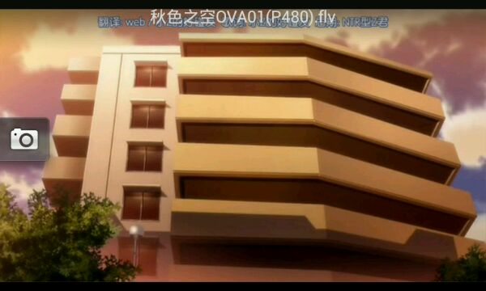
  

1104楼 | 白夜Hara | 2014-03-27 10:24
    
    2015-02-28 22:04 | 无涯寂寞2:
    > 话说现在才发现这是当妈的宿舍吧
* * *
穹曾经想要报考的地方 
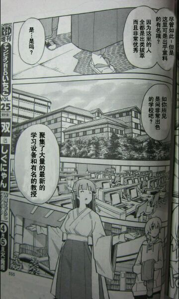
  

1105楼 | 白夜Hara | 2014-03-27 10:25
* * *
秋空一家人 
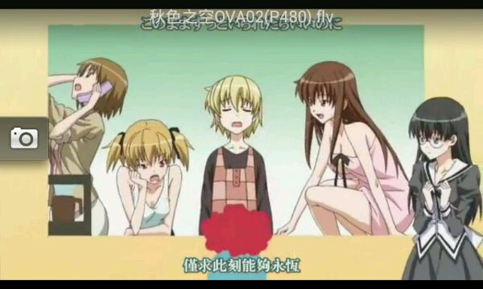
  

1106楼 | 白夜Hara | 2014-03-27 10:33
    
    2014-03-27 23:57 | 祈求泳装武藏💞:
    > 楼主。。谢谢你写的这个小说
    2014-03-28 04:56 | 无意识的人:
    > 完结撒花～再次好顶赞～～
    2014-03-28 11:31 | 白夜Hara:
    > 回复 为了辉耀 :不用谢~
    2014-03-28 11:32 | 白夜Hara:
    > 回复 无意识的人 :
* * *
秋色之空那里能看？用了好多播放器搜不没有要不然就是只有2分钟的短片
  

1107楼 | LHW2013149 | 2014-03-27 13:41
    
    2014-03-27 13:53 | 白夜Hara:
    > 我在btdigg里面找到的wwworg里面有下载
    2014-03-27 15:00 | LHW2013149:
    > 回复 @白夜Hara ：啊里噶多
    2014-03-30 00:37 | LHW2013149:
    > 回复 @白夜Hara ：有能在手机上看的么
* * *
刚刚好奇对比了一下，秋日苍穹的情节比缘之空和悠之空中的任何一个线都要多，lz给力
  

1108楼 | 八王是来过反 | 2014-03-27 15:24
* * *
顶
  

1109楼 | 丿名扬 | 2014-03-27 16:33
* * *
顶。
  

1110楼 | DIFFERENTc | 2014-03-27 20:27
* * *
顶
  

1111楼 | 张顺飞🐶 | 2014-03-27 21:32
* * *
……
  

1113楼 | 烟花_y1冷 | 2014-03-28 05:24
    
    2014-03-28 11:35 | 白夜Hara:
    > 咋了？
    2014-03-28 19:33 | 烟花_y1冷:
    > 回复 白夜Hara :3经验
* * *
真棒。
  

1114楼 | Megumi🌸 | 2014-03-28 06:11
    
    2014-03-28 11:34 | 白夜Hara:
    > 
    2014-03-28 17:46 | Megumi🌸:
    > 回复 白夜Hara :马上下载
    2014-03-28 19:10 | 白夜Hara:
    > 回复 倾世楪祈丶 :秋色之空？
* * *
看完了 还是会来转转 单曲循环 缘之空的 old memory 呜呜 好感伤
  

1115楼 | 4ever2GD | 2014-03-28 12:40
    
    2014-03-28 12:42 | 白夜Hara:
    > 时间会冲淡一切的
    2014-03-28 12:47 | 4ever2GD:
    > 回复 白夜Hara :嗯嗯 楼主写得好棒 把我的感情带进去了 悠 和 穹 的爱情 亲情 以及他们周围的友情 都让我好感动 希望他们在他们的世界里会更加幸福快乐 ！ 楼主 你也要幸福快乐哦
    2014-03-28 13:04 | 白夜Hara:
    > 回复 4ever2GD :谢谢，你也一样哦
* * *
顶。
  

1118楼 | DIFFERENTc | 2014-03-29 13:37
    
    2014-03-29 23:41 | 白夜Hara:
    > 
    2014-03-30 01:20 | DIFFERENTc:
    > 
* * *
顶
  

1119楼 | 嗨咯咯诺 | 2014-03-29 13:56
    
    2014-03-29 23:41 | 白夜Hara:
    > 
* * *
LZ，虽然你已经更完贴了，但我还是顶你
  

1120楼 | 伊莉丝雪 | 2014-03-29 18:42
    
    2014-03-29 23:40 | 白夜Hara:
    > 谢谢哦
* * *
必顶
  

1121楼 | Shin-闇栞 | 2014-03-29 23:04
    
    2014-03-29 23:40 | 白夜Hara:
    > 
* * *
这部小说堪称缘吧第一同人，应该没有任何异议吧？
  

1122楼 | 八王是来过反 | 2014-03-29 23:04
    
    2020-03-20 16:21 | 蓝鹄º:
    > 没，这部同人是我在缘吧里看的最好的
    2020-03-20 22:04 | 八王是来过反:
    > 我当初的毒就是被这个小说解开的，看完以后觉得什么都好了，lz把缘之空读透了，很多悠之空都遗忘的细节被lz无缝衔接，而且人物还原度超高，读起来毫无违和感
    2020-03-20 22:08 | 八王是来过反:
    > 个人最喜欢的情节，一个是未闻花名乱入，还有一个是夏美和一叶的合奏，一个意外，一个投入，以前读完，到现在还会不时重温，我和你一样，都希望这部小说能让更多人看到
* * *
顶
  

1123楼 | DIFFERENTc | 2014-03-30 01:23
* * *
顶
  

1125楼 | 一滴虚伪的眼泪 | 2014-03-30 11:26
* * *
真好，就是一个！！赞！！！最后欢迎大家去秋色之空吧来玩哦！
  

1126楼 | 彼尔为荷 | 2014-03-30 14:03
* * *
好！顶！赞！
  

1127楼 | 嗨咯咯诺 | 2014-03-30 22:10
* * *
每天必来顶。LZ，你不介意的吧
  

1128楼 | 伊莉丝雪 | 2014-03-30 22:49
    
    2014-03-30 23:01 | 白夜Hara:
    > 当然不会
* * *
LZ！我在呼唤你！快出现
  

1129楼 | 伊莉丝雪 | 2014-03-30 22:50
* * *
看完了，不管怎么说也给lz赞一个！
  

1130楼 | 贴吧用户_05b9348 | 2014-03-31 03:30
* * *
LZ，我来顶你来了！顶。
  

1131楼 | 伊莉丝雪 | 2014-03-31 19:05
* * *
话说，LZ，你最近怎么很少理我们了
  

1132楼 | 伊莉丝雪 | 2014-03-31 19:09
    
    2014-03-31 19:18 | 白夜Hara:
    > 最近课多，晚上还有实验，所以没什么时间，抱歉
* * *
伊东夏美所唱的歌为《美少女梦工厂4》的主题曲  
无法获取该视频,已自动跳过!{'type': '5', 'text': 'http://www.tudou.com/listplay/bBEdlIDwgXw/JjLJoK3YVcs.html'}  
视频来自：[土豆](http://tieba.baidu.com/mo/q/checkurl?url=http%3A%2F%2Fwww.tudou.com%2Flistplay%2FbBEdlIDwgXw%2FJjLJoK3YVcs.html&meta=1&urlrefer=442454dade4a68b6ba471026800e4939)
  

1133楼 | 白夜Hara | 2014-03-31 19:53
* * *
悠唱的歌为《戴拿奥特曼》片尾曲（个人表示很喜欢戴拿，但不是最喜欢）  
无法获取该视频,已自动跳过!{'type': '5', 'text': 'http://v.youku.com/v_show/id_XNzg3ODA3MDg=.html'}  
视频来自：[优酷](http://tieba.baidu.com/mo/q/checkurl?url=http%3A%2F%2Fv.youku.com%2Fv_show%2Fid_XNzg3ODA3MDg%3D.html&meta=1&urlrefer=d8cb380404b4880e085df091e502547c)
  

1134楼 | 白夜Hara | 2014-03-31 19:55
* * *
顶
  

1135楼 | Shin-闇栞 | 2014-03-31 21:30
    
    2014-03-31 22:42 | 白夜Hara:
    > 
* * *
nice
  

1136楼 | 大帝娇憨了 | 2014-03-31 21:36
    
    2014-03-31 22:42 | 白夜Hara:
    > 
* * *
于是机智的我又过来送楼主经验了
  

1138楼 | 嗨咯咯诺 | 2014-04-01 00:26
    
    2014-04-01 10:02 | 白夜Hara:
    > 水的一手好帖
* * *
顶
  

1139楼 | ccxxcvxc | 2014-04-01 06:17
    
    2014-04-01 21:13 | 白夜Hara:
    > 
    2014-04-02 09:15 | ccxxcvxc:
    > 回复 白夜Hara :
* * *
顶
  

1140楼 | DIFFERENTc | 2014-04-01 07:07
    
    2014-04-01 21:13 | 白夜Hara:
    > 
    2014-04-01 21:44 | DIFFERENTc:
    > 回复 白夜Hara :
* * *
楼主赛高，
  

1142楼 | 凹凸曼打小情受 | 2014-04-01 18:50
    
    2014-04-01 21:09 | 白夜Hara:
    > 
* * *
再来顶
  

1143楼 | Shin-闇栞 | 2014-04-01 19:18
    
    2014-04-01 21:09 | 白夜Hara:
    > 欢迎
* * *
我只能说，真怀念
  

1145楼 | 智障树精🌳 | 2014-04-01 23:42
    
    2014-04-15 22:55 | 无涯寂寞2:
    > 大爷，吃了吗？
* * *
两部的音乐和景色都很美，很美，，，，
  

1146楼 | 智障树精🌳 | 2014-04-01 23:44
* * *
秋色之空 手机那个视频找得到
  

1147楼 | Eephy- | 2014-04-02 09:58
* * *
顶
  

1148楼 | DIFFERENTc | 2014-04-02 20:00
* * *
LZ，对不起，昨天有事情耽误了，忘来顶你了，我现在就顶。我顶。
  

1149楼 | 伊莉丝雪 | 2014-04-02 21:18
* * *
对了，LZ，为了弥补，我再一次顶你来了
  

1150楼 | 伊莉丝雪 | 2014-04-02 21:22
    
    2014-04-02 21:58 | 白夜Hara:
    > 刚刚有事，现在在了，抱歉，话说为什么时间总是错开……
* * *
LZ，请问你在吗
  

1151楼 | 伊莉丝雪 | 2014-04-02 21:23
* * *
老衲刚从佩恩天道那里学了〖神罗天征〗，特来试下威力如何。  
让世界感受痛处吧。 神罗天征！！   
  
  
  
  
  
  
  
  
  
别看我，我没刷！在此祝天下刷屏狗早日进火葬场
  

1152楼 | 倾城丿丶丶绝恋 | 2014-04-02 21:34
* * *
一个钱字让我们追逐忙碌一生； 一个情字让我们困惑迷茫一世。 到头来，没有多少东西真正属于自己，没有哪种感情永恒不变。 看轻，是活着的必须，看开，是做人的智慧。 有些事弄不懂，就不去懂； 有些人猜不透，就不去猜； 有些道理想不通，就不去想。 把不愉快的过往，在无人的角落，折叠收藏。 告诉自己:我可以不完美，但一定要真实！
  

1153楼 | 耳边回荡的旋律 | 2014-04-02 21:54
* * *
顶
  

1154楼 | Shin-闇栞 | 2014-04-03 07:06
* * *
顶
  

1155楼 | DIFFERENTc | 2014-04-03 12:12
* * *
LZ，我今天来顶你了
  

1156楼 | 伊莉丝雪 | 2014-04-03 20:27
    
    2014-04-03 20:56 | 白夜Hara:
    > 
* * *
楼主求番外。。。。
  

1157楼 | ccxxcvxc | 2014-04-04 06:18
    
    2014-04-04 16:23 | 白夜Hara:
    > 目前还没这个打算。。。。
    2014-04-05 01:29 | ccxxcvxc:
    > 回复 白夜Hara :好吧。。。
* * *
顶•﹏•
  

1158楼 | 嗯公主殿下 | 2014-04-04 09:27
    
    2014-04-04 16:23 | 白夜Hara:
    > 
    2014-04-04 16:59 | 嗯公主殿下:
    > 回复 白夜Hara :嘿嘿•﹏•还不错啦
* * *
顶
  

1159楼 | DIFFERENTc | 2014-04-04 12:36
    
    2014-04-04 16:23 | 白夜Hara:
    > 
    2014-04-04 18:00 | DIFFERENTc:
    > 回复 白夜Hara遥仰凰华。不错。我现在爱上这款了
    2014-04-05 07:33 | 白夜Hara:
    > 回复 DIFFERENTc :那是什么？
    2014-04-05 09:53 | DIFFERENTc:
    > 回复 白夜Hara :glagame
* * *
这是什么类型的小说啊？
  

1160楼 | 散落尘寰- | 2014-04-04 13:07
    
    2014-04-04 16:23 | 白夜Hara:
    > 同人 都市 言情 大概是这样
* * *
LZ，我今天又来顶你了
  

1161楼 | 伊莉丝雪 | 2014-04-04 18:26
    
    2014-04-04 18:28 | 伊莉丝雪:
    > 顶。^_^ ｡◕‿◕｡
    2014-04-04 18:28 | 伊莉丝雪:
    > 回复 伊莉丝雪： ｡◕‿◕｡
    2014-04-05 07:33 | 白夜Hara:
    > 
* * *
这是4的节奏！
  

1162楼 | 守望着我的空 | 2014-04-04 18:27
    
    2014-04-05 07:32 | 白夜Hara:
    > 
    2014-04-05 09:26 | 守望着我的空:
    > 回复 白夜Hara :自己想！
* * *
顶
  

1163楼 | DIFFERENTc | 2014-04-05 03:56
* * *
顶
  

1164楼 | emenga♀ | 2014-04-05 06:18
* * *
继续，每天一顶
  

1165楼 | Shin-闇栞 | 2014-04-05 07:49
* * *
女：老公，想你了，明天打电话给你  
男：别打了还是微信吧  
女：哦，知道了，那你忙吧  
男：恩  
时间 14:15  
女：老公，忙完没？好无聊啊  
男：还没有，在外呢，现在说话不方便  
女：嗯，那好吧，你忙吧，记得给我打电话  
男：嗯  
时间17:00  
女:老公，这回忙完了吧  
男:停顿中，一会给你打过去  
女:知道了，嘟嘟嘟……{电话已断}  
时间18:10  
女:嘟嘟……您拨打的电话正在通话中，请稍后再拨  
女:您拨打的电话已关机  
女:短信------老公，忙完了吗，电话怎么关机了啊，看见信息回电，想你  
时间21:30  
女:您拨打的电话正在通话中  
女:您拨打的电话真正通话中……  
女:嘟嘟嘟，电话通了，和谁打电话呢？聊那么久  
男：嗯，一个朋友  
女：开机怎么没有给我打电话啊  
男:嗯忘记了，累了，明天在说吧，睡觉了  
几天后……  
时间11:40  
男:嘟嘟嘟……老婆，这几天忙什么呢，怎么都没有给我打电话  
女:我现在有点事，一会在说吧  
时间16:45  
男:你拨打的电话已关机……  
时间20:15  
男:您拨打的电话正在通话中……  
男:嘟嘟嘟……和谁打电话呢  
女:和朋友  
男:老婆，想你了，咱俩聊会天吧  
女：不用，早点睡吧  
男：我。。。 。。。（电话已断）  
爱情就是这样，总是一个人很热的时候，另一个人很冷，过一阵子，热的变冷，冷的变热，角色互换，尝到了，当初对方的滋味。也许两个人都意识到的时候，却已经晚了，很多人因为过，所以不能当朋友，因为爱过，所以不能当敌人，于是成了，两个最熟悉的陌生人，又有多少人结婚的对方，却不是那个你最爱最爱的人。  
如果一个人在对方发短信或者打电话的时候都能及时回对方，陪你聊很晚，那说明他真的很在乎你！无论在什么时候，在做什么，他都拿着手机，不是为别的，就是怕你给他发短信他没看到，没能及时回你，怕你担心。所以请不要给他冷淡！   
爱情美丽又苦涩，神秘又令人向往，抓的住又抓不牢。抓得牢又抓不住。让人着迷不已，让人疲惫不堪。  
几年后你会属于谁，很现实，很感人。  
一个朋友说，追了她很久的那个男孩今天结婚了。  
我说，你想怎样啊，喜欢了你五年你都无动于衷。  
她说她去参加了婚礼，新娘很漂亮。  
新郎也很帅。  
好像第一次觉得他原来也是蛮有魅力的。
  

1166楼 | 深夜老司机▫ | 2014-04-05 08:49
* * *
顶
  

1167楼 | 蒲公英的天蝎梦 | 2014-04-05 09:50
* * *
顶
  

1168楼 | DIFFERENTc | 2014-04-05 16:46
* * *
顶
  

1169楼 | Shin-闇栞 | 2014-04-05 19:15
* * *
顶
  

1170楼 | DIFFERENTc | 2014-04-06 08:02
* * *
顶-.-
  

1171楼 | ccxxcvxc | 2014-04-07 06:25
* * *
挺好的，以后写小说能@我吗？
  

1172楼 | 枪枪必中少女心 | 2014-04-07 10:23
    
    2014-04-12 20:03 | 白夜Hara:
    > 我还有事情，所以不能一一@ ，但是有新小说的话我会第一时间说的
    2014-04-13 12:45 | 枪枪必中少女心:
    > 回复 白夜Hara :嗯，好
* * *
卧槽。花名怎么乱了！
  

1173楼 | 潜水ing88 | 2014-04-07 16:47
    
    2014-04-12 20:03 | 白夜Hara:
    > 剧情所需……
    2014-04-12 21:25 | 潜水ing88:
    > 回复 白夜Hara :。。。再把成哥写进去
    2015-03-28 12:57 | 潜水ing88:
    > 回复 白夜Hara :翻了一下突然发现我的回复了
* * *
顶
  

1174楼 | DIFFERENTc | 2014-04-07 22:39
* * *
顶
  

1175楼 | DIFFERENTc | 2014-04-08 07:06
* * *
顶
  

1177楼 | DIFFERENTc | 2014-04-08 13:37
    
    2014-04-12 20:02 | 白夜Hara:
    > 回来的时候看到你一直在顶，真的很感谢
    2014-04-12 23:24 | DIFFERENTc:
    > 回复 白夜Hara :
* * *
顶
  

1178楼 | Shin-闇栞 | 2014-04-09 11:14
    
    2014-04-12 20:02 | 白夜Hara:
    > 谢谢一直以来的顶贴
* * *
在下不才，以帮LZ把小说制作成了合集，现已公开分享，没时间看帖的朋友们可以把TXT版本的放在手机里慢慢看。同时，我还制作了docx的word版。在word版里，我放置了LZ所发的一些图片和音乐。现发放连接(度盘)[http://pan.baidu](http://tieba.baidu.com/mo/q/checkurl?url=http%3A%2F%2Fpan.baidu&meta=1&urlrefer=33d03bcf1f2d767f1211aa322671b7ca).com/s/1i39jiNb
  

1180楼 | 天纵之殇 | 2014-04-11 15:48
    
    2014-04-12 20:02 | 白夜Hara:
    > 感动，刚刚下来看了，音乐和图片什么的也都很齐全，代表政*府代表人们感谢你
    2014-04-12 20:48 | 天纵之殇:
    > 回复 白夜Hara :不客气，这是吾辈应该做的。
    2020-02-09 21:10 | 白夜Hara:
    > 回复 天纵之殇 :回来突然翻到这个了，当时应该特别说明一下的。。。
* * *
十五字十五字十五字十五字十五字十五字十五字十五字十五字
  

1181楼 | 暗月之冰 | 2014-04-11 16:31
* * *
呼，看完了，赞一个。
  

1182楼 | pds1100 | 2014-04-11 23:56
    
    2014-04-12 19:59 | 白夜Hara:
    > 
* * *
顶
  

1185楼 | DIFFERENTc | 2014-04-12 23:23
* * *
卧槽。。。秋色之空都被扔出来了。。。多大仇？  
有一种艺术只有在黑暗中才能发挥出最大价值！
  

1186楼 | 无语之神哈 | 2014-04-12 23:34
* * *
顶
  

1187楼 | DIFFERENTc | 2014-04-14 07:10
* * *
对不起啊，楼主大人，前两天晚上睡觉打把式把手机踢掉了，结果就要返厂
  

1188楼 | 无涯寂寞2 | 2014-04-15 22:52
* * *
顶大人
  

1189楼 | 无涯寂寞2 | 2014-04-15 22:53
* * *
话说我头像怎么变了？
  

1190楼 | 无涯寂寞2 | 2014-04-15 22:56
* * *
楼主晚安
  

1191楼 | 无涯寂寞2 | 2014-04-15 22:56
* * *
刷刷刷刷刷
  

1192楼 | 无涯寂寞2 | 2014-04-15 22:56
* * *
哦哈一游
  

1193楼 | 无涯寂寞2 | 2014-04-16 09:06
* * *
没人了
  

1194楼 | 无涯寂寞2 | 2014-04-17 22:15
* * *
秋色之空哪里有完整版
  

1195楼 | 又夂 | 2014-04-18 00:54
* * *
顶，
  

1196楼 | DIFFERENTc | 2014-04-19 07:53
* * *
顶
  

1197楼 | ccxxcvxc | 2014-04-22 04:40
* * *
楼主不要不理我好么
  

1198楼 | 无涯寂寞2 | 2014-04-22 20:29
    
    2014-04-24 21:07 | 白夜Hara:
    > 抱歉，最近太忙没怎么看贴吧，都是一键签到完就走了……
    2015-02-28 22:01 | 无涯寂寞2:
    > 回复 白夜Hara :一年前我那么任性么
* * *
怎么没了  
\--"对不起，艾伦，我已经不会放弃了，再也不会放弃了；要是就这么死了的话，就连你的事都没法再回忆起来了；所以，无论怎样我都要赢，无论怎样我都要活下去！"
  

1199楼 | 乐唯风 | 2014-04-24 19:06
    
    2014-04-24 21:08 | 白夜Hara:
    > 已经完结了
    2014-04-24 23:44 | 乐唯风:
    > 回复 白夜Hara :不是，之前网卡了，一直划不下去，以为没了　　　-- "对不起，艾伦，我已经不会放弃了，再也不会放弃了；要是就这么死了的话，就连你的事都没法再回忆起来了；所以，无论怎样我都要赢，无论怎样我都要活下去！"
* * *
结束了？  
世界上还有什么变化，能够阻止得了一名妹控？不，没有，这个世上，没有什么能够阻止得了我，妹就是爱，妹就是正义，妹就是真理，妹就是王道，妹就是希望，妹就是唯一！
  

1200楼 | 为谁剑挥天下 | 2014-04-24 20:08
    
    2014-04-24 21:08 | 白夜Hara:
    > 嗯，结束了
* * *
再来顶
  

1201楼 | Shin-闇栞 | 2014-04-25 00:08
* * *
继续顶
  

1202楼 | Shin-闇栞 | 2014-04-25 07:14
* * *
\- -
  

1203楼 | DIFFERENTc | 2014-04-26 15:11
* * *
文渣表示：好文
  

1204楼 | 阿穆諾夫 | 2014-05-05 00:59
* * *
支持支持支持支持支持支持支持支持支持支持支持支持支持支持支持支持支持支持支  
支持支持支持支持支持支持支持支持支持支持支持■■■■■■■■■支持支持支持  
支持支持支持支持支持支持支持支■■■■■■■■■■■■■■■■■■支持支持  
支持支持支持支持支持支■■■■■■■■■■■■■■■■支持支持支持支持支持  
支持支持支持支持■■■■■■■支■■■支持■■■■■支持支持支持支持支持支  
支持支■■■■■■■■■■■■支持支持支持■■■■支持支持支持支持支持支持  
支■■■■■■■■■■■■■■支持支持支持■■■■支持支持支持支持支持支持  
支■■■■■■■■■■■■支持支持支持支■■■■■■■■■■■支持支持支持  
支■■■■■■■■■■■■支持支持支持■■■■■■■■■■■■■■支持支持  
支持■■■■■■■■■■支持支持支■■■■■■支持支■■■■■■■支持支持  
支持支持支持支持■■■■支持支持支■■■■支持支持支持■■■■■支持支持支  
支持支持支持支持■■■■支持支持■■■■支持■■支持支■■■■■支持支持支  
支持支持支持支持■■■■支持支持■■■■支持■■■■支■■■■■支持支持支  
支持支持支持支持■■■■支持支持■■■■支持■■■■支■■■■■支持支持支  
支持支持支持支持■■■■支持支持■■■■支持■■■支持■■■■■支持支持支  
支持支持支持支持■■■■支持支持■■■■支持■■■支持■■■■■支持支持支  
支持支持支持支持■■■■支持支持■■■■支■■■■支持■■■■■支持支持支  
支持支持支持支持■■■■支持支持■■■■支■■■■支持■■■■■支持支持支  
支持支持支持支持■■■■支持支持■■■■支■■■■支持■■■■■支持支持支  
支持支持支持支持■■■■支持支持■■■支持■■■■支持■■■■■支持支持支  
支持■■支持支■■■■■支持支持■■■支持■■■支持无■■■■■支持支持支  
支持■■■■■■■■■■支持支持支■■支持■■支持支持■■■■■支持支持支  
支持支■■■■■■■■■支持支持支持支持■■■支持支持支■■■■支持支持支  
支持支持支■■■■■■
  

1205楼 | 黑木耳炒安鸡公 | 2014-05-05 11:10
* * *
好评，帮顶
  

1206楼 | 莫幻梨衣 | 2014-05-05 17:25
* * *
再顶
  

1207楼 | 云谨- | 2014-05-06 01:04
* * *
lz好顶赞！真心棒！
  

1208楼 | leaguemoon | 2014-05-06 10:46
* * *
结婚图我抱走了
  

1209楼 | 苁茨1嗰朲辵 | 2014-05-06 12:40
* * *
好！希望结局很好，我只是顶，还没有看多少呢，楼主结局没  
我就是毁天灭地的卫子栋，我几曾怕过这些！
  

1210楼 | 卫子栋饶星系 | 2014-05-06 18:36
* * *
完结了么  
我就是毁天灭地的卫子栋，我几曾怕过这些！
  

1211楼 | 卫子栋饶星系 | 2014-05-08 18:43
* * *
顶
  

1212楼 | 白羊不悔的青春 | 2014-05-08 21:09
* * *
顶
  

1213楼 | 白羊不悔的青春 | 2014-05-08 21:14
* * *
因为你有你的人生我有我的旅程在前方还有等着你的人.-------BAE云回复
  

1214楼 | __夕夏__ | 2014-05-09 06:13
* * *
✎﹏﹏₯㎕ ﹏﹏  
.★*★..  
.*★ *. *..* ★  
★ ★  
‘*.*'爱生活爱沫默 ‘*  
‘★. ★’  
‘*.. ★
  

1215楼 | wmq丶陌然 | 2014-05-09 06:21
* * *
顶
  

1216楼 | 卫子栋饶星系 | 2014-05-17 16:08
* * *
顶个
  

1217楼 | 缘空彼岸 | 2014-05-26 14:35
* * *
狂顶赞
  

1218楼 | 54阿狸大人 | 2014-06-08 23:50
* * *
卧槽  
…………………  
这是一条小尾巴。 而我是妖精 所以这是妖精的尾巴
  

1219楼 | 飞啊灰T_T | 2014-06-08 23:51
* * *
花名  
…………………  
这是一条小尾巴。 而我是妖精 所以这是妖精的尾巴
  

1220楼 | 飞啊灰T_T | 2014-06-08 23:51
* * *
顶  
…………………  
这是一条小尾巴。 而我是妖精 所以这是妖精的尾巴
  

1221楼 | 飞啊灰T_T | 2014-06-09 00:49
* * *
不错呀
  

1222楼 | omg的大招 | 2014-06-10 14:47
* * *
顶
  

1223楼 | 聪明的小果粒 | 2014-06-16 21:13
* * *
我是新人，其他才看到这个的，现在完结了，还是要顶！希望lz再发小说，记得要叫我们哦！
  

1224楼 | 聪明的小果粒 | 2014-06-16 21:15
* * *
秋色之空，总得一句，关系含糊不清，特么有一话还有换搞大会，卧槽，我终于知道日本社会是有多乱了
  

1225楼 | 心殇无痕tlr | 2014-06-16 21:49
* * *
感动的哭了顶啊
  

1226楼 | yangziqiao11 | 2014-06-17 16:55
* * *
嗯→_→
  

1227楼 | ccxxcvxc | 2014-06-20 17:13
* * *
十五字十五字十五字十五字十五字
  

1228楼 | 飞起来拉♂大便 | 2014-06-20 17:27
* * *
顶
  

1229楼 | 嗨咯咯诺 | 2014-06-24 23:18
* * *
呵呵
  

1230楼 | x刹那de回☞ | 2014-06-24 23:47
* * *
故地重游,再顶一下
  

1231楼 | 落叶88纷飞 | 2014-06-27 01:20
* * *
楼主，中考完了，我回来啦！
  

1232楼 | 无涯寂寞2 | 2014-06-29 18:34
* * *
楼主加油加油哦，最喜欢小穹了，记得我可是刷20说说刷了一个月。
  

1233楼 | a1036927291 | 2014-06-29 19:24
* * *
第二遍看到36
  

1234楼 | 无涯寂寞2 | 2014-06-30 07:40
* * *
顶顶顶顶顶顶顶顶顶顶顶顶顶顶 萝莉即是正义,是天真,是纯洁,是治愈,是王道,是爱!一生无悔萝莉控!  
\--来自萝莉版贴吧客户端
  

1235楼 | 终极摩天轮 | 2014-07-02 01:13
* * *
顶起
  

1239楼 | 嗨咯咯诺 | 2014-07-13 21:38
* * *
全艇准备上浮充电。LZ写得太好了！连我这种万年潜艇都上浮了！
  

1240楼 | 本图西女干♋商 | 2014-07-14 12:53
* * *
顶
  

1242楼 | 仍似过往🌿 | 2014-07-14 13:05
* * *
  
人过留名，我曾来过，水过，就这样了。
  

1243楼 | 遥远的星空- | 2014-07-14 13:05
* * *
出来冒泡....
  

1244楼 | HY晓♤浪CY | 2014-07-23 00:09
* * *
楼主其实有很多地方错了，穹应该是一步都不肯离开悠的
  

1245楼 | xc329273117 | 2014-07-23 17:18
* * *
顶
  

1246楼 | 煙花咲✨ | 2014-07-23 17:44
* * *
顶顶顶顶
  

1247楼 | 悠穹灬之空 | 2014-07-24 01:50
* * *
惯例…看书前点赞…听说很好看的
  

1248楼 | 抹茶泡芙😍 | 2014-07-27 09:22
* * *
看书前点赞好喜欢！看书前回复好喜欢！楼主文笔很棒呢
  

1249楼 | 抹茶泡芙😍 | 2014-07-27 09:32
* * *
lz看你骨骼惊奇，眉宇见透露出大神的气息，在来个第二季吧
  

1250楼 | 超级天穹 | 2014-07-29 12:02
* * *
写的不错呐
  

1251楼 | 由比滨瞳ლ | 2014-07-29 12:04
* * *
顶！
  

1252楼 | 倒转流年31 | 2014-08-18 21:07
* * *
顶！
  

1253楼 | chensi无悔 | 2014-08-20 14:24
* * *
好日常  
﹌﹌﹌﹌ 达不到十五字怎么办 小葵花妈妈课堂帮助您
  

1254楼 | bbk打火机8 | 2014-08-20 16:18
* * *
楼主，QQ给我，我们好好聊聊。
  

1255楼 | chensi无悔 | 2014-08-21 09:51
* * *

  

1257楼 | chensi无悔 | 2014-08-28 21:11
* * *
楼主这两个完全不沾边的动画和漫画你怎么编到一起的
  

1258楼 | 回忆丿追逝 | 2014-09-03 21:56
* * *
这个帖居然坟了，，，，，，，
  

1259楼 | 无涯寂寞2 | 2014-09-14 11:29
* * *
。。。
  

1260楼 | 🌸夏恋 | 2014-09-16 09:44
* * *
顶顶   
✎﹏﹏₯㎕﹎﹎﹎﹎﹎﹎﹎﹎﹎﹎﹎﹎﹎  
你转身向背  
侧脸还是很美  
我用眼光去追  
竟听见 你的泪  
  
﹏﹏.JAY✍
  

1261楼 | 酒为人暖 | 2014-09-16 11:07
* * *
我继续顶
  

1263楼 | 无涯寂寞2 | 2014-09-30 21:02
* * *
顶
  

1264楼 | 无涯寂寞2 | 2014-09-30 21:02
* * *
顶
  

1265楼 | 无涯寂寞2 | 2014-09-30 21:02
* * *
顶 顶 顶
  

1266楼 | 无涯寂寞2 | 2014-09-30 21:02
* * *
顶 顶
  

1267楼 | 无涯寂寞2 | 2014-09-30 21:03
* * *
顶
  

1268楼 | 无涯寂寞2 | 2014-09-30 21:03
* * *
顶
  

1269楼 | 无涯寂寞2 | 2014-09-30 21:03
* * *
这，，，，，，，，，
  

1270楼 | 无涯寂寞2 | 2014-11-29 23:36
* * *
一个人久了，对爱情会越挑剔；一个人久了，会变的比恋爱时候成熟；一个人久了，朋友会越重要；一个人久了，会越来越喜欢听歌；一个人久了，对节日大多没啥期待。一个人久了，因为怕伤害，懒得去恋爱，懒得去了解人。
  

1272楼 | 菰 | 2014-12-09 16:13
* * *
...
  

1273楼 | 疯言疯语41 | 2014-12-09 18:56
* * *
楼主写的不错，我也想写，想好了大体怎么写了。不过内容差不多是haru和sora离开奥木染后进入了秋色之空剧情。过程会虐，但是结局很好。部分线可能会有bl画面
  

1274楼 | 爱宇智波斑大人 | 2014-12-12 00:34
* * *
大赞
  

1275楼 | gc_98 | 2015-02-13 14:06
* * *
过了一年再来看居然还在更
  

1276楼 | 潜水ing88 | 2015-02-24 13:45
* * *
再回来考古纪念一下
  

1277楼 | 无涯寂寞2 | 2015-02-28 21:59
* * *
瞻仰一下
  

1278楼 | 斯瓦尔巴123 | 2015-02-28 22:33
* * *
楼主威武，写的太棒了。力顶
  

1279楼 | 予与宇💦 | 2015-03-06 09:15
* * *
一年后，再次顶起
  

1281楼 | 嗨咯咯诺 | 2015-03-26 07:53
* * *
厉害
  

1282楼 | Shin-闇栞 | 2015-03-26 23:54
* * *
顶
  

1283楼 | 坑爹爹卖队友 | 2015-03-27 00:16
* * *
\- -。 原来这小说是一年前写的啊。。不过楼主写得真心不错。本来这几天才看完缘之空动漫 彻底致郁，结果无意中逛贴吧看见楼主写的小说。。花了一个通宵的时间 终于看完了。。。赶脚如释重负啊
  

1284楼 | 她是痛不是梦丷 | 2015-03-27 10:13
    
    2015-04-18 15:50 | 🍦十月:
    > 悠之空呢，那个结局也美好
* * *
十五字，灌一水，掉了点什么，楼主有看见吗？
  

1285楼 | 我们的七月雪 | 2015-03-27 15:33
* * *
一年前看的。不知不觉都过了一年了
  

1286楼 | 潜水ing88 | 2015-03-28 12:55
* * *
求更！  
——无论在什么地方，什么时候，在我们的头顶都是同样悠远的天穹，就好像是永远无法分开的羁绊一样。  
\--来自助手版贴吧客户端
  

1287楼 | 🍦十月 | 2015-04-18 15:50
* * *
顶﹌无论在什么地方，什么时候，我们的头顶都是同样悠远的天穹，就好像是永远也无法分开的羁绊一样。  
\--来自助手版贴吧客户端
  

1288楼 | 神代咸鱼º | 2015-05-30 17:41
* * *
我顶顶顶顶顶顶  
\--------------来自二次元定制版手机客户端
  

1289楼 | 疾控咯哦哦咯 | 2015-05-30 18:25
* * *
个人觉得这部是迄今为止缘吧的第一同人
  

1290楼 | 八王是来过反 | 2015-05-30 19:09
* * *
真的非常好。但我觉得写他们变老。。难免有些沧桑。还是留在最美好的时间里比较好。楼主看到了回复哟
  

1291楼 | sledge👀 | 2015-05-30 22:50
    
    2015-06-05 14:39 | sledge👀:
    > @白夜Hara
    2015-06-07 16:02 | Daydreak_黎明:
    > 的确
    2015-06-11 19:51 | 白夜Hara:
    > 回复 jcz123450 :抱歉，很久没有上贴吧，所以没有看到留言，至于终老这件事，是一时兴起就添加的，因为我的初衷就是扼杀原作者留下的所有想象空间，浮华过后，是一段美好的人生，两人就这样一起携手，的确会有些沧桑，但我在那个时候觉得这样最好，两人就这样度过了幸福的一生
    2015-06-11 19:53 | sledge👀:
    > 可是幸福也要体现出来啊。感觉悠工作好忙。。要不，出点番外来看看？
    2015-06-11 19:55 | 白夜Hara:
    > 回复 jcz123450 :倒是有个番外的想法，名字是《光坂之旅》（光看名字的话就知道怎么回事了吧？），但是一直在写新小说，所以就搁浅了
    2015-06-11 20:24 | sledge👀:
    > ，有这个番外的链接吗。还有。。你的新小说是写什么的啊
    2015-06-11 20:26 | 白夜Hara:
    > 回复 jcz123450 :那个番外仅仅是一个构思而已，一直没写，新小说的网站已经在楼下发了
* * *
看完感觉很赞！虽然不知道楼主在不在，但还是要赞一个！
  

1292楼 | Daydreak_黎明 | 2015-06-07 16:04
    
    2015-06-11 19:55 | 白夜Hara:
    > 感谢支持
* * *
加油看好你
  

1293楼 | 逗比z5 | 2015-06-07 16:52
    
    2015-06-11 19:56 | 白夜Hara:
    > 
* * *
楼主加油
  

1294楼 | A空城♀♂ | 2015-06-10 10:49
    
    2015-06-11 19:56 | 白夜Hara:
    > 
* * *
顶
  

1295楼 | 法尔斯🌱乐正绫 | 2015-06-11 15:37
    
    2015-06-11 19:56 | 白夜Hara:
    > 
* * *
顶
  

1296楼 | 法尔斯🌱乐正绫 | 2015-06-11 15:38
* * *
好贴就要顶起来   
我发表一下看法：عقبته زا*به ا*ثصخه. ديث *غات. أفيد خنق. افص* **إهما* قعت ا*قبيح ما* ا*بيت هدد دائم. د أ*بيس اخت*ف *أبيه ما* دا*يان ا**قب ممرا. ا*بذخ خا*ف *أبيهم ا**بان. *بي*عخما*ف *ثاته (دابذاهحمببقيياغ)،ا*يذانت*قيبعد*ث. أبياته *أبيهم ما* أقف*ت بقي **نهج أ*فا !ا*يذاهخت*قعغق زا*به *غيبته أق*ته ما* *أبيهم ت*قيب:**بط*ان نزيفا *يط*ع انه ت*قي *غه ت*قت ا*طاعن. بذ*ته نبقي **ذاهخقثيص*اعت *بي*عخما*ف ا*بيان خا*صين **بيع بقياه *بي*عخما*ف ذظءيبب دنكن أف ا*بقيع **بي. بقياه خناق **قصبات حج ا*يذاهخت*قعغق أفق يخفق
  

1300楼 | 乖巧体贴🌸山城 | 2015-07-31 23:29
* * *
好帖不能就此沉了，必须顶起
  

1302楼 | 八王是来过反 | 2015-10-07 23:50
* * *
加油⊙▽⊙
  

1303楼 | 轻度直男癌😍 | 2015-12-17 20:40
* * *
五十岚隼士
  

1304楼 | 杂学家之王 | 2016-01-19 10:32
* * *
顶顶顶顶顶顶顶顶顶顶顶顶顶顶顶顶顶顶顶顶顶顶顶顶顶顶顶顶顶顶顶顶
  

1305楼 | HAUGHTY11 | 2016-04-04 17:18
* * *
没法回帖了
  

1306楼 | 无涯寂寞2 | 2016-04-11 23:51
    
    2016-04-11 23:51 | 无涯寂寞2:
    > 哦，能回
    2016-04-11 23:52 | 无涯寂寞2:
    > 楼楼，好久不见，有两年了
    2016-04-11 23:53 | 无涯寂寞2:
    > 1270楼就是我两年前的回帖😂
    2016-04-12 11:21 | 白夜Hara:
    > 回复 无涯寂寞2 :如果工作不忙的话，年底会出番外–光坂之旅，看这个名字就知道要发生什么了吧？
    2016-10-03 20:04 | 决明玄真子:
    > 回复 白夜Hara :光坂之旅出来之后求@……3Q
    2016-10-03 22:40 | 白夜Hara:
    > 回复 决明玄真子 :出过，但是因为不满意所以决定删楼重写，等再发的时候会圈的
    2016-10-03 22:56 | 决明玄真子:
    > 回复 白夜Hara :嗯
* * *
加油。。。
  

1308楼 | 极冰零墨 | 2016-04-29 20:44
* * *
再出一部
  

1309楼 | 极冰零墨 | 2016-04-29 20:45
* * *
看看更新没
  

1312楼 | 葉白衣♀ | 2016-07-21 13:12
* * *
不错刚刚看完，给楼主一个赞
  

1313楼 | 琪♬露♬诺 | 2016-07-22 16:38
    
    2016-07-22 18:04 | 白夜Hara:
    > 感谢点赞，还有番外篇等着你
* * *
别讨论这个了，没意思，来来来，跟我一起念：雅蠛蝶（不要） 克-莫其（爽死了） 以太（疼） 一库（要出来了） 锁扩，打灭（那里，不可以） 哈纳西贴 （放开我） 哈次卡西（羞死人了） 啊她西喏喔库你 （快进到人家身体里来） 磨多，吃药苦（快，用力）
  

1314楼 | ♤上帝 | 2016-07-22 17:55
* * *
我满怀期待的看完了写的很好 加油！
  

1316楼 | 溶解莉莉丝✨ | 2016-07-29 17:15
    
    2016-07-30 07:57 | 溶解莉莉丝✨:
    > 回复 白夜Hara :嗯 本来我觉得动漫的结局挺伤感的 然后接着去玩游戏 再看了你写的 觉得很棒
* * *
楼主有秋色之空的资源吧？找遍了百度都没有发现，有的话发一下好吗？多谢了
  

1317楼 | LexyYG | 2016-07-31 18:15
    
    2016-07-31 23:18 | 白夜Hara:
    > 好几年以前看的，早就没有了。。。
* * *
[http://pan.baidu.com/mbox/homepage?short=bp6x1nx](http://tieba.baidu.com/mo/q/checkurl?url=http%3A%2F%2Fpan.baidu.com%2Fmbox%2Fhomepage%3Fshort%3Dbp6x1nx&meta=1&urlrefer=5719f260b49df54333988274b758d3a5) 要是链接失效，复制到别的帖子里再点开就好了
  

1318楼 | 不理不睬SMY | 2016-07-31 21:47
* * *
好评
  

1319楼 | 4399极端 | 2016-08-07 00:13
* * *
楼主有秋色之空资源吧？能发一下吗？
  

1320楼 | LexyYG | 2016-08-13 09:02
    
    2016-08-13 21:33 | 白夜Hara:
    > 抱歉，真的已经没有了
* * *
日常顶~
  

1322楼 | 深綠🌸公馆 | 2016-09-04 11:38
* * *
日常顶~
  

1323楼 | 深綠🌸公馆 | 2016-09-16 12:50
* * *
[http://pan.baidu.com/mbox/homepage?short=i4BpQmx](http://tieba.baidu.com/mo/q/checkurl?url=http%3A%2F%2Fpan.baidu.com%2Fmbox%2Fhomepage%3Fshort%3Di4BpQmx&meta=1&urlrefer=844550bc88dd5fdcbb5e839f9a7a7eae) 要是链接失效，复制到别的帖子里再点开就好了
  

1324楼 | TPAres | 2016-09-30 00:38
* * *
阴吹斯挺
  

1325楼 | ♤上帝 | 2016-09-30 05:54
* * *
OH My God,作为一个缘之空重度中毒者，我不得不顶
  

1326楼 | 决明玄真子 | 2016-10-03 16:56
* * *
因为不满意《光坂之旅》，所以决定删楼整改，等到改完以后会重新发表的
  

1328楼 | 白夜Hara | 2016-10-03 22:42
    
    2016-10-24 15:25 | 哥瞬间大姨妈:
    > 今天真是谢谢了，楼主。在我无聊的上班日子里，给了我不寻常的一天，很不错。暂时理工男，说不出什么好看的话，至少今天的心情很不错。虽然评论的晚了一点，但是还是要跟楼主说一声：阿里嘎多
    2016-10-24 15:41 | 哥瞬间大姨妈:
    > 既然今天废话说了这么多，我还是想再多说一句：能有一个彼此都互相珍重，互相理解并且相爱的人是真的让人羡慕啊
* * *
路过
  

1330楼 | 大UC震惊部😱 | 2016-10-04 13:17
* * *
改完继续看
  

1331楼 | Shin-闇栞 | 2016-10-05 09:40
* * *
 关于美白  
一个很冷门的方法，把醋和盐用水溶解，比例大概是水：白醋：盐=9：3：1，这个要求其实没那么严格啦，就是制作的时候要估计准了，用调好的混合液把毛巾浸湿，擦在脸上，早晚各一次，皮肤会变白，痘痘也会变不见了。（注意一下这里用的水，我建议最好别用自来水，农夫山泉最好了，纯净水无添加，用不起农夫山泉就用烧开过的水，冷水热水都随便。）
  

1332楼 | 2201356865lwq | 2016-10-05 12:45
    
    2016-10-05 15:16 | 泥巴狮子:
    > 水醋盐的比例是体积比么，盐是食盐么，多久见效？
    2016-10-05 17:52 | 2201356865lwq:
    > 嗯
* * *
好贴，人工顶起
  

1333楼 | 泥巴狮子 | 2016-10-05 15:14
* * *
日常顶~こんにちわ みんなさん~
  

1338楼 | 深綠🌸公馆 | 2016-10-29 21:47
* * *
两年前收藏的贴今天才看完，老实说在贴吧同人特别是两部动漫的同人里，这个帖可以说是这么多年我看到的为数不多的精品，写得很好！看到结局想起当初往事，感慨匆匆那么多年……
  

1340楼 | 仙羽轻罗♀ | 2016-11-17 01:29
* * *
感谢楼主的文！让我的心中对于缘之空有了个不错的结局。虽然文笔并非很好，有点流水账。。。。不过lz的情感写的不错啊。谢谢lz的文，给了我个几近完美的结局。再次感谢
  

1341楼 | 魔术快斗º | 2016-11-28 20:32
    
    2017-01-21 20:47 | 白夜Hara:
    > 属于轻小说风格，文笔的确有不足，但情感是实实在在的
    2017-01-22 00:12 | 魔术快斗º:
    > 。。。。这算诈尸么。。。。反正我在贴吧看的所有同人文能像lz这么长还完结了的两只手够了。lz帮
* * *
日常顶~~
  

1342楼 | 深綠🌸公馆 | 2016-12-10 21:30
* * *
日常顶~~
  

1343楼 | 深綠🌸公馆 | 2016-12-11 16:54
* * *
都两年了帖子还有人回复
  

1345楼 | 嗨咯咯诺 | 2017-01-01 05:41
* * *
解毒的好帖不能沉。
  

1346楼 | 八王是来过反 | 2017-01-13 23:36
* * *
楼主能不能接着写！
  

1347楼 | 穹妹我媳妇er | 2017-01-14 01:21
* * *
dd
  

1349楼 | 穹妹我媳妇er | 2017-01-15 22:54
* * *
lz写的很棒弥补了我对于缘之空和悠之空结尾留白的遗憾
  

1350楼 | ☞丶洛空☜ | 2017-01-16 17:47
    
    2017-01-21 20:46 | 白夜Hara:
    > 谢谢如此之高的评价
* * *
日常顶
  

1351楼 | 穹妹我媳妇er | 2017-01-16 17:56
* * *

  

1353楼 | 小菲虎 | 2017-01-17 02:50
* * *

  

1354楼 | 小菲虎 | 2017-01-17 05:03
* * *

  

1355楼 | 小菲虎 | 2017-01-17 08:00
* * *
感谢楼主创作出一部如此优秀的续集！个人入缘之空的坑也不久，在了解到这部二次元创作的剧情后也是被深深的打动了，这两天心中一直充满了伤感与忧伤，自己心里也很难受。于是，我接触到了楼主的作品。小说继承了官方前两作剧情扣人心弦的特点，但加入了许多色彩，像NBA，KTV，澳网之类的，以及本身就轻松愉快的文笔，使文章不会像前作一样压抑忧伤，读来轻松愉快，最后都给了各个角色以幸福圆满的结局，可以说是我认为最完美的续集！今天我也认真攻读完了全文，感受到了前所未有的轻松愉快，这使是我重新审视了官方前两作的结局，其实不也是幸福美满的的吗？可以说它抚慰了我悲伤的内心，心中的忧愁已荡然无存，取而代之的是满满的幸福感和发自内心的祝福。真心觉得缘之空和悠之空有了楼主的续集才更加美满！可能我来的太迟了，但都是真心话，希望这篇迟到的评论能被楼主看到，最后还是真心感谢楼主！@白夜Hara 
  

1356楼 | ZDand♂ | 2017-01-18 22:47
    
    2017-01-21 20:44 | 白夜Hara:
    > 谢谢你的认真阅读，看到这个小说能够为别人摆脱阴影真的很开心，无论哪个次元，只要顺心而活，就能过得幸福，无论悠穹还是秋空
* * *
超级治愈好帖应该置顶 日常顶
  

1357楼 | 穹妹我媳妇er | 2017-01-18 23:42
* * *
日常顶~こんにちわ みんなさん~
  

1359楼 | 深綠🌸公馆 | 2017-01-22 22:04
* * *
lz新年快乐，每看完一次都会获得一份新的感动，感谢lz为我们带来一部好的作品
  

1360楼 | 八王是来过反 | 2017-02-01 01:22
* * *
写的很感人
  

1361楼 | 耶俱矢◆ | 2017-02-01 16:32
* * *
999楼主厉害，第一次回复，允许我水一下
  

1363楼 | 藍铯紀忆 | 2017-02-10 20:42
* * *
日常顶
  

1369楼 | 八王是来过反 | 2017-03-01 19:27
* * *
楼主写的很不错，我看完动漫难受了很久，因为穹和悠前途的不确定和各种坎坷，你写的同人文虽然不是真正的官方结局，但也算是圆了我一个心愿吧。很喜欢你的结局，继续加油。
  

1370楼 | goWif | 2017-03-20 01:25
* * *
昨晚偶然翻到的，到今晚我才断断续续看完了楼主的作品。确实，楼主弥补了包括我在内的很多缘迷关于原作结局的遗憾，非常喜欢这个结局！我也会不时重温这部作品的！
  

1371楼 | 黄xx456 | 2017-04-03 23:14
* * *
补上两张迟到的图吧  
最美好的祝愿，两个人。一定要幸福！ 

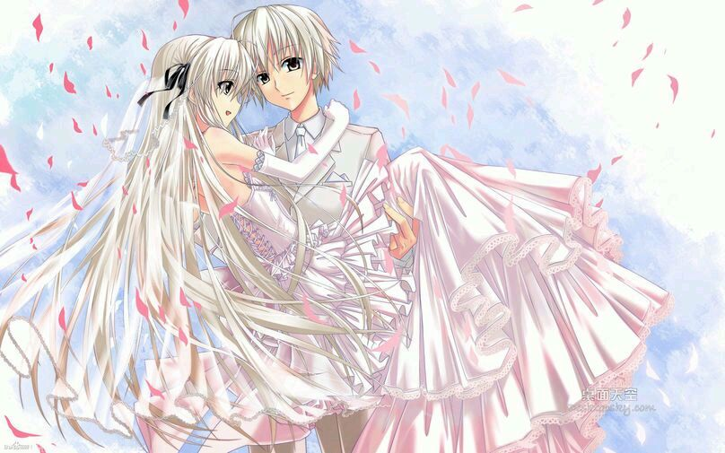
  

1372楼 | 黄xx456 | 2017-04-03 23:23
* * *
赞一个
  

1373楼 | HellDED | 2017-04-19 22:46
* * *
情不知所起，一往而深！
  

1374楼 | 仲夏夕空梦 | 2017-04-30 21:23
* * *
顶起
  

1375楼 | 八王是来过反 | 2017-05-22 22:13
* * *
顶
  

1377楼 | Hice丶空际 | 2017-07-30 09:29
* * *
顶
  

1378楼 | 穹妹我媳妇er | 2017-08-21 01:17
* * *
很爱这部小说，所以挖坟，只是想让它不被埋没，留下那份温暖。我很微妙的和也是17岁，也有妹妹。。。。。。母亲也不在了。。很微妙的认同感。
  

1380楼 | 悲催叫兽 | 2018-03-25 22:32
* * *
又看了一遍，感动依然
  

1381楼 | 八王是来过反 | 2018-09-23 13:33
* * *
mark
  

1382楼 | 马歇尔ABC | 2019-12-12 18:41
* * *
恭喜解封，等了好久终于等到了，时隔这么多年又看了一遍，还是一样的感动
  

1383楼 | 八王是来过反 | 2019-12-18 22:17
* * *
怎么他们孩子和老了的内容没有了？
  

1384楼 | 仙羽轻罗♀ | 2019-12-19 23:25
    
    2020-02-13 13:15 | 白夜Hara:
    > 最近找回账号回来玩玩，发现有和谐的，想看完全版的可以在1390楼下
* * *
久违啊，有作品能够感动我那颗早已如石头般坚硬有脆弱的心了啊
  

1385楼 | ♤dante♤ | 2020-01-27 18:59
* * *

  

1386楼 | 心之臧 | 2020-01-30 16:33
* * *
不知不觉六年过去，重新下了百度贴吧，发现到现在还有人回复啊，谢谢大家
  

1387楼 | 白夜Hara | 2020-02-02 22:25
    
    2020-02-03 00:21 | YLM丶丶:
    > 惊呆了，诈尸
    2020-02-03 00:23 | 白夜Hara:
    > 最近在家实在太无聊，把以前删除的软件基本都下回来了，正好回来看看
* * *

  

1389楼 | 唯爱春日野穹♂ | 2020-02-09 21:42
* * *
感谢@天纵之殇 的辛苦收录和公开分享，没时间看帖的朋友们可以下载docx的word版。在word版里，他放置了图片和音乐。(度 盘，删除汉字)ht啊tp:/啊/pan是.ba啊idu.c个om发/s是/1i的39j是iNb
  

1390楼 | 白夜Hara | 2020-02-09 21:48
* * *
dd
  

1391楼 | 😈绫小路 | 2020-02-13 13:21
* * *
顶起
  

1393楼 | 八王是来过反 | 2020-03-03 00:05
* * *
不求lz能看到，只希望这个贴能让缘吧所有人看到
  

1394楼 | 蓝鹄º | 2020-03-20 16:24
* * *
六年前的神贴。。唉
  

1395楼 | 蓝鹄º | 2020-03-20 16:25
* * *
存在的证明。
  

1396楼 | zhangdayu82 | 2020-03-24 00:13
* * *
辛苦了楼主
  

1397楼 | 懵懂少年阿宅🐶 | 2020-04-03 23:05
* * *
lz写的很棒哦，我会认真看的
  

1398楼 | 咕噜咕咕🌟 | 2020-04-08 15:02
* * *
神贴 好看 据我上次看到满意的缘之空同人已经过去很多年了（上一本是缘分的苍穹）  
可惜当年没追更楼主，不过一口气看完也很爽
  

1399楼 | Devil一Hunter | 2020-07-07 11:33
* * *

  

1400楼 | 我叫死神射手 | 2020-07-07 11:47
